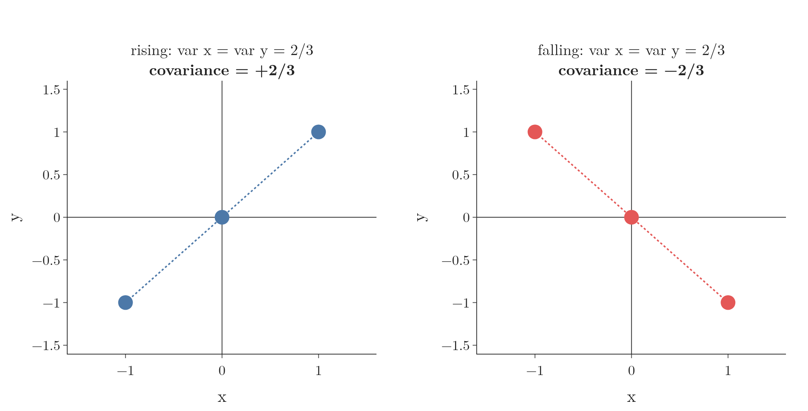
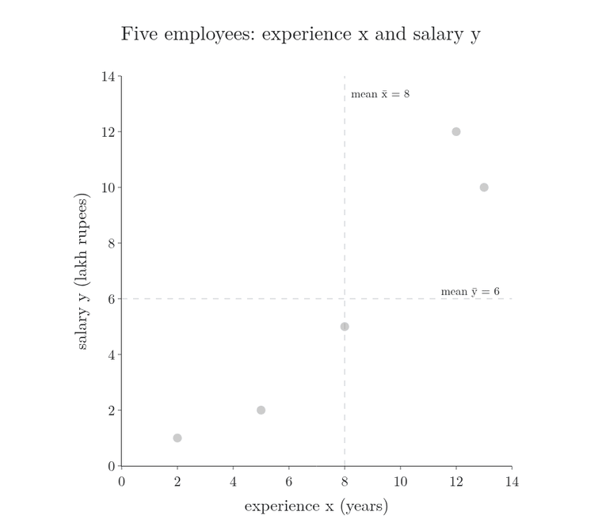
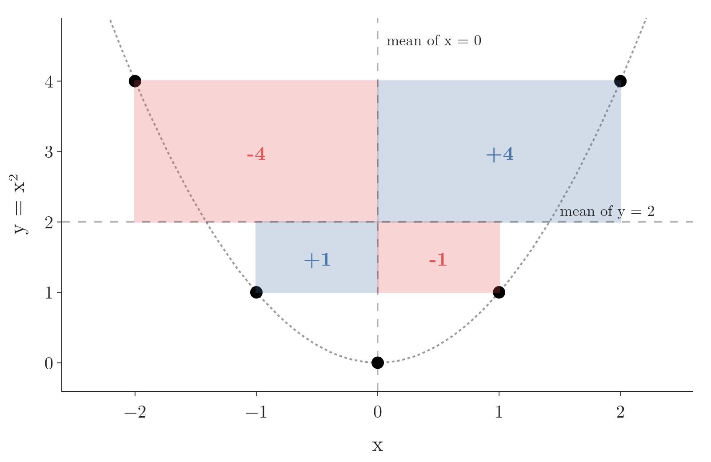
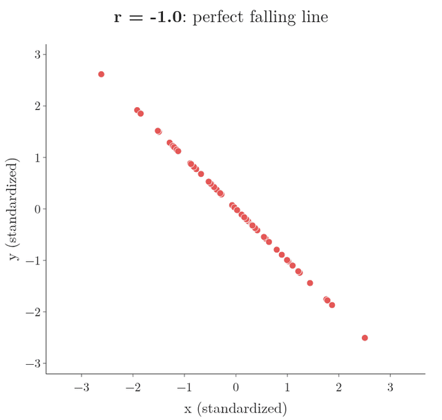

<!-- where-this-fits: generated by course_map/build_map.py; edit concepts.yaml, not this block -->
> **Where this fits:** Pipeline map step 3 (Understand data). See the [Course map](../01-course-map/note.md).
>
> 
>
> - **Builds on:** Descriptive statistics ([Note 19](../19-understanding-your-data/note.md)); Variance ([Note 19](../19-understanding-your-data/note.md)).
> - **Leads to:** Correlation significance test ([Note 570](../570-choosing-a-hypothesis-test/note.md)); Multivariate normal distribution ([Note 640](../640-gaussian-mixture-models/note.md)).
<!-- /where-this-fits -->

## 1. Overview

> **Key point:** Covariance gives the direction of the straight-line relationship between two numerical features; correlation divides it by the two standard deviations, which adds the strength and removes the effect of units.


A **feature** (G-772) is one variable of the data, one column of the table; an **observation** (G-1374) is one record, one row. A **scatter plot** (G-1749) shows by eye whether two numerical features rise together. Covariance and correlation turn that picture into a number. Figure 1 shows the idea behind both: the two mean lines cut the plot into four quadrants, and each point votes positive or negative depending on its quadrant.

## 2. From mean to variance to covariance

> **Key point:** The mean gives the centre, variance gives the spread of one feature, and covariance gives how two features move together.

Each measure fixes a blind spot of the one before:

- **Mean** (G-1203): gives the centre of a feature, but $-10, 0, 10$ and $-20, 0, 20$ have the same mean, 0.
- **Variance** (G-2074): gives the spread, and tells those two apart (see the [measures of dispersion Note](../222-measures-of-dispersion/note.md)). But it looks at one feature at a time.
- **Covariance** (G-496): the points $(-1, -1), (0, 0), (1, 1)$ rise from left to right, and $(-1, 1), (0, 0), (1, -1)$ fall. Their $x$ and $y$ variances are identical (2/3 each), as the [PCA step by step Note](../48-pca-step-by-step/note.md) (section 3.1) shows. Only a measure that uses both features together can tell them apart (Figure 2).



## 3. Covariance

> **Key point:** Covariance averages the product of each point's distances from the two means; positive means the features rise together, negative means one falls as the other rises, near zero means no straight-line relationship.

Covariance is taught in the [PCA step by step Note](../48-pca-step-by-step/note.md) (section 3.2): the average product of each point's distances from the two means, whose sign gives the direction of a linear relationship (see the [bivariate analysis Note](../21-bivariate-multivariate-analysis/note.md)). That Note divides by $N$, as for a whole **population** (G-1525); a **sample** (G-1731) divides by $n - 1$ instead.

$$\sigma_{xy} = \frac{1}{N}\sum_{i=1}^{N} (x_i - \mu_x)(y_i - \mu_y) \qquad\qquad s_{xy} = \frac{1}{n-1}\sum_{i=1}^{n} (x_i - \bar{x})(y_i - \bar{y})$$

The sample version divides by $n - 1$ for the same reason as the sample variance (see the [measures of dispersion Note](../222-measures-of-dispersion/note.md), section 6). For example, five employees (a sample) have experience $x$ = 2, 5, 8, 12, 13 years and monthly salary $y$ = 1, 2, 5, 12, 10 lakh rupees, with means $\bar{x} = 8$ and $\bar{y} = 6$.

| Employee | $x$ | $y$ | $x - \bar{x}$ | $y - \bar{y}$ | Product |
|---|---|---|---|---|---|
| 1 | 2 | 1 | $-6$ | $-5$ | 30 |
| 2 | 5 | 2 | $-3$ | $-4$ | 12 |
| 3 | 8 | 5 | 0 | $-1$ | 0 |
| 4 | 12 | 12 | 4 | 6 | 24 |
| 5 | 13 | 10 | 5 | 4 | 20 |
| **Sum** | | | | | **86** |

$$s_{xy} = \frac{86}{5 - 1} = 21.5$$

Figure 3 draws the same computation. Each employee's product is the area of a rectangle from the two mean lines to that employee's point. Watch the running sum grow as each rectangle is added.



- Employees 1 and 2 lie below and left of both means: two negative distances, a positive product (30 and 12).
- Employee 3 lies on the mean of $x$, so the rectangle has zero width and adds 0.
- Employees 4 and 5 lie above and right of both means: two positive distances, a positive product (24 and 20).

Every rectangle is positive, so the covariance is positive: more experience goes with a higher salary.

### 3.1 Reading covariance from the quadrants

> **Key point:** Points in quadrants I and III add to the covariance, points in II and IV subtract from it; whichever side holds more weight sets the sign.

The two mean lines split the scatter plot into four quadrants (Figure 1, left):

- **Quadrant I** (top right): both distances are positive, so the product is positive.
- **Quadrant III** (bottom left): both distances are negative, and negative times negative is positive.
- **Quadrants II and IV:** one distance is positive and one negative, so the product is negative.

So if most points lie in I and III, the covariance is positive; if most lie in II and IV, it is negative. If the points spread evenly over all four, the products cancel and the covariance is near 0. We can often guess the sign just by imagining the two mean lines on a scatter plot.

The right side of Figure 1 shows the opposite case. Five students have 2, 5, 8, 12 and 13 backlogs and packages of 10, 12, 5, 2 and 1 lakh rupees: more backlogs, lower package. With means 8 and 6, the products are $-24, -18, 0, -16, -25$, so

$$s_{xy} = \frac{-24 - 18 + 0 - 16 - 25}{4} = \frac{-83}{4} = -20.75$$

A third case: if every student got the same package of 10 lakh, whatever their backlogs, then $y - \bar{y} = 0$ for every point. Every product is 0, and the covariance is exactly 0: no linear relationship.

A fourth case is a common interview trap: a covariance of 0 does not mean "no relationship". Take $x = -2, -1, 0, 1, 2$ and $y = x^2 = 4, 1, 0, 1, 4$, with means 0 and 2. The products are $-4, +1, 0, -1, +4$ (Figure 4): each positive rectangle on one side is cancelled by an equal negative one on the other. So

$$s_{xy} = \frac{-4 + 1 + 0 - 1 + 4}{4} = 0$$

although $y$ is completely fixed by $x$. Covariance sees only a straight-line trend: zero covariance means no linear relationship, and a curved one can still be there.

{height=35%}

### 3.2 The flaw: covariance depends on the scale

> **Key point:** Multiplying a feature by a number multiplies the covariance by it too, so the size of a covariance says nothing about how strong the relationship is.

Covariance tells the direction of the **linear relationship** (G-1095), but not its **strength**: how closely the points follow a straight line. Its size depends on the units of the features.

1. **In words:** if every $x$ is multiplied by $a$ and every $y$ by $c$, every distance from the mean is multiplied too, so every product, and the covariance, is multiplied by $a \times c$.
2. **Formula:**
   $$\text{cov}(a\thinspace x,\ c\thinspace y) = a\thinspace c\ \text{cov}(x, y)$$
3. **Example:** measuring the employees' experience in months instead of years multiplies $x$ by 12:
   $$\text{cov} = 12 \times 21.5 = 258$$
   Measuring salary in rupees instead of lakhs multiplies the covariance by 100,000: $2{,}150{,}000$. The employees are the same; only the units changed.

Figure 5 shows the problem with 40 random points. The left panel plots a feature against itself, a perfect straight line, with covariance 1205. The middle panel plots $x$ against a noisier $y$, a weaker relationship, with covariance 939. The right panel doubles both features: the picture is identical to the middle one, yet the covariance jumps to 3757, larger than for the perfect line.


So a large covariance does not mean a strong relationship. Covariance is reliable only for its sign. Its main use is as the building block of correlation.

> **Extra:** The covariance of a feature with itself is its variance. With $y = x$ the formula becomes $\sum (x_i - \bar{x})(x_i - \bar{x}) / (n-1) = \sum (x_i - \bar{x})^2 / (n-1)$, the sample variance. The same fact explains why the covariance matrix of the [PCA step by step Note](../48-pca-step-by-step/note.md) has the variances on its diagonal, and why Figure 5's left panel shows the variance of $x$, 1205.

## 4. Correlation

> **Key point:** Correlation is covariance divided by the two standard deviations; it always lies between -1 and +1, gives both direction and strength, and does not change with the units.

The **Pearson correlation coefficient** $r$ (G-1474), or **correlation** (G-490) for short, appears in the [understanding your data Note](../19-understanding-your-data/note.md) (section 9.1). Here we build it from covariance, which shows why it fixes the scale problem.

1. **In words:** divide the covariance by the **standard deviation** (G-1871) of $x$ and by the standard deviation of $y$.
2. **Formula:**
   $$r = \frac{\text{cov}(x, y)}{s_x\thinspace s_y}$$
   For a population, $\rho = \sigma_{xy} / (\sigma_x \sigma_y)$. The $n - 1$ in the covariance and in the two standard deviations cancel, so both versions give the same number.
3. **Example:** for the five employees, $s_{xy} = 21.5$, $s_x = 4.637$ years and $s_y = 4.848$ lakh, so
   $$r = \frac{21.5}{4.637 \times 4.848} = \frac{21.5}{22.48} \approx 0.957$$
   For the backlogs data, $r = -20.75 / (4.637 \times 4.848) \approx -0.923$.

Both relationships are strong; one rises and one falls.

### 4.1 Reading a correlation

> **Key point:** The sign gives the direction and the distance from 0 gives the strength; +1 and -1 are perfect straight lines.

The scale of $r$, from $-1$ to $+1$, is read as in the [understanding your data Note](../19-understanding-your-data/note.md) (section 9.1): the sign gives the direction, and the closer $|r|$ is to 1, the closer the points lie to a straight line, so the stronger the relationship. Unlike covariance, which can be any number (1205, 3757, $-5000$), $r$ never leaves that range.

Strength has a practical meaning: prediction. When the points lie close to a line, knowing $x$ pins $y$ down to a narrow range; when they scatter widely, the same $x$ leaves a wide range of possible $y$ values.

In Figure 5, $x$ against itself gives $r = 1.00$. $x$ against $y$ gives $r = 0.65$: positive, but the points scatter around the line, so it is clearly below 1.

Figure 6 sweeps $r$ from $-1$ to $+1$ on the same 60 random points. Watch the cloud:

- at $r = -1$ and $r = +1$ every point lies on one straight line;
- as $|r|$ falls to 0.9, 0.6 and 0.3, the points spread further from the line;
- at $r = 0$ the cloud has no tilt at all.



> **Extra:** Rules of thumb put names on $r$. One common scale calls $|r|$ of 0.7 to 0.9 strong, 0.4 to 0.6 moderate and 0.1 to 0.3 weak (Akoglu 2018, Table 1). On this scale, the employees' $r = 0.957$ is strong and Figure 5's $r = 0.65$ is moderate.

### 4.2 Few points can fake a strong correlation

> **Key point:** A straight line passes through any two points, so two observations always give $r = +1$ or $-1$; a correlation is only as trustworthy as the amount of data behind it.

Take only the first two employees, $(2, 1)$ and $(5, 2)$. Their means are 3.5 and 1.5, so

$$s_{xy} = \frac{(-1.5)(-0.5) + (1.5)(0.5)}{1} = 1.5, \qquad s_x = 2.121, \quad s_y = 0.707, \qquad r = \frac{1.5}{2.121 \times 0.707} = 1$$

The result is $r = 1$, a "perfect" relationship, from two people. Any two points with different $x$ and different $y$ do the same, because one straight line always passes through both. With three or more points, landing on one line by chance becomes unlikely, and the more points there are, the more an observed $r$ can be trusted.

So $r$ answers "how strong is the relationship in this data?", not "how sure are we that it is real?". The second question needs the number of observations as well, and is answered by the correlation significance test in the [choosing a hypothesis test Note](../570-choosing-a-hypothesis-test/note.md).

### 4.3 Correlation does not depend on the scale

> **Key point:** Scaling a feature scales its standard deviation by the same amount, which cancels the change in the covariance.

In Figure 5, doubling both features quadrupled the covariance but left $r$ at 0.65. Scaling by positive numbers never changes the correlation.

> **Extra:** Proof that correlation ignores the units.
>
> 1. **In words:** multiplying $x$ by $a$ multiplies the covariance by $a$ and the standard deviation of $x$ by $a$ too, so the two cancel. The same holds for $y$. (Adding a constant changes nothing at all, since it moves the mean by the same amount.)
> 2. **Formula:** for $a, c > 0$,
>    $$r(a\thinspace x,\ c\thinspace y) = \frac{a\thinspace c\ \text{cov}(x, y)}{(a\thinspace s_x)(c\thinspace s_y)} = \frac{\text{cov}(x, y)}{s_x\thinspace s_y} = r(x, y)$$
>    If $a$ or $c$ is negative, the sign of $r$ flips but its size stays.
> 3. **Example:** experience in months: $\text{cov} = 258$ and $s_x = 12 \times 4.637 = 55.64$, so $r = 258 / (55.64 \times 4.848) \approx 0.957$, as before.

Because it gives both the direction and the strength, and does not depend on units, correlation is the measure we use to study the linear relationship between two numerical features, for example before linear regression. Covariance is still needed, as the step that computes it.

> **Python:** Covariance and correlation.
>
> ```python
> import numpy as np
>
> x = np.array([2, 5, 8, 12, 13])
> y = np.array([1, 2, 5, 12, 10])
> np.cov(x, y)[0, 1]        # 21.5 (divides by n - 1)
> np.corrcoef(x, y)[0, 1]   # 0.957
> ```
>
> Both return a 2 by 2 matrix; `[0, 1]` picks the value for the pair. In pandas, `df["a"].cov(df["b"])` and `df["a"].corr(df["b"])`. The Notebook (`notebook.ipynb`) reruns the scale experiment of Figure 5.

## 5. Correlation does not imply causation

> **Key point:** Two features can move together without one causing the other, often because a hidden third factor drives both.

**Causation** (G-359) is a cause-and-effect relationship: a change in one thing produces a change in the other. A correlation only says two things move together. The phrase "correlation does not imply causation" means that a correlation, however strong, is not evidence that one variable causes the other.

Two examples:

- **Firefighters and fire size.** At bigger fires, more firefighters are present: a strong positive correlation. Reading it as "more firefighters make bigger fires" is obviously wrong; the size of the fire decides how many firefighters are sent. Here the direction is clear, but in many datasets it is not.
- **Ice cream and drownings.** On days when more ice cream is sold, more people drown. Ice cream does not cause drowning. Hot weather drives both: when it is hotter, more people buy ice cream and more people go swimming (Figure 7). A third factor of this kind is what statisticians call a confounder (Freedman et al. 2007, ch. 2).


A hidden factor that drives two variables, like the weather here, is called a **confounding variable** (G-448), or confounder. Experience and salary are a subtler case: they are correlated, but the salary may come from skills that grow with experience, not from the years themselves.

Establishing causation needs more than data that happens to be collected: controlled experiments such as **randomised controlled trials** (G-1623), where a random half of the subjects gets a treatment and the other half does not, or carefully designed observational studies. Until then, a correlation is a hint worth investigating, not a conclusion.

## 6. Summary

| Measure | Formula | Range | Tells | Depends on units? |
|---|---|---|---|---|
| Covariance (sample) | $\sum (x_i - \bar{x})(y_i - \bar{y}) / (n-1)$ | any number | direction | yes |
| Correlation $r$ | $\text{cov}(x, y) / (s_x s_y)$ | $-1$ to $+1$ | direction and strength | no |

| Example | Covariance | $r$ |
|---|---|---|
| Experience vs salary | 21.5 | 0.957 |
| Backlogs vs package | $-20.75$ | $-0.923$ |
| Same package for everyone | 0 | undefined (no spread in $y$) |

- Points in quadrants I and III push the covariance up; II and IV push it down.
- $\text{cov}(a x, c y) = ac\thinspace\text{cov}(x, y)$, but $r$ stays the same.
- The covariance of a feature with itself is its variance.
- Zero covariance means no straight-line relationship; a curve such as $y = x^2$ can still be there.
- Two points always give $r = \pm 1$; trust $r$ only with enough data.
- Correlation does not imply causation; a confounding variable can drive both features.

## 7. Sources

**Built from**

- CampusX, "Session 39 - Descriptive Statistics Part 2 | DSMP 2023", YouTube, https://www.youtube.com/watch?v=1ndVC500-EU
- StatQuest with Josh Starmer, "Covariance, Clearly Explained!!!", YouTube, https://www.youtube.com/watch?v=qtaqvPAeEJY
- StatQuest with Josh Starmer, "Pearson's Correlation, Clearly Explained!!!", YouTube, https://www.youtube.com/watch?v=xZ_z8KWkhXE

**Other references**

- Akoglu, H. (2018). User's guide to correlation coefficients. *Turkish Journal of Emergency Medicine*, 18(3), 91-93. Table 1.
- Freedman, D., Pisani, R. and Purves, R. (2007). *Statistics*, 4th ed. W. W. Norton. Chapter 2, Observational Studies (association is not causation; confounding factors).

## 8. Key terms

| Term | Meaning |
|---|---|
| Feature | One variable of the data, one column of the table |
| Observation | One record, one row of the table |
| Population covariance ($\sigma_{xy}$) | Covariance of a whole population, dividing by $N$ |
| Sample covariance ($s_{xy}$) | Covariance of a sample, dividing by $n - 1$ |
| Strength of a relationship | How closely the points follow a straight line; measured by $\lvert r \rvert$ |
| Causation | A cause-and-effect relationship: changing one thing changes the other |
| Confounding variable | A hidden factor that drives two variables and makes them correlated |
| Randomised controlled trial | An experiment that assigns a treatment at random, to test causation |
