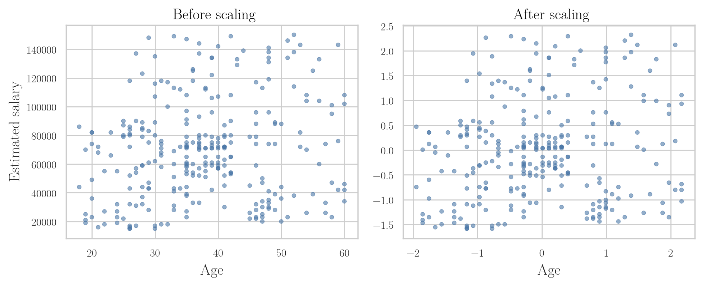
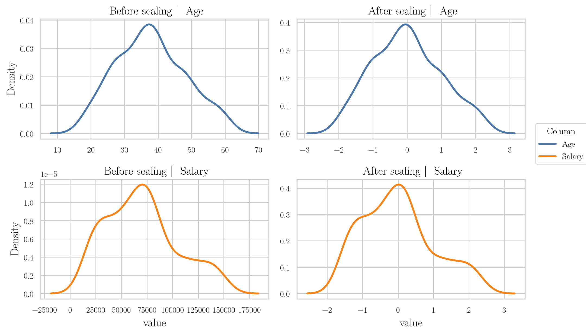
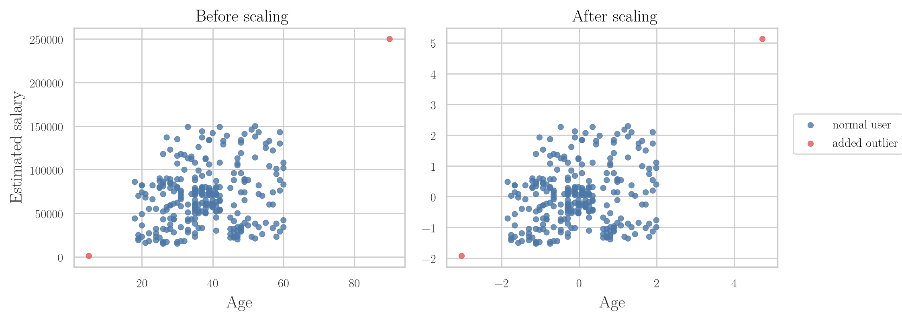

<!-- where-this-fits: generated by course_map/build_map.py; edit concepts.yaml, not this block -->
> **Where this fits:** Pipeline map step 5 (Engineer features). See the [Course map](../01-course-map/note.md).
>
> 
>
> - **Builds on:** Train-test split ([Note 13](../13-toy-project/note.md)); Descriptive statistics ([Note 19](../19-understanding-your-data/note.md)); Feature engineering ([Note 23](../23-what-is-feature-engineering/note.md)); Feature transformation ([Note 23](../23-what-is-feature-engineering/note.md)).
> - **Leads to:** Normalization ([Note 25](../25-normalization/note.md)); K-means ([Note 32](../32-binning-binarization/note.md)); Z-score outlier method ([Note 41](../41-what-are-outliers/note.md)); PCA ([Note 47](../47-pca-geometric-intuition/note.md)); Gradient descent ([Note 57](../57-gradient-descent/note.md)); Ridge regression ([Note 63](../63-ridge-regression-intuition/note.md)).
> - **Compare with:** Normalization ([Note 25](../25-normalization/note.md)); Decision trees ([Note 97](../97-decision-trees-intuition/note.md)).
<!-- /where-this-fits -->

## 1. Overview

> **Key point:** Standardization rescales every input column so that its mean is 0 and its standard deviation is 1: subtract the mean, then divide by the standard deviation.

Feature scaling brings input columns that live on very different ranges, such as age and salary, onto a similar range. It has two main techniques: standardization and normalization. This Note covers standardization; normalization comes in the next Note.

Figure 1 shows the whole topic. Standardization is two moves done one after the other: shift the column so its mean is 0, then shrink or stretch it so its standard deviation is 1.


## 2. Feature scaling, in brief

> **Key point:** Feature scaling brings the input columns to a similar range, so a column with big numbers does not drown out one with small numbers.

Feature scaling brings the input columns of a dataset into a similar range. The [toy project Note](../13-toy-project/note.md) (section "Scaling the inputs") shows why: algorithms such as KNN measure distances, so salary differences in thousands swamp age differences in tens. Two points are new here:

- Only the input columns are scaled, never the target.
- Scaling is usually the last step of feature engineering: we first handle missing values, transform columns and deal with categories, then scale just before giving the data to the model.

## 3. Types of feature scaling

> **Key point:** The two types of feature scaling are standardization and normalization.

There are two main types:

1. **Standardization**, the subject of this Note.
2. **Normalization**, which has several techniques of its own. The main one is **min-max scaling**; another is the **robust scaler**, which copes well with outliers. They are covered in the next Note.

Standardization is sometimes called **z-score normalization** in ML writing, because each scaled value is a **z-score**. The two names mean the same technique.

## 4. The standardization formula

> **Key point:** Each value is replaced by its distance from the column's mean, measured in standard deviations.

Take a column `age` holding the ages of 500 customers (and the data has a salary column too). To standardize `age`, we compute a new value for every row, one by one.

**Standardization**, step by step:

1. **In words:** from each value, subtract the mean of the whole column, then divide by the standard deviation of the whole column.
2. **Formula:** for the $i$-th value $x_i$ of a column with mean $\bar{x}$ and standard deviation $\sigma$,
   $$x_i' = \frac{x_i - \bar{x}}{\sigma}$$
3. **Example:** suppose the 500 ages have mean 32 and standard deviation 10. A customer aged 27 becomes
   $$x' = \frac{27 - 32}{10} = -0.5,$$
   and a customer aged 15 becomes
   $$x' = \frac{15 - 32}{10} = -1.7.$$

Doing this for all 500 rows gives a new column of 500 numbers, such as 2.3, -1.2 and -0.5. Each one says how many standard deviations the original value lay above (positive) or below (negative) the mean.

The new column always has two fixed properties, whatever the original numbers were:

- its **mean is 0**;
- its **standard deviation is 1**.

> **Extra:** Why the new mean is always 0 and the new standard deviation always 1. Subtracting $\bar{x}$ from every value moves the mean down by exactly $\bar{x}$, to 0, without changing the spread. Dividing every value by $\sigma$ divides the spread by $\sigma$ too, so the new standard deviation is $\sigma / \sigma = 1$.

## 5. What standardization does to the data

> **Key point:** Standardization first moves the cloud of points so its centre sits at the origin (mean centring), then squeezes or stretches each axis until its standard deviation is 1.

Plot every row as a point, with one column on each axis. The 500 customers form a cloud somewhere away from the origin, with some spread along each axis. Standardization moves this cloud in two steps (Figure 2):

1. **Mean centring:** subtracting the mean slides the whole cloud, unchanged, until its mean sits at the origin $(0, 0)$.
2. **Scaling by the standard deviation:** dividing by the standard deviation changes the spread along each axis to exactly 1.

{height=55%}

In Figure 2, the red cross marks the mean and the dashed box reaches one standard deviation either side of it. Feature 1 starts with standard deviation 2 and feature 2 with 0.6.

The second step works differently for the two axes:

- **Standard deviation above 1** (feature 1): dividing by it makes the values smaller, so the points **squeeze** in.
- **Standard deviation below 1** (feature 2, here 0.6): dividing by it makes the values bigger, so the points **spread out**.

At the end, both axes have mean 0 and standard deviation 1, and the dashed box is a square from -1 to 1.

## 6. Standardization in scikit-learn

> **Key point:** Split the data first, then let `StandardScaler` learn the mean and standard deviation from the training set and apply them to both sets.

### 6.1 The data

> **Key point:** 400 users of a social network, with age, estimated salary and whether they bought a product.

The data is the Social Network Ads file: 400 users of a social network, and whether each one bought a product shown in an advertisement. We keep three columns:

| Age | EstimatedSalary | Purchased |
|---|---|---|
| 19 | 19,000 | 0 |
| 35 | 20,000 | 0 |
| 26 | 43,000 | 0 |

`Age` and `EstimatedSalary` are the inputs; `Purchased` (1 = bought, 0 = did not) is the target. So this is a classification problem.

> **Python:** Loading the data and keeping three columns.
>
> ```python
> import pandas as pd
>
> df = pd.read_csv("data/Social_Network_Ads.csv")
> # drop User ID and Gender
> df = df.iloc[:, 2:]
> ```

### 6.2 Split before scaling

> **Key point:** Always do the train-test split before any feature scaling.

Whether we standardize or normalize, the train-test split comes first. The scaler should learn only from the training set, as the [toy project Note](../13-toy-project/note.md) explained under data leakage. With 30% of the rows held back for testing, the training set has 280 rows and the test set 120.

> **Python:** Splitting the data.
>
> ```python
> from sklearn.model_selection import train_test_split
>
> X_train, X_test, y_train, y_test = train_test_split(
>     df.drop(columns="Purchased"),   # inputs
>     df["Purchased"],                # target
>     test_size=0.3, random_state=0)
> # X_train: (280, 2), X_test: (120, 2)
> ```

### 6.3 Fit on the training set, transform both

> **Key point:** `fit` learns the mean and standard deviation of each column; `transform` applies the formula to every value.

scikit-learn's **`StandardScaler`** class does exactly what Section 4 described: it takes every value and applies $(x_i - \bar{x}) / \sigma$. Using it has two steps:

- **fit:** learn each column's mean and standard deviation from the training set, and store them.
- **transform:** apply the formula to every value, using the stored numbers.

We fit on the training set only, but transform both the training set and the test set. The test set is scaled with the training set's mean and standard deviation, never its own.

> **Python:** Standardizing with `StandardScaler`.
>
> ```python
> from sklearn.preprocessing import StandardScaler
>
> scaler = StandardScaler()
> # learn mean and std from the training set only
> scaler.fit(X_train)
> # apply them to both sets
> X_train_scaled = scaler.transform(X_train)
> X_test_scaled = scaler.transform(X_test)
>
> scaler.mean_    # [37.86, 69807.14]
> scaler.scale_   # [10.20, 34579.29]
> ```
>
> After `fit`, the learned numbers are stored in `mean_` (the means) and `scale_` (the standard deviations), one per column.

`transform` gives back a NumPy array, which has no column names and is harder to read. We turn it back into a DataFrame.

> **Python:** Putting the column names back.
>
> ```python
> X_train_scaled = pd.DataFrame(
>     X_train_scaled, columns=X_train.columns)
> X_test_scaled = pd.DataFrame(
>     X_test_scaled, columns=X_test.columns)
> ```

The same formula, worked on a real row:

1. **In words:** the first training row is a 26-year-old with a salary of 15,000 rupees. We subtract each column's training mean and divide by its training standard deviation.
2. **Formula:**
   $$x' = \frac{x - \text{mean}}{\text{std}}$$
3. **Example:** for the age and the salary,
   $$\frac{26 - 37.86}{10.20} \approx -1.16, \qquad \frac{15000 - 69807}{34579} \approx -1.58.$$
   These are exactly the numbers in the first row of `X_train_scaled`.

### 6.4 Checking the result with describe

> **Key point:** After scaling, both columns have mean 0 and standard deviation 1.

`describe()` before and after scaling shows the change (rounded to one decimal place):

| | Age before | Age after | Salary before | Salary after |
|---|---|---|---|---|
| mean | 37.9 | 0.0 | 69,807.1 | 0.0 |
| std | 10.2 | 1.0 | 34,641.2 | 1.0 |
| min | 18.0 | -1.9 | 15,000 | -1.6 |
| max | 60.0 | 2.2 | 150,000 | 2.3 |

Before scaling, the two columns live in completely different ranges. After scaling, both have mean 0 and standard deviation 1, and both run from about -2 to 2.

> **Extra:** `scaler.scale_` gives a salary standard deviation of 34,579, while `describe()` shows 34,641. pandas divides by $n - 1$ when computing the standard deviation, while `StandardScaler` divides by $n$. With 280 rows the gap is small, and the scaled column's std shows as 1.0 either way.

## 7. Effect of scaling on the data

> **Key point:** Scaling changes the numbers on the axes, not the shape of the data.

### 7.1 The scatter plot keeps its shape

> **Key point:** The cloud of points looks the same; only its centre and its units change.

Figure 3 plots every training user by age and salary, before and after scaling. The two clouds look the same: every point keeps its place relative to the others.



The difference is on the axes. Before scaling, age runs from about 20 to 60 and salary from 15,000 to 150,000. After scaling, both axes are centred on 0 and run from about -2 to 2: the data has been mean centred and given standard deviation 1.

### 7.2 The two columns become comparable

> **Key point:** Before scaling, the two density curves cannot be compared; after scaling, they sit on the same range.

Figure 4 draws the density curve (KDE) of both columns on one axis. Before scaling, age lives in a very small range (18 to 60), so its curve is a tall, thin spike near 0. Salary is spread over a huge range, so its curve is almost a flat line: its density is around 0.000003.


The two curves cannot be compared because their scales differ so much. After standardization, both curves sit on the same range, around 0. Any algorithm that compares the columns now treats them fairly, which gives better performance.

### 7.3 Each column keeps its shape

> **Key point:** Standardization does not change the shape of a column's distribution.

Figure 5 shows each column on its own. Age before scaling and age after scaling have exactly the same curve; so do salary before and after.



Only the numbers under the curve change: the mean becomes 0 and the standard deviation 1. If a column was skewed before, it is just as skewed after standardization.

## 8. Why scaling matters: an experiment

> **Key point:** On this data, logistic regression goes from 65.8% to 86.7% accuracy after scaling, while a decision tree gets 87.5% either way.

We train the same algorithm twice: once on the raw data, once on the standardized data. Then we compare the accuracy on the test set.

| Algorithm | Raw data | Standardized data |
|---|---|---|
| Logistic regression | 65.8% | 86.7% |
| Decision tree | 87.5% | 87.5% |

For **logistic regression**, scaling raised the accuracy from about 66% to about 87%. This one experiment shows why scaling matters for such algorithms.

For a **decision tree**, scaling made no difference at all. A decision tree does not depend on the scale of the columns, for reasons that become clear in the Notes on decision trees.

> **Python:** The experiment for logistic regression.
>
> ```python
> from sklearn.linear_model import LogisticRegression
> from sklearn.metrics import accuracy_score
>
> lr = LogisticRegression(solver="sag")
> lr_scaled = LogisticRegression(solver="sag")
> lr.fit(X_train, y_train)
> lr_scaled.fit(X_train_scaled, y_train)
>
> accuracy_score(y_test, lr.predict(X_test))
> # 0.658
> accuracy_score(y_test, lr_scaled.predict(X_test_scaled))
> # 0.867
> ```
>
> For the decision tree, replace `LogisticRegression(solver="sag")` with `DecisionTreeClassifier()` from `sklearn.tree`.

> **Extra:** Why `solver="sag"`? A **solver** is the method a model uses to find its best settings during training. `"sag"` takes many small downhill steps, like gradient descent (Section 10), and gives up after 100 steps; on the raw data it has not reached the best answer by then, which gives the 65.8%.
>
> The default solver, `"lbfgs"`, does reach it on the raw data too (87.5%), but needs 65 steps instead of 7. Either way, unscaled data makes the training harder.

Scaling never hurt either model. In general, standardizing does no harm, but for some algorithms it helps a lot.

## 9. Standardization and outliers

> **Key point:** Standardization does not remove outliers or reduce their effect; they stay just as far from the rest of the data.

The original data has ages from 18 to 60 and salaries from 15,000 to 150,000 rupees. To see what happens to outliers, we add three made-up users far outside these ranges:

| Age | EstimatedSalary | Purchased |
|---|---|---|
| 5 | 1,000 | 0 |
| 90 | 250,000 | 1 |
| 95 | 350,000 | 1 |

After adding them, we split, standardize and plot the data again. Two of the three land in the training set (the third went to the test set), and Figure 6 shows them in red.



After scaling, the outliers are still outliers. They sit just as far from the main cloud as before; only the numbers on the axes changed.

So whenever we standardize a column that has outliers, we must deal with the outliers separately. Later Notes cover how to detect and handle them.

> **Python:** Adding rows to a DataFrame.
>
> ```python
> extra = pd.DataFrame({
>     "Age": [5, 90, 95],
>     "EstimatedSalary": [1000, 250000, 350000],
>     "Purchased": [0, 1, 1]})
> df = pd.concat([df, extra], ignore_index=True)
> ```
>
> `pd.concat` joins tables one below the other; `ignore_index=True` renumbers the rows 0, 1, 2, ... Older code uses `df.append(...)`, which was removed in pandas 2.0.

## 10. When to use standardization

> **Key point:** Standardize for algorithms that measure distances or train by gradient descent; tree-based algorithms do not need it.

Standardizing rarely does harm, but for the algorithms below we should always do it.

**Algorithms that need scaling:**

- **K-means** and **KNN** (k-nearest neighbours): both compute the Euclidean distance between points. If one column's numbers are much bigger, it dominates the distance and the results are poor.
- **PCA** (principal component analysis): it looks for the directions in which the data spreads the most (the most variance). A column with big numbers looks like it has the most spread just because of its units, so the columns must be put on the same scale, and PCA also needs the data mean centred.
- **Gradient descent**, and every algorithm trained with it: linear regression, logistic regression and neural networks (deep learning).

Gradient descent (taught in the [gradient descent Note](../57-gradient-descent/note.md)) improves the weights by small downhill steps. When the columns are on very different scales, some weights take big jumps while others crawl, so it struggles to settle at the minimum; with scaled columns it converges much more easily.

**Algorithms that do not need scaling:**

- decision trees;
- random forest;
- gradient boosting;
- XGBoost.

These algorithms only compare values within one column, asking questions like "is age greater than 40?". They never compute a distance or add up different columns, so the scale of the columns does not matter. Scaling them does no harm, but makes no difference either.

> **Extra:** Why a tree does not care. Suppose a tree splits on "age > 40". After standardization, the same split becomes "scaled age > 0.21", which is $(40 - 37.86)/10.20$. Exactly the same users fall on each side, so the tree makes exactly the same predictions.

## 11. Summary

| | Before standardization | After standardization |
|---|---|---|
| Mean of each column | anything (age 37.9, salary 69,807) | 0 |
| Standard deviation | anything (age 10.2, salary 34,641) | 1 |
| Typical range | depends on the units | about -2 to 2 |
| Shape of the distribution | some shape | the same shape |
| Outliers | far from the rest | still far from the rest |

| Algorithm | Needs scaling? | Why |
|---|---|---|
| KNN, K-means | yes | Euclidean distance |
| PCA | yes | looks for the largest variance; needs mean centring |
| Linear regression, logistic regression, neural networks | yes | trained with gradient descent |
| Decision tree, random forest, gradient boosting, XGBoost | no | only compare values within one column |

- Feature scaling is usually the last step before the model, and only the inputs are scaled.
- Standardization: $x' = (x - \bar{x}) / \sigma$, giving mean 0 and standard deviation 1.
- Geometrically: mean centring, then squeezing or stretching each axis to standard deviation 1.
- Split first; fit the scaler on the training set only; transform both sets.
- Standardization keeps the shape of the data and does not remove outliers.
- On the ads data, logistic regression went from 65.8% to 86.7% accuracy; a decision tree stayed at 87.5%.

## 12. Key terms

| Term | Meaning |
|---|---|
| Standardization | Scaling a column by subtracting its mean and dividing by its standard deviation, so it gets mean 0 and std 1 |
| Z-score | A value after standardization: how many standard deviations it lies from the mean |
| Z-score normalization | Another name for standardization |
| Normalization | The other type of feature scaling, which squeezes values into a fixed range (next Note) |
| Min-max scaling | The main normalization technique |
| Robust scaler | A normalization technique that copes well with outliers |
| Mean centring | Subtracting the mean from every value, so the column's mean becomes 0 |
| StandardScaler | scikit-learn's class that standardizes columns with `fit` and `transform` |
| fit / transform | Learn the scaler's numbers from the training set / apply them to any data |
| Solver | The method a model uses to find its best settings during training |
| Gradient descent | Finding the lowest point of a function by repeated small steps downhill |
