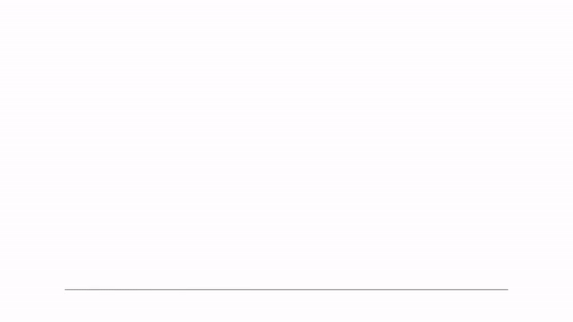
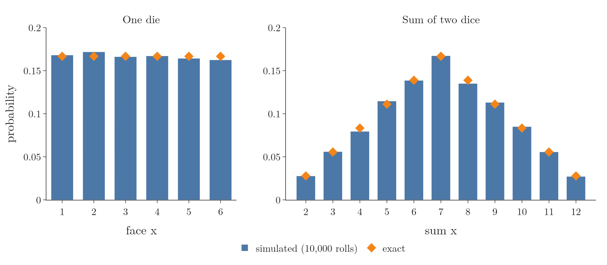
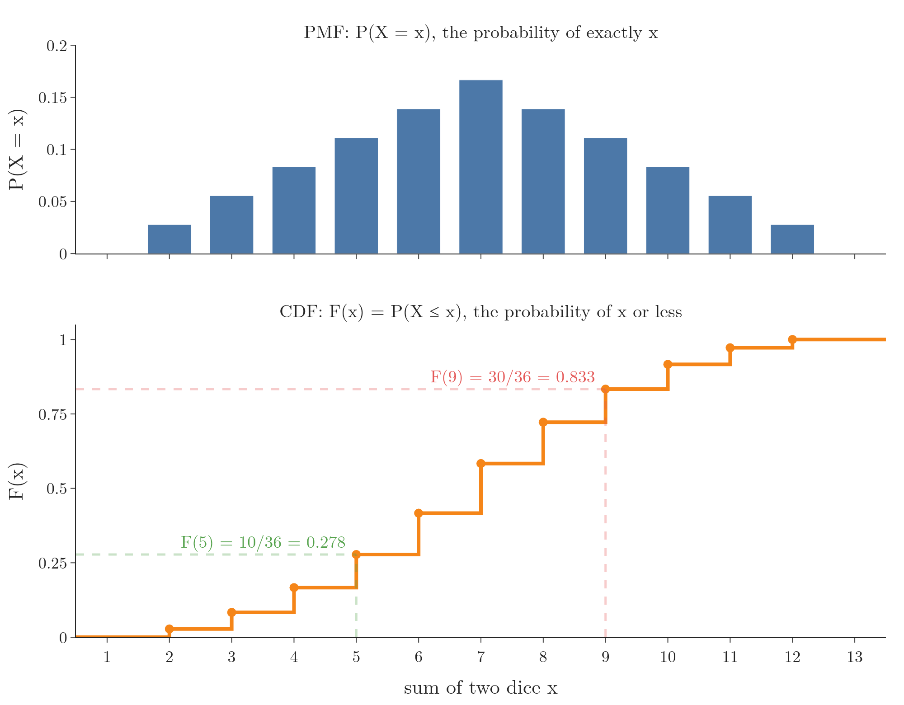

<!-- where-this-fits: generated by course_map/build_map.py; edit concepts.yaml, not this block -->
> **Where this fits:** Pipeline map steps 0 (Foundations), 3 (Understand data). See the [Course map](../01-course-map/note.md).
>
> 
>
> - **Builds on:** Probability density function (PDF) ([Note 90](../90-gaussian-naive-bayes/note.md)); Probability distributions ([Note 240](../240-random-variables-and-distributions/note.md)).
> - **Compare with:** Frequency tables ([Note 223](../223-frequency-tables-and-graphs/note.md)).
<!-- /where-this-fits -->

## 1. Overview

> **Key point:** The PMF gives the probability of each exact value of a discrete random variable; the CDF adds those probabilities up, giving the probability of a value at most $x$.

{height=45%}

Figure 1 shows the whole Note in one animation. The blue bars are the PMF of the sum of two dice: the probability of each exact sum. Stacking every bar up to $x$ gives the CDF: the probability of a sum of $x$ or less.

Random variables, distributions and the PMF/PDF/CDF family are introduced in the [random variables and distributions Note](../240-random-variables-and-distributions/note.md). Here we build the two functions for discrete variables: the PMF by formula and by simulation, then the CDF.

## 2. The probability mass function

> **Key point:** A PMF assigns a probability to each possible value of a discrete random variable; every probability is at least 0, and together they add up to 1.

The **probability mass function (PMF)** is the probability distribution function of a **discrete** random variable. It assigns a probability to each possible value:
$$p(x) = P(X = x)$$

It reads: "the probability that the random variable $X$ takes the value $x$". On a graph, the possible values go on the x axis and their probabilities on the y axis.

### 2.1 The two conditions

> **Key point:** No probability is negative, and the probabilities of all possible values sum to exactly 1.

Not every function can be a PMF. Its probabilities must satisfy two conditions:

1. **In words:** no probability is negative, and the probabilities of all possible values add up to 1, because one of them is certain to happen.
2. **Formula:**
   $$p(x) \ge 0 \text{ for every } x, \qquad \sum_{x} p(x) = 1$$
3. **Example:** for one die, every $p(x) = 1/6 \ge 0$, and
   $$\sum_{x=1}^{6} p(x) = 6 \times \frac{1}{6} = 1$$
   For the sum of two dice (the table in the [random variables and distributions Note](../240-random-variables-and-distributions/note.md), section 3.1):
   $$\frac{1 + 2 + 3 + 4 + 5 + 6 + 5 + 4 + 3 + 2 + 1}{36} = \frac{36}{36} = 1$$

## 3. The PMF of one die

> **Key point:** For a fair die the PMF is 1/6 at each face from 1 to 6 and 0 everywhere else.

A PMF written as a formula $y = f(x)$ must give a value for **every** $x$, including values the die cannot show. So it has two parts:
$$f(x) = \begin{cases} \dfrac{1}{6} & \text{if } x \in \{1, 2, 3, 4, 5, 6\} \\[6pt] 0 & \text{otherwise} \end{cases}$$

The formula says at once that every face is equally likely, and that 1.5 or 7 have probability 0. Its graph is six equal bars; a distribution in which every value is equally likely is called a **discrete uniform distribution**.

## 4. Estimating a PMF by simulation

> **Key point:** Repeat the experiment many times, count each outcome and divide by the number of trials; the shares approach the true PMF.

We can also find a PMF without any formula: run the experiment many times and count. The share of trials that gave each value is an estimate of its probability, the same idea as the relative frequency in the [frequency tables Note](../223-frequency-tables-and-graphs/note.md).

1. **In words:** the estimated probability of a value is the number of times it appeared divided by the number of trials.
2. **Formula:**
   $$\hat{p}(x) = \frac{\text{count of } x}{\text{number of trials}}$$
3. **Example:** in 10,000 simulated rolls of one die, the face 1 appeared 1,681 times:
   $$\hat{p}(1) = \frac{1681}{10000} = 0.1681$$
   The exact value is $1/6 \approx 0.1667$.

The hat on $\hat{p}$ marks an estimate. Figure 2 compares the simulated PMFs (bars) with the exact ones (diamonds), for one die and for the sum of two dice.



The estimates are close but not exact: the six faces came out between 0.1625 and 0.1718, around $1/6$. A random experiment never matches theory perfectly. For the sum of two dice, the simulated bars follow the same rise to 7 and fall after it as the exact values.

> **Python:** Simulating a die and estimating its PMF.
>
> ```python
> import numpy as np
> import pandas as pd
>
> rng = np.random.default_rng(42)       # fixed seed
> rolls = rng.integers(1, 7, size=10_000)
> # count each face, divide by the total
> pmf = pd.Series(rolls).value_counts(normalize=True)
> pmf = pmf.sort_index()
> pmf.plot(kind="bar")
> ```
>
> `integers(1, 7)` excludes the upper end, so it returns 1 to 6. `normalize=True` divides the counts by their total; without it we would divide by 10,000 ourselves. `sort_index()` puts face 1 first. For two dice, add two such arrays. The Notebook (`notebook.ipynb`) runs both experiments.

> **Extra:** The more trials, the closer the estimate gets to the true probability. This is the **law of large numbers**. With 100 rolls a face can easily come out at 0.12 or 0.22; with 10,000 rolls all six land within about 0.005 of $1/6$.

## 5. The PMF of the sum of two dice

> **Key point:** When the probabilities differ, the PMF formula lists each group of values with its own probability.

For the sum of two dice, the probabilities are not all equal (Figure 2, right). The formula pairs up values with the same probability:
$$f(x) = \begin{cases} 1/36 & \text{if } x \in \{2, 12\} \\ 2/36 & \text{if } x \in \{3, 11\} \\ 3/36 & \text{if } x \in \{4, 10\} \\ 4/36 & \text{if } x \in \{5, 9\} \\ 5/36 & \text{if } x \in \{6, 8\} \\ 6/36 & \text{if } x = 7 \\ 0 & \text{otherwise} \end{cases}$$

For harder experiments, counting the outcomes uses permutations and combinations instead of a grid.

> **Extra:** The seven cases fit into one line. The number of pairs falls by one for each step away from 7, so:
>
> 1. **In words:** start from 6 pairs at the sum 7 and subtract the distance from 7.
> 2. **Formula:** for $x = 2, \dots, 12$,
>    $$f(x) = \frac{6 - |x - 7|}{36}$$
> 3. **Example:** for $x = 9$, the distance from 7 is 2:
>    $$f(9) = \frac{6 - 2}{36} = \frac{4}{36} \approx 0.111$$

## 6. Two famous discrete distributions

> **Key point:** The Bernoulli PMF describes one yes/no trial; the binomial PMF counts the successes in $n$ such trials.

Many discrete experiments follow a famous PMF (see Figure 4 of the [random variables and distributions Note](../240-random-variables-and-distributions/note.md)). Two of them come up constantly, and each gets its own Note later.

### 6.1 Bernoulli distribution

> **Key point:** One trial with two outcomes: 1 with probability $p$, 0 with probability $1 - p$.

The **Bernoulli distribution** describes a single trial with two outcomes, success ($k = 1$) and failure ($k = 0$), such as one coin toss.

1. **In words:** success has probability $p$; failure has the rest, $q = 1 - p$.
2. **Formula:**
   $$P(X = k) = \begin{cases} p & \text{if } k = 1 \\ q = 1 - p & \text{if } k = 0 \end{cases}$$
3. **Example:** with $p = 0.3$, $P(X = 1) = 0.3$ and $P(X = 0) = 0.7$; they add up to 1.

The Bernoulli distribution has **one** parameter, $p$ (with $0 \le p \le 1$). The $q$ often listed beside it is not a second parameter: it is fixed by $p$ as $1 - p$.

### 6.2 Binomial distribution

> **Key point:** The number of successes in $n$ independent Bernoulli trials with the same $p$.

The binomial distribution (introduced in the [voting ensemble Note](../102-voting-ensemble/note.md)) counts the successes in $n$ independent trials, each with success probability $p$. Its parameters are $n$ and $p$.

1. **In words:** choose which $k$ of the $n$ trials succeed, then multiply the probabilities of $k$ successes and $n - k$ failures.
2. **Formula:**
   $$P(X = k) = \binom{n}{k}\, p^k\, (1 - p)^{n - k}$$
   where $\binom{n}{k}$, "$n$ choose $k$", is the number of ways to choose $k$ trials out of $n$.
3. **Example:** the probability of exactly 2 heads in 4 fair coin tosses ($n = 4$, $p = 0.5$). There are $\binom{4}{2} = 6$ ways to place the 2 heads:
   $$P(X = 2) = 6 \times 0.5^2 \times 0.5^2 = 6 \times 0.0625 = 0.375$$

## 7. The cumulative distribution function of a discrete variable

> **Key point:** The CDF $F(x)$ is the probability that the variable is at most $x$: the running total of the PMF up to $x$.

The **cumulative distribution function (CDF)** of a random variable $X$ gives the probability that $X$ takes a value **less than or equal to** $x$:
$$F(x) = P(X \le x)$$

The difference from the PMF is one symbol:

- **PMF at 4:** $P(X = 4)$, the probability of **exactly** 4.
- **CDF at 4:** $P(X \le 4)$, the probability of 4 **or less**: 1, 2, 3 or 4.

For a discrete variable, "4 or less" means adding the PMF of every value up to 4. That running total is why the function is called cumulative.

1. **In words:** add the probabilities of all possible values up to and including $x$.
2. **Formula:**
   $$F(x) = \sum_{t \le x} p(t)$$
3. **Example:** for one die,
   $$F(4) = p(1) + p(2) + p(3) + p(4) = \frac{1}{6} + \frac{1}{6} + \frac{1}{6} + \frac{1}{6} = \frac{4}{6} \approx 0.667$$
   The CDF of the die climbs $1/6, 2/6, 3/6, 4/6, 5/6, 6/6$: it starts above 0 and ends at exactly 1.

This is the cumulative relative frequency of the [frequency tables Note](../223-frequency-tables-and-graphs/note.md), with probabilities in place of relative frequencies.

### 7.1 Reading the CDF of two dice

> **Key point:** The CDF answers "what is the chance of $x$ or less?" in one reading: a sum of 9 or less has probability 30/36, about 0.83.

Adding up the two-dice PMF gives its CDF:

| Sum $x$ | $P(X = x)$ | $F(x) = P(X \le x)$ |
|---|---|---|
| 2 | 1/36 | 1/36 = 0.028 |
| 3 | 2/36 | 3/36 = 0.083 |
| 4 | 3/36 | 6/36 = 0.167 |
| 5 | 4/36 | 10/36 = 0.278 |
| 6 | 5/36 | 15/36 = 0.417 |
| 7 | 6/36 | 21/36 = 0.583 |
| 8 | 5/36 | 26/36 = 0.722 |
| 9 | 4/36 | 30/36 = 0.833 |
| 10 | 3/36 | 33/36 = 0.917 |
| 11 | 2/36 | 35/36 = 0.972 |
| 12 | 1/36 | 36/36 = 1 |

Figure 3 draws both functions on the same x axis. On the PMF we read the chance of exactly $x$; on the CDF, the chance of $x$ or less:

- $F(9) = 30/36 \approx 0.83$: a sum of 9 or less happens in about 83% of rolls.
- $F(5) = 10/36 \approx 0.28$: a sum of 5 or less, in about 28%.

{height=55%}

> **Python:** The CDF is the cumulative sum of the PMF.
>
> ```python
> cdf = pmf.cumsum()          # pandas
> cdf = np.cumsum(pmf)        # NumPy, same values
> ```
>
> The simulated CDF from the 10,000 rolls gives $F(9) = 0.832$, against the exact 0.833.

There is no separate name such as "cumulative mass function": the CDF is called the same for discrete and continuous variables.

> **Extra:** Three facts about every CDF, and two uses of them:
>
> - **It runs from 0 to 1 and never goes down.** Each step adds a probability, which is never negative.
> - **It is defined for every $x$, not only the possible values.** $F(7.5) = P(X \le 7.5) = P(X \le 7) = 21/36$, because no sum lies between 7 and 7.5. So the CDF of a discrete variable is a **step function**: flat between possible values, jumping up at each one by that value's probability (Figure 3, bottom). Drawing it as bars, one per value, shows only its values at the jumps.
> - **The PMF can be read back from the jumps:** the jump at 9 is $F(9) - F(8) = 30/36 - 26/36 = 4/36 = p(9)$.
> - **Probability of a range:** $P(a < X \le b) = F(b) - F(a)$. For a sum above 5 and at most 9:
>   $$P(5 < X \le 9) = \frac{30}{36} - \frac{10}{36} = \frac{20}{36} \approx 0.556$$
> - **Probability of more than $x$:** $P(X > x) = 1 - F(x)$. A sum above 9 has probability $1 - 30/36 = 6/36$.

## 8. Summary

| Function | Question it answers | One die | Two dice |
|---|---|---|---|
| PMF $p(x) = P(X = x)$ | chance of exactly $x$ | $p(4) = 1/6$ | $p(9) = 4/36$ |
| CDF $F(x) = P(X \le x)$ | chance of $x$ or less | $F(4) = 4/6$ | $F(9) = 30/36$ |
| Estimated PMF $\hat{p}(x)$ | share of trials giving $x$ | $\hat{p}(1) = 0.1681$ | $\hat{p}(7) = 0.1673$ |

- A PMF needs $p(x) \ge 0$ and $\sum p(x) = 1$.
- A PMF formula covers every $x$: it is 0 for impossible values.
- Simulating many trials and dividing counts by the number of trials estimates the PMF.
- Bernoulli: one trial, one parameter $p$. Binomial: successes in $n$ trials, parameters $n$ and $p$.
- The CDF is the running total of the PMF: a step function from 0 to 1.

## 9. Key terms

| Term | Meaning |
|---|---|
| $P(X = x)$ | The probability that the random variable $X$ takes the value $x$ |
| Discrete uniform distribution | A discrete distribution in which every possible value is equally likely, such as a fair die |
| Estimated PMF | Each value's share of many repeated trials, used as its probability |
| Law of large numbers | The more trials, the closer a share of trials gets to the true probability |
| Bernoulli distribution | One trial with two outcomes: 1 with probability $p$, 0 with probability $1 - p$ |
| $\binom{n}{k}$ ($n$ choose $k$) | The number of ways to choose $k$ items out of $n$ |
| Step function | A function that is flat between points and jumps at them, like the CDF of a discrete variable |
