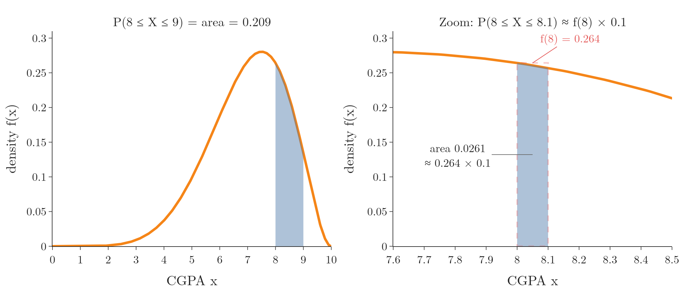

<!-- where-this-fits: generated by course_map/build_map.py; edit concepts.yaml, not this block -->
> **Where this fits:** Pipeline map steps 0 (Foundations), 3 (Understand data). See the [Course map](../01-course-map/note.md).
>
> 
>
> - **Builds on:** Probability distributions ([Note 240](../240-random-variables-and-distributions/note.md)); Probability mass function (PMF) ([Note 241](../241-pmf-and-discrete-cdf/note.md)).
> - **Leads to:** Density estimation ([Note 243](../243-density-estimation-kde/note.md)); Normal distribution ([Note 250](../250-normal-distribution/note.md)); Standard normal and the z-table ([Note 251](../251-standard-normal-and-z-table/note.md)); P-values ([Note 300](../300-p-values/note.md)).
> - **Compare with:** Frequency tables ([Note 223](../223-frequency-tables-and-graphs/note.md)); Bernoulli and binomial distributions ([Note 241](../241-pmf-and-discrete-cdf/note.md)); Pareto distribution and power laws ([Note 262](../262-pareto-and-power-law/note.md)).
<!-- /where-this-fits -->

## 1. Overview

> **Key point:** For a continuous random variable the probability of any single exact value is 0, so the PDF's height is a density, and probabilities are areas under it; the CDF is the area to the left of $x$.

{height=45%}

Figure 1 shows where the PDF comes from. We take 100,000 CGPAs and draw a density histogram, in which each bar's **area** is the share of students in its bin. As the bins get narrower, the bars hug a smooth curve: the probability density function.

We met this curve in the [univariate analysis Note](../20-univariate-analysis/note.md) (section 7) as the KDE drawn over a histogram, where we noted that its height is a density, not a probability. This Note explains why, shows how areas give probabilities, and builds the CDF of a continuous variable. How the curve is estimated from data is the topic of the [density estimation Note](../243-density-estimation-kde/note.md).

## 2. The probability density function

> **Key point:** A PDF is the probability distribution function of a continuous random variable; unlike a PMF, its y axis is probability density, not probability.

The probability density function (PDF) is a mathematical function that describes the probability distribution of a **continuous** random variable (see the [random variables and distributions Note](../240-random-variables-and-distributions/note.md)). Its graph is an unbroken curve (Figure 2, left).

The x axis works as before: it holds the values of the variable, for example CGPAs from 0 to 10, now with every decimal in between. The difference is the y axis. A PDF differs from a PMF in two ways:

| | PMF | PDF |
|---|---|---|
| Random variable | discrete | continuous |
| y axis | probability | probability density |
| Probability of a range | sum of the bar heights | area under the curve |

The density plot of the [univariate analysis Note](../20-univariate-analysis/note.md) (section 7) already met this: its curve's height is a density, and probability is the area under it.

The second row is the one to remember. On a PMF we read probabilities straight off the graph. On a PDF the height is a **probability density**, and the rest of this Note is about what that means.

## 3. Why the y axis cannot be probability

> **Key point:** A continuous variable has infinitely many possible values, so the probability of any one exact value is 0; probabilities only exist for ranges.

Pick one student and ask the probability that their CGPA is exactly 7.912. Between 0 and 10 there are infinitely many possible values: 7.912, 7.9121, 7.91201 and so on. Spreading a total probability of 1 over infinitely many values leaves 0 for each one:

$$P(X = 7.912) = 0$$

The same shows up in real data. Among 100 students, perhaps one has a CGPA of 7.912 to three decimals. Ask for 7.912959 and almost certainly nobody has it; the finer we ask, the closer the share gets to 0.

Shrinking a range shows it with numbers. For the CGPA curve of Figure 2, the probability of a CGPA between 8 and $8 + h$ falls to 0 as the width $h$ shrinks:

| Width $h$ | $P(8 \le X \le 8 + h)$ | $P(8 \le X \le 8 + h)\thinspace/\thinspace h$ |
|---|---|---|
| 1 | 0.2088 | 0.2088 |
| 0.1 | 0.0261 | 0.2607 |
| 0.01 | 0.00264 | 0.2639 |
| 0.001 | 0.000264 | 0.2642 |

So a graph of "probability at each $x$" would be flat at 0 everywhere and tell us nothing. The last column, however, settles on a number: 0.264. The settled value, 0.264, is the density at 8 (Section 5).

## 4. Area under the curve is probability

> **Key point:** The total area under a PDF is 1; the area between two values $a$ and $b$ is the probability that the variable falls between them.

The whole area under the CGPA curve stands for the probability that a student's CGPA is somewhere between 0 and 10. A CGPA somewhere in that range is certain, so the **total area under every PDF is 1**.

A slice of the area gives a smaller probability. The area between 8 and 9 is the probability of a CGPA between 8 and 9 (Figure 2, left). Since the curve is not a rectangle, the area is found by **integration**, which adds up the area of infinitely many infinitely thin strips under the curve.

1. **In words:** the probability that $X$ falls between $a$ and $b$ is the area under the PDF from $a$ to $b$.
2. **Formula:**
   $$P(a \le X \le b) = \int_a^b f(x)\thinspace dx$$
   The symbol $\int_a^b$ reads "the area from $a$ to $b$ under", and $dx$ marks $x$ as the variable along the horizontal axis.
3. **Example:** for the CGPA curve,
   $$P(8 \le X \le 9) = \int_8^9 f(x)\thinspace dx = 0.209$$
   About 21% of students have a CGPA between 8 and 9.



Because a single point has zero width, it has zero area. So for a continuous variable it makes no difference whether the ends are included: $P(8 \le X \le 9) = P(8 < X < 9)$.

> **Python:** The area from a known PDF, two ways.
>
> ```python
> from scipy import stats, integrate
>
> # CGPA curve used in this Note: 10 x Beta(7, 3)
> cgpa = stats.beta(7, 3, scale=10)
> # area by numerical integration
> integrate.quad(cgpa.pdf, 8, 9)[0]   # 0.2088
> # the same area from the CDF (Section 7)
> cgpa.cdf(9) - cgpa.cdf(8)           # 0.2088
> ```
>
> The curve is a scaled beta distribution, chosen because it lives exactly on 0 to 10; any smooth curve with area 1 would do.

## 5. What the density at a point means

> **Key point:** The density at $x$ is the probability per unit of $x$ near $x$: over a narrow width $h$, the probability is about $f(x) \times h$.

The density $f(x)$ is what probability turns into when we divide by the width of a narrow range (the last column of the table in Section 3). Turned around, a thin strip under the curve is almost a rectangle of height $f(x)$ and width $h$ (Figure 2, right).

1. **In words:** the probability of landing in a narrow range is about the density times the width of the range.
2. **Formula:**
   $$P(x \le X \le x + h) \approx f(x) \times h \qquad \text{for small } h$$
3. **Example:** the density at 8 is $f(8) = 0.264$. For the range 8 to 8.01:
   $$P(8 \le X \le 8.01) \approx 0.264 \times 0.01 = 0.00264$$
   The exact area is 0.002639; the smaller $h$, the better the match.

So for practical purposes a higher curve still means "more likely around here", and we can compare densities at two points the way we compare probabilities. Strictly, though, the height is never a probability itself.

The density histogram of Figure 1 rests on the same idea. A density bar has height "share of the data in the bin divided by the bin width", so its area is the share. As the bins narrow, those heights become $f(x)$.

> **Extra:** Because a density is probability **per unit**, it can be larger than 1 (see the [Gaussian Naive Bayes Note](../90-gaussian-naive-bayes/note.md)). A uniform distribution on 0 to 0.5 has height 2 everywhere: width 0.5 times height 2 gives the required area of 1. A probability can never exceed 1; a density can.

## 6. Famous PDFs

> **Key point:** The normal and log-normal distributions are famous continuous distributions with known PDF formulas; Poisson, often listed with them, is discrete.

The famous continuous distributions of the [random variables and distributions Note](../240-random-variables-and-distributions/note.md) (Figure 4) each have a PDF formula:

- **Normal distribution:** parameters $\mu$ (mean, location) and $\sigma$ (standard deviation, scale). Much natural data follows it. Its PDF, worked through in the [Gaussian Naive Bayes Note](../90-gaussian-naive-bayes/note.md), is
  $$f(x) = \frac{1}{\sigma\sqrt{2\pi}}\thinspace e^{-\frac{1}{2}\left(\frac{x-\mu}{\sigma}\right)^2}$$
- **Log-normal distribution:** looks like a normal curve pushed to the left, with a long right tail. Its parameters are also $\mu$ and $\sigma$, those of the logarithm of the variable (SciPy `lognorm` docs).

The **Poisson distribution** (parameter $\lambda$) is often listed beside them, but it counts events (0, 1, 2, ...), so it is discrete and has a PMF, not a PDF. SciPy, for example, gives `poisson` a `pmf` and no `pdf`. Each of these distributions gets its own Note later.

## 7. The CDF of a continuous variable

> **Key point:** The CDF $F(x) = P(X \le x)$ is the area under the PDF to the left of $x$; it rises smoothly from 0 to 1.

The CDF has the same definition as for a discrete variable (see the [PMF and discrete CDF Note](../241-pmf-and-discrete-cdf/note.md)): the probability of a value at most $x$. For a continuous variable, "at most $x$" is the area under the PDF from the far left up to $x$.

1. **In words:** the CDF at $x$ is the whole area under the PDF to the left of $x$.
2. **Formula:**
   $$F(x) = P(X \le x) = \int_{-\infty}^{x} f(t)\thinspace dt$$
   The letter $t$ runs along the axis up to $x$; $-\infty$ means "from the far left".
3. **Example:** adult heights in a group follow a normal distribution with mean 165 cm and standard deviation 10 cm. Half the area lies left of the mean, so $F(165) = 0.5$: half the people are 165 cm or shorter. The area left of 150 is $F(150) = 0.067$: about 7% are 150 cm or shorter.

Figure 3 puts the two functions one above the other. The same point means different things on each:

- **On the PDF at 165:** the height $f(165) = 0.0399$ is a density. Roughly, heights near 165 cm are the most common ones.
- **On the CDF at 165:** the height $F(165) = 0.5$ is a probability: the chance of 165 cm **or less**.

{height=55%}

The CDF of a continuous variable has no steps: it rises smoothly, steepest where the PDF is highest.

> **Python:** PDF and CDF values.
>
> ```python
> height = stats.norm(165, 10)
> height.pdf(165)    # 0.0399, a density
> height.cdf(165)    # 0.5, a probability
> height.cdf(150)    # 0.067
> ```

> **Extra:** The CDF turns any range into a subtraction: $P(a < X \le b) = F(b) - F(a)$. Heights between 155 and 175 cm, one standard deviation either side of the mean:
> $$P(155 < X \le 175) = F(175) - F(155) = 0.841 - 0.159 = 0.683$$
> The result, 0.683, is the 68% of the 68-95-99.7 rule (see the [z-score outliers Note](../42-outliers-zscore/note.md)).

## 8. How the PDF and CDF are linked

> **Key point:** The area under the PDF gives the CDF, and the slope of the CDF gives the PDF; in calculus terms, integration goes one way and differentiation the other.

The two curves of Figure 3 carry the same information:

- **PDF to CDF:** the CDF at $x$ is the area under the PDF up to $x$ (Section 7). Collecting area is integration.
- **CDF to PDF:** where the CDF climbs steeply, much probability is packed into a short range, so the density is high. The slope of the CDF at $x$ is the PDF at $x$. Taking a slope is differentiation.

1. **In words:** the steepness of the CDF at a point equals the height of the PDF there.
2. **Formula:**
   $$f(x) = \frac{dF(x)}{dx} \approx \frac{F(x + 0.5) - F(x - 0.5)}{1}$$
   The left side is the derivative, the exact slope. The right side measures the rise of the CDF over a step of 1 around $x$.
3. **Example:** for the heights at 165,
   $$\frac{F(165.5) - F(164.5)}{1} = 0.0399 = f(165)$$
   At 150 the same rise is 0.0130, and $f(150) = 0.0130$: the CDF is flatter there, and the PDF lower.

Calculus is not needed to use these ideas: libraries compute both functions. The link returns later: the z-table of the [standard normal Note](../251-standard-normal-and-z-table/note.md) is a table of areas under the normal PDF, that is, of its CDF.

## 9. Summary

| Idea | Formula | Example |
|---|---|---|
| Probability of one exact value | $P(X = x) = 0$ | $P(X = 7.912) = 0$ |
| Probability of a range | $\int_a^b f(x)\thinspace dx$ | $P(8 \le X \le 9) = 0.209$ |
| Total area | $\int f(x)\thinspace dx = 1$ | whole CGPA curve |
| Density as probability per unit | $P(x \le X \le x + h) \approx f(x)\thinspace h$ | $0.264 \times 0.01 = 0.00264$ |
| CDF | $F(x) = \int_{-\infty}^x f(t)\thinspace dt$ | $F(150) = 0.067$ |
| PDF from CDF | $f(x) = dF/dx$ | slope at 165 = 0.0399 |

- PMF: discrete, height is probability. PDF: continuous, height is density, area is probability.
- A density can exceed 1; a probability cannot.
- Poisson is discrete (PMF); normal and log-normal are continuous (PDF).
- The CDF of a continuous variable rises smoothly from 0 to 1.

## 10. Sources

- SciPy documentation, `scipy.stats.lognorm` and `scipy.stats.poisson`.

## 11. Key terms

| Term | Meaning |
|---|---|
| Integration | Finding the area under a curve by adding up infinitely many thin strips |
| $\int_a^b f(x)\thinspace dx$ | The area under $f$ from $a$ to $b$; for a PDF, $P(a \le X \le b)$ |
| Log-normal distribution | A right-skewed continuous distribution whose logarithm is normal |
| Differentiation | Finding the slope of a curve at each point; the derivative of the CDF is the PDF |
