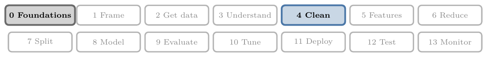
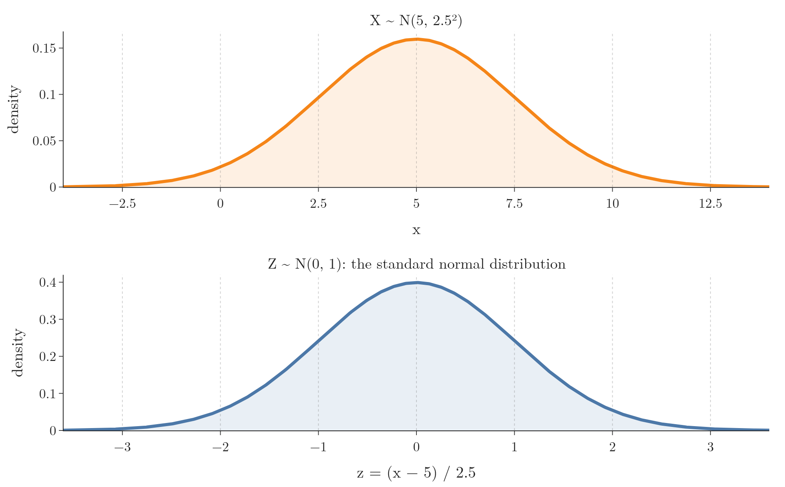
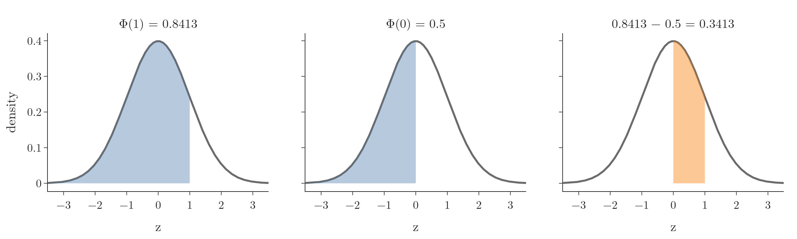

<!-- where-this-fits: generated by course_map/build_map.py; edit concepts.yaml, not this block -->
> **Where this fits:** Pipeline map steps 0 (Foundations), 4 (Clean). See the [Course map](../01-course-map/note.md).
>
> 
>
> - **Builds on:** Skewness ([Note 20](../20-univariate-analysis/note.md)); Standardization ([Note 24](../24-standardization/note.md)); Descriptive statistics ([Note 230](../230-percentiles-and-box-plots/note.md)); Cumulative distribution function (CDF) ([Note 242](../242-pdf-and-continuous-cdf/note.md)); Normal distribution ([Note 250](../250-normal-distribution/note.md)).
> - **Leads to:** Confidence intervals ([Note 280](../280-confidence-intervals-z-procedure/note.md)); Z-test and rejection regions ([Note 291](../291-rejection-region-and-z-test/note.md)).
> - **Compare with:** IQR outlier method ([Note 43](../43-outliers-iqr/note.md)); Percentile outlier method ([Note 44](../44-outliers-percentile/note.md)).
<!-- /where-this-fits -->

## 1. Overview

> **Key point:** Standardizing turns any normal distribution into the standard normal distribution $N(0, 1)$; one table of its areas, the z-table, then answers probability questions about every normal variable.

{height=48%}

Figure 1 shows the idea. The orange curve is a normal distribution with mean 5 and standard deviation 2.5. Subtracting 5 and dividing by 2.5 turns it into the blue curve, which has mean 0 and standard deviation 1. The shape stays exactly the same; only the numbers on the axis change.

This Note builds on the [normal distribution Note](../250-normal-distribution/note.md). The Note introduces the standard normal distribution, shows how to read a z-table, uses it on two problems, derives the 68-95-99.7 rule, and ends with where the normal distribution is used in data science.

## 2. The standard normal distribution

> **Key point:** The standard normal distribution is the normal distribution with mean 0 and standard deviation 1, written $Z \sim N(0, 1)$.

Among all normal distributions, one is special: the one with $\mu = 0$ and $\sigma = 1$. This distribution is called the **standard normal distribution** (or **standard normal variate**) and is written with the letter $Z$:

$$Z \sim N(0, 1)$$

Its curve (Figure 1, bottom) is centred at 0, and its x axis counts standard deviations directly: 1 means one standard deviation above the mean, $-2$ two below.

1. **In words:** put $\mu = 0$ and $\sigma = 1$ into the normal PDF.
2. **Formula:**
   $$\phi(z) = \frac{1}{\sqrt{2\pi}}\thickspace e^{-\frac{z^2}{2}}$$
   The standard normal PDF has its own symbol, $\phi$ (phi), and its CDF is written $\Phi$ (capital phi).
3. **Example:** at $z = 0$, $\phi(0) = 1/\sqrt{2\pi} = 1/2.5066 = 0.3989$, the height of the peak in Figure 1. At $z = 1$, $\phi(1) = 0.3989 \times e^{-0.5} = 0.3989 \times 0.6065 = 0.2420$.

## 3. Standardizing a normal variable

> **Key point:** Subtracting the mean and dividing by the standard deviation turns $X \sim N(\mu, \sigma^2)$ into $Z \sim N(0, 1)$.

To turn any normal variable into a standard normal one, we standardize every value: subtract the mean, divide by the standard deviation. The result is its z-score. Turning values into z-scores is the standardization of the [standardization Note](../24-standardization/note.md):

$$z = \frac{x - \mu}{\sigma}$$

For Figure 1, $x = 10$ becomes $z = (10 - 5)/2.5 = 2$: the value 10 lies two standard deviations above the mean. Every tick on the top axis lines up with its z-score below.

Real data works the same way. A **feature** is one variable of the data, one column of the table; an **observation** is one record, one row. The `Age` feature of the Titanic data (714 known ages) is roughly bell-shaped, with mean 29.70 years and standard deviation 14.53 years. Standardizing it gives a feature with mean $2 \times 10^{-16}$ (0 up to rounding) and standard deviation 1.

> **Python:** Standardizing a feature by hand.
>
> ```python
> import pandas as pd
>
> df = pd.read_csv("data/titanic_train.csv")
> age = df["Age"].dropna()
> z = (age - age.mean()) / age.std()
> z.mean(), z.std()      # about 0, and 1
> ```
>
> Standardizing changes the scale, not the shape: a skewed feature stays skewed (see the [standardization Note](../24-standardization/note.md), section 7.3). Only a normal feature becomes standard normal.

### 3.1 Why standardize?

> **Key point:** Standardizing lets us compare different normal distributions on one scale, and compute every probability from one table.

Two benefits make the standard normal distribution so useful:

1. **Comparison.** Two normal distributions with different means and spreads (heights in centimetres and in inches, marks in two different exams) can be compared side by side once both are standardized.
2. **One table for all probabilities.** The areas under the standard normal curve have been computed once and printed in a table. Any probability about any normal variable becomes a lookup in that table after standardizing.

## 4. The z-table

> **Key point:** A z-table lists $\Phi(z)$, the area under the standard normal curve to the left of $z$: the probability that $Z$ is at most $z$.

A **z-table** (standard normal table) lists the CDF of the standard normal distribution for many values of $z$:

$$\Phi(z) = P(Z \le z) = \text{area under the curve from } -\infty \text{ to } z$$

The table gives an **area**, so a probability, not the height of the curve at $z$ (Figure 2, left). There are two tables: one for negative $z$ and one for positive $z$.

To look up a z-score with two decimals, such as 1.33:

1. Choose the positive table, because 1.33 is positive.
2. Find the row for the first two digits, **1.3**.
3. Find the column for the second decimal, **0.03**.
4. Read the cell where they cross: **0.90824** (Figure 2, right).


So $P(Z \le 1.33) = 0.90824$: 90.8% of the area lies to the left of 1.33. The area to the right is the rest, $1 - 0.90824 = 0.09176$.

> **Python:** The z-table in one line.
>
> ```python
> from scipy import stats
>
> stats.norm.cdf(1.33)   # 0.90824, Phi(1.33)
> stats.norm.sf(1.33)    # 0.09176, 1 - Phi(1.33)
> stats.norm.ppf(0.975)  # 1.96, the z with 97.5% to its left
> ```

## 5. Two problems solved with the z-table

> **Key point:** Standardize the value, look up its area, and subtract when the question asks for "more than" or "between".

### 5.1 Taller than 72 inches

> **Key point:** About 9.2% of men are taller than 72 inches when heights are $N(68, 3^2)$.

The heights of adult men in a population are normal with mean 68 inches and standard deviation 3 inches. What is the probability that a randomly chosen man is taller than 72 inches?

1. **In words:** turn 72 into a z-score, read the area to its left, and subtract it from 1 to get the area to its right.
2. **Formula:**
   $$P(X > 72) = 1 - \Phi\negthinspace\left(\frac{72 - 68}{3}\right)$$
3. **Example:** the z-score is
   $$z = \frac{72 - 68}{3} = \frac{4}{3} = 1.33$$
   The z-table gives $\Phi(1.33) = 0.90824$, so
   $$P(X > 72) = 1 - 0.90824 = 0.09176$$
   About 9.2% of men are taller than 72 inches. (With the unrounded $z = 1.3333$, software gives 0.0912.)

The steps are always the same: draw the curve, standardize the value, look up the area, then subtract if needed.

### 5.2 Between the mean and one standard deviation above it

> **Key point:** For every normal distribution, 34.13% of the values lie between $\mu$ and $\mu + \sigma$.

Now no numbers are given: $X \sim N(\mu, \sigma^2)$. What share of the values lies between the mean $\mu$ and $\mu + \sigma$?

1. **In words:** standardize both ends, then subtract the area left of the lower end from the area left of the upper end.
2. **Formula:**
   $$z_{\text{lower}} = \frac{\mu - \mu}{\sigma} = 0, \qquad z_{\text{upper}} = \frac{(\mu + \sigma) - \mu}{\sigma} = 1$$
   $$P(\mu \le X \le \mu + \sigma) = \Phi(1) - \Phi(0)$$
3. **Example:** the z-table gives $\Phi(1) = 0.8413$, and $\Phi(0) = 0.5$ because the curve is symmetric. So
   $$P(\mu \le X \le \mu + \sigma) = 0.8413 - 0.5 = 0.3413$$

{height=30%}

The answer, 34.13%, does not depend on $\mu$ or $\sigma$: it holds for every normal distribution.

## 6. Deriving the 68-95-99.7 rule

> **Key point:** Repeating the calculation for 1, 2 and 3 standard deviations, and doubling by symmetry, gives 68.27%, 95.45% and 99.73%.

By symmetry, the same 34.13% lies between $\mu - \sigma$ and $\mu$. So the share within one standard deviation on either side is

$$P(\mu - \sigma \le X \le \mu + \sigma) = 2 \times 0.3413 = 0.6827$$

The same steps for 2 and 3 standard deviations:

| Range | Area right of the mean | Both sides |
|---|---|---|
| $\mu \pm 1\sigma$ | $\Phi(1) - 0.5 = 0.8413 - 0.5 = 0.3413$ | 68.27% |
| $\mu \pm 2\sigma$ | $\Phi(2) - 0.5 = 0.9772 - 0.5 = 0.4772$ | 95.45% |
| $\mu \pm 3\sigma$ | $\Phi(3) - 0.5 = 0.99865 - 0.5 = 0.49865$ | 99.73% |

The 68-95-99.7 pattern is the **empirical rule** of the [z-score outliers Note](../42-outliers-zscore/note.md), now derived from the z-table instead of taken on trust. The rule is powerful: knowing only that a variable is normal, without seeing any data, we can say that 99.73% of its values lie within 3 standard deviations of the mean.

A value far outside that range is extraordinary. Don Bradman's Test batting average of 99.94 is a famous example: it lies about 4.4 standard deviations above the mean of Test cricketers (Davis 2000). If the averages were normal, fewer than 1 value in 100,000 would lie that far up: $1 - \Phi(4.4) \approx 0.000005$. Roughly speaking, most good batsmen sit within one or two standard deviations of the mean, and only the very greatest approach three.

## 7. Where the normal distribution is used in data science

> **Key point:** Outlier detection, the assumptions of some ML models, hypothesis testing, and the central limit theorem.

1. **Outlier detection.** For a feature that is roughly normal, values beyond $\mu \pm 3\sigma$ are treated as outliers (the z-score method, see the [z-score outliers Note](../42-outliers-zscore/note.md)). For the Titanic ages the limits are $29.70 \pm 3 \times 14.53$, from $-13.88$ to $73.28$ years. No age is negative, so only the upper limit matters: two passengers, aged 74 and 80, are flagged.
2. **Assumptions of ML models.** Some models perform better, or rely on the assumption, that something is normally distributed. Linear regression assumes that the **residuals** (the errors) are normal, not the inputs (see the [linear regression assumptions Note](../56-linear-regression-assumptions/note.md)). Linear and logistic regression also tend to work better on normal-looking inputs (see the [function transformer Note](../30-function-transformer/note.md)), and a Gaussian mixture model is built from normal curves (see the [density estimation Note](../243-density-estimation-kde/note.md)).
3. **Hypothesis testing.** Many statistical tests assume that the data, or a statistic computed from it, is normally distributed.
4. **The central limit theorem.** Averages of samples from almost any distribution, normal or not, follow approximately a normal distribution, more closely as the samples grow (Pishro-Nik §7.1.2). This result, the topic of a later Note, is what makes the normal distribution central to inferential statistics.

## 8. Summary

| Idea | Formula | Example |
|---|---|---|
| Standard normal | $Z \sim N(0, 1)$ | peak $\phi(0) = 0.3989$ |
| Standardize | $z = (x - \mu)/\sigma$ | $(72 - 68)/3 = 1.33$ |
| Z-table | $\Phi(z) = P(Z \le z)$ | $\Phi(1.33) = 0.90824$ |
| More than $x$ | $1 - \Phi(z)$ | $P(X > 72) = 0.092$ |
| Between two values | $\Phi(z_2) - \Phi(z_1)$ | $\Phi(1) - \Phi(0) = 0.3413$ |
| Empirical rule | $2(\Phi(k) - 0.5)$ | 68.27%, 95.45%, 99.73% |

- A z-table gives areas (probabilities) to the left of $z$, not heights of the curve.
- Standardizing keeps the shape; only normal data becomes standard normal.
- Values beyond 3 standard deviations are rare: 0.27% in all.

## 9. Sources

- Davis, C. (2000). *The Best of the Best: A Study of Batting and Bowling in Test Cricket*. ABC Books. Bradman's average 4.4 standard deviations above the mean of Test batsmen.
- Pishro-Nik, H. (2014). *Introduction to Probability, Statistics, and Random Processes*. Kappa Research. Section 7.1.2 (central limit theorem; needs a finite variance).

## 10. Key terms

| Term | Meaning |
|---|---|
| Feature | One variable of the data, one column of the table |
| Observation | One record, one row of the table |
| Standard normal distribution | The normal distribution with mean 0 and standard deviation 1, written $Z \sim N(0, 1)$ |
| $\phi(z)$ | The PDF of the standard normal distribution |
| $\Phi(z)$ | The CDF of the standard normal distribution: the area to the left of $z$ |
| Z-table | A table of $\Phi(z)$ for many values of $z$, used to find normal probabilities |
