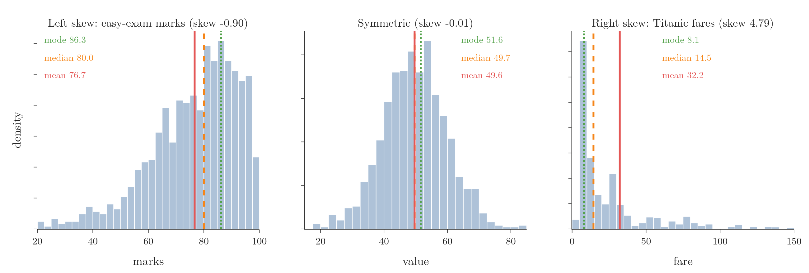
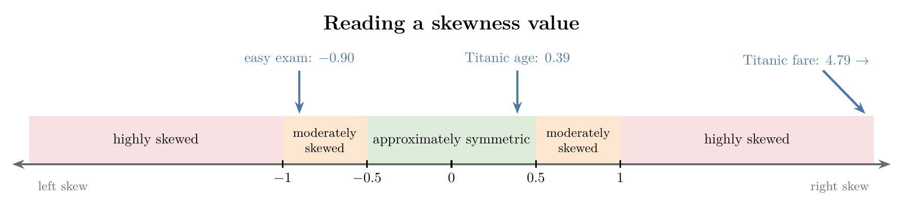

<!-- where-this-fits: generated by course_map/build_map.py; edit concepts.yaml, not this block -->
> **Where this fits:** Pipeline map step 3 (Understand data). See the [Course map](../01-course-map/note.md).
>
> 
>
> - **Builds on:** Descriptive statistics ([Note 230](../230-percentiles-and-box-plots/note.md)).
> - **Compare with:** Kurtosis and moments ([Note 22](../22-pandas-profiling/note.md)).
<!-- /where-this-fits -->

## 1. Overview

> **Key point:** Skewness measures how far a distribution is from symmetric; it shows in the tail, in the order of mode, median and mean, and in one number whose size tells us whether we may treat a column as normal.



Skewness was introduced in the [univariate analysis Note](../20-univariate-analysis/note.md) (section 10): 0 for a symmetric column, positive for a long right tail, negative for a long left tail, with the formula worked by hand. This Note goes deeper. It links skewness to the [normal distribution](../250-normal-distribution/note.md), explains why the tail matters, shows how the mean, median and mode separate (Figure 1), gives the sample formula that pandas uses, and gives a scale for reading the number.

## 2. Skewness as distance from the normal shape

> **Key point:** A normal distribution is perfectly symmetric; skewness measures the asymmetry, so the larger it is, the less we can treat the data as normal.

A normal distribution is a symmetric bell with a specific formula (see the [normal distribution Note](../250-normal-distribution/note.md)). **Skewness** is a measure of the asymmetry of a probability distribution: the degree to which a dataset deviates from that symmetric shape.

- In a **symmetric** distribution the mean, median and mode are equal, and the two tails are equally long.
- In a **skewed** distribution the mean, median and mode differ, and one tail is longer than the other.

So skewness is a warning light. The more it grows, the less the data looks like a normal distribution, and the less we can rely on the normal distribution's properties (such as the 68-95-99.7 rule) for that data.

## 3. The tail and tail events

> **Key point:** The skew is named after the long tail; a tail event has a very low probability but a very large effect.

Positive (right) skew has a long right tail and negative (left) skew a long left tail, as the [univariate analysis Note](../20-univariate-analysis/note.md) (section 10) shows. The tail is where the outliers are, and in finance it gets special attention.

A **tail event** is an event with a very low probability of happening that has a huge impact when it does. Investors who fund start-ups are an example. Out of 50 companies they invest in, perhaps 45 to 48 fail and the money is lost.

But one or two succeed so spectacularly that they repay all the losses and more. The returns form a heavily right-skewed distribution, and the whole strategy rests on its long right tail.

## 4. The order of mode, median and mean

> **Key point:** Right skew: mode < median < mean. Left skew: mean < median < mode. The stronger the skew, the further apart they are.

The three measures of central tendency (see the [measures of central tendency Note](../221-measures-of-central-tendency/note.md)) react differently to a tail:

- the **mode** stays at the peak, where most values are;
- the **median** moves a little towards the tail, since it only counts values;
- the **mean** moves furthest, because every extreme value in the tail pulls it.

So the order depends on the side of the tail (Figure 1):

| Shape | Order | Example from Figure 1 |
|---|---|---|
| Right skew | mode < median < mean | fares: 8.05 < 14.45 < 32.20 |
| Symmetric | mode = median = mean | all close to 50 |
| Left skew | mean < median < mode | marks: 76.7 < 80.0 < 86.3 |

The stronger the skew, the further the mean is from the median and the mode. With little skew the three almost coincide; for a perfect normal distribution they are equal.

## 5. The sample skewness formula

> **Key point:** Sample skewness is the third moment of the standardized values, with a small correction for sample size; pandas and Excel use this version.

Skewness is the third **statistical moment**: where the mean uses the values themselves and the variance their squared distances, skewness uses **cubed** distances (moments are explained in the [kurtosis and Q-Q plots Note](../260-kurtosis-and-qq-plots/note.md)). Cubing keeps the sign, so values far above the mean push the total up and values far below push it down.

We worked the population version, $g_1$, by hand in the [univariate analysis Note](../20-univariate-analysis/note.md). The version in pandas' `skew()` and Excel's `SKEW` is the **sample skewness**:

1. **In words:** standardize every value with the sample mean and sample standard deviation, cube, add up, and multiply by a factor that corrects for small samples.
2. **Formula:** for $n$ values with sample mean $\bar{x}$ and sample standard deviation $s$ (divided by $n - 1$),
   $$G_1 = \frac{n}{(n - 1)(n - 2)} \sum_{i=1}^{n} \left(\frac{x_i - \bar{x}}{s}\right)^3$$
3. **Example:** the values 1, 2, 3, 4, 10 have $\bar{x} = 4$ and $s = 3.536$. Their standardized values are $-0.849, -0.566, -0.283, 0, 1.697$, whose cubes are $-0.611, -0.181, -0.023, 0, 4.888$. The sum is 4.074, so
   $$G_1 = \frac{5}{4 \times 3} \times 4.074 = 0.4167 \times 4.074 = 1.70$$
   This is the 1.70 that pandas gives, against $g_1 = 1.14$ without the correction.

The $n - 1$ inside $s$ is Bessel's correction (see the [measures of dispersion Note](../222-measures-of-dispersion/note.md)); the factor in front plays the same role for the third moment. With hundreds of rows, $G_1$ and $g_1$ are almost equal.

In practice nobody computes this by hand: `df["Fare"].skew()` returns 4.79 at once. What matters is interpreting the number.

> **Extra:** A simpler measure is **Pearson's skewness coefficient**, $3(\bar{x} - \text{median})/s$. It uses the fact from Section 4 that skew pulls the mean away from the median. For 1, 2, 3, 4, 10 it gives $3 \times (4 - 3)/3.536 = 0.85$: the same sign, a different size. It is quick to compute but less used than the moment version.

## 6. Reading a skewness value

> **Key point:** Between $-0.5$ and 0.5, approximately symmetric; between 0.5 and 1 in size, moderately skewed; beyond 1 in size, highly skewed.

Real data almost never has a skewness of exactly 0, so we need a scale (Figure 2):

{height=30%}

| Skewness | Reading | What we may assume |
|---|---|---|
| $-0.5$ to $0.5$ | approximately symmetric | if the plot also looks bell-shaped, treat it as normal |
| $0.5$ to $1$ (or $-1$ to $-0.5$) | moderately skewed | do not assume normality |
| above 1 (or below $-1$) | highly skewed | clearly not normal |

Two Titanic columns show the two ends of the scale:

- **Age**, skewness 0.39: approximately symmetric. Together with its roughly bell-shaped histogram, we may treat it as normal for practical purposes, as the [standard normal distribution Note](../251-standard-normal-and-z-table/note.md) did.
- **Fare**, skewness 4.79: highly skewed, far from normal. A column like this is a candidate for a log transform (see the [function transformer Note](../30-function-transformer/note.md)).

These cut-offs are a rule of thumb, not a law. They are widely used because they work well in practice.

> **Python:** Skewness of every numerical column.
>
> ```python
> import pandas as pd
>
> df = pd.read_csv("data/titanic_train.csv")
> df["Age"].skew()     # 0.39
> df["Fare"].skew()    # 4.79
> df.skew(numeric_only=True)   # all columns at once
> ```

### 6.1 Symmetric does not mean normal

> **Key point:** Zero skewness only says "symmetric"; a flat or two-humped distribution can be symmetric too.

Skewness applies to every distribution, not only to the normal one, and a skewness near 0 does not prove normality. The uniform distribution (see the [uniform and log-normal distributions Note](../261-uniform-and-log-normal/note.md)) and a symmetric distribution with two humps both have skewness 0, and neither is normal.

So skewness is one check among several. We look at the shape as well (histogram, density plot) and, best of all, at a Q-Q plot (see the [kurtosis and Q-Q plots Note](../260-kurtosis-and-qq-plots/note.md)).

## 7. Summary

| Skewness | Tail | Order | Example |
|---|---|---|---|
| Positive | long right tail | mode < median < mean | Titanic fare, 4.79 |
| About 0 | balanced | mode $\approx$ median $\approx$ mean | Titanic age, 0.39 |
| Negative | long left tail | mean < median < mode | easy-exam marks, $-0.90$ |

- Skewness measures asymmetry, the departure from the normal distribution's symmetric shape.
- The skew is named after the tail, not the hump.
- Sample skewness (pandas, Excel) adds a small-sample correction to the third moment.
- $|\text{skew}| < 0.5$: about symmetric; 0.5 to 1: moderate; above 1: high.
- Symmetric is not the same as normal.

## 8. Key terms

| Term | Meaning |
|---|---|
| Tail event | An event with a very low probability but a very large effect |
| Sample skewness $G_1$ | The third moment of the standardized values with a small-sample correction; what pandas' `skew()` returns |
| Pearson's skewness coefficient | $3(\bar{x} - \text{median})/s$: a simple measure of skew |
