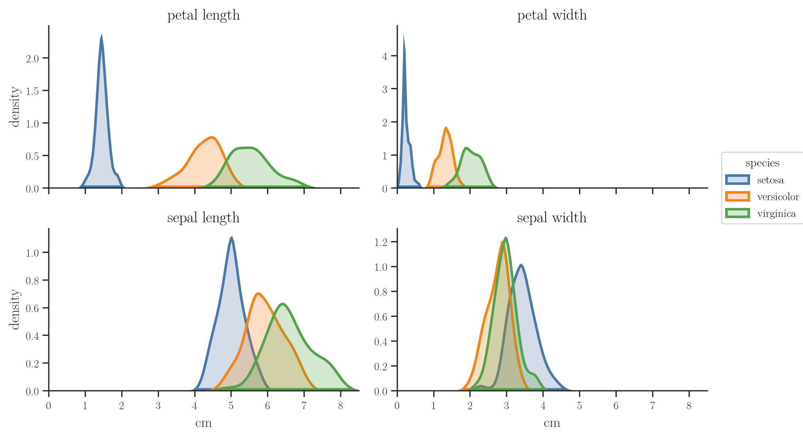
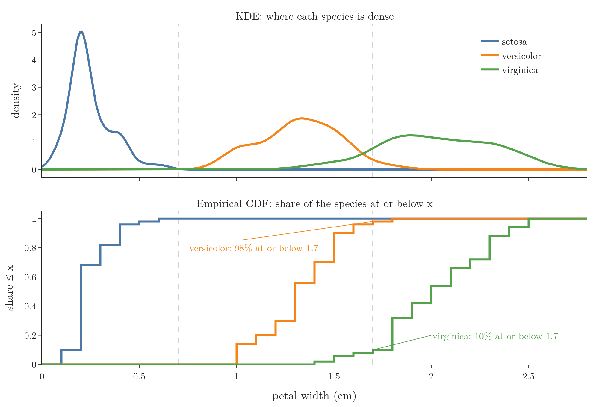

<!-- where-this-fits: generated by course_map/build_map.py; edit concepts.yaml, not this block -->
> **Where this fits:** Pipeline map step 3 (Understand data). See the [Course map](../01-course-map/note.md).
>
> 
>
> - **Builds on:** Probability mass function (PMF) ([Note 241](../241-pmf-and-discrete-cdf/note.md)); Probability density function (PDF) ([Note 242](../242-pdf-and-continuous-cdf/note.md)); Density estimation ([Note 243](../243-density-estimation-kde/note.md)).
> - **Leads to:** P-values ([Note 300](../300-p-values/note.md)).
> - **Compare with:** Frequency tables ([Note 223](../223-frequency-tables-and-graphs/note.md)).
<!-- /where-this-fits -->

## 1. Overview

> **Key point:** Comparing the PDFs of one feature across classes shows which features separate the classes; the CDF then puts a number on how often a rule based on those PDFs is right; 2D density plots extend the idea to two features.

{height=48%}

The [PDF and continuous CDF Note](../242-pdf-and-continuous-cdf/note.md) and the [density estimation Note](../243-density-estimation-kde/note.md) explained what PDFs and CDFs are and how to estimate them. This Note shows three ways a data analyst uses them. Here a **feature** is an input variable, one column of the data table; an **observation** is one record, one row; the **target** is the output we predict.

1. **Feature selection:** which features help to tell the classes apart (Figure 1).
2. **Measuring a rule:** how often a decision rule read off the PDFs is right, using the CDF.
3. **2D density plots:** the joint density of two features.

## 2. PDFs for feature selection

> **Key point:** Draw one PDF per class for each feature; a feature whose class curves do not overlap separates the classes well, a feature whose curves overlap does not.

### 2.1 The iris data

> **Key point:** 150 flowers of three species, four measurements each; the task is to predict the species from the measurements.

The **iris dataset** describes 150 iris flowers, 50 of each of three species: setosa, versicolor and virginica. For every flower it gives four measurements in centimetres: sepal length, sepal width, petal length and petal width. The classic machine learning task is to predict the species from these four numbers.

Each of the four measurements is a feature, an input used for the prediction, and the species is the target. **Feature selection** keeps the features that help to predict and removes the ones that do not (see the [what is feature engineering Note](../23-what-is-feature-engineering/note.md)). Suppose we may keep only two of the four. Which two?

### 2.2 Reading the class PDFs

> **Key point:** The petal measurements separate the three species; the sepal measurements overlap, so the petal features are the ones to keep.

For each feature we draw three density curves (KDEs), one per species, on the same axes (Figure 1), as in the [bivariate and multivariate analysis Note](../21-bivariate-multivariate-analysis/note.md) (section 6). Each curve shows where that species' values are concentrated.

- **Petal length (top left):** the setosa curve sits alone, far left, below about 2.3 cm. Versicolor and virginica overlap only a little.
- **Petal width (top right):** the same picture.
- **Sepal length (bottom left):** all three curves overlap heavily; setosa stands out a little.
- **Sepal width (bottom right):** versicolor and virginica lie almost on top of each other.

So the petal measurements are the useful features, and the sepal measurements can go. A machine learning model would struggle to separate the species with the sepal measurements alone, for the same reason we do: the curves are mixed.

The class PDFs even suggest a decision rule. From petal length:

| Petal length | Predicted species | Why |
|---|---|---|
| below 2.3 cm | setosa | only the setosa curve is above 0 there |
| 2.3 to 5 cm | versicolor | the versicolor curve is higher |
| above 5 cm | virginica | the virginica curve is higher |

The same idea, with two classes, appeared there too: young Titanic passengers were more likely to survive than to die.

> **Python:** One KDE per class.
>
> ```python
> import seaborn as sns
>
> iris = sns.load_dataset("iris")
> sns.kdeplot(data=iris, x="petal_length",
>             hue="species", common_norm=False)
> ```
>
> `hue` draws one curve per species; `common_norm=False` gives each curve area 1. The Notebook (`notebook.ipynb`) loads the data from scikit-learn, which works offline.

## 3. The CDF measures how good a rule is

> **Key point:** At the rule's cut-off, each class's CDF gives the share of that class on each side, so we can say how often the rule is right for each class.

The PDFs gave us a rule, but not how reliable it is. The CDF answers the reliability question. Take petal width (Figure 2, top), where the KDEs suggest:

- petal width up to 0.7 cm: setosa;
- above 0.7 and up to 1.7 cm: versicolor (the orange curve is higher there);
- above 1.7 cm: virginica (the green curve is higher).

Now draw the CDF of each species (Figure 2, bottom). At 1.7 cm:

- the **versicolor** CDF is 0.98: 98% of versicolor flowers have petal width 1.7 or less;
- the **virginica** CDF is 0.10: only 10% of virginica flowers have petal width 1.7 or less.

{height=55%}

So the rule is right for 98% of versicolor flowers (no versicolor is 0.7 or below) and wrong for the other 2%, which it calls virginica. The rule is right for 90% of virginica flowers and wrong for 10%, which it calls versicolor. The PDF found the rule; the CDF put a number on its reliability.

1. **In words:** the share of a class that a "below the cut-off" rule catches is that class's CDF at the cut-off; for an "above" rule it is 1 minus the CDF.
2. **Formula:**
   $$P(\text{right} \mid \text{versicolor}) = F_{\text{versicolor}}(1.7) - F_{\text{versicolor}}(0.7), \qquad P(\text{right} \mid \text{virginica}) = 1 - F_{\text{virginica}}(1.7)$$
3. **Example:**
   $$0.98 - 0 = 0.98, \qquad 1 - 0.10 = 0.90$$

> **Extra:** All 50 setosa flowers have petal width 0.6 or less, so the full rule gets $50 + 49 + 45 = 144$ of the 150 flowers right: an accuracy of 96%, from one feature and two cut-offs.

### 3.1 The empirical CDF

> **Key point:** The empirical CDF of a sample is the share of its values at or below $x$; it is a step function that estimates the true CDF.

The CDFs in Figure 2 are computed from the data, so they are **empirical CDFs** (ECDFs): for each $x$, the share of the sample's values that are at or below $x$. With 50 flowers per species, each flower adds a step of $1/50 = 0.02$, so the curve climbs in steps, like the CDF of a discrete variable (see the [PMF and discrete CDF Note](../241-pmf-and-discrete-cdf/note.md)). The ECDF is the standard estimate of the true CDF (Wasserman 2004, ch. 7), good enough for all practical purposes.

> **Python:** An ECDF per class.
>
> ```python
> sns.ecdfplot(data=iris, x="petal_width",
>              hue="species")
> # by hand, for one class
> (v <= 1.7).mean()      # share at or below 1.7
> ```

## 4. 2D density plots

> **Key point:** A 2D density plot shows the joint density of two numerical features as contours: darker means more flowers with that combination of values.

Every density so far described **one** feature. A density can also describe two features together: then it gives, for every pair of values, how densely the data is packed around that combination. Three features would also work, but such plots are hard to read, so in practice 2D is the limit.

Figure 3 shows the **2D density plot** of petal length (x axis) and sepal length (y axis) for all 150 flowers, with the 1D density of each feature along its edge. Read it as a map of a mountain range seen from above:

- the colour is the height: the darker the blue, the higher the density;
- each line joins points of equal density, like the height lines of the contour plot in the [gradient descent Note](../57-gradient-descent/note.md);
- the two dark centres are two peaks: the most common combinations of the two measurements.

{height=55%}

The small peak (petal length about 1.5 cm, sepal length about 5 cm) is the setosa flowers; the large one (petal length about 4.5 to 5 cm, sepal length about 6 cm) is the other two species together. Between them the density is low: almost no flower has a petal length of about 3 cm.

Strictly, the colour is a probability density, so the plot shows where the probability of finding a flower is highest, not a probability itself (see the [PDF and continuous CDF Note](../242-pdf-and-continuous-cdf/note.md)).

> **Python:** A 2D density plot.
>
> ```python
> sns.kdeplot(data=iris, x="petal_length",
>             y="sepal_length", fill=True, cbar=True)
> # or with the edge densities:
> sns.jointplot(data=iris, x="petal_length",
>               y="sepal_length", kind="kde", fill=True)
> ```
>
> The Notebook computes the 2D KDE with `scipy.stats.gaussian_kde` and draws it with Plotly.

## 5. Summary

| Tool | Question it answers | Iris example |
|---|---|---|
| PDF per class | Which features separate the classes? | petal length and width, not sepal |
| CDF per class | How often is a cut-off rule right? | 98% of versicolor, 90% of virginica |
| Empirical CDF | The CDF estimated from a sample | steps of 1/50 per flower |
| 2D density plot | Which combinations of two features are common? | two peaks: setosa, and the rest |

- Overlapping class curves mean a weak feature; separated curves mean a strong one.
- A rule from the PDFs, checked with the CDFs, comes with its error rate.
- In a 2D density plot, colour is density: dark centres are the most common combinations.

## 6. Sources

- Wasserman, L. (2004). *All of Statistics*. Springer. Chapter 7, "Estimating the CDF and Statistical Functionals".

## 7. Key terms

| Term | Meaning |
|---|---|
| Feature | An input variable, one column of the data table |
| Observation | One record, one row of the data table |
| Target | The output we predict, here the species |
| Iris dataset | 150 iris flowers of three species, with four measurements each; a classic classification dataset |
| Empirical CDF (ECDF) | The share of a sample's values at or below $x$; a step-function estimate of the CDF |
| 2D density plot | A plot of the joint density of two numerical features, usually as filled contours |
