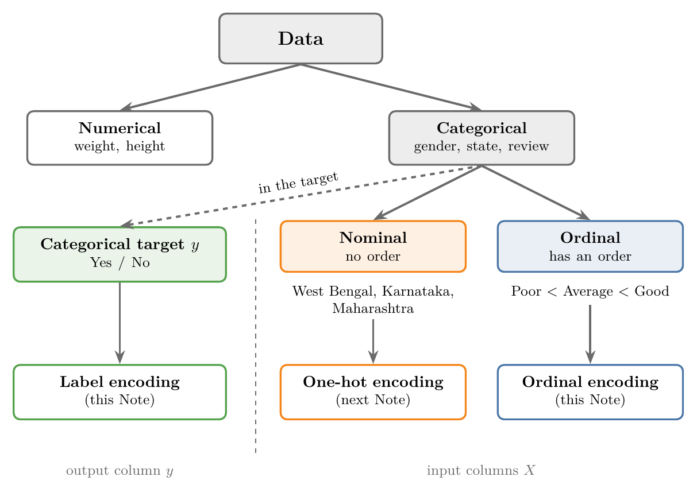
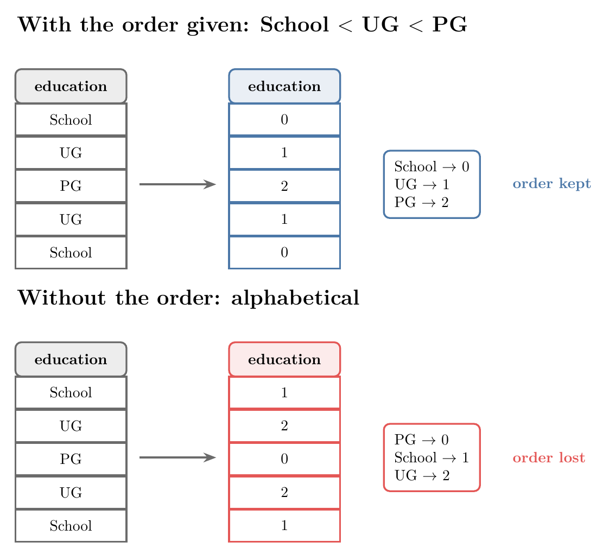
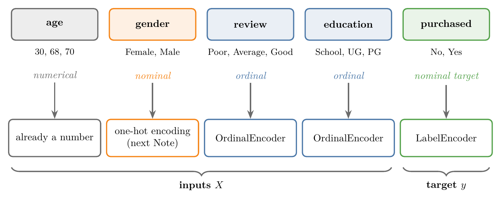

<!-- where-this-fits: generated by course_map/build_map.py; edit concepts.yaml, not this block -->
> **Where this fits:** Pipeline map step 5 (Engineer features). See the [Course map](../01-course-map/note.md).
>
> 
>
> - **Builds on:** Train-test split ([Note 13](../13-toy-project/note.md)); Feature transformation ([Note 23](../23-what-is-feature-engineering/note.md)).
> - **Leads to:** One-hot encoding ([Note 27](../27-one-hot-encoding/note.md)); Column transformer ([Note 28](../28-column-transformer/note.md)).
> - **Compare with:** One-hot encoding ([Note 23](../23-what-is-feature-engineering/note.md)); Binning and binarization ([Note 23](../23-what-is-feature-engineering/note.md)).
<!-- /where-this-fits -->

## 1. Overview

> **Key point:** Ordinal encoding turns ordered categories in the input columns into the numbers 0, 1, 2, ...; label encoding does the same for the categories of the target column.

Feature transformation changes a column's form so a model can use it. Note 24 covered one of its jobs, feature scaling. This Note covers another job, which comes up in almost every ML problem: **encoding categorical data**, that is, turning categories into numbers.

Figure 1 shows the whole topic. The kind of categorical column decides the technique: nominal input columns get one-hot encoding (next Note), ordinal input columns get ordinal encoding, and a categorical target gets label encoding.



## 2. Numerical and categorical data

> **Key point:** Data is either numerical (numbers) or categorical (categories); categorical data is either nominal (no order) or ordinal (has an order).

Every column of data is one of two types:

- **Numerical data:** numbers, such as weight or height.
- **Categorical data:** categories, such as gender, nationality, or a student's college branch.

Categorical data itself comes in two types, nominal and ordinal.

### 2.1 Nominal data

> **Key point:** Nominal categories have no relationship and no order among them.

In **nominal data**, the categories have no relationship with each other and no order. A good example is a column of Indian states: West Bengal, Karnataka, Maharashtra. We cannot say that one state is more or greater than another.

Engineering branches are another example. Computer science, mechanical and civil are different branches, but none of them is "higher" than the others.

### 2.2 Ordinal data

> **Key point:** Ordinal categories have a natural order, so we can rank them.

In **ordinal data**, there is a relationship between the categories: they can be put in order. A product review is a good example: if the possible answers are excellent, good and bad, then excellent > good > bad.

Education level works the same way. Post-graduate (PG) is higher than under-graduate (UG), which is higher than high school.

## 3. Why categories must become numbers

> **Key point:** Categorical data is usually stored as text, but ML algorithms work only with numbers.

Categorical data is mostly stored as strings, such as `"Male"` or `"Good"`. ML algorithms expect numbers. So it is our job to convert the categories into numbers before training.

There are many ways to do this, called **encoding** techniques. The two most popular ones are:

1. **Ordinal encoding**, used on ordinal data. It is the subject of this Note.
2. **One-hot encoding**, used on nominal data. It is the subject of the next Note.

This Note also covers a third technique, **label encoding**. It does the same job as ordinal encoding, but it is meant for a different column: the target.

> **Extra:** Why not simply number nominal categories too? Writing West Bengal = 0, Karnataka = 1, Maharashtra = 2 tells the model that Maharashtra is "more" than Karnataka, and that Karnataka sits exactly between the other two. That order is false, and the model may learn from it. One-hot encoding avoids this by giving each category its own column.

## 4. Ordinal encoding versus label encoding

> **Key point:** Use ordinal encoding for ordinal input columns ($X$); use label encoding for a categorical target column ($y$).

Any dataset has input columns and an output column. The input columns together are called $X$, and the output column is called $y$. The two encoders differ in which of these they are for:

- **Inputs ($X$):** if an input column holds ordinal categories, we apply ordinal encoding.
- **Output ($y$):** if the target is categorical, we apply label encoding.

A categorical target is what every **classification** problem has. Examples: will it rain today or not; will a student get placed or not; will a customer leave (customer churn) or not; which class does an image belong to.

Label encoding does the same thing as ordinal encoding: it replaces each category with a number. It is simply designed specially for output labels, which is where its name comes from. That is the main difference between the two.

## 5. How ordinal encoding works

> **Key point:** We tell the encoder the order of the categories; it gives the lowest category 0, the next 1, and so on.

Suppose a column `education` holds three values, over many rows: high school, under-graduate (UG) and post-graduate (PG). We want to turn it into a numerical column.

First we decide whether the column is nominal or ordinal. If it were nominal, we would use one-hot encoding. Here PG > UG > high school, so the column is ordinal and we use ordinal encoding.

Next we tell the encoder the order: high school is the lowest, UG is in the middle, and PG is the highest. The encoder then replaces each category with its position in that order:

| Category | Code |
|---|---|
| high school | 0 |
| UG | 1 |
| PG | 2 |

The top half of Figure 2 shows this on a few rows, with the label "School" for high school. Every row with School becomes 0, every UG becomes 1, every PG becomes 2.



The encoder cannot work out the order by itself. It has no idea what "UG" or "PG" mean, so we must always tell it which category is lowest and which is highest.

## 6. Ordinal encoding in scikit-learn

> **Key point:** Split the data, then let `OrdinalEncoder` learn the categories from the training set (in the order we give) and apply them to both sets.

### 6.1 The customer data

> **Key point:** 50 customers, with their age, gender, product review, education, and whether they bought a recommended product.

The data has 50 customers. When each customer bought a product, some other products were recommended to them; the `purchased` column says whether the customer then bought one of them (Yes or No).

| age | gender | review | education | purchased |
|---|---|---|---|---|
| 30 | Female | Average | School | No |
| 68 | Female | Poor | UG | No |
| 70 | Female | Good | PG | No |

`purchased` is the target, so this is a classification problem. Every column except `age` is categorical.

### 6.2 Which encoder for which column

> **Key point:** Gender is nominal, review and education are ordinal, and the target purchased is categorical.

Before encoding, we identify the type of every categorical column (Figure 3):

- **gender** (Female, Male): there is no order between male and female, so it is nominal. It needs one-hot encoding.
- **review** (Poor, Average, Good): ordinal, so it needs ordinal encoding.
- **education** (School, UG, PG): ordinal, so it needs ordinal encoding.
- **purchased** (Yes, No): nominal, and it is the target, so it needs label encoding.



Applying a different encoder to different columns by hand is tedious. We would have to separate `gender` and one-hot encode it, separate `review` and `education` and ordinal encode them, and then join everything back together.

scikit-learn has a class for exactly this, the **column transformer**, covered two Notes from now. Until then, we drop `age` and `gender` and keep only `review`, `education` and `purchased`.

> **Python:** Loading the data and keeping the last three columns.
>
> ```python
> import pandas as pd
>
> df = pd.read_csv("data/customer.csv")
> # keep columns 2 onwards: review, education, purchased
> df = df.iloc[:, 2:]
> ```

### 6.3 Split before encoding

> **Key point:** As with scaling, the train-test split comes before the encoding.

Whenever we do a feature transformation, we split the data first. The encoder learns from the training set only, and is then applied to both the training set and the test set. Note 24 followed the same rule for scaling.

With 20% of the rows held back for testing, the training set has 40 rows and the test set 10.

> **Python:** Splitting the data.
>
> ```python
> from sklearn.model_selection import train_test_split
>
> X_train, X_test, y_train, y_test = train_test_split(
>     df.iloc[:, 0:2],   # inputs: review, education
>     df.iloc[:, -1],    # target: purchased
>     test_size=0.2, random_state=0)
> # X_train: (40, 2), X_test: (10, 2)
> ```
>
> `df.iloc[:, 0:2]` takes all rows and the columns at positions 0 and 1. `df.iloc[:, -1]` takes all rows and the last column.

### 6.4 The categories parameter

> **Key point:** `categories` takes one list per column, each written from the lowest category to the highest.

scikit-learn's **`OrdinalEncoder`** class does ordinal encoding. When we create it, we pass the parameter **`categories`**: a list that holds one list for each column we want to encode.

Here we encode two columns, so we pass two lists:

- **review:** the worst is Poor, then Average, and the best is Good. Good must get the biggest number and Poor the smallest.
- **education:** School gets the smallest number and PG the biggest.

> **Python:** Creating the encoder with the order of each column.
>
> ```python
> from sklearn.preprocessing import OrdinalEncoder
>
> oe = OrdinalEncoder(categories=[
>     ["Poor", "Average", "Good"],   # review
>     ["School", "UG", "PG"],        # education
> ])
> ```

If we do not pass `categories`, the encoder chooses the order itself, and Poor might get a bigger number than Good. We do not want that: we want the numbers to follow the real order of the categories.

> **Extra:** Without `categories`, the order is not random: `OrdinalEncoder` sorts the categories alphabetically. That gives Average = 0, Good = 1, Poor = 2, and PG = 0, School = 1, UG = 2. The bottom half of Figure 2 shows the result: the codes no longer follow the real order. For ordinal data, always pass `categories`.

### 6.5 Fit on the training set, transform both

> **Key point:** `fit` learns the categories; `transform` replaces every category with its number.

As with `StandardScaler`, using the encoder has two steps:

- **fit:** learn the categories of each column from the training set.
- **transform:** replace every category with its position in the list.

> **Python:** Encoding both sets.
>
> ```python
> # learn the categories from the training set only
> oe.fit(X_train)
> # apply them to both sets
> X_train = oe.transform(X_train)
> X_test = oe.transform(X_test)
> ```

The first training rows before and after encoding:

| review | education | review (encoded) | education (encoded) |
|---|---|---|---|
| Good | PG | 2 | 2 |
| Poor | School | 0 | 0 |
| Poor | PG | 0 | 2 |
| Average | School | 1 | 0 |

Good got the biggest number, 2, and Poor the smallest, 0. UG would get 1, since it is in the middle. Every row follows the order we gave.

After `fit`, the encoder stores the categories it learned, in order, in the attribute **`categories_`**.

> **Python:** Looking at the learned categories.
>
> ```python
> oe.categories_
> # [array(['Poor', 'Average', 'Good']),
> #  array(['School', 'UG', 'PG'])]
> ```
>
> Position 0 in each array is the category that became 0, position 1 became 1, and so on.

> **Extra:** `transform` returns a NumPy array of decimal numbers (`2.0`, not `2`), without column names. As in Note 24, we can wrap it in `pd.DataFrame(..., columns=...)` to get names back.

> **Extra:** If the test set holds a category that never appeared in the training set, `transform` stops with an error. Passing `handle_unknown="use_encoded_value", unknown_value=-1` to `OrdinalEncoder` makes it write -1 for such categories instead.

## 7. Label encoding in scikit-learn

> **Key point:** `LabelEncoder` is meant only for the target $y$; it numbers the classes 0 to (number of classes $-$ 1), and we cannot choose the order.

### 7.1 Only for the target

> **Key point:** The scikit-learn documentation says `LabelEncoder` should encode target values, $y$, not the input $X$.

A common mistake is to use label encoding on input columns too.

The scikit-learn documentation is clear about this. It describes `LabelEncoder` as a class to "encode target labels with value between 0 and n_classes-1", and says it "should be used to encode target values, i.e. y, and not the input X".

So the rule is simple:

- an ordinal input column: `OrdinalEncoder`;
- a categorical target column: `LabelEncoder`.

With 2 classes, the codes are 0 and 1; with 3 classes, they are 0, 1 and 2.

### 7.2 Encoding the purchased column

> **Key point:** `LabelEncoder` takes no order; it gave No = 0 and Yes = 1.

**`LabelEncoder`** takes no parameters. We cannot tell it the order: it decides by itself which class gets which number. The steps are the same as before: fit on the training target, then transform both targets.

> **Python:** Label encoding the target.
>
> ```python
> from sklearn.preprocessing import LabelEncoder
>
> le = LabelEncoder()
> # learn the classes from the training target
> le.fit(y_train)
> le.classes_
> # array(['No', 'Yes'])
>
> y_train = le.transform(y_train)
> y_test = le.transform(y_test)
> ```
>
> The attribute **`classes_`** lists the classes in order: position 0 is No, so No becomes 0 and Yes becomes 1.

The first five training targets were Yes, Yes, No, No, No. After encoding they are 1, 1, 0, 0, 0.

> **Extra:** `LabelEncoder` also sorts the classes alphabetically, which is why No comes before Yes. For a target the order does not matter: a classifier only needs a different number for each class. `le.inverse_transform([0, 1])` turns the numbers back into `['No', 'Yes']`, which is useful for reading a model's predictions.

## 8. Summary

| | Ordinal encoding | Label encoding | One-hot encoding |
|---|---|---|---|
| Used on | ordinal input columns ($X$) | the categorical target ($y$) | nominal input columns ($X$) |
| Example column | review, education | purchased | gender, state |
| Result | one column of 0, 1, 2, ... | one column of 0, 1, 2, ... | one new column per category |
| Order of codes | we give it with `categories` | chosen by the encoder (alphabetical) | no order |
| scikit-learn class | `OrdinalEncoder` | `LabelEncoder` | next Note |
| Learned categories in | `categories_` | `classes_` | |

- Data is numerical or categorical; categorical data is nominal (no order) or ordinal (has an order).
- ML algorithms need numbers, so categories must be encoded.
- Ordinal encoding replaces ordered categories by 0, 1, 2, ..., following the order we give it.
- Always pass `categories` to `OrdinalEncoder`; otherwise the order is alphabetical and the real order is lost.
- Label encoding does the same job, but only for the target $y$; never use it on the inputs.
- Split first; fit the encoder on the training set; transform both sets.

## 9. Key terms

| Term | Meaning |
|---|---|
| Numerical data | Data made of numbers, such as weight or height |
| Categorical data | Data made of categories, such as gender or nationality |
| Nominal data | Categorical data whose categories have no order, such as states |
| Ordinal data | Categorical data whose categories have a natural order, such as Poor < Average < Good |
| Encoding | Turning categories into numbers so an ML algorithm can use them |
| Ordinal encoding | Replacing ordered categories by 0, 1, 2, ... in their order; for input columns |
| Label encoding | Replacing the classes of the target by 0, 1, 2, ...; for the output column only |
| One-hot encoding | Replacing a nominal column by one 0/1 column per category (next Note) |
| OrdinalEncoder | scikit-learn's class for ordinal encoding; takes the order through `categories` |
| categories_ | The attribute holding the categories `OrdinalEncoder` learned, in order |
| LabelEncoder | scikit-learn's class for label encoding the target |
| classes_ | The attribute holding the classes `LabelEncoder` learned, in order |
| Column transformer | A scikit-learn class that applies different transformations to different columns at once (covered two Notes later) |
