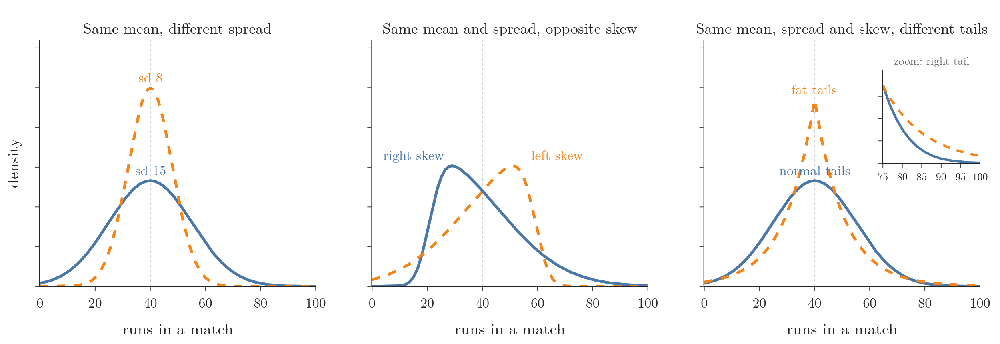
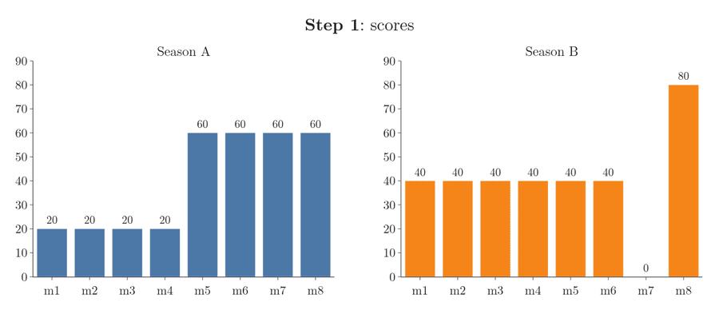
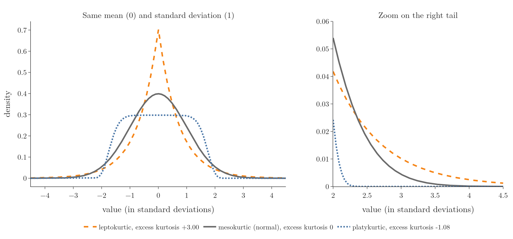
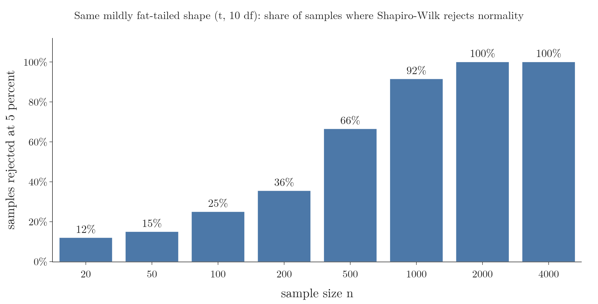
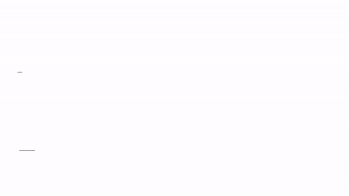
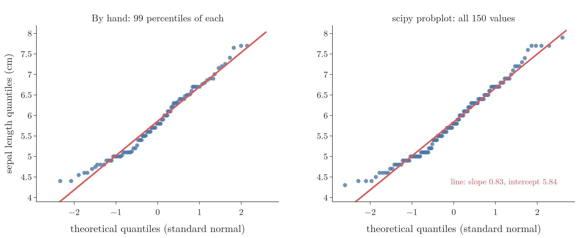
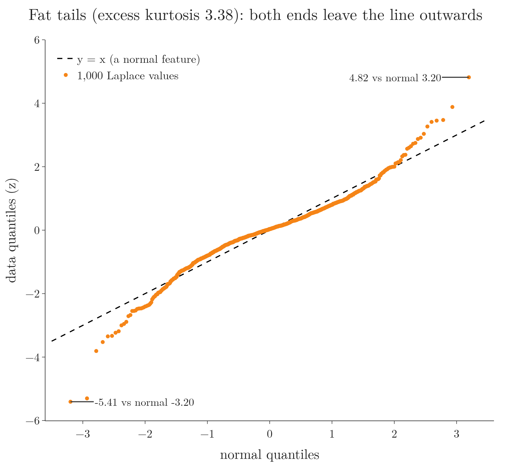
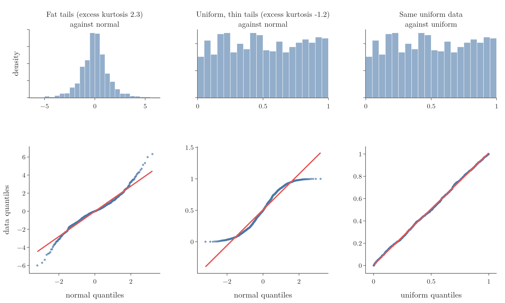

<!-- where-this-fits: generated by course_map/build_map.py; edit concepts.yaml, not this block -->
> **Where this fits:** Pipeline map step 3 (Understand data). See the [Course map](../01-course-map/note.md).
>
> 
>
> - **Builds on:** Normal distribution ([Note 250](../250-normal-distribution/note.md)).
> - **Compare with:** Skewness ([Note 252](../252-skewness/note.md)).
<!-- /where-this-fits -->

## 1. Overview

> **Key point:** Kurtosis measures how heavy the tails of a distribution are; a Q-Q plot shows whether data follows a given distribution, and it shows heavy or light tails at a glance.



Figure 1 shows why we need more than one summary number. In each panel the two seasons have the same mean, yet they tell different stories: first the spread differs, then the skew, and finally only the tails.

The first three are known: the mean and the standard deviation (see the [measures of dispersion Note](../222-measures-of-dispersion/note.md)) and skewness (see the [univariate analysis Note](../20-univariate-analysis/note.md), section 10). This Note adds the fourth, **kurtosis** (G-1021). The Note's second half answers a common interview question: how do we check whether a **feature** (G-772; one variable of the data, one column of the table) is normal? The main tool is the **Q-Q plot** (G-1596), which also works for distributions other than the normal.

## 2. Four summary numbers of a distribution

> **Key point:** Mean, standard deviation, skewness and kurtosis each add one layer of information about a distribution's shape.

Take a batter who plays 100 matches in each of two seasons and averages 40 runs per match in both. By the mean alone the two seasons are identical. Figure 1 shows three ways in which they can still differ.

1. **Spread (left panel).** In the season with the narrower curve (standard deviation 8), most scores lie close to 40. The batter was more consistent: fewer centuries, but also fewer ducks (scores of 0).
2. **Skew (middle panel).** Same mean, same standard deviation. In one season the batter usually made modest scores with a few big ones (right skew); in the other, usually big scores with a few failures (left skew).
3. **Tails (right panel).** Same mean, same standard deviation, same skew (0). The dashed curve has fatter tails: its density stays above zero further out (see the inset). That season had more extreme scores on both sides, more ducks and more centuries, balanced so that the mean and spread stay the same.

The third difference is what kurtosis measures. Each number is a new perspective on the same data:

| Number | Question it answers | Figure 1 |
|---|---|---|
| Mean | Where is the centre? | the same in all panels |
| Standard deviation | How spread out are the values? | left panel |
| Skewness | Is one tail longer than the other? | middle panel |
| Kurtosis | How heavy are the tails? | right panel |

### 2.1 Statistical moments

> **Key point:** These four numbers are the first four statistical moments of a distribution.

In statistics these numbers are called **moments** (G-1882): averages of the distances from the mean raised to a power. The first four are:

- **1st moment:** the mean.
- **2nd moment:** the **variance** (G-2074), the average squared distance from the mean. The standard deviation is its square root, so the two carry the same information.
- **3rd moment:** skewness, from the cubed distances.
- **4th moment:** kurtosis, from the distances raised to the fourth power.

There are higher moments, but these four are the ones in common use.

## 3. Kurtosis: a measure of tailedness

> **Key point:** Kurtosis measures the tailedness of a distribution: how often values far from the mean occur; fat tails mean more outliers.

Kurtosis (from the Greek for "curved, arching") is the fourth statistical moment. Kurtosis is a measure of the **tailedness** (G-1944) of the probability distribution of a real-valued random variable. Like skewness, it describes one particular aspect of the distribution's shape.

A **fat tail** (G-757), or heavy tail, is a tail that falls to zero slowly. Far-away values then have a noticeable density, so they occur more often than in a curve whose tails drop quickly. In other words:

- **fat tails:** many values far from the mean, so many outliers;
- **thin tails:** few values far from the mean, so few outliers.

So when someone asks what kurtosis is, the short answer is: how fat the tails of a distribution are, which means how prone it is to outliers.

### 3.1 Kurtosis is not peakedness

> **Key point:** Kurtosis is about the tails, not the height of the peak; descriptions of it as "peakedness" are wrong.

Many books and websites describe kurtosis as how **peaked** or flat a curve is, or as "peakedness plus tails". Both are incorrect. The statistician Peter Westfall showed that kurtosis has only one clear interpretation: **tail extremity**, meaning either outliers that are present in the data, or a tendency to produce outliers (Westfall 2014).

The reason is in the formula below. Values near the mean contribute almost nothing to it, so the shape of the peak hardly matters; values far from the mean dominate it.

> **Extra:** A fat-tailed curve with the same standard deviation as a normal curve often does have a sharper peak (Figure 3), which is where the "peakedness" idea came from. But we can build distributions with a flat top and huge kurtosis, or a sharp peak and low kurtosis (Westfall 2014). The tails decide, not the peak.

### 3.2 The kurtosis formula

> **Key point:** Kurtosis is the average of the z-scores raised to the fourth power.

Each value's z-score is its distance from the mean in standard deviations (see the [standardization Note](../24-standardization/note.md)). Raising z-scores to the fourth power makes far values count enormously: a value 2 standard deviations away contributes $2^4 = 16$, while one 0.5 away contributes only $0.5^4 = 0.0625$.

1. **In words:** standardize every value, raise each z-score to the fourth power, and average.
2. **Formula:** for $n$ values with mean $\bar{x}$ and standard deviation $\sigma$ (dividing by $n$), and with $m_2$ and $m_4$ the average squared and fourth-power distances from the mean,
   $$\text{kurtosis} = \frac{1}{n}\sum_{i=1}^{n}\left(\frac{x_i - \bar{x}}{\sigma}\right)^4 = \frac{m_4}{m_2^{2}}$$
3. **Example:** two seasons of 8 matches each, both with mean 40 and standard deviation 20.
   - Season A: 20, 20, 20, 20, 60, 60, 60, 60. Every score is exactly 1 standard deviation from the mean, so every $z^4 = 1$:
     $$\text{kurtosis of A} = \frac{8 \times 1}{8} = 1$$
   - Season B: six scores of 40, one duck (0) and one 80. Six z-scores are 0 and two are $\pm 2$:
     $$\text{kurtosis of B} = \frac{6 \times 0 + 2 \times 2^4}{8} = \frac{32}{8} = 4$$

   Same mean, same spread, both symmetric; season B's two extreme scores give it four times the kurtosis.

Figure 2 plays the computation. Watch step 3: raising to the fourth power turns season A's eight z-scores of $\pm 1$ into eight 1s, but turns season B's two z-scores of $\pm 2$ into two 16s. Those two matches alone decide season B's kurtosis; its six scores at the mean add nothing.



## 4. Excess kurtosis and the three types

> **Key point:** Excess kurtosis is kurtosis minus 3, the kurtosis of every normal distribution; positive means fatter tails than normal (leptokurtic), negative means thinner (platykurtic), zero means normal-like (mesokurtic).

Every normal distribution, whatever its mean and standard deviation, has kurtosis exactly 3. So kurtosis is usually reported relative to the normal:

1. **In words:** subtract the normal distribution's kurtosis, 3.
2. **Formula:**
   $$\text{excess kurtosis} = \text{kurtosis} - 3$$
3. **Example:** season A has $1 - 3 = -2$; season B has $4 - 3 = +1$.

**Excess kurtosis** (G-720) measures how much heavier or lighter a distribution's tails are than those of a normal distribution. Excess kurtosis sorts distributions into three types (Figure 3):

| Type | Excess kurtosis | Tails compared with normal | Finance example |
|---|---|---|---|
| **Leptokurtic** (G-1081; "lepto" = slender) | above 0 | fatter: more extreme values, more outliers | a fund with sudden price jumps |
| **Mesokurtic** (G-1212; "meso" = middle) | 0 | the same | a balanced fund |
| **Platykurtic** (G-1504; "platy" = broad) | below 0 | thinner: fewer extreme values | a stable fund with little price movement |



In Figure 3 the three curves have the same mean, the same standard deviation and no skew. The zoom on the right shows what differs. Beyond 3 standard deviations the leptokurtic curve has 1.44% of its area, the normal curve 0.27% and the platykurtic one practically none.

The prime example of a mesokurtic distribution is the normal distribution itself, for any values of its parameters. The uniform distribution (next Note) is strongly platykurtic, with excess kurtosis $-1.2$: it has no tails at all.

> **Python:** Kurtosis in scipy and pandas.
>
> ```python
> import pandas as pd
> from scipy import stats
>
> b = [40, 40, 40, 40, 40, 40, 0, 80]
> # excess kurtosis by default (fisher=True)
> stats.kurtosis(b)                 # 1.0
> # plain kurtosis
> stats.kurtosis(b, fisher=False)   # 4.0
> # pandas: excess, with a small-sample correction
> pd.Series(b).kurt()               # 3.5
> ```
>
> scipy (by default) and pandas report **excess** kurtosis and simply call it "kurtosis", so a normal feature shows about 0, not 3. pandas also corrects for sample size, which matters a lot with 8 values (3.5 against 1.0) and little with hundreds (0.478 against 0.461 for 500 normal values in the Notebook).

## 5. Where kurtosis matters: kurtosis risk

> **Key point:** In finance, high kurtosis in an asset's returns means a higher chance of extreme gains and extreme losses, called kurtosis risk.

Kurtosis is not needed in every analysis, but finance is one field that relies on it. **Kurtosis risk** (G-1020) is the risk that comes from the possibility of extreme outcomes, the fat tails, in the distribution of returns of an asset or a portfolio.

Picture the distribution of returns of a mutual fund. A fat tail on both sides means many investors made a lot of money and many lost a lot. Such a fund is called **volatile** (G-2094).

So analysts plot the return distribution of an asset and compute its kurtosis. If the kurtosis is high, investors are warned that extreme gains and extreme losses are both more likely than a normal curve would suggest, and they can adjust their strategy for it.

## 6. Is a feature normally distributed?

> **Key point:** Besides plots, a statistical test such as Shapiro-Wilk checks normality with a p-value; it is best read together with a Q-Q plot.

Many methods assume that a feature is normally distributed, so "how do we know whether a feature is normal?" is a common interview question. The visual checks, a density plot and a Q-Q plot, are taught in the [function transformer Note](../30-function-transformer/note.md) (section 4); the Q-Q plot is the most informative and gets a second look below.

The third way is a **statistical test** (G-1881). The **Shapiro-Wilk test** (G-1788) (see the [one-sample t-test Note](../301-one-sample-t-test/note.md), section 5) and the **Anderson-Darling test** (G-200) decide with the help of a **p-value** (G-1433); they come after hypothesis testing.

> **Extra:** For the 150 iris sepal lengths of Section 7.3, `stats.shapiro(sepal)` gives a p-value of 0.010. At the usual 5% level the test rejects normality, even though the histogram looks roughly like a bell. With large samples these tests flag even small departures from normality (Ghasemi and Zahediasl 2012), so they are best read together with a Q-Q plot.

Figure 4 tests that claim on data of one fixed shape: a Student t distribution with 10 degrees of freedom, a bell with tails only slightly fatter than normal. For each sample size we draw 200 samples and count how often Shapiro-Wilk rejects normality at 5 percent:

- with 20 values it rejects 12 percent of the samples, close to the 5 percent it would reject for truly normal data;
- with 500 values, 66 percent;
- with 2,000 or more, every sample.

The shape never changed; only the sample grew. A small p-value on a large sample can mean a departure too small to matter, which is why we also look at the Q-Q plot.



## 7. Building a Q-Q plot

> **Key point:** A Q-Q plot pairs each sorted data value with the matching quantile of a theoretical distribution; the quantiles can come from cutting the curve into equal-area strips, or from the percentiles of a large generated sample.

How to read a Q-Q plot, and a five-value build, are in the [function transformer Note](../30-function-transformer/note.md) (sections 4.1 and 4.2). Here we build the plot twice: first on 15 values, where every point can be followed by eye, and then from percentiles (see the [percentiles and box plots Note](../230-percentiles-and-box-plots/note.md)), which needs no formula.

### 7.1 Fifteen values, one point each

> **Key point:** Cut a normal curve into strips of equal area; the cuts are the normal quantiles, and each one is paired with one sorted data value.

Take 15 sepal lengths: every tenth one of the 150 sorted iris values (Section 7.3), from 4.5 cm to 7.6 cm. Is their shape normal? Figure 5 answers in four steps.

1. **Sort the data.** Each of the 15 sorted values is one **quantile** (G-1599) of the data: the smallest, the second smallest, and so on.
2. **Cut a normal curve into equal-area strips.** Any normal curve will do; we take mean 0 and standard deviation 1. Fifteen cuts make 16 strips, and each strip holds the same share of the area, 1/16, so a normal value is equally likely to land in any strip. The strips at the edges are wide, because the curve is low there and a strip needs more width to collect its 1/16. The strips in the middle are narrow, because the curve is high. The positions of the cuts are the **theoretical quantiles** (G-1968): $-1.53$, $-1.15$, $-0.89$, ..., $1.53$.
3. **Pair them, one point each.** The smallest value, 4.5 cm, goes with the first cut, $-1.53$: a horizontal dotted line from 4.5 and a vertical dotted line from $-1.53$ cross at the first point. The second value, 4.8 cm, goes with $-1.15$; the third, 5.0 cm, with $-0.89$; and so on for all 15.
4. **Draw a straight line through the points.** If the data is normal, its values are spaced like the cuts: crowded in the middle and spread out at the ends. The points then fall on a straight line.

{height=60%}

In Figure 5, watch step 2: the two outer strips are several times wider than the middle ones. In the last frame the 15 points stay close to the line, so these values are roughly normal.

With 150 or more values we do the same pairing with percentiles, as follows.

### 7.2 The steps with percentiles

> **Key point:** Our data on the y axis, a theoretical distribution on the x axis, one point per quantile.

We compare our data $X$ with a **theoretical distribution** $Y$: one whose type we already know, here the normal distribution (see the [normal distribution Note](../250-normal-distribution/note.md)). Figure 6 shows the steps.

1. **Theoretical data.** Generate many values from the theoretical distribution, say 1,000 values from a normal distribution with mean 0 and standard deviation 1.
2. **Sort both and take quantiles.** Sort our data and compute its percentiles: 1st, 2nd, ..., 99th. Do the same for the theoretical data.
3. **Pair them.** The 1st percentile of $Y$ with the 1st percentile of $X$, the 2nd with the 2nd, and so on.
4. **Plot the pairs.** Theoretical quantile on the x axis, data quantile on the y axis.

{height=55%}

Points on one straight line still mean that $X$ has the same shape as $Y$. The line does not need to be the diagonal $y = x$. Our data can have any mean and standard deviation; those only move and tilt the line (Section 7.4).

### 7.3 The iris sepal lengths

> **Key point:** The 150 sepal lengths lie close to the line in the middle and stray at the ends: roughly normal, but not perfectly.

The iris dataset holds measurements of 150 flowers. Its `sepal length` feature looks like a bell in a density plot. Figure 7 (left) builds its Q-Q plot by hand, with 99 percentiles of the data against 99 percentiles of 1,000 standard normal values. The right panel is the ready-made version.



The points follow the line closely in the middle, but not every point touches it, and the lowest and highest values drift away. So the sepal lengths are roughly normal, not perfectly normal. The steps of points come from the data being rounded to 0.1 cm: the 150 sepal lengths take only 35 distinct values, so many neighbouring percentiles share the same value and line up horizontally.

> **Python:** A Q-Q plot by hand, then the shortcut.
>
> ```python
> import numpy as np
> from scipy import stats
> from sklearn.datasets import load_iris
>
> sepal = load_iris().data[:, 0]
> rng = np.random.default_rng(42)
> theo = rng.normal(0, 1, 1000)
> pct = np.arange(1, 100)       # 1st to 99th
> y_quant = np.percentile(sepal, pct)
> x_quant = np.percentile(theo, pct)
> # plot x_quant against y_quant as a scatter
>
> # shortcut: sorting and quantiles done for us
> (osm, osr), (slope, icpt, r) = \
>     stats.probplot(sepal, dist="norm")
> ```
>
> `probplot` uses exact normal quantiles instead of a generated sample, and one point per data value. The Notebook (`notebook.ipynb`) draws both panels with Plotly.

### 7.4 Which reference line?

> **Key point:** The diagonal $y = x$ only fits standardized data; for raw data use a line fitted through the points.

statsmodels has a one-line Q-Q plot, `sm.qqplot(x, line=...)`, with four choices of reference line:

- `"45"`: the diagonal $y = x$;
- `"s"`: a standardized line, with the data's standard deviation as slope and its mean as intercept;
- `"r"`: a regression line fitted through the points;
- `"q"`: a line through the first and third quartiles.

The diagonal only works when the data has mean 0 and standard deviation 1, or when we pass `fit=True`, which standardizes the data first (statsmodels `ProbPlot` docs). The sepal lengths have mean 5.84 and standard deviation 0.83, so their points lie around the line with slope 0.83 and intercept 5.84 (Figure 7, right), far from $y = x$. For raw data we use `"s"`, `"r"` or `"q"`; scipy's `probplot` always draws the regression line.

> **Python:** `sm.qqplot` draws with matplotlib, which these Notes do not use. The same numbers come from `sm.ProbPlot(x, fit=True)`, whose `theoretical_quantiles` and `sample_quantiles` can be plotted with Plotly.

## 8. Reading tails on a Q-Q plot

> **Key point:** Fat tails make the points leave the line at both ends, outwards; thin tails bend them back in, in an S shape.

The basic shapes, including fat tails leaving the line outwards at both ends, are in the [function transformer Note](../30-function-transformer/note.md) (Figure 5). Kurtosis explains that fat-tail shape: a leptokurtic feature has more extreme values on both sides than a normal one. Such a curve often also looks too peaked in the middle, but it is the tails that move the points (Section 3.1).

Figure 8 shows the fat-tail shape on 1,000 standardized values from the peaked, fat-tailed **Laplace distribution** (G-1044), the Notebook's check. The middle point sits on the line, while the lowest and highest values are $-5.41$ and $4.82$ where the normal quantiles are only $-3.20$ and $3.20$: both ends leave the line outwards.

{height=45%}

Thin tails (platykurtic) give the opposite shape, which Figure 9 (left) shows for uniform data:

- the middle points sit near the line;
- the end points flatten out, inside the line, in an S shape: the extreme values are less extreme than normal;
- with mild thin tails the points stay near the line and stray only slightly.

The more the points leave the line, the further the data is from normal.

{height=55%}

## 9. Q-Q plots for other distributions

> **Key point:** A Q-Q plot can compare data with any theoretical distribution, not only the normal: uniform, log-normal, Pareto and others.

A common misunderstanding is that Q-Q plots can only detect normal distributions. By definition a Q-Q plot compares two distributions, so the theoretical one can be anything. Only the quantiles on the x axis change.

Figure 9 shows 1,000 values drawn from a **uniform distribution** between 0 and 1, where every value in the range is equally likely (the [uniform and log-normal distributions Note](../261-uniform-and-log-normal/note.md)). The histogram looks flat.

- **Against the normal (left):** an S-shaped curve, the thin-tail shape. The data is clearly not normal.
- **Against the uniform (right):** almost every point is on the line. The data is uniform.

> **Python:** Pass the theoretical distribution with `dist`.
>
> ```python
> uni = rng.uniform(0, 1, 1000)
> (osm, osr), _ = stats.probplot(uni, dist=stats.uniform)
> # statsmodels: sm.ProbPlot(uni, dist=stats.uniform)
> ```
>
> The default `dist` is the normal distribution, which is why it was not passed in Section 7.

The same idea checks for the log-normal and Pareto distributions in the next two Notes.

## 10. Summary

| Idea | Meaning | Example |
|---|---|---|
| Moments | Mean, variance, skewness, kurtosis | 1st to 4th |
| Kurtosis | Average of $z^4$: tail heaviness | season A 1, season B 4 |
| Excess kurtosis | Kurtosis $- 3$; normal = 0 | A $-2$, B $+1$ |
| Leptokurtic | Excess above 0: fat tails, more outliers | volatile fund |
| Platykurtic | Excess below 0: thin tails | uniform, $-1.2$ |
| Q-Q plot | Data quantiles against theoretical quantiles | iris sepal length vs normal |

- Kurtosis is about tails, not peakedness.
- Most software reports excess kurtosis; a normal feature gives about 0.
- Three ways to check normality: plot, Q-Q plot, statistical test.
- Points on a straight line: same shape. The diagonal $y = x$ only fits standardized data.
- Fat tails leave the line outwards at both ends; thin tails bend inwards (S shape).
- Any theoretical distribution can go on the x axis of a Q-Q plot.

## 11. Sources

**Built from**

- CampusX, "Session 42 - Non-Gaussian Probability Distributions | DSMP 2023", YouTube, https://www.youtube.com/watch?v=U6QCc_3zgUk
- StatQuest with Josh Starmer, "Quantile-Quantile Plots (QQ plots), Clearly Explained!!!", YouTube, https://www.youtube.com/watch?v=okjYjClSjOg

**Other references**

- Ghasemi, A. and Zahediasl, S. (2012). "Normality Tests for Statistical Analysis: A Guide for Non-Statisticians." *International Journal of Endocrinology and Metabolism* 10(2).
- statsmodels documentation, `ProbPlot` (`fit=True`) and `qqplot` (`line` options).
- Westfall, P. H. (2014). "Kurtosis as Peakedness, 1905-2014. R.I.P." *The American Statistician* 68(3).

## 12. Key terms

| Term | Meaning |
|---|---|
| Feature | One variable of the data, one column of the table |
| Statistical moments | Averages of distances from the mean raised to a power: mean, variance, skewness, kurtosis |
| Kurtosis | The fourth moment: the average of the z-scores to the fourth power; measures tail heaviness |
| Tailedness | How much probability lies far from the mean, in the tails |
| Fat tail (heavy tail) | A tail that falls to zero slowly, so extreme values are relatively common |
| Excess kurtosis | Kurtosis minus 3, so a normal distribution scores 0 |
| Leptokurtic | Excess kurtosis above 0: fatter tails than normal |
| Mesokurtic | Excess kurtosis of 0, like every normal distribution |
| Platykurtic | Excess kurtosis below 0: thinner tails than normal |
| Kurtosis risk | In finance, the risk of extreme gains or losses from fat-tailed returns |
| Quantiles | Values that cut sorted data, or a distribution, into equal-sized groups |
| Theoretical quantile | The position of a cut that splits the theoretical curve into equal-area strips; the x axis of a Q-Q plot |
| Theoretical distribution | The known distribution that data is compared with, for example on a Q-Q plot |
| Anderson-Darling test | Another statistical test of whether data follows a given distribution |
