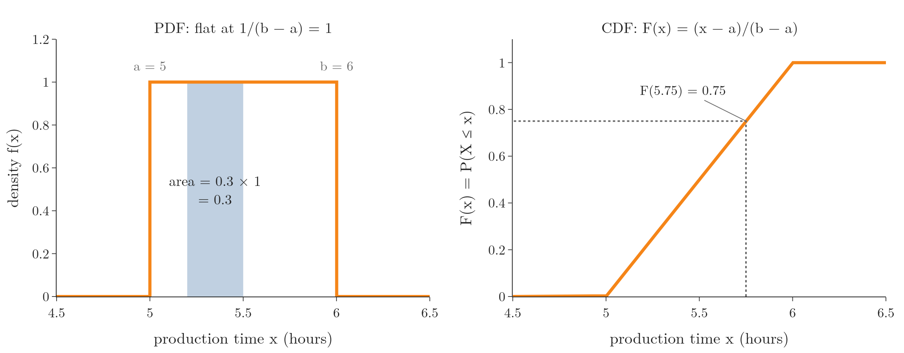
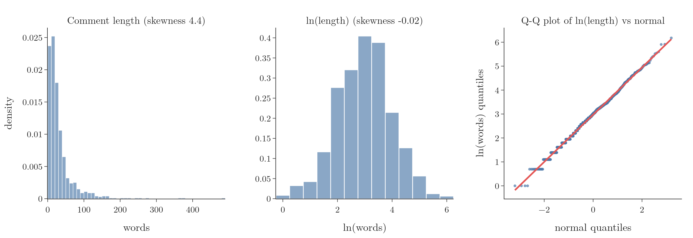

<!-- where-this-fits: generated by course_map/build_map.py; edit concepts.yaml, not this block -->
> **Where this fits:** Pipeline map step 0 (Foundations). See the [Course map](../01-course-map/note.md).
>
> 
>
> - **Builds on:** Probability distributions ([Note 240](../240-random-variables-and-distributions/note.md)).
> - **Compare with:** Pareto distribution and power laws ([Note 262](../262-pareto-and-power-law/note.md)).
<!-- /where-this-fits -->

## 1. Overview

> **Key point:** Beyond the normal distribution, three continuous distributions appear constantly: the flat uniform, the right-skewed log-normal, and the power-law Pareto; this Note covers the first two.

{height=40%}

The normal distribution (see the [normal distribution Note](../250-normal-distribution/note.md)) is the best studied distribution, but there are hundreds of others. Distributions that are not normal are called **non-Gaussian**. Figure 1 shows the three famous continuous ones of this Note and the next (they were first listed in the [random variables and distributions Note](../240-random-variables-and-distributions/note.md)).

For each one we look at its definition, its PDF and parameters, where it shows up, and how to recognise it in data. Recognising uses the Q-Q plot of the [kurtosis and Q-Q plots Note](../260-kurtosis-and-qq-plots/note.md).

## 2. The uniform distribution

> **Key point:** In a uniform distribution every outcome in a given range is equally likely; it comes in a discrete and a continuous version.

The **uniform distribution** is a probability distribution in which all outcomes are equally likely within a given range. If we pick a random value from that range, any value is as likely as any other.

It comes in two kinds, one for each kind of random variable:

- **Discrete uniform:** a fair die. Each face from 1 to 6 has probability $1/6$, so the PMF is six bars of equal height (see the [PMF and discrete CDF Note](../241-pmf-and-discrete-cdf/note.md)).
- **Continuous uniform:** a continuous random variable spread evenly over a range, such as a production time anywhere between 5 and 6 hours. This Note is about this kind.

### 2.1 Notation and parameters

> **Key point:** $X \sim U(a, b)$: the two parameters are the lower end $a$ and the upper end $b$ of the range.

We write a continuous uniform random variable as
$$X \sim U(a, b)$$
read "$X$ follows a uniform distribution from $a$ to $b$". The two parameters are the ends of the range: $a$ is the lowest possible value and $b$ the highest, with $b > a$.

### 2.2 The PDF of the continuous uniform

> **Key point:** The PDF is a flat line at height $1/(b - a)$ between $a$ and $b$, and 0 everywhere else.

The graph of the PDF is a rectangle (Figure 2, left). Its height follows from one rule: the total area under every PDF is 1 (see the [PDF and continuous CDF Note](../242-pdf-and-continuous-cdf/note.md)). The rectangle is $b - a$ wide, so its height must be $1/(b - a)$.

1. **In words:** inside the range, the density is 1 divided by the width of the range; outside, it is 0.
2. **Formula:**
   $$f(x) = \begin{cases} \dfrac{1}{b - a} & \text{if } a \le x \le b \\ 0 & \text{otherwise} \end{cases}$$
3. **Example:** a machine takes between 5 and 6 hours to produce one product, every time in that range equally likely: $X \sim U(5, 6)$. The density is $1/(6 - 5) = 1$ per hour. The probability that a product takes between 5.2 and 5.5 hours is the area of a rectangle:
   $$P(5.2 \le X \le 5.5) = (5.5 - 5.2) \times 1 = 0.3$$



The continuous uniform distribution is **symmetric**, like the normal distribution: its skewness is 0. Its excess kurtosis is $-1.2$, as it has no tails at all (see the [kurtosis and Q-Q plots Note](../260-kurtosis-and-qq-plots/note.md)).

> **Extra:** The CDF, mean and variance of $U(a, b)$.
>
> 1. **In words:** the share of the range at or below $x$ is the CDF; the mean is the midpoint; the variance grows with the square of the width.
> 2. **Formula:** for $a \le x \le b$,
>    $$F(x) = \frac{x - a}{b - a}, \qquad \text{mean} = \frac{a + b}{2}, \qquad \text{variance} = \frac{(b - a)^2}{12}$$
> 3. **Example:** for $U(5, 6)$, $F(5.75) = 0.75/1 = 0.75$ (Figure 2, right), the mean is 5.5 hours, and the variance is $1/12 = 0.0833$, a standard deviation of 0.289 hours.
>
> The CDF is a straight ramp from 0 at $a$ to 1 at $b$, because area builds up at a constant rate.

### 2.3 Where the continuous uniform appears

> **Key point:** It appears when a quantity is equally likely anywhere in a fixed range, and it works behind the scenes in many ML techniques.

Everyday examples are quantities that are equally likely anywhere within fixed limits:

- the time a machine takes to produce a product, when it ranges evenly from 5 to 6 hours;
- the waiting time for a bus that comes exactly every 10 minutes, for someone arriving at a random moment: anywhere from 0 to 10 minutes.

A height chosen at random from a group whose heights all lie between 5.6 and 6 feet is sometimes given as an example. It is only a rough one: restricting a normal variable to a range does not make it flat, so within the range the heights still bunch towards the middle of the bell.

In machine learning, the uniform distribution mostly works behind the scenes:

- **Random initialization.** Neural networks and k-means clustering (see the [k-means Note](../128-kmeans-intuition/note.md)) start from random parameter values and improve them step by step. The start strongly affects the final result. Drawing the start from a uniform distribution gives every value in the range the same chance.
- **Sampling.** Splitting data into training and test sets, or drawing a random subset, picks each row with equal probability (the train-test split of the [toy project Note](../13-toy-project/note.md)).
- **Data augmentation.** In deep learning with images, a small dataset is enlarged by making new images from old ones: zoomed in a little, shrunk, shifted, rotated. The amounts are drawn at random, often uniformly.
- **Hyperparameter tuning.** Random search tries hyperparameter values drawn from ranges, often uniformly (see the [random forest tuning Note](../112-random-forest-tuning/note.md)).
- **Pseudo-random number generators.** Computers first produce uniform random numbers and turn them into every other distribution from there.

> **Python:** Uniform values and the uniform distribution.
>
> ```python
> import numpy as np
> from scipy import stats
>
> rng = np.random.default_rng(42)
> times = rng.uniform(5, 6, size=1000)   # from 5 to 6
> # scipy uses loc = a and scale = b - a
> u = stats.uniform(loc=5, scale=1)
> u.pdf(5.3)                  # 1.0
> u.cdf(5.5) - u.cdf(5.2)     # 0.3
> ```
>
> A common slip: `stats.uniform(5, 6)` means $U(5, 11)$, because the second number is the width, not the upper end.

## 3. The log-normal distribution

> **Key point:** A random variable is log-normal when its logarithm is normally distributed; the variable itself is right-skewed with a long tail.

A **log-normal distribution** is a heavy-tailed continuous probability distribution of a random variable whose logarithm is normally distributed. Two things define it:

1. **The data is right-skewed:** many small values and a long tail of large ones.
2. **The log of the data is normal:** take the natural log of every value and plot the new values; they form a bell curve.

The second condition is the test. Not every right-skewed distribution is log-normal, only one whose logs come out normal:
$$X \text{ is log-normal} \iff \ln X \text{ is normal}$$

### 3.1 Notation and parameters

> **Key point:** The two parameters $\mu$ and $\sigma$ are the mean and standard deviation of $\ln X$, not of $X$.

We write
$$X \sim \text{Lognormal}(\mu, \sigma^2), \qquad \text{which means} \qquad \ln X \sim N(\mu, \sigma^2)$$

The parameters $\mu$ and $\sigma$ look like those of the normal distribution, and they are: but they belong to the logged values. The mean and standard deviation of $X$ itself are different numbers.

Figure 3 keeps $\mu = 0$ and increases $\sigma$. A larger $\sigma$ spreads the curve out and stretches the right tail. All three curves start at 0: a log-normal variable is always positive.

{height=38%}

### 3.2 The log-normal PDF

> **Key point:** The log-normal PDF is the normal PDF with $\ln x$ in place of $x$, divided by an extra $x$.

1. **In words:** take the normal PDF, put $\ln x$ where $x$ was, and divide by $x$. The extra $x$ comes from the log transformation: it squeezes large values together, and dividing by $x$ keeps the total area at 1.
2. **Formula:** for $x > 0$,
   $$f(x) = \frac{1}{x\,\sigma\sqrt{2\pi}}\; e^{-\frac{(\ln x - \mu)^2}{2\sigma^2}}$$
3. **Example:** comment lengths on a forum with $\mu = 3$ and $\sigma = 1$ (in log-words). At $x = 20$ words, $\ln 20 = 2.996 \approx 3$, so the exponent is almost 0 and $e^{0} = 1$:
   $$f(20) = \frac{1}{20 \times 1 \times 2.5066} \times 1 = 0.0199$$

The curve looks like a normal curve pushed to the left with its right side stretched out (Figure 3). The CDF behaves like the normal CDF too: a larger $\sigma$ makes it rise more slowly.

The resemblance is only in the formulas. The log-normal variable itself is skewed and not symmetric; it is $\ln X$ that is normal and gets all the benefits of normality.

> **Extra:** Because $\ln X$ is normal, every log-normal probability is a normal probability in disguise.
>
> 1. **In words:** take the log of the cut-off, standardize it with $\mu$ and $\sigma$, and use the normal CDF $\Phi$.
> 2. **Formula:**
>    $$P(X \le x) = \Phi\!\left(\frac{\ln x - \mu}{\sigma}\right), \qquad \text{median} = e^{\mu}, \qquad \text{mean} = e^{\mu + \sigma^2/2}$$
> 3. **Example:** for the comments, the share longer than 100 words is
>    $$P(X > 100) = 1 - \Phi\!\left(\frac{\ln 100 - 3}{1}\right) = 1 - \Phi(1.605) = 0.054$$
>    The median comment has $e^3 = 20.1$ words, but the mean is $e^{3.5} = 33.1$: the long right tail pulls the mean above the median.

### 3.3 Where the log-normal appears

> **Key point:** Log-normal data is common in internet applications: comment lengths, time spent on articles, and many human behaviours.

The log-normal distribution appears in biology, medicine, chemistry, hydrology and economics, and it is especially common in internet applications:

- **Length of comments** in online discussion forums: most comments are a few words; a few are very long.
- **Time spent reading online articles:** many readers leave quickly; a few stay to the end and read the other comments too.
- **Length of chess games:** many games end quickly, and a few go on for a very long time.
- **Income:** there is evidence that the income of about 97 to 99% of the population is log-normally distributed: many people earn little, few earn a lot. (The richest 1 to 3% follow a Pareto distribution, the [next Note](../262-pareto-and-power-law/note.md).)

### 3.4 How to check whether data is log-normal

> **Key point:** Take the log of every value and check the logs for normality with a Q-Q plot; if the logs are normal, the data is log-normal.

This is a common interview question, and the answer follows from the definition:

1. Take the natural log of every value of $X$; call the result $Y = \ln X$.
2. Draw a Q-Q plot of $Y$ against the normal distribution (see the [kurtosis and Q-Q plots Note](../260-kurtosis-and-qq-plots/note.md)).
3. If the points lie on a straight line, $Y$ is normal, so $X$ is log-normal.

Figure 4 does this for 1,000 comment lengths simulated with $\mu = 3$ and $\sigma = 1$. The raw lengths are strongly right-skewed (skewness 4.4). Their logs form a bell (skewness $-0.02$), and the Q-Q plot of the logs is a straight line.



This is also the payoff of knowing a column is log-normal: the log transform turns it into a normal column, and everything that works on normal data then applies. That transform, and how it helps models such as linear and logistic regression, is in the [function transformer Note](../30-function-transformer/note.md).

> **Python:** Log-normal values, and the scipy parameters.
>
> ```python
> # mean and sigma here are mu and sigma of ln X
> words = rng.lognormal(mean=3, sigma=1, size=1000)
> logs = np.log(words)
> stats.probplot(logs, dist="norm")      # Q-Q plot data
> # scipy: s = sigma, scale = e^mu
> ln = stats.lognorm(s=1, scale=np.exp(3))
> ln.pdf(20)       # 0.0199
> ln.sf(100)       # 0.054, P(X > 100)
> ```
>
> The Notebook (`notebook.ipynb`) rounds the simulated lengths to whole words and draws Figure 4 with Plotly.

## 4. Summary

| | Uniform $U(a, b)$ | Log-normal |
|---|---|---|
| Shape | flat between $a$ and $b$ | right-skewed, long right tail |
| Parameters | $a$, $b$ (ends of the range) | $\mu$, $\sigma$ of $\ln X$ |
| PDF | $1/(b - a)$ on $[a, b]$ (Section 2.2) | normal PDF of $\ln x$, divided by $x$ (Section 3.2) |
| Skewness | 0 (symmetric) | positive |
| Example | production time 5 to 6 hours | comment length, income |
| Check | Q-Q plot against uniform | Q-Q plot of $\ln X$ against normal |
| scipy | `uniform(loc=a, scale=b-a)` | `lognorm(s=σ, scale=exp(μ))` |

- Non-Gaussian simply means not normal.
- The uniform distribution works behind the scenes in ML: initialization, sampling, augmentation, random search.
- A right-skewed column is log-normal only if its logs are normal.
- Log-normal data becomes normal with a log transform.

## 5. Key terms

| Term | Meaning |
|---|---|
| Non-Gaussian distribution | Any distribution that is not normal |
| Uniform distribution | A distribution in which every outcome in a range is equally likely |
| Continuous uniform distribution $U(a, b)$ | A continuous variable spread evenly between $a$ and $b$, with density $1/(b - a)$ |
| Random initialization | Starting a model's parameters at random values, often drawn from a uniform distribution |
| Data augmentation | Enlarging a dataset by making changed copies of its examples, such as zoomed or shifted images |
| $\text{Lognormal}(\mu, \sigma^2)$ | The distribution of $X$ when $\ln X \sim N(\mu, \sigma^2)$ |
