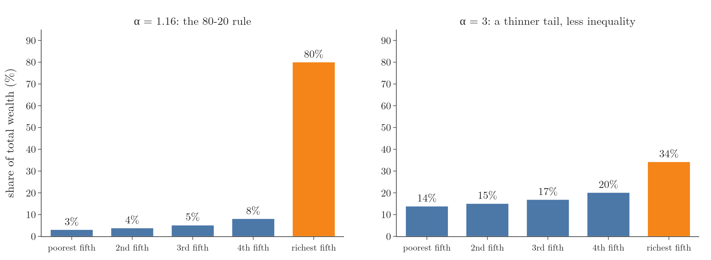
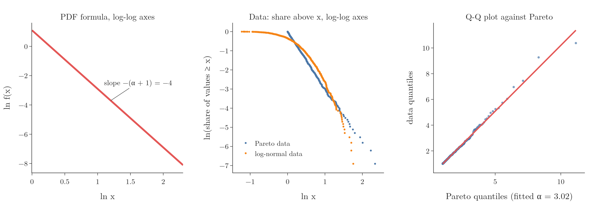

<!-- where-this-fits: generated by course_map/build_map.py; edit concepts.yaml, not this block -->
> **Where this fits:** Pipeline map step 0 (Foundations). See the [Course map](../01-course-map/note.md).
>
> 
>
> - **Compare with:** Log-normal distribution ([Note 261](../261-uniform-and-log-normal/note.md)).
<!-- /where-this-fits -->

## 1. Overview

> **Key point:** The Pareto distribution models quantities where a few items hold most of the total, such as wealth; it follows a power law, and with the right parameter it gives the famous 80-20 rule.



Figure 1 shows what the Pareto distribution is known for. On the left, the richest fifth of the population holds 80% of all the wealth and the other four fifths share the remaining 20%. On the right, a different parameter value gives a much more even split.

The Pareto distribution is the third of the famous non-Gaussian continuous distributions (see Figure 1 of the [uniform and log-normal distributions Note](../261-uniform-and-log-normal/note.md)). It is common in financial and economic data. This Note covers the power law behind it, its PDF and parameters, how to recognise it in data, and ends with how non-normal data is made normal.

## 2. Power laws

> **Key point:** A power law is a relationship $y = k\,x^{a}$ in which one variable is proportional to a power of the other.

The Pareto distribution is a special case of a **power law**: a functional relationship between two variables in which one variable is proportional to a power of the other.

1. **In words:** $y$ equals a constant times $x$ raised to a fixed power.
2. **Formula:**
   $$y = k\,x^{a}$$
   where $k$ is a constant and $a$ is the power. With a negative power, $y$ falls as $x$ grows: a curve that starts high and has a long, slowly falling tail.
3. **Example:** with $k = 1$ and $a = -2$:
   $$x = 1 \Rightarrow y = 1, \qquad x = 2 \Rightarrow y = 0.25, \qquad x = 10 \Rightarrow y = 0.01$$
   Doubling $x$ always divides $y$ by $2^2 = 4$, wherever we start.

### 2.1 The 80-20 rule

> **Key point:** The Pareto principle says that roughly 20% of the causes produce 80% of the results, for example 20% of the people hold 80% of the wealth.

The best-known consequence of a power law is the **80-20 rule**, or **Pareto principle**: about 20% of something accounts for about 80% of the result. In wealth, it says that 20% of the population controls 80% of the wealth, and the other 80% of the people share the remaining 20%.

The Italian economist Vilfredo Pareto found this pattern while studying how land and wealth were distributed, and the distribution is named after him. The 80-20 split is not a law of nature, though: it holds only for one particular value of the distribution's parameter (Section 3.4).

## 3. The Pareto distribution

> **Key point:** The Pareto distribution is a power-law distribution used to model wealth, income and similar quantities; it starts at a minimum value $x_m$ and its tail is controlled by $\alpha$.

The **Pareto distribution** is a probability distribution commonly used to model the distribution of wealth, income and other quantities that show power-law behaviour. Its values start at a smallest possible value and fall away in a long right tail, so it is right-skewed, like the log-normal distribution.

### 3.1 Parameters

> **Key point:** Two parameters: the minimum value $x_m$ (scale) and the shape $\alpha$, which sets how fat the tail is.

- **$x_m$, the minimum value (scale):** the point on the x axis where the curve starts. No value is smaller than $x_m$.
- **$\alpha$, the shape (tail index):** a positive number that controls the tail.

The Pareto distribution is sometimes described as having one parameter, $\alpha$, because $x_m$ only sets the starting point and the units. But both are needed to write the PDF.

### 3.2 The Pareto PDF

> **Key point:** The density is highest at $x_m$, where it equals $\alpha / x_m$, and falls as a power of $x$ after that.

1. **In words:** for every $x$ at or above the minimum, the density is $\alpha$ times $x_m^{\alpha}$, divided by $x$ raised to the power $\alpha + 1$; below the minimum it is 0.
2. **Formula:**
   $$f(x) = \frac{\alpha\, x_m^{\alpha}}{x^{\alpha + 1}} \qquad \text{for } x \ge x_m$$
   This is a power law $k\,x^{a}$ with $k = \alpha x_m^{\alpha}$ and $a = -(\alpha + 1)$.
3. **Example:** with $x_m = 1$ and $\alpha = 3$:
   $$f(1) = \frac{3 \times 1^3}{1^{4}} = 3, \qquad f(2) = \frac{3 \times 1^3}{2^{4}} = \frac{3}{16} = 0.1875$$
   Doubling $x$ divides the density by $2^4 = 16$.


### 3.3 What α does

> **Key point:** A larger $\alpha$ gives a higher peak at $x_m$ and a thinner tail; a smaller $\alpha$ gives a lower peak and a fatter tail.

Figure 2 (left) shows three curves with $x_m = 1$:

- **$\alpha = 3$ (red):** the highest peak, 3, and the thinnest tail. Almost all values are close to $x_m$.
- **$\alpha = 2$ (blue):** in between.
- **$\alpha = 1$ (green):** the lowest peak, 1, and the fattest tail. Very large values are relatively common.

As $\alpha$ grows without limit, the whole curve collapses into a single vertical spike at $x_m$: every value equals $x_m$ and there is no tail at all.

In wealth terms, a fat tail (small $\alpha$) means a few individuals hold huge amounts, so the inequality is **larger**. A thin tail (large $\alpha$) means most people hold amounts near the minimum and the split is more even, as in Figure 1 (right).

### 3.4 The CDF and the 80-20 rule

> **Key point:** The CDF is $1 - (x_m/x)^{\alpha}$; the 80-20 split holds only for $\alpha \approx 1.16$.

1. **In words:** the share of values above $x$ is $(x_m/x)^{\alpha}$, so the share at or below $x$ is 1 minus that.
2. **Formula:**
   $$F(x) = P(X \le x) = 1 - \left(\frac{x_m}{x}\right)^{\alpha} \qquad \text{for } x \ge x_m$$
3. **Example:** with $x_m = 1$ and $\alpha = 3$, the share of values above 2 is $(1/2)^3 = 0.125$, so $F(2) = 0.875$. With $\alpha = 1$, the share above 2 is $(1/2)^1 = 0.5$.

In Figure 2 (right), a smaller $\alpha$ makes the CDF climb to 1 more slowly. That is the fat tail again: a sizeable share of the values lies far out, so it takes a long way along the x axis to collect all of them. A large $\alpha$ reaches 1 quickly, because almost everything sits just above $x_m$.

> **Extra:** The share of the total held by the richest fraction $p$ of a Pareto population is $p^{\,1 - 1/\alpha}$ (for $\alpha > 1$).
>
> 1. **In words:** raise the fraction of people to the power $1 - 1/\alpha$.
> 2. **Formula:**
>    $$\text{share held by the top } p = p^{\,1 - 1/\alpha}$$
> 3. **Example:** for the top 20%, with $\alpha = 1.16$: $0.2^{\,1 - 1/1.16} = 0.2^{0.139} = 0.80$, the 80-20 rule. With $\alpha = 3$: $0.2^{\,2/3} = 0.34$, so the top 20% hold only 34% (Figure 1).
>
> The exact value for the 80-20 rule is $\alpha = \log_4 5 = 1.161$. Also, the mean of a Pareto distribution, $\alpha x_m / (\alpha - 1)$, exists only for $\alpha > 1$: with $\alpha \le 1$ the tail is so fat that the average is infinite.

### 3.5 Where the Pareto distribution appears

> **Key point:** Wealth and income at the top, city and settlement sizes, and file sizes on the internet.

- **Wealth and income:** a small share of people holds most of the wealth. (For most of the population, income is closer to log-normal; the Pareto tail describes the richest few percent.)
- **Human settlements:** many people crowd into a small share of the land, and a few live spread over remote areas. Very roughly, 20% of the area holds 80% of the population.
- **File sizes in internet traffic:** most files are small and a few are huge, so a small share of the files makes up most of the gigabytes transferred.

> **Python:** The Pareto distribution in scipy.
>
> ```python
> from scipy import stats
>
> # b = alpha, scale = x_m (default 1)
> p = stats.pareto(b=3, scale=1)
> p.pdf(2)       # 0.1875
> p.sf(2)        # 0.125, P(X > 2)
> data = p.rvs(size=1000, random_state=42)
> ```
>
> The skewness of a Pareto distribution has a formula, but in practice we let the library compute it from data with `stats.skew`.

## 4. How to check whether data is Pareto

> **Key point:** Two checks: a log-log plot, where a power law becomes a straight line, and a Q-Q plot against a fitted Pareto distribution.

"Given a distribution, how would we know that it is Pareto?" is another common interview question. There are two answers.

### 4.1 The log-log plot

> **Key point:** Taking logs of both sides turns a power law into a straight line, with the power as its slope.

Take the log of both $x$ and $y$ and plot $\ln y$ against $\ln x$. A power law becomes a straight line:

1. **In words:** the log of the Pareto PDF is a constant minus $(\alpha + 1)$ times $\ln x$.
2. **Formula:**
   $$\ln f(x) = \ln\!\left(\alpha x_m^{\alpha}\right) - (\alpha + 1)\ln x$$
3. **Example:** with $x_m = 1$ and $\alpha = 3$: $\ln f(x) = \ln 3 - 4\ln x = 1.099 - 4\ln x$. At $x = e$ (so $\ln x = 1$), $\ln f = 1.099 - 4 = -2.90$. The line has slope $-4$ (Figure 3, left).



Plotting the PDF formula itself always gives a straight line, so Figure 3 (left) only shows what to look for. With real data we do not know the PDF. A practical version plots, for every data value $x$, the share of values at or above $x$. For Pareto data that share is $(x_m/x)^{\alpha}$, whose log is again a straight line, now with slope $-\alpha$.

Figure 3 (middle) does this for 1,000 values from a Pareto distribution ($\alpha = 3$, blue) and 1,000 values from a log-normal distribution (orange). Both are right-skewed, but only the Pareto values give a straight line; the log-normal ones bend downwards. The scattered points at the far right are the few largest values, which are always noisy.

### 4.2 The Q-Q plot against a Pareto distribution

> **Key point:** Fit a Pareto distribution to the data, then draw a Q-Q plot against it; points on the line mean Pareto.

A Q-Q plot can compare data with any distribution (see the [kurtosis and Q-Q plots Note](../260-kurtosis-and-qq-plots/note.md)). Here the theoretical distribution is a Pareto whose $\alpha$ is estimated from the data itself.

Figure 3 (right) shows the 1,000 Pareto values against a fitted Pareto ($\alpha = 3.02$, close to the true 3). Most points lie on the line; the last few, the largest values, move off it a little. That is normal for a heavy tail, where the biggest values vary a lot from sample to sample. So the data is roughly Pareto.

> **Python:** Fit, then Q-Q plot.
>
> ```python
> # estimate alpha with the start fixed at 0 (loc)
> b, loc, scale = stats.pareto.fit(data, floc=0)
> (osm, osr), (slope, icpt, r) = stats.probplot(
>     data, dist=stats.pareto, sparams=(b, loc, scale))
> ```
>
> `sparams` passes the fitted parameters to the theoretical distribution. The Notebook (`notebook.ipynb`) draws all three panels of Figure 3 with Plotly.

## 5. Making data normal: transformations

> **Key point:** Real data is rarely normal; mathematical transformations such as the log, square root, reciprocal, Box-Cox and Yeo-Johnson bring it close to normal.

The normal distribution is so well studied that once data is normal, many calculations and methods become easy. Statistical models such as linear and logistic regression work better on normal-looking columns, while tree-based models do not care. Real data, however, is rarely normal; it is often skewed like the log-normal and Pareto data above.

Mathematical transformations (see the [function transformer Note](../30-function-transformer/note.md)) apply a formula to every value of a column to bring its distribution close to normal. They are covered in the feature engineering Notes:

| Transformation | What it does | Note |
|---|---|---|
| Log, $\log(1 + x)$ | pulls in a long right tail; makes log-normal data normal | [function transformer Note](../30-function-transformer/note.md) |
| Reciprocal, square, square root | other fixed formulas, for other shapes of skew | [function transformer Note](../30-function-transformer/note.md) |
| Box-Cox | learns the best power $\lambda$; positive values only | [power transformer Note](../31-power-transformer/note.md) |
| Yeo-Johnson | Box-Cox adapted to zeros and negative values | [power transformer Note](../31-power-transformer/note.md) |

Each of those Notes checks the result with a Q-Q plot and shows the effect on a model's score, so the workflow is: check the column (density plot, skewness, Q-Q plot), transform it, and check again.

## 6. Summary

| Idea | Formula | Example ($x_m = 1$, $\alpha = 3$) |
|---|---|---|
| Power law | $y = k\,x^{a}$ | $k = 1$, $a = -2$: $y(2) = 0.25$ |
| Pareto PDF | $\alpha x_m^{\alpha} / x^{\alpha + 1}$, $x \ge x_m$ | $f(2) = 0.1875$ |
| Pareto CDF | $1 - (x_m/x)^{\alpha}$ | $F(2) = 0.875$ |
| Share held by top $p$ | $p^{\,1 - 1/\alpha}$ | top 20%: 34% ($\alpha = 1.16$: 80%) |
| Log-log PDF | slope $-(\alpha + 1)$ | slope $-4$ |

- Larger $\alpha$: higher peak at $x_m$, thinner tail, less inequality. Smaller $\alpha$: fatter tail, more inequality.
- The 80-20 rule holds only for $\alpha \approx 1.16$.
- Check for Pareto with a log-log plot (straight line) or a Q-Q plot against a fitted Pareto.
- Non-normal columns are brought close to normal with the transformations of the function and power transformer Notes.

## 7. Key terms

| Term | Meaning |
|---|---|
| Power law | A relationship $y = k\,x^{a}$: one variable proportional to a power of the other |
| 80-20 rule (Pareto principle) | About 20% of the causes produce about 80% of the results, e.g. 20% of people hold 80% of the wealth |
| Pareto distribution | A power-law distribution starting at $x_m$, with PDF $\alpha x_m^{\alpha}/x^{\alpha + 1}$ |
| $x_m$ (Pareto) | The minimum possible value, where the Pareto curve starts and peaks |
| $\alpha$ (Pareto shape) | The tail index: larger means a thinner tail |
| Log-log plot | A plot of $\ln y$ against $\ln x$, on which a power law is a straight line |
