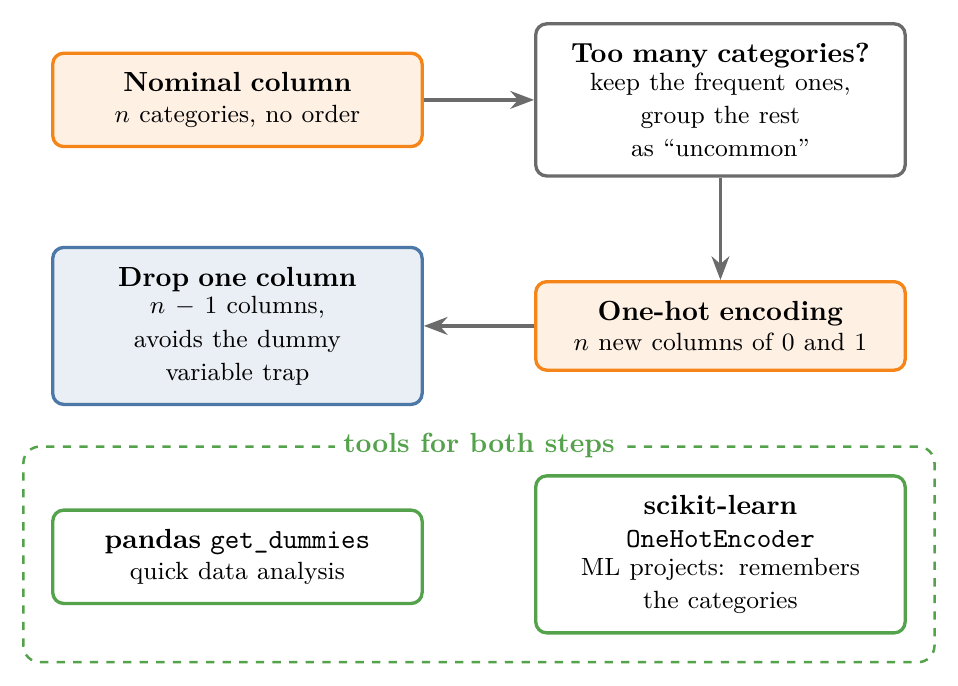
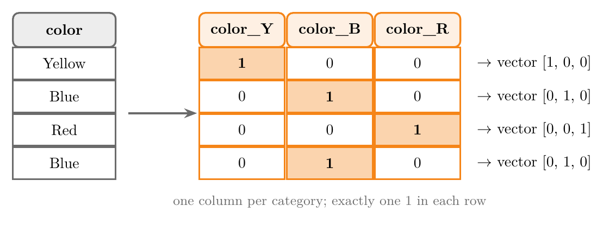
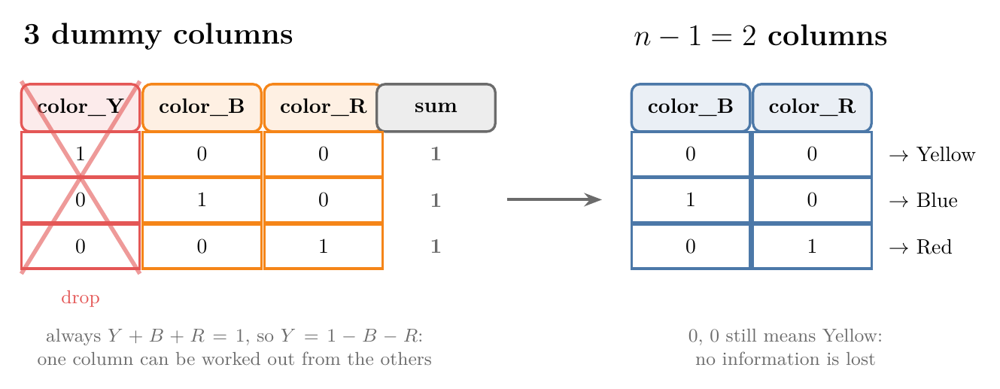
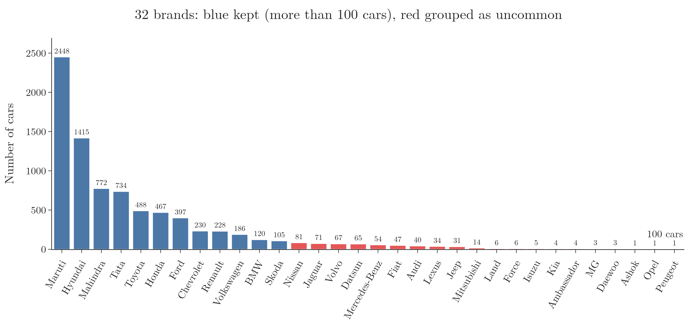
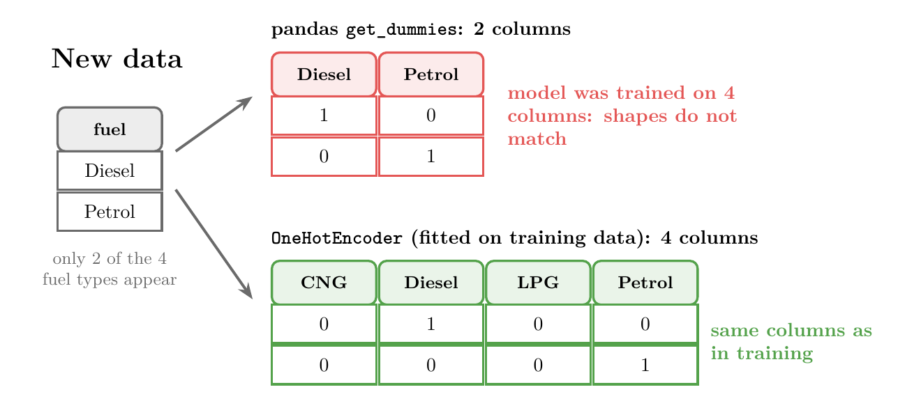

<!-- where-this-fits: generated by course_map/build_map.py; edit concepts.yaml, not this block -->
> **Where this fits:** Pipeline map steps 5 (Engineer features), 8 (Model). See the [Course map](../01-course-map/note.md).
>
> 
>
> - **Builds on:** Encoding categorical data ([Note 26](../26-ordinal-label-encoding/note.md)).
> - **Leads to:** Simple linear regression ([Note 50](../50-simple-linear-regression/note.md)); Assumptions of linear regression ([Note 56](../56-linear-regression-assumptions/note.md)); Elastic Net ([Note 69](../69-elastic-net/note.md)); Softmax regression ([Note 79](../79-softmax-regression/note.md)); Moore-Penrose pseudo-inverse ([Note 613](../613-svd-in-machine-learning/note.md)); ANN for classification ([Note 1011](../1011-customer-churn-ann/note.md)).
> - **Compare with:** Ordinal and label encoding ([Note 26](../26-ordinal-label-encoding/note.md)); Bag of words ([Note 360](../360-vectors-and-feature-vectors/note.md)); Linear combinations, span and basis ([Note 490](../490-linear-combinations-span-and-basis/note.md)).
<!-- /where-this-fits -->

## 1. Overview

> **Key point:** One-hot encoding turns a nominal column into one 0/1 column per category; we then drop one of those columns, and group rare categories first if there are too many.

Note 26 encoded ordinal features, whose categories have an order. A **feature** is an input variable (one column of the data table); the **target** is the output we predict; an **observation** is one record (one row). This Note handles the other kind of categorical feature: **nominal** features, whose categories have no order. The technique for them is one-hot encoding.

Figure 1 shows the whole topic. We one-hot encode the column, drop one of the new columns to avoid the dummy variable trap, and, when a column has very many categories, keep only the frequent ones. pandas and scikit-learn can both do the work.



## 2. How one-hot encoding works

> **Key point:** Each category gets its own column; a row has 1 in the column of its category and 0 everywhere else.

### 2.1 Why nominal data needs its own technique

> **Key point:** Numbering nominal categories 0, 1, 2 invents an order that does not exist.

ML algorithms need numbers, but real-world categorical data is almost always stored as text. Converting it is our job. For ordinal data we use ordinal encoding (Note 26).

Take a feature `color` with three categories: Yellow, Blue and Red. Colour is nominal: no colour is greater than another.

If we used ordinal encoding and wrote Yellow = 0, Blue = 1, Red = 2, the algorithm would read Red as "more" than Blue, and Blue as "more" than Yellow. The invented order is false, so we need a different technique.

An everyday picture: numbering colours 0, 1, 2 is like ranking players by the numbers on their shirts. The numbers are only labels, yet a model would treat them as amounts.

### 2.2 One column per category

> **Key point:** A column with 3 categories becomes 3 columns of 0s and 1s.

**One-hot encoding** creates one new column for every category of a nominal column. For `color` we get three columns, named after the old column and the category: `color_Y` for Yellow, `color_B` for Blue and `color_R` for Red.

Then we fill them observation by observation:

- A Yellow row gets 1 in `color_Y` and 0 in `color_B` and `color_R`.
- A Blue row gets 1 in `color_B` and 0 in the other two.
- A Red row gets 1 in `color_R` and 0 in the other two.

Figure 2 shows the result. In every row exactly one column is "hot" (1), which is where the name comes from.



In effect, each text value has become a **vector**, a short list of numbers: Yellow is [1, 0, 0], Blue is [0, 1, 0] and Red is [0, 0, 1]. No vector is bigger than another, so no false order is created. Whenever we meet nominal data in an ML problem, this is what we do. The same trick turned words into vectors in the [tensors Note](../11-tensors/note.md) (section "3D: text"); here it is applied to the categories of a column.

### 2.3 More categories, more columns

> **Key point:** $n$ categories give $n$ new columns, so a column with 50 categories adds 50 columns.

A natural question: if a column has 50 different categories, do we really make 50 columns? Yes. The vector for each row gets one entry per category.

So the number of columns, the **dimensionality** of the data, grows with every category. Section 4 shows how we keep this under control.

## 3. The dummy variable trap

> **Key point:** After one-hot encoding we drop one of the new columns, keeping $n - 1$; the dropped category is still shown by all zeros.

### 3.1 Dummy variables and the $n - 1$ rule

> **Key point:** The 0/1 columns are called dummy variables; we keep $n - 1$ of them.

The 0/1 columns made by one-hot encoding are called **dummy variables**. In practice we do not keep all of them. With $n$ categories we get $n$ dummy columns, and then we remove one, so that $n - 1$ columns remain.

Usually the first column is the one removed. Removing the second or the last one works just as well; what matters is that exactly one is removed. The reason is a problem called multicollinearity.

### 3.2 Multicollinearity: inputs must not depend on each other

> **Key point:** The dummy columns always add up to 1, so any one of them can be calculated from the others; such dependence is called multicollinearity.

The features are also called **independent variables**, and the target is called the **dependent variable**: the target depends on the features. As the name says, the features should be independent of each other. There should be no mathematical relationship between them.

**Multicollinearity** means that some features do have such a relationship: one feature can be calculated from the others. The three colour columns have exactly this problem.

**In words:** every row has exactly one 1 among the three dummy columns, so the three always add up to 1. Then any one column is 1 minus the other two.

$$Y + B + R = 1 \quad\Longrightarrow\quad Y = 1 - B - R$$

**With numbers:** for a Blue row, $B = 1$ and $R = 0$, so $Y = 1 - 1 - 0 = 0$. For a Red row, $Y = 1 - 0 - 1 = 0$.

For a Yellow row, $B = 0$ and $R = 0$, so $Y = 1 - 0 - 0 = 1$. The column `color_Y` tells the model nothing that `color_B` and `color_R` do not already say.

The dependence causes trouble mainly for linear models with an intercept, such as linear regression and logistic regression, which come in later Notes: the dummy columns add up to the intercept column, so the model cannot be solved uniquely (Kuhn and Johnson 2019, §5.1). Because the dummy columns create it, the problem is called the **dummy variable trap**.

### 3.3 Dropping one column loses nothing

> **Key point:** With `color_Y` dropped, the row 0, 0 still means Yellow.

If we remove `color_Y`, can we still tell all three colours apart? Yes (Figure 3):

- Blue is $B = 1, R = 0$.
- Red is $B = 0, R = 1$.
- Yellow is the only colour left when both are 0: $B = 0, R = 0$.



So $n - 1$ columns are enough to represent $n$ categories. Keeping the $n$-th one adds no information, only the multicollinearity. The dropped category is called the **reference category** (or baseline): it is the one shown by all zeros.

> **Extra:** Why multicollinearity confuses a linear model, with small numbers. Suppose yellow cars sell for 5 lakh rupees, blue for 7 and red for 9. A linear model predicts price as $b + w_Y Y + w_B B + w_R R$, where $b$ is a starting value and the $w$'s are weights it learns.
>
> - Answer 1: $b = 0$, $w_Y = 5$, $w_B = 7$, $w_R = 9$. A blue car gets $0 + 7 = 7$. Correct.
> - Answer 2: $b = 5$, $w_Y = 0$, $w_B = 2$, $w_R = 4$. A blue car gets $5 + 2 = 7$. Also correct.
> - Answer 3: $b = 100$, $w_Y = -95$, $w_B = -93$, $w_R = -91$. A blue car gets $100 - 93 = 7$. Still correct.
>
> Because $Y + B + R = 1$, adding any amount to $b$ and taking it off every weight changes nothing, so there are endless "best" answers. The model cannot settle on one, and its weights become unstable and meaningless. With `color_Y` dropped, only one answer is left: $b = 5$ (the yellow price), $w_B = 2$ and $w_R = 4$ (how much more blue and red cars cost than yellow ones).

> **Extra:** Not every model is hurt. Models that are insensitive to linear dependencies between columns, such as regularised linear models, can use all $n$ columns, and tree-based models can work on the categories directly (Kuhn and Johnson 2019, §5.1 and §5.8). Dropping one column is mainly for linear and logistic regression, but it is a safe default.

## 4. Columns with many categories

> **Key point:** Keep the frequent categories as they are and merge all the rare ones into one category, such as "uncommon", before one-hot encoding.

Suppose we want to predict the selling price of a second-hand car, and one feature is `brand`. Brand is nominal: no brand is "greater" than another. But the data has 32 different brands.

One-hot encoding would create 32 columns, one for Maruti Suzuki, one for Hyundai, and so on. The dimensionality grows, and processing becomes slower.

Figure 4 shows why there is a better way. A few brands, such as Maruti and Hyundai, have thousands of cars, while others, such as Land Rover or Peugeot, have only a handful.



So we keep only the most frequent categories and merge all the rare ones into a single new category, called "other" or "uncommon". Here, keeping every brand with more than 100 cars leaves 12 brands plus "uncommon": 13 columns instead of 32. Grouping rare categories is useful whenever some categories are very common and others very rare.

## 5. The car data

> **Key point:** 8128 used cars with brand, kilometres driven, fuel type, owner and selling price; we predict the selling price.

The dataset has 8128 second-hand cars (observations) and five columns:

| brand | km_driven | fuel | owner | selling_price |
|---|---|---|---|---|
| Maruti | 145500 | Diesel | First Owner | 450000 |
| Skoda | 120000 | Diesel | Second Owner | 370000 |
| Honda | 140000 | Petrol | Third Owner | 158000 |

`selling_price` is the target, so the task is a regression problem. `km_driven` is already a number. The other three features are categorical:

- **brand:** 32 categories (Figure 4).
- **fuel:** 4 categories: Diesel (4402 cars), Petrol (3631), CNG (57) and LPG (38).
- **owner:** 5 categories: First Owner, Second Owner, Third Owner, Fourth & Above Owner, and Test Drive Car.

> **Python:** Loading the data and counting the categories of a column.
>
> ```python
> import numpy as np
> import pandas as pd
>
> df = pd.read_csv("data/cars.csv")
> # how many cars in each fuel category
> df["fuel"].value_counts()
> # how many different brands: 32
> df["brand"].nunique()
> ```

We first one-hot encode `fuel` and `owner`. `brand` gets the many-categories treatment at the end, in Section 8.

> **Extra:** `owner` could also be seen as ordinal: a first-owner car is "newer" than a second-owner one. The category Test Drive Car does not fit neatly into that order, so treating the column as nominal is a reasonable choice. Deciding between nominal and ordinal is often a judgement call like this.

## 6. One-hot encoding with pandas

> **Key point:** `pd.get_dummies` one-hot encodes the listed columns in one line; `drop_first=True` keeps $n - 1$ columns.

### 6.1 get_dummies

> **Key point:** Encoding `fuel` and `owner` turns 5 columns into 12.

pandas has a function for one-hot encoding called **`get_dummies`**. We give it the DataFrame and the list of columns to encode.

Before running it, we can predict the shape. `fuel` is removed and 4 new columns arrive; `owner` is removed and 5 new columns arrive. So 5 columns become $5 - 2 + 4 + 5 = 12$.

> **Python:** One-hot encoding two columns with pandas.
>
> ```python
> full = pd.get_dummies(df, columns=["fuel", "owner"],
>                       dtype=int)
> full.shape
> # (8128, 12)
> ```
>
> `dtype=int` asks for 0 and 1. Without it, pandas 3 fills the new columns with `True` and `False`.

The untouched columns `brand`, `km_driven` and `selling_price` come first. Then come the new columns, each named **column name, underscore, category name**:

| fuel_CNG | fuel_Diesel | fuel_LPG | fuel_Petrol | owner_First Owner | ... |
|---|---|---|---|---|---|
| 0 | 1 | 0 | 0 | 1 | ... |
| 0 | 1 | 0 | 0 | 0 | ... |
| 0 | 0 | 0 | 1 | 0 | ... |

### 6.2 Dropping the first column

> **Key point:** `drop_first=True` removes the first category of each column, giving 10 columns instead of 12.

The result above still contains the dummy variable trap: all $n$ columns are kept for each feature. To keep $n - 1$, we pass the parameter `drop_first=True`.

> **Python:** $n - 1$ columns per feature.
>
> ```python
> k_minus_1 = pd.get_dummies(df, columns=["fuel", "owner"],
>                            drop_first=True, dtype=int)
> k_minus_1.shape
> # (8128, 10)
> ```

One column fewer per feature: `fuel_CNG` and `owner_First Owner` are gone. The categories are sorted alphabetically, so these are the first ones. A CNG car is now the row with 0 in all three remaining fuel columns.

## 7. One-hot encoding with scikit-learn

> **Key point:** In an ML project we use scikit-learn's `OneHotEncoder`, because it remembers the categories it learned and always produces the same columns.

### 7.1 Why get_dummies is not used in ML projects

> **Key point:** `get_dummies` only sees the rows it is given, so new data can produce different columns.

`get_dummies` is handy for data analysis, but it is not used inside an ML project. The function does not remember which categories it saw, or which column it put at which position. Run it on different data and the result can change.

Figure 5 shows the problem. The model was trained on 4 fuel columns.

New data that happens to hold only Diesel and Petrol cars gives just 2 columns with `get_dummies`, so the shapes no longer match. `OneHotEncoder` learned all 4 categories during `fit` and always returns the same 4 columns.



### 7.2 Split first

> **Key point:** As always, the train-test split comes before the encoding.

The first four columns are the features and `selling_price` is the target. We hold back 20% of the observations for testing: 6502 training rows and 1626 test rows.

> **Python:** Splitting the car data.
>
> ```python
> from sklearn.model_selection import train_test_split
>
> X_train, X_test, y_train, y_test = train_test_split(
>     df.iloc[:, 0:4],   # brand, km_driven, fuel, owner
>     df.iloc[:, -1],    # selling_price
>     test_size=0.2, random_state=2)
> ```

### 7.3 Creating the encoder

> **Key point:** `drop="first"` gives $n - 1$ columns, `sparse_output=False` gives a normal array, and `dtype` sets the number type.

scikit-learn's class for this is **`OneHotEncoder`**. Three parameters are useful here:

- **`drop="first"`:** drop the first category of each column, as `drop_first=True` did in pandas. The value must be the text `"first"`; `drop=True` gives an error.
- **`sparse_output=False`:** return a normal NumPy array (explained below).
- **`dtype=np.int32`:** fill the array with whole numbers, 0 and 1, instead of the default decimals 0.0 and 1.0.

> **Python:** Creating the encoder.
>
> ```python
> from sklearn.preprocessing import OneHotEncoder
>
> ohe = OneHotEncoder(drop="first", sparse_output=False,
>                     dtype=np.int32)
> ```

By default, `OneHotEncoder` returns a **sparse matrix**. Most entries of a one-hot result are 0, so a sparse matrix saves memory by storing only the positions and values of the non-zero entries. To see it as a normal table we would call `.toarray()` on it; `sparse_output=False` gives the normal array straight away.

> **Extra:** In older scikit-learn versions this parameter was called `sparse`. The parameter was renamed `sparse_output` in version 1.2, and the old name was removed in 1.4 (scikit-learn release notes, 1.2 and 1.4). Likewise, `get_feature_names` is now `get_feature_names_out`.

### 7.4 Fit on the training set, transform both

> **Key point:** We encode only `fuel` and `owner`, so we pass just those two columns; the result has 7 columns.

Unlike `get_dummies`, we do not apply the encoder to the whole table. `brand` stays as it is for now, and `km_driven` is already a number. So we pass only the two columns to encode, with double brackets `X_train[["fuel", "owner"]]`.

> **Python:** Encoding `fuel` and `owner`.
>
> ```python
> # learn the categories from the training set, then encode it
> X_train_new = ohe.fit_transform(X_train[["fuel", "owner"]])
> # encode the test set with the same categories
> X_test_new = ohe.transform(X_test[["fuel", "owner"]])
> X_train_new.shape
> # (6502, 7)
> ```
>
> `fit_transform` does `fit` and then `transform` in one call.

Seven columns: $(4 - 1) + (5 - 1) = 3 + 4 = 7$. The encoder can tell us their names and the categories it learned:

> **Python:** Looking inside the fitted encoder.
>
> ```python
> ohe.categories_
> # [array(['CNG', 'Diesel', 'LPG', 'Petrol']),
> #  array(['First Owner', 'Fourth & Above Owner',
> #         'Second Owner', 'Test Drive Car',
> #         'Third Owner'])]
> ohe.get_feature_names_out()
> # ['fuel_Diesel', 'fuel_LPG', 'fuel_Petrol',
> #  'owner_Fourth & Above Owner', 'owner_Second Owner',
> #  'owner_Test Drive Car', 'owner_Third Owner']
> ```

The first training row is a Diesel car with a first owner. The row becomes [1, 0, 0, 0, 0, 0, 0]: 1 in `fuel_Diesel`, and all zeros for owner, because First Owner is the dropped category.

> **Extra:** If the test set holds a category never seen in training (say, an Electric car), `transform` stops with an error. `handle_unknown="ignore"` writes all zeros for it instead. Combined with `drop="first"`, those zeros look exactly like the dropped category (CNG), so the unknown car is treated as CNG; scikit-learn prints a warning, but the row is still all zeros.

### 7.5 Joining the columns back

> **Key point:** We put `brand` and `km_driven` back next to the 7 new columns with `np.hstack`, giving 9 columns.

The encoded array holds only the fuel and owner information. To get all the features, we join it with the columns we did not encode.

> **Python:** Stacking arrays side by side.
>
> ```python
> X_train_full = np.hstack(
>     (X_train[["brand", "km_driven"]].values, X_train_new))
> X_train_full.shape
> # (6502, 9)
> ```
>
> `.values` turns the two DataFrame columns into a NumPy array. `np.hstack` ("horizontal stack") joins arrays with the same number of rows, side by side.

Stacking by hand works, but it is clumsy: pull out some columns, encode them, then glue everything back together. The **column transformer**, covered in the next Note, applies a different transformer to each column in a single step.

## 8. Top categories on the brand column

> **Key point:** Brands with 100 cars or fewer are replaced by "uncommon"; one-hot encoding then gives 13 columns instead of 32.

Back to `brand` and its 32 categories (Figure 4). We count the cars per brand and pick a threshold of 100. Every brand at or below it is replaced by the word `uncommon`, which affects 20 brands, from Nissan (81 cars) down to Peugeot (1 car).

> **Python:** Grouping rare brands, then one-hot encoding.
>
> ```python
> counts = df["brand"].value_counts()
> threshold = 100
> # names of the brands with 100 cars or fewer
> repl = counts[counts <= threshold].index
> brand_top = df["brand"].replace(repl, "uncommon")
> pd.get_dummies(brand_top, dtype=int).shape
> # (8128, 13)
> ```
>
> `counts <= threshold` gives True or False for each brand; `counts[...]` keeps only the True ones, and `.index` takes their names.

The 13 columns are the 12 frequent brands (BMW, Chevrolet, Ford, Honda, Hyundai, Mahindra, Maruti, Renault, Skoda, Tata, Toyota, Volkswagen) plus `uncommon`. The `uncommon` column is rarely 1: only 538 of the 8128 cars, about 7%, fall into it.

> **Extra:** `OneHotEncoder` can do this grouping itself. With `min_frequency=101`, categories seen fewer than 101 times in the training set are merged into one column, `brand_infrequent_sklearn`; `max_categories=13` instead keeps at most 13 columns. Adding `handle_unknown="infrequent_if_exist"` sends brands never seen before into the same column (scikit-learn API docs, `OneHotEncoder`). The encoder's grouping is better than replacing by hand: the counting happens on the training set only, as the split-first rule requires, and the encoder remembers it. On this training set Skoda has only 81 cars, so it gets grouped too.

## 9. Summary

| | pandas `get_dummies` | scikit-learn `OneHotEncoder` |
|---|---|---|
| Typical use | quick data analysis | ML projects |
| Remembers the categories | no | yes, after `fit` (`categories_`) |
| Keep $n - 1$ columns | `drop_first=True` | `drop="first"` |
| Output | DataFrame (bool columns in pandas 3, or `dtype=int`) | sparse matrix, or array with `sparse_output=False` |
| Unknown category later | silently different columns | error, or zeros with `handle_unknown="ignore"` |
| Rare categories | replace by hand, then encode | `min_frequency` or `max_categories` |

- Nominal categories have no order, so we do not number them; we give each category its own 0/1 column.
- $n$ categories give $n$ dummy variables, and exactly one of them is 1 in each row.
- The dummy columns always add up to 1, so one depends on the others: multicollinearity, the dummy variable trap.
- Dropping one column fixes it and loses nothing: all zeros stand for the dropped category.
- For a column with many categories, keep the frequent ones and merge the rare ones into "uncommon".
- In ML projects, split first, fit `OneHotEncoder` on the training set, and transform both sets.

## 10. Sources

- Kuhn, M. and Johnson, K. (2019). *Feature Engineering and Selection: A Practical Approach for Predictive Models*. CRC Press. §5.1 Creating Dummy Variables for Unordered Categories; §5.8 Factors versus Dummy Variables in Tree-Based Models. feat.engineering.
- scikit-learn API reference. `sklearn.preprocessing.OneHotEncoder`. scikit-learn.org.
- scikit-learn release notes. Versions 1.2 and 1.4. scikit-learn.org/stable/whats_new.

## 11. Key terms

| Term | Meaning |
|---|---|
| One-hot encoding | Replacing a nominal column by one 0/1 column per category, with a single 1 in each row |
| Dummy variable | One of the 0/1 columns created by one-hot encoding |
| Feature | An input variable, one column of the data table |
| Target | The output we predict |
| Observation | One record, one row of the data table |
| Independent variables | Another name for the features, which should not depend on each other |
| Dependent variable | Another name for the target, which depends on the features |
| Multicollinearity | A mathematical relationship between features, so that one can be calculated from the others |
| Dummy variable trap | The multicollinearity caused by keeping all $n$ dummy columns, which always add up to 1 |
| Reference category | The category whose dummy column is dropped; it is shown by all zeros |
| Top categories | Keeping only the most frequent categories and merging the rest into one "uncommon" category |
| get_dummies | pandas function that one-hot encodes columns; `drop_first=True` keeps $n - 1$ |
| OneHotEncoder | scikit-learn's class for one-hot encoding; remembers the categories it learned |
| Sparse matrix | A table stored as only its non-zero entries, to save memory |
| sparse_output | `OneHotEncoder` parameter; `False` returns a normal NumPy array |
| get_feature_names_out | `OneHotEncoder` method that returns the names of the new columns |
| handle_unknown | `OneHotEncoder` parameter that decides what happens to categories never seen in training |
| min_frequency | `OneHotEncoder` parameter that merges rare categories into one column |
