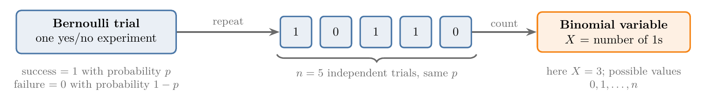
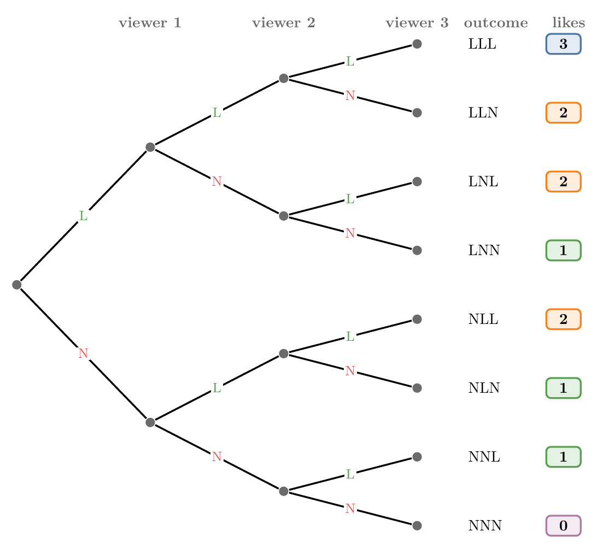
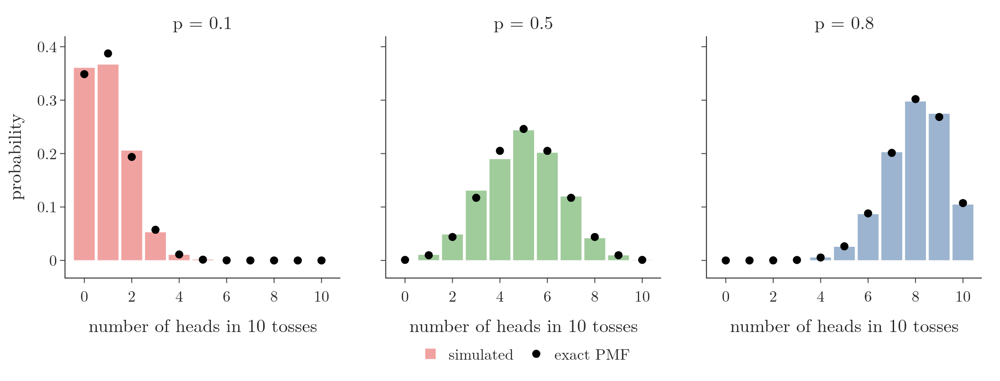

<!-- where-this-fits: generated by course_map/build_map.py; edit concepts.yaml, not this block -->
> **Where this fits:** Pipeline map step 0 (Foundations). See the [Course map](../01-course-map/note.md).
>
> 
>
> - **Builds on:** Probability distributions ([Note 240](../240-random-variables-and-distributions/note.md)).
<!-- /where-this-fits -->

## 1. Overview

> **Key point:** A Bernoulli trial is one yes/no experiment; repeating it $n$ independent times and counting the successes gives a binomial variable.



Figure 1 shows the whole idea. One yes/no experiment, such as one coin toss, is a Bernoulli trial. Repeat it $n$ times under the same conditions and count the 1s: that count follows a binomial distribution.

Both distributions were defined in the [PMF Note](../241-pmf-and-discrete-cdf/note.md). This Note adds what is new:

- the Bernoulli PMF as one formula;
- the binomial formula built from a tree of outcomes;
- the four conditions a binomial experiment must meet;
- how the success probability $p$ moves the shape;
- where both distributions appear in machine learning.

Both are discrete distributions. The distributions of the last few Notes (normal, uniform, log-normal, Pareto) were continuous.

## 2. The Bernoulli distribution

> **Key point:** Any random experiment with exactly two outcomes, coded 1 (success) and 0 (failure), follows a Bernoulli distribution with one parameter $p$.

Recap: the **Bernoulli distribution** describes one trial with two outcomes, 1 with probability $p$ and 0 with probability $1 - p$; its only parameter is $p$ (see the [PMF Note](../241-pmf-and-discrete-cdf/note.md)). It is named after the Swiss mathematician Jacob Bernoulli, who studied it in the late 1600s.

Three experiments with a binary outcome:

| Experiment | Success (1) | Failure (0) | $p$ |
|---|---|---|---|
| Toss a coin | head | tail | 1/2 |
| Read a new email | spam | not spam | depends on the inbox |
| Roll a die | the die shows 5 | anything else (1, 2, 3, 4, 6) | 1/6 |

"Success" is only a label for the outcome coded 1. It need not be a good thing: in a spam filter, finding spam is the success.

### 2.1 The PMF as one formula

> **Key point:** $P(X = x) = p^x (1 - p)^{1 - x}$ gives $p$ for $x = 1$ and $1 - p$ for $x = 0$.

The PMF Note wrote the Bernoulli PMF as two cases. The same two cases fit into one line.

1. **In words:** raise the success probability to the power $x$ and the failure probability to the power $1 - x$; one of the two powers is always 0, so that factor becomes 1.
2. **Formula:**
   $$P(X = x) = p^{x}\,(1 - p)^{1 - x}, \qquad x \in \{0, 1\}$$
3. **Example:** for a fair coin, $p = 1/2$:
   $$P(X = 1) = \left(\tfrac{1}{2}\right)^{1}\left(\tfrac{1}{2}\right)^{0} = \tfrac{1}{2} \times 1 = \tfrac{1}{2}, \qquad P(X = 0) = \left(\tfrac{1}{2}\right)^{0}\left(\tfrac{1}{2}\right)^{1} = \tfrac{1}{2}$$
   For "the die shows 5", $p = 1/6$, so $P(X = 0) = (1/6)^0 (5/6)^1 = 5/6 \approx 0.833$.

The one-line form matters later: the same pattern of powers of $p$ and $1 - p$ is the core of the binomial formula, and of the log loss of logistic regression (see the [log loss Note](../73-log-loss/note.md)).

### 2.2 The graph of a Bernoulli PMF

> **Key point:** Every Bernoulli PMF is just two bars, at 0 and at 1, with heights $1 - p$ and $p$.


Figure 2 shows three Bernoulli distributions. With $p = 0.2$ the bar at 0 is 0.8 and the bar at 1 is 0.2; with $p = 0.8$ the bars swap. Whatever $p$ is, the picture never has more than these two bars.

### 2.3 Bernoulli in machine learning

> **Key point:** The target of a binary classification problem is a Bernoulli variable.

Many ML problems predict a yes/no outcome:

- will a customer make a purchase or not;
- is an email spam or not;
- does a patient have a certain disease or not.

Each target value is a Bernoulli variable, and a binary classifier such as logistic regression estimates its $p$ for every row. The Bernoulli variant of Naive Bayes assumes that each input is a Bernoulli variable, such as "this word is present or not" (see the [Gaussian Naive Bayes Note](../90-gaussian-naive-bayes/note.md)).

> **Extra:** Only a two-class target is Bernoulli. A target with three or more classes (Delhi, Mumbai, Chennai) follows the **categorical distribution**, the many-outcome version of Bernoulli.

> **Extra:** The mean of a Bernoulli variable is $p$ (see the [expected value Note](../332-expected-value-and-variance/note.md)). Its variance is $p(1 - p)$: by the shortcut formula $E[X^2] - (E[X])^2$, and since $X^2 = X$ for 0 and 1, the variance is $p - p^2 = p(1 - p)$. For a fair coin this is $0.5 \times 0.5 = 0.25$, the largest possible; for $p = 0.2$ it is $0.2 \times 0.8 = 0.16$.

## 3. The binomial distribution

> **Key point:** The binomial distribution counts the successes in $n$ independent Bernoulli trials with the same $p$; its parameters are $n$ and $p$, and with $n = 1$ it is the Bernoulli distribution.

Recap: the **binomial distribution** is the distribution of the number of successes in $n$ independent trials with the same success probability (see the [PMF Note](../241-pmf-and-discrete-cdf/note.md)). The step from Bernoulli to binomial is only "do it $n$ times":

| One trial (Bernoulli) | $n$ trials (binomial) |
|---|---|
| toss a coin once | toss it 5 times and count the heads |
| check one email for spam | check 5 emails and count the spam |
| test one patient | test 5 patients and count the sick |

With $n = 1$ there is only one trial, so the binomial distribution becomes the Bernoulli distribution: Bernoulli is a special case of binomial.

The trials must be **independent**: the result of one must not change another (see the [independent events Note](../83-independent-events/note.md)). Suppose we ask 10 students whether a workshop was good. If they talk before answering and one convinces the others, the answers are linked, and the count no longer follows a binomial distribution. Coin tosses are independent: a head on the first toss says nothing about the second.

## 4. Counting the outcomes by hand

> **Key point:** For a few trials we can list every outcome, count those with $k$ successes, and divide by the total.

The binomial distribution answers questions such as this one. Every viewer of an online post presses "like" with probability 0.5. If 3 people watch it, what is the probability that none of them likes it? That one does? Two? All three?

Each viewer either likes (L) or does not (N). Three viewers give $2 \times 2 \times 2 = 8$ equally likely outcomes, the branches of the tree in Figure 3.

{height=50%}

Counting the leaves with each number of likes answers all four questions:

| Likes $k$ | Outcomes | Probability |
|---|---|---|
| 0 | NNN | 1/8 |
| 1 | LNN, NLN, NNL | 3/8 |
| 2 | LLN, LNL, NLL | 3/8 |
| 3 | LLL | 1/8 |

The four probabilities add to $8/8 = 1$, as every PMF must.

Listing outcomes stops working fast. With 10,000 viewers there are $2^{10{,}000}$ outcomes, a number with over 3,000 digits. The question "what is the probability that exactly 500 of them like it?" needs a formula.

## 5. The binomial formula

> **Key point:** $P(X = x) = \binom{n}{x} p^x (1 - p)^{n - x}$: the probability of one arrangement of $x$ successes, times the number of arrangements.

Recap: the binomial PMF is $P(X = x) = \binom{n}{x} p^x (1-p)^{n-x}$, where $\binom{n}{x}$ ("$n$ choose $x$") counts the ways to choose $x$ trials out of $n$ (see the [PMF Note](../241-pmf-and-discrete-cdf/note.md)). The tree shows where each part comes from:

- $n$ is the number of trials (3 viewers), $p$ the success probability (0.5), $x$ the number of successes we ask about.
- $p^x (1-p)^{n-x}$ is the probability of **one** path with $x$ successes, such as LLN. It is the Bernoulli formula, repeated over $n$ trials.
- $\binom{n}{x}$ is the number of such paths: the leaves of Figure 3 with $x$ likes.

1. **In words:** multiply the number of arrangements of 2 likes among 3 viewers by the probability of one such arrangement.
2. **Formula:**
   $$P(X = 2) = \binom{3}{2}\, p^{2}\, (1 - p)^{3 - 2}, \qquad \binom{3}{2} = \frac{3!}{2!\,(3 - 2)!}$$
3. **Example:** with $p = 1/2$,
   $$\binom{3}{2} = \frac{3!}{2!\,1!} = \frac{6}{2 \times 1} = 3, \qquad P(X = 2) = 3 \times \left(\tfrac{1}{2}\right)^2 \times \tfrac{1}{2} = 3 \times \tfrac{1}{8} = \tfrac{3}{8}$$
   The same 3/8 as counting the tree.

The formula scales where the tree cannot. Suppose 1 in 10 people who see a product page buys the product ($p = 0.1$) and the page is shown to $n = 1000$ people:

| Question | Probability |
|---|---|
| exactly 50 buy | $3.2 \times 10^{-9}$, practically never |
| exactly 100 buy | 0.042 |
| at least 70 buy | 0.9996, almost certain |

With $p = 0.1$, about 100 purchases are expected, so 50 is extremely unlikely and "at least 70" almost sure.

> **Python:** Binomial probabilities with scipy.
>
> ```python
> from scipy import stats
>
> buyers = stats.binom(n=1000, p=0.1)
> buyers.pmf(50)     # 3.2e-09: exactly 50
> buyers.pmf(100)    # 0.042: exactly 100
> buyers.sf(69)      # 0.9996: more than 69
> ```
>
> `sf` is the survival function, one minus the CDF. "At least 70" is "more than 69", hence `sf(69)`.

## 6. When a count is binomial

> **Key point:** Four conditions: a fixed number of trials, two outcomes per trial, the same $p$ in every trial, and independent trials.

The formula holds only when all four conditions are met:

1. **Fixed number of trials.** The process has $n$ trials, decided in advance.
2. **Two outcomes.** Each trial ends in exactly one of two outcomes, success or failure.
3. **Same probability.** The success probability $p$, and so the failure probability $1 - p$, stays fixed from trial to trial. A coin whose head probability changes from 0.5 to 0.6 halfway breaks it.
4. **Independent trials.** No trial affects another.

If one condition fails, the count may still be a useful number, but the binomial formula no longer gives its probabilities.

## 7. Simulating binomial experiments

> **Key point:** Each simulated number is the number of heads in one run of 10 tosses; repeating the run 1000 times shows the binomial shape.

One binomial **experiment** here is "toss a coin 10 times and count the heads". We repeat the whole experiment 1000 times. The result is 1000 numbers between 0 and 10, each the head count of one run.

> **Python:** 1000 runs of 10 tosses.
>
> ```python
> import numpy as np
>
> rng = np.random.default_rng(42)     # fixed seed
> heads = rng.binomial(n=10, p=0.5, size=1000)
> heads[:10]       # [6 5 7 6 3 8 6 6 3 5]
> ```
>
> The first run gave 6 heads, the second 5, the third 7.

Most runs give 4, 5 or 6 heads, because each toss is a head half the time. Runs with 2 or 8 heads are rarer, and 0 or 10 almost never happen: 5 heads appeared 244 times, 8 heads 42 times, 0 heads never.

### 7.1 How $p$ moves the shape

> **Key point:** A large $p$ pushes the distribution to the right, a small $p$ to the left; around $p = 0.5$ it is symmetric and looks like a bell.



Figure 4 repeats the simulation for three coins. The bars are the share of the 1000 runs with each head count; the dots are the exact PMF.

- **$p = 0.1$:** heads are rare, so small counts dominate. The distribution sits on the left with a long tail to the right: it is right-skewed (see the [skewness Note](../252-skewness/note.md)).
- **$p = 0.5$:** the distribution is centred at 5 and symmetric, close to a normal curve.
- **$p = 0.8$:** a biased coin; counts of 7 to 10 dominate, and the tail points left.

The simulated bars sit close to the exact dots, and they get closer with more runs.

> **Extra:** The centre of a binomial distribution is $np$ and its variance is $np(1 - p)$: the Bernoulli mean and variance, added over $n$ independent trials. For $n = 10$, $p = 0.5$: mean 5, variance 2.5; the simulation gave 4.97 and 2.58. For the product page: mean $1000 \times 0.1 = 100$ purchases, standard deviation $\sqrt{1000 \times 0.1 \times 0.9} = 9.49$. The skewness is $(1 - 2p)/\sqrt{np(1-p)}$: 0.84 for $p = 0.1$, 0 for $p = 0.5$, $-0.47$ for $p = 0.8$.

## 8. Where the binomial distribution is used

> **Key point:** Binary classification, Naive Bayes, majority voting, hypothesis tests, logistic regression and A/B tests all use the binomial distribution.

- **Binary classification.** The number of positive cases among $n$ independent rows is binomial; for example, the number of spam emails among the next 100.
- **Naive Bayes.** Its variants assume a distribution for the inputs: Bernoulli, multinomial (the many-category version of binomial) or Gaussian (see the [Gaussian Naive Bayes Note](../90-gaussian-naive-bayes/note.md)).
- **Majority voting.** The number of correct models in a voting ensemble is binomial (see the [voting ensemble Note](../102-voting-ensemble/note.md)).
- **Hypothesis testing.** Tests compute the probability of a number of successes in $n$ trials, assuming a claim (the null hypothesis) is true.
- **Logistic regression and A/B testing.** Logistic regression models the success probability of each row; an A/B test compares the success counts of two versions of a page.

## 9. Summary

| | Bernoulli | Binomial |
|---|---|---|
| Experiment | one yes/no trial | $n$ independent yes/no trials |
| Variable | 1 or 0 | number of successes, $0$ to $n$ |
| Parameters | $p$ | $n$, $p$ |
| PMF | $p^x (1 - p)^{1 - x}$ | $\binom{n}{x} p^x (1 - p)^{n - x}$ |
| Mean, variance | $p$, $p(1 - p)$ | $np$, $np(1 - p)$ |
| Example | one coin: $P(\text{head}) = 1/2$ | 2 likes out of 3: $3/8$ |

- Binomial with $n = 1$ is Bernoulli.
- The binomial formula needs a fixed $n$, two outcomes, a constant $p$ and independent trials.
- $\binom{n}{x}$ counts the paths in the outcome tree; $p^x (1 - p)^{n - x}$ is the probability of one path.
- A large $p$ shifts the distribution right, a small $p$ left; near $p = 0.5$ it is symmetric and bell-shaped.

## 10. Key terms

| Term | Meaning |
|---|---|
| Bernoulli trial | One random experiment with exactly two outcomes, success (1) and failure (0) |
| Binomial experiment | A fixed number $n$ of independent Bernoulli trials with the same success probability $p$ |
| Categorical distribution | The distribution of one trial with more than two outcomes; Bernoulli is its two-outcome case |
| Survival function | One minus the CDF: the probability of a value above $x$; `sf` in scipy |
