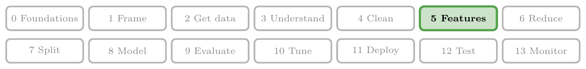
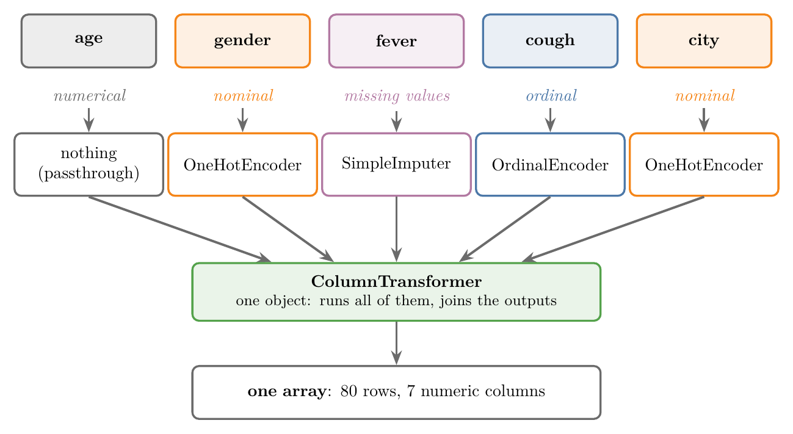
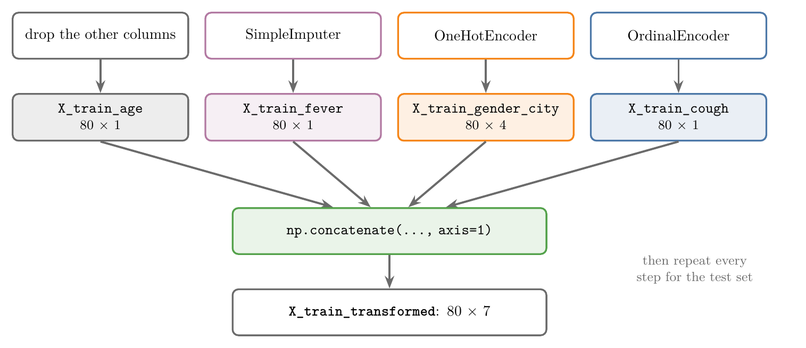
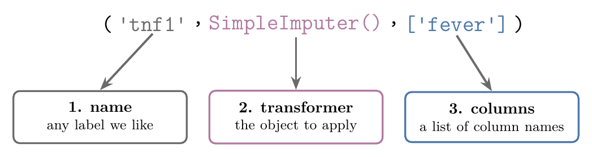

<!-- where-this-fits: generated by course_map/build_map.py; edit concepts.yaml, not this block -->
> **Where this fits:** Pipeline map step 5 (Engineer features). See the [Course map](../01-course-map/note.md).
>
> 
>
> - **Builds on:** Simple imputation (mean, median, mode, constant) ([Note 23](../23-what-is-feature-engineering/note.md)); Binning and binarization ([Note 23](../23-what-is-feature-engineering/note.md)); Encoding categorical data ([Note 26](../26-ordinal-label-encoding/note.md)).
> - **Leads to:** ML pipelines ([Note 29](../29-pipelines/note.md)).
<!-- /where-this-fits -->

## 1. Overview

> **Key point:** A column transformer sends each column to its own transformer and joins all the outputs into one array, in a single step.

Real datasets mix feature types. A **feature** is an input variable, one column of the data table. One feature has missing values, another is ordinal, a third is nominal, and a fourth needs nothing at all. Each one needs a different transformation.

Figure 1 shows the whole topic. Every column goes to the transformer that fixes its problem, and scikit-learn's **`ColumnTransformer`** runs all of them at once and joins their outputs into one array of numbers.



## 2. Different columns need different transformations

> **Key point:** When columns need different transformations, doing them one by one means many separate arrays that we must glue back together.

Take customer data with four features:

- **age:** numerical, but some values are missing. Age needs simple imputation to fill them.
- **city:** nominal categories. City needs one-hot encoding.
- **gender:** nominal categories. Gender also needs one-hot encoding.
- **review:** ordinal categories, such as good and excellent. Review needs ordinal encoding.

If we apply each transformation separately, we get three separate NumPy arrays: one from imputing age, one from one-hot encoding city and gender, and one from ordinal encoding review. We then have to join the three into one big array before we can train a model.

Gluing arrays by hand is a lot of manual work, and the work grows with every feature. Think of a kitchen where each cook prepares one ingredient: a column transformer is the head chef who hands each ingredient to the right cook and plates the results together. A **column transformer** is a scikit-learn class that does the whole job in one go: it takes the DataFrame and returns one finished array.

## 3. The COVID toy data

> **Key point:** 100 made-up patients; fever has missing values, cough is ordinal, gender and city are nominal, and age is ready as it is.

The data is a small made-up dataset of 100 patients. Each patient is one **observation** (one record, one row of the table). There are six columns: the features age, gender, fever (body temperature in degrees Fahrenheit at the doctor's visit), cough and city, and the **target** `has_covid` (Yes or No), the output we would predict. The dataset is a toy for practising the technique, not real medical data.

| age | gender | fever | cough | city | has_covid |
|---|---|---|---|---|---|
| 60 | Male | 103.0 | Mild | Kolkata | No |
| 27 | Male | 100.0 | Mild | Delhi | Yes |
| 42 | Male | 101.0 | Mild | Delhi | No |

A few quick counts describe the columns:

- **cough:** 62 patients have a Mild cough and 38 a Strong one.
- **city:** four cities: Kolkata (32), Bangalore (30), Delhi (22) and Mumbai (16).
- **fever:** 10 of the 100 values are missing.

> **Python:** Loading the data and counting values.
>
> ```python
> import pandas as pd
>
> df = pd.read_csv("data/covid_toy.csv")
> # how many rows hold each category
> df["cough"].value_counts()
> df["city"].value_counts()
> # missing values per column: fever has 10
> df.isnull().sum()
> ```

### 3.1 What each column needs

> **Key point:** Four features need a transformation; age needs none.

| Column | Type | Problem | Transformation |
|---|---|---|---|
| age | numerical | none | none |
| fever | numerical | 10 missing values | simple imputation (`SimpleImputer`) |
| cough | ordinal: Mild < Strong | text | ordinal encoding (`OrdinalEncoder`) |
| gender | nominal | text | one-hot encoding (`OneHotEncoder`) |
| city | nominal | text | one-hot encoding (`OneHotEncoder`) |

The target `has_covid` is categorical too, so it would need label encoding. We leave it out here: the focus is the features.

### 3.2 Split before transforming

> **Key point:** As always, we split first; every transformer learns from the training set only.

We split the data into a training set (80 rows) and a test set (20 rows) before any transformation. The features are every column except `has_covid`.

> **Python:** Splitting the data.
>
> ```python
> from sklearn.model_selection import train_test_split
>
> X_train, X_test, y_train, y_test = train_test_split(
>     df.drop(columns=["has_covid"]),  # inputs
>     df["has_covid"],                 # target
>     test_size=0.2, random_state=0)
> # X_train: (80, 5), X_test: (20, 5)
> ```

## 4. The hard way: one transformer at a time

> **Key point:** Without a column transformer, we transform each column separately, get one array per step, and glue the arrays together with `np.concatenate`.

Figure 2 shows the plan. Four separate steps each give an array of 80 rows, and a fifth step joins them into one array of 80 rows and 7 columns.



### 4.1 Fever: fill the missing values

> **Key point:** `SimpleImputer` replaces each missing fever with the mean fever of the training set.

`SimpleImputer` (with its default setting) fills every missing value with the column's mean. We pick only the `fever` column, fit the imputer on the training set and transform both sets.

> **Python:** Imputing fever.
>
> ```python
> from sklearn.impute import SimpleImputer
>
> si = SimpleImputer()
> # double brackets keep a table of one column
> X_train_fever = si.fit_transform(X_train[["fever"]])
> X_test_fever = si.transform(X_test[["fever"]])
> # X_train_fever: (80, 1), no missing values left
> ```

`fit_transform` does `fit` and `transform` in one call. We use it on the training set only; the test set gets just `transform`.

### 4.2 Cough: ordinal encoding

> **Key point:** Mild becomes 0 and Strong becomes 1.

Cough has an order, Mild < Strong, so we use `OrdinalEncoder` and give it that order.

> **Python:** Ordinal encoding cough.
>
> ```python
> from sklearn.preprocessing import OrdinalEncoder
>
> oe = OrdinalEncoder(categories=[["Mild", "Strong"]])
> X_train_cough = oe.fit_transform(X_train[["cough"]])
> X_test_cough = oe.transform(X_test[["cough"]])
> # X_train_cough: (80, 1)
> ```

### 4.3 Gender and city: one-hot encoding

> **Key point:** Gender (2 categories) and city (4 categories) become 1 + 3 = 4 columns once the first category of each is dropped.

Both columns are nominal, so one `OneHotEncoder` handles the two together. With `drop="first"` it removes one column per feature to avoid multicollinearity.

The column count works out as follows:

- **gender:** 2 categories, minus the first, gives 1 column.
- **city:** 4 categories, minus the first, gives 3 columns.
- **Total:** 1 + 3 = 4 columns.

> **Python:** One-hot encoding gender and city.
>
> ```python
> from sklearn.preprocessing import OneHotEncoder
>
> ohe = OneHotEncoder(drop="first", sparse_output=False)
> X_train_gender_city = ohe.fit_transform(
>     X_train[["gender", "city"]])
> X_test_gender_city = ohe.transform(
>     X_test[["gender", "city"]])
> # X_train_gender_city: (80, 4)
> ```
>
> `sparse_output=False` returns an ordinary array instead of a sparse matrix.

### 4.4 Age and the final join

> **Key point:** Age is taken out unchanged, then `np.concatenate` joins the four arrays side by side.

Age needs no transformation, but it still has to become an array so it can be joined to the others. Then **`np.concatenate`** with `axis=1` puts the arrays next to each other, column after column: 1 + 1 + 4 + 1 = 7 columns.

> **Python:** Extracting age and joining everything.
>
> ```python
> import numpy as np
>
> X_train_age = X_train[["age"]].values
> X_test_age = X_test[["age"]].values
>
> # axis=1: join side by side (column-wise)
> X_train_transformed = np.concatenate(
>     (X_train_age, X_train_fever,
>      X_train_gender_city, X_train_cough), axis=1)
> X_test_transformed = np.concatenate(
>     (X_test_age, X_test_fever,
>      X_test_gender_city, X_test_cough), axis=1)
> # (80, 7) and (20, 7)
> ```

The hand-made way works, but it is hectic for only four features. With 50 columns, it would take a very long time, and every step has to be written twice: once for the training set and once for the test set.

## 5. The easy way: ColumnTransformer

> **Key point:** We list every transformation once, as (name, transformer, columns), and `ColumnTransformer` does all the steps of Section 4 in one call.

`ColumnTransformer` lives in `sklearn.compose`. When we create it, we pass two things: the list of transformers and what to do with the remaining columns.

### 5.1 The transformers list

> **Key point:** Each transformation is a tuple of three items: a name, a transformer object, and a list of column names.

The parameter **`transformers`** is a list of tuples, one tuple per transformation. Figure 3 shows the three items inside one tuple.



1. **Name:** any label we choose, such as `"tnf1"`.
2. **Transformer:** the object to apply, such as `SimpleImputer()`.
3. **Columns:** a list of the columns to apply it to, such as `["fever"]`.

Our data needs three tuples: one for the imputer, one for the ordinal encoder, and one for the one-hot encoder.

### 5.2 The remainder parameter

> **Key point:** `remainder` decides what happens to columns that no transformer touches: `"drop"` removes them, `"passthrough"` keeps them unchanged.

Sometimes we do not transform every column. The parameter **`remainder`** says what to do with the rest:

- **`"drop"`:** remove them from the output. Dropping is the default.
- **`"passthrough"`:** keep them as they are.

Here age has no transformer. We want to keep it, so we use `remainder="passthrough"`. With `"drop"`, age would disappear and the output would have 6 columns.

### 5.3 Building and using the column transformer

> **Key point:** `fit_transform` on the training set and `transform` on the test set give the same 80 × 7 and 20 × 7 arrays as the hard way.

> **Python:** The whole of Section 4 in one object.
>
> ```python
> from sklearn.compose import ColumnTransformer
>
> transformer = ColumnTransformer(transformers=[
>     ("tnf1", SimpleImputer(), ["fever"]),
>     ("tnf2", OrdinalEncoder(
>         categories=[["Mild", "Strong"]]), ["cough"]),
>     ("tnf3", OneHotEncoder(
>         sparse_output=False, drop="first"),
>      ["gender", "city"]),
> ], remainder="passthrough")
>
> # learn from the training set and transform it
> transformer.fit_transform(X_train).shape   # (80, 7)
> # apply to the test set
> transformer.transform(X_test).shape        # (20, 7)
> ```

Figure 4 shows what happens inside, using three training rows, one of them with a missing fever. The columns are routed to their transformers, each transformer works only on its own columns, and the outputs are stitched side by side. That missing fever is filled with 100.9, the mean fever of the training set.


On the real output, the first three training patients look like this before the transformation:

| Patient | age | gender | fever | cough | city |
|---|---|---|---|---|---|
| 1 | 22 | Female | 99.0 | Mild | Bangalore |
| 2 | 56 | Female | 104.0 | Strong | Bangalore |
| 3 | 31 | Female | 98.0 | Mild | Kolkata |

After it, they are three rows of 7 numbers. The table below is turned on its side to fit: each line is one output column, and each number column is one patient.

| Output column | Patient 1 | Patient 2 | Patient 3 |
|---|---|---|---|
| fever | 99 | 104 | 98 |
| cough | 0 | 1 | 0 |
| `gender_Male` | 0 | 0 | 0 |
| `city_Delhi` | 0 | 0 | 0 |
| `city_Kolkata` | 0 | 0 | 1 |
| `city_Mumbai` | 0 | 0 | 0 |
| age | 22 | 56 | 31 |

Bangalore is the first city alphabetically, so it was the dropped category: a Bangalore row has 0 in all three city columns.

The column transformer combines naturally with another scikit-learn tool, the pipeline, covered in the next Note. Used together, they make preprocessing much simpler.

> **Extra:** The output columns come in the order of the `transformers` list, and the `remainder` columns go last. So the column transformer puts age at the end, while our hand-made array had it first. Both arrays hold the same 7 columns, only in a different order.

## 6. Reading the output

> **Key point:** `get_feature_names_out` gives the name of every output column, and `set_output(transform="pandas")` returns a DataFrame with those names instead of a bare array.

> **Extra:** Section 6 goes beyond the basics: it uses newer scikit-learn tools that make the output easier to read.

The result of `fit_transform` is a NumPy array without column names, so it is easy to forget which column is which. Two tools fix this.

### 6.1 Names of the output columns

> **Key point:** Each output name is the transformer's name, two underscores, then the column name.

**`get_feature_names_out`** lists the output columns in order. Each name starts with the transformer's name and two underscores; columns kept by `remainder` start with `remainder__`.

> **Python:** Listing the output column names.
>
> ```python
> transformer.get_feature_names_out()
> # ['tnf1__fever', 'tnf2__cough',
> #  'tnf3__gender_Male', 'tnf3__city_Delhi',
> #  'tnf3__city_Kolkata', 'tnf3__city_Mumbai',
> #  'remainder__age']
> ```

### 6.2 A DataFrame instead of an array

> **Key point:** After `set_output(transform="pandas")`, the column transformer returns a DataFrame.

Calling **`set_output(transform="pandas")`** once makes every later `fit_transform` and `transform` return a pandas DataFrame, with the names above as its columns.

> **Python:** Getting a DataFrame back.
>
> ```python
> transformer.set_output(transform="pandas")
> transformer.fit_transform(X_train).head()
> # a DataFrame with columns tnf1__fever ... remainder__age
> ```
>
> Passing `verbose_feature_names_out=False` to `ColumnTransformer` drops the prefixes, giving plain names such as `fever` and `city_Delhi`.

> **Extra:** The fitted transformers are kept inside the column transformer, under their names. For example, `transformer.named_transformers_["tnf1"].statistics_` gives `[100.92]`, the training mean used to fill the missing fevers.

## 7. Summary

| | One transformer at a time | ColumnTransformer |
|---|---|---|
| Objects | one per transformation | one |
| Choosing columns | by hand, for each step | in the `transformers` list |
| Untouched columns | extracted by hand | `remainder="passthrough"` |
| Joining the outputs | `np.concatenate` by hand | automatic |
| Test set | every step written again | one `transform` call |
| Result for this data | 80 × 7 (age first) | 80 × 7 (age last) |

- Different columns often need different transformations: imputation, ordinal encoding, one-hot encoding, or none.
- Done by hand, each transformation gives its own array, and we must join them with `np.concatenate`, for both sets.
- `ColumnTransformer` takes a list of (name, transformer, columns) tuples and does every step in one call.
- `remainder="drop"` (default) removes untouched columns; `remainder="passthrough"` keeps them, at the end.
- Split first; `fit_transform` on the training set, `transform` on the test set.
- `get_feature_names_out` and `set_output(transform="pandas")` tell us which output column is which.

## 8. Key terms

| Term | Meaning |
|---|---|
| Feature | An input variable, one column of the data table |
| Target | The output we predict |
| Observation | One record, one row of the data table |
| Column transformer | A scikit-learn class that applies a different transformer to each set of columns and joins the outputs into one array |
| ColumnTransformer | The scikit-learn class (in `sklearn.compose`) that implements the column transformer |
| transformers | The `ColumnTransformer` parameter: a list of (name, transformer, columns) tuples |
| remainder | The `ColumnTransformer` parameter for untouched columns: `"drop"` (default) or `"passthrough"` |
| passthrough | The `remainder` option that keeps untouched columns unchanged |
| SimpleImputer | scikit-learn's class that fills missing values, by default with the column's mean |
| fit_transform | Fit and transform in one call; used on the training set only |
| np.concatenate | NumPy function that joins arrays; with `axis=1` it puts them side by side |
| get_feature_names_out | Method returning the names of the output columns, in order |
| set_output | Method that makes a transformer return a pandas DataFrame with `transform="pandas"` |
