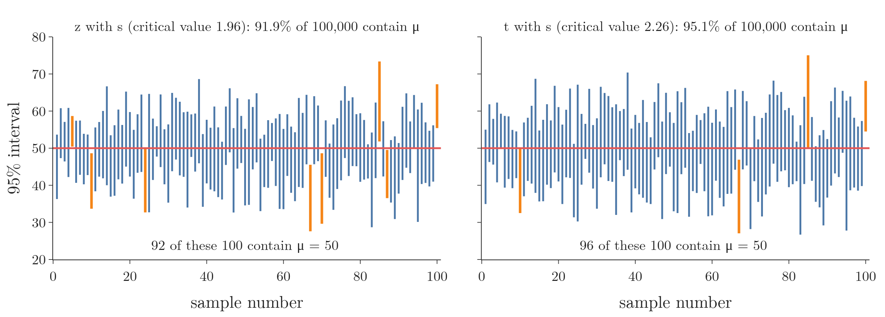

<!-- where-this-fits: generated by course_map/build_map.py; edit concepts.yaml, not this block -->
> **Where this fits:** Pipeline map step 0 (Foundations). See the [Course map](../01-course-map/note.md).
>
> 
>
> - **Builds on:** Bessel's correction ([Note 222](../222-measures-of-dispersion/note.md)); Standard normal and the z-table ([Note 251](../251-standard-normal-and-z-table/note.md)); Central limit theorem ([Note 272](../272-estimating-a-mean-with-the-clt/note.md)).
> - **Compare with:** Normal distribution ([Note 250](../250-normal-distribution/note.md)).
<!-- /where-this-fits -->

## 1. Overview

> **Key point:** When the population standard deviation $\sigma$ is unknown, we use the sample standard deviation $s$ and take the critical value from Student's t-distribution instead of the standard normal curve.

{height=30%}

Earlier we built the interval $\bar{x} \pm z_{\alpha/2}\,\sigma/\sqrt{n}$ (see the [z-procedure Note](../280-confidence-intervals-z-procedure/note.md)). It needs $\sigma$, the standard deviation of the whole population, which we almost never have. Figure 1 shows the way out: the **t-procedure**, the method used in real work.

This Note covers:

- the assumptions of the t-procedure;
- why replacing $\sigma$ by $s$ changes the distribution, and what Student's t-distribution is;
- degrees of freedom and t critical values;
- a simulation showing that "z with $s$" fails and "t with $s$" works;
- a t-interval for the mean Titanic fare.

## 2. Why $\sigma$ is rarely known

> **Key point:** If we do not know the population mean, we almost never know the population standard deviation either.

The z-procedure has a hidden weakness. We build a confidence interval because we do not know the mean age $\mu$ of a channel's 77,000 subscribers. But $\sigma$ is computed from the same 77,000 ages: if we cannot get $\mu$, we cannot get $\sigma$ either.

So in practice the z-procedure is rarely usable. The t-procedure needs no population parameter at all: everything comes from the sample.

## 3. Assumptions of the t-procedure

> **Key point:** A random sample, a roughly normal population or a large sample, and independent observations.

1. **Random sample.** As for the z-procedure: drawn at random and representative.
2. **Normal population, or a large sample.** The population should be approximately normal. If it is not, a sample of more than about 30 lets the central limit theorem make $\bar{x}$ approximately normal anyway (see the [central limit theorem Note](../271-sampling-distribution-and-clt/note.md)).
3. **Independent observations.** One value must not influence another. The ages of randomly chosen subscribers are independent. Feedback ratings may not be: if one person's rating sways the next, the observations are linked and the interval comes out too narrow.

The second assumption gives the t-procedure two strengths:

- it works when $\sigma$ is unknown, the usual case;
- for a population that is close to normal, it also works with **very small samples**, such as 5 or 10 values, where the CLT cannot help.

## 4. Replacing $\sigma$ by $s$

> **Key point:** With $s$ in place of $\sigma$, the standardized sample mean no longer follows the standard normal distribution but Student's t-distribution.

The natural fix is to use the next best thing. We use $\bar{x}$ when $\mu$ is unknown; so we use the sample standard deviation $s$ (dividing by $n - 1$, see the [measures of dispersion Note](../222-measures-of-dispersion/note.md)) when $\sigma$ is unknown.

The z-procedure rested on the standardized sample mean $Z = (\bar{X} - \mu)/(\sigma/\sqrt{n})$, which follows the standard normal distribution. Putting $s$ in place of $\sigma$ gives a new quantity.

1. **In words:** standardize the sample mean with the sample's own standard deviation.
2. **Formula:**
   $$T = \frac{\bar{X} - \mu}{s/\sqrt{n}}$$
3. **Example:** a sample of $n = 10$ ages with $\bar{x} = 28$ and $s = 15$, if the true mean were $\mu = 25$:
   $$T = \frac{28 - 25}{15/\sqrt{10}} = \frac{3}{4.743} = 0.63$$

$T$ looks like $Z$, but it is not standard normal. In $Z$ only the numerator varies from sample to sample. In $T$ the denominator varies too: a sample with an unusually small $s$ gives a large $T$. This extra uncertainty makes extreme values of $T$ more common than extreme values of $Z$.

## 5. Student's t-distribution

> **Key point:** A bell-shaped, symmetric distribution like the standard normal but with fatter tails; its only parameter is the degrees of freedom, $n - 1$.

The distribution of $T$ is **Student's t-distribution**. It was published in 1908 by William Sealy Gosset, a chemist at the Guinness brewery in Dublin, who worked with small samples of barley and beer. His employer did not let staff publish under their own names, so he signed the paper "Student", and the name stuck. The letter t has no special meaning.

Unlike the normal and log-normal distributions, which describe raw data such as heights or incomes, the t-distribution was derived for this inference problem. It describes a statistic, $T$, not measurements.

### 5.1 Degrees of freedom

> **Key point:** The t-distribution has one parameter, the degrees of freedom: $df = n - 1$ for a sample of size $n$.

The normal distribution has two parameters, $\mu$ and $\sigma$. The t-distribution has one, the **degrees of freedom** ($df$):
$$df = n - 1$$

A sample of 50 gives 49 degrees of freedom; a sample of 30 gives 29.

The $n - 1$ is the same $n - 1$ as in the sample variance. The $n$ deviations $x_i - \bar{x}$ always add up to zero, so once $n - 1$ of them are known, the last one is fixed: only $n - 1$ of them are free to vary. Bessel's correction (see the [measures of dispersion Note](../222-measures-of-dispersion/note.md)) divides by these $n - 1$ free deviations, and the t-distribution inherits the same count.

### 5.2 Shape: fatter tails

> **Key point:** Few degrees of freedom give fat tails; as $df$ grows, the t-distribution approaches the standard normal, and equals it in the limit.


Figure 2 compares the two curves:

- both are bell-shaped, symmetric and centred at 0;
- the t-curve is lower in the middle and higher in the tails: some probability has moved from near the mean to far away;
- with 1 degree of freedom (a sample of 2) the difference is large; with 29 (a sample of 30) the curves almost coincide.

The fat tails are the extra uncertainty of $s$, put into the shape. The probability of a value above 3 shows it:

| Distribution | $P(\text{value} > 3)$ |
|---|---|
| t, $df = 1$ | 0.1024 |
| t, $df = 4$ | 0.0200 |
| t, $df = 29$ | 0.0027 |
| t, $df = 1000$ | 0.0014 |
| standard normal | 0.0013 |

As $n$ grows, $s$ becomes a reliable estimate of $\sigma$, the extra uncertainty disappears, and the t-distribution approaches the standard normal. It becomes exactly normal only with infinitely many degrees of freedom, but beyond about 30 to 50 the two are very close.

## 6. The t-procedure formula

> **Key point:** $\bar{x} \pm t_{\alpha/2,\,n-1}\,s/\sqrt{n}$: the z-interval with $s$ for $\sigma$ and a t critical value for $z_{\alpha/2}$.

Since $T$ follows the t-distribution, the derivation of the z-interval (see the [z-procedure Note](../280-confidence-intervals-z-procedure/note.md)) goes through unchanged with t in place of z.

1. **In words:** go from the sample mean $t_{\alpha/2}$ estimated standard errors down and up, where the standard error is estimated by $s/\sqrt{n}$ and $t_{\alpha/2}$ comes from the t-distribution with $n - 1$ degrees of freedom.
2. **Formula:**
   $$\bar{x} \pm t_{\alpha/2,\,n-1}\,\frac{s}{\sqrt{n}}$$
3. **Example:** 10 subscribers with $\bar{x} = 28$ years and $s = 15$ years, 95% confidence, $df = 9$, so $t_{0.025,\,9} = 2.262$:
   $$\frac{s}{\sqrt{n}} = \frac{15}{\sqrt{10}} = 4.743, \qquad E = 2.262 \times 4.743 = 10.73$$
   $$28 \pm 10.73: \quad 17.27 \text{ to } 38.73 \text{ years}$$
   With $z = 1.96$ the margin would be $1.96 \times 4.743 = 9.30$ (18.70 to 37.30): narrower, and, as section 7 shows, too narrow.

The t critical value is always larger than $z_{\alpha/2}$ for the same confidence level. The fat tails push the cut-offs that leave 2.5% in each tail further out (Figure 2). A wider interval is the honest answer: we are less sure about the spread, so we claim less precision.

### 6.1 Reading a t-table

> **Key point:** Find the row for $df = n - 1$ and the column for an upper-tail area of $\alpha/2$; for 95%, that is the 0.025 column.

A t-table has one row per degrees of freedom and one column per upper-tail area. For a two-sided 95% interval, each tail holds 0.025, so we read the 0.025 column (some tables label it "95%, two-sided"). For a sample of 30, $df = 29$ gives 2.045.

| $df$ | $t_{0.025}$ (95%, two-sided) | $t_{0.05}$ (one tail of 5%) |
|---|---|---|
| 1 | 12.706 | 6.314 |
| 4 | 2.776 | 2.132 |
| 9 | 2.262 | 1.833 |
| 29 | 2.045 | 1.699 |
| 30 | 2.042 | 1.697 |
| 40 | 2.021 | 1.684 |
| 60 | 2.000 | 1.671 |
| 100 | 1.984 | 1.660 |
| 1000 | 1.962 | 1.646 |
| $z$ (normal) | 1.960 | 1.645 |

A common slip is to read the 0.05 column for a 95% interval. For $df = 40$ it gives 1.684 instead of 2.021: that value leaves 5% in **one** tail, which suits a one-sided interval ("the mean is at least ...") but not a two-sided one. The correct value is always above 1.96.

> **Python:** T critical values and t-intervals with scipy.
>
> ```python
> from scipy import stats
>
> stats.t.ppf(0.975, df=29)       # 2.045: two-sided 95%, n = 30
> stats.t.ppf(0.95, df=40)        # 1.684: one-sided 95%
> # the whole interval in one call
> stats.t.interval(0.95, df=9, loc=28, scale=15 / 10 ** 0.5)
> # (17.27, 38.73)
> ```

## 7. Why "z with $s$" fails

> **Key point:** Using $s$ with the z critical value gives intervals that are too narrow: for $n = 10$, a "95%" interval contains $\mu$ only 91.9% of the time; the t critical value restores 95%.

We can check by simulation that the t-distribution is needed. As in the [interpreting confidence intervals Note](../281-interpreting-confidence-intervals/note.md), we draw samples of $n = 10$ from a normal population with $\mu = 50$ and $\sigma = 15$. From each sample we build two intervals:

- **z with $s$:** $\bar{x} \pm 1.96\,s/\sqrt{n}$, the tempting shortcut;
- **t with $s$:** $\bar{x} \pm 2.262\,s/\sqrt{n}$, the t-procedure.



Over 100,000 samples, the "95%" z-with-$s$ intervals contain $\mu$ only 91.9% of the time; the t intervals 95.1% (Figure 3). Repeating more often does not help: the z intervals stay around 92%, because they are built from the wrong distribution. They are systematically too short and skip the true mean more often than promised.

| Sample size $n$ | z with $s$ | t with $s$ |
|---|---|---|
| 5 | 87.7% | 95.0% |
| 10 | 91.9% | 95.1% |
| 30 | 94.2% | 95.2% |
| 100 | 94.7% | 95.0% |

The gap is large for small samples and fades as $n$ grows, exactly as the t-curve approaches the normal curve. The rule is simple:

- $\sigma$ known: z-procedure, $\bar{x} \pm z_{\alpha/2}\,\sigma/\sqrt{n}$;
- $\sigma$ unknown: t-procedure, $\bar{x} \pm t_{\alpha/2,\,n-1}\,s/\sqrt{n}$.

## 8. Case study: the mean Titanic fare

> **Key point:** One random sample of 30 passengers gives the 95% t-interval 18.57 to 55.72 pounds, which contains the true mean of 33.30 pounds.

We return to the population of the [estimating a mean Note](../272-estimating-a-mean-with-the-clt/note.md): the 1308 known fares of all Titanic passengers, with true mean 33.30 pounds. We know neither $\mu$ nor $\sigma$ (we pretend), so the t-procedure is the right tool.

1. **In words:** draw one random sample of 30 fares, compute $\bar{x}$ and $s$, and use $t_{0.025,\,29}$.
2. **Formula:**
   $$\bar{x} \pm t_{0.025,\,29}\,\frac{s}{\sqrt{30}}$$
3. **Example:** the sample gives $\bar{x} = 37.14$ and $s = 49.74$; $t_{0.025,\,29} = 2.045$:
   $$\frac{49.74}{\sqrt{30}} = 9.08, \qquad E = 2.045 \times 9.08 = 18.57, \qquad 37.14 \pm 18.57: \ 18.57 \text{ to } 55.72$$
   The true mean, 33.30 pounds, lies inside.

The interval is wide because the fares vary enormously ($s = 49.74$) and the sample is small. At 50% confidence, $t_{0.25,\,29} = 0.683$ and the interval shrinks to 30.94 to 43.35 pounds. That range happens to contain 33.30 too, but such an interval misses half the time.

### 8.1 Several samples: pool them

> **Key point:** Ten samples of 30 are best combined into one sample of 300; averaging their standard deviations and keeping $n = 30$ gives an interval about three times too wide.

Suppose we drew 10 samples of 30 fares. One approach averages the 10 sample means (31.42) and the 10 sample standard deviations (45.88) and builds $31.42 \pm 2.045 \times 45.88/\sqrt{30}$: 14.29 to 48.55 pounds. This interval describes the precision of **one** sample of 30, not of the 300 fares we actually have.

Pooling all 300 fares into one sample and using $n = 300$ gives 26.20 to 36.64 pounds: about a third of the width, and it still contains 33.30. More data should give a narrower interval, and pooling lets it.

> **Extra:** The t-procedure corrects for the uncertainty of $s$, not for skewness. The fares are extremely right-skewed (see the [estimating a mean Note](../272-estimating-a-mean-with-the-clt/note.md)). Repeating the one-sample t-interval 4000 times, it contains the true mean only 86.5% of the time for $n = 30$ and 92.8% for $n = 100$. For very skewed data we need larger samples than the usual 30, or a method that does not assume normality, such as the bootstrap interval that seaborn uses (see the [z-procedure Note](../280-confidence-intervals-z-procedure/note.md)).

## 9. Summary

| | Z-procedure | T-procedure |
|---|---|---|
| Use when | $\sigma$ known (rare) | $\sigma$ unknown (usual) |
| Spread | $\sigma$ | $s$ |
| Distribution | standard normal | Student's t, $df = n - 1$ |
| Interval | $\bar{x} \pm z_{\alpha/2}\,\sigma/\sqrt{n}$ | $\bar{x} \pm t_{\alpha/2,\,n-1}\,s/\sqrt{n}$ |
| 95% critical value | 1.96 | 2.262 ($n = 10$), 2.045 ($n = 30$) |
| Example | 25.06 to 30.94 ($n = 100$, $\sigma = 15$) | 17.27 to 38.73 ($n = 10$, $s = 15$) |

- Replacing $\sigma$ by $s$ adds uncertainty; the t-distribution's fat tails account for it.
- The t critical value is above $z_{\alpha/2}$ and approaches it as $n$ grows.
- "Z with $s$" gives intervals that are too narrow: 91.9% instead of 95% for $n = 10$.
- For a 95% two-sided interval read the 0.025 column of the t-table, not the 0.05 column.
- Pool several samples into one; the t-procedure does not fix strong skewness.

## 10. Key terms

| Term | Meaning |
|---|---|
| T-procedure | The confidence interval $\bar{x} \pm t_{\alpha/2,\,n-1}\,s/\sqrt{n}$, used when $\sigma$ is unknown |
| Student's t-distribution | The symmetric, fat-tailed distribution of $(\bar{X} - \mu)/(s/\sqrt{n})$; approaches the standard normal as $n$ grows |
| Degrees of freedom | The parameter of the t-distribution; $n - 1$ for a sample of size $n$, the number of deviations free to vary |
| T critical value | $t_{\alpha/2,\,n-1}$: the t value leaving $\alpha/2$ in each tail; 2.045 for 95% and $n = 30$ |
| T-table | A table of t critical values by degrees of freedom and tail area |
| One-sided and two-sided critical value | The value leaving the whole $\alpha$ in one tail, or $\alpha/2$ in each of the two tails |
