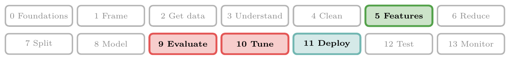
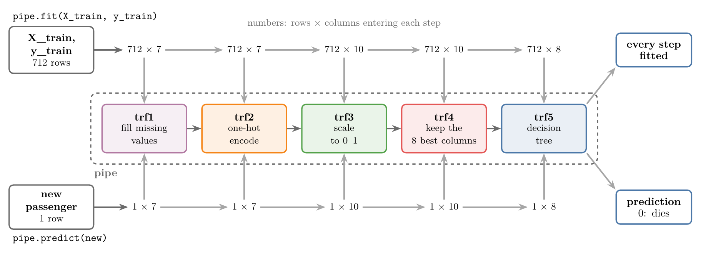
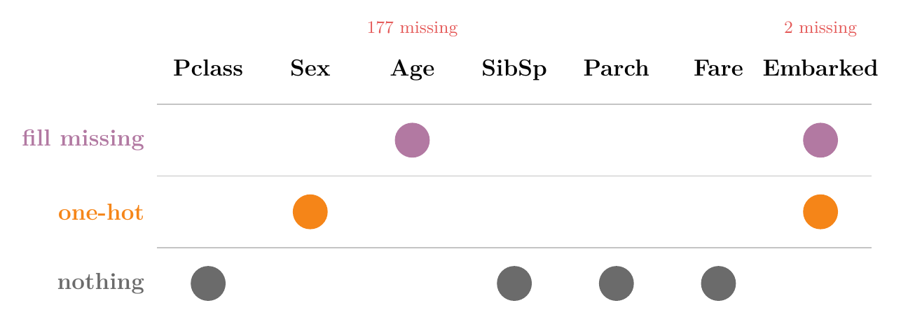
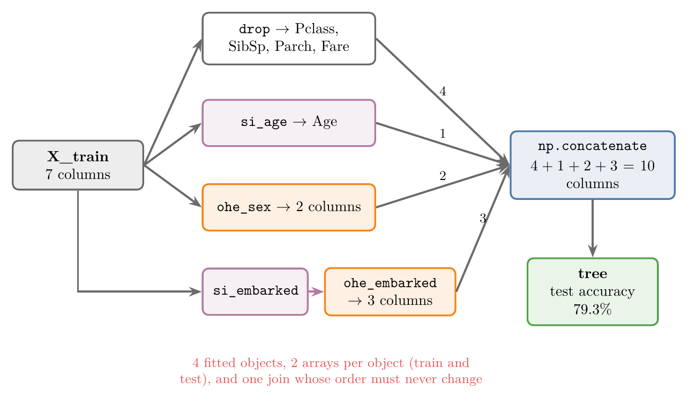
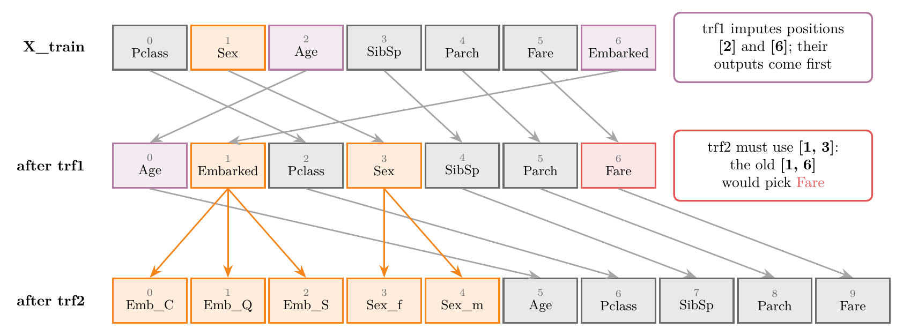
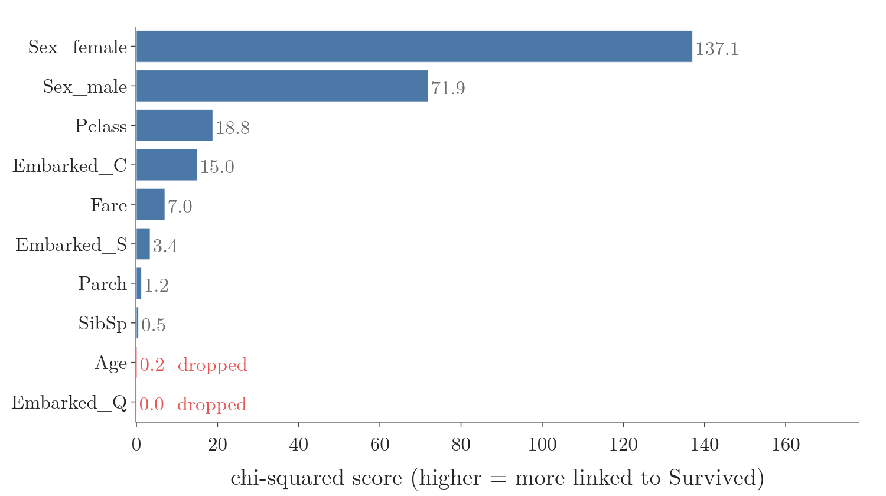
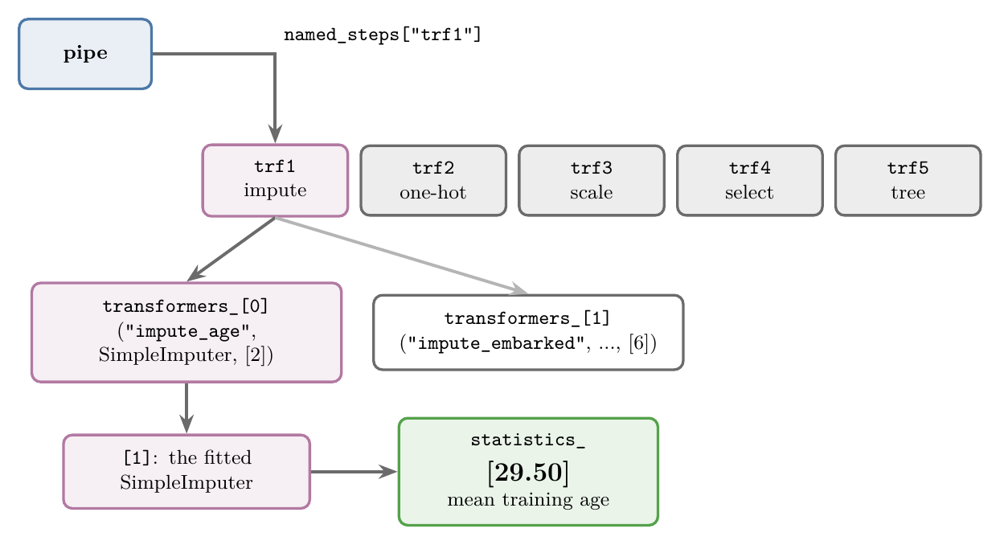
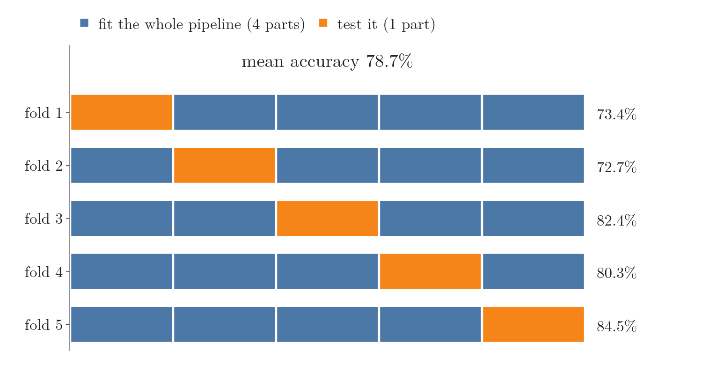
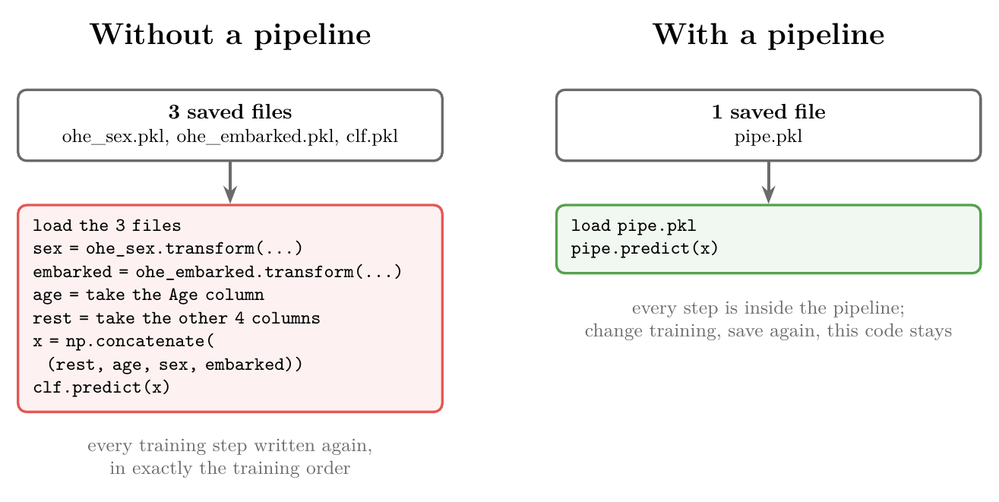

<!-- where-this-fits: generated by course_map/build_map.py; edit concepts.yaml, not this block -->
> **Where this fits:** Pipeline map steps 0 (Foundations), 5 (Engineer features), 9 (Evaluate), 10 (Tune), 11 (Deploy). See the [Course map](../01-course-map/note.md).
>
> 
>
> - **Builds on:** Software integration ([Note 7](../07-challenges-in-ml/note.md)); Hyperparameter tuning ([Note 9](../09-mldlc/note.md)); Data leakage ([Note 13](../13-toy-project/note.md)); APIs ([Note 17](../17-fetching-data-from-api/note.md)); Simple imputation (mean, median, mode, constant) ([Note 23](../23-what-is-feature-engineering/note.md)); Column transformer ([Note 28](../28-column-transformer/note.md)).
> - **Leads to:** Feature construction and splitting ([Note 45](../45-feature-construction-splitting/note.md)); Feature selection ([Note 46](../46-curse-of-dimensionality/note.md)); K-nearest neighbours ([Note 91](../91-knn/note.md)); Voting ensembles ([Note 102](../102-voting-ensemble/note.md)); Bagging ([Note 105](../105-bagging-intuition/note.md)); Random forest ([Note 108](../108-random-forest-intro/note.md)).
> - **Compare with:** Train-test split ([Note 13](../13-toy-project/note.md)); OOB score ([Note 105](../105-bagging-intuition/note.md)); Optuna ([Note 134](../134-optuna/note.md)); Bayesian optimisation ([Note 134](../134-optuna/note.md)); One-sample proportion test ([Note 570](../570-choosing-a-hypothesis-test/note.md)); Keras Tuner ([Note 1039](../1039-keras-tuner/note.md)).
<!-- /where-this-fits -->

## 1. Overview

> **Key point:** A pipeline chains every preprocessing step and the model into one object, so the same steps run in the same order on the training data, the test data and every new input.

Figure 1 shows the whole topic. Five steps live inside one object called `pipe`:

1. fill missing values;
2. one-hot encode;
3. scale;
4. keep the best columns;
5. train a decision tree.

 Calling `pipe.fit` sends the 712 training observations (records, one row each) through every step; calling `pipe.predict` sends one new passenger through the same fitted steps and gives a prediction.



## 2. What a pipeline is

> **Key point:** In a pipeline, the output of each step is the input of the next one, and scikit-learn passes the data along by itself.

A **pipeline** (G-1499) is a mechanism that chains several steps together, so that the output of each step is used as the input to the next. Think of a car assembly line: each station does one job and passes the car on, and every car goes through the same stations in the same order. We give the data to the first step and take the result from the last one; everything in between is handled internally.

Suppose a dataset has missing values and categorical features (input variables, one column each of the data table). Building a model then takes three steps:

1. Fill the missing values.
2. Encode the categorical columns.
3. Train the model.

Done separately, these are three pieces of code. With a pipeline they become one object: we give it the raw input, and it returns the output.

### 2.1 Why chaining the steps matters

> **Key point:** Every input the model ever sees needs exactly the same preprocessing, and a pipeline guarantees that.

The training set, the test set and every future input must go through the same preprocessing. The future inputs are the important case: once a model is **deployed** (G-593) to a server, for example behind a website, each new input arrives raw. A raw input may have missing values to fill and categories to encode before the model can use it.

Without a pipeline, every preprocessing step must be written a second time in the website's code. With a pipeline, the steps travel with the model, so nothing has to be repeated.

To see the difference, we build the same small project twice: first without a pipeline, then with one.

## 3. The Titanic data

> **Key point:** 891 passengers; we predict `Survived` (1 = survived, 0 = died) from seven features, two of which have missing values.

The data is Kaggle's Titanic training file: one row per passenger on the Titanic, so each passenger is one **observation** (G-1374). We drop four columns that are not useful here: `PassengerId`, `Name`, `Ticket` and `Cabin`. Eight columns remain.

| Survived | Pclass | Sex | Age | SibSp | Parch | Fare | Embarked |
|---|---|---|---|---|---|---|---|
| 0 | 3 | male | 22.0 | 1 | 0 | 7.25 | S |
| 1 | 1 | female | 38.0 | 1 | 0 | 71.28 | C |
| 1 | 3 | female | 26.0 | 0 | 0 | 7.93 | S |

The columns mean:

- **Survived:** the **target** (G-1949), the output we predict. 1 if the passenger survived, 0 if not.
- **Pclass:** ticket class, 1, 2 or 3.
- **Sex:** male or female.
- **Age:** age in years.
- **SibSp:** number of siblings and spouses on board.
- **Parch:** number of parents and children on board.
- **Fare:** ticket price.
- **Embarked:** port where the passenger boarded: C (Cherbourg), Q (Queenstown) or S (Southampton).

The other seven columns are the **features** (G-772). The task is a model that takes a passenger's seven features and predicts whether that passenger survives.

### 3.1 What the columns need

> **Key point:** Age and Embarked have missing values; Sex and Embarked are nominal text.

`df.isnull().sum()` shows two columns with missing values: Age (177 missing) and Embarked (2 missing). We cannot train a model until they are filled.

Sex and Embarked hold text with no order, so they need one-hot encoding. The other columns are already numbers.

Figure 2 sorts the seven features by the work they need. Watch Embarked: it is the one column that needs both jobs.



> **Python:** Loading the data, dropping columns and splitting.
>
> ```python
> import pandas as pd
> from sklearn.model_selection import train_test_split
>
> df = pd.read_csv("data/titanic_train.csv")
> df = df.drop(columns=["PassengerId", "Name",
>                       "Ticket", "Cabin"])
> df.isnull().sum()   # Age: 177, Embarked: 2
>
> X_train, X_test, y_train, y_test = train_test_split(
>     df.drop(columns=["Survived"]),  # 7 inputs
>     df["Survived"],                 # target
>     test_size=0.2, random_state=42)
> # X_train: (712, 7), X_test: (179, 7)
> ```

## 4. Without a pipeline

> **Key point:** By hand, every step needs its own object, its own arrays for the training and test sets, and a final join.

### 4.1 Filling the missing values

> **Key point:** Age gets the mean age; Embarked gets the most frequent port, S.

The two columns need different imputers:

- **Age:** a `SimpleImputer` with its default setting fills each gap with the mean age of the training set.
- **Embarked:** a `SimpleImputer(strategy="most_frequent")` fills each gap with the most common port. In the training set that is S (Southampton).

> **Python:** One imputer per column.
>
> ```python
> from sklearn.impute import SimpleImputer
>
> si_age = SimpleImputer()
> si_embarked = SimpleImputer(strategy="most_frequent")
>
> X_train_age = si_age.fit_transform(X_train[["Age"]])
> X_train_embarked = si_embarked.fit_transform(
>     X_train[["Embarked"]])
>
> X_test_age = si_age.transform(X_test[["Age"]])
> X_test_embarked = si_embarked.transform(
>     X_test[["Embarked"]])
> ```

### 4.2 One-hot encoding Sex and Embarked

> **Key point:** Sex becomes 2 columns and Embarked 3; Embarked is encoded from its imputed array, not the original column.

Sex and Embarked each get their own `OneHotEncoder`. The two cannot share one encoder here: the imputed Embarked is now a separate array, while Sex is still in `X_train`. The original Embarked column in `X_train` still has its missing values.

Two settings matter:

- **`handle_unknown="ignore"`:** if a later input has a category never seen in training, the encoder outputs all zeros for it instead of raising an error.
- **No `drop="first"`:** we keep every column. Dropping one avoids multicollinearity, which matters for linear models, but a decision tree is not affected by it.

> **Python:** One encoder per column.
>
> ```python
> from sklearn.preprocessing import OneHotEncoder
>
> ohe_sex = OneHotEncoder(sparse_output=False,
>                         handle_unknown="ignore")
> ohe_embarked = OneHotEncoder(sparse_output=False,
>                              handle_unknown="ignore")
>
> X_train_sex = ohe_sex.fit_transform(X_train[["Sex"]])
> X_train_embarked = ohe_embarked.fit_transform(
>     X_train_embarked)   # the imputed array
>
> X_test_sex = ohe_sex.transform(X_test[["Sex"]])
> X_test_embarked = ohe_embarked.transform(X_test_embarked)
> ```

### 4.3 Joining the arrays and training

> **Key point:** Four untouched columns, plus Age, plus 2 Sex columns, plus 3 Embarked columns: 10 columns.

The four columns that needed nothing (Pclass, SibSp, Parch, Fare) are taken out with `drop`. Then `np.concatenate` joins everything side by side, for both sets: 4 + 1 + 2 + 3 = 10 columns.

A decision tree is trained on the result. On the test set it gets an accuracy of 79.3%.

Figure 3 draws the whole manual route. Watch how many separate objects and arrays feed the one join at the end.



> **Python:** Joining and training.
>
> ```python
> import numpy as np
> from sklearn.tree import DecisionTreeClassifier
> from sklearn.metrics import accuracy_score
>
> X_train_rem = X_train.drop(columns=["Sex", "Age",
>                                     "Embarked"])
> X_test_rem = X_test.drop(columns=["Sex", "Age",
>                                   "Embarked"])
> X_train_transformed = np.concatenate((X_train_rem,
>     X_train_age, X_train_sex, X_train_embarked), axis=1)
> X_test_transformed = np.concatenate((X_test_rem,
>     X_test_age, X_test_sex, X_test_embarked), axis=1)
> # (712, 10) and (179, 10)
>
> clf = DecisionTreeClassifier(random_state=42)
> clf.fit(X_train_transformed, y_train)
> accuracy_score(y_test, clf.predict(X_test_transformed))
> # 0.793
> ```

A column transformer would have made this part shorter, but the next problem remains even with one.

### 4.4 Predicting for a new passenger

> **Key point:** The website's code must load every fitted encoder and repeat every training step, in the same order.

Suppose the model goes behind a website. A visitor types in a new passenger's details, and the model says whether that passenger survives. For this, the website's code needs more than the trained tree.

The fitted objects are saved to files with **pickle** (G-1494), Python's tool for writing an object to a file and reading it back later:

- **`clf.pkl`:** the trained decision tree.
- **`ohe_sex.pkl` and `ohe_embarked.pkl`:** the two fitted encoders. A new input arrives as "male" and "S", but the tree only understands numbers, so the website must encode them exactly as in training.

The imputers are not saved. The website's form will not accept an empty field, so a new input never has missing values. Saving them would not hurt, but they would never be used.

> **Python:** Saving the fitted objects.
>
> ```python
> import pickle
>
> pickle.dump(ohe_sex, open("models/ohe_sex.pkl", "wb"))
> pickle.dump(ohe_embarked,
>             open("models/ohe_embarked.pkl", "wb"))
> pickle.dump(clf, open("models/clf.pkl", "wb"))
> ```
>
> `"wb"` opens the file for writing in binary; `"rb"` opens it for reading. A `.pkl` file is binary: we cannot read it, only load it.

The website's code then loads the three files and rebuilds the 10 columns for the new passenger: second class, male, 31 years old, no siblings, spouse, parents or children on board, fare 10.5, boarded at Southampton.

> **Python:** The website's code without a pipeline.
>
> ```python
> ohe_sex = pickle.load(open("models/ohe_sex.pkl", "rb"))
> ohe_embarked = pickle.load(
>     open("models/ohe_embarked.pkl", "rb"))
> clf = pickle.load(open("models/clf.pkl", "rb"))
>
> # Pclass, Sex, Age, SibSp, Parch, Fare, Embarked
> new = pd.DataFrame([[2, "male", 31.0, 0, 0, 10.5, "S"]],
>                    columns=X_train.columns)
>
> new_sex = ohe_sex.transform(new[["Sex"]])
> new_embarked = ohe_embarked.transform(
>     new[["Embarked"]].values)
> new_age = new[["Age"]].values
> new_rem = new[["Pclass", "SibSp", "Parch", "Fare"]].values
>
> # same order as in training: rest, age, sex, embarked
> new_transformed = np.concatenate(
>     (new_rem, new_age, new_sex, new_embarked), axis=1)
> clf.predict(new_transformed)   # 1: survives
> ```

### 4.5 What goes wrong without a pipeline

> **Key point:** Every training step is written twice, the order must match exactly, and every change to training forces a change to the website's code.

The code above has three problems:

- **Repeated work:** every preprocessing step from training is written again in the production code, the code that runs on the server.
- **Fragile order:** the 10 columns must be joined in exactly the training order. One swap gives wrong predictions without any error.
- **Changes spread:** if we change one preprocessing step in training, we must change the production code to match.

Repeating and re-ordering steps by hand is a poor way to write code, and the reason pipelines are used.

## 5. Building a pipeline

> **Key point:** We plan the steps, build each one as an object, and chain them with `Pipeline`.

### 5.1 The plan

> **Key point:** Impute, one-hot encode, scale, select the best columns, train: five steps.

The pipeline has five steps, named `trf1` to `trf5`:

1. **trf1, impute:** fill the missing Age and Embarked values, with a column transformer.
2. **trf2, one-hot encode:** encode Sex and Embarked, with a second column transformer.
3. **trf3, scale:** bring every column to the range 0 to 1 with `MinMaxScaler`, so all columns are on a similar scale.
4. **trf4, feature selection:** keep only the 8 most useful of the 10 columns.
5. **trf5, model:** a decision tree.

Feature selection is not needed for this data. The step is included to show how such a step fits into a pipeline.

The data is split exactly as before. `X_train` still has the seven raw columns.

### 5.2 Step 1: imputation

> **Key point:** Inside a pipeline, we choose columns by position, because after the first step the data is a NumPy array without column names.

`trf1` is the same imputation as in Section 4.1, written as one column transformer. The columns are given by position, not by name: Age is at position 2 and Embarked at position 6.

The reason is the output. A column transformer returns a NumPy array, which has no column names.

The next step receives that array, so it cannot find a column by its name. Using positions in every step avoids this problem.

> **Python:** Step 1.
>
> ```python
> from sklearn.compose import ColumnTransformer
>
> trf1 = ColumnTransformer([
>     ("impute_age", SimpleImputer(), [2]),
>     ("impute_embarked",
>      SimpleImputer(strategy="most_frequent"), [6]),
> ], remainder="passthrough")
> ```
>
> `remainder="passthrough"` keeps the five other columns. Without it they would be dropped.

### 5.3 Positions refer to the previous step's output

> **Key point:** A column transformer puts its transformed columns first, so after `trf1` Sex and Embarked are at positions 3 and 1, not 1 and 6.

The column transformer puts the transformed columns first and the `remainder` columns after them. So `trf1` changes the column order. Figure 4 shows how:

- **Before trf1:** Pclass, Sex, Age, SibSp, Parch, Fare, Embarked.
- **After trf1:** Age, Embarked, Pclass, Sex, SibSp, Parch, Fare.



`trf2` receives the reordered array. In it, Embarked is at position 1 and Sex at position 3, so `trf2` must use `[1, 3]`.

The original positions of Sex and Embarked, `[1, 6]`, would be wrong here. Position 6 is now Fare, so the encoder would one-hot encode every distinct fare. The data would grow from 10 columns to 228, and the test accuracy would drop from 78.8% to 62.6%, with no error message.

> **Extra:** Wrong positions are a common pipeline bug. Before choosing positions for a step, check what the previous step outputs, for example with `pipe[:1].fit_transform(X_train)[:3]`. Section 10 shows a way to use column names instead.

### 5.4 Step 2: one-hot encoding

> **Key point:** One encoder handles Sex and Embarked together, because both are in the same array now.

Without a pipeline we needed two encoders, because Embarked and Sex lived in different arrays. Inside the pipeline both come out of `trf1` in one array, so one encoder handles both.

The output of `trf2` has 3 Embarked columns, 2 Sex columns and the 5 other columns: 10 columns.

> **Python:** Step 2.
>
> ```python
> trf2 = ColumnTransformer([
>     ("ohe_sex_embarked",
>      OneHotEncoder(sparse_output=False,
>                    handle_unknown="ignore"),
>      [1, 3]),   # Embarked and Sex, after trf1
> ], remainder="passthrough")
> ```

### 5.5 Step 3: scaling

> **Key point:** `MinMaxScaler` puts all 10 columns between 0 and 1; we use it rather than standardization because the next step needs values that are never negative.

`trf3` applies `MinMaxScaler` (normalization) to all 10 columns. Standardization would also scale the data, but it gives negative values. The feature selection test in the next step only accepts values of 0 or more, so normalization is the right choice here.

The columns are given as `slice(0, 10)`: positions 0 up to, but not including, 10. The slice covers all 10 columns coming out of `trf2`.

> **Python:** Step 3.
>
> ```python
> from sklearn.preprocessing import MinMaxScaler
>
> trf3 = ColumnTransformer([
>     ("scale", MinMaxScaler(), slice(0, 10)),
> ])
> ```
>
> `slice(0, 10)` is Python's object form of `0:10`.

### 5.6 Step 4: feature selection

> **Key point:** `SelectKBest` scores each column against the target and keeps the `k` best; it needs no column transformer because it looks at every column.

Feature selection (see the [feature engineering Note](../23-what-is-feature-engineering/note.md)) keeps only the most useful features. **`SelectKBest`** does the job simply: it gives every column a score and keeps the `k` columns with the highest scores.

The score here comes from `chi2`, the **chi-squared test** (G-382). The test measures how strongly each column is linked to the target; it only works on values of 0 or more (scikit-learn docs, `chi2`).

With `k=8`, two of the 10 columns are dropped. How the test works is covered with feature selection in a later Note.

Figure 5 shows the scores the fitted `trf4` gave the 10 columns. The two lowest, Age and Embarked_Q, are the two it drops.



> **Python:** Step 4.
>
> ```python
> from sklearn.feature_selection import SelectKBest, chi2
>
> trf4 = SelectKBest(score_func=chi2, k=8)
> ```

### 5.7 Step 5: the model

> **Key point:** The last step is the model itself.

> **Python:** Step 5.
>
> ```python
> trf5 = DecisionTreeClassifier(random_state=42)
> ```
>
> `random_state=42` makes the tree the same on every run, so our numbers can be reproduced.

### 5.8 Chaining the steps with Pipeline

> **Key point:** `Pipeline` takes a list of (name, object) tuples, in the order the data should flow.

The class **`Pipeline`** (in `sklearn.pipeline`) takes a list of tuples. Each tuple has two items: a name we choose, and the step object. The order of the list is the order the data flows through.

> **Python:** The pipeline.
>
> ```python
> from sklearn.pipeline import Pipeline
>
> pipe = Pipeline([
>     ("trf1", trf1),
>     ("trf2", trf2),
>     ("trf3", trf3),
>     ("trf4", trf4),
>     ("trf5", trf5),
> ])
> ```

### 5.9 Pipeline compared with make_pipeline

> **Key point:** `make_pipeline` builds the same pipeline without asking for names; it names each step after its class.

**`make_pipeline`** is a shorter way to write the same thing: we pass only the objects. The names are made up automatically from the class names, in lower case.

> **Python:** The same pipeline with make_pipeline.
>
> ```python
> from sklearn.pipeline import make_pipeline
>
> pipe2 = make_pipeline(trf1, trf2, trf3, trf4, trf5)
> pipe2.named_steps.keys()
> # 'columntransformer-1', 'columntransformer-2',
> # 'columntransformer-3', 'selectkbest',
> # 'decisiontreeclassifier'
> ```

Both build the same pipeline, so the choice is a matter of taste. Names we choose ourselves, as with `Pipeline`, are shorter and easier to read when we look inside the pipeline or tune it (Sections 7 and 9).

The same pairing exists for column transformers: `make_column_transformer` takes (transformer, columns) pairs and drops the name that `ColumnTransformer` asks for.

## 6. Training and predicting with a pipeline

> **Key point:** One `fit` call trains every step in order; one `predict` call sends new data through all the fitted steps.

Calling `pipe.fit(X_train, y_train)` sends `X_train` into `trf1`. The output of `trf1` goes into `trf2`, its output into `trf3`, then `trf4`, and finally the decision tree is trained on what comes out of `trf4`. Every step learns from the training set only.

Calling `pipe.predict(X_test)` sends the test set through the same fitted steps. Nothing is learned again: each step reuses what it learned from the training set. The test accuracy is 78.8%.

> **Python:** Training and testing the pipeline.
>
> ```python
> pipe.fit(X_train, y_train)
> y_pred = pipe.predict(X_test)
> accuracy_score(y_test, y_pred)   # 0.788
> ```

The accuracy is close to the 79.3% of Section 4. The two models are not identical: the pipeline also scales the data and drops two columns before the tree sees them.

### 6.1 One new passenger through the pipeline

> **Key point:** The same steps that processed 712 training rows process a single new row, with no extra code.

Figure 6 follows the new passenger of Section 4.4 through the fitted pipeline. Each step changes the row exactly as it changed the training rows: the column order, the one-hot columns, the scaling with the training minimum and maximum, and the two dropped columns. At the end the tree predicts 0: this model says the passenger does not survive.


The model of Section 4 predicted 1 for the same passenger. The two models are trained differently, so for a borderline passenger they can disagree.

### 6.2 Pipelines without a model

> **Key point:** If the last step is a model, we call `fit` and `predict`; if the pipeline only transforms data, we call `fit_transform` and `transform`.

There are two kinds of pipeline:

- **Ending with a model:** like `pipe`. We call `fit` to train it and `predict` to get predictions.
- **Only preprocessing steps:** for example, just imputation, encoding and scaling. There is nothing to predict, so we call `fit_transform` on the training set and `transform` on the test set, as with a single transformer.

> **Python:** A preprocessing-only pipeline.
>
> ```python
> prep = Pipeline([("trf1", trf1), ("trf2", trf2),
>                  ("trf3", trf3)])
> X_train_ready = prep.fit_transform(X_train)  # (712, 10)
> X_test_ready = prep.transform(X_test)        # (179, 10)
> ```

## 7. Looking inside a pipeline

> **Key point:** A fitted pipeline can be drawn as a diagram, and every fitted step and its learned values can be pulled out by name.

### 7.1 The pipeline as a diagram

> **Key point:** In Jupyter, showing a pipeline object draws it as a diagram of its steps.

In a Jupyter Notebook, a cell that ends with `pipe` draws the pipeline as a diagram. Each box is a step, and column transformers show their inner transformers side by side with their columns. Clicking a box shows its settings.

The diagram makes it easy for anyone to see what the pipeline does:

1. impute Age and Embarked;
2. one-hot encode two columns;
3. scale;
4. select the best columns;
5. train the tree.

> **Extra:** Older scikit-learn versions needed `set_config(display="diagram")` first. The diagram has been the default since version 1.1 (scikit-learn release notes, 1.1).

### 7.2 Pulling out fitted steps

> **Key point:** `named_steps` is a dictionary from each step's name to its fitted object.

**`named_steps`** gives every step of the pipeline, under the names we chose. From a step we can go further inside, which helps when debugging.

For example, to find the mean age that the first imputer learned:

1. `pipe.named_steps["trf1"]` is the first column transformer.
2. Its **`transformers_`** attribute is the list of its fitted (name, transformer, columns) tuples. `[0]` is the first tuple, the Age imputer.
3. `[1]` takes the second item of that tuple: the fitted `SimpleImputer`.
4. Its `statistics_` attribute holds the value it fills gaps with.

Figure 7 draws the same path. Each arrow is one piece of the code below.



> **Python:** Looking inside the fitted pipeline.
>
> ```python
> pipe.named_steps["trf1"].transformers_[0][1].statistics_
> # [29.50]: the mean age of the training set
> pipe.named_steps["trf1"].transformers_[1][1].statistics_
> # ['S']: the most frequent port
> pipe.named_steps["trf4"].get_support()
> # True for the 8 columns that were kept
> ```

## 8. Cross-validation with a pipeline

> **Key point:** A whole pipeline can be passed to `cross_val_score`, exactly like a single model.

**Cross-validation** (G-510) tests a model more reliably than one train-test split. The training data is cut into 5 parts; the model is trained on 4 parts and tested on the fifth, five times over, so each part is the test part once.

The average of the five accuracies is the result. Cross-validation is covered fully in a later Note.

`cross_val_score` accepts a pipeline wherever it accepts a model. Here the average accuracy is 78.7%.

Figure 8 shows the five rounds. Watch the orange part move: in each round the whole pipeline is fitted on the four blue parts only.



> **Python:** Cross-validating the pipeline.
>
> ```python
> from sklearn.model_selection import cross_val_score
>
> cross_val_score(pipe, X_train, y_train, cv=5,
>                 scoring="accuracy").mean()   # 0.787
> ```

> **Extra:** Because every step is inside the pipeline, every step is refitted on the 4 training parts each time. The imputer's mean, the scaler's minimum and maximum, and the chosen columns never see the part used for testing. Preprocessing the whole training set first and then cross-validating only the model would let the test part leak into training. Pipelines prevent this quiet form of data leakage (scikit-learn User Guide, "Common pitfalls").

## 9. Hyperparameter tuning with a pipeline

> **Key point:** `GridSearchCV` can tune any step of a pipeline; a parameter is named as the step name, two underscores, then the parameter name.

A **hyperparameter** (G-910) is a setting of an algorithm that we choose before training. A decision tree's `max_depth`, for example, limits how many questions deep the tree can grow, and changing it can make the model better or worse. **Hyperparameter tuning** (G-909) means trying several values and keeping the best.

`GridSearchCV` does the search automatically. The search cross-validates the pipeline once for each value and keeps the value with the best average score.

For a single model, we would name the parameter just `max_depth`. In a pipeline, scikit-learn needs to know which step the parameter belongs to, so the name is **`step__parameter`**: the step's name, two underscores, then the parameter. Our tree is the step named `trf5`, so the name is `trf5__max_depth`.

> **Python:** Tuning max_depth inside the pipeline.
>
> ```python
> from sklearn.model_selection import GridSearchCV
>
> params = {"trf5__max_depth": [1, 2, 3, 4, 5, None]}
> grid = GridSearchCV(pipe, params, cv=5,
>                     scoring="accuracy")
> grid.fit(X_train, y_train)
>
> grid.best_score_    # 0.803
> grid.best_params_   # {'trf5__max_depth': 3}
> ```

The best tree has a depth of 3, with an average cross-validation accuracy of 80.3%. On the test set, the tuned pipeline scores 79.3%.

Figure 9 shows the score for every depth tried. Depth 3 is the peak; deeper trees score lower here.


> **Extra:** The same naming reaches deeper. For example, `trf4__k` tunes how many columns `SelectKBest` keeps, and `trf1__impute_age__strategy` tunes the Age imputer inside the first column transformer.

## 10. Exporting the pipeline for production

> **Key point:** One saved file holds every fitted step, so the production code is just load and predict.

We save the whole fitted pipeline to one file with pickle. The encoders and imputers do not need separate files, because everything they learned is already inside `pipe`.

> **Python:** Saving the pipeline.
>
> ```python
> pickle.dump(pipe, open("models/pipe.pkl", "wb"))
> ```

The production code loads that one file and calls `predict`. All the preprocessing of Section 4.4 disappears.

> **Python:** The website's code with a pipeline.
>
> ```python
> import pickle
> import pandas as pd
>
> pipe = pickle.load(open("models/pipe.pkl", "rb"))
>
> new = pd.DataFrame([[2, "male", 31.0, 0, 0, 10.5, "S"]],
>     columns=["Pclass", "Sex", "Age", "SibSp",
>              "Parch", "Fare", "Embarked"])
> pipe.predict(new)   # 0: does not survive
> ```

Figure 10 compares the two versions of the production code.



The bigger gain comes later. Suppose we change the training: add a step, remove one, or change a setting.

We save the new pipeline over `pipe.pkl` and put that file on the server. The production code does not change at all, so a change in training cannot break the website.

> **Extra:** `joblib` does the same job as pickle with simpler calls, and it handles models holding large NumPy arrays better (scikit-learn User Guide, "Model persistence"): `joblib.dump(pipe, "models/pipe.joblib")` and `pipe = joblib.load("models/pipe.joblib")`. With either tool, only load files from sources you trust: loading a pickle file can run any code hidden in it. Load the file with the same scikit-learn version that saved it (scikit-learn User Guide, "Model persistence").

> **Extra:** The new input is passed as a one-row DataFrame with the training column names. A bare NumPy array also works for this pipeline, because every step uses positions, but scikit-learn then warns that the input has no feature names.

### 10.1 Using column names instead of positions

> **Key point:** With `set_output(transform="pandas")`, every step passes a DataFrame to the next, so steps can pick columns by name.

> **Extra:** Section 10.1 goes beyond the basics: it uses newer scikit-learn tools that remove the position counting of Section 5.3.

Positions were needed because each column transformer outputs a nameless NumPy array. Calling **`set_output(transform="pandas")`** on the pipeline makes every step output a DataFrame instead, so the next step can find columns by name.

With `verbose_feature_names_out=False`, the column transformers keep plain names like `Age` and `Sex_male` instead of adding their own name as a prefix. Each step can then list its columns by name, wherever they ended up.

> **Python:** The same pipeline with column names.
>
> ```python
> pipe_named = Pipeline([
>     ("trf1", ColumnTransformer([
>         ("impute_age", SimpleImputer(), ["Age"]),
>         ("impute_embarked",
>          SimpleImputer(strategy="most_frequent"),
>          ["Embarked"]),
>     ], remainder="passthrough",
>        verbose_feature_names_out=False)),
>     ("trf2", ColumnTransformer([
>         ("ohe_sex_embarked",
>          OneHotEncoder(sparse_output=False,
>                        handle_unknown="ignore"),
>          ["Sex", "Embarked"]),
>     ], remainder="passthrough",
>        verbose_feature_names_out=False)),
>     ("trf3", MinMaxScaler()),
>     ("trf4", SelectKBest(score_func=chi2, k=8)),
>     ("trf5", DecisionTreeClassifier(random_state=42)),
> ]).set_output(transform="pandas")
>
> pipe_named.fit(X_train, y_train)   # accuracy 0.788
> pipe_named[:-1].get_feature_names_out()
> # Sex_female, Sex_male, Embarked_C, Embarked_S,
> # Pclass, SibSp, Parch, Fare
> ```

The named pipeline gives the same 78.8% accuracy, and `get_feature_names_out` shows which 8 columns reached the tree: Age and Embarked_Q were the two dropped. `pipe_named[:-1]` means every step except the last, the same slicing as for a list.

## 11. Summary

| | Without a pipeline | With a pipeline |
|---|---|---|
| Preprocessing objects | one per column and task | inside one object |
| Joining columns | `np.concatenate` by hand | automatic |
| Test set | every step called again | `pipe.predict(X_test)` |
| Saved files | one per fitted object (3 here) | one (`pipe.pkl`) |
| Production code | repeats every step, in order | load and `predict` |
| Change to training | production code changes too | save the file again; code stays |
| Cross-validation and tuning | preprocessing must be redone by hand | pass `pipe` to `cross_val_score` or `GridSearchCV` |

- A pipeline chains steps so each step's output is the next step's input.
- `Pipeline` takes (name, object) tuples; `make_pipeline` takes just the objects and names them itself.
- A pipeline ending in a model uses `fit` and `predict`; a preprocessing-only one uses `fit_transform` and `transform`.
- Column transformers inside a pipeline usually pick columns by position, and positions refer to the previous step's output: transformed columns come first.
- `named_steps` and `transformers_` reach any fitted step and its learned values.
- `cross_val_score` and `GridSearchCV` accept a pipeline; a step's parameter is named `step__parameter`.
- One pickled pipeline is all the production code needs.

## 12. Sources

**Built from**

- CampusX, "Machine Learning Pipelines A-Z | Day 29 | 100 Days of Machine Learning", YouTube, https://www.youtube.com/watch?v=xOccYkgRV4Q

**Other references**

- scikit-learn release notes. Version 1.1. scikit-learn.org/stable/whats_new.
- scikit-learn API reference. `sklearn.feature_selection.chi2`. scikit-learn.org.
- scikit-learn User Guide. Common pitfalls and recommended practices; Model persistence. scikit-learn.org.

## 13. Key terms

| Term | Meaning |
|---|---|
| Feature | An input variable, one column of the data table |
| Target | The output we predict |
| Observation | One record, one row of the data table |
| Pipeline | A chain of steps where each step's output is the next step's input, run as one object |
| Pipeline (class) | The scikit-learn class (in `sklearn.pipeline`) that builds a pipeline from a list of (name, object) tuples |
| make_pipeline | Function that builds a pipeline from objects alone, naming each step after its class |
| make_column_transformer | Function that builds a column transformer from (transformer, columns) pairs, without names |
| Production code | The code that runs the deployed model on a server, for example behind a website |
| named_steps | Dictionary of a pipeline's steps, from each name to its object |
| transformers_ | List of a fitted column transformer's (name, transformer, columns) tuples |
| handle_unknown="ignore" | `OneHotEncoder` setting that outputs all zeros for a category not seen in training |
| slice(0, 10) | Python object meaning positions 0 up to, not including, 10 |
| SelectKBest | scikit-learn class that scores every feature and keeps the `k` best |
| Chi-squared test (chi2) | A test scoring how strongly a feature is linked to the target; needs values of 0 or more |
| Cross-validation | Testing a model by training and testing it several times on different parts of the training data |
| Hyperparameter | A setting of an algorithm chosen before training, such as a tree's `max_depth` |
| Hyperparameter tuning | Trying several hyperparameter values and keeping the best |
| GridSearchCV | scikit-learn class that cross-validates every value in a grid and keeps the best |
| step__parameter | How a pipeline step's parameter is named: step name, two underscores, parameter name |
| pickle | Python's tool for saving an object to a file and loading it back |
| joblib | A library that saves and loads Python objects like pickle, better suited to large arrays |
