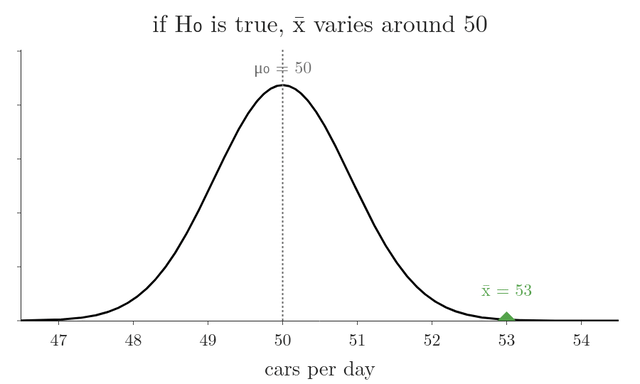
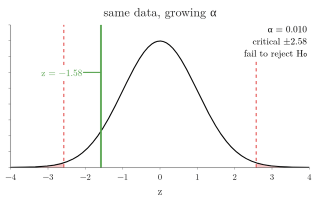
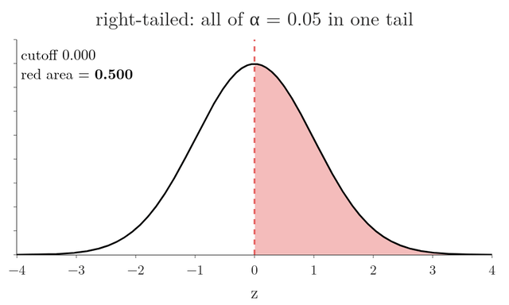
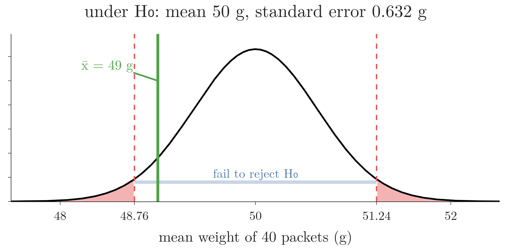
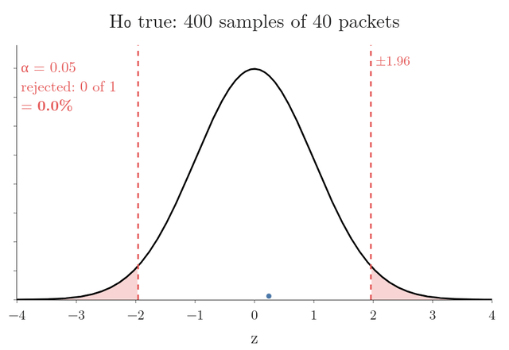
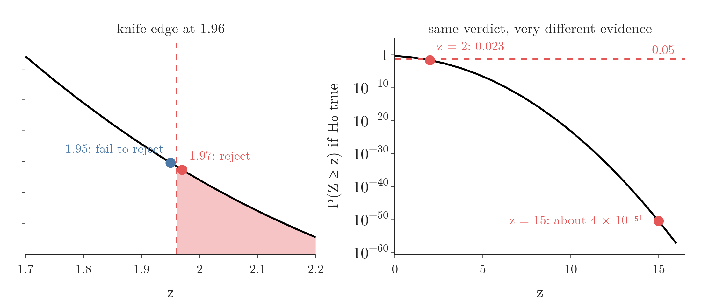

<!-- where-this-fits: generated by course_map/build_map.py; edit concepts.yaml, not this block -->
> **Where this fits:** Pipeline map step 0 (Foundations). See the [Course map](../01-course-map/note.md).
>
> 
>
> - **Builds on:** Inferential statistics ([Note 210](../210-statistics-roadmap/note.md)); Standard normal and the z-table ([Note 251](../251-standard-normal-and-z-table/note.md)); Sampling distribution and standard error ([Note 271](../271-sampling-distribution-and-clt/note.md)); Central limit theorem ([Note 271](../271-sampling-distribution-and-clt/note.md)); Type I and II errors, power, tails ([Note 292](../292-errors-power-and-tails/note.md)); P-values ([Note 300](../300-p-values/note.md)).
> - **Leads to:** Beta and A/B testing ([Note 292](../292-errors-power-and-tails/note.md)); T-tests: one-sample, two-sample, paired ([Note 301](../301-one-sample-t-test/note.md)); One-sample proportion test ([Note 570](../570-choosing-a-hypothesis-test/note.md)); Chi-square tests ([Note 571](../571-chi-square-tests/note.md)); One-way ANOVA ([Note 572](../572-one-way-anova/note.md)).
> - **Compare with:** Confidence intervals ([Note 282](../282-t-procedure/note.md)).
<!-- /where-this-fits -->

## 1. Overview

> **Key point:** In the rejection region approach we assume $H_0$ is true, measure how far the sample lands from what $H_0$ predicts, and reject $H_0$ when the sample lands in a tail region whose area is the significance level $\alpha$.


The [null and alternative hypotheses Note](../290-null-and-alternative-hypotheses/note.md) set up $H_0$ and $H_1$ and listed the eight steps of a hypothesis test. Here we run those steps end to end with the one-sample **z-test** (G-2143). Figure 1 shows where the two main examples end: the training program's z of 3.29 lands in the red rejection region, the chips' z of $-1.58$ does not.

We build the idea in this order:

1. the logic: assume $H_0$, then ask how surprising the sample is (section 3);
2. the z statistic: count the distance in standard errors (section 4);
3. the significance level $\alpha$: how rare is too rare (section 5);
4. the rejection region and the critical value (section 6);
5. one tail or two (section 7);
6. two complete examples, right-tailed and two-tailed (sections 8 and 9);
7. how $\alpha$ moves the rejection region (section 10);
8. the weakness of the approach, which p-values fix (section 11).

## 2. Terms we build on

> **Key point:** The standard normal curve and z-table, the central limit theorem with its standard error, and critical values.

- **Standard normal and z-table:** a z-score has the standard normal distribution, and the z-table gives the area to the left of any z (see the [standard normal Note](../251-standard-normal-and-z-table/note.md)).
- **Central limit theorem and standard error:** for a sample of $n \ge 30$, the sample mean $\bar{X}$ is approximately normal with mean $\mu$ and standard deviation $\sigma/\sqrt{n}$, the standard error (G-1872) (see the [central limit theorem Note](../271-sampling-distribution-and-clt/note.md)).
- **Critical value:** the z value that leaves a given area in the tail; 1.96 leaves 2.5% in each tail (see the [z-procedure Note](../280-confidence-intervals-z-procedure/note.md)).

## 3. The logic of a test

> **Key point:** We pretend $H_0$ is true, work out where sample means would then land, and reject $H_0$ only if our sample lands somewhere very unlikely.

**The question.** Rats that get no drug take **1.2 seconds** on average to respond to a stimulus. We inject **100 rats** with a new drug. Their mean response time is **1.05 seconds**, with a sample standard deviation of **0.5 seconds**. Does the drug change the response time?

**The hypotheses.** The **null hypothesis** (G-1361) is the status quo: the drug has no effect, so the mean with the drug is still 1.2 s. The **alternative hypothesis** (G-193) is that the drug has an effect:

$$H_0: \mu = 1.2, \qquad H_1: \mu \neq 1.2$$

**The logic, in plain words.**

1. Assume $H_0$ is true.
2. Work out how sample means of 100 rats would spread out if that were so.
3. Ask how likely a sample mean as far from 1.2 s as ours would be.
4. If that is very unlikely, $H_0$ is probably false: we reject it.

Step 2 is a picture we already know. If we took many samples of 100 rats, their means would form the **sampling distribution of the sample mean** (G-1735). By the central limit theorem it is close to normal. Under $H_0$ its centre is 1.2 s. Its spread is the standard error, $\sigma/\sqrt{n}$.

We do not know $\sigma$, so we use the sample's $s = 0.5$ in its place. With 100 rats that is a close approximation (the next section says how close):

$$\text{standard error} \approx \frac{0.5}{\sqrt{100}} = \frac{0.5}{10} = 0.05 \text{ s}$$

{height=45%}

In the first frames of Figure 2, watch the green dot at 1.05 s: it sits far out in the left tail of the curve that $H_0$ predicts.

## 4. The z statistic: counting standard errors

> **Key point:** The z statistic measures how many standard errors the sample mean lies from the mean claimed by $H_0$; the one-sample z-test needs $\sigma$ and a normal sampling distribution.

### 4.1 The idea on the rats

How far is 1.05 s from 1.2 s? In seconds the gap is 0.15. In standard errors it is

$$\frac{1.05 - 1.2}{0.05} = \frac{-0.15}{0.05} = -3$$

In Figure 2, the blue arrows lay three standard-error steps from 1.2 s down to 1.05 s. Our sample mean is **3 standard errors below** what $H_0$ predicts. This count is the **z statistic**, a **test statistic** (G-1963): the one number a test computes from the sample to make its decision.

### 4.2 The formula

If $H_0$ is true, the population mean is $\mu_0$, the value in $H_0$. The sample mean then varies around $\mu_0$ with standard error $\sigma/\sqrt{n}$, so standardizing it gives a standard normal variable.

1. **In words:** the distance between the sample mean and the mean claimed by $H_0$, measured in standard errors.
2. **Formula:**
   $$z = \frac{\bar{x} - \mu_0}{\sigma / \sqrt{n}}$$
   where $\bar{x}$ is the sample mean, $\mu_0$ the mean in $H_0$, $\sigma$ the population standard deviation and $n$ the sample size.
3. **Example:** a car factory makes $\mu_0 = 50$ cars a day, $\sigma = 5$; a sample of $n = 30$ days after a training program has $\bar{x} = 53$:
   $$z = \frac{53 - 50}{5/\sqrt{30}} = \frac{3}{0.913} = 3.29$$

We divide by $\sigma/\sqrt{n}$, not by $\sigma$, because we are standardizing a sample **mean**, whose spread is the standard error.

{height=40%}

Figure 3 does the same count for the factory: standard-error rulers laid end to end from $\mu_0 = 50$ to $\bar{x} = 53$. Watch the last frame: relabelling the same axis in rulers turns 53 into $z = 3.29$.

### 4.3 Assumptions

The one-sample z-test can be used when:

1. **Normality:** the population is normal, or the sample has at least 30 values, so that by the central limit theorem $\bar{X}$ is approximately normal;
2. **Known $\sigma$:** the population standard deviation is known;
3. **Random sample:** the sample is drawn at random.

If $\sigma$ is unknown, the exact test is the t-test (see the [one-sample t-test Note](../301-one-sample-t-test/note.md)). The rats break assumption 2: we used $s$ for $\sigma$. With $n = 100$ the difference is small. The area beyond $\pm 3$ is 0.0027 on the normal curve and 0.0034 on the t curve with 99 degrees of freedom (notebook, section 5), and both lead to the same decision below.

## 5. How rare is too rare: the significance level

> **Key point:** $\alpha$ is the probability of rejecting $H_0$ when it is actually true; we fix it before the test, usually at 0.05.

**How rare is our rat sample?** On a normal curve, 99.7% of the area lies within 3 standard deviations of the centre (the **68-95-99.7 rule**, G-53). So only about 0.3% of samples land 3 or more standard errors away, on either side. The exact area is 0.27%, or 0.135% in each tail (Figure 2, second step). If $H_0$ were true, a sample as extreme as ours would turn up less than 1 time in 300.

**Where to draw the line.** "Less than 1 in 300" sounds rare. But we need a fixed rule that says how rare is rare enough to reject $H_0$. That threshold is the **significance level** (G-1801), written $\alpha$:

> $\alpha$ is the probability of rejecting the null hypothesis when it is actually true.

With $\alpha = 0.05$, if we ran 100 tests in which $H_0$ was in fact true, about 5 would still reject it. This mistake is called a **Type I error** (G-2032) (see the [errors, power and tails Note](../292-errors-power-and-tails/note.md)).

Think of $\alpha$ as the sensitivity setting of a smoke alarm. A very sensitive alarm (large $\alpha$) goes off for burnt toast as well as for real fires; a dull one (small $\alpha$) rarely gives false alarms but needs more smoke before it sounds.

The usual choices are 0.05 (5%) and 0.01 (1%). For most problems 0.05 works well and is treated as the standard. In a specialised field, a domain expert may choose another value from knowledge of the domain.

The significance level and the confidence level are related but not the same. A 95% confidence level corresponds to $\alpha = 0.05$: confidence level $= 1 - \alpha$ (see the [z-procedure Note](../280-confidence-intervals-z-procedure/note.md)).

**Fix $\alpha$ first.** Without $\alpha$ there is no boundary between "reject" and "fail to reject". Choosing it after seeing the result would let us reach either answer: for any observed $z$ other than 0, a large enough $\alpha$ puts it in the rejection region. For the chips example of section 9 ($z = -1.58$, two-tailed), any $\alpha$ above $2 \times P(Z > 1.58) = 0.114$ would reject $H_0$.

{height=40%}

In Figure 4, watch the red tails creep inward as $\alpha$ grows: nothing about the data changes, yet the verdict flips from "fail to reject" to "reject" just past $\alpha = 0.114$.

## 6. The rejection region and the critical value

> **Key point:** The rejection region is the tail of the standard normal curve with area $\alpha$, on the side that $H_1$ points to; its boundary is the critical value.

**The idea.** Instead of asking "how rare is our sample?" each time, we mark in advance the part of the curve where samples are rarer than $\alpha$ allows. If our z lands there, we reject $H_0$.

**The terms.** The **rejection region** (also called the **critical region**) (G-1662) is the set of values of the test statistic for which we reject $H_0$. The rejection region lies in the tail or tails that $H_1$ points to, and its area is $\alpha$. The rest of the curve is the region where we fail to reject $H_0$. The **critical value** (G-504) is the boundary of the rejection region:

- **$H_1$ with $>$ (right-tailed):** all of $\alpha$ in the right tail. For $\alpha = 0.05$ we need the z with area 0.95 to its left. The z-table has 0.9495 at 1.64 and 0.9505 at 1.65, so the critical value lies between them: 1.645.
- **$H_1$ with $<$ (left-tailed):** all of $\alpha$ in the left tail: $-1.645$.
- **$H_1$ with $\neq$ (two-tailed):** $\alpha/2 = 0.025$ in each tail: $\pm 1.96$.

The decision rule is simple: if the test statistic falls in the rejection region, reject $H_0$; otherwise, fail to reject it. Carrying out a test this way is the **rejection region approach** (G-1663).

{height=40%}

Figure 5 finds both critical values by sliding a cutoff until the red area is 0.05. Watch the middle frames: 1.96 leaves only 0.025 in one tail, and ±1.645 leaves 0.10 across two.

**Back to the rats.** $H_1$ is $\mu \neq 1.2$, so the test is two-tailed with critical values $\pm 1.96$. Our $z = -3$ is below $-1.96$: it falls in the rejection region, and we **reject $H_0$**. In seconds, the cutoffs are $1.2 \pm 1.96 \times 0.05$, that is 1.102 s and 1.298 s, and 1.05 s lies beyond the lower one (Figure 2, third step). The data gives strong evidence that the drug changes the response time.

> **Extra:** One-sided and two-sided critical values (G-1383) are easy to mix up. At $\alpha = 0.05$, a one-tailed test uses 1.645 and a two-tailed test uses 1.96 (see the [t-procedure Note](../282-t-procedure/note.md) for the same point with t). Using 1.96 for a one-tailed test makes it stricter than intended (a real $\alpha$ of 0.025); using 1.645 for a two-tailed test makes it looser (a real $\alpha$ of 0.10).

> **Python:** Critical values come from `ppf`, the inverse of the CDF.
>
> ```python
> from scipy import stats
>
> stats.norm.ppf(0.95)      # 1.645: right-tailed, alpha = 0.05
> stats.norm.ppf(0.05)      # -1.645: left-tailed
> stats.norm.ppf(0.975)     # 1.960: two-tailed, alpha = 0.05
> ```

## 7. One tail or two: the same data, two questions

> **Key point:** $H_1$ with $\neq$ puts the rejection region in both tails; $H_1$ with $<$ or $>$ puts all of it in one tail.

**The idea.** In the rat test, a very slow mean would also have counted against $H_0$: any effect, up or down, was of interest. So we looked at both tails. That is a **two-tailed test** (G-2028).

Suppose instead that, before collecting data, we had reason to expect the drug to *lower* response time, and only a lowering mattered. Then

$$H_0: \mu = 1.2, \qquad H_1: \mu < 1.2$$

and only very low sample means count against $H_0$. All of $\alpha$ goes into the left tail. That is a **one-tailed test** (G-1385), here a left-tailed one (G-1693).

**The same rats, one tail.** The critical value is now $-1.645$, and in seconds the cutoff is $1.2 - 1.645 \times 0.05 = 1.118$ s. Our $z = -3$ is below $-1.645$: reject $H_0$ (Figure 2, last step). The tail area beyond our sample is now one tail only: half of 0.27%, which is 0.135%.

| | Two-tailed | One-tailed (left) |
|---|---|---|
| $H_1$ | $\mu \neq 1.2$ | $\mu < 1.2$ |
| Critical value at $\alpha = 0.05$ | $\pm 1.96$ | $-1.645$ |
| Cutoff in seconds | 1.102 and 1.298 | 1.118 |
| Area beyond our sample | 0.27% | 0.135% |
| Decision for $z = -3$ | reject | reject |

The direction of $H_1$ must be chosen before looking at the data; the [errors, power and tails Note](../292-errors-power-and-tails/note.md) shows what goes wrong when it is not.

## 8. Example: did a training program raise productivity?

> **Key point:** $z = 3.29$ lies beyond the critical value 1.645, so we reject $H_0$: the training program raised mean productivity.

A car factory makes **50 cars per day** on average, with a known population standard deviation of **5**. Some days it makes 45, some days 55. To raise output, the company runs a training program for its employees. Afterwards it measures the productivity of a random sample of **30** employees and finds a sample mean of **53 units per day**. Has the training significantly increased productivity?

1. **Hypotheses.** No benefit, against an increase:
   $$H_0: \mu = 50, \qquad H_1: \mu > 50$$
2. **Significance level.** $\alpha = 0.05$.
3. **Assumptions.** $n = 30$, so by the central limit theorem $\bar{X}$ is approximately normal. $\sigma = 5$ is known.
4. **Test.** Normal and $\sigma$ known: the one-sample z-test.
5. **Test statistic.** $z$.
6. **Conduct the test.** As in section 4.2:
   $$z = \frac{53 - 50}{5/\sqrt{30}} = 3.29$$
7. **Decide.** $H_1$ uses $>$, so the rejection region is the right tail beyond 1.645. Since $3.29 > 1.645$, $z$ falls in the rejection region (Figure 1, left): we **reject $H_0$**. The data gives strong evidence against $H_0$, in favour of $H_1$.
8. **Interpret.** The training program increased mean daily productivity above 50 units.

> **Python:** The whole test in a few lines.
>
> ```python
> import numpy as np
> from scipy import stats
>
> z = (53 - 50) / (5 / np.sqrt(30))   # 3.29
> z_crit = stats.norm.ppf(1 - 0.05)    # 1.645
> z > z_crit                          # True: reject H0
> ```

## 9. Example: do chips packets weigh 50 g?

> **Key point:** $z = -1.58$ lies between $-1.96$ and $1.96$, so we fail to reject $H_0$: the sample does not show that the mean weight differs from 50 g.

A snack company claims that its packets of chips weigh **50 g** on average. A consumer watchdog wants to know whether the true mean weight differs from 50 g, more or less. It buys a random sample of **40** packets and finds a mean weight of **49 g**. The population standard deviation is known: **4 g**.

1. **Hypotheses.**
   $$H_0: \mu = 50, \qquad H_1: \mu \neq 50$$
2. **Significance level.** $\alpha = 0.05$.
3. **Assumptions.** $n = 40 \ge 30$: $\bar{X}$ is approximately normal. $\sigma = 4$ is known.
4. **Test.** One-sample z-test.
5. **Test statistic.** $z$.
6. **Conduct the test.**
   $$z = \frac{49 - 50}{4/\sqrt{40}} = \frac{-1}{0.632} = -1.58$$
7. **Decide.** $H_1$ uses $\neq$: we do not know the direction, so the test is two-tailed. $\alpha = 0.05$ is split into 0.025 in each tail, giving critical values $\pm 1.96$. Since $-1.96 < -1.58 < 1.96$, $z$ falls between them (Figure 1, right): we **fail to reject $H_0$**.
8. **Interpret.** The 40 packets do not give enough evidence that the mean weight differs from 50 g. The watchdog has no case against the company.

The same decision can be read in grams, as we did for the rats in seconds. Under $H_0$ the mean of 40 packets has standard error $4/\sqrt{40} = 0.632$ g, so we fail to reject for any sample mean between $50 - 1.96 \times 0.632 = 48.76$ g and $50 + 1.96 \times 0.632 = 51.24$ g.

{height=30%}

In Figure 6, watch where 49 g sits: inside the blue band, about one gram short of the left cutoff.

Failing to reject does not prove that the packets weigh exactly 50 g on average. As the [null and alternative hypotheses Note](../290-null-and-alternative-hypotheses/note.md) showed, failing to reject $H_0$ only means the evidence was not strong enough.

## 10. How the significance level moves the rejection region

> **Key point:** A smaller $\alpha$ pushes the critical values outward and shrinks the rejection region, so rejecting a true $H_0$ becomes rarer.


Figure 7 shows a two-tailed test at three significance levels:

| $\alpha$ | Area in each tail | Critical values |
|---|---|---|
| 0.30 | 0.15 | $\pm 1.04$ |
| 0.05 | 0.025 | $\pm 1.96$ |
| 0.01 | 0.005 | $\pm 2.58$ |

- **Lower $\alpha$** (5% to 1%): the critical values move out and the region where we fail to reject grows. A true $H_0$ is rejected less often.
- **Higher $\alpha$** (say 30%): the rejection region grows. Even when $H_0$ is true, the statistic now often lands in the rejection region by chance, and we wrongly reject $H_0$.

Figure 8 checks that meaning by simulation. We repeat the chips test of section 9 400 times with packets whose true mean really is 50 g, so $H_0$ is true every time. Watch each sample's z land under the curve: about 5% land in the red tails and wrongly reject $H_0$ (here 24 of 400, 6.0%). Then $\alpha$ sweeps over the same 400 values, and the rejected share follows it (124 of 400 at $\alpha = 0.30$). Last, the watchdog's own $z = -1.58$ lands between the critical values.

{height=45%}

The red area is exactly what "the probability of rejecting $H_0$ when it is actually true" means. A lower $\alpha$ has a cost too, which the [errors, power and tails Note](../292-errors-power-and-tails/note.md) explains.

## 11. The weakness of the rejection region approach

> **Key point:** The rejection region approach only says on which side of a boundary the statistic fell; it cannot say how strong the evidence is.

The rejection region approach gives a yes-or-no answer, and that causes two problems.

**A knife-edge boundary.** In a two-tailed test at $\alpha = 0.05$, $z = 1.97$ means "reject" and $z = 1.95$ means "fail to reject". A difference of 0.02 flips the decision, although the two samples are almost equally convincing.

**No strength of evidence.** $z = 2$ and $z = 15$ both fall in the rejection region and both lead to "reject $H_0$". But they are very different:

| $z$ | Probability of a value at least this large if $H_0$ is true | Evidence against $H_0$ |
|---|---|---|
| 2 | 0.023 | moderate |
| 15 | about $4 \times 10^{-51}$ | overwhelming |

A z of 15 is so unlikely under $H_0$ that it leaves almost no doubt, while a z of 2 is the kind of value that turns up 2 or 3 times in 100 by chance. The rejection region approach treats them the same.

{height=30%}

Figure 9 shows both problems. Watch the right panel: the yes/no rule sees only that both points sit below the dashed 0.05 line.

The fix is the number we already met for the rats in section 5: the tail area beyond our own sample, 0.27% two-tailed. That area is the **p-value** (G-1433). It measures the strength of the evidence against $H_0$. The p-value approach is the one used in practice, and the subject of the [p-values Note](../300-p-values/note.md).

## 12. Summary

| | Rat drug | Training program | Chips packets |
|---|---|---|---|
| $H_0$ / $H_1$ | $\mu = 1.2$ / $\mu \neq 1.2$ | $\mu = 50$ / $\mu > 50$ | $\mu = 50$ / $\mu \neq 50$ |
| Data | $n = 100$, $\bar{x} = 1.05$, $s = 0.5$ | $n = 30$, $\bar{x} = 53$, $\sigma = 5$ | $n = 40$, $\bar{x} = 49$, $\sigma = 4$ |
| Tails | two | right | two |
| Critical value ($\alpha = 0.05$) | $\pm 1.96$ | 1.645 | $\pm 1.96$ |
| $z$ | $-3$ | 3.29 | $-1.58$ |
| Decision | reject $H_0$ | reject $H_0$ | fail to reject $H_0$ |

- The logic: assume $H_0$, find where sample means would land, and reject if ours lands somewhere very unlikely.
- $z = (\bar{x} - \mu_0)/(\sigma/\sqrt{n})$ counts standard errors; the one-sample z-test needs normality (or $n \ge 30$), a known $\sigma$ and a random sample.
- $\alpha$, fixed in advance, is the probability of rejecting a true $H_0$; 0.05 is the standard choice.
- The rejection region has area $\alpha$ in the tail(s) $H_1$ points to; its boundary is the critical value.
- Right-tailed 1.645, two-tailed $\pm 1.96$ at $\alpha = 0.05$.
- A smaller $\alpha$ shrinks the rejection region.
- The approach cannot tell weak from overwhelming evidence; p-values can.

## 13. Sources

**Built from**

- CampusX, "Session 45 - Hypothesis Testing Part 1 | DSMP 2023", YouTube, https://www.youtube.com/watch?v=S94mx6OL7kM. The eight steps, the significance level, the rejection region and the two worked examples (sections 5, 6, 8 and 9).
- Khan Academy, "Hypothesis testing and p-values", YouTube, https://www.youtube.com/watch?v=-FtlH4svqx4. The rat drug test and its logic (sections 3 to 6).
- Khan Academy, "One-tailed and two-tailed tests", YouTube, https://www.youtube.com/watch?v=mvye6X_0upA. The same rat data as a one-tailed test (section 7).

## 14. Key terms

| Term | Meaning |
|---|---|
| Significance level ($\alpha$) | The probability of rejecting $H_0$ when it is actually true; fixed before the test, usually 0.05 |
| Z-test (one-sample) | A test of a population mean when $\sigma$ is known and $\bar{X}$ is normal, using $z = (\bar{x} - \mu_0)/(\sigma/\sqrt{n})$ |
| Z statistic | The value of $z$ computed from the sample in a z-test: the distance from $\mu_0$ in standard errors |
| Test statistic | The number a test computes from the sample to make its decision, such as $z$ |
| Rejection region (critical region) | The values of the test statistic for which we reject $H_0$; its area under $H_0$ is $\alpha$ |
| Critical value | The boundary of the rejection region, e.g. 1.645 (right-tailed) or $\pm 1.96$ (two-tailed) at $\alpha = 0.05$ |
| One-tailed and two-tailed test (G-1385, G-2028) | A test whose $H_1$ has a direction ($<$ or $>$), with all of $\alpha$ in one tail; or whose $H_1$ is $\neq$, with $\alpha/2$ in each tail |
| Strength of evidence | How strongly the data speaks against $H_0$; the rejection region approach does not measure it |
