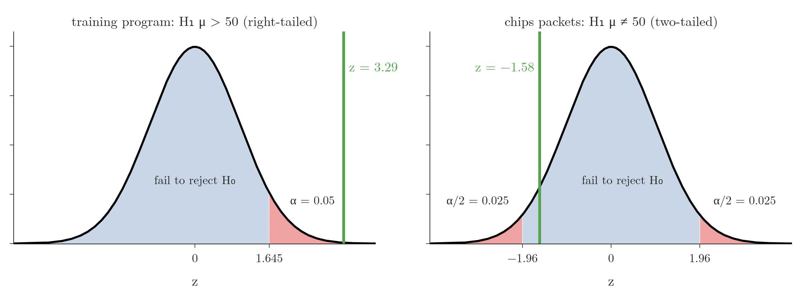
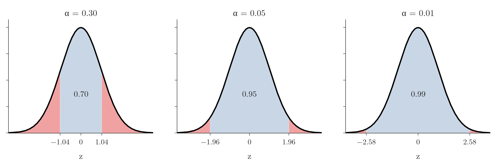

<!-- where-this-fits: generated by course_map/build_map.py; edit concepts.yaml, not this block -->
> **Where this fits:** Pipeline map step 0 (Foundations). See the [Course map](../01-course-map/note.md).
>
> 
>
> - **Builds on:** Inferential statistics ([Note 220](../220-what-is-statistics/note.md)); Standard normal and the z-table ([Note 251](../251-standard-normal-and-z-table/note.md)); Sampling distribution and standard error ([Note 271](../271-sampling-distribution-and-clt/note.md)); Central limit theorem ([Note 272](../272-estimating-a-mean-with-the-clt/note.md)).
> - **Leads to:** Beta and A/B testing ([Note 292](../292-errors-power-and-tails/note.md)); T-tests: one-sample, two-sample, paired ([Note 301](../301-one-sample-t-test/note.md)); One-sample proportion test ([Note 570](../570-choosing-a-hypothesis-test/note.md)); Chi-square tests ([Note 571](../571-chi-square-tests/note.md)); One-way ANOVA ([Note 572](../572-one-way-anova/note.md)).
> - **Compare with:** Confidence intervals ([Note 282](../282-t-procedure/note.md)).
<!-- /where-this-fits -->

## 1. Overview

> **Key point:** In the rejection region approach we compute a test statistic and reject $H_0$ when it falls in the tail region whose area is the significance level $\alpha$.



The [null and alternative hypotheses Note](../290-null-and-alternative-hypotheses/note.md) listed the eight steps of a hypothesis test. Here we run them end to end with the one-sample **z-test** on two problems. Figure 1 shows how each ends: the training program's z of 3.29 lands in the red rejection region, the chips' z of $-1.58$ does not.

This Note covers:

- the significance level $\alpha$;
- the z statistic and the assumptions of the one-sample z-test;
- the rejection region and the critical value;
- two complete examples, one right-tailed and one two-tailed;
- how $\alpha$ moves the rejection region;
- the weakness of the rejection region approach, which p-values fix.

## 2. Terms we build on

> **Key point:** The standard normal curve and z-table, the central limit theorem with its standard error, and critical values.

- **Standard normal and z-table:** a z-score has the standard normal distribution, and the z-table gives the area to the left of any z (see the [standard normal Note](../251-standard-normal-and-z-table/note.md)).
- **Central limit theorem and standard error:** for a sample of $n \ge 30$, the sample mean $\bar{X}$ is approximately normal with mean $\mu$ and standard deviation $\sigma/\sqrt{n}$, the standard error (see the [central limit theorem Note](../271-sampling-distribution-and-clt/note.md)).
- **Critical value:** the z value that leaves a given area in the tail; 1.96 leaves 2.5% in each tail (see the [z-procedure Note](../280-confidence-intervals-z-procedure/note.md)).

## 3. The significance level $\alpha$

> **Key point:** $\alpha$ is the probability of rejecting $H_0$ when it is actually true; we fix it before the test, usually at 0.05.

The **significance level**, written $\alpha$, is a threshold fixed before the test. The significance level decides whether $H_0$ will be rejected. In words:

> $\alpha$ is the probability of rejecting the null hypothesis when it is actually true.

With $\alpha = 0.05$, if we ran many tests in which $H_0$ was in fact true, about 5 in 100 would still reject it. This mistake is called a Type I error (see the [errors, power and tails Note](../292-errors-power-and-tails/note.md)).

Think of $\alpha$ as the sensitivity setting of a smoke alarm. A very sensitive alarm (large $\alpha$) goes off for burnt toast as well as for real fires; a dull one (small $\alpha$) rarely gives false alarms but needs more smoke before it sounds.

The usual choices are 0.05 (5%) and 0.01 (1%). For most problems 0.05 works well and is treated as the standard. In a specialised field, a domain expert may choose another value from knowledge of the domain.

The significance level and the confidence level are related but not the same. A 95% confidence level corresponds to $\alpha = 0.05$: confidence level $= 1 - \alpha$ (see the [z-procedure Note](../280-confidence-intervals-z-procedure/note.md)).

We must fix $\alpha$ before the test. Without it there is no boundary between "reject" and "fail to reject". Choosing it after seeing the result would let us reach either answer: for any observed $z$ other than 0, a large enough $\alpha$ puts it in the rejection region. For the chips example of section 7 ($z = -1.58$, two-tailed), any $\alpha$ above $2 \times P(Z > 1.58) = 0.114$ would reject $H_0$.

## 4. The one-sample z-test

> **Key point:** The z-test measures how many standard errors the sample mean lies from the mean claimed by $H_0$; it needs $\sigma$ and a normal sampling distribution.

### 4.1 Assumptions

The one-sample z-test can be used when:

1. **Normality:** the population is normal, or the sample has at least 30 values, so that by the central limit theorem $\bar{X}$ is approximately normal;
2. **Known $\sigma$:** the population standard deviation is known;
3. **Random sample:** the sample is drawn at random.

If $\sigma$ is unknown, we use the t-test instead (see the [one-sample t-test Note](../301-one-sample-t-test/note.md)).

### 4.2 The z statistic

If $H_0$ is true, the population mean is $\mu_0$, the value in $H_0$. The sample mean then varies around $\mu_0$ with standard error $\sigma/\sqrt{n}$, so standardizing it gives a standard normal variable.

1. **In words:** the distance between the sample mean and the mean claimed by $H_0$, measured in standard errors.
2. **Formula:**
   $$z = \frac{\bar{x} - \mu_0}{\sigma / \sqrt{n}}$$
3. **Example:** $\bar{x} = 53$, $\mu_0 = 50$, $\sigma = 5$, $n = 30$:
   $$z = \frac{53 - 50}{5/\sqrt{30}} = \frac{3}{0.913} = 3.29$$

We divide by $\sigma/\sqrt{n}$, not by $\sigma$, because we are standardizing a sample **mean**, whose spread is the standard error.

## 5. The rejection region and the critical value

> **Key point:** The rejection region is the tail of the standard normal curve with area $\alpha$, on the side that $H_1$ points to; its boundary is the critical value.

The **rejection region** (also called the **critical region**) is the set of values of the test statistic for which we reject $H_0$. The rejection region lies in the tail or tails that $H_1$ points to, and its area is $\alpha$. The rest of the curve is the region where we fail to reject $H_0$.

The **critical value** is the boundary of the rejection region:

- **$H_1$ with $>$ (right-tailed):** all of $\alpha$ in the right tail. For $\alpha = 0.05$ we need the z with area 0.95 to its left. The z-table has 0.9495 at 1.64 and 0.9505 at 1.65, so the critical value lies between them: 1.645.
- **$H_1$ with $<$ (left-tailed):** all of $\alpha$ in the left tail: $-1.645$.
- **$H_1$ with $\neq$ (two-tailed):** $\alpha/2 = 0.025$ in each tail: $\pm 1.96$.

The decision rule is simple: if the test statistic falls in the rejection region, reject $H_0$; otherwise, fail to reject it.

> **Extra:** One-sided and two-sided critical values are easy to mix up. At $\alpha = 0.05$, a one-tailed test uses 1.645 and a two-tailed test uses 1.96 (see the [t-procedure Note](../282-t-procedure/note.md) for the same point with t). Using 1.96 for a one-tailed test makes it stricter than intended (a real $\alpha$ of 0.025); using 1.645 for a two-tailed test makes it looser (a real $\alpha$ of 0.10).

> **Python:** Critical values come from `ppf`, the inverse of the CDF.
>
> ```python
> from scipy import stats
>
> stats.norm.ppf(0.95)      # 1.645: right-tailed, alpha = 0.05
> stats.norm.ppf(0.05)      # -1.645: left-tailed
> stats.norm.ppf(0.975)     # 1.960: two-tailed, alpha = 0.05
> ```

## 6. Example: did a training program raise productivity?

> **Key point:** $z = 3.29$ lies beyond the critical value 1.645, so we reject $H_0$: the training program raised mean productivity.

A car factory makes **50 cars per day** on average, with a known population standard deviation of **5**. Some days it makes 45, some days 55. To raise output, the company runs a training program for its employees. Afterwards it measures the productivity of a random sample of **30** employees and finds a sample mean of **53 units per day**. Has the training significantly increased productivity?

1. **Hypotheses.** No benefit, against an increase:
   $$H_0: \mu = 50, \qquad H_1: \mu > 50$$
2. **Significance level.** $\alpha = 0.05$.
3. **Assumptions.** $n = 30$, so by the central limit theorem $\bar{X}$ is approximately normal. $\sigma = 5$ is known.
4. **Test.** Normal and $\sigma$ known: the one-sample z-test.
5. **Test statistic.** $z$.
6. **Conduct the test.** As in section 4.2:
   $$z = \frac{53 - 50}{5/\sqrt{30}} = 3.29$$
7. **Decide.** $H_1$ uses $>$, so the rejection region is the right tail beyond 1.645. Since $3.29 > 1.645$, $z$ falls in the rejection region (Figure 1, left): we **reject $H_0$**. The data gives strong evidence against $H_0$, in favour of $H_1$.
8. **Interpret.** The training program increased mean daily productivity above 50 units.

> **Python:** The whole test in a few lines.
>
> ```python
> import numpy as np
> from scipy import stats
>
> z = (53 - 50) / (5 / np.sqrt(30))   # 3.29
> z_crit = stats.norm.ppf(1 - 0.05)    # 1.645
> z > z_crit                          # True: reject H0
> ```

## 7. Example: do chips packets weigh 50 g?

> **Key point:** $z = -1.58$ lies between $-1.96$ and $1.96$, so we fail to reject $H_0$: the sample does not show that the mean weight differs from 50 g.

A snack company claims that its packets of chips weigh **50 g** on average. A consumer watchdog wants to know whether the true mean weight differs from 50 g, more or less. It buys a random sample of **40** packets and finds a mean weight of **49 g**. The population standard deviation is known: **4 g**.

1. **Hypotheses.**
   $$H_0: \mu = 50, \qquad H_1: \mu \neq 50$$
2. **Significance level.** $\alpha = 0.05$.
3. **Assumptions.** $n = 40 \ge 30$: $\bar{X}$ is approximately normal. $\sigma = 4$ is known.
4. **Test.** One-sample z-test.
5. **Test statistic.** $z$.
6. **Conduct the test.**
   $$z = \frac{49 - 50}{4/\sqrt{40}} = \frac{-1}{0.632} = -1.58$$
7. **Decide.** $H_1$ uses $\neq$: we do not know the direction, so the test is two-tailed. $\alpha = 0.05$ is split into 0.025 in each tail, giving critical values $\pm 1.96$. Since $-1.96 < -1.58 < 1.96$, $z$ falls between them (Figure 1, right): we **fail to reject $H_0$**.
8. **Interpret.** The 40 packets do not give enough evidence that the mean weight differs from 50 g. The watchdog has no case against the company.

Failing to reject does not prove that the packets weigh exactly 50 g on average. As the [null and alternative hypotheses Note](../290-null-and-alternative-hypotheses/note.md) showed, failing to reject $H_0$ only means the evidence was not strong enough.

## 8. How $\alpha$ moves the rejection region

> **Key point:** A smaller $\alpha$ pushes the critical values outward and shrinks the rejection region, so rejecting a true $H_0$ becomes rarer.



Figure 2 shows a two-tailed test at three significance levels:

| $\alpha$ | Area in each tail | Critical values |
|---|---|---|
| 0.30 | 0.15 | $\pm 1.04$ |
| 0.05 | 0.025 | $\pm 1.96$ |
| 0.01 | 0.005 | $\pm 2.58$ |

- **Lower $\alpha$** (5% to 1%): the critical values move out and the region where we fail to reject grows. A true $H_0$ is rejected less often.
- **Higher $\alpha$** (say 30%): the rejection region grows. Even when $H_0$ is true, the statistic now often lands in the rejection region by chance, and we wrongly reject $H_0$.

The red area is exactly what "the probability of rejecting $H_0$ when it is actually true" means. A lower $\alpha$ has a cost too, which the [errors, power and tails Note](../292-errors-power-and-tails/note.md) explains.

## 9. The weakness of the rejection region approach

> **Key point:** The rejection region approach only says on which side of a boundary the statistic fell; it cannot say how strong the evidence is.

The rejection region approach gives a yes-or-no answer, and that causes two problems.

**A knife-edge boundary.** In a two-tailed test at $\alpha = 0.05$, $z = 1.97$ means "reject" and $z = 1.95$ means "fail to reject". A difference of 0.02 flips the decision, although the two samples are almost equally convincing.

**No strength of evidence.** $z = 2$ and $z = 15$ both fall in the rejection region and both lead to "reject $H_0$". But they are very different:

| $z$ | Probability of a value at least this large if $H_0$ is true | Evidence against $H_0$ |
|---|---|---|
| 2 | 0.023 | moderate |
| 15 | about $4 \times 10^{-51}$ | overwhelming |

A z of 15 is so unlikely under $H_0$ that it leaves almost no doubt, while a z of 2 is the kind of value that turns up 2 or 3 times in 100 by chance. The rejection region approach treats them the same.

The fix is to compute one more number, the **p-value**, which measures the strength of the evidence against $H_0$. The p-value approach is the one used in practice, and the subject of the [p-values Note](../300-p-values/note.md).

## 10. Summary

| | Training program | Chips packets |
|---|---|---|
| $H_0$ / $H_1$ | $\mu = 50$ / $\mu > 50$ | $\mu = 50$ / $\mu \neq 50$ |
| Data | $n = 30$, $\bar{x} = 53$, $\sigma = 5$ | $n = 40$, $\bar{x} = 49$, $\sigma = 4$ |
| Tails | right | two |
| Critical value ($\alpha = 0.05$) | 1.645 | $\pm 1.96$ |
| $z$ | 3.29 | $-1.58$ |
| Decision | reject $H_0$ | fail to reject $H_0$ |

- $\alpha$, fixed in advance, is the probability of rejecting a true $H_0$; 0.05 is the standard choice.
- The one-sample z-test needs normality (or $n \ge 30$), a known $\sigma$ and a random sample; $z = (\bar{x} - \mu_0)/(\sigma/\sqrt{n})$.
- The rejection region has area $\alpha$ in the tail(s) $H_1$ points to; its boundary is the critical value.
- Right-tailed 1.645, two-tailed $\pm 1.96$ at $\alpha = 0.05$.
- A smaller $\alpha$ shrinks the rejection region.
- The approach cannot tell weak from overwhelming evidence; p-values can.

## 11. Key terms

| Term | Meaning |
|---|---|
| Significance level ($\alpha$) | The probability of rejecting $H_0$ when it is actually true; fixed before the test, usually 0.05 |
| Z-test (one-sample) | A test of a population mean when $\sigma$ is known and $\bar{X}$ is normal, using $z = (\bar{x} - \mu_0)/(\sigma/\sqrt{n})$ |
| Z statistic | The value of $z$ computed from the sample in a z-test |
| Rejection region (critical region) | The values of the test statistic for which we reject $H_0$; its area under $H_0$ is $\alpha$ |
| Critical value | The boundary of the rejection region, e.g. 1.645 (right-tailed) or $\pm 1.96$ (two-tailed) at $\alpha = 0.05$ |
| Strength of evidence | How strongly the data speaks against $H_0$; the rejection region approach does not measure it |
