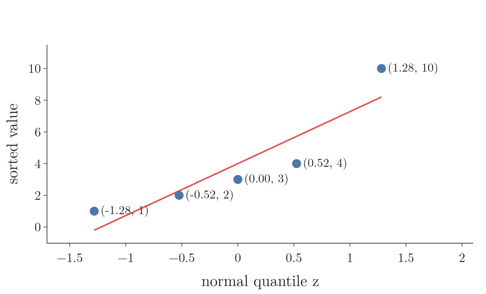
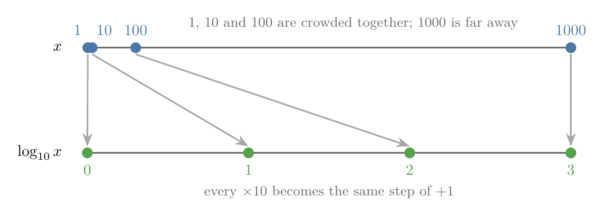
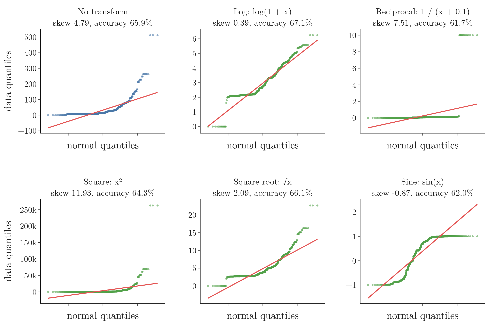

<!-- where-this-fits: generated by course_map/build_map.py; edit concepts.yaml, not this block -->
> **Where this fits:** Pipeline map steps 3 (Understand data), 5 (Engineer features), 9 (Evaluate). See the [Course map](../01-course-map/note.md).
>
> 
>
> - **Builds on:** Skewness ([Note 20](../20-univariate-analysis/note.md)); Feature transformation ([Note 23](../23-what-is-feature-engineering/note.md)).
> - **Leads to:** Power transformer ([Note 31](../31-power-transformer/note.md)); Feature construction and splitting ([Note 45](../45-feature-construction-splitting/note.md)); Grid and random search ([Note 38](../38-missing-indicator-random-sample/note.md)).
> - **Compare with:** Train-test split ([Note 13](../13-toy-project/note.md)); Power transformer ([Note 31](../31-power-transformer/note.md)).
<!-- /where-this-fits -->

## 1. Overview

> **Key point:** A mathematical transformation applies one formula to every value of a column, usually to make a skewed column closer to a normal distribution.

So far, feature transformation has meant filling missing values, encoding categories and scaling numbers. This Note adds one more kind: **mathematical transformation**, where we apply a mathematical formula, such as a logarithm or a square root, to every value of a column.

Figure 1 shows the whole topic. A skewed column goes through scikit-learn's `FunctionTransformer`, which applies the formula we choose, and comes out closer to normal. We then check the result with the skewness and a Q-Q plot.


The formulas covered here are the log, reciprocal, square and square root transforms. Two more advanced ones, the Box-Cox and Yeo-Johnson transforms, belong to the power transformer and come in the next Note.

## 2. Why make data normal

> **Key point:** Some algorithms, such as linear and logistic regression, work better when the columns are close to a normal distribution; tree-based algorithms do not care.

Note 20 introduced the **normal distribution**: the symmetric, bell-shaped curve. It also introduced skewness, the number that says how lopsided a distribution is.

Real data is rarely normal. Fares, salaries and house prices are usually right-skewed: most values are small and a few are huge.

The normal distribution is the most important distribution in statistics. Many statistical methods are built around it, so once data is normal, many problems become easier to solve.

In ML, this matters for the statistical algorithms:

- **Care about the distribution:** linear regression and logistic regression. They tend to perform better when the columns are close to normal.
- **Do not care:** decision trees and random forests. Their results hardly change whatever the shape of the data.

So when we use an algorithm of the first kind on a skewed column, we try to make that column normal first. The mathematical transformations in this Note do exactly that.

There is no fixed list of transformations. Any formula can be one: $x^2 + 2x$ is a valid transformation too, and we can write our own custom function. The goal is always the same: get a distribution as close to normal as possible.

> **Extra:** Why a long tail hurts a linear model. Linear and logistic regression fit one straight-line formula through all the data. In a column like fare, a handful of huge values (500 against a typical 15) pull that line towards themselves and squash all the ordinary values together. Pulling the tail in gives the ordinary values room to matter.
>
> Strictly speaking, linear regression's normality assumption is about its errors, not its inputs, and logistic regression makes no normality assumption at all. The practical rule still holds: a column without a long tail is easier for these models to use.

## 3. Mathematical transformers in scikit-learn

> **Key point:** scikit-learn has three classes for mathematical transformations: the function transformer, the power transformer and the quantile transformer.

scikit-learn offers three classes for this job:

1. **`FunctionTransformer`**, the most widely used, and the subject of this Note. It can apply the log, reciprocal, square and square root transforms, or any custom function we write.
2. **`PowerTransformer`**, which applies the Box-Cox and Yeo-Johnson transforms. It is covered in the next Note.
3. **`QuantileTransformer`**, which is used much less and is not covered in these Notes.

## 4. Checking whether a column is normal

> **Key point:** Three checks: look at the density plot, compute the skewness, and draw a Q-Q plot; the Q-Q plot is the most reliable.

Before transforming a column, we need to know whether it is normal already. There are three common ways:

1. **Density plot:** draw the histogram with its KDE curve, as in Note 20. The shape gives a first idea of how normal the column is.
2. **Skewness:** pandas' `skew()`. A value near 0 means symmetric; positive means right-skewed, negative means left-skewed (Note 20).
3. **Q-Q plot:** the most reliable of the three, and the most used. The rest of this section explains how to read it.

### 4.1 Reading a Q-Q plot

> **Key point:** The closer the points lie to the straight red line, the closer the data is to a normal distribution.

A **Q-Q plot** (quantile-quantile plot) compares our data with a perfect normal distribution. Each point stands for one value of the column:

- **horizontal axis (theoretical quantiles):** where that value would sit if the data were perfectly normal;
- **vertical axis (sample quantiles):** where the value actually sits in our data.

The red line is the best straight line through the points. If the data is normal, its values sit exactly where a normal distribution predicts, and every point lands on that line.

Figure 2 shows four made-up columns, with the histogram on top and the Q-Q plot below.

{width=100%}

- **Normal:** almost every point lies on the line.
- **Right skew:** the points curve away from the line and leave it upwards at the right end. The long right tail holds values far bigger than a normal distribution would have.
- **Left skew:** the points leave the line downwards at the left end, where the long left tail is.
- **Fat tails:** the data has more extreme values than a normal distribution on both sides, so the points leave the line at both ends.

The further the points stray from the line, the further the data is from normal.

> **Extra:** How a Q-Q plot is built, step by step, using the five values 1, 2, 3, 4 and 10 from the skewness example of Note 20.
>
> 1. **In words:** sort the values. Cut the normal curve into as many equal-probability slices as there are values, and take the $z$-value at the middle of each slice. Pair the $i$-th smallest value with the $i$-th $z$-value, and plot the pairs.
> 2. **Formula:** for the $i$-th of $n$ sorted values, the matching normal quantile is
>    $$z_i = \Phi^{-1}\left(\frac{i - 0.5}{n}\right),$$
>    where $\Phi^{-1}$ turns a probability into the $z$-value with that much of the normal curve to its left.
> 3. **Example:** with $n = 5$, the probabilities are 0.1, 0.3, 0.5, 0.7 and 0.9, which give
>    $$z = -1.28,\ -0.52,\ 0,\ 0.52,\ 1.28.$$
>    The pairs are $(-1.28, 1)$, $(-0.52, 2)$, $(0, 3)$, $(0.52, 4)$ and $(1.28, 10)$. Figure 3 plots them: the first four lie close to a line, and the value 10 jumps far above it, the mark of a right tail.
>
> 
>
> scipy's `probplot` uses a slightly different rule for the probabilities, so its $z$-values differ a little, but the picture is the same.

> **Python:** A Q-Q plot with scipy and Plotly.
>
> ```python
> from scipy import stats
> import plotly.graph_objects as go
>
> # osm: normal quantiles, osr: sorted data
> (osm, osr), (slope, intercept, r) = \
>     stats.probplot(x, dist="norm")
> fig = go.Figure()
> fig.add_scatter(x=osm, y=osr, mode="markers")
> fig.add_scatter(x=osm, y=slope * osm + intercept,
>                 mode="lines")   # the red line
> ```
>
> Older code passes `plot=plt` to `probplot` to draw with matplotlib. Without it, `probplot` just returns the numbers, and we can draw them with any library.

## 5. Log transform

> **Key point:** The log transform replaces every value with its logarithm; it pulls a long right tail in, so it is the transform for right-skewed data.

The **log transform** is simple: take the log of every value in the column. The base can be 10 or $e$; both give the same shape.

The log transform, step by step:

1. **In words:** replace each value with its logarithm. Big values shrink a lot; small values shrink a little.
2. **Formula:**
   $$x' = \log(x)$$
3. **Example:** with base 10, the values 1, 10, 100 and 1000 become
   $$\log_{10} 1 = 0,\quad \log_{10} 10 = 1,\quad \log_{10} 100 = 2,\quad \log_{10} 1000 = 3.$$

Figure 4 shows why this helps. On the ordinary scale, 1, 10 and 100 are squeezed together and 1000 lies far away. After the log, the four values sit at equal steps: every multiplication by 10 becomes the same step of $+1$.



So a value much bigger than all the others is brought back near them. A long right tail is pulled in, and the distribution starts to look more normal. It rarely becomes perfectly normal, but it gets much closer than before.

Two rules for using it:

- **Use it on right-skewed data.** It squashes the long right tail and brings the data towards the centre. Asked "which data needs a log transform?", the answer is right-skewed data.
- **Never on negative values.** The log of a negative number does not exist, and the log of 0 is minus infinity.

### 5.1 log(1 + x) for columns with zeros

> **Key point:** `np.log1p` computes $\log(1 + x)$, which works for a value of 0; it is the usual choice in practice.

NumPy has two log functions:

- **`np.log(x)`:** the plain natural log (base $e$). A 0 in the column breaks it.
- **`np.log1p(x)`:** first adds 1, then takes the log. No value can become 0, so zeros are safe.

The $\log(1 + x)$ transform, step by step:

1. **In words:** add 1 to each value, then take the natural log.
2. **Formula:**
   $$x' = \ln(1 + x)$$
3. **Example:** three real Titanic fares, 7.25, 71.28 and 512.33, become
   $$\ln 8.25 = 2.11,\quad \ln 72.28 = 4.28,\quad \ln 513.33 = 6.24.$$
   Before, the biggest fare is 70 times the smallest; after, it is less than 3 times.

People usually use `np.log1p`. If a column has no zeros, `np.log` works too.

## 6. Reciprocal, square and square root transforms

> **Key point:** Reciprocal turns big values into small ones, square is used for left-skewed data, and square root is a milder version of the log; which one works is found by trying.

### 6.1 Reciprocal transform

> **Key point:** $1/x$ makes big values small and small values big, reversing the order of the data.

The **reciprocal transform**, step by step:

1. **In words:** replace each value with 1 divided by it.
2. **Formula:**
   $$x' = \frac{1}{x}$$
3. **Example:** the values 2, 4, 10 and 100 become
   $$\frac{1}{2} = 0.5,\quad \frac{1}{4} = 0.25,\quad \frac{1}{10} = 0.1,\quad \frac{1}{100} = 0.01.$$
   The biggest value became the smallest.

It is a very different kind of transform from the others, since it flips the order. On some data it gives a close-to-normal result. A 0 in the column breaks it, because $1/0$ is infinite.

> **Extra:** The reciprocal pulls a right tail in even harder than the log, so it is mainly tried on strongly right-skewed data. Because it reverses the order, a model's coefficient for that column also changes sign: a larger original value now means a smaller transformed one.

### 6.2 Square transform

> **Key point:** $x^2$ stretches big values apart; it is used for left-skewed data.

The **square transform**, step by step:

1. **In words:** multiply each value by itself.
2. **Formula:**
   $$x' = x^2$$
3. **Example:** take marks in an easy test, a left-skewed column: 30, 80 and 90. They become
   $$30^2 = 900,\quad 80^2 = 6400,\quad 90^2 = 8100.$$
   Before, the gap from 30 to 80 (50) was 5 times the gap from 80 to 90 (10). After, it is 5500 against 1700: only about 3 times. The long left tail is pulled in.

So the square is the transform for left-skewed data. On right-skewed data it does the opposite and makes the tail even longer.

### 6.3 Square root transform

> **Key point:** $\sqrt{x}$ pulls a right tail in, but more gently than the log.

The **square root transform**, step by step:

1. **In words:** replace each value with its square root.
2. **Formula:**
   $$x' = \sqrt{x}$$
3. **Example:** the same three fares, 7.25, 71.28 and 512.33, become
   $$\sqrt{7.25} = 2.69,\quad \sqrt{71.28} = 8.44,\quad \sqrt{512.33} = 22.63.$$
   The biggest fare went from 70 times the smallest to about 8 times. The log brought it to under 3 times, so the square root is the milder of the two.

The square root is used less often, but it is worth trying. Like the log, it does not work on negative values.

### 6.4 Choosing a transform

> **Key point:** Right skew: try the log; left skew: try the square; then try them all and keep whichever gives the best result.

We usually cannot tell in advance which transform will work best. What we do know:

- **right-skewed data:** start with the log transform;
- **left-skewed data:** start with the square transform.

Beyond that, each transform is one line of code, so we try them all and keep the one that gives the best result.

## 7. Function transformer on the Titanic data

> **Key point:** On the Titanic data, a log transform raised logistic regression's accuracy from 65.9% to 67.8% (cross-validated), while the decision tree stayed at about 66%.

### 7.1 The data

> **Key point:** Two numerical inputs, `Age` and `Fare`, and the target `Survived`.

We use the Titanic training file (891 passengers) and keep three columns:

| Survived | Age | Fare |
|---|---|---|
| 0 | 22.0 | 7.2500 |
| 1 | 38.0 | 71.2833 |
| 1 | 26.0 | 7.9250 |

`Survived` is the target: 1 if the passenger survived, 0 if not. `Age` and `Fare` are the inputs.

`Age` has 177 missing values, and transforms and models need none. We fill each one with the mean age, 29.7.

> **Python:** Loading three columns and filling the missing ages.
>
> ```python
> import pandas as pd
>
> df = pd.read_csv("data/titanic_train.csv",
>                  usecols=["Age", "Fare", "Survived"])
> df.isnull().sum()    # Age: 177
> df["Age"] = df["Age"].fillna(df["Age"].mean())
> ```
>
> Older code writes `df["Age"].fillna(..., inplace=True)`. In pandas 3 that no longer changes `df`, so we assign the result back instead.

As always, we split before anything else: 80% for training (712 rows) and 20% for testing (179 rows).

> **Python:** Splitting the data.
>
> ```python
> from sklearn.model_selection import train_test_split
>
> X = df[["Age", "Fare"]]   # inputs
> y = df["Survived"]         # target
> X_train, X_test, y_train, y_test = train_test_split(
>     X, y, test_size=0.2, random_state=42)
> ```

### 7.2 Is each column normal?

> **Key point:** `Age` is close to normal (skewness 0.36); `Fare` is strongly right-skewed (skewness 4.88).

We check both training columns with a density plot and a Q-Q plot, as in Section 4. The left halves of Figures 5 and 6 show them.

- **Age:** the density plot looks roughly normal, though not perfectly. In the Q-Q plot, most points lie near the line and stray only in a few places. Skewness: 0.36.
- **Fare:** not normal at all. The density plot has a long right tail: a few passengers paid huge fares, and most paid very little. In the Q-Q plot, the points curve far above the line on the right. Skewness: 4.88.

`Fare` is right-skewed, so the transform to try is the log.

> **Python:** The old `sns.distplot` was removed from seaborn; Note 20 shows the replacements. The Notebook draws every density plot and Q-Q plot with Plotly.

### 7.3 Baseline: no transform

> **Key point:** Without any transform, logistic regression scores 64.8% on the test set and a decision tree 67.0%.

First we train two models on the raw columns, to have something to compare with: logistic regression and a decision tree.

| Model | Test accuracy, no transform |
|---|---|
| Logistic regression | 64.8% |
| Decision tree | 67.0% |

> **Python:** Training the two baseline models.
>
> ```python
> from sklearn.linear_model import LogisticRegression
> from sklearn.tree import DecisionTreeClassifier
> from sklearn.metrics import accuracy_score
>
> lr = LogisticRegression()
> dt = DecisionTreeClassifier(random_state=0)
> lr.fit(X_train, y_train)
> dt.fit(X_train, y_train)
> accuracy_score(y_test, lr.predict(X_test))  # 0.648
> accuracy_score(y_test, dt.predict(X_test))  # 0.670
> ```
>
> `random_state=0` fixes how the tree breaks ties, so the numbers repeat on every run. Without it, the tree's accuracy changes a little each time.

### 7.4 Applying the log with FunctionTransformer

> **Key point:** `FunctionTransformer(func=np.log1p)` applies $\log(1 + x)$ to every column it receives.

**`FunctionTransformer`** (in `sklearn.preprocessing`) applies a function we give it to the data. Its first parameter, **`func`**, is that function: a built-in one such as `np.log1p`, or our own.

Here we pass `np.log1p` rather than `np.log`, because 15 passengers have a fare of 0. Like every transformer, it is fitted on the training set and then used to transform both sets.

> **Python:** The log transform with `FunctionTransformer`.
>
> ```python
> import numpy as np
> from sklearn.preprocessing import FunctionTransformer
>
> trf = FunctionTransformer(func=np.log1p)
> X_train_transformed = trf.fit_transform(X_train)
> X_test_transformed = trf.transform(X_test)
> ```
>
> This transforms both columns, Age and Fare.

Training the same two models on the transformed columns gives:

| Model | No transform | Log on both columns |
|---|---|---|
| Logistic regression | 64.8% | 68.2% |
| Decision tree | 67.0% | 68.2% |

Logistic regression improved by more than 3 points because the data was transformed. The decision tree changed by about one point, which is within its usual run-to-run noise: a tree does not care about the distribution of the data.

> **Extra:** Why a tree barely notices. The log keeps the order of the values: if one fare is bigger than another, its log is bigger too. A tree only asks questions like "is fare above 50?", and "is log fare above 3.93?" splits the passengers in exactly the same way. The small changes come from where the tree places each split between two training values, which can send a few test passengers the other way.

> **Extra:** `FunctionTransformer` learns nothing in `fit`: the formula has no numbers to learn from the data. So fitting on the training set and transforming the test set gives exactly the same result as transforming each set separately. The habit of fitting on the training set still matters for every other transformer.

### 7.5 Checking with cross-validation

> **Key point:** Cross-validation repeats the split 10 times and averages the accuracy, which is more reliable than one split.

One train-test split gives one number, which can be lucky or unlucky. A sudden improvement should make us suspicious, so we check it with **cross-validation**: split the data 10 different ways into training and test parts, train and score the model each time, and take the average accuracy. Cross-validation has its own Note later; here we only use it.

| Model | No transform | Log on both columns |
|---|---|---|
| Logistic regression | 65.9% | 67.8% |
| Decision tree | 66.0% | 66.1% |

The improvement for logistic regression holds up: about 2 points. The decision tree stays where it was.

> **Python:** 10-fold cross-validation.
>
> ```python
> from sklearn.model_selection import cross_val_score
>
> X_transformed = trf.fit_transform(X)
> scores = cross_val_score(LogisticRegression(),
>     X_transformed, y, scoring="accuracy", cv=10)
> scores.mean()   # 0.678
> ```
>
> `cv=10` makes 10 splits; `scores` holds the 10 accuracies.

### 7.6 Before and after the log

> **Key point:** The log brought `Fare` from skewness 4.88 to 0.40, but pushed `Age` from 0.36 to -2.24.

Figure 5 shows `Fare` before and after the transform. Before, it was very far from normal; after, the skewness is 0.40 and the points lie much closer to the line. This change is what improved logistic regression.

{width=100%}

Figure 6 does the same for `Age`. Here the transform made things worse: the column was close to normal before, and after the log it has a long left tail, with skewness -2.24.

{width=100%}

This happens when we force a log onto a column that is not right-skewed. The log squashes the big ages and stretches the small ones, so the few children become a new left tail.

The tall bar near age 30 in Figure 6 is the 177 passengers whose missing age was filled with the mean. After the log it stays one tall bar, near 3.4.

### 7.7 Log on Fare only, with ColumnTransformer

> **Key point:** `ColumnTransformer` lets us log only `Fare` and pass `Age` through unchanged.

`Age` did not need the log, so the next step is to transform only `Fare` and leave `Age` as it is. Note 28's `ColumnTransformer` does exactly this, with `FunctionTransformer` as the transformer and `remainder="passthrough"` for `Age`.

> **Python:** Log on Fare only.
>
> ```python
> from sklearn.compose import ColumnTransformer
>
> trf2 = ColumnTransformer(
>     [("log", FunctionTransformer(np.log1p), ["Fare"])],
>     remainder="passthrough")
> X_train_transformed2 = trf2.fit_transform(X_train)
> X_test_transformed2 = trf2.transform(X_test)
> ```

| Model | No transform | Log on both | Log on Fare only |
|---|---|---|---|
| Logistic regression, test set | 64.8% | 68.2% | 67.0% |
| Logistic regression, cross-validated | 65.9% | 67.8% | 67.1% |
| Decision tree, cross-validated | 66.0% | 66.1% | 65.8% |

Logging only `Fare` keeps most of the gain: 67.1% against 65.9% with no transform. Logging both columns scores slightly higher still, 67.8%, even though `Age` itself got less normal; the difference is about 6 passengers out of 891.

So the improvement comes from `Fare`. Transforming `Age` as well brings no clear benefit and costs extra computation, so transforming only the skewed column is the cleaner choice. The decision tree, once again, does not change.

The overall lesson:

- `Age` was already close to normal; `Fare` was right-skewed.
- A log on `Fare` improved logistic regression.
- The decision tree's results did not change: it does not depend on the distribution of the data. Linear and logistic regression do.

## 8. Trying the other transforms

> **Key point:** On the right-skewed `Fare`, the log gave the best result; square, reciprocal and sine made it worse.

To compare all the transforms quickly, we wrap the steps in one function. It takes a formula, applies it to `Fare` only, reports the cross-validated accuracy of logistic regression, and draws the Q-Q plot.

> **Python:** One function to try any transform.
>
> ```python
> def apply_transform(transform):
>     trf = ColumnTransformer(
>         [("t", FunctionTransformer(transform), ["Fare"])],
>         remainder="passthrough")
>     X_trans = trf.fit_transform(X)
>     lr = LogisticRegression(max_iter=1000)
>     acc = cross_val_score(lr, X_trans, y,
>         scoring="accuracy", cv=10).mean()
>     print("Accuracy", acc)
>
> apply_transform(np.sqrt)
> apply_transform(lambda x: 1 / (x + 0.1))
> ```
>
> A **lambda** is a one-line function without a name: `lambda x: x**2` means "take x, return x squared". `max_iter=1000` lets logistic regression take more steps, which the square transform's huge numbers need.

Figure 7 shows the Q-Q plot of `Fare` after each transform, with its skewness and accuracy.

{width=100%}

| Transform on Fare | Skewness of Fare | Accuracy (logistic regression, cross-validated) |
|---|---|---|
| none | 4.79 | 65.9% |
| log, $\log(1 + x)$ | 0.39 | 67.1% |
| reciprocal, $1/(x + 0.1)$ | 7.51 | 61.7% |
| square, $x^2$ | 11.93 | 64.3% |
| square root, $\sqrt{x}$ | 2.09 | 66.1% |
| sine, $\sin(x)$ | -0.87 | 62.0% |

The skewness values here are for all 891 fares, so they differ a little from the training-set numbers in Section 7.

What each one did:

- **Log:** the best by far. The skewness dropped to 0.39 and the points follow the line.
- **Square:** worse than nothing. The square is meant for left-skewed data; on right-skewed `Fare` it stretches the tail even further (skewness 11.93).
- **Square root:** a small gain at best. It pulls the tail in, but not enough (skewness 2.09).
- **Reciprocal:** the plain $1/x$ fails, because 15 fares are 0 and $1/0$ is infinite. Adding a small 0.1 avoids that, but the result is worse: the zero fares all jump to 10 and form a new tail.
- **Sine:** any function can be passed in, even one with no sense behind it. $\sin(x)$ squeezes every fare into the range -1 to 1, which wipes out the information and drops the accuracy.

So on this data the log transform wins, as expected for a right-skewed column. On other data another transform may win: the only way to know is to try them, and each one takes one line of code.

## 9. Summary

| Transform | Formula | Effect on big values | Use on | Cannot handle |
|---|---|---|---|---|
| Log | $\log(x)$, or $\log(1 + x)$ | squashes them strongly | right-skewed data | negatives (and 0 for $\log x$) |
| Reciprocal | $1/x$ | makes them the smallest; reverses order | try on any data | 0 |
| Square | $x^2$ | stretches them apart | left-skewed data | (works on any number) |
| Square root | $\sqrt{x}$ | squashes them gently | right-skewed data (milder) | negatives |
| Custom | any $f(x)$ | depends on $f$ | try anything | depends on $f$ |

- A mathematical transformation applies one formula to every value of a column, usually to bring it closer to a normal distribution.
- Linear and logistic regression benefit from close-to-normal columns; decision trees and random forests do not care.
- Check normality with a density plot, the skewness, and a Q-Q plot: points on the line mean normal.
- `FunctionTransformer(func=...)` applies any function; `np.log1p` is safe when a column has zeros.
- Combine it with `ColumnTransformer` to transform only the columns that need it.
- On the Titanic data, logging `Fare` (skewness 4.88 to 0.40) raised logistic regression from 65.9% to 67.1%; logging `Age` too gave 67.8%, though `Age` itself became skewed. The decision tree stayed at about 66%.
- Which transform is best is found by trying them all.

## 10. Key terms

| Term | Meaning |
|---|---|
| Mathematical transformation | Applying one mathematical formula to every value of a column |
| Normal distribution | A symmetric, bell-shaped distribution; the target shape of these transformations |
| Q-Q plot | A plot of a column's sorted values against the values a normal distribution would have; points on the line mean normal |
| Theoretical quantile | Where a value would sit if the data were perfectly normal (the horizontal axis of a Q-Q plot) |
| Log transform | Replacing each value with its logarithm; pulls in a long right tail |
| log1p | NumPy's $\log(1 + x)$, a log transform that also works when a value is 0 |
| Reciprocal transform | Replacing each value with $1/x$; reverses the order of the values |
| Square transform | Replacing each value with $x^2$; used for left-skewed data |
| Square root transform | Replacing each value with $\sqrt{x}$; a milder version of the log |
| FunctionTransformer | scikit-learn's class that applies any function we give it to the data |
| func | The `FunctionTransformer` parameter that holds the function to apply |
| PowerTransformer | scikit-learn's class for the Box-Cox and Yeo-Johnson transforms (next Note) |
| QuantileTransformer | scikit-learn's third mathematical transformer, not covered in these Notes |
| Cross-validation | Scoring a model on several different train-test splits and averaging the results |
| Lambda | A one-line Python function without a name, such as `lambda x: x**2` |
