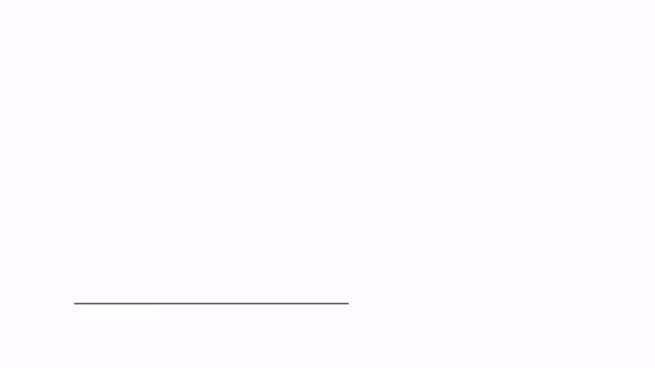
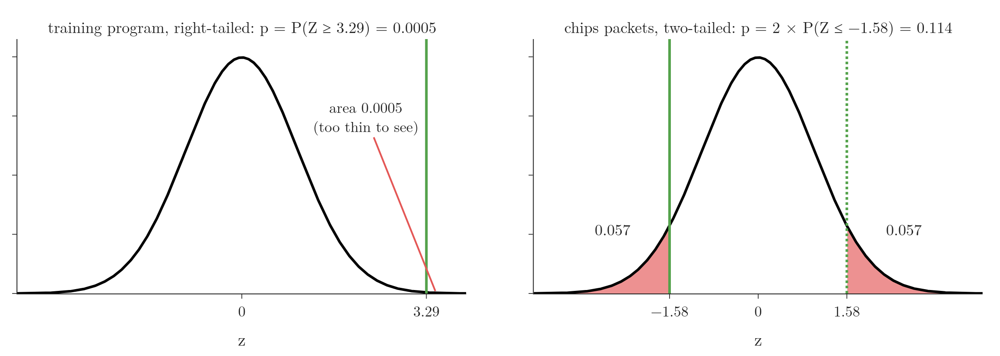

<!-- where-this-fits: generated by course_map/build_map.py; edit concepts.yaml, not this block -->
> **Where this fits:** Pipeline map step 0 (Foundations). See the [Course map](../01-course-map/note.md).
>
> 
>
> - **Builds on:** Cumulative distribution function (CDF) ([Note 253](../253-pdf-and-cdf-in-practice/note.md)).
<!-- /where-this-fits -->

## 1. Overview

> **Key point:** The p-value is the probability, if $H_0$ were true, of getting a sample at least as extreme as ours; the smaller it is, the stronger the evidence against $H_0$.

{height=48%}

The rejection region approach only says whether a test statistic crossed a boundary (see the [rejection region Note](../291-rejection-region-and-z-test/note.md)). The **p-value approach** computes one more number, the p-value, which also measures how strong the evidence is. Figure 1 shows the idea: the further the observed result sits in the tail, the smaller the red area, and the smaller the p-value.

This Note covers:

- the definition of the p-value, built on a coin-tossing example;
- how to read a p-value correctly, and the most common misreadings;
- the decision rule $p \le \alpha$, and a scale of evidence for when no $\alpha$ is given;
- p-values for the one-tailed and two-tailed z-tests of the [rejection region Note](../291-rejection-region-and-z-test/note.md).

## 2. Definition

> **Key point:** The p-value is $P(\text{a result as or more extreme than ours} \mid H_0 \text{ true})$, where "more extreme" means "more evidence against $H_0$".

The **p-value** is the probability of getting a sample as extreme as our own sample, or more extreme, given that the null hypothesis is true.

Two words need care:

- **"as or more extreme"**: having as much or more evidence against $H_0$, in the direction(s) that $H_1$ points to;
- **"given that $H_0$ is true"**: the probability is computed in an imaginary world where $H_0$ holds.

In simple words, the p-value is a measure of the strength of the evidence against the null hypothesis that our sample provides.

## 3. A coin tossed 100 times

> **Key point:** For 53 heads out of 100, the p-value is $P(X \ge 53) = 0.309$ under a fair coin; for 60 heads it is 0.028, for 80 heads about $6 \times 10^{-10}$.

### 3.1 The experiment

Our experiment: toss a coin 100 times and count the heads. Each toss is a Bernoulli trial (head or tail), repeated $n = 100$ times, so the number of heads $X$ follows a binomial distribution (see the [Bernoulli and binomial Note](../270-bernoulli-and-binomial/note.md)). If the coin is fair, $X \sim \text{Binomial}(100, 0.5)$.

Figure 1 plots its PMF. It looks like a normal curve, but it is discrete. 50 heads is the most likely count. Counts between 40 and 60 come up 96.5% of the time; 65 or more, or 30 or fewer, are rare.

### 3.2 The hypotheses

We suspect the coin is rigged so that heads come up more often than tails:

$$H_0: P(\text{head}) = 0.5 \quad \text{(fair coin)}, \qquad H_1: P(\text{head}) > 0.5 \quad \text{(rigged towards heads)}$$

We toss the coin 100 times and get **53 heads**. One experiment cannot settle the question by looking: 53 is above 50, but is it far enough above?

### 3.3 The p-value for 53 heads

"As or more extreme than 53" means 53 heads or more: under $H_1$ the coin favours heads, so more heads is more evidence against $H_0$.

1. **In words:** add up the probabilities of 53, 54, ..., 100 heads under a fair coin.
2. **Formula:**
   $$p = P(X \ge 53 \mid H_0) = \sum_{k=53}^{100} \binom{100}{k}\, 0.5^{100}$$
3. **Example:** $P(X = 53) = 0.067$ on its own, and the sum over 53 to 100 is
   $$p = 0.309$$

The probability of exactly 53 heads is not the p-value. The p-value is the whole tail from 53 upwards: the red bars in Figure 1.

The further the observation is from 50, the smaller the tail:

| Heads observed | $P(X = k)$ | p-value $P(X \ge k)$ |
|---|---|---|
| 53 | 0.067 | 0.309 |
| 60 | 0.011 | 0.028 |
| 65 | 0.0009 | 0.0018 |
| 80 | $4 \times 10^{-10}$ | $6 \times 10^{-10}$ |

With 80 heads the red area is invisible: if the coin were fair, 80 heads would almost never happen. Seeing it is overwhelming evidence that the coin is not fair.

> **Python:** Binomial tail probabilities with scipy. `sf(k)` is $P(X > k)$, so $P(X \ge 53)$ is `sf(52)`.
>
> ```python
> from scipy import stats
>
> coin = stats.binom(n=100, p=0.5)
> coin.pmf(53)        # 0.067: exactly 53 heads
> coin.sf(52)         # 0.309: 53 or more heads, the p-value
> coin.sf(59)         # 0.028: 60 or more heads
> ```

## 4. Reading a p-value correctly

> **Key point:** $p = 0.309$ means: if the coin were fair, about 31% of repeated 100-toss experiments would give 53 or more heads. It is not the probability that $H_0$ is true.

### 4.1 The correct reading

Imagine repeating the whole experiment, 100 tosses, many times with a fair coin. A p-value of 0.309 says that in about 31% of those experiments we would see 53 heads **or more**. A result like ours is common for a fair coin, so it is weak evidence against $H_0$.

For 60 heads, $p = 0.028$: only about 3 experiments in 100 with a fair coin would give 60 or more heads. Either we were unlucky, or the coin is not fair. For 80 heads, practically no experiment with a fair coin would ever get there.

### 4.2 Common misreadings

> **Extra:** Each of these statements about $p = 0.03$ is wrong.
>
> - **"About 3 experiments in 100 would give exactly our result."** The p-value counts results **as or more extreme**, not exactly ours. For 53 heads, exactly 53 has probability 0.067, while the p-value is 0.309.
> - **"There is a 3% chance that $H_0$ is true."** The p-value is computed **assuming** $H_0$ is true; it cannot also be the probability of $H_0$. That would need Bayes' theorem and a prior (see the [Bayes theorem Note](../85-bayes-theorem/note.md)).
> - **"There is a 97% chance that $H_1$ is true."** Same mistake, the other way round.
> - **"The result happened by chance with probability 3%."** The p-value assumes chance alone (that is what $H_0$ says); it does not measure the probability of chance.
> - **"A small p-value means a large or important effect."** With a huge sample, a tiny difference gives a tiny p-value. The p-value measures evidence, not size: a training program that adds 0.1 cars a day can be "highly significant" and useless.
> - **"$p > 0.05$ proves $H_0$."** It means the evidence was not strong enough (see the [null and alternative hypotheses Note](../290-null-and-alternative-hypotheses/note.md)).

## 5. Deciding with a p-value

> **Key point:** If $p \le \alpha$, reject $H_0$; if $p > \alpha$, fail to reject it. Without a fixed $\alpha$, read the p-value on a scale of evidence.

### 5.1 The decision rule

We still fix the significance level $\alpha$ first, usually 0.05 (see the [rejection region Note](../291-rejection-region-and-z-test/note.md)). Then:

- $p \le \alpha$: reject $H_0$;
- $p > \alpha$: fail to reject $H_0$.

For the coin at $\alpha = 0.05$:

| Heads | p-value | Decision | Conclusion |
|---|---|---|---|
| 80 | 0.0000000006 | reject $H_0$ | the coin favours heads |
| 60 | 0.028 | reject $H_0$ | the coin favours heads |
| 53 | 0.309 | fail to reject $H_0$ | not enough evidence that the coin is unfair |

With 53 heads we cannot conclude that the coin is unfair. We also cannot say we proved it fair.

> **Extra:** Why the rule $p \le \alpha$ gives the same decision as the rejection region. The rejection region is the tail whose area is $\alpha$; the p-value is the tail area beyond our statistic. Our statistic lies inside the rejection region exactly when it is further out than the critical value, that is, exactly when the tail beyond it is smaller than the tail beyond the critical value: $p \le \alpha$. The two approaches always agree on the decision; the p-value adds how far inside or outside we landed.

### 5.2 A scale of evidence

{height=22%}

Sometimes no $\alpha$ is given, for example when we explore an independent dataset in a machine learning project. Then a rule of thumb helps (Figure 2):

| p-value | Evidence against $H_0$ | What to do |
|---|---|---|
| below 0.01 | very strong | reject $H_0$ |
| 0.01 to 0.05 | moderate | reject $H_0$ |
| 0.05 to 0.10 | weak | investigate further: more data, domain knowledge, talk to stakeholders |
| above 0.10 | little or none | fail to reject $H_0$ |

In practice most people still use $\alpha = 0.05$, a balance between Type I and Type II errors (see the [errors, power and tails Note](../292-errors-power-and-tails/note.md)).

## 6. P-values for the z-test

> **Key point:** Compute $z$ as before; the p-value is the tail area beyond $z$ in the direction of $H_1$, doubled for a two-tailed test. No critical value is needed.

The p-value approach works for continuous distributions in the same way: the sum of bars becomes an area under the curve. We redo the two z-tests of the [rejection region Note](../291-rejection-region-and-z-test/note.md), with the same data.



### 6.1 One-tailed: the training program

$H_0: \mu = 50$, $H_1: \mu > 50$, $\sigma = 5$, $n = 30$, $\bar{x} = 53$, $\alpha = 0.05$. The z statistic is $z = 3.29$, as before.

1. **In words:** $H_1$ points right, so "more extreme" means a larger z; the p-value is the area to the right of 3.29.
2. **Formula:** the z-table gives the area to the left, so
   $$p = P(Z \ge z) = 1 - \Phi(z)$$
3. **Example:**
   $$p = 1 - \Phi(3.29) = 1 - 0.9995 = 0.0005$$

$0.0005 \le 0.05$: we reject $H_0$. The training program raised productivity, and the evidence is very strong (Figure 3, left).

Compare a smaller z of 1.7: $p = 1 - \Phi(1.7) = 1 - 0.9554 = 0.045$. It is also below 0.05, so both samples lead to "reject". But 0.045 is close to the boundary, while 0.0005 leaves no doubt. This difference is exactly what the rejection region approach could not show.

### 6.2 Two-tailed: the chips packets

$H_0: \mu = 50$, $H_1: \mu \neq 50$, $\sigma = 4$, $n = 40$, $\bar{x} = 49$, $\alpha = 0.05$. The z statistic is $z = -1.58$.

1. **In words:** $H_1$ has no direction, so results far out on **either** side count as more extreme. We take the area beyond $-1.58$ on the left and its mirror image beyond $+1.58$ on the right.
2. **Formula:** by symmetry the two areas are equal:
   $$p = P(Z \le -|z|) + P(Z \ge |z|) = 2\,\Phi(-|z|)$$
3. **Example:** the z-table gives $\Phi(-1.58) = 0.057$:
   $$p = 2 \times 0.057 = 0.114$$

$0.114 > 0.05$: we fail to reject $H_0$ (Figure 3, right). The 40 packets do not show that the mean weight differs from 50 g.

### 6.3 Beyond the z-table

A printed z-table stops around $z = 4$, where the area is practically 1. For larger values, software gives the exact tail: for $z = 15$, $P(Z \ge 15) = 4 \times 10^{-51}$.

> **Python:** P-values for z statistics. `sf` (survival function) is $1 - \text{CDF}$: the right-tail area.
>
> ```python
> from scipy import stats
>
> stats.norm.sf(3.29)             # 0.0005: right-tailed
> stats.norm.cdf(-1.645)          # 0.05:   left-tailed
> 2 * stats.norm.cdf(-abs(-1.58)) # 0.114:  two-tailed
> stats.norm.sf(15)               # 3.7e-51
> ```

## 7. Summary

| | Rejection region approach | P-value approach |
|---|---|---|
| Computes | test statistic and critical value | test statistic and p-value |
| Decision | statistic in the rejection region | $p \le \alpha$ |
| Strength of evidence | not shown | the smaller $p$, the stronger |
| Training program ($z = 3.29$) | $3.29 > 1.645$: reject | $p = 0.0005$: reject |
| Chips packets ($z = -1.58$) | $\lvert -1.58 \rvert < 1.96$: fail to reject | $p = 0.114$: fail to reject |

- The p-value is the probability, under $H_0$, of a result as or more extreme than ours.
- 53 heads in 100 tosses: $p = 0.309$, so 31% of fair-coin experiments would do at least as well.
- It is not the probability that $H_0$ is true, and it does not measure the size of an effect.
- Reject $H_0$ when $p \le \alpha$; the decision always matches the rejection region approach.
- One-tailed: the tail beyond $z$ on the side of $H_1$. Two-tailed: twice the tail beyond $|z|$.

## 8. Key terms

| Term | Meaning |
|---|---|
| P-value | The probability, assuming $H_0$ is true, of getting a sample as or more extreme than ours |
| More extreme | Having as much or more evidence against $H_0$, in the direction(s) of $H_1$ |
| P-value decision rule | Reject $H_0$ if $p \le \alpha$, otherwise fail to reject it |
| One-tailed p-value | The tail area beyond the test statistic on the side that $H_1$ points to |
| Two-tailed p-value | The tail areas beyond $-\lvert z \rvert$ and $+\lvert z \rvert$ together: $2\,\Phi(-\lvert z \rvert)$ for a z-test |
| Survival function (sf) | $1 - \text{CDF}$: the probability of a value above a point; scipy's `sf` |
