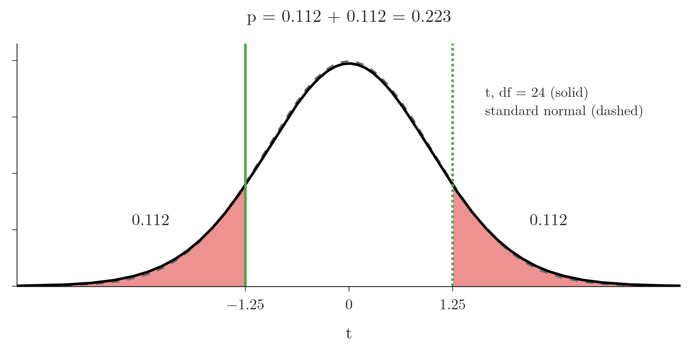
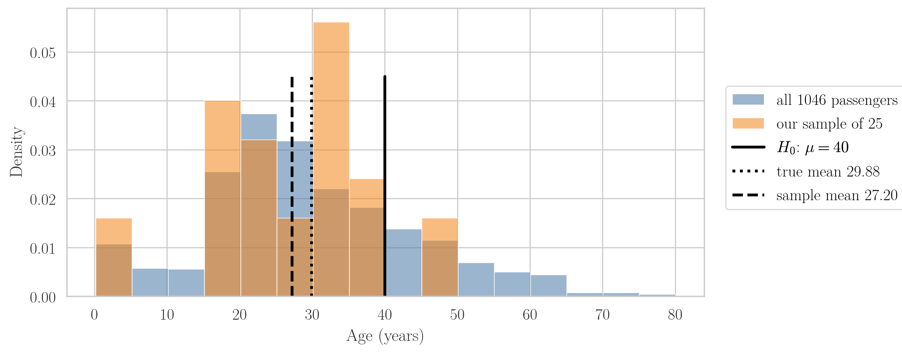

<!-- where-this-fits: generated by course_map/build_map.py; edit concepts.yaml, not this block -->
> **Where this fits:** Pipeline map step 0 (Foundations). See the [Course map](../01-course-map/note.md).
>
> 
>
> - **Builds on:** Student's t-distribution ([Note 282](../282-t-procedure/note.md)); Hypothesis testing: null and alternative ([Note 291](../291-rejection-region-and-z-test/note.md)).
> - **Leads to:** Choosing a hypothesis test ([Note 570](../570-choosing-a-hypothesis-test/note.md)).
> - **Compare with:** One-way ANOVA ([Note 572](../572-one-way-anova/note.md)).
<!-- /where-this-fits -->

## 1. Overview

> **Key point:** A t-test is the z-test with the sample standard deviation $s$ in place of $\sigma$, and Student's t-distribution in place of the normal curve; it comes in three types.

{height=32%}

The z-test of the [rejection region Note](../291-rejection-region-and-z-test/note.md) needs the population standard deviation $\sigma$, which we almost never know. The **t-test** works without it. Because $\sigma$ is usually unknown, the t-test is the test we use most often.

A t-test compares the means of two samples, or compares a sample mean with a known population mean. Figure 1 shows its three types. This Note covers:

- what changes from the z-test to the t-test;
- the three types of t-test (the two-sample ones get their own Note, the [two-sample t-tests Note](../302-two-sample-and-paired-t-tests/note.md));
- the one-sample t-test: assumptions, a worked example and its p-value;
- checking normality with the Shapiro-Wilk test;
- a one-sample t-test on the ages of Titanic passengers.

## 2. From the z-test to the t-test

> **Key point:** Replace $\sigma$ by $s$; the statistic then follows Student's t-distribution with $n - 1$ degrees of freedom instead of the standard normal.

We already made this change for confidence intervals in the [t-procedure Note](../282-t-procedure/note.md), and reuse it unchanged:

- with $s$ in place of $\sigma$, the standardized sample mean follows **Student's t-distribution**, bell-shaped like the standard normal but with fatter tails;
- its one parameter is the **degrees of freedom**, $df = n - 1$;
- as $n$ grows, the t-distribution approaches the standard normal.

| | Z-test | T-test |
|---|---|---|
| Spread used | population standard deviation $\sigma$ | sample standard deviation $s$ |
| Distribution of the statistic | standard normal | Student's t, $df = n - 1$ |
| Tail areas from | the z-table, `stats.norm` | the t-table, `stats.t` |
| Used when | $\sigma$ known (rare) | $\sigma$ unknown (usual) |

A rule of thumb also says the t-test suits small samples. That is a practical observation, not a mathematical requirement: the t-test works for any $n$ once $\sigma$ is unknown, and for large $n$ it gives nearly the same answer as the z-test.

## 3. The three types of t-test

> **Key point:** One sample against a known mean; two independent groups against each other; or the same subjects measured twice.

1. **One-sample t-test.** Compares the mean of one sample with a known population mean. $H_0$: there is no difference between the population mean and the claimed value. This is what we did with the z-test, without $\sigma$.
2. **Independent two-sample t-test.** Compares the means of two independent samples, for example the marks of section A and section B. "Independent" means the groups do not overlap: no student is in both sections. $H_0$: the two population means are equal.
3. **Paired t-test** (dependent two-sample t-test). Compares two samples that are linked, such as the same students' marks in a test before and after a training program. $H_0$: the mean difference is zero.

The rest of this Note is about the first; the [two-sample t-tests Note](../302-two-sample-and-paired-t-tests/note.md) covers the other two.

## 4. The one-sample t-test

> **Key point:** It checks whether a sample mean differs from a claimed population mean when $\sigma$ is unknown, using $t = (\bar{x} - \mu_0)/(s/\sqrt{n})$.

### 4.1 Assumptions

The one-sample t-test needs four things:

1. **Normality.** The population the sample comes from is normally distributed. If we cannot check the population, we check the sample (section 5); with $n \ge 30$, the central limit theorem makes $\bar{X}$ approximately normal anyway (see the [central limit theorem Note](../271-sampling-distribution-and-clt/note.md)).
2. **Independence.** The value of one observation does not influence another. The weight of one chips packet does not affect the weight of the next.
3. **Random sampling.** The sample is a random, representative subset of the population. Picking all the packets from one shop shelf would not be.
4. **Unknown $\sigma$.** If $\sigma$ were known, we would use the z-test.

### 4.2 The t statistic

1. **In words:** the distance between the sample mean and the claimed mean, in estimated standard errors.
2. **Formula:**
   $$t = \frac{\bar{x} - \mu_0}{s/\sqrt{n}}, \qquad df = n - 1$$
3. **Example:** the chocolate bars of section 4.3, $\bar{x} = 49.7$, $\mu_0 = 50$, $s = 1.2$, $n = 25$:
   $$t = \frac{49.7 - 50}{1.2/\sqrt{25}} = \frac{-0.3}{0.24} = -1.25, \qquad df = 24$$

### 4.3 Example: do chocolate bars weigh 50 g?

A manufacturer claims that its new chocolate bar weighs **50 g** on average. We doubt it, so we weigh a random sample of **25** bars: the sample mean is **49.7 g** and the sample standard deviation **1.2 g**. We use $\alpha = 0.05$.

1. **Hypotheses.** The weight is 50 g, against: it is not.
   $$H_0: \mu = 50, \qquad H_1: \mu \neq 50$$
2. **Significance level.** $\alpha = 0.05$.
3. **Assumptions.** $n = 25 < 30$, so the central limit theorem does not cover us, and we only have summary numbers, not the 25 weights, so we cannot test normality. We assume it, along with independence and random sampling. $\sigma$ is unknown.
4. **Test.** One-sample t-test.
5. **Statistic.** $t = -1.25$ with $df = 24$ (section 4.2).
6. **P-value.** $H_1$ uses $\neq$, so both tails count (see the [p-values Note](../300-p-values/note.md)). Instead of a t-table we use the CDF of the t-distribution with 24 degrees of freedom:
   $$P(T \le -1.25) = 0.112, \qquad p = 2 \times 0.112 = 0.223$$
7. **Decide.** $0.223 > 0.05$: we fail to reject $H_0$.
8. **Interpret.** The sample gives no significant evidence that the mean weight differs from 50 g.

{height=30%}

Figure 2 shows the two red tails. The t-distribution with 24 degrees of freedom is already close to the standard normal (dashed), but its tails are slightly fatter, so the p-value is slightly larger than a z-test would give (0.211).

The degrees of freedom matter: they set the shape of the curve and so the tail areas. That is why `stats.t.cdf` takes `df` as well as the point.

> **Python:** The t-distribution's CDF replaces the t-table.
>
> ```python
> from scipy import stats
>
> t = (49.7 - 50) / (1.2 / 25 ** 0.5)     # -1.25
> p = 2 * stats.t.cdf(-abs(t), df=24)     # 0.223
> # with only summary statistics, this is the whole test
> ```

## 5. Checking normality: the Shapiro-Wilk test

> **Key point:** The Shapiro-Wilk test is itself a hypothesis test with $H_0$: "the data comes from a normal distribution"; $p > 0.05$ means no evidence against normality, not proof of it.

When we have the raw values and $n < 30$, we check normality before the t-test. Plots work (a histogram, or a Q-Q plot, see the [kurtosis and Q-Q plots Note](../260-kurtosis-and-qq-plots/note.md)). A formal option is the **Shapiro-Wilk test**: we give it the numbers, and it returns a statistic and a p-value.

Since it is a hypothesis test, everything from the earlier Notes applies:

- $H_0$: the data comes from a normal distribution; $H_1$: it does not;
- $p \le 0.05$: reject $H_0$, the data is not normal;
- $p > 0.05$: fail to reject $H_0$; we have no evidence against normality and may go on with the t-test.

"$p > 0.05$ means the data is normal" is the common way to say it, but it is the same mistake as "accepting" $H_0$. With 25 values the Shapiro-Wilk test has little power, so it passes many mildly non-normal samples. With thousands of values it rejects even harmless departures: all 1046 known Titanic ages give $p = 6 \times 10^{-11}$. It is best read together with a plot.

## 6. Case study: the mean age of Titanic passengers

> **Key point:** A random sample of 25 ages gives $t = -3.38$ and a one-tailed $p = 0.0012$, so we conclude that the mean age is below 35; the true mean is 29.88.

The Titanic carried 1309 passengers in the Kaggle train and test files together, and 1046 of them have a known age. Suppose we claim, without seeing all the data, that **the mean age of Titanic passengers is less than 35 years**. We test it on a random sample of 25 ages (`random_state=0`); afterwards we can check against all 1046.

### 6.1 The test

1. **Hypotheses.**
   $$H_0: \mu = 35, \qquad H_1: \mu < 35$$
2. **Significance level.** $\alpha = 0.05$.
3. **Assumptions.** With only 25 values, normality must be checked. The Shapiro-Wilk test gives $p = 0.299 > 0.05$: no evidence against normality. The sample is random, ages of different passengers are independent, and $\sigma$ is unknown.
4. **Test.** One-sample t-test, left-tailed.
5. **Statistic.** The sample has $\bar{x} = 27.20$ and $s = 11.53$:
   $$t = \frac{27.20 - 35}{11.53/\sqrt{25}} = \frac{-7.80}{2.31} = -3.38, \qquad df = 24$$
6. **P-value.** $H_1$ uses $<$, so the p-value is the left tail: $p = P(T \le -3.38) = 0.0012$.
7. **Decide.** $0.0012 \le 0.05$: reject $H_0$.
8. **Interpret.** The mean age of Titanic passengers is significantly less than 35 years.

{height=32%}

All 1046 known ages have a mean of **29.88** years (Figure 3): below 35, as the test concluded. Our sample mean, 27.20, happened to be lower than the true mean, which helped the test.

> **Python:** `ttest_1samp` does steps 5 and 6. `alternative` says which tail $H_1$ points to: `"less"`, `"greater"` or `"two-sided"` (the default).
>
> ```python
> from scipy import stats
>
> stats.shapiro(sample_age).pvalue          # 0.299
> res = stats.ttest_1samp(sample_age, popmean=35,
>                         alternative="less")
> res.statistic, res.pvalue                 # -3.38, 0.0012
> ```

### 6.2 One-tailed p-values from a two-sided function

Without `alternative`, scipy's t-test functions return a **two-sided** p-value; here 0.0025. A common shortcut is to halve it for a one-tailed test. That is right only when $t$ falls on the side $H_1$ points to:

- $t$ on the side of $H_1$ (here $t < 0$ for $H_1: \mu < 35$): one-tailed $p$ = two-sided $p / 2 = 0.0025/2 = 0.0012$;
- $t$ on the other side: one-tailed $p = 1 - (\text{two-sided } p)/2$, which is large.

Halving blindly would turn a sample mean of, say, 40 into "significant evidence that the mean is below 35". Passing `alternative` avoids the trap.

### 6.3 How often would a sample of 25 find it?

> **Extra:** Our sample rejected $H_0$, but another sample might not. Drawing 4000 random samples of 25 ages and testing each, only **53%** reject $H_0$ at the 5% level, although $H_0$ is false (the true mean is 29.88). That 53% is the power of this test (see the [errors, power and tails Note](../292-errors-power-and-tails/note.md)); the other 47% of samples would make a Type II error. A larger sample would raise it.

## 7. Back to the five videos

> **Key point:** The five whiteboard videos give $t = 2.12$ and one-tailed $p = 0.051$: just above 0.05, so the evidence that they beat 6 minutes is not quite significant.

> **Extra:** The [null and alternative hypotheses Note](../290-null-and-alternative-hypotheses/note.md) asked whether five videos with average view durations of 7, 9, 5, 11 and 13 minutes show that the new style beats the old average of 6 minutes. With $H_0: \mu = 6$, $H_1: \mu > 6$:
>
> 1. **In words:** a one-sample, right-tailed t-test on the five values.
> 2. **Formula:** $\bar{x} = 9$, $s = 3.16$, $n = 5$:
>    $$t = \frac{9 - 6}{3.16/\sqrt{5}} = \frac{3}{1.41} = 2.12, \qquad df = 4$$
> 3. **Example:** $p = P(T \ge 2.12) = 0.051$.
>
> At $\alpha = 0.05$ we fail to reject $H_0$, by a hair. On the scale of the [p-values Note](../300-p-values/note.md) this is weak evidence: worth a few more videos before deciding, and certainly not proof that the new style fails.

## 8. Summary

| | Chocolate bars | Titanic ages |
|---|---|---|
| $H_0$ / $H_1$ | $\mu = 50$ / $\mu \neq 50$ | $\mu = 35$ / $\mu < 35$ |
| Data | $n = 25$, $\bar{x} = 49.7$, $s = 1.2$ | $n = 25$, $\bar{x} = 27.20$, $s = 11.53$ |
| Normality | assumed (only summary data) | Shapiro-Wilk $p = 0.299$ |
| $t$, $df$ | $-1.25$, 24 | $-3.38$, 24 |
| P-value | 0.223 (two-tailed) | 0.0012 (left-tailed) |
| Decision | fail to reject $H_0$ | reject $H_0$ |

- The t-test replaces $\sigma$ by $s$ and the normal curve by Student's t with $n - 1$ degrees of freedom.
- Three types: one-sample, independent two-sample, paired.
- One-sample assumptions: normality (or $n \ge 30$), independence, random sampling, unknown $\sigma$.
- The Shapiro-Wilk test checks normality; $p > 0.05$ means no evidence against it, not proof.
- Use `alternative=` for one-tailed tests instead of halving a two-sided p-value.

## 9. Key terms

| Term | Meaning |
|---|---|
| T-test | A hypothesis test about means that uses the sample standard deviation and Student's t-distribution |
| One-sample t-test | Tests whether a population mean equals a claimed value, from one sample, with $\sigma$ unknown: $t = (\bar{x} - \mu_0)/(s/\sqrt{n})$ |
| T statistic | The value of $t$ computed from the sample in a t-test |
| Independent two-sample t-test | A t-test comparing the means of two separate, non-overlapping groups |
| Paired t-test (dependent t-test) | A t-test comparing two linked measurements of the same subjects, through their differences |
| `alternative` (scipy) | The argument of scipy's tests that sets the direction of $H_1$: `"two-sided"`, `"less"` or `"greater"` |
