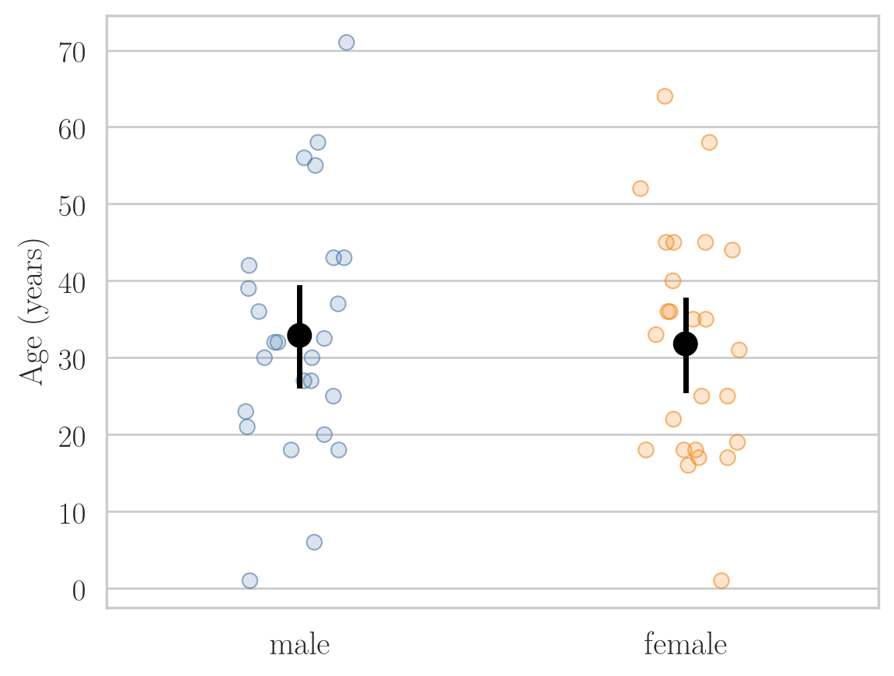

<!-- where-this-fits: generated by course_map/build_map.py; edit concepts.yaml, not this block -->
> **Where this fits:** Pipeline map step 0 (Foundations). See the [Course map](../01-course-map/note.md).
>
> 
>
> - **Builds on:** Student's t-distribution ([Note 282](../282-t-procedure/note.md)); Hypothesis testing: null and alternative ([Note 291](../291-rejection-region-and-z-test/note.md)).
<!-- /where-this-fits -->

## 1. Overview

> **Key point:** Two separate groups are compared with the independent two-sample t-test; the same subjects measured twice are compared with the paired t-test, which tests the mean of the differences.

{height=30%}

The [one-sample t-test Note](../301-one-sample-t-test/note.md) compared one sample mean with a claimed value. Often we want to compare two samples instead. Figure 1 shows the two designs, and each has its own t-test.

This Note covers:

- the independent two-sample t-test: assumptions, the equal-variance check with Levene's test, the formula and a worked example;
- a case study: are male Titanic passengers older than female ones?
- the paired t-test: assumptions, the formula and a weight-loss example;
- why pairing makes a test more powerful;
- comparing two machine learning models with a paired t-test.

## 2. The independent two-sample t-test

> **Key point:** It compares the means of two independent groups; $H_0: \mu_1 = \mu_2$, or equivalently $\mu_1 - \mu_2 = 0$.

The **independent two-sample t-test**, also called the **unpaired t-test**, compares the means of two independent groups to decide whether they differ significantly. Examples:

- the average marks of section A and section B of a class;
- the mean age of male and female Titanic passengers;
- the average time desktop users and mobile users spend on a website.

$H_0$ says the two population means are equal; $H_1$ says they differ (two-tailed) or that one is larger (one-tailed):

$$H_0: \mu_1 - \mu_2 = 0, \qquad H_1: \mu_1 - \mu_2 \neq 0$$

A t-test compares exactly **two** groups. For a categorical column with three or more categories, such as the three Titanic classes, we use ANOVA instead.

### 2.1 Assumptions

1. **Independence of observations.** There is no relationship between the observations in one group and those in the other. No Titanic passenger is both male and female, so the two age samples are independent. This fails if, say, we compare the marks of a Python course and a machine learning course when some students took both.
2. **Normality.** The data in each group is approximately normal. With 30 or more values per group the central limit theorem covers us; with fewer, we check each group, with a Q-Q plot, a histogram or the Shapiro-Wilk test (see the [one-sample t-test Note](../301-one-sample-t-test/note.md)).
3. **Equal variances** (homogeneity of variance). The two populations have about the same variance: $\sigma_1^2 = \sigma_2^2$. Section 2.2 shows how to check it.
4. **Random sampling.** Each sample is random and representative. Twenty-five Titanic men should come from all three classes, not only from first class.

The sample sizes may differ: 30 desktop users and 25 mobile users is fine.

### 2.2 Checking equal variances: Levene's test

**Levene's test** checks whether two or more groups have equal variances. Like the Shapiro-Wilk test, it is itself a hypothesis test:

- $H_0$: the population variances are equal; $H_1$: they are not;
- $p \le 0.05$: reject $H_0$, the variances differ;
- $p > 0.05$: no evidence that they differ, so we may keep the equal-variance assumption.

The **F-test** is another test for comparing variances.

> **Extra:** If the variances clearly differ, we use **Welch's t-test**, which drops the equal-variance assumption: in scipy, `ttest_ind(a, b, equal_var=False)`. Welch's test is still a parametric t-test. The usual non-parametric alternative, which does not assume normality at all, is the Mann-Whitney U test. Many statisticians use Welch's test by default: when the variances are equal it loses almost nothing.

### 2.3 The test statistic

1. **In words:** the difference between the two sample means, in standard errors of that difference.
2. **Formula:**
   $$t = \frac{\bar{x}_1 - \bar{x}_2}{\sqrt{\dfrac{s_1^2}{n_1} + \dfrac{s_2^2}{n_2}}}, \qquad df = n_1 + n_2 - 2$$
3. **Example:** the website data of section 3, $\bar{x}_1 = 18.5$, $s_1 = 3.5$, $\bar{x}_2 = 14.3$, $s_2 = 2.7$, $n_1 = n_2 = 30$:
   $$\sqrt{\frac{3.5^2}{30} + \frac{2.7^2}{30}} = \sqrt{\frac{12.25 + 7.29}{30}} = \sqrt{0.651} = 0.807$$
   $$t = \frac{18.5 - 14.3}{0.807} = \frac{4.2}{0.807} = 5.20, \qquad df = 30 + 30 - 2 = 58$$

The standard error adds the two variances, each divided by its own sample size: the uncertainty of a difference comes from both means.

> **Extra:** Strictly, the formula above is the standard error of **Welch's** test, whose degrees of freedom come from a longer formula (54.5 here). The classic **Student's** test, which assumes equal variances and uses $df = n_1 + n_2 - 2$, uses a pooled standard deviation instead:
> $$s_p^2 = \frac{(n_1 - 1)s_1^2 + (n_2 - 1)s_2^2}{n_1 + n_2 - 2}, \qquad SE = s_p\sqrt{\frac{1}{n_1} + \frac{1}{n_2}}$$
> When $n_1 = n_2$ the two standard errors are identical, so here $t = 5.20$ either way: $s_p^2 = (12.25 + 7.29)/2 = 9.77$ and $SE = 3.126 \times \sqrt{2/30} = 0.807$. With unequal sample sizes, use one version consistently; `ttest_ind` does this for us.

## 3. Example: desktop and mobile users

> **Key point:** $t = 5.20$ with 58 degrees of freedom gives $p = 0.000003$: desktop and mobile users spend different amounts of time on the site.

A website owner claims there is no difference in the average time spent on the site between desktop and mobile users. To test this, we collect data from **30 desktop users** and **30 mobile users**:

| | $n$ | Mean time (minutes) | Standard deviation |
|---|---|---|---|
| Desktop | 30 | 18.5 | 3.5 |
| Mobile | 30 | 14.3 | 2.7 |

The file `data/website_time.csv` holds 60 simulated values with exactly these summary numbers, so that we can run the checks.

1. **Hypotheses.** $H_0: \mu_{\text{desktop}} - \mu_{\text{mobile}} = 0$, $H_1: \mu_{\text{desktop}} - \mu_{\text{mobile}} \neq 0$.
2. **Significance level.** $\alpha = 0.05$.
3. **Assumptions.**
   - independence: we assume each user uses only one device;
   - random sampling: assumed;
   - normality: Shapiro-Wilk gives $p = 0.51$ (desktop) and $p = 0.77$ (mobile), no evidence against normality;
   - equal variances: Levene's test gives $p = 0.30$, no evidence of unequal variances.
4. **Test.** Independent two-sample t-test, two-tailed.
5. **Statistic.** $t = 5.20$, $df = 58$ (section 2.3).
6. **P-value.** Both tails: $p = 2\,P(T \ge 5.20) = 0.0000027$.
7. **Decide.** $p \le 0.05$: reject $H_0$.
8. **Interpret.** The owner's claim is wrong: average time on the site differs between desktop and mobile users.

The two-tailed test says only that the means differ. Here the sign of $t$ shows that desktop users spend longer; a one-tailed test with $H_1: \mu_{\text{desktop}} > \mu_{\text{mobile}}$, decided in advance, would be the test to run if that direction were the question.

> **Python:** `ttest_ind` runs the independent two-sample t-test; `ttest_ind_from_stats` works from summary numbers alone.
>
> ```python
> from scipy import stats
>
> stats.levene(desktop, mobile).pvalue          # 0.30
> stats.ttest_ind(desktop, mobile)              # t = 5.20, p = 2.7e-06
> stats.ttest_ind_from_stats(18.5, 3.5, 30,
>                            14.3, 2.7, 30)     # the same result
> ```

## 4. Case study: are male Titanic passengers older?

> **Key point:** Samples of 25 men and 25 women give $p = 0.40$, so we fail to reject $H_0$, although the true means do differ by 1.9 years: a Type II error.

### 4.1 Why a test and not just a plot

A t-test between a numerical column (age) and a two-category column (sex) asks whether the two are related. If the mean age differs between men and women, age depends on sex; if the means are about the same, there is no such relationship.

A bar chart of mean age by sex would show the difference in our data. But our data is a sample, and the question is about the population. The test tells us whether the difference we see is larger than sampling noise.

### 4.2 The test

Our claim: the average age of male passengers is greater than that of female passengers. Of the 1309 passengers in the Kaggle train and test files, 658 men and 388 women have a known age. We draw a random sample of 25 of each (`random_state=5`).

1. **Hypotheses.**
   $$H_0: \mu_{\text{male}} = \mu_{\text{female}}, \qquad H_1: \mu_{\text{male}} > \mu_{\text{female}}$$
2. **Significance level.** $\alpha = 0.05$.
3. **Assumptions.** Shapiro-Wilk: $p = 0.78$ (men) and $p = 0.52$ (women). Levene: $p = 0.89$. No evidence against normality or equal variances; the groups are independent and randomly sampled.
4. **Test.** Independent two-sample t-test, right-tailed.
5. **Statistic.** Men: $\bar{x} = 32.9$, $s = 16.1$. Women: $\bar{x} = 31.8$, $s = 15.1$. Then $t = 0.25$, $df = 48$.
6. **P-value.** $p = P(T \ge 0.25) = 0.40$.
7. **Decide.** $0.40 > 0.05$: fail to reject $H_0$.
8. **Interpret.** These samples give no significant evidence that men were older than women on average.

{height=32%}

Figure 2 shows why: the two clouds of ages overlap almost completely, and the confidence intervals of the means overlap too.

### 4.3 Checking against the population

All 658 known male ages have a mean of **30.59** years and all 388 female ages **28.69**. So the men really were older on average, by 1.9 years, and $H_0$ is false. Our test made a Type II error (see the [errors, power and tails Note](../292-errors-power-and-tails/note.md)).

Failing to reject $H_0$ was not a proof that the mean ages are equal; it only said that 25 people per group could not show the difference. A difference of 1.9 years, on ages that spread over 0 to 80 with a standard deviation near 14, is small; it needs a far larger sample.

> **Extra:** Repeating the test on 4000 random pairs of samples of 25, only **10%** reject $H_0$. With this sample size the test has a power of about 0.10: it misses this real but small difference nine times out of ten.

## 5. The paired t-test

> **Key point:** For two linked measurements of the same subjects, we take the difference per subject and run a one-sample t-test on the differences, with $H_0$: mean difference $= 0$.

### 5.1 When to use it

The **paired t-test**, also called the **dependent two-sample t-test**, compares the means of two samples that are related or paired. Common cases:

- **before and after studies:** the performance of the same group before and after an intervention or treatment, such as students' test marks before and after extra classes;
- **matched or correlated groups:** two groups matched in pairs, such as siblings, or pairs of people chosen to be similar in age and health.

Before-and-after studies are by far the most common.

### 5.2 Assumptions

A small class has 5 students, A to E. Their test marks are poor, so they get extra classes and then take the test again:

| Student | Before | After | $d$ = before $-$ after |
|---|---|---|---|
| A | 50 | 55 | $-5$ |
| B | 60 | 60 | 0 |
| C | 70 | 60 | 10 |
| D | 40 | 60 | $-20$ |
| E | 25 | 100 | $-75$ |

The same 5 students make up both samples. The three assumptions, on this example:

1. **Paired observations.** The two sets of measurements are linked: each value in one set belongs to the same subject (or matched pair) as one value in the other. Student A's mark before (50) and student A's mark after (55) form a pair.
2. **Normality of the differences.** The differences between paired observations are approximately normal. We test the differences (the last column), not the two samples separately.
3. **Independence of pairs.** Each pair is independent of the other pairs: student A's marks do not influence student B's (no copying in the test).

### 5.3 The test statistic

For each subject we compute the difference $d_i = x_{\text{before},i} - x_{\text{after},i}$. If $H_0$ is true, the mean difference $\mu_d = \mu_{\text{before}} - \mu_{\text{after}}$ is 0. The test is then a one-sample t-test of the differences against 0.

1. **In words:** the mean difference, in estimated standard errors of the mean difference.
2. **Formula:**
   $$t = \frac{\bar{d} - 0}{s_d/\sqrt{n}}, \qquad df = n - 1$$
   where $\bar{d}$ and $s_d$ are the mean and standard deviation of the $n$ differences.
3. **Example:** the weight-loss data of section 6, $\bar{d} = -0.47$ kg, $s_d = 2.45$ kg, $n = 15$:
   $$t = \frac{-0.47}{2.45/\sqrt{15}} = \frac{-0.47}{0.631} = -0.74, \qquad df = 14$$

## 6. Example: does a weight-loss program work?

> **Key point:** The 15 participants gained 0.47 kg on average; $t = -0.74$ and the right-tailed $p = 0.76$, so the data gives no evidence that the program reduces weight.

A fitness centre evaluates a new 8-week weight-loss program. It enrols **15 participants** and weighs each one before and after. The goal is to test whether the program leads to a significant **reduction** in weight. The data is in `data/weight_loss.csv`; Figure 3 shows each participant.

{height=33%}

| Participant | Before (kg) | After (kg) | $d$ = before $-$ after |
|---|---|---|---|
| A | 80 | 78 | 2 |
| B | 92 | 93 | $-1$ |
| C | 75 | 81 | $-6$ |
| D | 68 | 67 | 1 |
| E | 85 | 88 | $-3$ |
| F | 78 | 76 | 2 |
| G | 73 | 74 | $-1$ |
| H | 90 | 91 | $-1$ |
| I | 70 | 72 | $-2$ |
| J | 88 | 86 | 2 |
| K | 76 | 77 | $-1$ |
| L | 84 | 86 | $-2$ |
| M | 82 | 80 | 2 |
| N | 77 | 79 | $-2$ |
| O | 91 | 88 | 3 |

1. **Hypotheses.** No change, against a reduction (before larger than after, so $d > 0$):
   $$H_0: \mu_d = 0, \qquad H_1: \mu_d > 0$$
2. **Significance level.** $\alpha = 0.05$.
3. **Assumptions.** The observations are paired (same people). Shapiro-Wilk on the 15 differences: $p = 0.16$, no evidence against normality. Participants do not influence each other.
4. **Test.** Paired t-test, right-tailed.
5. **Statistic.** $t = -0.74$, $df = 14$ (section 5.3).
6. **P-value.** $H_1$ points right, so $p = P(T \ge -0.74) = 0.76$.
7. **Decide.** $0.76 > 0.05$: fail to reject $H_0$.
8. **Interpret.** There is no evidence that the program reduces weight. In fact most participants gained a little.

The tail follows from $H_1$ and from how $d$ is defined, not from habit. With $d$ = before $-$ after, a reduction means $d > 0$, so the p-value is the right tail. Here $t$ is negative, on the "wrong" side for $H_1$, so the p-value is large. Taking the left tail, or halving scipy's two-sided p-value (0.47 / 2 = 0.24), would both be mistakes.

> **Python:** `ttest_rel` runs the paired t-test; `alternative` refers to the first sample minus the second.
>
> ```python
> from scipy import stats
>
> d = w["before"] - w["after"]
> stats.shapiro(d).pvalue                        # 0.16
> stats.ttest_rel(w["before"], w["after"],
>                 alternative="greater")        # t = -0.74, p = 0.76
> # identical to a one-sample t-test of d against 0
> stats.ttest_1samp(d, 0, alternative="greater")
> ```

## 7. Why pairing helps

> **Key point:** Pairing removes the large differences between people, so the standard error is far smaller and a real effect is far easier to detect.

People's weights range from 67 to 93 kg, but each person's weight changes by only a few kilograms. An independent two-sample test would treat the "before" and "after" columns as two unrelated groups, and that 26 kg spread between people would swamp a change of 1 or 2 kg. The paired test looks only at each person's own change.

> **Extra:** The standard errors make this concrete. For our 15 participants, the paired standard error is $s_d/\sqrt{n} = 0.63$ kg; treating the columns as independent gives $\sqrt{s_1^2/n + s_2^2/n} = 2.75$ kg, more than four times larger. Suppose every "after" weight were 2 kg lower (a real average loss of 1.53 kg). The paired t-test would give $t = 2.43$, $p = 0.015$: significant. The (wrong) independent test on the same numbers gives $t = 0.56$, $p = 0.29$: nothing. Analysing paired data as independent throws most of the power away.

## 8. Comparing two machine learning models

> **Key point:** Scores of two models on the same cross-validation folds are paired, so a paired t-test checks whether one model is really better.

When two models are evaluated with k-fold cross-validation on the **same folds** (see the [pipelines Note](../29-pipelines/note.md)), each fold gives a pair of scores, one per model. The pairs are linked: a hard fold is hard for both models. So the fold-by-fold comparison is a paired t-test, one of the machine learning uses listed in the [errors, power and tails Note](../292-errors-power-and-tails/note.md).

On scikit-learn's breast cancer dataset, with the same 10 stratified folds:

| Model | Mean accuracy over 10 folds |
|---|---|
| Logistic regression (with scaling) | 0.977 |
| Decision tree | 0.923 |

The paired t-test on the 10 pairs of accuracies gives $t = 3.90$, $df = 9$, $p = 0.004$: logistic regression is significantly more accurate on this data.

> **Extra:** The fold scores are not fully independent: any two training sets share 8 of the 10 folds. This makes the plain paired t-test overconfident (too many false positives). The **corrected resampled t-test** of Nadeau and Bengio (2003) inflates the variance by the factor $1/k + n_{\text{test}}/n_{\text{train}}$ ($1/10 + 1/9$ here). It gives $t = 2.68$, $p = 0.025$: still significant here, but with a much smaller margin. For important model choices, use the corrected test or repeated cross-validation.

## 9. Summary

| | One-sample | Independent two-sample | Paired |
|---|---|---|---|
| Data | one sample | two separate groups | the same subjects twice |
| $H_0$ | $\mu = \mu_0$ | $\mu_1 = \mu_2$ | $\mu_d = 0$ |
| Statistic | $\dfrac{\bar{x} - \mu_0}{s/\sqrt{n}}$ | $\dfrac{\bar{x}_1 - \bar{x}_2}{\sqrt{s_1^2/n_1 + s_2^2/n_2}}$ | $\dfrac{\bar{d}}{s_d/\sqrt{n}}$ |
| $df$ | $n - 1$ | $n_1 + n_2 - 2$ | $n - 1$ |
| Extra check | normality | normality of each group, equal variances (Levene) | normality of the differences |
| scipy | `ttest_1samp` | `ttest_ind` | `ttest_rel` |

- The independent two-sample t-test compares two separate groups; Levene's test checks equal variances, and Welch's test drops that assumption.
- Desktop against mobile: $t = 5.20$, $p = 0.000003$, a clear difference.
- Titanic men against women, 25 each: $p = 0.40$, a Type II error, since the true means differ by 1.9 years.
- The paired t-test is a one-sample t-test on the differences; the tail follows from $H_1$ and the sign convention of $d$.
- Pairing removes between-subject variation and greatly raises power; model scores on shared folds are paired.

## 10. Key terms

| Term | Meaning |
|---|---|
| Unpaired t-test | Another name for the independent two-sample t-test |
| Equal variances (homogeneity of variance) | The assumption that two populations have the same variance |
| Levene's test | A hypothesis test with $H_0$: the groups have equal variances |
| F-test | Another test that compares two variances |
| Welch's t-test | The two-sample t-test that does not assume equal variances |
| Pooled standard deviation | The combined standard deviation of two groups used by Student's two-sample t-test |
| Paired observations | Two measurements that belong to the same subject or matched pair |
| Corrected resampled t-test | A paired t-test for cross-validation scores that allows for the overlap between training sets |
