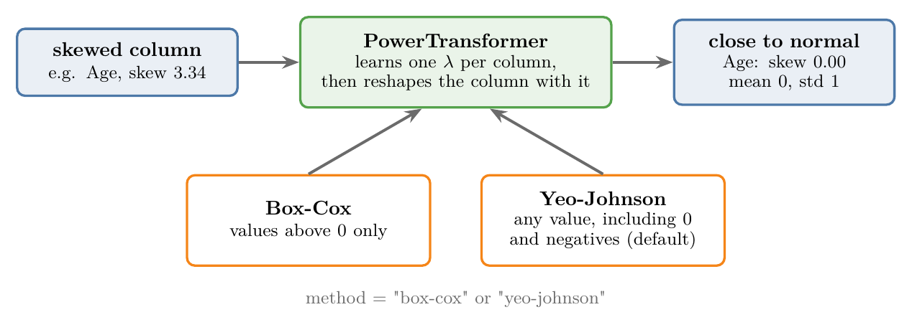
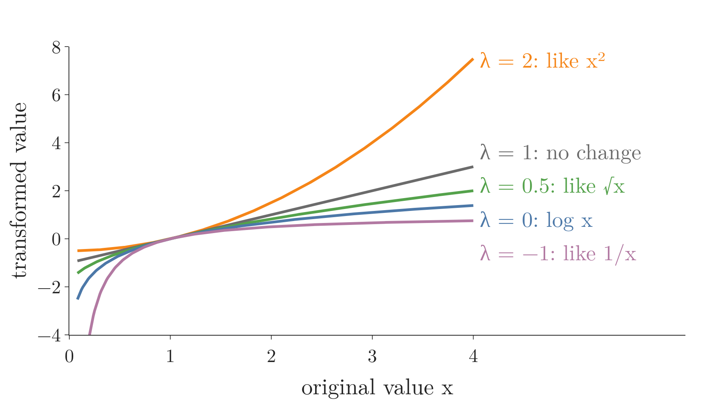
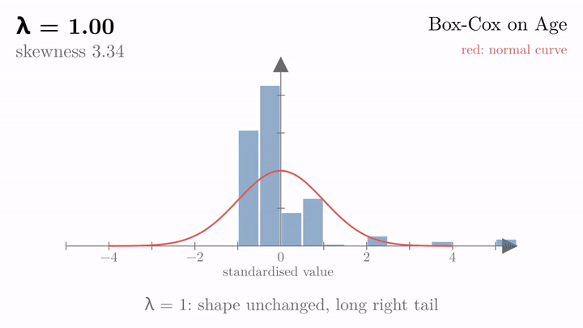
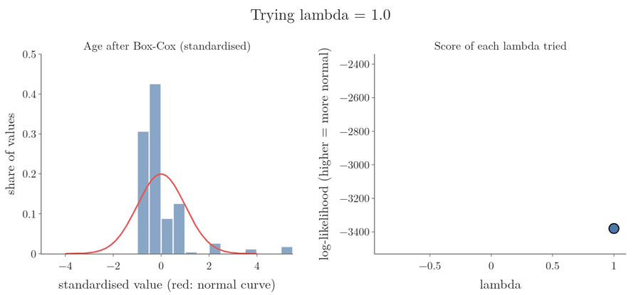
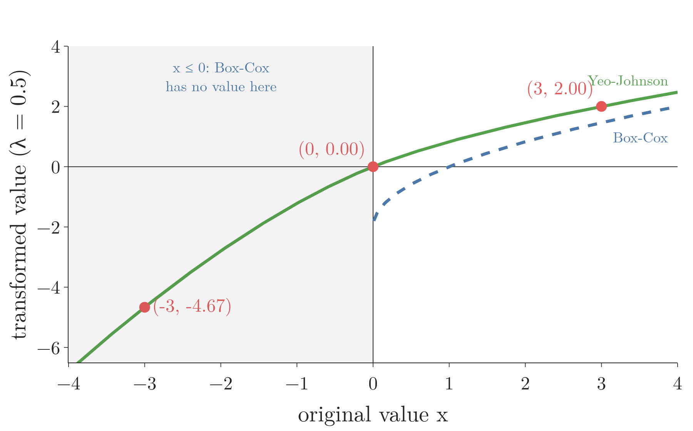
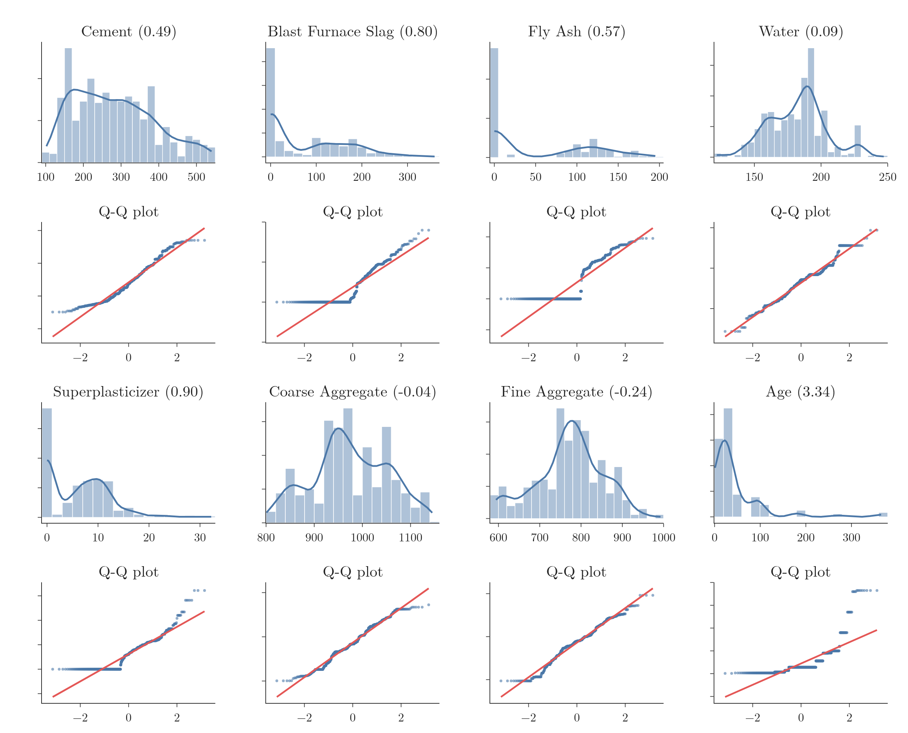
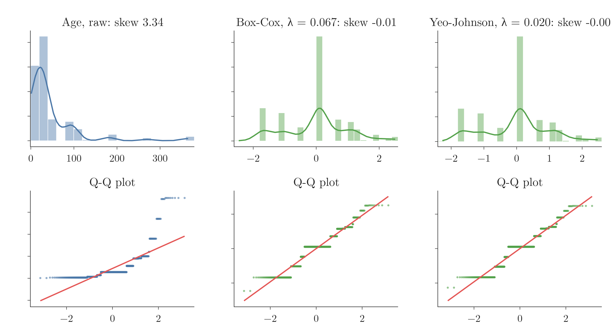
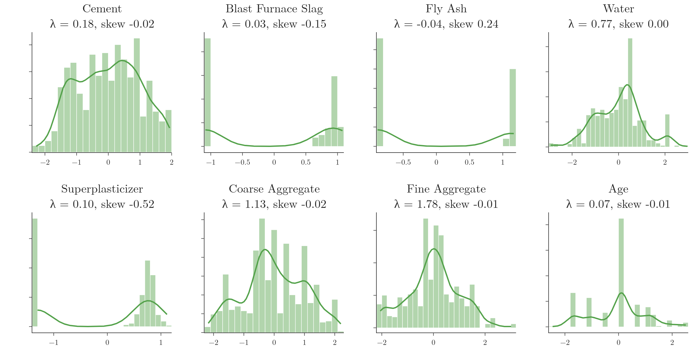
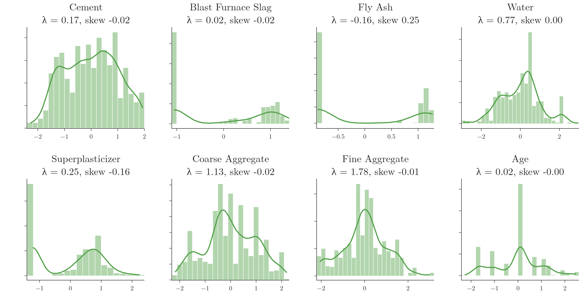
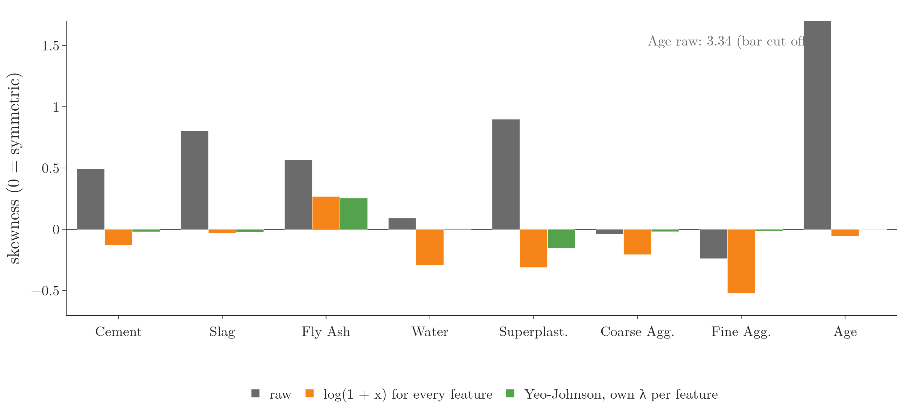

<!-- where-this-fits: generated by course_map/build_map.py; edit concepts.yaml, not this block -->
> **Where this fits:** Pipeline map step 5 (Engineer features). See the [Course map](../01-course-map/note.md).
>
> 
>
> - **Builds on:** Skewness ([Note 20](../20-univariate-analysis/note.md)); Feature transformation ([Note 23](../23-what-is-feature-engineering/note.md)); Q-Q plot ([Note 30](../30-function-transformer/note.md)).
> - **Compare with:** Function transformer ([Note 30](../30-function-transformer/note.md)).
<!-- /where-this-fits -->

## 1. Overview

> **Key point:** A power transformer raises each feature to a power $\lambda$ that it learns from the data, choosing the $\lambda$ that makes the feature closest to a **normal distribution** (G-1343), the symmetric bell-shaped curve.

A **feature** (G-772) is an input variable (one column of the data table), the **target** (G-1949) is the output we predict, and an **observation** (G-1374) is one record (one row). Note 30 transformed skewed features with four fixed formulas:

- the log;
- the reciprocal;
- the square;
- the square root.

We picked one, tried it, and kept whichever worked best.

The **power transformer** (G-1542) automates that search, like an optician who tries lens after lens until the letters look sharpest. For each feature, the power transformer:

1. tries a whole family of power formulas;
2. finds the power $\lambda$ (lambda) that makes the feature most normal;
3. applies that power to the feature.

Figure 1 shows the whole topic. scikit-learn's `PowerTransformer` offers two formulas: the **Box-Cox transform** (G-331) and the **Yeo-Johnson transform** (G-2136). The output comes out close to normal, and also standardised.



## 2. Power transformer in scikit-learn

> **Key point:** `PowerTransformer` is the second of scikit-learn's three mathematical transformers; it holds both the Box-Cox and the Yeo-Johnson transforms.

Note 30 listed scikit-learn's three classes for mathematical transformations:

1. **`FunctionTransformer`** (G-819): applies one formula we choose (Note 30).
2. **`PowerTransformer`** (G-1543): applies the Box-Cox or Yeo-Johnson transform, the subject of this Note.
3. **`QuantileTransformer`** (G-1600): used much less, and not covered in these Notes.

`PowerTransformer` has one main choice, the parameter **`method`** (G-1214). The method is either `"box-cox"` or `"yeo-johnson"`, and Yeo-Johnson is the default.

## 3. Box-Cox transform

> **Key point:** Box-Cox raises every value to a power $\lambda$; with the right $\lambda$, many skewed features become close to normal.

The Box-Cox transform is named after the two statisticians who published it in 1964, George Box and David Cox (Box and Cox 1964). Box-Cox is one of the most important transforms in practice: with it, a wide range of skewed distributions can be brought close to a normal distribution.

### 3.1 The Box-Cox formula

> **Key point:** The formula is $(x^\lambda - 1)/\lambda$, and the log when $\lambda = 0$.

The heart of Box-Cox is the power $\lambda$. Should a feature become $x^2$, $x^3$, $x^{1.5}$ or $x^{0.2}$? Box-Cox treats the power as a number to be found from the data.

The Box-Cox transform, step by step:

1. **In words:** raise each value to the power $\lambda$, subtract 1, and divide by $\lambda$. When $\lambda$ is exactly 0, that division is impossible, so the log is used instead.
2. **Formula:**
   $$x' = \begin{cases} \dfrac{x^{\lambda} - 1}{\lambda} & \text{if } \lambda \neq 0 \cr\ln x & \text{if } \lambda = 0 \end{cases}$$
3. **Example:** for the concrete `Age` feature of Section 6, `PowerTransformer` learns $\lambda = 0.067$. The ages 1, 28 and 365 days become
   $$\frac{1^{0.067} - 1}{0.067} = 0,\quad \frac{28^{0.067} - 1}{0.067} = 3.73,\quad \frac{365^{0.067} - 1}{0.067} = 7.24.$$
   Before, 365 was 13 times 28; after, it is less than 2 times. The long right tail has been pulled in.

The "subtract 1, divide by $\lambda$" part does not change the shape of the distribution: it only shifts and stretches it. The shape comes from the power $\lambda$ alone.

> **Extra:** The subtract-and-divide part is there so that the formula flows smoothly into the log as $\lambda$ gets close to 0. With $\lambda = 0.067$, the value 28 became 3.73, close to $\ln 28 = 3.33$. Without it, $x^{0.001}$ would be almost 1 for every value and the feature would collapse.

### 3.2 One formula, a whole family of transforms

> **Key point:** The log, square root, reciprocal and square transforms of Note 30 are all Box-Cox with one particular $\lambda$.

Each value of $\lambda$ gives a different transform. Figure 2 draws five of them.

{height=42%}

| $\lambda$ | Box-Cox gives | Same shape as |
|---|---|---|
| 2 | $(x^2 - 1)/2$ | square, for left skew |
| 1 | $x - 1$ | no change at all |
| 0.5 | $2(\sqrt{x} - 1)$ | square root |
| 0 | $\ln x$ | log |
| $-1$ | $1 - 1/x$ | reciprocal |

So the transforms of Note 30 are special cases of Box-Cox. The rule is simple:

- **$\lambda$ below 1:** squashes big values, so it pulls in a right tail. The smaller $\lambda$, the stronger the squash.
- **$\lambda$ above 1:** stretches big values apart, so it pulls in a left tail.
- **$\lambda = 1$:** leaves the shape as it is.

Unlike Note 30, we no longer have to try each transform by hand. Box-Cox can also land between them, for example on $\lambda = 0.067$, which is a little gentler than the log.

### 3.3 Finding the best lambda

> **Key point:** Box-Cox tries many values of $\lambda$ and keeps the one whose result is closest to a normal distribution.

The search goes like this:

1. Try many values of $\lambda$, usually between $-5$ and $5$.
2. Transform the feature with each one.
3. Keep the $\lambda$ whose result is the best approximation to a normal distribution.

Figure 3 shows the search on the concrete `Age` feature. At $\lambda = 1$ the feature keeps its long right tail (**skewness** (G-1817) 3.34; skewness is 0 for a symmetric feature and positive for a right tail). Lowering $\lambda$ pulls the tail in; going too low, to $\lambda = -0.5$, overshoots and creates a left tail instead.

The best value, $\lambda = 0.067$, gives a skewness of almost exactly 0.



The search needs a score that says how normal each result looks. The score scikit-learn uses is the **log-likelihood** (G-1113): a number that is higher when a normal curve explains the transformed values better. Figure 4 repeats the search with that score on the right. Watch the grey curve grow as $\lambda$ moves from 1 down to $-0.8$: the score rises, reaches a peak and falls again. The peak is at $\lambda = 0.067$, the value `PowerTransformer` keeps.



Each feature gets its own $\lambda$. A dataset with 8 features gets 8 values of $\lambda$, one per feature.

> **Extra:** How "closest to normal" is measured. The two standard ways are **maximum likelihood** (G-1191) and Bayesian statistics (Box and Cox 1964). scikit-learn uses maximum likelihood (scikit-learn docs, `PowerTransformer`): for each $\lambda$, it asks "if the transformed values really came from a normal distribution, how likely would we be to see exactly these values?", and keeps the $\lambda$ with the highest answer. Maximum likelihood comes back in its own right with logistic regression. A beginner only needs the idea: a computer search picks the most normal-looking $\lambda$.

### 3.4 Only positive values

> **Key point:** Box-Cox works only on values strictly above 0: no zeros, no negatives.

Box-Cox has one important restriction: every value must be strictly positive. A 0 breaks the formula, and so does a negative value.

The reason is in the formula. With $\lambda = 0$ Box-Cox takes $\ln x$, which does not exist for 0 or negative numbers. With other values of $\lambda$, a power such as $(-4)^{0.5}$ is not a real number either.

So before using Box-Cox, we check the minimum of every feature.

## 4. Yeo-Johnson transform

> **Key point:** Yeo-Johnson is a variation of Box-Cox that also works on zeros and negative values.

The Yeo-Johnson transform, published by In-Kwon Yeo and Richard Johnson in 2000 (Yeo and Johnson 2000), is an adjustment of Box-Cox. The main difference is that Yeo-Johnson removes Box-Cox's restriction: it accepts 0 and negative values.

The Yeo-Johnson transform, step by step:

1. **In words:** for a value of 0 or more, add 1 and then apply Box-Cox. For a negative value, flip its sign, add 1, apply Box-Cox with $2 - \lambda$, and flip the sign back.
2. **Formula:**
   $$x' = \begin{cases} \dfrac{(x + 1)^{\lambda} - 1}{\lambda} & x \geq 0,\ \lambda \neq 0 \cr\ln(x + 1) & x \geq 0,\ \lambda = 0 \cr-\dfrac{(1 - x)^{2 - \lambda} - 1}{2 - \lambda} & x < 0,\ \lambda \neq 2 \cr-\ln(1 - x) & x < 0,\ \lambda = 2 \end{cases}$$
3. **Example:** with $\lambda = 0.5$, the values $-3$, 0 and 3 become
   $$-\frac{4^{1.5} - 1}{1.5} = -4.67,\qquad \frac{1^{0.5} - 1}{0.5} = 0,\qquad \frac{4^{0.5} - 1}{0.5} = 2.$$
   Zero stays at 0, and the negative value is handled without any error.

Figure 5 draws both transforms with $\lambda = 0.5$ and marks these three points. Watch the left half: Box-Cox stops at 0, while Yeo-Johnson carries on smoothly into the negative values.

{height=40%}

For data with no negative values, only the first two lines apply. Then Yeo-Johnson is Box-Cox applied to $x + 1$, just as $\log(1 + x)$ in Note 30 was the log applied to $x + 1$.

> **Extra:** Why the negative side uses $2 - \lambda$. A $\lambda$ below 1 squashes the right tail; for the transform to treat both tails alike, the left side must squash in the mirror-image way. Using $2 - \lambda$ on the flipped values does exactly that, so the curve stays smooth through 0.

## 5. When to use a power transformer

> **Key point:** When a feature is not normal and the algorithm prefers normal data, apply both transforms and keep the better one.

Note 30 explained which algorithms care about the shape of the data: linear regression and logistic regression do; decision trees and random forests do not. The same rule decides when to use a power transformer.

The recipe:

1. Check each feature's distribution (density plot, skewness, **Q-Q plot** (G-1596) from Note 30).
2. If features are not normal and the algorithm is a linear one, apply a power transformer.
3. Try both methods, Box-Cox and Yeo-Johnson, just like trying settings of a model, and keep the one that scores better.

In real-world data, features are rarely normal to begin with, so this check is worth doing every time.

## 6. Power transformer on concrete strength

> **Key point:** On the concrete data, linear regression's R² rose from 0.63 to 0.80 with Box-Cox and 0.82 with Yeo-Johnson.

### 6.1 The data

> **Key point:** 1030 concrete mixes, 8 numerical features and the target `Strength`: a regression problem.

The dataset describes 1030 batches of concrete; each batch is one observation. Several of its features are clearly not normal, which makes it a good test for a power transformer.

| Column | Meaning |
|---|---|
| Cement, Blast Furnace Slag, Fly Ash, Water, Superplasticizer, Coarse Aggregate, Fine Aggregate | amount of each ingredient in the mix (kg per cubic metre) |
| Age | how many days the concrete has set, from 1 to 365 |
| Strength | how much pressure the concrete withstands (the target) |

`Strength` is a number, so this is a regression problem, and the model is linear regression.

> **Python:** Loading and checking the data.
>
> ```python
> import pandas as pd
>
> df = pd.read_csv("data/concrete_data.csv")
> df.shape            # (1030, 9)
> df.isnull().sum()   # all 0: no missing values
> df.describe()       # look at the "min" row
> ```

There are no missing values, which matters: transforms cannot handle them. The `min` row of `describe()` shows the problem for Box-Cox:

| Column | Minimum | Zeros |
|---|---|---|
| Blast Furnace Slag | 0 | 471 |
| Fly Ash | 0 | 566 |
| Superplasticizer | 0 | 379 |

No feature is negative, but three contain many zeros.

As always, we split first: 80% for training (824 rows) and 20% for testing (206 rows), with `random_state=42`.

> **Extra:** The data is the "Concrete Compressive Strength" dataset by I-Cheng Yeh (Yeh 1998), from the UCI Machine Learning Repository.

### 6.2 Baseline: no transform

> **Key point:** With no transform, linear regression scores R² 0.63 on the test set and 0.46 with cross-validation.

To measure a regression model, we use the **R² score** (G-1717): how much of the variation in the target the model explains. A score of 1 is perfect; a score of 0 is no better than always predicting the average strength. R² has its own Note later; here we only compare its values.

| Check | R² |
|---|---|
| Test set | 0.628 |
| 5-fold cross-validation | 0.461 |

Cross-validation, from Note 30, averages the score over 5 different splits. Cross-validation gives a lower and more honest number here, 0.46.

> **Python:** The baseline.
>
> ```python
> from sklearn.linear_model import LinearRegression
> from sklearn.metrics import r2_score
> from sklearn.model_selection import cross_val_score
>
> lr = LinearRegression()
> lr.fit(X_train, y_train)
> r2_score(y_test, lr.predict(X_test))       # 0.628
> cross_val_score(LinearRegression(), X, y,
>     scoring="r2", cv=5).mean()              # 0.461
> ```

> **Extra:** The features are not scaled here. Leaving them unscaled is fine: plain linear regression gives exactly the same predictions with or without scaling, because it simply adjusts its coefficients to the units. The Notebook checks this (R² 0.628 either way). Scaling matters for models such as KNN, or regression trained step by step with gradient descent.

### 6.3 How normal is each feature?

> **Key point:** `Age` is the worst feature (skewness 3.34); Blast Furnace Slag, Fly Ash and Superplasticizer are piled up at 0; the two aggregates are already close to normal.

Figure 6 shows each training feature as a histogram (skewness in brackets) with its Q-Q plot below.

{height=62%}

- **Cement:** slightly right-skewed, but fairly close to normal.
- **Blast Furnace Slag:** right-skewed, with a huge pile of zeros: the flat run of points at the bottom of its Q-Q plot.
- **Fly Ash:** **bimodal** (G-296), meaning it has two peaks: one at 0 and one around 120.
- **Water:** reasonably close to normal.
- **Superplasticizer:** right-skewed and bimodal, again with a pile of zeros.
- **Coarse Aggregate:** the closest to normal; its points follow the line.
- **Fine Aggregate:** also close to normal.
- **Age:** the worst. Most mixes are tested young (28 days or less), and a few after a whole year, so there is a long right tail.

### 6.4 Box-Cox

> **Key point:** Adding a tiny 0.000001 to every value lets Box-Cox run despite the zeros; it then lifted R² to 0.80 on the test set and 0.67 with cross-validation.

Box-Cox cannot run on the three features with zeros. A common workaround is to add a tiny number to every value: a 0 becomes 0.000001, which is above 0, and every other value hardly changes.

> **Python:** Box-Cox with `PowerTransformer`.
>
> ```python
> from sklearn.preprocessing import PowerTransformer
>
> pt = PowerTransformer(method="box-cox")
> X_train_transformed = pt.fit_transform(X_train + 0.000001)
> X_test_transformed = pt.transform(X_test + 0.000001)
> pt.lambdas_    # one lambda per column
> ```
>
> `fit` learns one $\lambda$ per feature from the training set; `transform` applies those same $\lambda$ values to both sets. The learned values are stored in `lambdas_`.

The attribute **`lambdas_`** (G-1041) holds the $\lambda$ learned for each feature, in column order (listed in Section 6.6). For `Cement` it is 0.177, so every cement value $x$ becomes $(x^{0.177} - 1)/0.177$: a value of 540 becomes 11.6, and 102 becomes 7.2.

Training the same linear regression on the transformed features:

| Check | No transform | Box-Cox |
|---|---|---|
| Test set R² | 0.628 | 0.805 |
| Cross-validated R² | 0.461 | 0.666 |

The cross-validated R² rose by about 0.2, a very good improvement for one line of preprocessing.

Figure 7 shows the feature that changed most, `Age`. The long right tail is gone, the skewness drops from 3.34 to almost 0, and the Q-Q plot points now follow the line.

{height=40%}

The spikes that remain are because `Age` takes only 14 different values (1, 3, 7, 14, 28 days and so on). A transform moves each value, but it cannot split one value into several.

Figure 8 shows all 8 features after Box-Cox.

{height=40%}

- **Cement** and **Superplasticizer:** improved, closer to a bell shape.
- **Blast Furnace Slag** and **Fly Ash:** not made normal. The two separate groups (zero and non-zero) are still two groups.
- **Water, Coarse Aggregate** and **Fine Aggregate:** almost unchanged; they were close to normal already.
- **Age:** the biggest improvement.

> **Extra:** The tiny-number trick has a side effect. With $\lambda$ near 0, Box-Cox behaves like a log, and $\ln(0.000001) = -13.8$, far below the log of any real amount (at least $\ln 11 = 2.4$ for slag). So all the zeros are thrown far to the left, as a separate block. The thrown zeros are why Blast Furnace Slag and Fly Ash in Figure 8 look like two bars at opposite ends. Yeo-Johnson does not need the trick, and handles zeros more gently.

### 6.5 Yeo-Johnson

> **Key point:** Yeo-Johnson needs no workaround for zeros and scored slightly better: R² 0.82 on the test set and 0.68 with cross-validation.

Yeo-Johnson is the default method, so `PowerTransformer()` with no arguments uses it. Yeo-Johnson accepts the zeros as they are.

> **Python:** Yeo-Johnson.
>
> ```python
> pt1 = PowerTransformer()   # method="yeo-johnson"
> X_train_transformed2 = pt1.fit_transform(X_train)
> X_test_transformed2 = pt1.transform(X_test)
> ```

| Check | No transform | Box-Cox | Yeo-Johnson |
|---|---|---|---|
| Test set R² | 0.628 | 0.805 | 0.816 |
| Cross-validated R² | 0.461 | 0.666 | 0.683 |

So the score went from 0.46 with no transform, to 0.67 with Box-Cox, to 0.68 with Yeo-Johnson.

Figure 9 shows all 8 features after Yeo-Johnson.

{height=40%}

The result looks much like Box-Cox in Figure 8. The visible differences are in the features with zeros: Superplasticizer and Blast Furnace Slag are spread out more smoothly, because Yeo-Johnson maps a 0 to 0 instead of throwing it far away. There are no negative values in this data, so Yeo-Johnson's main advantage is not even used.

> **Extra:** `PowerTransformer` also standardises its output by default (parameter `standardize=True`): after the power transform, every feature gets mean 0 and standard deviation 1, as with the `StandardScaler` of Note 24 (scikit-learn docs, `PowerTransformer`). Standardising is why the axes in Figures 8 and 9 run from about $-2$ to $2$.

### 6.6 Comparing the lambdas

> **Key point:** The two methods learn almost the same $\lambda$ for most features; they differ most on the features with zeros.

Both transformers fitted on the same training set:

| Column | Box-Cox $\lambda$ | Yeo-Johnson $\lambda$ | Skewness before | After Yeo-Johnson |
|---|---|---|---|---|
| Cement | 0.177 | 0.174 | 0.49 | $-0.02$ |
| Blast Furnace Slag | 0.025 | 0.016 | 0.80 | $-0.02$ |
| Fly Ash | $-0.039$ | $-0.161$ | 0.57 | 0.25 |
| Water | 0.773 | 0.771 | 0.09 | 0.00 |
| Superplasticizer | 0.099 | 0.254 | 0.90 | $-0.16$ |
| Coarse Aggregate | 1.130 | 1.130 | $-0.04$ | $-0.02$ |
| Fine Aggregate | 1.782 | 1.783 | $-0.24$ | $-0.01$ |
| Age | 0.067 | 0.020 | 3.34 | 0.00 |

The table follows the rule of Section 3.2:

- **Right-skewed features** (Cement, Slag, Fly Ash, Superplasticizer, Age) get $\lambda$ well below 1, close to a log.
- **Water and Coarse Aggregate,** already near normal, get $\lambda$ near 1: little change.
- **Fine Aggregate,** slightly left-skewed, gets $\lambda = 1.78$, close to a square.

The biggest gaps between the two methods are on Fly Ash and Superplasticizer, two of the features with zeros: the tiny-number trick changes what Box-Cox sees there.

> **Extra:** The cross-validated scores above fit the power transformer on all of `X` before cross-validating, so each test fold has already influenced the $\lambda$ values: a small case of data leakage. Putting the transformer inside a pipeline (Note 29) refits it on each training fold. The honest scores are 0.660 for Box-Cox and 0.674 for Yeo-Johnson, almost the same, so the conclusion holds.
>
> ```python
> from sklearn.pipeline import make_pipeline
>
> pipe = make_pipeline(PowerTransformer(),
>                      LinearRegression())
> cross_val_score(pipe, X, y, scoring="r2",
>                 cv=5).mean()   # 0.674
> ```

## 7. Function transformer or power transformer

> **Key point:** On the concrete data, $\log(1 + x)$ and Yeo-Johnson score almost the same (R² 0.796 and 0.800), so try both and keep whichever scores better.

The two transformers of Notes 30 and 31 do the same job in different ways:

- **`FunctionTransformer`:** we pick the formula (log, square root and so on) and apply it.
- **`PowerTransformer`:** searches a whole family of formulas and picks the best power for each feature.

The power transformer's family contains the log itself: for values of 0 and above, Yeo-Johnson with $\lambda = 0$ is exactly $\log(1 + x)$ (section 4). Because $\lambda$ is chosen by maximum likelihood (section 3.3), and $\lambda = 0$ is one of the candidates, the power it picks for each training feature fits a normal distribution at least as well as $\log(1 + x)$ does. A more normal feature does not guarantee a better model score, though, so the only way to choose is to try both and compare their scores.

On the concrete data, we put each transformer in a pipeline (Note 29), so it is refitted inside every training fold, and compare linear regression's R². Each score is the average of 5-fold cross-validation, repeated 10 times with shuffled rows, for 5 seeds:

| Transform | Cross-validated R² |
|---|---|
| None | 0.602 |
| $\log(1 + x)$ on every feature | 0.796 |
| Box-Cox | 0.796 |
| Yeo-Johnson | 0.800 |

Yeo-Johnson is ahead by only 0.004. On the same 50 splits, it beat $\log(1 + x)$ on 48. So Yeo-Johnson wins consistently, but by a very small margin: on this data, the fixed log does almost as well as the learned powers, even though it leaves Water and Fine Aggregate more skewed (Figure 10).

> **Extra:** These scores are higher than those in section 6. Section 6 used a plain `cv=5`, which does not shuffle (scikit-learn docs, `KFold`), so each fold is a block of consecutive rows in file order. On that single split, the ranking even flips: $\log(1 + x)$ scores 0.687 and Yeo-Johnson 0.674. Averaging over many shuffled splits removes the effect of any one split.

Figure 10 applies one fixed formula, $\log(1 + x)$, and Yeo-Johnson to the same concrete training features. Watch Water and Fine Aggregate, which were already near normal: the log pushes them into a left skew, while their own $\lambda$ keeps them near 0.

{width=100%}

## 8. Summary

| | Function transformer | Box-Cox | Yeo-Johnson |
|---|---|---|---|
| Formula | one we choose | $(x^\lambda - 1)/\lambda$, or $\ln x$ | Box-Cox on $x + 1$, mirrored for negatives |
| Power $\lambda$ | none | learned per column | learned per column |
| Values allowed | depends on the formula | above 0 only | any |
| In scikit-learn | FunctionTransformer | PowerTransformer, method "box-cox" | PowerTransformer, the default method |
| Concrete data, cross-validated R² (section 7) | 0.796 with $\log(1 + x)$ | 0.796 | 0.800 |

- A power transformer learns one power $\lambda$ for each feature and uses it to bring the feature close to a normal distribution.
- Box-Cox: $(x^\lambda - 1)/\lambda$, or $\ln x$ when $\lambda = 0$. The log, square root, reciprocal and square are special cases.
- The best $\lambda$ is found by a search (maximum likelihood): it is the peak of the log-likelihood curve, and is stored in `lambdas_`.
- $\lambda$ below 1 pulls in a right tail; above 1 pulls in a left tail; 1 leaves the shape alone.
- Box-Cox needs values above 0; Yeo-Johnson works on any value and is the default.
- `PowerTransformer` also standardises its output to mean 0 and standard deviation 1.
- On the concrete data, linear regression's cross-validated R² rose from 0.46 to 0.67 (Box-Cox) and 0.68 (Yeo-Johnson). `Age` gained most: skewness 3.34 to 0.
- A fixed $\log(1 + x)$ on every concrete feature scored almost as well as the learned powers (R² 0.796 against 0.796 for Box-Cox and 0.800 for Yeo-Johnson, shuffled repeated cross-validation). Try both and keep the better one.
- A transform cannot merge two separate groups, such as a pile of zeros and the rest, into one bell.

## 9. Sources

**Built from**

- CampusX, "Power Transformer | Box - Cox Transform | Yeo - Johnson Transform", YouTube, https://www.youtube.com/watch?v=lV_Z4HbNAx0

**Other references**

- Box, G. E. P. and Cox, D. R. (1964). An Analysis of Transformations. *Journal of the Royal Statistical Society, Series B* 26(2), 211-252.
- scikit-learn documentation. `sklearn.model_selection.KFold` (the `shuffle` parameter, default `False`). scikit-learn.org.
- scikit-learn documentation. `sklearn.preprocessing.PowerTransformer`. scikit-learn.org.
- Yeh, I-C. (1998). Modeling of Strength of High-Performance Concrete Using Artificial Neural Networks. *Cement and Concrete Research* 28(12), 1797-1808. Data: UCI Machine Learning Repository, Concrete Compressive Strength.
- Yeo, I-K. and Johnson, R. (2000). A New Family of Power Transformations to Improve Normality or Symmetry. *Biometrika* 87(4), 954-959.

## 10. Key terms

| Term | Meaning |
|---|---|
| Feature | An input variable, one column of the data table |
| Target | The output we predict |
| Observation | One record, one row of the data table |
| Power transformer | A transform that raises each feature to a learned power $\lambda$ to make it close to normal |
| PowerTransformer | scikit-learn's class for the Box-Cox and Yeo-Johnson transforms |
| Lambda ($\lambda$) (G-1038) | The power used by a power transform, learned separately for each feature |
| Box-Cox transform | $(x^\lambda - 1)/\lambda$, or $\ln x$ when $\lambda = 0$; works only on values above 0 |
| Yeo-Johnson transform | A variation of Box-Cox that also works on zero and negative values; scikit-learn's default |
| method | The `PowerTransformer` parameter that picks `"box-cox"` or `"yeo-johnson"` |
| lambdas_ | The `PowerTransformer` attribute holding the learned $\lambda$ of each feature |
| standardize | The `PowerTransformer` parameter (on by default) that rescales the output to mean 0 and standard deviation 1 |
| Log-likelihood | The score of the $\lambda$ search: higher when a normal curve explains the transformed values better |
| Maximum likelihood (G-1191) | Choosing the parameter value under which the observed data is most likely; used to find $\lambda$ |
| Bimodal | A distribution with two peaks |
| R² score (G-1717) | How much of the variation in a regression target the model explains: 1 is perfect, 0 is no better than the average |
