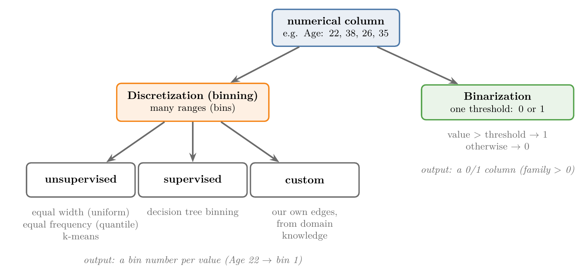
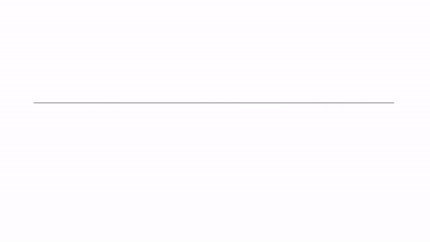
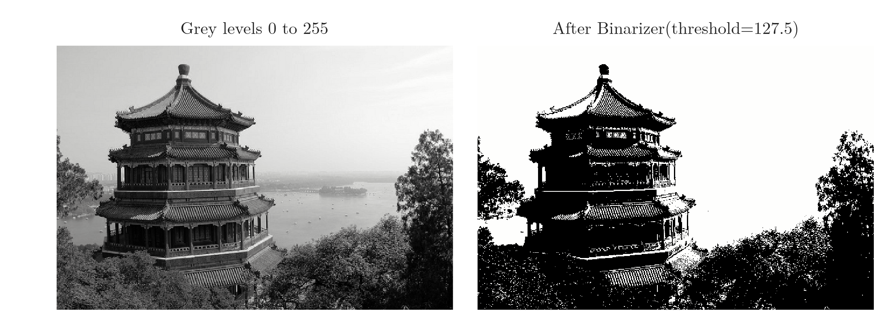

<!-- where-this-fits: generated by course_map/build_map.py; edit concepts.yaml, not this block -->
> **Where this fits:** Pipeline map steps 5 (Engineer features), 8 (Model). See the [Course map](../01-course-map/note.md).
>
> 
>
> - **Builds on:** Clustering ([Note 3](../03-types-of-ml/note.md)); Outliers ([Note 23](../23-what-is-feature-engineering/note.md)); Feature engineering ([Note 23](../23-what-is-feature-engineering/note.md)); Feature transformation ([Note 23](../23-what-is-feature-engineering/note.md)); Feature scaling ([Note 24](../24-standardization/note.md)).
> - **Leads to:** Feature construction and splitting ([Note 45](../45-feature-construction-splitting/note.md)).
> - **Compare with:** Encoding categorical data ([Note 26](../26-ordinal-label-encoding/note.md)); Hierarchical clustering ([Note 131](../131-hierarchical-clustering/note.md)); DBSCAN ([Note 132](../132-dbscan/note.md)).
<!-- /where-this-fits -->

## 1. Overview

> **Key point:** Discretization (binning) turns a numerical column into a few ranges; binarization turns it into just 0 or 1.

Earlier Notes encoded categories as numbers. This Note goes the other way: it turns numerical columns into categories. Note 23 introduced the idea briefly as binning; here we cover the techniques in full.

Figure 1 shows the whole topic. There are two techniques:

- **Discretization**, also called **binning**: cut the range of a column into several intervals and replace each value with the interval it falls in.
- **Binarization**: compare each value with one threshold and replace it with 0 or 1.



Discretization has several kinds. Most of this Note covers the three unsupervised ones, which scikit-learn's `KBinsDiscretizer` provides, and custom binning. Binarization comes at the end, with scikit-learn's `Binarizer`.

## 2. Why turn numbers into categories

> **Key point:** Sometimes a column is easier to use as a few groups than as exact numbers; this depends on the problem.

A numerical column is usually useful as it is. Sometimes, though, the same information is better represented as categories.

Take the Google Play Store data, with a column for each app's number of downloads. A few very famous apps have billions of downloads, while most apps have very few. The exact numbers spread over a huge range and are hard for a model to use.

Grouping the column into categories such as "1,000+ downloads", "10,000+ downloads" and "1 million+ downloads" simplifies the problem. This is exactly how the Play Store itself shows download counts.

Whether this helps is problem-specific. It is one more tool to try, not a step every project needs.

## 3. Discretization

> **Key point:** Discretization cuts a column's range into intervals and replaces each value with the interval it belongs to, just like building a histogram.

**Discretization** is the process of transforming a continuous variable into a discrete one by creating a set of contiguous intervals that span the range of the variable's values. The intervals are called **bins**, so discretization is also called **binning**.

It works like a histogram. Take ages from 0 to 80:

1. Choose the intervals: 0 to 10, 10 to 20, 20 to 30, and so on.
2. Put each person into the interval their age falls in.
3. Each age is now replaced by its interval, or by the interval's number: 0 for "0 to 10", 1 for "10 to 20", and so on.

Counting the people in each interval gives the histogram of the column. Discretization keeps the interval number for every row instead of only the counts.

### 3.1 What binning is good for

> **Key point:** Binning handles outliers and can make the values spread evenly.

Binning has two benefits:

- **Handles outliers.** A very large value lands in the last bin, together with the other large values. It is then treated exactly like them, so its extreme size no longer matters.
- **Improves the value spread.** Some kinds of binning put about the same number of rows in every bin. A column whose values are bunched in one place then becomes spread evenly over its range.

## 4. Kinds of discretization

> **Key point:** Unsupervised binning looks only at the column; supervised binning also uses the target; custom binning uses edges we choose ourselves.

Discretization comes in three kinds, shown in Figure 1:

1. **Unsupervised binning** uses only the values of the column. It has three techniques:
   - **equal width binning**, also called **uniform binning**;
   - **equal frequency binning**, also called **quantile binning**;
   - **k-means binning**.
2. **Supervised binning** also uses the target column. Its main technique is **decision tree binning**, which needs decision trees and is left for later.
3. **Custom binning**: we choose the bin edges ourselves, from knowledge of the domain.

In practice, one of the three unsupervised techniques is used most of the time. Sections 5 to 9 cover them, and Section 11 covers custom binning.

## 5. Equal width (uniform) binning

> **Key point:** Every bin has the same width: the range of the column divided by the number of bins.

In **equal width binning**, we first decide how many bins we want. The column's range is then cut into that many intervals of the same width.

The bin width, step by step:

1. **In words:** subtract the smallest value from the largest, and divide by the number of bins.
2. **Formula:** with $k$ bins,
   $$\text{width} = \frac{\max - \min}{k}$$
3. **Example:** the ages of the Titanic training passengers run from 0.42 (a baby) to 80. With 5 bins,
   $$\text{width} = \frac{80 - 0.42}{5} = 15.92.$$
   Starting at 0.42 and adding 15.92 each time gives the edges 0.42, 16.34, 32.25, 48.17, 64.08 and 80.

Each age then goes into its bin: an age of 23.1 falls between 16.34 and 32.25, so it lands in bin 1 (counting from 0). The left column of Figure 2 shows these five bins on the real Age column.

{width=100%}

Equal width binning:

- **handles outliers:** the largest values all land in the last bin and are treated like the rest of it;
- **does not change the spread of the data:** the counts per bin follow the shape of the original histogram. In Figure 2, bin 1 holds 278 passengers and bin 4 only 11.

## 6. Equal frequency (quantile) binning

> **Key point:** Every bin holds about the same number of rows; the edges are the column's quantiles.

In **equal frequency binning**, we again choose the number of bins. This time each bin holds the same share of the rows: with 10 bins, each one holds 10% of them.

The edges are the column's **quantiles**, the percentiles of Note 20 written as fractions. With 10 bins, the first edge is the 10th percentile, the second edge the 20th percentile, and so on up to the 90th.

The bin edges, step by step:

1. **In words:** with $k$ bins, the $i$-th inner edge is the value below which a fraction $i/k$ of the rows lie.
2. **Formula:**
   $$\text{edge}_i = Q\left(\frac{i}{k}\right), \quad i = 1, \dots, k - 1,$$
   where $Q(p)$ is the value with a fraction $p$ of the column below it.
3. **Example:** for Age with 5 bins, the inner edges are the 20th, 40th, 60th and 80th percentiles:
   $$Q(0.2) = 19,\quad Q(0.4) = 25,\quad Q(0.6) = 32,\quad Q(0.8) = 42.$$
   So 20% of passengers are younger than 19, 40% are younger than 25, and so on.

The middle column of Figure 2 shows the result. The bins have very different widths: 0.42 to 19 is wide, 19 to 25 is narrow. Their counts, though, are almost equal: 108, 112, 118, 115 and 118.

The counts are not exactly equal because many passengers share the same age. All passengers aged exactly 25 must go into the same bin.

Equal frequency binning is used more often than equal width binning, for two reasons:

- **It handles outliers**, like equal width binning.
- **It makes the value spread uniform.** The histogram of the bin numbers is flat, as in the bottom middle of Figure 2.

It is also scikit-learn's default strategy.

## 7. k-means binning

> **Key point:** k-means finds groups of nearby values; the bin edges are placed halfway between the groups' centres.

**k-means binning** uses a clustering algorithm called **k-means**, which has its own Note later. Clustering means finding groups of points that lie close together, called clusters. k-means finds them in data of any number of dimensions; here the data is a single column, so the points lie on a line.

k-means binning works best when the column's values already form clusters: a group of values, then a gap with no values, then another group. On other data, the first two strategies do the job.

### 7.1 How k-means finds the bins

> **Key point:** Place k centres, assign each value to its nearest centre, move each centre to the mean of its values, and repeat until nothing changes.

Figure 3 runs k-means on 12 values with $k = 3$. The centres are also called **centroids**.

1. **Place $k$ centres.** k-means places them at random. In Figure 3 they start at 14, 22 and 40.
2. **Assign each value to its nearest centre.** We compute the distance from every value to every centre, and each value joins the closest one.
3. **Move each centre to the mean of its values.** For example, the blue centre's six values are 2, 5, 8, 10, 12 and 15, with mean 8.67, so the centre moves to 8.67.
4. **Repeat steps 2 and 3** until no value changes its group.



In Figure 3, the second round moves 33 and 36 from the green group to the orange one. After the centres move again, to 8.67, 33 and 55.67, no value changes group, so the algorithm stops.

Each final group is one bin. The edge between two neighbouring bins lies halfway between their centres:

$$\frac{8.67 + 33}{2} = 20.83, \qquad \frac{33 + 55.67}{2} = 44.33.$$

> **Extra:** scikit-learn's `KBinsDiscretizer` does not start from random centres. It places the first centres at the middles of equal-width bins, so its result is the same on every run. On the 12 values of Figure 3 it finds the same edges, 20.83 and 44.33. A badly placed random start can leave k-means stuck in a poor grouping, which this fixed start avoids on simple data.

## 8. The three strategies on one column

> **Key point:** On a skewed column, equal width bins leave almost every row in the first bin, equal frequency bins share the rows out evenly, and k-means falls in between.

Figure 2 compared the strategies on Age, which is close to symmetric. Figure 4 does the same on Fare, which has a long right tail (Note 30): most fares are below 50, and a few reach 512.

{width=100%}

| Strategy | Inner edges of Fare (5 bins) | Passengers per bin |
|---|---|---|
| Equal width (uniform) | 102.5, 204.9, 307.4, 409.9 | 530, 26, 14, 0, 1 |
| Equal frequency (quantile) | 7.9, 13, 26, 51.5 | 95, 126, 116, 119, 115 |
| k-means | 42.4, 100.6, 186.5, 376.6 | 448, 82, 26, 14, 1 |

- **Equal width:** the single fare of 512 stretches the range, so every bin is 102 wide. 530 of the 571 passengers land in the first bin, and one bin is empty.
- **Equal frequency:** the edges crowd together where the fares are dense, and every bin gets about 115 passengers.
- **k-means:** the edges follow the groups of fares. The bins are uneven, but less extreme than with equal width.

## 9. KBinsDiscretizer in scikit-learn

> **Key point:** `KBinsDiscretizer` needs three choices: the number of bins, the strategy and the encoding.

**`KBinsDiscretizer`** (in `sklearn.preprocessing`) performs all three unsupervised strategies. Its three main parameters are:

1. **`n_bins`:** the number of bins. The default is 5.
2. **`strategy`:** `"uniform"`, `"quantile"` (the default) or `"kmeans"`.
3. **`encode`:** how the bin of each value is written in the output.
   - `"ordinal"`: one column holding the bin number, 0, 1, 2, and so on.
   - `"onehot"` (the default): one 0/1 column per bin (Note 27), returned as a sparse matrix.
   - `"onehot-dense"`: the same one-hot columns as an ordinary array.

The bins are in a natural order, so `"ordinal"` is the usual choice; one-hot encoding is used much less here.

> **Python:** Binning one column with `KBinsDiscretizer`.
>
> ```python
> from sklearn.preprocessing import KBinsDiscretizer
>
> kb = KBinsDiscretizer(n_bins=5, encode="ordinal",
>                       strategy="quantile")
> age_bins = kb.fit_transform(X_train[["Age"]])
> kb.bin_edges_[0]
> # [0.42, 19, 25, 32, 42, 80]
> ```
>
> **`bin_edges_`** holds the learned edges, one array per column, so `[0]` picks the first column's edges. `n_bins_` holds the number of bins actually made.

> **Extra:** Details of `KBinsDiscretizer` in scikit-learn 1.9.
>
> - **`quantile_method`** (new in version 1.7) chooses how the quantiles are computed. Since version 1.9 its default is `"averaged_inverted_cdf"`; before, it was `"linear"`. Older code can give slightly different quantile edges.
> - **`subsample`** (default 200,000): on bigger data, the edges are learned from a random sample of 200,000 rows to save time. Set `random_state` to make that sample repeat, or `subsample=None` to use every row.
> - **Edge values:** a bin includes its left edge, so a value exactly on an edge goes to the upper bin. With edges 0, 10, 20 and 30, the value 10 lands in bin 1.
> - **Values outside the training range:** the first and last edges are ignored when transforming. A test value below the smallest training value goes into bin 0, and one above the largest into the last bin.
> - **Too-narrow bins are dropped:** with many tied values, two quantiles can be equal. That bin would be empty, so it is removed with a warning, and `n_bins_` shows fewer bins than asked for.

## 10. Binning the Titanic data

> **Key point:** Binning Age and Fare into 15 equal-frequency bins raised a decision tree's cross-validated accuracy from 63.0% to 67.5%.

### 10.1 The data and the baseline

> **Key point:** Two inputs, `Age` and `Fare`; the 177 rows with a missing age are dropped, leaving 714.

We use the Titanic training file with three columns, `Age`, `Fare` and the target `Survived`. Rows with a missing age are dropped, which leaves 714 passengers; 571 go to training and 143 to testing.

The baseline is a decision tree on the raw numbers:

| Measure | No binning |
|---|---|
| Test accuracy | 62.2% |
| 10-fold cross-validated accuracy | 63.0% |

> **Python:** Data, split and baseline.
>
> ```python
> df = pd.read_csv("data/titanic_train.csv",
>                  usecols=["Age", "Fare", "Survived"])
> df = df.dropna()
> X, y = df[["Age", "Fare"]], df["Survived"]
> X_train, X_test, y_train, y_test = train_test_split(
>     X, y, test_size=0.2, random_state=42)
> clf = DecisionTreeClassifier(random_state=0)
> clf.fit(X_train, y_train)
> accuracy_score(y_test, clf.predict(X_test))  # 0.622
> ```

### 10.2 Binning both columns

> **Key point:** One `KBinsDiscretizer` per column inside a `ColumnTransformer`, so each column can get its own settings.

We make two `KBinsDiscretizer` objects, one for `Age` and one for `Fare`, and combine them with a `ColumnTransformer` (Note 28). Here both use 15 equal-frequency bins, but with two objects each column could get its own number of bins or strategy.

> **Python:** Binning both columns.
>
> ```python
> kbin_age = KBinsDiscretizer(n_bins=15,
>     encode="ordinal", strategy="quantile")
> kbin_fare = KBinsDiscretizer(n_bins=15,
>     encode="ordinal", strategy="quantile")
> trf = ColumnTransformer([
>     ("age", kbin_age, ["Age"]),
>     ("fare", kbin_fare, ["Fare"])])
> X_train_trf = trf.fit_transform(X_train)
> X_test_trf = trf.transform(X_test)
> trf.named_transformers_["age"].bin_edges_
> ```
>
> `named_transformers_` gives back each fitted transformer by its name, so we can read its edges.

The 16 learned edges of Age are 0.42, 6, 16, 19, 21, 23, 25, 28, 30, 32, 35, 38, 42, 47, 54 and 80. Each age is replaced by its bin number:

| Age | Bin number | Bin range | Fare | Bin number | Bin range |
|---|---|---|---|---|---|
| 35 | 10 | 35 to 38 | 53.10 | 12 | 51.48 to 76.29 |
| 19 | 3 | 19 to 21 | 7.85 | 2 | 7.78 to 7.90 |
| 17 | 2 | 16 to 19 | 10.50 | 5 | 10.50 to 13.00 |

> **Python:** The range of each bin can be shown with pandas' `pd.cut`, which puts values into given intervals.
>
> ```python
> edges = trf.named_transformers_["age"].bin_edges_[0]
> pd.cut(X_train["Age"], bins=edges, right=False)
> ```
>
> `right=False` makes each interval include its left edge, as `KBinsDiscretizer` does. Without it, `pd.cut` includes the right edge instead, and a value sitting exactly on an edge, such as 35, is labelled one bin lower than its bin number.

### 10.3 The result

> **Key point:** With binning inside a pipeline, cross-validation shows a gain of about 4.5 points.

| Measure | No binning | 15 quantile bins |
|---|---|---|
| Test accuracy | 62.2% | 63.6% |
| 10-fold cross-validated accuracy | 63.0% | 67.5% |

For cross-validation, the binning goes inside a pipeline with the model (Note 29). Each fold then learns its bin edges from its own training part.

> **Python:** Cross-validating the binning and the model together.
>
> ```python
> pipe = make_pipeline(trf,
>     DecisionTreeClassifier(random_state=0))
> cross_val_score(pipe, X, y, cv=10).mean()  # 0.675
> ```

> **Extra:** A common slip is to bin the data but pass the original `X` to `cross_val_score`. The score then belongs to the model without binning (here 63.0%), and binning seems to change nothing. Passing the pipeline, as above, scores the binned model.

### 10.4 Trying every strategy and number of bins

> **Key point:** Which strategy and how many bins work best can only be found by trying; here several settings reach 67% to 69%.

To compare settings quickly, we wrap the steps in one function, `discretize(bins, strategy)`. It bins both columns, prints the cross-validated accuracy, and plots each column's histogram before and after.

| Bins | Equal width (uniform) | Equal frequency (quantile) | k-means |
|---|---|---|---|
| 5 | 63.2% | 67.7% | 67.8% |
| 10 | 68.6% | 67.5% | 66.5% |
| 15 | 65.3% | 67.5% | 66.3% |

Equal frequency gives about the same result whatever the number of bins, and its histograms after binning are flat, as expected. Equal width depends strongly on the number of bins: its histograms keep the shape of the original column. The table is the only reliable guide.

> **Python:** Part of the comparison function (the Notebook has the plots too).
>
> ```python
> def discretize(bins, strategy):
>     kb = lambda: KBinsDiscretizer(n_bins=bins,
>         encode="ordinal", strategy=strategy)
>     trf = ColumnTransformer([("age", kb(), ["Age"]),
>                              ("fare", kb(), ["Fare"])])
>     pipe = make_pipeline(trf,
>         DecisionTreeClassifier(random_state=0))
>     print(cross_val_score(pipe, X, y, cv=10).mean())
>
> discretize(5, "kmeans")   # 0.678
> ```

> **Extra:** A decision tree is an odd model for showing binning, since a tree already cuts each column into ranges. Binning still changes where those cuts can go, which can stop the tree from making very fine cuts that only fit the training data. Linear models can gain more: binning lets them give each range its own weight.

## 11. Custom binning

> **Key point:** In custom binning we choose the bin edges ourselves from domain knowledge; scikit-learn has no class for it, so we use pandas.

In **custom binning**, also called **domain-based binning**, we set the edges ourselves, based on our knowledge of the problem. For ages, for example:

| Age | Group | Reason |
|---|---|---|
| 0 to 17 | child | not yet an adult |
| 18 to 59 | adult | working age |
| 60 and over | senior | retirement age |

None of the three strategies would find these edges: they come from knowing what the ages mean. `KBinsDiscretizer` cannot take edges we choose, so we do it with pandas.

> **Python:** Custom bins with `pd.cut`.
>
> ```python
> import numpy as np
>
> age_group = pd.cut(df["Age"],
>     bins=[0, 18, 60, np.inf], right=False,
>     labels=["child", "adult", "senior"])
> ```
>
> `bins` lists the edges; `np.inf` (infinity) makes the last bin open-ended. `labels` names the bins.

On the Titanic passengers these groups matter: 54% of the 113 children survived, against 39% of the 575 adults and 27% of the 26 seniors.

> **Extra:** To use custom bins inside a scikit-learn pipeline, wrap the binning in a `FunctionTransformer` (Note 30), for example `FunctionTransformer(lambda x: np.digitize(x, [18, 60]))`. NumPy's `np.digitize` returns each value's bin number for the edges we give.

## 12. Binarization

> **Key point:** Binarization compares every value with one threshold: above it becomes 1, otherwise 0.

**Binarization** turns a continuous value into a binary one, 0 or 1. It is a special case of discretization with only two bins and one edge, the **threshold**.

Take a column of annual income. Suppose income above 600,000 rupees is taxable:

- income above 600,000 rupees becomes 1 (taxable);
- income of 600,000 rupees or less becomes 0 (not taxable).

The income column has become a taxable or not taxable column.

Binarization is needed in a few specific cases. A well-known one is image processing.

A greyscale image stores each pixel as a number from 0 (black) to 255 (white). With a threshold of 127.5, every pixel at or below it becomes 0 (black) and every pixel above it becomes 1 (white). Figure 5 shows the result: a black-and-white image.

{width=100%}

### 12.1 Binarizer in scikit-learn

> **Key point:** `Binarizer` has two parameters: `threshold` and `copy`.

**`Binarizer`** (in `sklearn.preprocessing`) performs binarization. Its two parameters are:

- **`threshold`** (default 0): values strictly above it become 1; values equal to it or below become 0.
- **`copy`** (default `True`): when `True`, the result is a new array and the input is left alone. When `False`, the transformer may change the input array itself.

> **Python:** Binarizing pixel values.
>
> ```python
> from sklearn.preprocessing import Binarizer
>
> Binarizer(threshold=127.5).fit_transform(
>     [[0, 100, 127.5, 128, 255]])
> # [[0, 0, 0, 1, 1]]
> ```
>
> 127.5 itself becomes 0: only values strictly above the threshold become 1.

> **Extra:** `copy=False` saves memory but is risky. With pandas 3 and scikit-learn 1.9, `ColumnTransformer([("bin", Binarizer(copy=False), ["family"])])` overwrote the `family` column of the input DataFrame itself with 0s and 1s. Running the same code twice then binarizes data that is already binarized, and the original family sizes are lost. We keep the default, `copy=True`.

## 13. Binarization on the Titanic data

> **Key point:** We turn family size into "travelling alone (0) or with family (1)"; on this data the decision tree did not improve.

We use `Age`, `Fare`, `SibSp` and `Parch`, and again drop rows with a missing age. As in Note 23, we add `SibSp` (siblings and spouses on board) and `Parch` (parents and children on board) into one column, `family`, and drop the two originals.

| Age | Fare | family |
|---|---|---|
| 31.0 | 20.53 | 2 |
| 26.0 | 14.45 | 1 |
| 33.0 | 7.78 | 0 |

The question we want the column to answer is: was this passenger travelling alone? A family of 0 means alone; anything above 0 means with family. That is binarization with threshold 0.

> **Python:** Binarizing only the `family` column.
>
> ```python
> trf = ColumnTransformer(
>     [("bin", Binarizer(threshold=0), ["family"])],
>     remainder="passthrough")
> X_train_trf = trf.fit_transform(X_train)
> X_test_trf = trf.transform(X_test)
> ```
>
> `remainder="passthrough"` keeps `Age` and `Fare` unchanged. The `family` column comes first in the output, because transformed columns are placed before the passed-through ones.

After the transform, the passengers with families of 2 and 1 have `family` = 1, and the passenger travelling alone has 0.

| Measure | family as a number | family binarized |
|---|---|---|
| Test accuracy | 60.8% | 61.5% |
| 10-fold cross-validated accuracy | 65.4% | 62.6% |

The cross-validated accuracy dropped. The new column is meaningful: 52% of passengers with family survived, against 32% of those alone. But the tree could already ask "is family above 0?" on the original column, and binarizing removes the family size, which the tree was also using.

So this example only shows how binarization is done. Whether it helps must be tested on each problem, as with every transformation.

## 14. Summary

| Technique | Bins | How the edges are chosen | Spread after | Best when |
|---|---|---|---|---|
| Equal width (uniform) | $k$ | range divided into $k$ equal widths | unchanged | values spread fairly evenly |
| Equal frequency (quantile) | $k$ | quantiles: same number of rows per bin | uniform | most cases; the default |
| k-means | $k$ | halfway between k-means centres | uneven | values form clusters |
| Custom | any | chosen by us from domain knowledge | depends | the meaning of the ranges is known |
| Binarization | 2 | one threshold | 0 or 1 | a yes/no question about the value |

- Discretization (binning) replaces each value with the interval it falls in; binarization replaces it with 0 or 1.
- Binning handles outliers, and equal frequency binning also makes the value spread uniform.
- `KBinsDiscretizer(n_bins, encode, strategy)` does equal width, equal frequency and k-means binning; `bin_edges_` shows the learned edges.
- Custom bins need `pd.cut` (or `np.digitize`), since `KBinsDiscretizer` does not take our own edges.
- `Binarizer(threshold)` makes values above the threshold 1 and the rest 0.
- On the Titanic data, 15 equal-frequency bins raised a decision tree from 63.0% to 67.5% (cross-validated); binarizing family size lowered it from 65.4% to 62.6%.
- Cross-validate a transformation inside a pipeline, and try several settings: no strategy is always best.

## 15. Key terms

| Term | Meaning |
|---|---|
| Discretization | Turning a continuous column into a discrete one by cutting its range into intervals |
| Binning | Another name for discretization |
| Bin | One interval of a binned column |
| Bin edge | A boundary between two neighbouring bins |
| Unsupervised binning | Binning that uses only the column's own values |
| Supervised binning | Binning that also uses the target, such as decision tree binning |
| Equal width binning | Binning into bins of the same width, $(\max - \min)/k$; also called uniform binning |
| Equal frequency binning | Binning into bins holding the same number of rows, with the quantiles as edges; also called quantile binning |
| k-means binning | Binning whose edges lie halfway between the centres of the groups found by k-means |
| k-means | A clustering algorithm that repeatedly assigns points to the nearest centre and moves each centre to the mean of its points |
| Centroid | The centre of one group in k-means |
| Custom binning | Binning with edges we choose from domain knowledge; also called domain-based binning |
| KBinsDiscretizer | scikit-learn's class for equal width, equal frequency and k-means binning |
| n_bins | The `KBinsDiscretizer` parameter for the number of bins |
| strategy | The `KBinsDiscretizer` parameter choosing uniform, quantile or kmeans |
| encode | The `KBinsDiscretizer` parameter choosing ordinal (bin numbers) or one-hot output |
| bin_edges_ | The fitted `KBinsDiscretizer` attribute holding the learned edges |
| Binarization | Turning a continuous column into 0 or 1 by comparing it with one threshold |
| Threshold | The value that separates 0 from 1 in binarization |
| Binarizer | scikit-learn's class for binarization, with parameters `threshold` and `copy` |
| pd.cut | The pandas function that puts values into intervals we give it |
