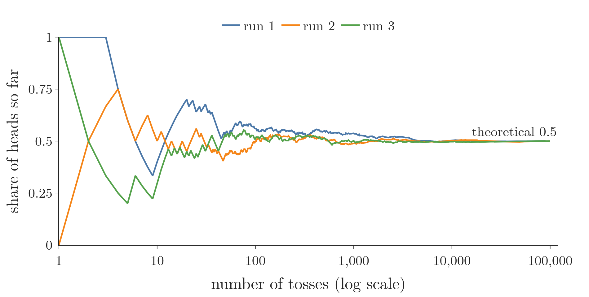

<!-- where-this-fits: generated by course_map/build_map.py; edit concepts.yaml, not this block -->
> **Where this fits:** Pipeline map step 0 (Foundations). See the [Course map](../01-course-map/note.md).
>
> 
>
> - **Builds on:** Events and sample spaces ([Note 330](../330-events-and-types-of-events/note.md)).
<!-- /where-this-fits -->

## 1. Overview

> **Key point:** A probability can be counted from data (empirical) or from the sample space (theoretical); as the number of trials grows, the empirical value settles on the theoretical one.



Figure 1 tosses a fair coin 100,000 times, three separate times, and plots the share of heads after each toss. Early on the share jumps around between 0 and 1. After thousands of tosses all three runs sit on 0.5, the value we get from the sample space $\{H, T\}$ without tossing at all.

These are the two kinds of probability in this Note. The **empirical probability** is the share we observe in data; the **theoretical probability** is the share we work out from the sample space. A last section adds the rules that every probability obeys.

The terms random experiment, trial, outcome, sample space and event are defined in the [random experiments and events Note](../330-events-and-types-of-events/note.md).

## 2. What a probability measures

> **Key point:** A probability is a number from 0 to 1 that measures how likely an event is: 0 means it never happens, 1 means it always happens.

A **probability** is a measure of how likely a particular event is to occur. We write the probability of an event $A$ as $P(A)$. It always lies between 0 and 1:

- $P(A) = 0$: $A$ never happens (the impossible event).
- $P(A) = 1$: $A$ always happens (the sure event).
- $P(A) = 0.5$: $A$ happens half the time, as heads does on a fair coin.

Figure 2 places a few die and coin events on this scale.


Probability is always computed for an event: "getting a head", "rolling a 3", "two heads in two tosses". The next two sections give the two ways of computing it.

## 3. Empirical probability

> **Key point:** Empirical probability is the share of trials in which the event actually happened: count it, then divide by the number of trials.

**Empirical probability** (also called **experimental probability**) is based on observed data rather than on theoretical assumptions. We run the experiment, or look at data from past runs, and count.

1. **In words:** the number of trials in which the event happened, divided by the total number of trials.
2. **Formula:**
   $$P(A) = \frac{\text{number of times } A \text{ occurred}}{\text{total number of trials}}$$
3. **Example:** a coin tossed 100 times landed heads 55 times and tails 45 times:
   $$P(\text{head}) = \frac{55}{100} = 0.55$$

This is the relative frequency of the [frequency tables Note](../223-frequency-tables-and-graphs/note.md), and the estimated PMF of the [PMF Note](../241-pmf-and-discrete-cdf/note.md), read as the probability of an event.

### 3.1 A bag of marbles

> **Key point:** Each colour's empirical probability is its count divided by the 200 draws, whatever the bag holds.

A bag holds 50 marbles: 20 red, 15 blue and 15 green. We draw one marble, note its colour and put it back (**with replacement**), 200 times. Red came up 80 times, blue 70 times and green 50 times.

$$P(\text{red}) = \frac{80}{200} = 0.40, \qquad P(\text{blue}) = \frac{70}{200} = 0.35, \qquad P(\text{green}) = \frac{50}{200} = 0.25$$

Only the draws enter the calculation, not the contents of the bag. Section 4 compares these numbers with what the contents predict.

### 3.2 Titanic passengers

> **Key point:** On a dataset, the empirical probability of a value is its share of the rows.

The Titanic dataset of the [random experiments and events Note](../330-events-and-types-of-events/note.md) has 891 passengers: 216 in class 1, 184 in class 2 and 491 in class 3. For one passenger drawn at random:

$$P(\text{class 1}) = \frac{216}{891} \approx 0.242, \quad P(\text{class 2}) = \frac{184}{891} \approx 0.207, \quad P(\text{class 3}) = \frac{491}{891} \approx 0.551$$

Here there is no formula to fall back on: the data is all we have, so the empirical probability is the probability.

> **Python:** The share of each value in a column.
>
> ```python
> import pandas as pd
>
> df = pd.read_csv("data/titanic_train.csv")
> # share of rows per class: empirical probabilities
> df["Pclass"].value_counts(normalize=True)
> ```
>
> `normalize=True` divides each count by the number of rows (891). The Notebook (`notebook.ipynb`) runs this and every simulation in this Note.

## 4. Theoretical probability

> **Key point:** When every outcome is equally likely, the theoretical probability of an event is its number of outcomes divided by the size of the sample space; no trials are needed.

**Theoretical probability** (also called **classical probability**) is worked out from the sample space instead of from data. It applies when each outcome in the sample space is **equally likely**, as with a fair die: a 3 is as likely as a 2, a 4 or any other face.

1. **In words:** the number of outcomes in the event (the **favourable outcomes**) divided by the number of outcomes in the sample space.
2. **Formula:**
   $$P(A) = \frac{\text{number of favourable outcomes}}{\text{total number of outcomes in the sample space}}$$
3. **Example:** rolling a 3 on a die. Only the outcome 3 is favourable, out of 6:
   $$P(3) = \frac{1}{6} \approx 0.167$$

More events, all by counting:

| Experiment | Event | Favourable outcomes | Outcomes in $S$ | $P$ |
|---|---|---|---|---|
| Toss a coin | head | $\{H\}$ | 2 | $1/2$ |
| Roll a die | a 3 | $\{3\}$ | 6 | $1/6$ |
| Roll a die | less than 3 | $\{1, 2\}$ | 6 | $2/6 = 1/3$ |
| Toss a coin twice | two heads | $\{HH\}$ | 4 | $1/4$ |
| Toss a coin twice | at least one head | $\{HH, HT, TH\}$ | 4 | $3/4$ |

No trial was run for any of these. The probability comes from the structure of the experiment alone.

For the marble bag, each of the 50 marbles is equally likely to be drawn, so the theory gives $20/50 = 0.4$ for red and $15/50 = 0.3$ each for blue and green. The 200 draws of section 3.1 gave:

| Colour | Empirical (200 draws) | Theoretical (bag contents) |
|---|---|---|
| Red | $80/200 = 0.40$ | $20/50 = 0.40$ |
| Blue | $70/200 = 0.35$ | $15/50 = 0.30$ |
| Green | $50/200 = 0.25$ | $15/50 = 0.30$ |

Red matches exactly; blue and green are 0.05 away. With only 200 draws, a gap of this size is normal, as section 5 shows.

> **Extra:** The formula only holds when the outcomes are equally likely, and getting this wrong is a common mistake:
>
> - **Titanic classes:** the sample space $\{1, 2, 3\}$ has three outcomes, but "1 out of 3" gives $P(\text{class 3}) = 0.333$, while the data says 0.551. Classes are not equally likely, so only the empirical value is right.
> - **Sum of two dice:** the sums $2, \dots, 12$ are 11 outcomes, but $P(\text{sum } 7)$ is not $1/11$. The equally likely outcomes are the 36 pairs, and 6 of them give 7, so $P = 6/36$ (see the [random variables and distributions Note](../240-random-variables-and-distributions/note.md), section 3.1).
>
> The fix is to write the sample space as outcomes that really are equally likely (the 36 pairs), and count those.

## 5. From empirical to theoretical

> **Key point:** The more trials we run, the closer the empirical probability gets to the theoretical one; with few trials they can be far apart.

The empirical and theoretical probabilities of the same event are rarely equal after a few trials. As the number of trials grows, the empirical value closes in on the theoretical one. This is the law of large numbers, met in the [PMF Note](../241-pmf-and-discrete-cdf/note.md).

Ten tosses of a fair coin can easily give 3 heads, an empirical probability of 0.3 against the theoretical 0.5. One simulated coin, tossed more and more times:

| Tosses | 10 | 100 | 1,000 | 10,000 | 100,000 |
|---|---|---|---|---|---|
| Empirical $P(\text{head})$ | 0.4 | 0.55 | 0.506 | 0.4918 | 0.5018 |
| Distance from 0.5 | 0.1 | 0.05 | 0.006 | 0.0082 | 0.0018 |

The distance does not shrink at every step (10,000 tosses landed a little further away than 1,000), but the overall trend is clear. Figure 1 shows the same pattern toss by toss in three runs: wild swings at first, a narrow band after 1,000 tosses, and a flat line at 0.5 near 100,000.

A die behaves the same way. In 10 simulated rolls, the face 3 did not appear at all, an empirical $P(3) = 0$. In 100,000 rolls it appeared in a share of 0.1662, against the theoretical $1/6 \approx 0.1667$.

> **Python:** Tossing a coin many times.
>
> ```python
> import numpy as np
>
> rng = np.random.default_rng(42)       # fixed seed
> for n in [10, 100, 1_000, 10_000, 100_000]:
>     tosses = rng.integers(0, 2, n)    # 0 = tail, 1 = head
>     print(n, tosses.mean())
> ```
>
> The mean of 0s and 1s is the share of 1s, so `tosses.mean()` is the empirical probability of a head. The seed makes every run give the numbers in the table above.

### 5.1 Which one to use

> **Key point:** Theoretical probability needs a known sample space of equally likely outcomes; empirical probability needs only data, which is why machine learning estimates most of its probabilities empirically.

- **Theoretical:** when we know the sample space and its outcomes are equally likely (coins, dice, cards). It shows how the event behaves in principle, before any data exists.
- **Empirical:** when the outcomes are not equally likely or the sample space is not fully known, which is the usual case with real data. Statistics and hypothesis testing work with empirical probabilities.

Machine learning works almost entirely from data, so its probabilities are empirical. The class priors in the [Naive Bayes intuition Note](../87-naive-bayes-intuition/note.md), such as 5 wins in 8 matches, are counted from the training rows.

## 6. The rules every probability follows

> **Key point:** Three rules, the axioms, define every probability; from them follow the complement rule $P(\text{not } A) = 1 - P(A)$ and the addition rule $P(A \cup B) = P(A) + P(B) - P(A \cap B)$.

> **Extra:** This whole section is added material: the basic rules that later Notes use without proof.

### 6.1 The axioms of probability

> **Key point:** Probabilities are never negative, the whole sample space has probability 1, and the probabilities of events with no shared outcomes add up.

Every probability, empirical or theoretical, obeys three rules called the **axioms of probability**. Everything else about probability is derived from them.

1. **Non-negative:** $P(A) \ge 0$ for every event $A$.
2. **The sure event has probability 1:** $P(S) = 1$.
3. **Mutually exclusive events add:** if $A$ and $B$ share no outcome, $P(A \cup B) = P(A) + P(B)$. This is the addition rule of the [mutually exclusive events Note](../84-mutually-exclusive-events/note.md).

Two facts follow at once. The impossible event has $P(\varnothing) = 0$, and no probability is above 1. Together these give the 0-to-1 scale of Figure 2.

### 6.2 The complement rule

> **Key point:** The probability that $A$ does not happen is 1 minus the probability that it does.

The **complement** of an event $A$, written $A^c$ (or $\bar{A}$, "not $A$"), is the event made of every outcome in the sample space that is not in $A$. On a die, the complement of "odd" $= \{1, 3, 5\}$ is "even" $= \{2, 4, 6\}$.

$A$ and $A^c$ are mutually exclusive and exhaustive: exactly one of them happens in every trial. So by axioms 2 and 3, $P(A) + P(A^c) = 1$.

1. **In words:** the chance that $A$ does not happen is whatever is left of 1 after the chance that it does.
2. **Formula:**
   $$P(A^c) = 1 - P(A)$$
3. **Example:** the chance of at least one head in two tosses. Its complement is "no heads" $= \{TT\}$, with probability $1/4$:
   $$P(\text{at least one head}) = 1 - P(TT) = 1 - \frac{1}{4} = \frac{3}{4}$$

This matches the count in section 4. The complement is often the shortcut: "at least one" events have many outcomes, while their complement "none" has one.

### 6.3 The general addition rule

> **Key point:** For events that can happen together, adding their probabilities counts the shared outcomes twice, so we subtract the overlap once.

The addition rule of axiom 3 holds only for mutually exclusive events. When $A$ and $B$ share outcomes, $P(A) + P(B)$ is too large.

Take one die, with $A$ = "odd" $= \{1, 3, 5\}$ and $B$ = "greater than 3" $= \{4, 5, 6\}$. Figure 3 shows that 5 belongs to both, so adding $3/6 + 3/6 = 1$ counts it twice. Yet $A \cup B = \{1, 3, 4, 5, 6\}$ misses 2, so its probability must be below 1.


1. **In words:** add the two probabilities, then subtract the probability of the overlap, which was counted twice.
2. **Formula:**
   $$P(A \cup B) = P(A) + P(B) - P(A \cap B)$$
3. **Example:** with $A \cap B = \{5\}$,
   $$P(A \cup B) = \frac{3}{6} + \frac{3}{6} - \frac{1}{6} = \frac{5}{6}$$
   Counting directly: $A \cup B = \{1, 3, 4, 5, 6\}$ has 5 of the 6 outcomes, so $5/6$.

For mutually exclusive events $P(A \cap B) = 0$, and the general rule shrinks back to axiom 3.

## 7. Summary

| | Empirical probability | Theoretical probability |
|---|---|---|
| Also called | Experimental | Classical |
| Computed from | Observed trials or data | The sample space |
| Formula | times $A$ occurred / trials | favourable outcomes / all outcomes |
| Needs | Data | Equally likely outcomes |
| Coin, head | $55/100 = 0.55$ | $1/2$ |
| Changes with more data? | Yes, settles on the theoretical value | No |

| Rule | Formula | Die example |
|---|---|---|
| Complement | $P(A^c) = 1 - P(A)$ | $P(\text{not } 6) = 5/6$ |
| Addition, mutually exclusive | $P(A \cup B) = P(A) + P(B)$ | $P(1 \text{ or } 2) = 2/6$ |
| Addition, general | $P(A \cup B) = P(A) + P(B) - P(A \cap B)$ | $P(\text{odd or} > 3) = 5/6$ |

- A probability lies between 0 (impossible) and 1 (sure).
- Theoretical probability fails when the outcomes are not equally likely; then only data can tell.
- With many trials, the empirical probability approaches the theoretical one; with few, it can be far off.
- Machine learning estimates its probabilities empirically, from the training data.

## 8. Key terms

| Term | Meaning |
|---|---|
| Probability | A number from 0 to 1 measuring how likely an event is; written $P(A)$ |
| Empirical (experimental) probability | The share of trials in which an event happened |
| Theoretical (classical) probability | Favourable outcomes divided by all outcomes, for equally likely outcomes |
| Equally likely outcomes | Outcomes that all have the same probability, such as the faces of a fair die |
| Favourable outcome | An outcome that belongs to the event we are measuring |
| With replacement | Putting each drawn item back before the next draw, so every draw starts from the same set |
| Axioms of probability | The three rules every probability obeys: non-negative, $P(S) = 1$, mutually exclusive events add |
| Complement ($A^c$) | The event that $A$ does not happen: every outcome not in $A$ |
| Complement rule | $P(A^c) = 1 - P(A)$ |
| General addition rule | $P(A \cup B) = P(A) + P(B) - P(A \cap B)$, for any two events |
