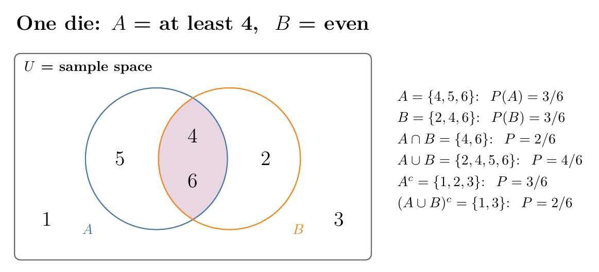

<!-- where-this-fits: generated by course_map/build_map.py; edit concepts.yaml, not this block -->
> **Where this fits:** Pipeline map step 0 (Foundations). See the [Course map](../01-course-map/note.md).
>
> 
>
> - **Builds on:** Events and sample spaces ([Note 330](../330-events-and-types-of-events/note.md)).
> - **Leads to:** Joint and marginal probability ([Note 341](../341-joint-marginal-conditional-probability/note.md)).
<!-- /where-this-fits -->

## 1. Overview

> **Key point:** A Venn diagram draws events as overlapping circles inside the sample space; a contingency table holds the same counts in a grid. Both show at a glance which outcomes two events share.

Figure 1 rolls one die and draws two events: $A$ = "at least 4" and $B$ = "even". Every outcome sits in exactly one region: in $A$ only, in both, in $B$ only, or in neither. Counting the outcomes in a region gives its probability.

This Note covers two ways of showing how events overlap. The Venn diagram is a picture; the contingency table is the same information as a grid of counts. Joint, marginal and conditional probabilities, the subject of the [joint, marginal and conditional probability Note](../341-joint-marginal-conditional-probability/note.md), are all read off these two views.

Sample spaces and events are defined in the [random experiments and events Note](../330-events-and-types-of-events/note.md); the complement and addition rules used here are in the [empirical and theoretical probability Note](../331-empirical-and-theoretical-probability/note.md).

## 2. Venn diagrams

> **Key point:** In a Venn diagram the rectangle is the whole sample space, with probability 1; each event is a circle, and overlaps show shared outcomes.

A **Venn diagram** comes from set theory. A rectangle stands for the **universal set** $U$, everything there is. Each event is drawn as a circle inside it.

### 2.1 The rectangle is the sample space

> **Key point:** In probability, the universal set is the sample space, so $P(U) = 1$.

In probability the universal set is the sample space of the experiment. For one die, the rectangle holds the outcomes 1 to 6.

Every trial gives some outcome inside the rectangle, so the rectangle is the sure event:

$$P(U) = 1$$

### 2.2 One event and its complement

> **Key point:** A circle marks one event; everything in the rectangle outside the circle is its complement.

Take the event $A$ = "a number of at least 4" $= \lbrace4, 5, 6\rbrace$. Its outcomes go inside a circle; 1, 2 and 3 stay outside it, in the rectangle.

- $P(A) = 3/6 = 1/2$: three of the six equally likely outcomes.
- The region outside the circle is the complement $A^c = \lbrace1, 2, 3\rbrace$. Its probability is the whole rectangle minus the circle (the complement rule):

  $$P(A^c) = P(U) - P(A) = 1 - \frac{1}{2} = \frac{1}{2}$$

### 2.3 Two events and their four regions

> **Key point:** Two overlapping circles split the sample space into four regions: $A$ only, both, $B$ only and neither; each union, intersection or complement is a set of these regions.

Add a second event, $B$ = "an even number" $= \lbrace2, 4, 6\rbrace$. The outcomes 4 and 6 belong to both events, so they go in the overlap of the two circles (Figure 1):

| Region | Outcomes | Probability |
|---|---|---|
| $A$ only | 5 | $1/6$ |
| both $A$ and $B$ | 4, 6 | $2/6$ |
| $B$ only | 2 | $1/6$ |
| neither | 1, 3 | $2/6$ |

The four probabilities add up to $6/6 = 1$, because every outcome lies in exactly one region. Figure 2 shades the four events built from these regions.

{height=50%}

Each one is read from the diagram by counting the outcomes in its shaded part:

- **Intersection** $A \cap B$, the overlap: $\lbrace4, 6\rbrace$, so $P(A \cap B) = 2/6$.
- **Union** $A \cup B$, everything inside either circle: $\lbrace2, 4, 5, 6\rbrace$, so $P(A \cup B) = 4/6$.
- **Complement** $A^c$, everything outside circle $A$: $\lbrace1, 2, 3\rbrace$, so $P(A^c) = 3/6$.
- **Neither**, $(A \cup B)^c$, everything outside both circles: $\lbrace1, 3\rbrace$, so $P = 2/6$.

The union can also be found without counting, by the general addition rule from the [empirical and theoretical probability Note](../331-empirical-and-theoretical-probability/note.md). The overlap is inside both circles, so it is subtracted once:

$$P(A \cup B) = P(A) + P(B) - P(A \cap B) = \frac{3}{6} + \frac{3}{6} - \frac{2}{6} = \frac{4}{6}$$

"Neither" is the complement of the union, so it follows from the union:

$$P\big((A \cup B)^c\big) = 1 - P(A \cup B) = 1 - \frac{4}{6} = \frac{2}{6}$$

Both routes agree with the counts in the table above.

> **Extra:** "Neither $A$ nor $B$" can also be built as "not $A$ and not $B$": $A^c \cap B^c = \lbrace1, 2, 3\rbrace\cap \lbrace1, 3, 5\rbrace= \lbrace1, 3\rbrace$. The identity is **De Morgan's law**: $(A \cup B)^c = A^c \cap B^c$. Its twin, $(A \cap B)^c = A^c \cup B^c$, says "not both" means "at least one of them fails". In Figure 2, the right panel is exactly the region outside both circles.

> **Extra:** A Venn diagram shows overlap, not independence. Mutually exclusive events (see the [mutually exclusive events Note](../84-mutually-exclusive-events/note.md)) are circles that do not touch. Whether two overlapping events are independent needs a calculation: here $P(A) \cdot P(B) = \frac{1}{2} \cdot \frac{1}{2} = \frac{1}{4}$, but $P(A \cap B) = \frac{2}{6} = \frac{1}{3}$. The two differ, so $A$ and $B$ are dependent (see the [independent events Note](../83-independent-events/note.md)): knowing the roll is even makes "at least 4" more likely, $2/3$ instead of $1/2$.

## 3. Contingency tables

> **Key point:** A contingency table puts the categories of one event in the rows and of the other in the columns; each inner cell counts the outcomes in one Venn region, and the totals count whole circles.

A contingency table (also called a crosstab, see the [bivariate and multivariate analysis Note](../21-bivariate-multivariate-analysis/note.md)) counts every pair of categories of two categorical **features** (a feature is a variable, one column of the data table). Applied to two events, it holds the same information as the Venn diagram, arranged as a grid.

### 3.1 The die as a table

> **Key point:** Two yes/no events give a 2 by 2 table; its four inner cells are the four Venn regions.

For the die, the rows ask "is the number at least 4?" and the columns ask "is it even?". Each cell counts the outcomes that answer both questions that way:

| | even | odd | total |
|---|---|---|---|
| at least 4 | 2 (4, 6) | 1 (5) | 3 |
| below 4 | 1 (2) | 2 (1, 3) | 3 |
| total | 3 | 3 | 6 |

Each inner cell matches one region of Figure 1: "at least 4 and even" is the overlap, "below 4 and odd" is the outside. The row totals count circle $A$ and its complement; the column totals count circle $B$ and its complement.

Each yes/no question works like a random variable with two values, 1 for yes and 0 for no (see the [random variables as functions Note](../332-expected-value-and-variance/note.md)). The table lists every combination of the two.

### 3.2 A class of 100 students

> **Key point:** When counts come from data, the table is filled from the facts given; the cell nobody mentions is what is left of the total.

A class has 100 students. 40 chose only Bio as their major, 30 chose only Maths, and 10 chose both. How many chose neither?

The table makes the missing count easy to find. The "neither" cell is whatever remains of the 100:

$$100 - 30 - 40 - 10 = 20$$

Figure 3 shows the counts both ways.

Reading the table:

- **Inner cells:** 10 took both, 30 Maths only, 40 Bio only, 20 neither.
- **Row totals:** 40 took Maths (10 + 30), 60 did not.
- **Column totals:** 50 took Bio (10 + 40), 50 did not.
- **Grand total:** 100, the whole class.

The row and column totals are written in the margins of the table. They return in the joint, marginal and conditional probability Note as marginal counts.

### 3.3 From counts to probabilities

> **Key point:** Dividing every cell by the grand total turns the table into probabilities for one randomly chosen student.

Pick one student at random. Dividing each count by 100 gives the probability of each cell and each total:

| | Bio | not Bio | total |
|---|---|---|---|
| Maths | 0.10 | 0.30 | 0.40 |
| not Maths | 0.40 | 0.20 | 0.60 |
| total | 0.50 | 0.50 | 1.00 |

Now every probability from section 2 can be read from the table:

- $P(\text{Maths} \cap \text{Bio}) = 0.10$, one inner cell.
- $P(\text{Maths}) = 0.40$, a row total.
- $P(\text{Maths} \cup \text{Bio}) = 0.40 + 0.50 - 0.10 = 0.80$, the general addition rule.
- $P(\text{neither}) = 0.20 = 1 - 0.80$, the complement of the union.

## 4. Switching between the two views

> **Key point:** Venn regions and table cells are the same sets of outcomes, so either view can be rebuilt from the other.

The Venn diagram and the contingency table carry exactly the same information:

| Venn diagram | Contingency table |
|---|---|
| rectangle $U$ | grand total |
| overlap of the circles | cell (yes, yes) |
| part of $A$ outside $B$ | cell ($A$ yes, $B$ no) |
| part of $B$ outside $A$ | cell ($A$ no, $B$ yes) |
| outside both circles | cell (no, no) |
| whole circle $A$ | row total for $A$ yes |
| whole circle $B$ | column total for $B$ yes |

Each view suits different work:

- A **Venn diagram** shows how events overlap at a glance, and makes unions, complements and De Morgan's law easy to see.
- A **contingency table** scales to real data with many **observations** (records, one row of the data table each) and more than two categories, such as three passenger classes. pandas builds it in one call, which the [joint, marginal and conditional probability Note](../341-joint-marginal-conditional-probability/note.md) uses on the Titanic data.

## 5. Summary

| Event | Venn region | Die ($A$: at least 4, $B$: even) | Students (Maths, Bio) |
|---|---|---|---|
| $A \cap B$ | overlap | $\lbrace4, 6\rbrace$, $2/6$ | 0.10 |
| $A \cup B$ | inside either circle | $\lbrace2, 4, 5, 6\rbrace$, $4/6$ | 0.80 |
| $A^c$ | outside circle $A$ | $\lbrace1, 2, 3\rbrace$, $3/6$ | 0.60 |
| $(A \cup B)^c$ | outside both | $\lbrace1, 3\rbrace$, $2/6$ | 0.20 |
| $U$ | whole rectangle | $\lbrace1, \dots, 6\rbrace$, 1 | 1 |

- The rectangle is the sample space; its probability is 1.
- Two events split the sample space into four regions, whose probabilities add to 1.
- A contingency table holds the same four regions as cells, and the circles as row and column totals.
- Dividing a table of counts by its grand total turns it into a table of probabilities.

## 6. Sources

**Built from**

- CampusX, "Mastering Probability for ML: Joint | Marginal | Conditional Probability and Bayes' Theorem", YouTube, https://www.youtube.com/watch?v=ndHDsvqmbuI

## 7. Key terms

| Term | Meaning |
|---|---|
| Venn diagram | A picture of events as circles inside a rectangle; overlaps show shared outcomes |
| Universal set ($U$) | The rectangle of a Venn diagram; in probability, the sample space, with $P(U) = 1$ |
| De Morgan's law | $(A \cup B)^c = A^c \cap B^c$ and $(A \cap B)^c = A^c \cup B^c$ |
| Row and column totals | The sums in the margins of a contingency table; each counts one whole event |
| Grand total | The sum of every cell of a contingency table: the size of the whole sample |
