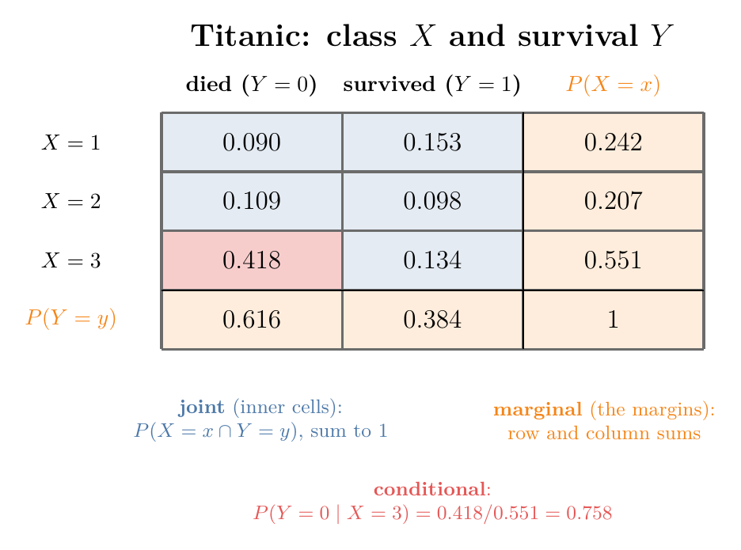
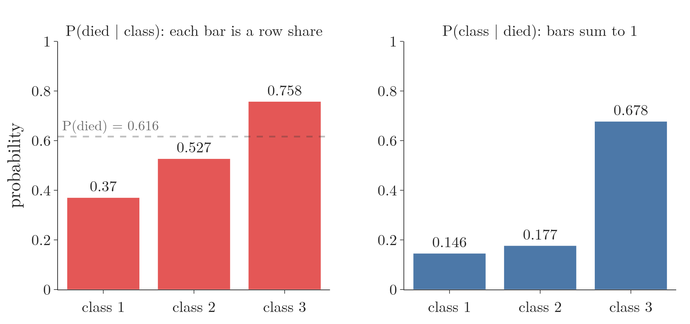

<!-- where-this-fits: generated by course_map/build_map.py; edit concepts.yaml, not this block -->
> **Where this fits:** Pipeline map step 0 (Foundations). See the [Course map](../01-course-map/note.md).
>
> 
>
> - **Builds on:** Events and sample spaces ([Note 330](../330-events-and-types-of-events/note.md)); Venn diagrams and contingency tables ([Note 340](../340-venn-diagrams-and-contingency-tables/note.md)).
<!-- /where-this-fits -->

## 1. Overview

> **Key point:** One contingency table of probabilities holds three kinds of probability: joint (the inner cells), marginal (the row and column sums in the margins) and conditional (a cell divided by its row or column sum).

{height=45%}

Figure 1 is the Titanic data as a table of probabilities. The class of a passenger is the random variable $X$ (1, 2 or 3); survival is $Y$ (0 = died, 1 = survived). The blue inner cells are joint probabilities, the orange margins are marginal probabilities, and dividing a cell by its margin gives a conditional probability.

This Note reads all three from the table, works more conditional probability problems by counting, revisits independent, dependent and mutually exclusive events in formulas, and ends with Bayes' theorem as a tiny classifier.

Contingency tables and Venn diagrams are introduced in the [Venn diagrams and contingency tables Note](../340-venn-diagrams-and-contingency-tables/note.md). Conditional probability is defined in the [conditional probability Note](../82-conditional-probability/note.md).

## 2. Joint probability

> **Key point:** A joint probability is the probability that two things happen together: $P(X = x, Y = y)$, the same as $P(A \cap B)$ for events.

The joint probability is defined in the [Bayes problem Note](../86-bayes-problem/note.md) as the probability that two events happen together, $P(A \cap B)$. With random variables, which machine learning uses more, it is written:

$$P(X = x, Y = y)$$

It reads "the probability that $X$ takes the value $x$ **and** $Y$ takes the value $y$ at the same time". The comma means "and", the same as $\cap$.

### 2.1 Joint probabilities from the Titanic table

> **Key point:** Divide each count of the contingency table by the total number of rows; each cell becomes a joint probability.

The class-by-survival contingency table of the 891 Titanic passengers (built in the [bivariate and multivariate analysis Note](../21-bivariate-multivariate-analysis/note.md)) gives the counts:

| | died ($Y = 0$) | survived ($Y = 1$) |
|---|---|---|
| class 1 ($X = 1$) | 80 | 136 |
| class 2 ($X = 2$) | 97 | 87 |
| class 3 ($X = 3$) | 372 | 119 |

Each count is a number of passengers, not a probability. Dividing by the 891 passengers turns it into one.

1. **In words:** the joint probability of a cell is the number of rows in that cell divided by the total number of rows.
2. **Formula:**
   $$P(X = x, Y = y) = \frac{\text{count of rows with } X = x \text{ and } Y = y}{\text{total number of rows}}$$
3. **Example:** a passenger who was in first class **and** died:
   $$P(X = 1, Y = 0) = \frac{80}{891} \approx 0.090$$
   In third class and died: $372 / 891 \approx 0.418$.

### 2.2 The joint probability distribution

> **Key point:** The joint probabilities of every combination of values form the joint probability distribution; together they add up to 1.

Doing this for all six cells gives the blue part of Figure 1:

| | died ($Y = 0$) | survived ($Y = 1$) |
|---|---|---|
| class 1 | 0.090 | 0.153 |
| class 2 | 0.109 | 0.098 |
| class 3 | 0.418 | 0.134 |

One cell is **a** joint probability. The whole table, every combination of $X$ and $Y$ with its probability, is the **joint probability distribution** of $X$ and $Y$.

It is the two-variable version of a probability distribution (see the [random variables and distributions Note](../240-random-variables-and-distributions/note.md)): every possible outcome, now a pair $(x, y)$, with its probability. Because the six pairs cover every passenger exactly once, the six probabilities add up to 1.

> **Python:** Joint probabilities with pandas.
>
> ```python
> import pandas as pd
>
> df = pd.read_csv("data/titanic_train.csv")
> # every cell divided by the 891 rows
> pd.crosstab(df["Pclass"], df["Survived"],
>             normalize="all")
> ```
>
> Without `normalize`, `pd.crosstab` returns the counts; `normalize="all"` divides every cell by the grand total. The Notebook (`notebook.ipynb`) runs every table in this Note.

## 3. Marginal probability

> **Key point:** A marginal probability is the probability of one variable's value whatever the other variable does; it is the row or column sum of the joint table, written in its margin.

**Marginal probability** is the probability of an event occurring irrespective of the outcome of some other event. It is also called **simple probability** or **unconditional probability**, because no condition is placed on the other event.

For random variables, the marginal probability of $X = x$ is the probability that $X$ takes the value $x$, regardless of the value of $Y$.

### 3.1 Reading the margins

> **Key point:** Add a row of the joint table to get a marginal probability of $X$; add a column to get one of $Y$.

Add totals to the count table:

| | died | survived | total |
|---|---|---|---|
| class 1 | 80 | 136 | 216 |
| class 2 | 97 | 87 | 184 |
| class 3 | 372 | 119 | 491 |
| total | 549 | 342 | 891 |

- 549 passengers died, whatever their class; 342 survived.
- 216 travelled in class 1, whether they died or survived; 184 in class 2; 491 in class 3.

The row totals add to 891, and so do the column totals. These totals sit in the **margins** of the table, which gives marginal probability its name. Dividing them by 891 gives the orange cells of Figure 1.

1. **In words:** the marginal probability of a value of $Y$ is the sum of the joint probabilities in its column, over every value of $X$ (and the same with rows for $X$).
2. **Formula:**
   $$P(Y = y) = \sum_{x} P(X = x, Y = y)$$
3. **Example:** the probability that a passenger died, whatever their class:
   $$P(Y = 0) = 0.0898 + 0.1089 + 0.4175 = 0.6162$$
   which is $549 / 891$. About 62% of the passengers died.

Adding up over the other variable to get rid of it is called **marginalising** (or summing it out). It is the total probability rule of the [Bayes problem Note](../86-bayes-problem/note.md), applied to a table.

### 3.2 Marginal probability distributions

> **Key point:** All the marginal probabilities of one variable form its marginal distribution, which sums to 1.

Taking the margins for every value gives one distribution per variable:

| Marginal distribution of $Y$ | $Y = 0$ | $Y = 1$ | sum |
|---|---|---|---|
| $P(Y = y)$ | 0.616 | 0.384 | 1 |

| Marginal distribution of $X$ | $X = 1$ | $X = 2$ | $X = 3$ | sum |
|---|---|---|---|---|
| $P(X = x)$ | 0.242 | 0.207 | 0.551 | 1 |

Each is the **marginal probability distribution** of its variable: the ordinary distribution of $X$ (or $Y$) alone, read from the joint table. The marginal distribution of $X$ is exactly the empirical class probabilities of the [empirical and theoretical probability Note](../331-empirical-and-theoretical-probability/note.md).

> **Python:** Joint and marginal probabilities together.
>
> ```python
> pd.crosstab(df["Pclass"], df["Survived"],
>             normalize="all", margins=True)
> ```
>
> `margins=True` adds an `All` row and column holding the sums: the marginal probabilities. With `normalize="all"` as well, the table is Figure 1.

## 4. Conditional probability

> **Key point:** A conditional probability $P(A \mid B)$ is the probability of $A$ once $B$ is known to have happened: reduce the sample space to $B$ and count $A$ inside it, or divide the joint probability by the marginal probability of $B$.

Conditional probability is taught in the [conditional probability Note](../82-conditional-probability/note.md): $P(A \mid B)$, "the probability of $A$ given $B$", is the probability of $A$ once $B$ has already happened. That Note gives two ways to compute it:

- **By counting:** shrink the sample space to the outcomes of $B$ (the **reduced sample space**), then take the share of them that are also in $A$.
- **By formula:** $P(A \mid B) = P(A \cap B) / P(B)$.

The formula is a definition, not a result derived from something else: since $B$ happened, $B$ becomes the whole world, and we ask what share of it is also $A$. This section adds more problems for the counting method, then reads conditional probabilities from the Titanic table.

### 4.1 Three coins

> **Key point:** Of the 7 outcomes with at least one head, 4 have at least two heads, so the answer is $4/7$.

Three fair coins are tossed. What is the probability of at least two heads, given at least one head?

Write the sample space first. Three tosses give $2^3 = 8$ equally likely outcomes:
$$HHH, \; HHT, \; HTH, \; THH, \; HTT, \; THT, \; TTH, \; TTT$$

The two events:

- $A$ = "at least two heads"
- $B$ = "at least one head", which is given.

1. **Reduce to $B$.** Only $TTT$ has no head, so it drops out. The reduced sample space has 7 outcomes.
2. **Count $A$ inside it.** $HHH$, $HHT$, $HTH$ and $THH$ have at least two heads: 4 outcomes.
3. **Divide:**
   $$P(A \mid B) = \frac{4}{7} \approx 0.571$$

The formula gives the same: $P(A \cap B) = 4/8$ (every outcome of $A$ is also in $B$) and $P(B) = 7/8$, so $\frac{4/8}{7/8} = \frac{4}{7}$. Without the condition, $P(A) = 4/8 = 0.5$: knowing there is at least one head raises the chance of two.

### 4.2 Two dice, two questions

> **Key point:** Sum 7 given an odd first die: 3 of 18 outcomes, $1/6$. First die 2 given a sum of at most 5: 3 of 10 outcomes, $3/10$.

Two fair dice give 36 equally likely pairs. Figure 2 marks two conditional probabilities on the grid of sums: blue cells are the reduced sample space $B$, red cells are the outcomes of $A$ inside it.

{height=45%}

**The sum is 7, given that die 1 shows an odd number** (Figure 2, left).

1. **Reduce to $B$:** die 1 shows 1, 3 or 5, three full rows of 6, so 18 outcomes.
2. **Count $A$ inside it:** the sum is 7 for $(1, 6)$, $(3, 4)$ and $(5, 2)$: 3 outcomes.
3. **Divide:**
   $$P(\text{sum } 7 \mid \text{die 1 odd}) = \frac{3}{18} = \frac{1}{6}$$

**Die 1 shows 2, given that the sum is at most 5** (Figure 2, right).

1. **Reduce to $B$:** the pairs with sum 2, 3, 4 or 5 number $1 + 2 + 3 + 4 = 10$.
2. **Count $A$ inside it:** die 1 is 2 in $(2, 1)$, $(2, 2)$ and $(2, 3)$: 3 outcomes.
3. **Divide:**
   $$P(\text{die 1} = 2 \mid \text{sum} \le 5) = \frac{3}{10}$$

In the first problem the condition changed nothing: $P(\text{sum } 7) = 6/36 = 1/6$ as well. In the second it did: $P(\text{die 1} = 2) = 1/6 \approx 0.167$, but given a small sum it rises to 0.3, because a small sum rules out the large faces.

### 4.3 Conditional probabilities from the Titanic table

> **Key point:** $P(\text{died} \mid \text{class 3}) = 0.418 / 0.551 \approx 0.758$: the joint probability divided by the marginal probability of the condition.

On data with 891 rows we do not list outcomes by hand. The formula does the work, and every piece of it is already in Figure 1:

1. **In words:** the conditional probability is the joint probability divided by the marginal probability of the condition.
2. **Formula:**
   $$P(Y = y \mid X = x) = \frac{P(X = x, Y = y)}{P(X = x)}$$
3. **Example:** the probability that a third-class passenger died. The joint probability is the red cell, the marginal is its row total:
   $$P(Y = 0 \mid X = 3) = \frac{0.4175}{0.5511} \approx 0.758$$
   In counts the 891s cancel: $372 / 491 \approx 0.758$.

The same for every class:

| Class | Joint $P(X = x, Y = 0)$ | Marginal $P(X = x)$ | $P(\text{died} \mid \text{class})$ |
|---|---|---|---|
| 1 | $80/891 = 0.090$ | $216/891 = 0.242$ | $80/216 = 0.370$ |
| 2 | $97/891 = 0.109$ | $184/891 = 0.207$ | $97/184 = 0.527$ |
| 3 | $372/891 = 0.418$ | $491/891 = 0.551$ | $372/491 = 0.758$ |

About 76% of third-class passengers died, against 53% in second class and 37% in first. Figure 3 (left) draws these against the marginal $P(\text{died}) = 0.616$: class 3 lies above it and classes 1 and 2 below.

Cutting the probabilities short before dividing gives a wrong answer for class 1: $0.08 / 0.23 \approx 0.35$ instead of 0.370. Dividing the counts, $80/216$, avoids the error.

### 4.4 The other direction

> **Key point:** $P(\text{class 3} \mid \text{died}) \approx 0.678$ is a different question from $P(\text{died} \mid \text{class 3}) \approx 0.758$: the condition sets which total we divide by.

Swapping the roles asks: of the passengers who died, what share were in third class? Now the condition is $Y = 0$, so we divide by the column total:
$$P(X = 3 \mid Y = 0) = \frac{372}{549} \approx 0.678$$

Of all who died, 67.8% were in third class, 17.7% in second and 14.6% in first. These three add up to 1, because every passenger who died was in one of the classes.



Figure 3 shows the two directions side by side. The left bars do not add up to 1: each is a share of a different row. The right bars do: they split one column. As in the [conditional probability Note](../82-conditional-probability/note.md), $P(A \mid B)$ and $P(B \mid A)$ answer different questions.

> **Python:** Conditional probabilities with pandas.
>
> ```python
> # each row divided by its row total: P(Survived | Pclass)
> pd.crosstab(df["Pclass"], df["Survived"],
>             normalize="index")
> # each column divided by its column total: P(Pclass | Survived)
> pd.crosstab(df["Pclass"], df["Survived"],
>             normalize="columns")
> ```
>
> `normalize="index"` makes every row sum to 1; `normalize="columns"` makes every column sum to 1. The variable we divide along is the one we condition on. Which option gives which conditional depends on which variable is in the rows.

| `pd.crosstab` option | Divides by | Gives |
|---|---|---|
| none | nothing | counts |
| `normalize="all"` | grand total | joint probabilities |
| `margins=True` (with `"all"`) | grand total, plus sums | joint and marginal probabilities |
| `normalize="index"` | each row total | $P(\text{column} \mid \text{row})$ |
| `normalize="columns"` | each column total | $P(\text{row} \mid \text{column})$ |

## 5. Independent, dependent and mutually exclusive events in formulas

> **Key point:** Independent: $P(A \mid B) = P(A)$ and $P(A \cap B) = P(A)\,P(B)$. Dependent: $P(A \mid B) \ne P(A)$. Mutually exclusive: $P(A \cap B) = 0$, so $P(A \mid B) = 0$.

The three relations between two events were described in words in the [random experiments and events Note](../330-events-and-types-of-events/note.md). In terms of joint, marginal and conditional probability:

| Relation | Conditional | Joint | Taught in |
|---|---|---|---|
| Independent | $P(A \mid B) = P(A)$ | $P(A \cap B) = P(A)\,P(B)$ | [independent events Note](../83-independent-events/note.md) |
| Dependent | $P(A \mid B) \ne P(A)$ | $P(A \cap B) = P(A \mid B)\,P(B)$ | [conditional probability Note](../82-conditional-probability/note.md) |
| Mutually exclusive | $P(A \mid B) = 0$ | $P(A \cap B) = 0$ | [mutually exclusive events Note](../84-mutually-exclusive-events/note.md) |

For independent events the conditional probability equals the marginal one; the joint probability is the product of the marginals. The general rule $P(A \cap B) = P(A \mid B)\,P(B)$ holds for every pair of events; independence is the special case $P(A \mid B) = P(A)$.

Mutually exclusive events have no outcome in common: their **intersection** is empty, $P(A \cap B) = 0$. (The union is not empty: it holds the outcomes of both events.) Heads and tails on one toss, or odd and even on one die, are mutually exclusive.

### 5.1 Drawing two aces

> **Key point:** With replacement the second draw is $4/52$ again (independent); without replacement and after an ace, it is $3/51$ (dependent).

A pack has 52 cards, 4 of them aces. The first card is an ace with probability $4/52$.

- **With replacement:** the ace goes back, the pack is full again, and the second card is an ace with probability $4/52$. The first draw changes nothing: independent.
- **Without replacement:** if the first card was an ace, 51 cards and 3 aces remain, so the second is an ace with probability $3/51 \approx 0.059$. If the first was not an ace, 4 aces remain among 51: $4/51 \approx 0.078$. The first draw changes the second: dependent.

### 5.2 Are class and survival independent?

> **Key point:** $P(\text{died} \mid \text{class 3}) = 0.758$ differs from $P(\text{died}) = 0.616$, so class and survival are dependent.

The Titanic table answers this with either test:

- **Conditional test:** $P(\text{died} \mid \text{class 3}) = 0.758$, but $P(\text{died}) = 0.616$. Knowing the class changes the chance.
- **Joint test:** if they were independent, $P(\text{died}, \text{class 1})$ would be $0.616 \times 0.242 \approx 0.149$. The table says $0.090$.

Both tests fail, so class and survival are dependent. This is why class is a useful input for predicting survival.

## 6. Bayes' theorem as a one-column classifier

> **Key point:** To predict whether a new male passenger died, Bayes' theorem turns $P(\text{male} \mid \text{died})$, which the data gives directly, into $P(\text{died} \mid \text{male})$, which we want.

Bayes' theorem, its four named parts (posterior, likelihood, prior, evidence) and its two-line proof from the conditional probability formula are in the [Bayes' theorem Note](../85-bayes-theorem/note.md):
$$P(A \mid B) = \frac{P(B \mid A)\, P(A)}{P(B)}$$

Here we use it once on a tiny dataset, to see how it predicts. Five passengers:

| Passenger | Sex | Died |
|---|---|---|
| 1 | male | yes |
| 2 | male | yes |
| 3 | female | yes |
| 4 | male | no |
| 5 | female | no |

A new passenger is male. Did he die? We compare $P(\text{died} \mid \text{male})$ with $P(\text{survived} \mid \text{male})$ and predict the larger.

The three pieces each come from the data:

- **Prior** $P(\text{died}) = 3/5$: three of the five died. $P(\text{survived}) = 2/5$.
- **Evidence** $P(\text{male}) = 3/5$: three of the five are male.
- **Likelihood** $P(\text{male} \mid \text{died}) = 2/3$: reduce to the three who died; two are male. $P(\text{male} \mid \text{survived}) = 1/2$: of the two survivors, one is male.

Bayes' theorem:
$$P(\text{died} \mid \text{male}) = \frac{P(\text{male} \mid \text{died})\, P(\text{died})}{P(\text{male})} = \frac{\frac{2}{3} \cdot \frac{3}{5}}{\frac{3}{5}} = \frac{2}{3}$$
$$P(\text{survived} \mid \text{male}) = \frac{P(\text{male} \mid \text{survived})\, P(\text{survived})}{P(\text{male})} = \frac{\frac{1}{2} \cdot \frac{2}{5}}{\frac{3}{5}} = \frac{1}{3}$$

Since $2/3 > 1/3$, we predict that the male passenger died. The two answers add up to 1, as they must.

With one input column we could have counted directly: of the three males, two died, $2/3$. Bayes' theorem matters once there are many input columns and the exact combination may never appear in the data. That is the Naive Bayes classifier of the [Naive Bayes intuition Note](../87-naive-bayes-intuition/note.md).

## 7. Summary

| Kind | Question | Formula | Titanic example |
|---|---|---|---|
| Joint | both together? | $P(X = x, Y = y)$ | $P(\text{class 3, died}) = 0.418$ |
| Marginal | one, whatever the other? | $P(Y = y) = \sum_x P(X = x, Y = y)$ | $P(\text{died}) = 0.616$ |
| Conditional | one, given the other? | $P(X = x, Y = y) \,/\, P(X = x)$ | $P(\text{died} \mid \text{class 3}) = 0.758$ |

- The joint probabilities of every combination form the joint distribution; they sum to 1.
- Marginal probabilities are the row and column sums of the joint table; each marginal distribution sums to 1.
- A conditional probability divides a joint probability by the marginal of the condition; reversing the condition changes the answer.
- By counting: reduce the sample space to the condition, then count the event inside it.
- Independent events have $P(A \mid B) = P(A)$; class and survival on the Titanic are dependent.

## 8. Key terms

| Term | Meaning |
|---|---|
| $P(X = x, Y = y)$ | The joint probability that $X$ takes the value $x$ and $Y$ the value $y$ together |
| Joint probability distribution | The joint probabilities of every combination of values of two variables; they sum to 1 |
| Marginal (simple, unconditional) probability | The probability of one variable's value whatever the other variable does |
| Margins | The row and column totals of a contingency table, where marginal probabilities are read |
| Marginal probability distribution | All the marginal probabilities of one variable, read from a joint table |
| Marginalising | Summing a joint distribution over one variable to remove it |
| `normalize` (`pd.crosstab`) | Turns counts into probabilities: `"all"` joint, `"index"` per row, `"columns"` per column |
