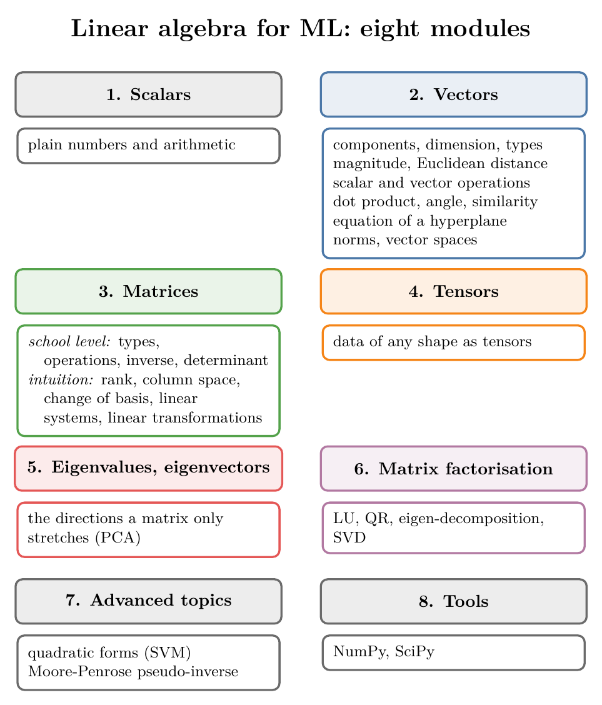

<!-- where-this-fits: generated by course_map/build_map.py; edit concepts.yaml, not this block -->
> **Where this fits:** Pipeline map step 0 (Foundations). See the [Course map](../01-course-map/note.md).
>
> 
>
<!-- /where-this-fits -->

## 1. Overview

> **Key point:** Linear algebra for ML splits into eight modules: scalars, vectors, matrices, tensors, eigenvalues and eigenvectors, matrix factorisation, advanced topics, and tools.

{height=62%}

Figure 1 shows the whole map. This Note says what each module covers, why ML needs it, which topics can wait, and where each topic is taught.

## 2. Why ML needs linear algebra

> **Key point:** Statistics and linear algebra are the two pillars of ML: statistics is how we see the data, linear algebra does the heavy lifting.

The first pillar, statistics, has its own [roadmap Note](../210-statistics-roadmap/note.md). If statistics is the eyes of an ML engineer, linear algebra is the hands and feet: it stores the data and does every calculation on it.

Why ML needs it (high dimensions, data as numbers, GPU speed) is explained in section 3 of the [vectors and feature vectors Note](../360-vectors-and-feature-vectors/note.md).

## 3. How to read the roadmap

> **Key point:** Each topic is marked by importance, and topics needed only by a few algorithms are marked "later".

The roadmap marks every topic in three ways:

- **Importance.** A *very important* topic appears almost everywhere in ML and DL; an *important* topic appears in several places; a *normal* topic is still worth learning.
- **"Later".** A few specialised topics are needed only by particular algorithms. We can skip them now and learn them when we reach that algorithm. Most of them sit in the last modules.
- **Why it matters.** Every topic comes with a one-line description and where ML and DL use it. For example, vectors represent data points in ML, and features, weights and biases in DL.

Everything not marked "later" is worth covering in one go before moving deep into ML and DL.

## 4. The eight modules

> **Key point:** Vectors and matrices are the core; tensors, eigenvectors and factorisations build on them; a few advanced topics wait until an algorithm needs them.

### 4.1 Scalars

> **Key point:** A scalar is a plain number.

Scalars are ordinary numbers such as 2, 5 or -6, and the arithmetic on them. The [tensors Note](../11-tensors/note.md) places them as 0D tensors. They need no separate study.

### 4.2 Vectors

> **Key point:** Vectors are where linear algebra starts, and where ML data starts: every row of a dataset is a vector.

This module tries to cover everything about vectors that ML uses:

| Topic | Why ML needs it | Where it is taught |
|---|---|---|
| What vectors are, components, dimension | every data point is a vector | [Vectors and feature vectors Note](../360-vectors-and-feature-vectors/note.md) |
| Types of vectors (row, column, ...) | data and parameters are written as rows or columns | [Vectors and feature vectors Note](../360-vectors-and-feature-vectors/note.md) |
| Distance from origin (magnitude) | the length of a vector | [Magnitude, distance and scalar operations Note](../361-magnitude-distance-and-scalar-operations/note.md) |
| Euclidean distance | KNN, K-means, recommender systems | [KNN imputer Note](../39-knn-imputer/note.md), [magnitude Note](../361-magnitude-distance-and-scalar-operations/note.md) |
| Operations with a scalar | shifting and scaling data, mean centring | [Magnitude, distance and scalar operations Note](../361-magnitude-distance-and-scalar-operations/note.md) |
| Operations between two vectors, dot product | similarity, projection, matrix multiplication | [Dot product and cosine similarity Note](../362-dot-product-and-cosine-similarity/note.md) |
| Equation of a line in n dimensions | linear models: linear and logistic regression, SVM | [Equation of a hyperplane Note](../363-equation-of-a-hyperplane/note.md) |
| Vector norms | regularisation | norm in the [SVM maths Note](../93-svm-maths/note.md); penalties in the [Ridge](../63-ridge-regression-intuition/note.md) and [Lasso](../67-lasso-regression/note.md) Notes |
| Vector spaces | the setting for everything above | a later maths Note |

### 4.3 Matrices

> **Key point:** Matrices come in two parts: the school-level mechanics, then the intuition of what a matrix does.

The first part is the mechanics taught in school mathematics (classes 11 and 12): what matrices are, types of matrices, operations with a scalar and with a vector, the inverse and the determinant.

The second part is conceptual: the rank of a matrix, column space, change of basis, solving a system of linear equations, linear transformations, and the dot product seen as the engine of matrix multiplication. **Linear transformations** are marked very important.

So far, the inverse appears in the [normal equation](../54-multiple-lr-maths/note.md) of linear regression, and the idea of a matrix as a transformation in the [PCA step by step Note](../48-pca-step-by-step/note.md) (section 4.1). The rest of this module comes in a later maths Note.

### 4.4 Tensors

> **Key point:** Tensors are super important for deep learning, and for representing any kind of data.

What a tensor is, and how tables, text, images and videos become tensors, is taught in the [tensors Note](../11-tensors/note.md).

### 4.5 Eigenvalues and eigenvectors

> **Key point:** Eigenvectors are the directions a matrix only stretches; PCA is built on them.

Anyone who has studied PCA has met eigenvalues and eigenvectors. They are taught in the [PCA step by step Note](../48-pca-step-by-step/note.md) (section 4), and in more depth in a later maths Note.

### 4.6 Matrix factorisation

> **Key point:** Factorising a matrix splits it into simpler matrices; LU, QR, eigen-decomposition and SVD are the ones ML meets.

**Matrix factorisation** (or **decomposition**) writes one matrix as a product of simpler ones. Four techniques are marked important: LU decomposition, QR decomposition, eigen-decomposition and SVD (singular value decomposition). Eigen-decomposition appears in the [PCA step by step Note](../48-pca-step-by-step/note.md); the others come in a later maths Note.

> **Extra:** Where these show up. scikit-learn's Ridge can solve its equation with SVD (`solver="svd"`, see the [Ridge gradient descent Note](../65-ridge-gradient-descent/note.md)). Least-squares problems can be solved through a QR factorisation (Trefethen and Bau, *Numerical Linear Algebra*, 1997, Lecture 11, Algorithm 11.2), and recommender systems use SVD-like factorisations of the user-item rating matrix to predict missing ratings (Koren, Bell and Volinsky, "Matrix factorization techniques for recommender systems", *IEEE Computer* 42(8), 2009, 30–37).

### 4.7 Advanced topics

> **Key point:** Quadratic forms and the pseudo-inverse are needed only by particular algorithms, so they can wait.

- **Quadratic forms** are used heavily when solving SVMs (see the [SVM maths Note](../93-svm-maths/note.md)).
- The **Moore-Penrose pseudo-inverse** gives an inverse for matrices that are not square, or that have no ordinary inverse. The [multiple linear regression maths Note](../54-multiple-lr-maths/note.md) mentions why libraries need it.

Both come in a later maths Note.

### 4.8 Tools and libraries

> **Key point:** NumPy is how linear algebra is done in Python; SciPy adds more.

All linear algebra in the ML and DL world runs through **NumPy**, so a strong command of it pays off everywhere. **SciPy**, built on NumPy, adds more routines; it is used less, but we should know it exists.

> **Python:** NumPy's linear algebra lives in `np.linalg`.
>
> ```python
> import numpy as np
>
> v = np.array([3, 4])
> np.linalg.norm(v)              # 5.0: length of v
> A = np.array([[2, 1], [1, 3]])
> np.linalg.inv(A)               # inverse of A
> np.linalg.eig(A)               # eigenvalues, eigenvectors
> ```

## 5. Resources

> **Key point:** 3Blue1Brown's series for intuition, Gilbert Strang for depth, and chapter 2 of the *Deep Learning* book as a summary.

**Video lectures:**

- **3Blue1Brown, *Essence of Linear Algebra*.** The best lecture series on the subject. The videos are very dense, so watch each one more than once.
- **Gilbert Strang's MIT lectures on linear algebra.** About 35 lectures by a renowned professor. It covers far more than ML needs, but it is the place for depth.

**Books:**

- **Gilbert Strang, *Introduction to Linear Algebra*.** The book behind his lectures.
- **NCERT mathematics textbooks (classes 11 and 12).** Light on intuition, but they cover the school-level topics well.
- **Goodfellow, Bengio and Courville, *Deep Learning*, chapter 2.** A compact summary of all the linear algebra deep learning needs; worth reading twice.

**Online courses:**

- **Khan Academy, Linear Algebra.**
- **Coursera, Mathematics for Machine Learning: Linear Algebra** (Imperial College London).

The vectors Notes that follow this one cover the first module in depth; the rest of the matrix and eigen topics come in later maths Notes.

> **Extra:** One more free book worth knowing: *Mathematics for Machine Learning* by Deisenroth, Faisal and Ong (mml-book.github.io). Its chapters 2 to 4 (Linear Algebra, Analytic Geometry, Matrix Decompositions) cover the vectors, matrices, eigenvalues and factorisations of this roadmap, including SVD in section 4.5.

## 6. Summary

| Module | What it covers | Status |
|---|---|---|
| Scalars | plain numbers | no study needed |
| Vectors | components, distance, operations, dot product, hyperplanes, norms | core |
| Matrices | mechanics, then rank, spaces, linear transformations | core |
| Tensors | data of any shape | core for DL |
| Eigenvalues and eigenvectors | directions a matrix only stretches | needed for PCA |
| Matrix factorisation | LU, QR, eigen-decomposition, SVD | important |
| Advanced topics | quadratic forms, pseudo-inverse | later |
| Tools | NumPy, SciPy | throughout |

- Statistics and linear algebra are the two pillars of ML and DL.
- Learn the unmarked topics in one go; leave the "later" topics until an algorithm needs them.
- For every topic, know where ML uses it.

## 7. Key terms

| Term | Meaning |
|---|---|
| Matrix factorisation (decomposition) | Writing a matrix as a product of simpler matrices |
| SVD (singular value decomposition) | A factorisation that works for any matrix, square or not |
| Quadratic form | An expression like $x^{\mathsf T}Ax$: a sum of squared and cross terms of a vector's components |
| Moore-Penrose pseudo-inverse | A generalised inverse for matrices that are not square or have no inverse |
| NumPy | Python's library for arrays and linear algebra |
| SciPy | A library built on NumPy with more scientific routines |
