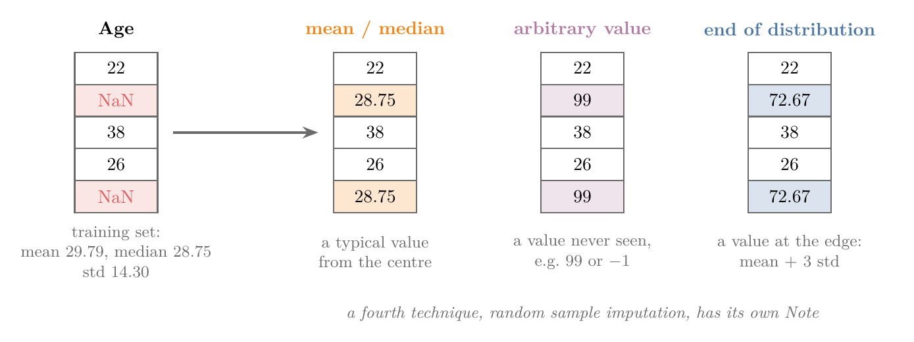
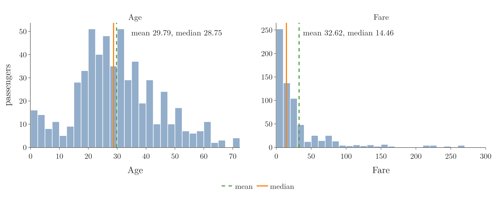
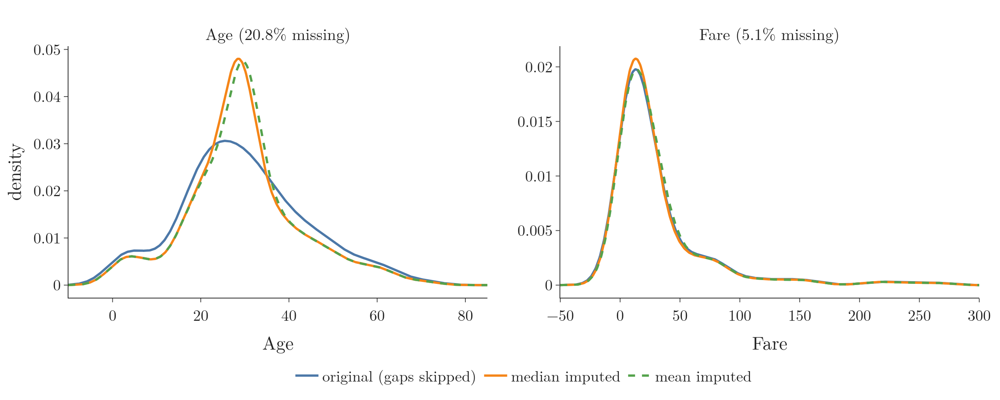
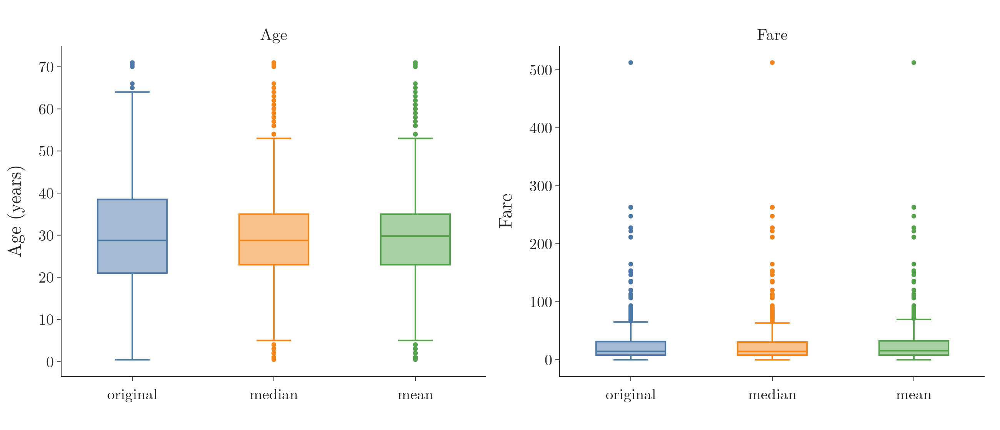
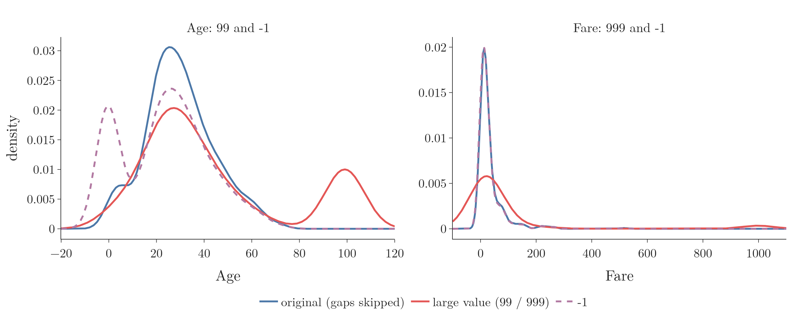
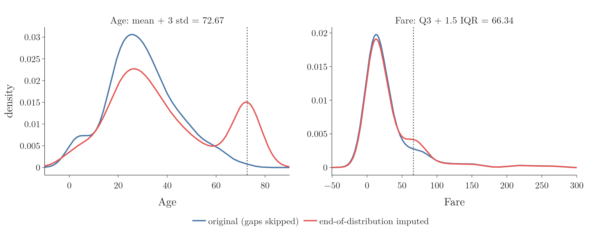

<!-- where-this-fits: generated by course_map/build_map.py; edit concepts.yaml, not this block -->
> **Where this fits:** Pipeline map step 4 (Clean). See the [Course map](../01-course-map/note.md).
>
> 
>
> - **Builds on:** Poor-quality data ([Note 9](../09-mldlc/note.md)); Train-test split ([Note 13](../13-toy-project/note.md)).
> - **Leads to:** Missing indicator ([Note 38](../38-missing-indicator-random-sample/note.md)); Random sample imputation ([Note 38](../38-missing-indicator-random-sample/note.md)); Grid and random search ([Note 38](../38-missing-indicator-random-sample/note.md)); KNN imputer ([Note 39](../39-knn-imputer/note.md)); Iterative imputation (MICE) ([Note 40](../40-iterative-imputer-mice/note.md)); XGBoost ([Note 123](../123-xgboost-intro/note.md)).
> - **Compare with:** Outliers ([Note 23](../23-what-is-feature-engineering/note.md)); Complete case analysis ([Note 35](../35-complete-case-analysis/note.md)); Random sample imputation ([Note 38](../38-missing-indicator-random-sample/note.md)); KNN imputer ([Note 39](../39-knn-imputer/note.md)).
<!-- /where-this-fits -->

## 1. Overview

> **Key point:** We fill each gap in a numerical column with one number taken from the same column: its mean or median, an arbitrary value, or a value at the end of its distribution.

Note 35 mapped the ways of handling missing data. This Note covers univariate imputation of numerical features. A **feature** is an input variable (one column of the data table), the **target** is the output we predict, and an **observation** is one record (one row). In univariate imputation, each gap in a feature is filled using only the other values of that same feature.

Figure 1 shows the three techniques on a small `Age` column with two gaps:

- **Mean or median imputation** fills each gap with a typical value from the centre of the column.
- **Arbitrary value imputation** fills each gap with a value that never occurs, such as 99 or $-1$.
- **End of distribution imputation** fills each gap with a value at the edge of the column's distribution.



A fourth univariate technique, random sample imputation, has its own Note, together with a way to pick the best technique automatically. scikit-learn's `SimpleImputer` does all three techniques of this Note.

After every imputation we check what it did to the column. We compare four things before and after: the variance, the distribution, the covariance and correlation with other columns, and the outliers.

## 2. Mean and median imputation

> **Key point:** Mean or median imputation replaces every missing value with the mean or the median of the known values of the column.

**Mean imputation** replaces each missing value with the mean of the column. **Median imputation** replaces it with the median. Both are computed from the values that are present.

### 2.1 Mean or median

> **Key point:** Use the mean when the column is roughly normal (symmetric), and the median when it is skewed.

For a normal distribution, the mean, median and mode are all equal, so either choice gives the same value. For a skewed distribution, the long tail pulls the mean towards it, away from the bulk of the data. The median stays in the middle of the data, so it is the better choice there.

Figure 2 shows both cases on the Titanic training data of Section 3. `Age` is close to symmetric: its mean (29.79) and median (28.75) almost coincide. `Fare` is strongly right-skewed: a few very expensive tickets pull the mean up to 32.62, more than twice the median of 14.46.

{width=100%}

### 2.2 Advantages

> **Key point:** Mean or median imputation is simple to compute and simple to repeat on new data in production.

1. **Simple.** We compute one number per column and put it into every gap.
2. **Easy to use in production.** The deployed model receives new observations that may have gaps. We store the mean or median from training and fill the new gaps with it.

Mean or median imputation gives reasonable results when few values are missing, under about 5% of the feature. With more missing values the method becomes less reliable.

### 2.3 Disadvantages

> **Key point:** Mean or median imputation piles values at the centre, which changes the distribution's shape, creates outliers, and weakens the feature's relationships with other features.

1. **The shape of the distribution changes.** Every gap gets the same value, so a tall spike appears at the centre.
2. **Outliers appear.** With many values at the centre, the middle half of the data becomes narrower. Values that were normal before now fall outside the whiskers of a box plot and count as outliers.
3. **The covariance and correlation with other features change.** The filled values ignore the other features, so the feature's relationship with them weakens.

All three are bad for a model. Section 3 shows each of them on real data.

### 2.4 When to use it

> **Key point:** Use mean or median imputation when the data is missing completely at random and each column is missing under about 5% of its values.

The two conditions are the same as for complete case analysis (Note 35):

1. **The data is MCAR** (missing completely at random).
2. **Under about 5% of the column is missing.**

Mean and median imputation is used widely because it is so simple. Better techniques exist, so in practice we try several and keep the one that works best.

## 3. Mean and median imputation on real data

> **Key point:** On the Titanic data, mean or median imputation leaves `Fare` (5% missing) almost unchanged but distorts `Age` (21% missing).

### 3.1 The data and the split

> **Key point:** We split into training and test sets first, and compute every fill value from the training set only.

The data has 891 Titanic passengers, one observation each, and four numerical columns: three features, `Age`, `Fare` and `Family`, and the target `Survived`. `Family` is the number of siblings, spouses, parents and children aboard.

`Age` has 177 missing values (19.9%). `Fare` originally had none; 45 values (5.1%) were deleted at random so that it has some. `Family` and `Survived` are complete.

We split the data 80/20: 712 training rows and 179 test rows. In the training set, 20.8% of `Age` and 5.1% of `Fare` is missing.

> **Python:** Split first, then compute the fill values on the training set.
>
> ```python
> X_train, X_test, y_train, y_test = train_test_split(
>     X, y, test_size=0.2, random_state=2)
> X_train = X_train.copy()
> median_age = X_train["Age"].median()   # 28.75
> mean_age = X_train["Age"].mean()       # 29.79
> X_train["Age_median"] = X_train["Age"].fillna(median_age)
> X_train["Age_mean"] = X_train["Age"].fillna(mean_age)
> ```
>
> **`fillna(value)`** returns the column with every `NaN` replaced by `value`. We keep the original column next to the filled ones to compare them. `copy()` makes `X_train` an independent table, so adding columns gives no `SettingWithCopyWarning`.

The same is done for `Fare`, with median 14.46 and mean 32.62. The test set is filled later with these same training values.

> **Extra:** Computing the mean on the whole table before the split lets the test rows influence the fill value. The test set would then no longer be truly unseen data. Letting test rows shape the fill value is called **data leakage**, and the rule is always: fit on the training set, apply to both sets (scikit-learn docs, Data leakage).

### 3.2 Variance shrinks

> **Key point:** Mean or median imputation always lowers the variance, and the more values are missing, the more it drops.

The variance measures the average squared distance from the mean. Every filled value sits at or near the mean, so it adds almost nothing to that distance, and the variance falls. An everyday picture: fill every blank in a class's height list with the average height, and the class suddenly looks more alike than it really is.

| Column | Original | Median imputed | Mean imputed |
|---|---|---|---|
| `Age` (20.8% missing) | 204.35 | 161.99 | 161.81 |
| `Fare` (5.1% missing) | 2,448.20 | 2,340.09 | 2,324.24 |

`Age` lost about a fifth of its variance; `Fare` lost only about 5%. A small change is acceptable; a large one is a warning sign.

> **Extra:** For mean imputation we can predict the new variance exactly.
>
> 1. **In words:** the filled values add no squared distance, so the same sum of squared distances is now divided by the larger count.
> 2. **Formula:** with $k$ known values out of $n$ rows,
>    $$s^2_{\text{after}} = s^2_{\text{before}} \times \frac{k - 1}{n - 1}$$
> 3. **Example:** `Age` has $k = 564$ known values out of $n = 712$:
>    $$204.35 \times \frac{563}{711} = 161.81,$$
>    exactly the value in the table.

### 3.3 The distribution changes shape

> **Key point:** For `Age`, a tall peak appears at the fill value; for `Fare`, the curves before and after lie on top of each other.

Figure 3 draws the density curve (KDE, Note 20) of each column before and after imputation. Blue is the original column with its gaps skipped; orange is median imputed; green dashed is mean imputed.

{width=100%}

For `Age`, the peak grows from about 0.03 to about 0.05, and the curve becomes narrower and taller. The 148 filled values all sit at 28.75 or 29.79. For `Fare`, the three curves almost overlap, because only 36 values were filled.

### 3.4 Covariance and correlation change

> **Key point:** A filled value ignores the other features, so imputing `Age` weakens its link with them: its correlation with `Family` falls by about a fifth.

**Covariance** measures how two features move together: positive if they rise together, negative if one rises as the other falls. Its size depends on the units, so it has no fixed limits. **Correlation** is the covariance rescaled to lie between $-1$ and $1$.

| Covariance with | `Fare` | `Family` |
|---|---|---|
| `Age` original | 70.72 | $-6.50$ |
| `Age` median imputed | 57.96 | $-5.11$ |
| `Age` mean imputed | 55.60 | $-5.15$ |

| Correlation with | `Fare` | `Family` |
|---|---|---|
| `Age` original | 0.093 | $-0.299$ |
| `Age` median imputed | 0.092 | $-0.243$ |
| `Age` mean imputed | 0.088 | $-0.245$ |

The relationship with `Family` weakened by about a fifth. For `Fare`, the covariance with `Family` only moved from 17.26 to 16.48 (median) and 16.39 (mean).

> **Python:** The whole covariance or correlation table in one call.
>
> ```python
> X_train.cov()
> X_train.corr()
> ```
>
> Both skip missing values pair by pair (pandas docs, DataFrame.cov). The "original" numbers therefore use only the rows where both columns are known.

### 3.5 New outliers appear

> **Key point:** Imputing `Age` narrows its box, and the number of outliers jumps from 7 to 69.

Figure 4 shows box plots before and after. A box plot draws the middle half of the data as a box, from the first quartile (Q1) to the third (Q3). Points more than 1.5 box-lengths beyond the box are outliers (Note 20).

{width=100%}

For `Age`, the box was 21 to 38.25. After imputation it is 23 to 35, because so many values now sit at the centre. Passengers aged 54 or 4, normal before, are now outliers on both sides.

For `Fare`, the box hardly moves. The count of outliers goes from 93 to 94 (median) and 84 (mean).

### 3.6 The verdict

> **Key point:** Mean imputation is fine for `Fare`; for `Age`, we should look for a better technique.

| Check | `Age` | `Fare` |
|---|---|---|
| Variance | falls by a fifth | falls by about 5% |
| Distribution | tall new peak | unchanged |
| Covariance, correlation | weakened | almost unchanged |
| Outliers | 7 become 69 | unchanged |

`Fare` shows no warning signs, so mean (or median) imputation is a reasonable choice. `Age` fails every check, which matches Section 2.4: about 21% of it is missing, far above 5%.

## 4. Imputation with scikit-learn's SimpleImputer

> **Key point:** `SimpleImputer` learns the fill value with `fit` on the training set and fills gaps with `transform`; inside a `ColumnTransformer`, each column can get its own strategy.

pandas `fillna` is easy, but scikit-learn's `SimpleImputer` is the better tool for real projects. `SimpleImputer` can go into a pipeline (a later Note), can be tuned with grid search, and its learned values are saved with the model for production.

### 4.1 The main parameters

> **Key point:** `strategy` picks the fill value; `fill_value` sets it when the strategy is `"constant"`.

| Parameter | Meaning | Default |
|---|---|---|
| `missing_values` | what counts as missing | `np.nan` |
| `strategy` | `"mean"`, `"median"`, `"most_frequent"` or `"constant"` | `"mean"` |
| `fill_value` | the value used with `"constant"` | 0 for numbers |
| `add_indicator` | also add a 0/1 column marking each gap | `False` |
| `keep_empty_features` | keep a column that is missing everywhere | `False` |

`"most_frequent"` fills with the mode, used mainly for categorical columns (next Note). `"constant"` is used for arbitrary value and end of distribution imputation (Sections 5 and 6).

> **Extra:** `add_indicator=True` adds the **missing indicator** of Note 35, covered in its own Note. Since scikit-learn 1.5, `strategy` may also be a function, such as `np.nanmax`. A column with no values at all is dropped with a warning when the strategy is not `"constant"`, unless `keep_empty_features=True`, which keeps it filled with 0 (scikit-learn docs, SimpleImputer).

### 4.2 A different strategy per column

> **Key point:** A `ColumnTransformer` applies the median to `Age`, the mean to `Fare`, and passes `Family` through unchanged.

> **Python:** Two imputers, one per column.
>
> ```python
> trf = ColumnTransformer([
>     ("imputer1", SimpleImputer(strategy="median"), ["Age"]),
>     ("imputer2", SimpleImputer(strategy="mean"), ["Fare"]),
> ], remainder="passthrough", verbose_feature_names_out=False)
> trf.set_output(transform="pandas")
> trf.fit(X_train)
> X_train = trf.transform(X_train)
> X_test = trf.transform(X_test)
> ```
>
> The other columns pass through unchanged, because of `remainder="passthrough"`. **`set_output(transform="pandas")`** makes `transform` return a DataFrame with column names instead of a bare numpy array.

After `fit`, each imputer stores its learned value in **`statistics_`**:

```python
trf.named_transformers_["imputer1"].statistics_  # [28.75]
trf.named_transformers_["imputer2"].statistics_  # [32.6176]
```

These two numbers are the training median of `Age` and the training mean of `Fare`. `transform` puts the same 28.75 and 32.62 into the gaps of the training set *and* the test set.

## 5. Arbitrary value imputation

> **Key point:** Fill every gap with one value that never occurs in the column, so the model can tell missing rows apart from the rest.

**Arbitrary value imputation** replaces every missing value with one fixed value chosen by us, such as 99, 999 or $-1$. The value must not occur in the real data. For `Age`, no passenger is 99 or $-1$ years old.

The aim is the opposite of mean imputation. Instead of hiding the gaps, we mark them, so the model can learn whether "missing" itself carries information.

The technique is used mostly for categorical features, where gaps become a new category such as "Missing" (next Note). Arbitrary value imputation works the same way for numbers.

### 5.1 Advantages, disadvantages and when to use it

> **Key point:** Arbitrary value imputation is easy, but it distorts the distribution, variance and covariance; use it when the data is not missing at random.

- **Advantage:** very easy to apply.
- **Disadvantages:** the same three as mean imputation, usually worse. A spike appears at the arbitrary value, so the distribution (its density curve, or PDF) changes; the variance changes, often grows a lot; the covariance and correlation with other features change.
- **When to use it:** when the data is *not* missing completely at random. Then the fact that a value is missing may itself tell the model something.

The distortion is accepted on purpose: it is what makes the missing rows stand out. In practice the technique is not used much, because better ones exist.

### 5.2 On real data

> **Key point:** Filling `Age` with 99 multiplies its variance by 4.7; filling `Fare` with 999 multiplies it by 19.

We fill `Age` with 99 and with $-1$, and `Fare` with 999 and with $-1$, each into a new column.

| Column | Original | Large value (99 / 999) | $-1$ |
|---|---|---|---|
| `Age` variance | 204.35 | 951.73 | 318.09 |
| `Fare` variance | 2,448.20 | 47,219.20 | 2,378.57 |

Figure 5 shows the distributions. For `Age`, each fill value creates a second hump: at 99 (red) or at $-1$ (purple dashed), and the main peak drops. For `Fare`, 999 flattens the curve; $-1$ sits next to the many cheap tickets, so its curve almost matches the original.

{width=100%}

The relationships change too. The covariance of `Age` with `Fare` goes from 70.72 to $-101.67$ with 99, and to 125.56 with $-1$. The correlation of `Fare` with `Family` falls from 0.208 to 0.032 with 999.

> **Python:** Arbitrary value imputation with `SimpleImputer`.
>
> ```python
> trf = ColumnTransformer([
>     ("imputer1", SimpleImputer(strategy="constant",
>                                fill_value=99), ["Age"]),
>     ("imputer2", SimpleImputer(strategy="constant",
>                                fill_value=999), ["Fare"]),
> ], remainder="passthrough")
> ```
>
> With `strategy="constant"`, `statistics_` simply holds the chosen values, 99 and 999.

## 6. End of distribution imputation

> **Key point:** Instead of guessing an arbitrary value, take one from the far end of the column's own distribution.

Choosing a good arbitrary value is hard: it must be outside the data, but how far? **End of distribution imputation** answers this by filling the gaps with a value at the end of the column's distribution. The technique is an extension of arbitrary value imputation, and the two share the same aim: mark the missing rows for the model.

How we find the end depends on the shape of the column.

### 6.1 Normal columns: mean plus three standard deviations

> **Key point:** If the column is roughly normal, use the mean plus (or minus) three standard deviations.

In a normal distribution, about 68% of the values lie within one standard deviation $\sigma$ of the mean, 95% within two, and 99.7% within three. A value beyond three standard deviations is therefore at the very end of the distribution.

The fill value, step by step:

1. **In words:** start at the mean and move three standard deviations to the right (or the left).
2. **Formula:**
   $$\text{fill} = \mu + 3\sigma \quad\text{or}\quad \mu - 3\sigma$$
3. **Example:** the training `Age` has mean 29.79 and standard deviation 14.30:
   $$29.79 + 3 \times 14.30 = 72.67.$$
   The left end, $29.79 - 3 \times 14.30 = -13.10$, is an impossible age, so we use the right end.

### 6.2 Skewed columns: the IQR rule

> **Key point:** If the column is skewed, use Q3 plus 1.5 times the IQR (or Q1 minus 1.5 times the IQR).

The fill value sits on a box-plot fence, 1.5 IQR beyond the box, as in the [univariate analysis Note](../20-univariate-analysis/note.md) (section 8.1, whiskers and outliers). Values past a fence count as outliers, so a fill there stands out.

The fill value, step by step:

1. **In words:** start at the third quartile and move 1.5 box-lengths to the right (or start at Q1 and move left).
2. **Formula:**
   $$\text{fill} = Q_3 + 1.5 \times \text{IQR} \quad\text{or}\quad Q_1 - 1.5 \times \text{IQR}$$
3. **Example:** the training `Fare` has $Q_1 = 7.90$ and $Q_3 = 31.28$, so $\text{IQR} = 23.38$ and
   $$31.28 + 1.5 \times 23.38 = 66.34.$$
   The left end, $7.90 - 35.07 = -27.17$, is an impossible fare, so we use the right end.

> **Extra:** The library Feature-engine uses $Q_3 + 3 \times \text{IQR}$ by default when its IQR rule is chosen, to land further out (Feature-engine docs, EndTailImputer). Both versions follow the same idea.

### 6.3 On real data

> **Key point:** The end values create a hump at the edge of the distribution and change the variance, just as arbitrary values do.

Figure 6 fills `Age` with 72.67 and `Fare` with 66.34. For `Age`, 148 values land at the far right, creating a second hump there, and the variance rises from 204.35 to 465.07. For `Fare`, the 36 filled values make only a small bump, and the variance moves from 2,448.20 to 2,378.92.

{width=100%}

> **Python:** No new tool is needed: compute the end value on the training set and pass it as `fill_value`.
>
> ```python
> age_end = X_train["Age"].mean() + 3 * X_train["Age"].std()
> SimpleImputer(strategy="constant", fill_value=age_end)
> ```

### 6.4 Advantages, disadvantages and when to use it

> **Key point:** The same as arbitrary value imputation: easy, but it changes the distribution, variance and covariance; use it when the data is not missing at random.

- **Advantage:** easy to apply, and the value comes from the data instead of a guess.
- **Disadvantages:** the distribution changes, the covariance changes, and the variance can grow.
- **When to use it:** when the data is not missing completely at random, to show the model that a value was missing.

## 7. Summary

| Technique | Fills each gap with | `strategy` | Use when |
|---|---|---|---|
| Mean imputation | mean of the column | `"mean"` | MCAR, under 5% missing, roughly normal |
| Median imputation | median of the column | `"median"` | MCAR, under 5% missing, skewed |
| Arbitrary value | a value that never occurs (99, $-1$) | `"constant"`, fill 99 | not MCAR: missing itself is informative |
| End of distribution | $\mu + 3\sigma$, or $Q_3 + 1.5\thinspace \text{IQR}$ | `"constant"`, fill the end value | not MCAR, and no obvious arbitrary value |

- Univariate imputation fills a column's gaps using only that column.
- Mean and median imputation hide the gaps at the centre; arbitrary value and end of distribution imputation mark them at the edges.
- Every technique here changes the column. After imputing, compare the variance, the distribution (KDE), the covariance and correlation, and the outliers (box plot), before and after.
- On the Titanic data, mean imputation was fine for `Fare` (5% missing) but distorted `Age` (21% missing): variance down a fifth, outliers from 7 to 69.
- Always compute the fill value on the training set with `fit`, then `transform` both the training and the test set.
- `ColumnTransformer` lets each column use its own imputer. Its `set_output` method can make the result a DataFrame.

## 8. Sources

- scikit-learn User Guide, *Common pitfalls and recommended practices*, section "Data leakage".
- scikit-learn API reference, `SimpleImputer`.
- pandas API reference, `DataFrame.cov` and `DataFrame.corr`.
- Feature-engine API reference, `EndTailImputer` (parameter `fold`).

## 9. Key terms

| Term | Meaning |
|---|---|
| Mean imputation | Filling every gap with the mean of the column's known values |
| Median imputation | Filling every gap with the median of the column's known values; better for skewed columns |
| Arbitrary value imputation | Filling every gap with one fixed value that never occurs, such as 99 or $-1$ |
| End of distribution imputation | Filling every gap with a value at the edge of the distribution: $\mu \pm 3\sigma$ or $Q_3 + 1.5\thinspace \text{IQR}$ |
| Feature | An input variable: one column of the data table |
| Target | The output we predict |
| Observation | One record: one row of the data table |
| Covariance | How two features move together; positive if they rise together, no fixed limits |

| Correlation | Covariance rescaled to lie between $-1$ and $1$ |
| `strategy` | The `SimpleImputer` parameter choosing the fill rule: mean, median, most_frequent or constant |
| `fill_value` | The value `SimpleImputer` uses with `strategy="constant"` |
| `statistics_` | The fill values a fitted `SimpleImputer` has learned, one per column |
| `fillna` | The pandas method that replaces every `NaN` with a given value |
