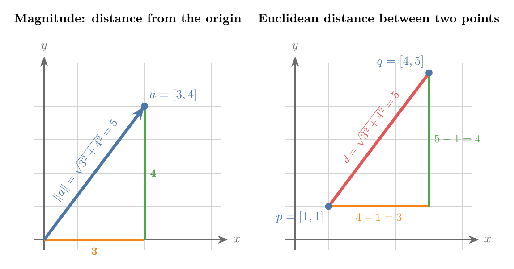
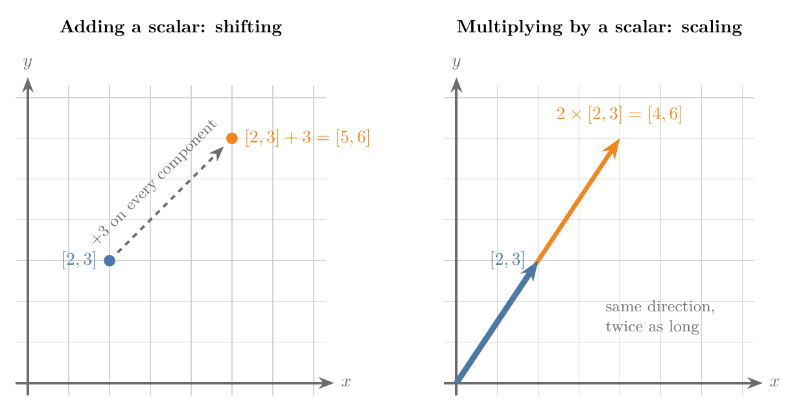

<!-- where-this-fits: generated by course_map/build_map.py; edit concepts.yaml, not this block -->
> **Where this fits:** Pipeline map step 0 (Foundations). See the [Course map](../01-course-map/note.md).
>
> 
>
> - **Builds on:** Vectors and feature vectors ([Note 360](../360-vectors-and-feature-vectors/note.md)).
> - **Leads to:** Regularisation ([Note 1026](../1026-regularization-in-dl/note.md)).
> - **Compare with:** Cosine similarity ([Note 362](../362-dot-product-and-cosine-similarity/note.md)).
<!-- /where-this-fits -->

## 1. Overview

> **Key point:** Pythagoras' theorem gives both the length of a vector and the distance between two vectors, in any number of dimensions; adding or multiplying by a scalar shifts or scales a vector.



Figure 1 shows the two measurements this Note builds on. The length of $[3, 4]$ and the distance from $[1, 1]$ to $[4, 5]$ are both 5, and both come from the same right triangle. This Note works each one out in 2D, 3D and $n$ dimensions, shows where ML uses them, and then turns to the simplest operation on a vector, adding a scalar, and its main use in ML: mean centring.

Vectors, components and dimensions are defined in the [vectors and feature vectors Note](../360-vectors-and-feature-vectors/note.md).

## 2. Magnitude: the distance from the origin

> **Key point:** The magnitude of a vector is the square root of the sum of its squared components; the same formula works in every dimension.

The **magnitude** of a vector is its distance from the origin: the length of the arrow from its tail to its head. It is also called the length or the norm of the vector (the name used in the [SVM maths Note](../93-svm-maths/note.md)), and written $\lVert x \rVert$.

### 2.1 In 2D and 3D

> **Key point:** In 2D the two components are the legs of a right triangle, so Pythagoras gives the length.

In Figure 1 (left), the vector $a = [3, 4]$ forms a right triangle with the x-axis: one leg is 3 long, the other 4. The arrow is the hypotenuse, so by Pythagoras' theorem its length is $\sqrt{3^2 + 4^2} = 5$. For a general 2D vector $[a, b]$ the length is $\sqrt{a^2 + b^2}$.

The same logic holds in 3D. A vector $[a, b, c]$ has length $\sqrt{a^2 + b^2 + c^2}$: the square root of the sum of the squares of all its components.

### 2.2 In n dimensions

> **Key point:** Square every component, add, take the square root.

1. **In words:** square every component, add the squares, and take the square root.
2. **Formula:** for $x = [x_1, x_2, \dots, x_n]$,
   $$\lVert x \rVert = \sqrt{x_1^2 + x_2^2 + \dots + x_n^2} = \sqrt{\sum_{i=1}^{n} x_i^2}$$
3. **Example:** for the 3D vector $[2, 3, 6]$,
   $$\lVert x \rVert = \sqrt{4 + 9 + 36} = \sqrt{49} = 7$$
   and for the 5D vector $[1, 2, 3, 4, 5]$,
   $$\lVert x \rVert = \sqrt{1 + 4 + 9 + 16 + 25} = \sqrt{55} \approx 7.42$$

> **Python:** NumPy computes the magnitude of a vector of any dimension with one function.
>
> ```python
> import numpy as np
>
> v = np.array([1, 2, 3, 4, 5])
> np.linalg.norm(v)    # 7.416...
> ```
>
> `np.linalg` is NumPy's linear algebra module. The same call works unchanged for a 15-dimensional or a 500-dimensional vector.

> **Extra:** This is one norm among several. It is the **L2 norm**; adding the absolute values instead, $\lvert x_1 \rvert + \dots + \lvert x_n \rvert$, gives the **L1 norm**. Ridge regression penalises the squared L2 norm of the coefficients and Lasso their L1 norm (see the [Ridge](../63-ridge-regression-intuition/note.md) and [Lasso](../67-lasso-regression/note.md) Notes), which is why the roadmap lists vector norms under regularisation.

## 3. Euclidean distance

> **Key point:** The Euclidean distance between two vectors is the magnitude of their difference: subtract component by component, then take the norm.

The Euclidean distance, the straight-line distance between two points, is defined in the [KNN imputer Note](../39-knn-imputer/note.md) (section 4.1). Here we see how it links to the magnitude.

### 3.1 Distance as the norm of the difference

> **Key point:** Subtract the two vectors, then take the magnitude of the result.

In Figure 1 (right) the legs of the triangle, 3 and 4, are the components of the difference vector $q - p = [4, 5] - [1, 1] = [3, 4]$. The distance is the hypotenuse, which is exactly the magnitude of that vector:
$$d(p, q) = \lVert p - q \rVert$$

The squared differences in the distance formula are the squared components of $p - q$. So for $p = [6, 7, 8, 9, 10]$ and $q = [1, 2, 3, 4, 5]$ the difference is $[5, 5, 5, 5, 5]$ and the distance is $\sqrt{5 \times 5^2} = \sqrt{125} \approx 11.18$.

> **Python:** The distance is two steps: subtract, then `norm`.
>
> ```python
> p = np.array([6, 7, 8, 9, 10])
> q = np.array([1, 2, 3, 4, 5])
> np.linalg.norm(p - q)    # 11.18...
> ```
>
> This works for vectors of any dimension, as long as both have the same number of components.

### 3.2 Distance in ML: the nearest neighbour

> **Key point:** Many algorithms decide by distance: a new point gets the class of the vectors nearest to it.

A lot of ML algorithms compute Euclidean distances inside. The clearest example is [K-nearest neighbours](../91-knn/note.md) (KNN), a classification algorithm. To classify a new iris flower from its sepal length and petal length, it treats the flower as a vector, computes its distance to every flower in the data, and gives it the species of the nearest ones.

{height=45%}

Figure 2 runs this on five 3D vectors in two classes. The query vector $[1, 1, 1]$ is 1.00 from $[1, 2, 1]$ and at least 2.83 from all others. Its nearest neighbour is in class 0, so the query is classed 0.

The same distance appears in [K-means clustering](../128-kmeans-intuition/note.md), which groups points around their nearest centre, and in recommender systems, as in the [vectors and feature vectors Note](../360-vectors-and-feature-vectors/note.md) (section 6.3).

## 4. Operations with a scalar

> **Key point:** A scalar operation applies the same number to every component; adding or subtracting a scalar shifts the vector.

A vector and a scalar can be combined in two ways: by adding (or subtracting, which works the same way) and by multiplying (or dividing). In both, the scalar is applied to every component in turn.

### 4.1 Adding or subtracting a scalar: shifting

> **Key point:** Adding a scalar adds it to every component, which moves the point; this is called shifting.

1. **In words:** add the scalar to every component of the vector.
2. **Formula:** for $v = [v_1, v_2, \dots, v_n]$ and a scalar $s$,
   $$v + s = [v_1 + s,\ v_2 + s,\ \dots,\ v_n + s]$$
3. **Example:**
   $$[2, 2] + 5 = [7, 7], \qquad [2, 3] + 3 = [5, 6]$$

Subtraction works the same way, with $s$ subtracted from every component: $[2, 3] - 1 = [1, 2]$.



Changing every component moves the point to a new place in the coordinate system (Figure 3, left). So adding or subtracting a scalar is called **shifting**.

> **Extra:** Strictly, adding a scalar to a vector is not an operation of linear algebra; a vector space has only two operations, adding two vectors and multiplying a vector by a scalar (Deisenroth, Faisal and Ong, *Mathematics for Machine Learning*, 2020, Definition 2.9). NumPy allows it through **broadcasting**: in the words of the NumPy user guide ("Broadcasting"), the scalar is "stretched" into an array of the same shape, here the vector $[s, s, \dots, s]$, and that is added. So $[2, 3] + 3$ is really $[2, 3] + [3, 3]$.

## 5. Mean centring: shifting in ML

> **Key point:** Mean centring is a scalar subtraction on vectors: each column minus its own mean.

Mean centring, the first half of standardization (see the [standardization Note](../24-standardization/note.md), section 5), slides the cloud of points until its mean sits at the origin, without changing its shape. As a vector operation it is shifting: each column is a vector, its mean is a scalar, and $x_1 - \bar{x}_1$ subtracts that scalar from every component. For the column $[3, 5, 7]$, with mean 5, the result is $[-2, 0, 2]$.

> **Python:** Mean centring is one line: subtracting a row of means from a table subtracts each mean from its own column.
>
> ```python
> data = np.array([[3, 4], [5, 6], [7, 8]])
> centred = data - data.mean(axis=0)   # [[-2,-2],[0,0],[2,2]]
> ```
>
> `axis=0` takes the mean down each column. The Notebook for this Note (`notebook.ipynb`) runs every example of this Note, plus a 100-vector mean-centring plot and the nearest-neighbour demo with a query you can change.

## 6. Multiplying or dividing by a scalar: scaling

> **Key point:** Multiplying by a scalar multiplies every component, which stretches or shrinks the arrow without turning it.

> **Extra:** The second scalar operation works like the first, with multiplication in place of addition.
>
> 1. **In words:** multiply every component by the scalar.
> 2. **Formula:**
>    $$s\,v = [s\,v_1,\ s\,v_2,\ \dots,\ s\,v_n]$$
> 3. **Example:**
>    $$2 \times [2, 3] = [4, 6]$$
>
> The result points in the same direction, but is twice as long (Figure 3, right). In general the magnitude is multiplied by $\lvert s \rvert$, since $\lVert s x \rVert = \sqrt{s^2 x_1^2 + \dots + s^2 x_n^2} = \lvert s \rvert \, \lVert x \rVert$; this is why the operation is called **scaling**. Dividing by $s$ is the same as multiplying by $1/s$: $[2, 3] / 2 = [1, 1.5]$.
>
> A negative scalar also flips the direction: $-1 \times [2, 3] = [-2, -3]$ points the opposite way. Dividing a vector by its own magnitude scales it to length 1, giving the unit vector used in the [PCA step by step Note](../48-pca-step-by-step/note.md): $[3, 4] / 5 = [0.6, 0.8]$.

## 7. Summary

| Idea | Formula | Example |
|---|---|---|
| Magnitude | $\lVert x \rVert = \sqrt{\sum x_i^2}$ | $\lVert [3, 4] \rVert = 5$ |
| Euclidean distance | $\lVert p - q \rVert$ | $[1, 1]$ to $[4, 5]$: 5 |
| Shifting | $v + s$: add $s$ to every component | $[2, 3] + 3 = [5, 6]$ |
| Mean centring | each column minus its mean | $3, 5, 7 \rightarrow -2, 0, 2$ |
| Scaling | $s\,v$: multiply every component by $s$ | $2 \times [2, 3] = [4, 6]$ |

- Pythagoras' theorem gives both the length of a vector and the distance between two vectors, in any dimension.
- Distance = magnitude of the difference: `np.linalg.norm(p - q)`.
- KNN, K-means and recommender systems all decide by distance.
- Shifting moves a vector, scaling stretches it; mean centring is shifting applied to whole columns.

## 8. Key terms

| Term | Meaning |
|---|---|
| Magnitude (norm, length) of a vector | Its distance from the origin: $\sqrt{x_1^2 + \dots + x_n^2}$ |
| L2 norm | The usual magnitude: square root of the sum of squared components |
| L1 norm | The sum of the absolute values of the components |
| Shifting | Adding or subtracting a scalar to every component of a vector |
| Broadcasting | NumPy stretching a scalar (or smaller array) to match a bigger array before an operation |
| Scaling (a vector) | Multiplying or dividing every component of a vector by a scalar |
