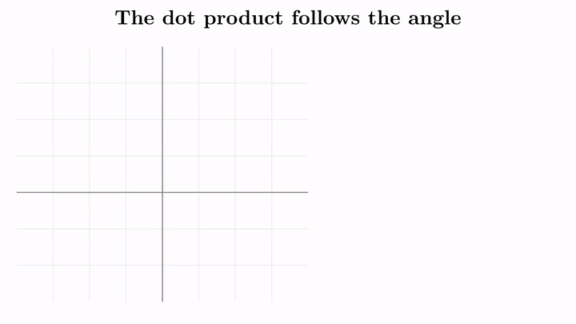
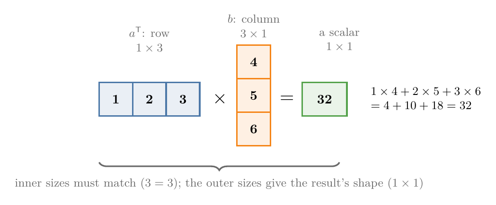

<!-- where-this-fits: generated by course_map/build_map.py; edit concepts.yaml, not this block -->
> **Where this fits:** Pipeline map steps 0 (Foundations), 8 (Model). See the [Course map](../01-course-map/note.md).
>
> 
>
> - **Builds on:** Vectors and feature vectors ([Note 360](../360-vectors-and-feature-vectors/note.md)).
> - **Leads to:** Equation of a hyperplane ([Note 363](../363-equation-of-a-hyperplane/note.md)); Matrix multiplication as composition ([Note 510](../510-matrix-multiplication-as-composition/note.md)); Perceptron ([Note 1004](../1004-perceptron/note.md)).
> - **Compare with:** Vector magnitude, distance and scalar operations ([Note 361](../361-magnitude-distance-and-scalar-operations/note.md)).
<!-- /where-this-fits -->

## 1. Overview

> **Key point:** The dot product multiplies two vectors into one number; that number equals the two lengths times the cosine of the angle between them, so it measures how much two vectors point the same way.



Figure 1 shows the whole idea. As $b$ turns away from $a$, the dot product $a \cdot b$ falls from its largest value (same direction) through 0 (right angle) to negative values (pointing apart). This Note computes the dot product, states its laws, explains this geometric meaning, and turns it into cosine similarity, the standard way to compare texts in a recommender system.

Vectors, magnitudes and distances are covered in the [vectors and feature vectors Note](../360-vectors-and-feature-vectors/note.md) and the [magnitude, distance and scalar operations Note](../361-magnitude-distance-and-scalar-operations/note.md).

## 2. Products of two vectors

> **Key point:** Two vectors have two products: the dot product gives a scalar, the cross product gives a vector; ML mostly uses the dot product.

Vectors can be multiplied, but not in the ordinary sense. There are two products of two vectors:

- The dot product, also called the **scalar product**, because its result is a scalar.
- The **cross product**, also called the **vector product**, because its result is a vector.

ML uses the dot product almost everywhere, and the cross product rarely. This Note is about the dot product.

> **Extra:** The usual cross product is defined for 3D vectors. For two 3D vectors it gives a third vector perpendicular to both, whose length is the area of the parallelogram they span. A product with these properties exists only in 3 and 7 dimensions (W. S. Massey, "Cross products of vectors in higher dimensional Euclidean spaces", *American Mathematical Monthly* 90, 1983, 697–701). ML meets it only in a few places.

## 3. Computing the dot product

> **Key point:** Multiply matching components, then add the products.

The [PCA step by step Note](../48-pca-step-by-step/note.md) (section 2.1) defined the dot product as "multiply matching components and add". Here is that definition worked through, written with its symbol.

1. **In words:** multiply the first components together, then the second, and so on up to the $n$-th; add all the products.
2. **Formula:** for two $n$-dimensional vectors $a$ and $b$,
   $$a \cdot b = a_1 b_1 + a_2 b_2 + \dots + a_n b_n = \sum_{i=1}^{n} a_i b_i$$
   The dot between the two vectors is the symbol of the dot product.
3. **Example:** for $a = [1, 2, 3]$ and $b = [4, 5, 6]$,
   $$a \cdot b = 1 \times 4 + 2 \times 5 + 3 \times 6 = 4 + 10 + 18 = 32$$

Both vectors must have the same number of components; otherwise some component would have no partner.

### 3.1 The dot product as a matrix product

> **Key point:** A row of shape 1 x n times a column of shape n x 1 gives a 1 x 1 result: the dot product. So $a \cdot b = a^{\mathsf T} b$.

The dot product can also be written as a matrix multiplication. Write $a$ as a row vector (shape $1 \times n$) and $b$ as a column vector (shape $n \times 1$), as in the [vectors and feature vectors Note](../360-vectors-and-feature-vectors/note.md) (section 7).



The school rule of matrix multiplication says a $1 \times n$ matrix can multiply an $n \times 1$ matrix because the inner sizes match, and the result has the outer sizes: $1 \times 1$, a single number (Figure 2). Each entry of the row meets its partner in the column, the products are added, and the result is exactly the dot product.

By default a vector is a column. So to put $a$ in the row position we transpose it, and write

$$a \cdot b = a^{\mathsf T} b$$

This form, $a^{\mathsf T}b$, appears throughout the inner workings of ML algorithms, such as $u^{\mathsf T}x$ in the [PCA step by step Note](../48-pca-step-by-step/note.md).

### 3.2 Two laws

> **Key point:** The order of the two vectors does not matter, and the dot product spreads over a sum.

Two rules hold for the dot product:

- **Commutative law:** $a \cdot b = b \cdot a$. Swapping the vectors only swaps the factors in each product.
- **Distributive law:** $a \cdot (b + c) = a \cdot b + a \cdot c$.

With numbers, take $a = [1, 2, 3]$, $b = [4, 5, 6]$ and $c = [7, 8, 9]$:

- $a \cdot b = 32$ and $b \cdot a = 4 + 10 + 18 = 32$.
- $b + c = [11, 13, 15]$, so $a \cdot (b + c) = 11 + 26 + 45 = 82$. Separately, $a \cdot c = 7 + 16 + 27 = 50$, and $a \cdot b + a \cdot c = 32 + 50 = 82$.

> **Python:** Three ways to get the same dot product.
>
> ```python
> import numpy as np
>
> a = np.array([1, 2, 3])
> b = np.array([4, 5, 6])
> np.sum(a * b)   # 32: multiply, then add
> np.dot(a, b)    # 32
> a @ b           # 32: the @ operator
> ```
>
> `a * b` multiplies component by component; `np.dot` and `@` also add the products. The Notebook for this Note (`notebook.ipynb`) checks both laws.

## 4. What the dot product is used for

> **Key point:** The dot product measures similarity, computes projections, and is the building block of matrix multiplication.

In linear algebra the dot product does three main jobs:

1. **Similarity.** It tells how similar two vectors are, and so which of several vectors are closest in direction. Section 6 builds this into cosine similarity.
2. **Projection.** It gives the projection of one vector onto another: how far $a$ reaches along the direction of $b$. Projections are used in the [PCA step by step Note](../48-pca-step-by-step/note.md) and the [SVM maths Note](../93-svm-maths/note.md).
3. **Matrix multiplication.** Every entry of a matrix product is the dot product of a row with a column.

Two uses in ML follow from these. A recommender system turns items into vectors and recommends the most similar ones, measured with the dot product. And deep learning runs on matrix multiplications, so behind the scenes it is computing dot products all the time.

## 5. The geometric meaning

> **Key point:** $a \cdot b = \lVert a \rVert\, \lVert b \rVert \cos\theta$, where $\theta$ is the angle between the vectors.

### 5.1 The second formula

> **Key point:** The dot product is the product of the two lengths and the cosine of the angle between the vectors.

So far the dot product was a recipe on components. A second formula gives the same number from geometry.

1. **In words:** multiply the lengths of the two vectors, and multiply by the cosine of the angle between them.
2. **Formula:**
   $$a \cdot b = \lVert a \rVert\, \lVert b \rVert \cos\theta$$
   where $\lVert a \rVert$ and $\lVert b \rVert$ are the magnitudes (distances from the origin) and $\theta$ is the angle between $a$ and $b$.
3. **Example:** for $a = [3, 4]$ and $b = [4, 3]$, the component recipe gives $a \cdot b = 12 + 12 = 24$. Both have length 5, and the angle between them is $16.26^\circ$, with $\cos 16.26^\circ = 0.96$:
   $$\lVert a \rVert\, \lVert b \rVert \cos\theta = 5 \times 5 \times 0.96 = 24$$

In Figure 1, $a = [3, 1]$ has length $\sqrt{10} \approx 3.16$ and $b$ has length 2.5. At $\theta = 30^\circ$ the dot product is $3.16 \times 2.5 \times 0.87 \approx 6.85$, and at $\theta = 0^\circ$ it reaches its maximum, $3.16 \times 2.5 = 7.91$.

> **Extra:** Why the two formulas agree. The three vectors $a$, $b$ and $a - b$ form a triangle. The law of cosines gives $\lVert a - b \rVert^2 = \lVert a \rVert^2 + \lVert b \rVert^2 - 2\lVert a \rVert\lVert b \rVert\cos\theta$. Expanding the left side component by component gives $\lVert a \rVert^2 + \lVert b \rVert^2 - 2\,a \cdot b$. Comparing the two, $a \cdot b = \lVert a \rVert\lVert b \rVert\cos\theta$.

### 5.2 Perpendicular vectors have dot product 0

> **Key point:** For two non-zero vectors, $a \cdot b = 0$ exactly when the angle between them is 90°.

The lengths of non-zero vectors are positive. So the sign of $a \cdot b$ is the sign of $\cos\theta$ (Figure 1):

- **Acute angle** ($0^\circ \le \theta < 90^\circ$): $\cos\theta > 0$, so $a \cdot b > 0$.
- **Right angle** ($\theta = 90^\circ$): $\cos\theta = 0$, so $a \cdot b = 0$.
- **Obtuse angle** ($90^\circ < \theta \le 180^\circ$): $\cos\theta < 0$, so $a \cdot b < 0$.

So if two non-zero vectors have $a \cdot b = 0$, they are perpendicular. For example, $[3, 4] \cdot [-4, 3] = -12 + 12 = 0$. Perpendicular vectors are called **orthogonal**; as data, they share nothing, and they are as dissimilar as two vectors can be without pointing apart. Algorithms such as SVM use this property heavily, and the [equation of a hyperplane Note](../363-equation-of-a-hyperplane/note.md) relies on it.

### 5.3 The angle between two vectors

> **Key point:** Rearranging the formula gives $\cos\theta$ from the components, and the inverse cosine gives the angle.

If we know all the components of $a$ and $b$, in any number of dimensions, we can find the angle between them.

1. **In words:** compute the dot product, divide by the product of the two lengths; that is $\cos\theta$. The inverse cosine (arccos) turns it into the angle.
2. **Formula:**
   $$\cos\theta = \frac{a \cdot b}{\lVert a \rVert\, \lVert b \rVert}, \qquad \theta = \cos^{-1}\!\left(\frac{a \cdot b}{\lVert a \rVert\, \lVert b \rVert}\right)$$
3. **Example:** for $a = [3, 4]$ and $b = [4, 3]$,
   $$\cos\theta = \frac{24}{5 \times 5} = 0.96, \qquad \theta = \cos^{-1}(0.96) \approx 16.26^\circ$$

## 6. Cosine similarity

> **Key point:** Cosine similarity is $\cos\theta$ between two vectors: 1 for the same direction, 0 for orthogonal, -1 for opposite. It compares direction and ignores length.

### 6.1 Definition and range

> **Key point:** It runs from -1 to 1, and its sign tells whether the angle is acute or obtuse.

The **cosine similarity** of two vectors is the cosine of the angle between them,

$$\cos\theta = \frac{a \cdot b}{\lVert a \rVert\, \lVert b \rVert}$$

computed from the components exactly as in Section 5.3. In ML it is a standard **similarity measure**: a number that says how alike two vectors are.


Figure 3 reads its values:

- **1:** $\theta = 0^\circ$. The vectors point in exactly the same direction, so they are completely similar, even if their lengths differ.
- **Between 0 and 1:** the angle is acute ($0^\circ$ to $90^\circ$); the closer to 1, the more similar.
- **0:** $\theta = 90^\circ$. The vectors are orthogonal: they have nothing in common.
- **Between -1 and 0:** the angle is obtuse ($90^\circ$ to $180^\circ$).
- **-1:** $\theta = 180^\circ$. The vectors point in opposite directions.

With numbers: $p = [1, 2, 3]$ and $q = [2, 4, 5]$ have cosine similarity 0.996 (angle $5.1^\circ$), so they are almost the same direction. $p$ and $r = [-1, -2, 1]$ have cosine similarity $-0.218$ (angle $102.6^\circ$): an obtuse angle.

### 6.2 Recommending movies by angle

> **Key point:** Turn every summary into a vector, compute the cosine similarity with the movie the user liked, and recommend the movies with the smallest angles.

The [vectors and feature vectors Note](../360-vectors-and-feature-vectors/note.md) (section 6) turned movie summaries into bag-of-words vectors and recommended by Euclidean distance. Cosine similarity does the same job by angle. When a user picks a movie, we compute $\cos\theta$ between its vector and every other movie's vector, and recommend those with the smallest angle: ideally $0^\circ$, otherwise angles of $30^\circ$ or $60^\circ$ before ones near $90^\circ$.

For the three toy summaries A = *hi how are you*, B = *my name is riya* and C = *this is 2023*:

1. **In words:** the dot product of two count vectors counts the shared words; divide by the two lengths.
2. **Formula:**
   $$\cos\theta_{BC} = \frac{B \cdot C}{\lVert B \rVert\, \lVert C \rVert}$$
3. **Example:** B and C share one word, *is*, so $B \cdot C = 1$. B has 4 words, so $\lVert B \rVert = \sqrt{4} = 2$; C has 3, so $\lVert C \rVert = \sqrt{3} \approx 1.73$.
   $$\cos\theta_{BC} = \frac{1}{2 \times 1.73} \approx 0.29$$
   A shares no word with B, so $\cos\theta_{AB} = 0$: orthogonal. A user who likes B gets C.

Word counts are never negative, so for texts the cosine similarity always lies between 0 and 1.

> **Extra:** Why cosine beats distance for text. Write B twice in a row, *my name is riya my name is riya*. Its vector is $2B$: same direction, twice as long. Its cosine similarity with B is exactly 1, but its Euclidean distance from B is 2. A long review and a short review on the same topic should count as similar; the angle sees this and the distance does not. Manning, Raghavan and Schütze (*Introduction to Information Retrieval*, 2008, section 6.3.1) make the same point: two documents with very similar content can be far apart "simply because one is much longer than the other", and the standard way to compare two documents is the cosine similarity of their vectors.

> **Python:** scikit-learn computes all pairwise cosine similarities at once.
>
> ```python
> from sklearn.feature_extraction.text import CountVectorizer
> from sklearn.metrics.pairwise import cosine_similarity
>
> texts = ["hi how are you", "my name is riya", "this is 2023"]
> X = CountVectorizer().fit_transform(texts)
> cosine_similarity(X).round(2)   # 3 x 3 table; B-C is 0.29
> ```
>
> Row $i$, column $j$ of the result is the cosine similarity of text $i$ and text $j$; the diagonal is all 1.

## 7. Summary

| Idea | Formula | Example |
|---|---|---|
| Dot product | $\sum a_i b_i$ | $[1,2,3] \cdot [4,5,6] = 32$ |
| Matrix form | $a^{\mathsf T} b$: $(1 \times n)(n \times 1) = 1 \times 1$ | same 32 |
| Laws | $a \cdot b = b \cdot a$; $a \cdot (b + c) = a \cdot b + a \cdot c$ | 32 = 32; 82 = 82 |
| Geometric form | $\lVert a \rVert \lVert b \rVert \cos\theta$ | $5 \times 5 \times 0.96 = 24$ |
| Orthogonal | $a \cdot b = 0$ | $[3,4] \cdot [-4,3] = 0$ |
| Cosine similarity | $\dfrac{a \cdot b}{\lVert a \rVert \lVert b \rVert}$, from $-1$ to 1 | B and C: 0.29 |

- The dot product is one number: positive for an acute angle, 0 for a right angle, negative for an obtuse angle.
- It gives similarity, projections and matrix multiplication; deep learning runs on it.
- Cosine similarity compares direction only, which makes it the usual choice for comparing texts.

## 8. Key terms

| Term | Meaning |
|---|---|
| Scalar product | Another name for the dot product, whose result is a scalar |
| Cross product (vector product) | A product of two 3D vectors that gives a vector perpendicular to both |
| Commutative law | $a \cdot b = b \cdot a$ |
| Distributive law | $a \cdot (b + c) = a \cdot b + a \cdot c$ |
| Orthogonal | Perpendicular; for non-zero vectors, dot product 0 |
| Cosine similarity | The cosine of the angle between two vectors, from -1 to 1 |
| Similarity measure | A number that says how alike two vectors are |
