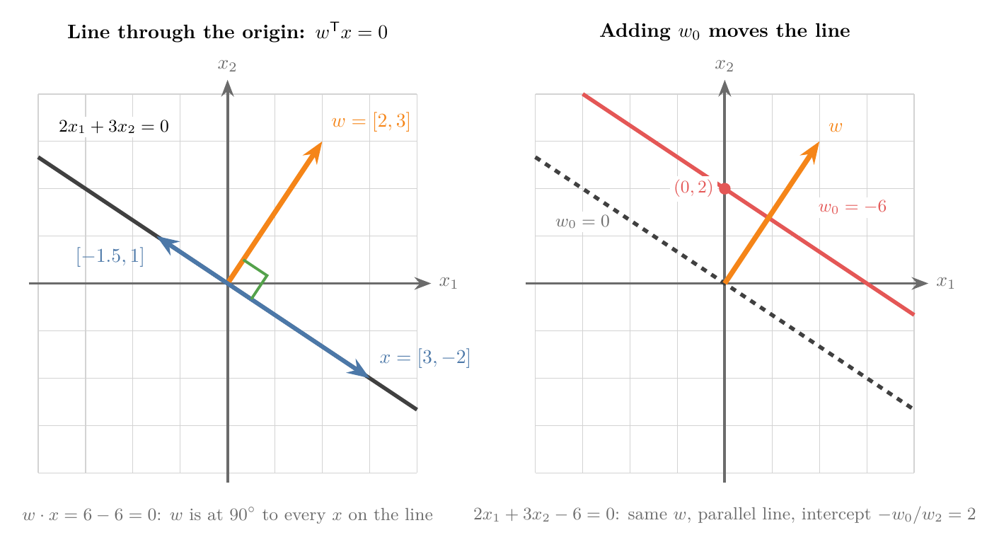

<!-- where-this-fits: generated by course_map/build_map.py; edit concepts.yaml, not this block -->
> **Where this fits:** Pipeline map step 0 (Foundations). See the [Course map](../01-course-map/note.md).
>
> 
>
> - **Builds on:** Dot product ([Note 362](../362-dot-product-and-cosine-similarity/note.md)).
> - **Leads to:** Perceptron ([Note 1004](../1004-perceptron/note.md)); Perceptron trick ([Note 1005](../1005-perceptron-trick/note.md)).
<!-- /where-this-fits -->

## 1. Overview

> **Key point:** One equation, $w^{\mathsf T}x + w_0 = 0$, describes a line in 2D, a plane in 3D and a hyperplane in any number of dimensions; $w$ is perpendicular to it and $w_0$ moves it away from the origin.



Figure 1 shows the whole result in 2D. On the left, every vector $x$ on the line makes a right angle with $w$, so $w \cdot x = 0$. On the right, adding a number $w_0$ slides the line to a parallel position. This Note builds that equation step by step from the school equation of a line, and then reads off what $w$ and $w_0$ mean.

It uses the dot product and its geometric form from the [dot product and cosine similarity Note](../362-dot-product-and-cosine-similarity/note.md).

## 2. Why ML needs hyperplanes

> **Key point:** A line in 2D becomes a plane in 3D and a hyperplane beyond; models that classify with a straight boundary need its equation in any dimension.

In 2D a flat boundary is a line; in 3D it is a plane. In 4D, 5D or $n$D the equivalent is a hyperplane (see the [multiple linear regression Note](../53-multiple-linear-regression/note.md)).

ML data is very often high-dimensional. Even the iris toy dataset has 4 input columns, and MNIST, the handwritten digits dataset, has 784 (one per pixel of a 28 x 28 image). Classifiers that separate classes with a straight boundary, such as [logistic regression](../70-perceptron-trick/note.md) and [SVM](../92-svm-intuition/note.md), therefore work with hyperplanes. To use them, and to code such algorithms ourselves, we need one equation that works in every dimension.

## 3. From a line to a hyperplane

> **Key point:** Rename the general form of a line as $w_1x_1 + w_2x_2 + w_0 = 0$; each extra dimension adds one more term $w_ix_i$.

### 3.1 The general form of a line

> **Key point:** $y = mx + b$ and $ax + by + c = 0$ describe the same line; the general form is the one that grows into higher dimensions.

In school a line is $y = mx + b$, with slope $m$ and intercept $b$. The same line has a general form, $ax + by + c = 0$, used in the [perceptron trick Note](../70-perceptron-trick/note.md) (section 3.1).

Solving the general form for $y$ links the two:

$$y = -\frac{a}{b}\,x - \frac{c}{b}, \qquad\text{so}\qquad m = -\frac{a}{b}, \quad \text{intercept} = -\frac{c}{b}$$

(the $b$ of the general form is a different number from the intercept $b$ of $y = mx + b$). We use the general form, because it treats every axis the same way.

### 3.2 Renaming for n dimensions

> **Key point:** Call the axes $x_1, x_2, \dots$ and the coefficients $w_1, w_2, \dots$, with $w_0$ for the constant.

Letters $x, y, z$ run out after three dimensions, so we number the axes instead: $x_1, x_2, x_3, \dots$ We number the coefficients the same way, $w_1, w_2, \dots$, and call the constant term $w_0$. Then:

- **Line (2D):** $w_1x_1 + w_2x_2 + w_0 = 0$
- **Plane (3D):** $w_1x_1 + w_2x_2 + w_3x_3 + w_0 = 0$
- **Hyperplane ($n$D):** $w_1x_1 + w_2x_2 + \dots + w_nx_n + w_0 = 0$

Each new dimension adds one term. With numbers, the line $2x + 3y - 6 = 0$ becomes $2x_1 + 3x_2 - 6 = 0$: here $w_1 = 2$, $w_2 = 3$ and $w_0 = -6$.

## 4. The vector form

> **Key point:** The sum $w_1x_1 + \dots + w_nx_n$ is a dot product, so the hyperplane is $w \cdot x + w_0 = 0$, or $w^{\mathsf T}x + w_0 = 0$.

Look at the part $w_1x_1 + w_2x_2 + \dots + w_nx_n$. It multiplies matching components and adds them: it is a dot product. Collect the coefficients into one vector and the coordinates into another:

$$w = \begin{bmatrix} w_1 \\ w_2 \\ \vdots \\ w_n \end{bmatrix}, \qquad x = \begin{bmatrix} x_1 \\ x_2 \\ \vdots \\ x_n \end{bmatrix}$$

Both are column vectors, the default. Writing the dot product as a row times a column, $w \cdot x = w^{\mathsf T}x$, gives the equation of a hyperplane:

1. **In words:** the dot product of the coefficient vector with any point on the hyperplane, plus the constant, is zero.
2. **Formula:**
   $$w^{\mathsf T}x + w_0 = 0$$
3. **Example:** for $w = [2, 3]$ and $w_0 = -6$, the point $x = [3, 0]$ gives
   $$w^{\mathsf T}x + w_0 = 2 \times 3 + 3 \times 0 - 6 = 0$$
   so $[3, 0]$ lies on the line $2x_1 + 3x_2 - 6 = 0$.

This one equation is valid in 2D, 3D and $n$D: only the number of components of $w$ and $x$ changes. It is the same $w \cdot u + b$ that SVM uses in the [SVM maths Note](../93-svm-maths/note.md), with $b = w_0$.

## 5. What $w_0$ means

> **Key point:** $w_0$ shifts the hyperplane away from the origin; $w_0 = 0$ exactly when the hyperplane passes through the origin.

To see what $w_0$ does, go back to 2D, where the line is both $x_2 = mx_1 + b$ and $w_1x_1 + w_2x_2 + w_0 = 0$. Section 3.1 matched the intercepts:

$$b = -\frac{w_0}{w_2}$$

Now slide the line down until it passes through the origin. Its intercept $b$ becomes 0, and since $w_2 \neq 0$, that forces $w_0 = 0$. So:

- A line, plane or hyperplane passes through the origin exactly when $w_0 = 0$.
- A non-zero $w_0$ moves it parallel to itself, away from the origin. In Figure 1 (right), $2x_1 + 3x_2 = 0$ passes through the origin, while $2x_1 + 3x_2 - 6 = 0$ crosses the $x_2$ axis at $-(-6)/3 = 2$.

So we often take the simplifying assumption that the hyperplane passes through the origin. The equation then shrinks to

$$w^{\mathsf T}x = 0$$

In 2D that is $w_1x_1 + w_2x_2 = 0$; in 4D, $w_1x_1 + w_2x_2 + w_3x_3 + w_4x_4 = 0$.

> **Extra:** The assumption costs nothing, because of a standard trick. Add a constant component $x_0 = 1$ to every point, so $x = [1, x_1, \dots, x_n]$, and put $w_0$ into $w = [w_0, w_1, \dots, w_n]$. Then $w^{\mathsf T}x = w_0 + w_1x_1 + \dots + w_nx_n$, and the equation $w^{\mathsf T}x = 0$ already contains the shift. This is the column of ones in the matrix form of the [multiple linear regression maths Note](../54-multiple-lr-maths/note.md).

## 6. What $w$ means: the normal vector

> **Key point:** $w^{\mathsf T}x = 0$ says $w$ makes a 90° angle with every point $x$ on the hyperplane, so $w$ is perpendicular to the hyperplane.

### 6.1 The argument

> **Key point:** A dot product of non-zero vectors is 0 only at 90°.

For a hyperplane through the origin, every point $x$ on it satisfies $w^{\mathsf T}x = 0$. Write the dot product in its geometric form:

$$w^{\mathsf T}x = w \cdot x = \lVert w \rVert\, \lVert x \rVert \cos\theta = 0$$

For non-zero $w$ and $x$, the lengths are positive, so $\cos\theta = 0$ and $\theta = 90^\circ$. Each point $x$ on the hyperplane is a vector lying in the hyperplane, and $w$ is at a right angle to every one of them. So $w$ is perpendicular to the hyperplane itself. A vector perpendicular to a line, plane or hyperplane is called its **normal vector**.

With numbers, for the line $2x_1 + 3x_2 = 0$ in Figure 1 (left): $w = [2, 3]$, and the points $[3, -2]$ and $[-1.5, 1]$ lie on the line. Both give $w \cdot x = 0$:

$$2 \times 3 + 3 \times (-2) = 0, \qquad 2 \times (-1.5) + 3 \times 1 = 0$$

### 6.2 The same in 3D

> **Key point:** The coefficients of a plane's equation, read as a vector, stick straight out of the plane.

![The plane x1 + 2x2 + 2x3 = 0 and its normal vector w = [1, 2, 2]](images/plane_normal.png){height=45%}

Figure 2 shows the plane $x_1 + 2x_2 + 2x_3 = 0$. Its coefficients form $w = [1, 2, 2]$, drawn in orange. The three blue vectors lie in the plane, for example $[2, -1, 0]$, with $1 \times 2 + 2 \times (-1) + 2 \times 0 = 0$. The orange $w$ stands at 90° to all of them.

So reading a hyperplane's equation tells us its direction at once: the coefficients are the normal vector. In $n$D we cannot draw it, but the argument of Section 6.1 never used the number of dimensions.

> **Python:** Checking that points lie on a hyperplane is one dot product per point.
>
> ```python
> import numpy as np
>
> w = np.array([1, 2, 2])
> X = np.array([[2, -1, 0], [0, 1, -1], [-2, 2, -1]])
> # dot product of every row of X with w
> X @ w    # array([0, 0, 0]): all on the plane
> ```

> **Extra:** $w$ stays perpendicular when $w_0 \neq 0$. Take any two points $x$ and $y$ on the hyperplane: $w^{\mathsf T}x + w_0 = 0$ and $w^{\mathsf T}y + w_0 = 0$. Subtracting, $w^{\mathsf T}(x - y) = 0$. The vector $x - y$ runs along the hyperplane, so $w$ is perpendicular to every direction in it. This is why the two lines in Figure 1 (right) share the same $w$ and are parallel.

> **Extra:** For a point off the hyperplane, $w^{\mathsf T}x + w_0$ is not zero, and its sign says which side the point is on: positive on the side $w$ points to, negative on the other. To see this, start at a point $p$ on the hyperplane and step a distance $t$ along $w$: $x = p + t\,w/\lVert w \rVert$. Then $w^{\mathsf T}x + w_0 = (w^{\mathsf T}p + w_0) + t\,w^{\mathsf T}w/\lVert w \rVert = 0 + t\lVert w \rVert$, which has the sign of $t$. This is the side test of the [perceptron trick Note](../70-perceptron-trick/note.md) and the decision rule of the [SVM maths Note](../93-svm-maths/note.md).

## 7. Summary

| Object | Equation | Normal vector |
|---|---|---|
| Line (2D) | $w_1x_1 + w_2x_2 + w_0 = 0$ | $[w_1, w_2]$ |
| Plane (3D) | $w_1x_1 + w_2x_2 + w_3x_3 + w_0 = 0$ | $[w_1, w_2, w_3]$ |
| Hyperplane ($n$D) | $w^{\mathsf T}x + w_0 = 0$ | $w$ |
| Through the origin | $w^{\mathsf T}x = 0$ | $w$ |

- The general form of a line grows into a hyperplane by adding one term per dimension; the sum of terms is a dot product.
- $w_0$ shifts the hyperplane; $w_0 = 0$ means it passes through the origin.
- $w$ is the normal vector: perpendicular to the hyperplane, because $w \cdot x = 0$ means a 90° angle.

## 8. Key terms

| Term | Meaning |
|---|---|
| Equation of a hyperplane | $w^{\mathsf T}x + w_0 = 0$: one equation for a line, plane or hyperplane in any dimension |
| $w_0$ | The constant term; it shifts the hyperplane away from the origin, and is 0 when the hyperplane passes through the origin |
| Normal vector | A vector perpendicular to a line, plane or hyperplane; for $w^{\mathsf T}x + w_0 = 0$ it is $w$ |
