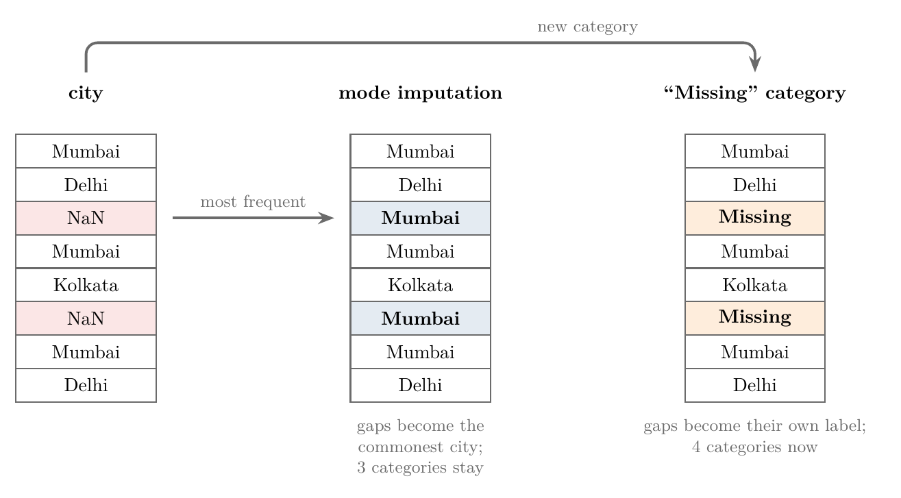
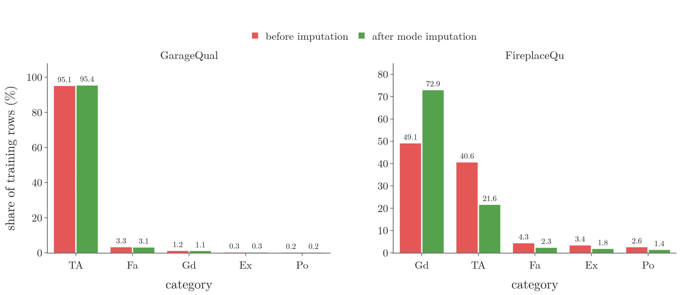
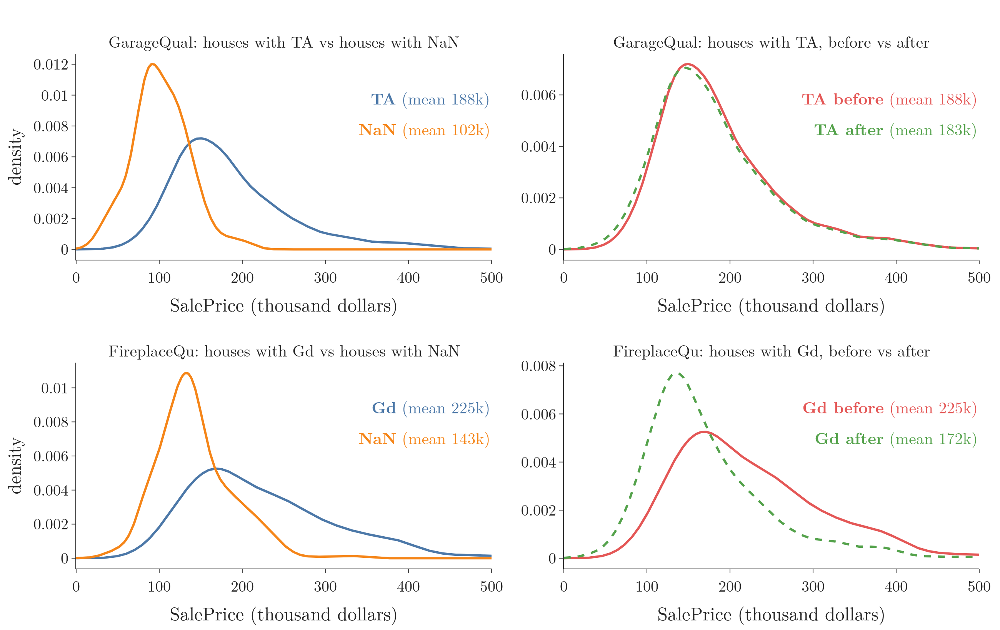
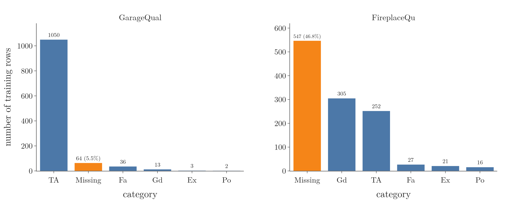

<!-- where-this-fits: generated by course_map/build_map.py; edit concepts.yaml, not this block -->
> **Where this fits:** Pipeline map step 4 (Clean). See the [Course map](../01-course-map/note.md).
>
> 
>
> - **Builds on:** Poor-quality data ([Note 7](../07-challenges-in-ml/note.md)); Train-test split ([Note 13](../13-toy-project/note.md)).
> - **Leads to:** Missing indicator ([Note 38](../38-missing-indicator-random-sample/note.md)); Random sample imputation ([Note 38](../38-missing-indicator-random-sample/note.md)); KNN imputer ([Note 39](../39-knn-imputer/note.md)); Grid and random search ([Note 38](../38-missing-indicator-random-sample/note.md)); Iterative imputation (MICE) (Video 40, coming).
> - **Compare with:** Outliers ([Note 23](../23-what-is-feature-engineering/note.md)); Complete case analysis ([Note 35](../35-complete-case-analysis/note.md)); Random sample imputation ([Note 38](../38-missing-indicator-random-sample/note.md)); KNN imputer ([Note 39](../39-knn-imputer/note.md)).
<!-- /where-this-fits -->

## 1. Overview

> **Key point:** A gap in a categorical column is filled either with the most frequent category (mode imputation) or with a new category called "Missing".

Note 35 mapped the techniques for missing data, and Note 36 filled gaps in numerical columns with the mean or median. A categorical column has no mean or median, so it needs its own techniques. This Note covers the two main ones.

Figure 1 shows both on a small `city` column with two gaps:

- **Mode imputation** fills every gap with the most frequent city, Mumbai. The column keeps its three categories.
- **Missing category imputation** fills every gap with the word "Missing". The column now has four categories.



Both are univariate techniques: they look only at the column with the gap. scikit-learn's `SimpleImputer` does both.

> **Extra:** A third technique, filling each gap with a random value drawn from the column, works for numerical and categorical columns alike. Note 38 covers it.

## 2. Most frequent value imputation

> **Key point:** Mode imputation replaces every missing value with the category that appears most often in the column.

### 2.1 The idea

> **Key point:** The mode of a column is its most frequent value; every gap gets that value.

The **mode** of a column is the value that occurs most often in it. **Most frequent value imputation**, or **mode imputation**, fills every missing value of a column with its mode.

Take a column `city` with the values Mumbai, Delhi and Kolkata, plus some gaps. Mumbai appears most often, then Delhi, then Kolkata. Every gap becomes Mumbai.

Mode imputation also works on a numerical column, since numbers have a mode too. In practice the mean or median (Note 36) works better there, so mode imputation is used mainly for categorical data.

### 2.2 When to use it

> **Key point:** Use mode imputation when the data is missing completely at random, few values are missing, and one category clearly dominates.

Mode imputation rests on three conditions:

1. **The data is MCAR** (missing completely at random, Note 35). The gaps have no pattern, so the missing rows look like the others.
2. **Few values are missing**, as a rule of thumb up to about 5% of the column. This is the same limit as for mean and median imputation.
3. **One category dominates.** The mode should appear far more often than every other category. If Mumbai, Delhi and Kolkata each make up about a third of the column, guessing Mumbai for every gap is wrong two times out of three.

### 2.3 Advantages and disadvantages

> **Key point:** Mode imputation is quick and easy to deploy, but it inflates the most frequent category and so changes the distribution.

**Advantages:**

1. **Easy to apply.** One value per column, learned once.
2. **Easy to deploy.** The deployed model stores that one value and fills any gap in new data with it.

**Disadvantage:** it changes the distribution of the column. Every gap adds to the mode's count, so the most frequent category grows and all others shrink. The more values are missing, the bigger the change, as Section 5 shows with real numbers.

## 3. Missing category imputation

> **Key point:** Missing category imputation gives every gap the same new label, "Missing", so the model can learn that the value was absent.

### 3.1 The idea

> **Key point:** We do not guess the missing value; we mark it as missing with a category of its own.

**Missing category imputation** fills every missing value of a categorical column with a new category, usually the word "Missing". The `city` column of Figure 1 then has four categories: Mumbai, Delhi, Kolkata and Missing.

The aim is to tell the ML algorithm which rows had no value. The algorithm then treats "Missing" like any other category and can learn whether it matters.

This is the categorical version of **arbitrary value imputation** for numerical columns (Note 36), where gaps are filled with a value such as 99 or -1 that cannot occur naturally. In a categorical column, a word plays that role.

### 3.2 When to use it

> **Key point:** Use the "Missing" category when many values are missing or the gaps are not random.

Suppose a third or more of the `city` column is missing. Filling all of those gaps with Mumbai would make Mumbai far bigger than it really is, and the results suffer. A "Missing" category leaves the real categories as they were.

So the "Missing" category suits two cases:

- **Many values are missing**, well above 5%.
- **The data is not missing at random** (MAR or MNAR, Note 35). The fact that a value is missing may then carry information that the model can use.

### 3.3 Advantages and disadvantages

> **Key point:** It is easy, keeps the existing categories intact and captures why data is missing, but it fills nothing in.

**Advantages:**

1. **Easy to apply and deploy**, like mode imputation.
2. **Keeps the existing categories' counts** exactly as they were.
3. **Captures the missingness itself**, which helps when the gaps are not random.

**Disadvantage:** it does not estimate the missing value; it only labels it. When there are few gaps, the new category is small, and the results are usually no better than with mode imputation.

> **Extra:** After one-hot encoding (Note 27), the "Missing" category becomes its own 0/1 column. That column is the same as a missing indicator (Note 38) for this feature.

## 4. The house price data

> **Key point:** We use two quality ratings from a house price dataset: one missing 5.5% of its values, the other 47.3%.

The data is the training file of Kaggle's *House Prices: Advanced Regression Techniques*: 1,460 houses sold in Ames, Iowa, with 81 columns. We use only three:

- `GarageQual`: quality of the garage.
- `FireplaceQu`: quality of the fireplaces.
- `SalePrice`: the price the house sold for, in dollars. This is the target, so this is a regression problem.

Both quality columns use the same five categories:

| Code | Meaning |
|---|---|
| Ex | Excellent |
| Gd | Good |
| TA | Typical/Average |
| Fa | Fair |
| Po | Poor |

The two columns were chosen for their very different shares of missing values:

| Column | Missing values | Share missing |
|---|---|---|
| `GarageQual` | 81 of 1,460 | 5.5% |
| `FireplaceQu` | 690 of 1,460 | 47.3% |

The file `data/house_prices.csv` keeps these three columns and two more used in Section 7. The full file, with all 81 columns, is on Kaggle.

> **Python:** Loading the columns and measuring the gaps.
>
> ```python
> df = pd.read_csv("data/house_prices.csv")
> df.isnull().mean() * 100
> # FireplaceQu 47.26, GarageQual 5.55, SalePrice 0.0
> ```

## 5. Mode imputation on real data

> **Key point:** Mode imputation barely changes `GarageQual`, where one category dominates and few values are missing, but badly distorts `FireplaceQu`.

### 5.1 Split first

> **Key point:** We split the data before imputing, and learn the mode from the training set alone.

An imputer learns something from the data: here, the mode of each column. Like a scaler (Note 13), it must learn only from the training set, or information from the test set leaks into training. So we split first, with 80% of the houses for training.

> **Python:** Splitting before imputing.
>
> ```python
> X = df[["GarageQual", "FireplaceQu"]]
> y = df["SalePrice"]
> X_train, X_test, y_train, y_test = train_test_split(
>     X, y, test_size=0.2, random_state=42)
> X_train.isnull().sum()
> # GarageQual 64, FireplaceQu 547  (of 1,168 rows)
> ```

All numbers in the rest of this Note come from these 1,168 training houses.

### 5.2 `GarageQual`: one category dominates

> **Key point:** TA makes up 95% of the garages, so giving the 64 gaps the value TA hardly changes anything.

The mode of `GarageQual` is TA: 1,050 of the 1,104 known garages are rated "typical/average". Figure 2 (left) shows how strongly it dominates. All three conditions of Section 2.2 hold roughly: few gaps (5.5%) and one dominant category.

The share of a category, step by step:

1. **In words:** count the rows with that category and divide by the rows that have a value.
2. **Formula:**
   $$\text{share} = \frac{\text{rows with the category}}{\text{rows with a value}} \times 100\%$$
3. **Example:** before imputation, 1,050 of the 1,104 known garages are TA:
   $$\frac{1{,}050}{1{,}104} \times 100\% = 95.1\%.$$
   After imputation, the 64 gaps are TA too, and every one of the 1,168 rows has a value:
   $$\frac{1{,}050 + 64}{1{,}168} \times 100\% = \frac{1{,}114}{1{,}168} \times 100\% = 95.4\%.$$

{width=100%}

| `GarageQual` | Before | After |
|---|---|---|
| TA | 95.1% | 95.4% |
| Fa | 3.3% | 3.1% |
| Gd | 1.2% | 1.1% |
| Ex | 0.3% | 0.3% |
| Po | 0.2% | 0.2% |

No share moves by more than 0.3 percentage points.

A second check looks at the target. If the houses with a gap were like the TA houses, their sale prices should look alike. Figure 3 (top left) compares the two as density curves (KDE, Note 20).

{width=100%}

The houses with a gap sold for much less: a mean of 102,000 dollars against 188,000 for TA houses. So the gaps are probably not random. Yet there are only 64 of them, so adding them to the 1,050 TA houses changes the TA curve very little (Figure 3, top right): its mean falls from 188,000 to 183,000 dollars.

For `GarageQual`, mode imputation is acceptable. Few values are missing, so even a poor guess cannot change much.

### 5.3 `FireplaceQu`: two categories nearly tied

> **Key point:** Gd and TA are nearly equal, and almost half the values are missing, so mode imputation turns Gd from 49% into 73% of the column.

The mode of `FireplaceQu` is Gd, but TA is close behind: 49.1% against 40.6% of the known values (Figure 2, right). No category dominates, and 46.8% of the training rows are missing. Two of the three conditions fail.

Imputing the 547 gaps with Gd changes the shares heavily:

| `FireplaceQu` | Before | After |
|---|---|---|
| Gd | 49.1% | 72.9% |
| TA | 40.6% | 21.6% |
| Fa | 4.3% | 2.3% |
| Ex | 3.4% | 1.8% |
| Po | 2.6% | 1.4% |

Gd grows from $305$ to $305 + 547 = 852$ of 1,168 rows, which is 72.9%. Every other category loses close to half its share.

The sale prices tell the same story. Houses with a gap sold for a mean of 143,000 dollars, against 225,000 for Gd houses (Figure 3, bottom left). After imputation, 547 cheaper houses join the 305 Gd houses, and the Gd curve moves left: its mean falls from 225,000 to 172,000 dollars (Figure 3, bottom right).

For `FireplaceQu`, mode imputation is the wrong choice. The "Missing" category of Section 6 suits it better.

### 5.4 Mode imputation with `SimpleImputer`

> **Key point:** `SimpleImputer(strategy="most_frequent")` learns each column's mode with `fit` and fills the gaps with `transform`.

> **Python:** Mode imputation, fitted on the training set.
>
> ```python
> from sklearn.impute import SimpleImputer
>
> imp = SimpleImputer(strategy="most_frequent")
> imp.set_output(transform="pandas")
> imp.fit(X_train)          # learn the modes
> imp.statistics_           # ['TA', 'Gd']
> X_train = imp.transform(X_train)
> X_test = imp.transform(X_test)
> ```
>
> **`statistics_`** holds what `fit` learned: one fill value per column, in column order. `set_output(transform="pandas")` returns a DataFrame with the column names, instead of a bare array.

The same can be done in pandas with `fillna`. The mode must still come from the training set.

> **Python:** Mode imputation in pandas.
>
> ```python
> mode = X_train["GarageQual"].mode()[0]   # 'TA'
> X_train["GarageQual"] = X_train["GarageQual"].fillna(mode)
> X_test["GarageQual"] = X_test["GarageQual"].fillna(mode)
> ```
>
> `mode()` returns every value tied for most frequent, so `[0]` takes the first. Assign the result back to the column: in pandas 3, `fillna(..., inplace=True)` on a single column no longer changes the DataFrame.

> **Extra:** Two slips are easy to make here.
>
> - **Imputing before splitting.** Calling `fillna` with the mode of the whole table, `df["GarageQual"].mode()[0]`, learns the mode from the test rows too. On this data the mode is TA either way, but in general this is data leakage.
> - **Transforming the wrong set.** `X_test = imp.transform(X_train)` fills the training set again and stores it as the test set. The line must read `imp.transform(X_test)`.

## 6. Missing category imputation on real data

> **Key point:** With the "Missing" category, the 547 gaps in `FireplaceQu` become the largest category, while Gd, TA and the rest keep their exact counts.

Filling the gaps with "Missing" adds one bar to each column (Figure 4). In `GarageQual` it is a small bar of 64 rows (5.5%). In `FireplaceQu` it becomes the largest category, with 547 rows (46.8%).

{width=100%}

Every original category keeps exactly the count it had: 305 Gd, 252 TA and so on. Nothing is inflated, and the model can still learn that houses in the "Missing" group sold for less.

> **Python:** The "Missing" category with `SimpleImputer`.
>
> ```python
> imp = SimpleImputer(strategy="constant",
>                     fill_value="Missing")
> X_train = imp.fit_transform(X_train)
> X_test = imp.transform(X_test)
> imp.statistics_           # ['Missing', 'Missing']
> ```
>
> `strategy="constant"` fills every gap with `fill_value`. It learns nothing from the data, so `fit` only records the fill value. In pandas, the same is `X_train[col].fillna("Missing")`.

## 7. Choosing between the two

> **Key point:** Few gaps and one dominant category: mode. Many gaps, no dominant category, or gaps with a reason: "Missing".

| | Mode imputation | "Missing" category |
|---|---|---|
| Fills a gap with | the most frequent category | the word "Missing" |
| Categories after | the same | one more |
| Changes existing shares | yes: the mode grows | no |
| Use when | MCAR, about 5% missing or less, one category dominates | many values missing, or not MCAR |
| `SimpleImputer` | `strategy="most_frequent"` | `strategy="constant", fill_value="Missing"` |
| In this data | fine for `GarageQual` | better for `FireplaceQu` |

> **Extra:** What the gaps mean in this data.
>
> In this dataset, the gaps are not lost values at all. The dataset's own description says that an empty `FireplaceQu` means "no fireplace" and an empty `GarageQual` means "no garage". The data confirms it: all 690 houses with a gap in `FireplaceQu` have 0 fireplaces, and all 81 with a gap in `GarageQual` also have no garage type.
>
> So the gaps are MNAR (Note 35): the value is missing because the thing does not exist. This explains why houses with a gap sold for less in Figure 3. For both columns, a category such as "Missing" (or better, "None") describes the truth; guessing TA or Gd invents a garage or a fireplace.
>
> Before imputing, it is worth reading the data's description to see whether "missing" has a meaning.

## 8. Summary

- A categorical column has no mean or median, so its gaps are filled with the mode or with a new category.
- **Mode imputation** fills every gap with the most frequent category. It suits MCAR data with few gaps (about 5% or less) and one dominant category. It is easy to deploy but inflates the mode.
- **Missing category imputation** fills every gap with "Missing". It suits columns with many gaps or gaps that are not random. Existing categories keep their counts.
- After imputing, compare each category's share before and after. On the house data, TA in `GarageQual` moved from 95.1% to 95.4%, but Gd in `FireplaceQu` jumped from 49.1% to 72.9%.
- Also compare the target for the most frequent category against the rows with gaps: here the gaps marked cheaper houses.
- Split first, then fit `SimpleImputer` on the training set and transform both sets with it.

## 9. Key terms

| Term | Meaning |
|---|---|
| Mode | The most frequent value of a column |
| Most frequent value imputation (mode imputation) | Filling every gap in a column with its mode |
| Missing category imputation | Filling every gap in a categorical column with a new category, "Missing" |
| Arbitrary value imputation | Filling gaps with a value that cannot occur naturally, such as 99, -1 or "Missing" |
| Category share | The rows in one category divided by the rows that have a value |
| `strategy="most_frequent"` | The `SimpleImputer` setting for mode imputation |
| `strategy="constant"` | The `SimpleImputer` setting that fills every gap with `fill_value` |
| `statistics_` | The fill values a fitted `SimpleImputer` learned, one per column |
