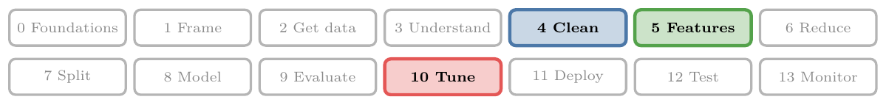
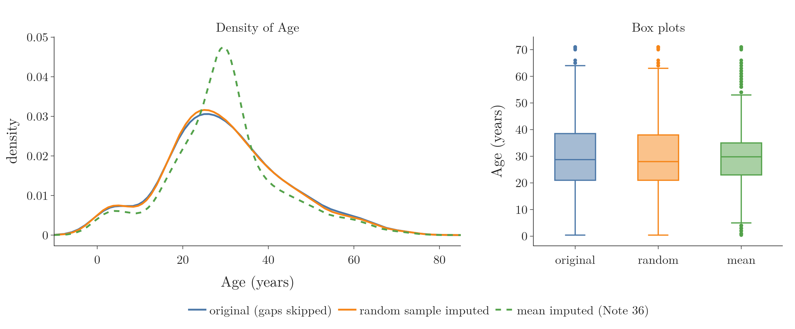
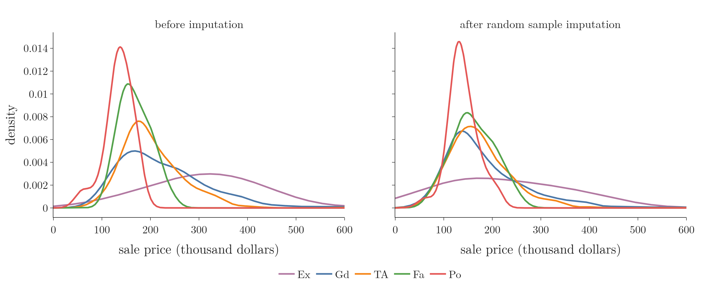
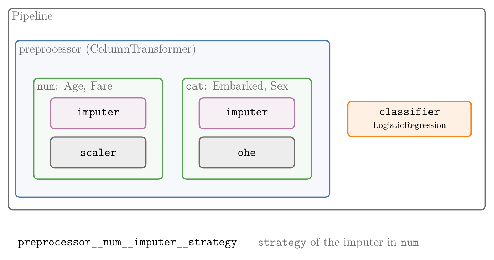

<!-- where-this-fits: generated by course_map/build_map.py; edit concepts.yaml, not this block -->
> **Where this fits:** Pipeline map steps 4 (Clean), 5 (Engineer features), 10 (Tune). See the [Course map](../01-course-map/note.md).
>
> 
>
> - **Builds on:** Poor-quality data ([Note 9](../09-mldlc/note.md)); Hyperparameter tuning ([Note 9](../09-mldlc/note.md)); Data leakage ([Note 13](../13-toy-project/note.md)); Column transformer ([Note 28](../28-column-transformer/note.md)); Saving models with pickle ([Note 29](../29-pipelines/note.md)); Cross-validation ([Note 30](../30-function-transformer/note.md)).
> - **Leads to:** KNN imputer ([Note 39](../39-knn-imputer/note.md)); Iterative imputation (MICE) ([Note 40](../40-iterative-imputer-mice/note.md)); Bagging ([Note 105](../105-bagging-intuition/note.md)); Random forest ([Note 108](../108-random-forest-intro/note.md)); XGBoost ([Note 123](../123-xgboost-intro/note.md)).
> - **Compare with:** Outliers ([Note 23](../23-what-is-feature-engineering/note.md)); Simple imputation (mean, median, mode, constant) ([Note 37](../37-missing-categorical-data/note.md)); Optuna ([Note 134](../134-optuna/note.md)); Bayesian optimisation ([Note 134](../134-optuna/note.md)).
<!-- /where-this-fits -->

## 1. Overview

> **Key point:** Random sample imputation fills each gap with a real value drawn at random from the same column; a missing indicator adds a True/False column that marks where the gaps were.

Note 36 filled gaps in numerical columns with one fixed number, and Note 37 filled gaps in categorical columns with the mode or the word "Missing". This Note adds two more techniques, and then a way to let the computer pick the best technique for us.

Figure 1 shows the two techniques on a small `Age` column with two gaps:

- **Random sample imputation** puts the known values in a bag and draws one at random for each gap. It works for numerical and categorical columns alike.
- **Missing indicator** keeps the gaps for another imputer to fill, and adds a new column, `Age_NA`, that is True where the value was missing.

{width=100%}

Both are univariate: they look only at the column with the gap. The last section uses grid search to choose the imputation strategy automatically, together with the model's own settings.

## 2. Random sample imputation

> **Key point:** Each missing value is replaced by a value picked at random from the values the column already has.

### 2.1 The idea

> **Key point:** We do not invent numbers; we reuse the column's own values, chosen at random.

**Random sample imputation** replaces every missing value of a column with a value drawn at random from the known values of the same column. If the known ages are 22, 38, 26 and 35, a gap becomes one of those four, never some other number such as 71 or 99.

The same works for a categorical column. If a `gender` column holds "male" and "female" plus some gaps, each gap becomes "male" or "female", drawn at random from the known rows.

### 2.2 Why the distribution stays the same

> **Key point:** Common values are drawn often and rare values rarely, so the filled values follow the same shape as the known ones.

Think of every known value written on a slip of paper and put into one bag. Values that occur often have many slips, so a random draw lands on them often. Rare values have few slips and are drawn rarely.

The chance of drawing a value, step by step:

1. **In words:** count how many known values fall in a range, and divide by the number of known values.
2. **Formula:**
   $$P(\text{draw lands in the range}) = \frac{\text{known values in the range}}{\text{all known values}}$$
3. **Example:** in the Titanic training set of Section 3, 174 of the 564 known ages are in their twenties:
   $$\frac{174}{564} = 0.309.$$
   So about 31% of the 148 gaps, around 46 of them, get an age in the twenties, the same share as in the known data. Only 20 known ages are 60 or over, so very few gaps get such an age.

Because every range gets its fair share of the filled values, the shape of the distribution and its variance stay almost the same. Mean imputation (Note 36) instead piles every filled value at one point.

### 2.3 Advantages

> **Key point:** It is easy to apply and keeps the distribution and variance intact, which suits linear models.

1. **Easy to apply.** One line of pandas per column.
2. **Keeps the distribution and the variance**, as Section 2.2 explains.
3. **Good for linear models**, such as linear and logistic regression, which are sensitive to the shape of the data.

Tree-based models, such as decision trees, gain less from it: the random values add noise to the data. The intuition: a tree splits on the order of the values, so keeping the exact shape of the distribution matters less to it.

> **Python:** scikit-learn has no random sample imputer, so we write it in pandas.
>
> ```python
> pool = X_train["Age"].dropna()        # the bag
> gaps = X_train["Age"].isnull()
> X_train.loc[gaps, "Age"] = pool.sample(
>     gaps.sum(), random_state=42).values
> ```
>
> **`sample(n)`** draws `n` values at random from a Series. **`random_state`** fixes the draw, so the same code gives the same values every time. **`.values`** drops the row labels of the drawn values; without it, pandas would try to match them to the gaps' labels.

### 2.4 Disadvantages

> **Key point:** It weakens the column's relationships with other columns, adds randomness, and needs the training data at prediction time.

1. **The covariance with other columns changes.** Each filled value is drawn without looking at the rest of the row, so the column's link to other columns weakens.
2. **It adds randomness.** Run the code twice without a fixed seed and the filled values differ.
3. **It needs memory in production.** A gap in new data must be filled from the training values, so the deployed model has to keep the whole training column on the server. For a large training set, this takes a lot of memory.

It works however many values are missing, since the shape is kept either way. Section 5 shows a check that can still fail when many values are missing.

## 3. Random sample imputation on Titanic ages

> **Key point:** On the Titanic data, random sample imputation of `Age` keeps the density curve and the variance almost unchanged, but the covariance with `Fare` drops.

### 3.1 The data and the fill

> **Key point:** We split first, and draw the fill values for both sets from the known training ages.

The data is Kaggle's Titanic training file, 891 passengers. We use `Age` and `Fare` as inputs and `Survived` as the target. `Age` has 177 missing values (19.9%); `Fare` has none.

After an 80/20 split, the training set has 712 rows, 148 of them with no age (20.8%). The test set has 179 rows, 29 of them with no age.

Both sets are filled from the same bag: the 564 known training ages. Drawing test values from the test set itself would let test data shape the inputs, which is data leakage (Note 36).

> **Python:** One helper for both sets.
>
> ```python
> def random_fill(col, pool, seed):
>     out = col.copy()
>     gaps = out.isnull()
>     out[gaps] = pool.sample(gaps.sum(),
>                             random_state=seed).values
>     return out
>
> pool = X_train["Age"].dropna()
> X_train["Age_imputed"] = random_fill(X_train["Age"], pool, 42)
> X_test["Age_imputed"] = random_fill(X_test["Age"], pool, 42)
> ```
>
> We keep the original column next to the filled one, to compare them. The seed 42 makes the numbers below repeatable; another seed gives slightly different numbers.

### 3.2 Distribution, variance and outliers

> **Key point:** The density curve and the box barely move, and the variance changes from 204.35 to 200.03.

Figure 2 compares the original `Age` (blue) with the random sample imputed one (orange). For contrast, it also shows mean imputation (green dashed, Note 36).

{width=100%}

The orange curve lies almost on top of the blue one. The box plots agree: the box runs from 21 to 38.25 before and from 21 to 38 after, and the outliers go from 7 to 10. Mean imputation, by contrast, narrows the box to 23 to 35.

| `Age` in the training set | Original | Random sample | Mean (Note 36) |
|---|---|---|---|
| Variance | 204.35 | 200.03 | 161.81 |
| Mean | 29.79 | 29.58 | 29.79 |
| Median | 28.75 | 28.00 | 29.79 |
| Outliers (box plot) | 7 | 10 | 69 |

### 3.3 Covariance with other columns

> **Key point:** The covariance of `Age` with `Fare` falls from 71.51 to 53.26, because the drawn ages ignore the fare.

| Covariance with `Fare` | Value |
|---|---|
| `Age` original | 71.51 |
| `Age` random sample imputed | 53.26 |

A passenger with a high fare tended to be a little older. The drawn ages pay no attention to the fare, so for the 148 filled rows this pattern is lost, and the covariance drops by about a quarter. This is disadvantage 1 of Section 2.4.

## 4. Same input, same fill

> **Key point:** In production, seed the draw with a value from the row itself, so the same input always gets the same fill value and the same prediction.

### 4.1 The problem

> **Key point:** Without a fixed seed, the same user can get a different prediction each time they ask.

Suppose a website uses the Titanic model. A user enters a fare of 56.50 but leaves the age empty. The site draws an age at random, say 30, and shows a prediction.

The user presses the button again with the same input. This time the draw gives 4, and the prediction may change. The same question now has two answers, and the user loses trust in the model.

### 4.2 The fix: one seed per row

> **Key point:** Use a value from the row, such as its fare, as the random seed.

A random draw with a fixed seed always gives the same result. So we take the seed from the row: here, the fare as a whole number. The same fare always gives the same seed, so the same draw, so the same age.

> **Python:** Seeding each row's draw with its fare.
>
> ```python
> def fill_one(row, pool):
>     if pd.isna(row["Age"]):
>         seed = int(row["Fare"])
>         return pool.sample(1, random_state=seed).iloc[0]
>     return row["Age"]
>
> new = pd.Series({"Age": np.nan, "Fare": 56.4958})
> [fill_one(new, pool) for _ in range(3)]   # [34.0, 34.0, 34.0]
> ```
>
> Without the seed, `pool.sample(1)` three times gave 30, 4 and 27. **`int()`** turns a number into a whole number by dropping the decimals; `random_state` needs a whole number.

> **Extra:** The seed should come from inputs that identify the row well. `int(row["Fare"])` drops the decimals, so fares 7.25 and 7.93 share the seed 7, and every passenger with that fare and no age gets the same age. Using several inputs together, for example a hash of the whole row, spreads the seeds better.

## 5. Random sample imputation on categorical columns

> **Key point:** On two house-quality columns, the category shares stay the same after random sample imputation, but in `FireplaceQu` the sale price per category changes a lot.

### 5.1 The data

> **Key point:** The same two columns as Note 37: `GarageQual` with 5.5% missing and `FireplaceQu` with 47.3% missing.

The data is the house price file of Note 37: `GarageQual`, `FireplaceQu` and the target `SalePrice` for 1,460 houses. The full Kaggle file has 81 columns; `data/house_prices.csv` keeps these three.

We split 80/20 with the same seed as before. The training set has 1,168 houses: 65 with no `GarageQual` (5.6%) and 557 with no `FireplaceQu` (47.7%). Each column is filled from its own known training values.

### 5.2 Check 1: category shares

> **Key point:** Each category keeps its share, even in `FireplaceQu`, where almost half the values were drawn.

Figure 3 compares each category's share before (among the known values) and after (among all rows).

{width=100%}

| Category | `GarageQual` before | after | `FireplaceQu` before | after |
|---|---|---|---|---|
| Gd | 1.0% | 0.9% | 49.4% | 50.0% |
| TA | 95.1% | 95.2% | 41.2% | 40.7% |
| Fa | 3.7% | 3.7% | 4.1% | 4.0% |
| Po | 0.1% | 0.1% | 2.8% | 2.8% |
| Ex | 0.1% | 0.1% | 2.5% | 2.5% |

This is the categorical version of Section 2.2: a category with half the slips gets about half the draws. Compare mode imputation in Note 37, where Gd in `FireplaceQu` jumped to 72.9%.

> **Extra:** A share must be divided by the rows of the same set. The share after imputation is a category's count over all 1,168 training rows. Dividing by the row count of a different table, for example the 891 rows of the Titanic data, gives shares that add up to more than 100% and look like large changes when there are none.

### 5.3 Check 2: the target per category

> **Key point:** In `FireplaceQu`, cheap houses were spread into every category, so Gd and Ex houses now look much cheaper; this is a red flag.

The shares only tell part of the story. A second check compares the target, `SalePrice`, for each category before and after (Figure 4).

{width=100%}

The 557 houses with no `FireplaceQu` sold for a mean of 141,182 dollars, far below the Gd houses (225,668). The draws turned about half of them into Gd houses and two fifths into TA houses. Each category's prices moved towards the cheap ones:

| `FireplaceQu` | Mean price before | Mean price after |
|---|---|---|
| Ex | 337,145 | 240,230 |
| Gd | 225,668 | 184,529 |
| TA | 205,749 | 175,367 |
| Fa | 168,994 | 161,279 |
| Po | 135,112 | 139,591 |

Before imputation, a better fireplace meant a pricier house. After, Gd, TA and Fa houses look much more alike, so the link between fireplace quality and price is weaker in the imputed data. Such a change in the distribution is a bigger problem for linear models.

For `GarageQual`, only 65 values were drawn, and the TA mean moves only from 186,766 to 182,093 dollars. So random sample imputation is fine for `GarageQual`, but not for `FireplaceQu`: too many values are missing there.

> **Extra:** As Note 37 showed, a gap in `FireplaceQu` means "no fireplace": all 690 such houses have zero fireplaces. Drawing Gd or TA for them invents fireplaces, which explains the price shift. For gaps with a meaning, a "Missing" category or a missing indicator fits better.

## 6. Missing indicator

> **Key point:** A missing indicator adds a True/False column per column with gaps, so the model can learn whether "missing" itself matters.

### 6.1 The idea

> **Key point:** True where the value was missing, False where it was present.

A **missing indicator** is a new column added for each column that has gaps. It holds True where that column's value is missing and False where it is present. For `Age`, the new column `Age_NA` is True for the 148 passengers with no age (Figure 1).

The indicator does not fill the gaps. The original column is still imputed in the usual way, for example with the mean. The indicator is added next to it.

### 6.2 Why it can help

> **Key point:** The model can learn that rows with gaps behave differently from rows without.

The model gets a way to tell rows with a gap apart from rows without one. If the two groups behave differently, the model can use that difference.

On the Titanic training set, they do. Of the passengers with no recorded age, 28.4% survived; of those with an age, 39.2% survived. Mean imputation alone hides this: a filled age of 29.79 looks like any other age.

The technique became popular through machine learning competitions, where adding indicators helped winning models. It does not always help, but it is cheap to try when a model needs a few more points of accuracy.

> **Extra:** A missing indicator is most useful when the data is not missing completely at random (MAR or MNAR, Note 35). When gaps are pure chance, the indicator carries no information, and the model should give it a weight near zero.

### 6.3 On the Titanic data

> **Key point:** Adding `Age_NA` to mean-imputed `Age` and `Fare` lifts the test accuracy of logistic regression from 61.5% to 63.1%.

We train logistic regression on `Age` and `Fare` twice, with the same split as Section 3:

| Inputs | Test accuracy |
|---|---|
| `Age`, `Fare` (mean imputed) | 61.5% (110 of 179) |
| `Age`, `Fare` (mean imputed) + `Age_NA` | 63.1% (113 of 179) |

Three more test passengers are classified correctly. The model gave `Age_NA` a negative weight ($-0.30$): a missing age lowers the predicted chance of survival, as the survival rates in Section 6.2 suggest. On such a small toy problem the gain is small, but it shows the idea.

> **Python:** scikit-learn's `MissingIndicator`.
>
> ```python
> from sklearn.impute import MissingIndicator
>
> mi = MissingIndicator()
> mi.fit(X_train)                  # which columns have gaps?
> mi.features_                     # array([0]): only Age
> X_train_missing = mi.transform(X_train)
> X_test_missing = mi.transform(X_test)
> ```
>
> **`features_`** lists the positions of the columns that had gaps during `fit`. `transform` returns one True/False column for each of them. We then add it to the table, for example `X_train.assign(Age_NA=X_train_missing.ravel())`, and impute as before.

### 6.4 The shortcut: `add_indicator=True`

> **Key point:** `SimpleImputer(add_indicator=True)` imputes and adds the indicator columns in one step.

The missing indicator is common enough that `SimpleImputer` has a parameter for it (Note 36 listed it). With `add_indicator=True`, the imputer fills the gaps and appends one indicator column for each column that had gaps.

> **Python:** Imputation and indicator in one object.
>
> ```python
> si = SimpleImputer(add_indicator=True)
> X_train_trf = si.fit_transform(X_train)
> X_test_trf = si.transform(X_test)
> si.get_feature_names_out()
> # ['Age', 'Fare', 'missingindicator_Age']
> ```
>
> The result is the same three columns, and logistic regression again reaches 63.1%. This is the easier route: no separate object, and no joining of columns by hand.

Use the `MissingIndicator` class with an imputer that has no such parameter, such as the random sample imputation of Section 2. Otherwise, `add_indicator=True` is simpler.

## 7. Choosing the imputer automatically with grid search

> **Key point:** Put the imputers inside a pipeline, and let `GridSearchCV` try every strategy and keep the one with the best cross-validated score.

### 7.1 The idea

> **Key point:** The imputation strategy is a setting like any other, so grid search can tune it.

Should `Age` get the mean or the median? Should a categorical gap get the mode or a constant? Instead of deciding by hand, we can try every combination and measure which gives the best model.

**Grid search** does this: it trains the model once for every combination of the settings we list, scores each with cross-validation, and keeps the best. scikit-learn's `GridSearchCV` runs it (see the [pipelines Note](../29-pipelines/note.md)). Grid search can tune the imputer only if the imputer is part of the model, so we build one pipeline from the raw data to the prediction.

### 7.2 The pipeline

> **Key point:** Numerical columns are imputed and scaled, categorical columns are imputed and one-hot encoded, then logistic regression is trained.

We use the Titanic file again, dropping `PassengerId`, `Name`, `Ticket` and `Cabin`. In the training set, `Age` has 148 gaps and `Embarked`, the port where the passenger boarded, has 2.

Figure 5 shows the pipeline. Each step has a name, shown in typewriter font.

{width=100%}

> **Python:** The pipeline of Figure 5.
>
> ```python
> num = Pipeline(steps=[
>     ("imputer", SimpleImputer(strategy="median")),
>     ("scaler", StandardScaler())])
> cat = Pipeline(steps=[
>     ("imputer", SimpleImputer(strategy="most_frequent")),
>     ("ohe", OneHotEncoder(handle_unknown="ignore"))])
> preprocessor = ColumnTransformer(transformers=[
>     ("num", num, ["Age", "Fare"]),
>     ("cat", cat, ["Embarked", "Sex"])])
> clf = Pipeline(steps=[
>     ("preprocessor", preprocessor),
>     ("classifier", LogisticRegression())])
> ```
>
> `handle_unknown="ignore"` turns a category never seen in training into all zeros instead of an error (Note 27).

> **Extra:** A `ColumnTransformer` drops every column it is not told about (`remainder="drop"` by default). So this model uses only `Age`, `Fare`, `Embarked` and `Sex`; `Pclass`, `SibSp` and `Parch` are silently left out. Add them to a list, or set `remainder="passthrough"`, to use them.

### 7.3 Naming the settings

> **Key point:** A setting deep inside a pipeline is named by its path: step names joined by two underscores, then the parameter name.

A setting inside a pipeline is named `step__parameter` (see "Hyperparameter tuning with a pipeline", section 9 of the [pipelines Note](../29-pipelines/note.md)). In a nested pipeline the name is the whole path from the outer pipeline down, joined by `__`. Figure 5 shows `preprocessor__num__imputer__strategy`: the `strategy` of the `imputer` in `num`, inside `preprocessor`.

The grid lists the values to try for each name:

| Setting | Values tried |
|---|---|
| `preprocessor__num__imputer__strategy` | `"mean"`, `"median"` |
| `preprocessor__cat__imputer__strategy` | `"most_frequent"`, `"constant"` |
| `classifier__C` | 0.1, 1, 10, 100 |

`C` controls how strongly logistic regression is held back from fitting the training data too closely; a later Note covers it. The grid has $2 \times 2 \times 4 = 16$ combinations.

> **Python:** The grid search.
>
> ```python
> param_grid = {
>     "preprocessor__num__imputer__strategy": ["mean", "median"],
>     "preprocessor__cat__imputer__strategy":
>         ["most_frequent", "constant"],
>     "classifier__C": [0.1, 1.0, 10, 100],
> }
> grid_search = GridSearchCV(clf, param_grid, cv=10)
> grid_search.fit(X_train, y_train)
> grid_search.best_params_
> ```
>
> `clf.get_params()` lists every valid name, if we are unsure of a path. With `cv=10`, each of the 16 combinations is trained 10 times, 160 fits in all, each on nine tenths of the training set and scored on the other tenth.

### 7.4 The result

> **Key point:** The best cross-validated accuracy is 78.8%; on this small data, the imputation strategy makes no difference, only `C` does.

`best_params_` reports `C = 1`, `"most_frequent"` for the categorical columns and `"mean"` for the numerical ones, with a cross-validated accuracy of 78.8%. The full table, `cv_results_`, tells more:

| `C` | Imputer strategies | Mean CV accuracy |
|---|---|---|
| 1, 10 or 100 | any of the 4 combinations | 78.8% |
| 0.1 | any of the 4 combinations | 78.6% |

All four imputer combinations score exactly the same, so grid search reports the first of the tied combinations as "best". The reason: on this data, `Age` barely affects the predictions at all, so it does not matter how its gaps are filled. The categorical fills touch only the 2 rows with no `Embarked`. On data where the column with gaps does drive the predictions, the scores would differ, and the same code picks the winner for us.

> **Extra:** The experiment behind this (with `C = 1`, the same 10 folds; the last cell of the Notebook).
>
> | Change to the pipeline | Mean CV accuracy |
> |---|---|
> | `Age` filled with the mean or the median | 78.8% |
> | `Age` filled with 0 | 78.8% |
> | `Age` filled with 99 | 78.9% |
> | `Age` removed from the inputs | 78.8% |
>
> Removing `Age` entirely gives the same score, fold for fold, so no fill of `Age` can change it; only the extreme fill of 99 flips a few predictions.

> **Extra:** Grid search fits only on the training set; the test set stays unseen. After the search, `grid_search` refits the best pipeline on the whole training set, and we score it on the test set once: `grid_search.score(X_test, y_test)` gives 76.0%. This is the number to report, not the 78.8% from cross-validation, because the settings were chosen to maximise that one, which makes it too optimistic (Cawley and Talbot 2010).

## 8. Summary

| | Random sample imputation | Missing indicator | Grid search over imputers |
|---|---|---|---|
| What it does | fills each gap with a random known value | adds a True/False column per column with gaps | tries every imputer setting, keeps the best |
| Column types | numerical and categorical | any | any |
| Keeps the distribution | yes | does not fill; used with another imputer | depends on the chosen imputer |
| Main risk | weaker links to other columns; randomness; training data needed in production | an extra column that may carry no information | slow when the grid is large |
| In scikit-learn | no; done in pandas with `sample` | `MissingIndicator`, or `SimpleImputer(add_indicator=True)` | `GridSearchCV` over a `Pipeline` |
| On this data | `Age`: variance 204.35 to 200.03 | accuracy 61.5% to 63.1% | strategies tied at 78.8% |

- Random sample imputation draws each fill value from the column's own known values, so the shape and variance stay almost the same. It suits linear models.
- It weakens the column's covariance with others (`Age` with `Fare`: 71.51 to 53.26) and needs the training values at prediction time.
- In production, seed each draw with a value from the row, so the same input always gets the same fill.
- On categorical data, check the category shares and the target per category. In `FireplaceQu` the shares held, but the prices per category shifted badly: too many values were missing.
- A missing indicator lets the model learn whether a missing value is informative. It is added next to any imputation.
- Grid search can tune the imputation strategy along with the model, if the imputers sit inside the pipeline. Settings are named by their path, joined with `__`.

## 9. Sources

- Cawley, G. C. and Talbot, N. L. C. (2010). On Over-fitting in Model Selection and Subsequent Selection Bias in Performance Evaluation. *Journal of Machine Learning Research* 11, 2079–2107.

## 10. Key terms

| Term | Meaning |
|---|---|
| Random sample imputation | Filling each gap with a value drawn at random from the column's known values |
| `sample(n)` | The pandas method that draws `n` values at random from a Series or DataFrame |
| `random_state` | A seed that fixes a random draw, so the same code gives the same result |
| Per-row seed | A seed taken from a row's own values, so the same input always gets the same random fill |
| Missing indicator | A True/False column marking where a column's value was missing |
| `MissingIndicator` | The scikit-learn class that builds missing indicator columns; `features_` lists the columns with gaps |
| `add_indicator=True` | The `SimpleImputer` setting that imputes and appends missing indicators in one step |
| Grid search | Training a model for every combination of listed settings and keeping the best by cross-validation |
| `best_params_` | The best combination of settings found by `GridSearchCV` |
| `cv_results_` | The scores of every combination tried by `GridSearchCV` |
