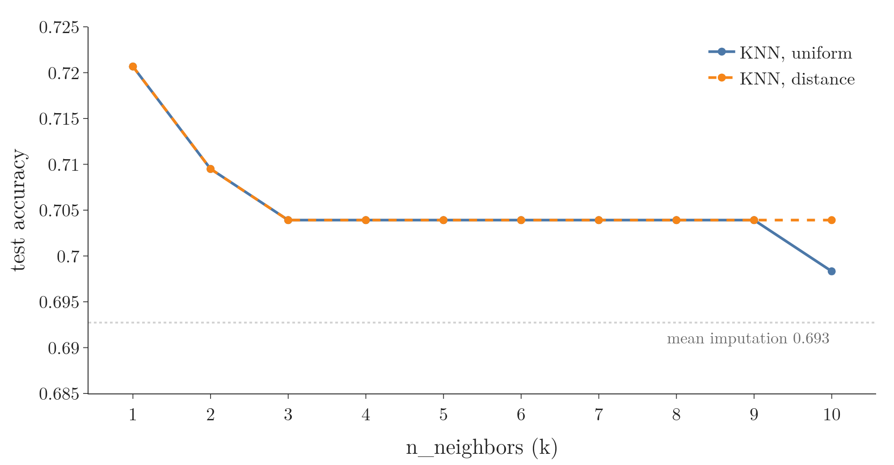

<!-- where-this-fits: generated by course_map/build_map.py; edit concepts.yaml, not this block -->
> **Where this fits:** Pipeline map step 4 (Clean). See the [Course map](../01-course-map/note.md).
>
> 
>
> - **Builds on:** K-nearest neighbours ([Note 6](../06-instance-vs-model-based/note.md)); Missing values ([Note 38](../38-missing-indicator-random-sample/note.md)); Missing indicator ([Note 38](../38-missing-indicator-random-sample/note.md)).
> - **Compare with:** Simple imputation (mean, median, mode, constant) ([Note 37](../37-missing-categorical-data/note.md)); Iterative imputation (MICE) ([Note 40](../40-iterative-imputer-mice/note.md)).
<!-- /where-this-fits -->

## 1. Overview

> **Key point:** The KNN imputer fills a gap with the average value of the k rows most similar to the row with the gap.

Notes 36 to 38 filled each gap using only its own column. This Note covers the first multivariate technique: the other columns decide which rows are similar, and those rows supply the fill value.

Figure 1 shows the difference on a small table. Row 2 has no value in column f1:

- **Univariate:** the column mean of f1 fills the gap, the same value for every row.
- **Multivariate (KNN):** columns f2 and f3 show that rows 4 and 3 are the most similar to row 2, so their f1 values fill the gap.

{width=100%}

The hard part is measuring similarity when other rows have gaps too. Section 4 covers the distance scikit-learn uses for this, called the nan-Euclidean distance.

## 2. Univariate and multivariate imputation

> **Key point:** Multivariate imputation fills a gap using the other columns of the row too; scikit-learn offers two such techniques.

Univariate imputation fills a column from that column alone, while multivariate imputation also uses the other columns of the same row (see "Imputing: filling in the gaps", section 3.2 of the [complete case analysis Note](../35-complete-case-analysis/note.md)). Its two scikit-learn techniques are the **KNN imputer** (`KNNImputer`, this Note) and the iterative imputer (`IterativeImputer`, the MICE algorithm, the [next Note](../40-iterative-imputer-mice/note.md)).

## 3. The nearest-neighbour idea

> **Key point:** Each row is a point in space; the rows closest to the row with the gap are its nearest neighbours, and their values fill the gap.

### 3.1 Rows as points

> **Key point:** A row with n numerical columns is a point in an n-dimensional space, so we can measure the distance between two rows.

A row with two numbers is a point on a flat plane; a row with three numbers is a point in 3D space. A row with four numbers is a point in 4D space: we cannot draw it, but distances work the same way.

Close points are similar rows. **Similarity** between rows is therefore measured as a distance: the smaller the distance, the more similar the rows.

### 3.2 The k nearest neighbours

> **Key point:** k is the number of neighbours we ask; with k = 1 we copy the closest row's value, with larger k we average the values of the k closest rows.

To fill a gap in row 2, we:

1. Compute the distance from row 2 to every other row.
2. Take the **k nearest neighbours**: the k rows with the smallest distances.
3. Fill the gap with the mean of their values in the missing column.

With $k = 1$, the gap gets the value of the single closest row. With $k = 2$ and neighbour values 25 and 40, it gets $(25 + 40) / 2 = 32.5$. With $k = 3$ and a third neighbour value of 30, it gets $(25 + 40 + 30) / 3 = 31.67$.

> **Extra:** The same idea gives the **k-nearest neighbours (KNN)** algorithm, a model that predicts a new row's label from its k nearest training rows. It is an instance-based learner (Note 6): it stores the training rows instead of learning a formula. The KNN imputer uses it to predict a missing value instead of a label.

## 4. Distance between rows with missing values

> **Key point:** The nan-Euclidean distance is the usual Euclidean distance computed only over the columns both rows have, then scaled up for the columns that were skipped.

### 4.1 The Euclidean distance

> **Key point:** The Euclidean distance is the straight-line distance between two points: the square root of the sum of squared differences, column by column.

1. **In words:** subtract the two rows column by column, square each difference, add them up, and take the square root.
2. **Formula:** for rows $x$ and $y$ with $n$ columns,
   $$d(x, y) = \sqrt{(x_1 - y_1)^2 + (x_2 - y_2)^2 + \dots + (x_n - y_n)^2}$$
3. **Example:** the rows $(55, 20)$ and $(52, 25)$:
   $$\sqrt{(55 - 52)^2 + (20 - 25)^2} = \sqrt{9 + 25} = 5.83$$

In 2D this is Pythagoras' theorem. Each extra dimension adds one more squared term.

### 4.2 The problem: gaps in the other rows

> **Key point:** The Euclidean distance needs every value of both rows, but in real data the neighbours have gaps too.

In Figure 1, row 1 has no f3 and row 4 has no f2. Row 2 itself has no f1, the value we want to fill. The plain formula cannot subtract a number from `NaN`.

### 4.3 The nan-Euclidean distance

> **Key point:** Skip every column where either row has `NaN`, compute the Euclidean distance on the rest, and multiply by a weight that makes up for the skipped columns.

The **nan-Euclidean distance** is the distance scikit-learn uses for data with missing values. Skipping columns makes the sum smaller, so rows with many gaps would look too close. The **weight** corrects this: total number of columns divided by the number of columns both rows have.

1. **In words:** keep only the columns where both rows have a value, add up their squared differences, multiply by (all columns / used columns), and take the square root.
2. **Formula:** with $n$ columns in total and $p$ columns present in both rows,
   $$d(x, y) = \sqrt{\frac{n}{p} \sum_{j \text{ present in both}} (x_j - y_j)^2}$$
3. **Example:** row 2 is $(\text{NaN}, 55, 20)$ and row 3 is $(40, 52, 25)$. Only f2 and f3 are present in both, so $p = 2$ and the weight is $3/2$:
   $$d = \sqrt{\frac{3}{2} \times \big((55 - 52)^2 + (20 - 25)^2\big)} = \sqrt{1.5 \times 34} = 7.14$$

When both rows are complete, $p = n$, the weight is 1, and the formula is the ordinary Euclidean distance.

### 4.4 All distances for the example

> **Key point:** Row 4 is the nearest neighbour of row 2 (3.46), then row 3 (7.14).

Figure 2 computes the distance from row 2 to each of the other four rows. f1 is never used, because row 2 has no f1; rows 1 and 4 lose one more column each.

{width=100%}

- **Row 1** $(30, 60, \text{NaN})$: only f2 is shared, so $\sqrt{3 \times (55 - 60)^2} = \sqrt{75} = 8.66$.
- **Row 4** $(25, \text{NaN}, 22)$: only f3 is shared, so $\sqrt{3 \times (20 - 22)^2} = \sqrt{12} = 3.46$.
- **Row 5** $(50, 70, 40)$: f2 and f3 are shared, so $\sqrt{1.5 \times (15^2 + 20^2)} = \sqrt{937.5} = 30.62$.

> **Extra:** Row 4 comes out nearest using a single shared column. The fewer columns two rows share, the less reliable their distance is. The weight fixes the size of the distance, not how much evidence is behind it.

> **Python:** scikit-learn computes the whole row of distances in one call.
>
> ```python
> from sklearn.metrics.pairwise import nan_euclidean_distances
> nan_euclidean_distances(toy[[1]], toy)
> # [[ 8.66  0.    7.14  3.46 30.62]]
> ```
>
> `toy` is the 5-row table as a numpy array with `np.nan` in the gaps. `toy[[1]]` is row 2 (Python counts from 0), kept as a one-row table.

## 5. Filling the gap step by step

> **Key point:** Distances, then the k nearest rows, then the mean of their values: with k = 2, row 2 gets $(25 + 40) / 2 = 32.5$.

Figure 3 runs the whole process on the example:

1. Row 2 has a gap in f1.
2. The nan-Euclidean distance to every other row: 8.66, 7.14, 3.46, 30.62.
3. With $k = 2$, the nearest rows are row 4 (3.46) and row 3 (7.14).
4. Their f1 values, 25 and 40, are averaged: $(25 + 40)/2 = 32.5$.


The column mean of f1 would have given 36.25 (Figure 1). The KNN value is lower because the rows most like row 2 have lower f1 values.

> **Extra:** Only rows that have a value in the missing column can be neighbours. In scikit-learn, those rows are called donors. A row with its own gap in f1 is skipped when filling f1, however close it is.

## 6. Advantages and disadvantages

> **Key point:** The KNN imputer is usually more accurate than mean or median imputation, but it is slow on large data and the whole training set must be kept for production.

**Advantage:**

- **More accurate.** The fill value comes from similar rows, not from the whole column. It usually gives better results than mean and median imputation, especially on small and medium datasets.

**Disadvantages:**

1. **Many calculations.** For every row with a gap, the distance to every training row is computed and the distances are sorted. On a large dataset this takes a long time.
2. **The training set goes to production.** A new row with a gap arrives after deployment. Its neighbours are searched among the training rows, so the whole training set must be stored on the server. This uses memory and slows each prediction down.

## 7. KNN imputation with scikit-learn

> **Key point:** `KNNImputer` stores the training rows with `fit` and fills gaps with `transform`; `n_neighbors` and `weights` are the settings worth tuning.

### 7.1 The main parameters

> **Key point:** Usually only `n_neighbors` and `weights` need changing; the defaults for missing values and the distance are already right.

| Parameter | Meaning | Default |
|---|---|---|
| `missing_values` | what counts as missing | `np.nan` |
| `n_neighbors` | k, the number of neighbours averaged | 5 |
| `weights` | `"uniform"` (plain mean) or `"distance"` (nearer rows count more) | `"uniform"` |
| `metric` | the distance between rows | `"nan_euclidean"` |
| `add_indicator` | also add a 0/1 column marking each gap | `False` |
| `keep_empty_features` | keep a column that is missing everywhere | `False` |

`add_indicator=True` adds the missing indicator of Notes 35 and 38: a column that is 1 where the value was missing and 0 elsewhere. It sometimes helps the model. Section 7.6 tries it.

### 7.2 The data and the split

> **Key point:** We fill `Age` on the Titanic data from `Pclass` and `Fare`, after splitting into training and test sets.

The data is four columns of the Kaggle Titanic `train.csv`, 891 passengers: `Age`, `Pclass`, `Fare` and the target `Survived`. Only `Age` has gaps: 19.9% of its values are missing.

We split 80/20 with `random_state=2`: 712 training rows (148 `Age` gaps) and 179 test rows. The imputer is fitted on the training set only, so no test row can be a neighbour.

> **Python:** KNN imputation, then logistic regression.
>
> ```python
> knn = KNNImputer(n_neighbors=3, weights="distance")
> X_train_trf = knn.fit_transform(X_train)
> X_test_trf = knn.transform(X_test)
>
> lr = LogisticRegression()
> lr.fit(X_train_trf, y_train)
> accuracy_score(y_test, lr.predict(X_test_trf))
> # 0.704
> ```
>
> `fit` only stores the training rows; there is nothing else to learn. `transform` then finds each gap's neighbours among those stored rows, for the training set and the test set alike.

### 7.3 Comparison with mean imputation

> **Key point:** On the same split, mean imputation reaches 0.693 test accuracy and the KNN imputer 0.704.

Replacing `KNNImputer` with `SimpleImputer()` (mean imputation, Note 36) and keeping everything else the same gives an accuracy of 0.693.

> **Extra:** The test set has 179 passengers, so one passenger is worth $1/179 = 0.0056$ of accuracy. The gap from 0.693 to 0.704 is two passengers. On a test set this small, a cross-validated score (a later Note) is a fairer comparison.

### 7.4 Choosing k

> **Key point:** k has no correct value in advance: we try several and keep the best.

The default k is 5. Figure 4 tries $k = 1$ to $10$ with both weightings; the dotted line is mean imputation.

{width=100%}

On this split, $k = 1$ scores best (0.721), $k = 3$ to $9$ all give 0.704, and every k beats mean imputation. In practice we loop over k, or use grid search (a later Note), instead of trying values by hand.

### 7.5 Distance weighting

> **Key point:** With `weights="distance"`, each neighbour's value is weighted by 1 / distance, so the nearer neighbour counts more.

With `weights="uniform"` all k neighbours count equally. But a neighbour at distance 3.46 is more like our row than one at 7.14, so it should have more say.

1. **In words:** multiply each neighbour's value by 1 / its distance, add them up, and divide by the sum of the 1 / distance weights.
2. **Formula:** for neighbours with values $v_i$ at distances $d_i$,
   $$\text{fill} = \frac{\sum_i v_i / d_i}{\sum_i 1 / d_i}$$
3. **Example:** row 4 (value 25, distance 3.46) and row 3 (value 40, distance 7.14):
   $$\frac{25 / 3.46 + 40 / 7.14}{1 / 3.46 + 1 / 7.14} = \frac{7.22 + 5.60}{0.289 + 0.140} = \frac{12.82}{0.429} = 29.90$$

The uniform fill was 32.5; the weighted fill 29.90 sits closer to row 4's value of 25. Dividing by the sum of the weights, instead of by k, keeps the result between the neighbours' values.

On the Titanic split, both weightings give the same accuracy for $k \le 9$ (Figure 4). They do fill different ages: 41% of the 148 training gaps get a different value. Whether that changes accuracy depends on the data, so we try both.

### 7.6 Adding a missing indicator

> **Key point:** `add_indicator=True` appends a `missingindicator_Age` column; on this split the accuracy stays at 0.704.

> **Python:** The extra column and its name.
>
> ```python
> knn_ind = KNNImputer(n_neighbors=3, weights="distance",
>                      add_indicator=True)
> knn_ind.fit_transform(X_train)
> knn_ind.get_feature_names_out()
> # ['Age' 'Pclass' 'Fare' 'missingindicator_Age']
> ```

> **Extra:** The distance treats all columns alike, so a column with large numbers dominates it. `Fare` runs from 0 to 512 while `Pclass` runs from 1 to 3, so the neighbours here are chosen almost only by `Fare`. Scaling the columns first (Notes 24 and 25) gives each column a fair say. scikit-learn's scalers skip `NaN` when they fit, so `StandardScaler` can go before `KNNImputer`. On this split it did not change the accuracy at $k = 3$.

## 8. Summary

| | Mean or median imputation | KNN imputer |
|---|---|---|
| Kind | univariate | multivariate |
| Fill value | one value per column | the mean of the k nearest rows' values |
| Uses other columns | no | yes, to find similar rows |
| Accuracy (Titanic, logistic regression) | 0.693 | 0.704 ($k = 3$), 0.721 ($k = 1$) |
| Speed | instant | a distance to every training row per gap |
| Kept for production | one number per column | the whole training set |
| scikit-learn | `SimpleImputer` | `KNNImputer` |

- The KNN imputer fills a gap with the mean value of the k rows nearest to the row with the gap.
- Distances between rows with gaps use the nan-Euclidean distance: skip the columns where either row has `NaN`, then multiply by (all columns / used columns).
- `n_neighbors` (k) and `weights` (`"uniform"` or `"distance"`) are tuned by trying several values.
- `weights="distance"` weights each neighbour by 1 / distance and divides by the sum of the weights.
- Fit on the training set only; test rows and new rows get their neighbours from the training rows.
- It is usually more accurate than mean or median imputation, but slow on large data and heavy in production.

## 9. Key terms

| Term | Meaning |
|---|---|
| KNN imputer | Filling a gap with the mean of that column in the k rows nearest to the row with the gap |
| Nearest neighbours | The rows at the smallest distance from a given row |
| `n_neighbors` (k) | The number of nearest rows the KNN imputer averages; default 5 |
| Euclidean distance | The straight-line distance between two rows: square root of the summed squared differences |
| nan-Euclidean distance | The Euclidean distance over the columns both rows have, scaled by (all columns / used columns) |
| Distance weight (nan-Euclidean) | All columns divided by the columns present in both rows; makes up for the skipped columns |
| Uniform weighting | Every neighbour counts equally: the fill is their plain mean |
| Distance weighting | Each neighbour counts in proportion to 1 / its distance, so nearer rows count more |
| Donor | A row that has a value in the column being filled, so it can be a neighbour |
| `KNNImputer` | scikit-learn's class for KNN imputation |
