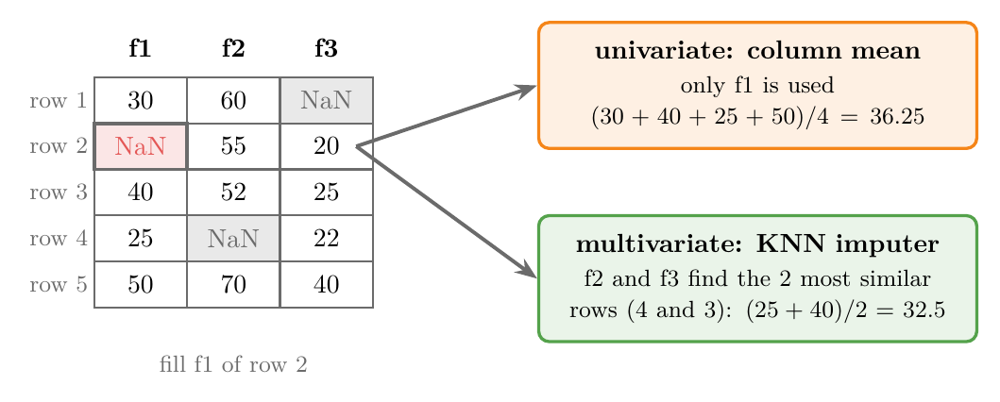
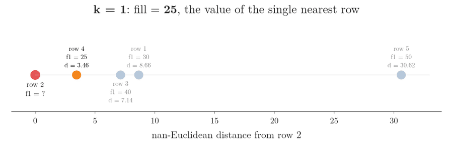
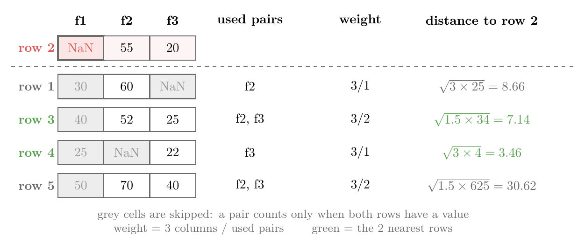
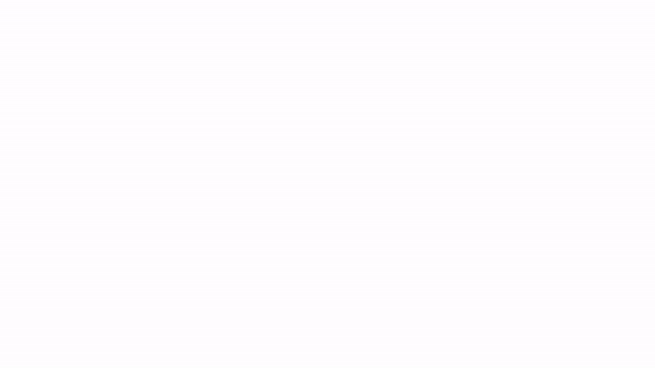
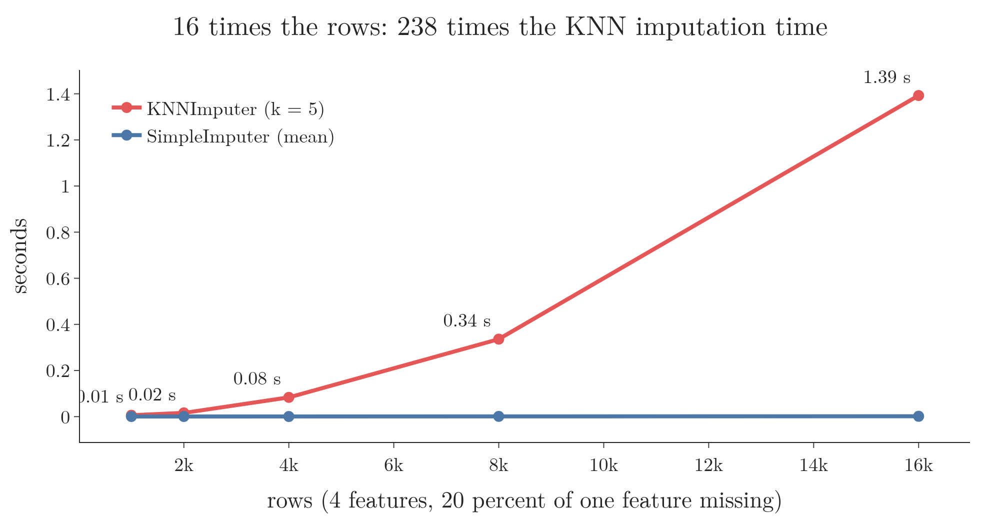
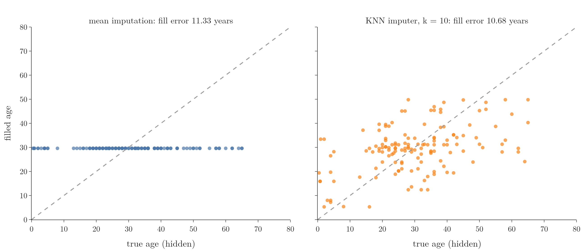
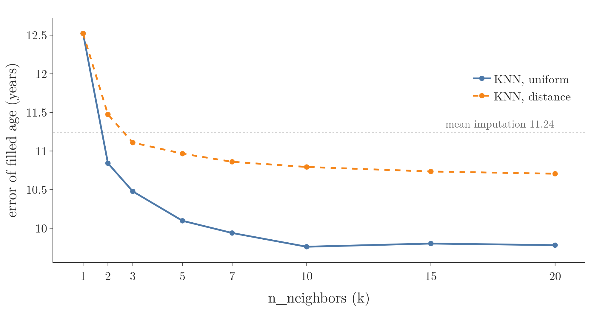

<!-- where-this-fits: generated by course_map/build_map.py; edit concepts.yaml, not this block -->
> **Where this fits:** Pipeline map steps 0 (Foundations), 4 (Clean). See the [Course map](../01-course-map/note.md).
>
> 
>
> - **Builds on:** K-nearest neighbours ([Note 6](../06-instance-vs-model-based/note.md)); Missing values ([Note 38](../38-missing-indicator-random-sample/note.md)); Missing indicator ([Note 38](../38-missing-indicator-random-sample/note.md)).
> - **Leads to:** Regularisation ([Note 63](../63-ridge-regression-intuition/note.md)); K-nearest neighbours ([Note 91](../91-knn/note.md)).
> - **Compare with:** Simple imputation (mean, median, mode, constant) ([Note 37](../37-missing-categorical-data/note.md)); Iterative imputation (MICE) ([Note 40](../40-iterative-imputer-mice/note.md)); Cosine similarity ([Note 362](../362-dot-product-and-cosine-similarity/note.md)).
<!-- /where-this-fits -->

## 1. Overview

> **Key point:** The KNN imputer fills a gap with the average value of the k observations most similar to the observation with the gap.

Two words first. A **feature** (G-772) is an input variable: one column of the data table. An **observation** (G-1374) is one record: one row of the table. The **target** (G-1949) is the output we predict.

Notes 36 to 38 filled each gap using only its own feature. This Note covers the first multivariate technique: the other features decide which observations are similar, and those observations supply the fill value. Think of guessing a new neighbour's income: the town average is one guess, but the incomes of the people living in the most similar houses on the same street are a better one.

Figure 1 shows the difference on a small table. Row 2 has no value in feature f1:

- **Univariate:** the mean of f1 fills the gap, the same value for every observation.
- **Multivariate (KNN):** features f2 and f3 show that rows 4 and 3 are the most similar to row 2, so their f1 values fill the gap.

{width=100%}

The hard part is measuring similarity when other observations have gaps too. Section 4 covers the distance scikit-learn uses for this, called the nan-Euclidean distance.

## 2. Univariate and multivariate imputation

> **Key point:** Multivariate imputation fills a gap using the other features of the observation too; scikit-learn offers two such techniques.

Univariate imputation fills a feature from that feature alone, while multivariate imputation also uses the other features of the same observation (see "Imputing: filling in the gaps", section 3.2 of the [complete case analysis Note](../35-complete-case-analysis/note.md)). The two multivariate techniques in scikit-learn are the **KNN imputer** (G-1017; `KNNImputer`, this Note) and the **iterative imputer** (G-978) (`IterativeImputer`, the MICE algorithm, the [next Note](../40-iterative-imputer-mice/note.md)).

## 3. The nearest-neighbour idea

> **Key point:** Each observation is a point in space; the observations closest to the one with the gap are its nearest neighbours, and their values fill the gap.

### 3.1 Observations as points

> **Key point:** An observation with n numerical features is a point in an n-dimensional space, so we can measure the distance between two observations.

An observation with two numbers is a point on a flat plane; one with three numbers is a point in 3D space. One with four numbers is a point in 4D space: we cannot draw it, but distances work the same way.

Close points are similar observations. **Similarity** (G-1805) between observations is therefore measured as a distance: the smaller the distance, the more similar the observations.

### 3.2 The k nearest neighbours

> **Key point:** k is the number of neighbours we ask; with k = 1 we copy the closest observation's value, with larger k we average the values of the k closest.

To fill a gap in row 2, we:

1. Compute the distance from row 2 to every other row.
2. Take the **k nearest neighbours**: the k observations with the smallest distances.
3. Fill the gap with the mean of their values in the missing feature.

With $k = 1$, the gap gets the value of the single closest observation. With $k = 2$ and neighbour values 25 and 40, it gets $(25 + 40) / 2 = 32.5$. With $k = 3$ and a third neighbour value of 30, it gets $(25 + 40 + 30) / 3 = 31.67$.

Figure 2 lays out the other rows of the Note's example by their distance from row 2 (section 4 computes these distances) and grows $k$ from 1 to 4. With $k = 4$ the far row 5 joins and pulls the fill up to 36.25, which is why a very large $k$ starts to behave like the plain column mean.

{height=30%}

> **Extra:** The same idea gives the **k-nearest neighbours (KNN)** (G-998) algorithm, a model that predicts a new observation's label from its k nearest training observations. KNN is an **instance-based learner** (G-955; Note 6): it stores the training observations instead of learning a formula. The KNN imputer uses the same search to predict a missing value instead of a label.

## 4. Distance between observations with missing values

> **Key point:** The nan-Euclidean distance is the usual Euclidean distance computed only over the features both observations have, then scaled up for the features that were skipped.

### 4.1 The Euclidean distance

> **Key point:** The Euclidean distance is the straight-line distance between two points: the square root of the sum of squared differences, feature by feature.

1. **In words:** subtract the two observations feature by feature, square each difference, add them up, and take the square root.
2. **Formula:** for observations $x$ and $y$ with $n$ features,
   $$d(x, y) = \sqrt{(x_1 - y_1)^2 + (x_2 - y_2)^2 + \dots + (x_n - y_n)^2}$$
3. **Example:** the observations $(55, 20)$ and $(52, 25)$:
   $$\sqrt{(55 - 52)^2 + (20 - 25)^2} = \sqrt{9 + 25} = 5.83$$

In 2D the Euclidean distance is Pythagoras' theorem. Each extra dimension adds one more squared term.

### 4.2 The problem: gaps in the other observations

> **Key point:** The Euclidean distance needs every value of both observations, but in real data the neighbours have gaps too.

In Figure 1, row 1 has no f3 and row 4 has no f2. Row 2 itself has no f1, the value we want to fill. The plain formula cannot subtract a number from `NaN`.

### 4.3 The nan-Euclidean distance

> **Key point:** Skip every feature where either observation has `NaN`, compute the Euclidean distance on the rest, and multiply by a weight that makes up for the skipped features.

The **nan-Euclidean distance** (G-1302) is the distance scikit-learn uses for data with missing values. Skipping features makes the sum smaller, so observations with many gaps would look too close. The **weight** corrects this: the total number of features divided by the number of features both observations have. The weighted formula is the one scikit-learn uses (scikit-learn docs, nan_euclidean_distances; Dixon 1979).

1. **In words:** keep only the features where both observations have a value, add up their squared differences, multiply by (all features / used features), and take the square root.
2. **Formula:** with $n$ features in total and $p$ features present in both observations,
   $$d(x, y) = \sqrt{\frac{n}{p} \sum_{j \text{ present in both}} (x_j - y_j)^2}$$
3. **Example:** row 2 is $(\text{NaN}, 55, 20)$ and row 3 is $(40, 52, 25)$. Only f2 and f3 are present in both, so $p = 2$ and the weight is $3/2$:
   $$d = \sqrt{\frac{3}{2} \times \big((55 - 52)^2 + (20 - 25)^2\big)} = \sqrt{1.5 \times 34} = 7.14$$

When both observations are complete, $p = n$, the weight is 1, and the formula is the ordinary Euclidean distance.

### 4.4 All distances for the example

> **Key point:** Row 4 is the nearest neighbour of row 2 (3.46), then row 3 (7.14).

Figure 3 computes the distance from row 2 to each of the other four rows. f1 is never used, because row 2 has no f1; rows 1 and 4 lose one more feature each.

{width=100%}

- **Row 1** $(30, 60, \text{NaN})$: only f2 is shared, so $\sqrt{3 \times (55 - 60)^2} = \sqrt{75} = 8.66$.
- **Row 4** $(25, \text{NaN}, 22)$: only f3 is shared, so $\sqrt{3 \times (20 - 22)^2} = \sqrt{12} = 3.46$.
- **Row 5** $(50, 70, 40)$: f2 and f3 are shared, so $\sqrt{1.5 \times (15^2 + 20^2)} = \sqrt{937.5} = 30.62$.

> **Extra:** Row 4 comes out nearest using a single shared feature; its f2 is unknown. Had its f2 been 55, the distance over f2 and f3 would be $\sqrt{1.5 \times (0^2 + 2^2)} = 2.45$; had it been 90, it would be $\sqrt{1.5 \times (35^2 + 2^2)} = 42.94$, farther than every other row. So the fewer features two observations share, the wider the range the true distance could lie in. The weight fixes the size of the distance, not this uncertainty.

> **Python:** scikit-learn computes the whole set of distances in one call.
>
> ```python
> from sklearn.metrics.pairwise import nan_euclidean_distances
> nan_euclidean_distances(toy[[1]], toy)
> # [[ 8.66  0.    7.14  3.46 30.62]]
> ```
>
> `toy` is the 5-row table as a numpy array with `np.nan` in the gaps. `toy[[1]]` is row 2 (Python counts from 0), kept as a one-row table.

## 5. Filling the gap step by step

> **Key point:** Distances, then the k nearest observations, then the mean of their values: with k = 2, row 2 gets $(25 + 40) / 2 = 32.5$.

Figure 4 runs the whole process on the example:

1. Row 2 has a gap in f1.
2. The nan-Euclidean distance to every other row: 8.66, 7.14, 3.46, 30.62.
3. With $k = 2$, the nearest rows are row 4 (3.46) and row 3 (7.14).
4. Their f1 values, 25 and 40, are averaged: $(25 + 40)/2 = 32.5$.



The mean of f1 would have given 36.25 (Figure 1). The KNN value is lower because the observations most like row 2 have lower f1 values.

> **Extra:** Only observations that have a value in the missing feature can be neighbours. These observations are called donors. An observation with its own gap in f1 is skipped when filling f1, however close it is (scikit-learn docs, Nearest neighbors imputation).

## 6. Advantages and disadvantages

> **Key point:** The KNN imputer usually fills values closer to the truth than mean imputation, but it is slow on large data and the whole training set must be kept for production.

**Advantage:**

- **More accurate fills.** The fill value comes from similar observations, not from the whole feature. On gene-expression data, KNN imputation recovered hidden values with less error than filling with an average (Troyanskaya et al. 2001). Section 7.3 runs the same test on the Titanic data.

**Disadvantages:**

1. **Many calculations.** For every observation with a gap, the distance to every training observation is computed and the distances are sorted. On a large dataset this takes a long time. In Figure 5, on synthetic data, 16 times more rows made `KNNImputer` more than 100 times slower on our machine, because both the number of gaps and the number of rows to compare each gap with grow; mean imputation stays near zero.
2. **The training set goes to production.** A new observation with a gap arrives after deployment. Its neighbours are searched among the training observations, so the whole training set must be stored on the server. This storage uses memory and slows each prediction down.

{height=32%}

## 7. KNN imputation with scikit-learn

> **Key point:** `KNNImputer` stores the training observations with `fit` and fills gaps with `transform`; `n_neighbors` and `weights` are the settings worth tuning.

### 7.1 The main parameters

> **Key point:** Usually only `n_neighbors` and `weights` need changing; the defaults for missing values and the distance are already right.

| Parameter | Meaning | Default |
|---|---|---|
| `missing_values` | what counts as missing | `np.nan` |
| `n_neighbors` | k, the number of neighbours averaged | 5 |
| `weights` | `"uniform"` (plain mean) or `"distance"` (nearer observations count more) | `"uniform"` |
| `metric` | the distance between observations | `"nan_euclidean"` |
| `add_indicator` | also add a 0/1 column marking each gap | `False` |
| `keep_empty_features` | keep a column that is missing everywhere | `False` |

`add_indicator=True` adds the missing indicator of Notes 35 and 38: a feature that is 1 where the value was missing and 0 elsewhere. Section 7.6 shows it.

### 7.2 The data and the split

> **Key point:** We fill `Age` on the Titanic data from `Pclass` and `Fare`, after splitting into training and test sets.

The data is the Kaggle Titanic `train.csv`, 891 passengers. We start with three features, `Age`, `Pclass` and `Fare`, and the target `Survived`. Only `Age` has gaps: 19.9% of its values are missing.

We split 80/20 with `random_state=2`: 712 training observations (148 `Age` gaps) and 179 test observations. The imputer is fitted on the training set only, so no test observation can be a neighbour.

> **Python:** KNN imputation, then logistic regression.
>
> ```python
> knn = KNNImputer(n_neighbors=3, weights="distance")
> X_train_trf = knn.fit_transform(X_train)
> X_test_trf = knn.transform(X_test)
>
> lr = LogisticRegression()
> lr.fit(X_train_trf, y_train)
> accuracy_score(y_test, lr.predict(X_test_trf))
> # 0.704
> ```
>
> `fit` only stores the training observations; there is nothing else to learn. `transform` then finds each gap's neighbours among those stored observations, for the training set and the test set alike.

Replacing `KNNImputer` with `SimpleImputer()` (mean imputation, Note 36) and keeping everything else the same gives an accuracy of 0.693.

### 7.3 Is the KNN fill closer to the truth?

> **Key point:** When we hide ages we know and fill them back, the KNN imputer misses the true age by 9.76 years on average, mean imputation by 11.24 years.

A fair test of an imputer is to hide values we know, fill them, and check the fills against the truth, like covering answers in a quiz and grading the guesses. We take the 714 passengers whose age is known and hide the ages of a random 20% of them. Each method fills the hidden ages from the other 80%. The **fill error** is the average gap, in years, between the filled age and the true age.

| Method | Fill error (years) |
|---|---|
| Mean imputation | 11.24 |
| KNN imputer, $k = 10$, features scaled | 9.76 |

The KNN fills are 13% closer to the truth. Figure 6 shows one of the 20 splits. Mean imputation gives all 143 hidden passengers the same age, a flat line; the KNN fills follow the true ages upwards, though loosely, and several young children get young fills, which the mean can never do.



Conditions: four features choose the neighbours (`Pclass`, `Fare`, `SibSp` = siblings and spouses aboard, `Parch` = parents and children aboard), all scaled first (Section 7.7), uniform weights; the error is averaged over 20 random splits.

> **Extra:** A better fill does not always move a model's accuracy. Logistic regression on the same five features, averaged over 20 splits, scores 0.706 after mean imputation and 0.703 after KNN imputation. Dropping `Age` altogether gives 0.689, so `Age` adds under 2 points to this model, and a closer fill has little room to show. The single split of Section 7.2 (0.704 against 0.693) differs by two of the 179 test passengers.

### 7.4 Choosing k

> **Key point:** Too few neighbours give noisy fills; the error falls as k grows and levels off around k = 10.

The default k is 5. Figure 7 repeats the hidden-age test for $k = 1$ to $20$ with both weightings; the dotted line is mean imputation.

{width=100%}

- **k = 1** copies one passenger's age and is worse than the mean (12.52 years). One person's age carries that person's own quirks.
- **Larger k** averages several neighbours, so the quirks cancel out: the error drops below the mean from $k = 2$ and levels off from $k = 10$ (9.76 years).

Averaging more neighbours lowers the variance of a KNN estimate (ESL §2.9); Troyanskaya et al. (2001) also found that KNN imputation changes little for $k$ between 10 and 20. In practice we loop over k, or use **grid search** (G-872; a later Note), instead of trying values by hand.

### 7.5 Distance weighting

> **Key point:** With `weights="distance"`, each neighbour's value is weighted by 1 / distance, so the nearer neighbour counts more.

With `weights="uniform"` all k neighbours count equally. With `weights="distance"`, a neighbour at distance 3.46 counts more than one at 7.14.

1. **In words:** multiply each neighbour's value by 1 / its distance, add them up, and divide by the sum of the 1 / distance weights.
2. **Formula:** for neighbours with values $v_i$ at distances $d_i$,
   $$\text{fill} = \frac{\sum_i v_i / d_i}{\sum_i 1 / d_i}$$
3. **Example:** row 4 (value 25, distance 3.46) and row 3 (value 40, distance 7.14):
   $$\frac{25 / 3.46 + 40 / 7.14}{1 / 3.46 + 1 / 7.14} = \frac{7.22 + 5.60}{0.289 + 0.140} = \frac{12.82}{0.429} = 29.90$$

The uniform fill was 32.5; the weighted fill 29.90 sits closer to row 4's value of 25. Dividing by the sum of the weights, instead of by k, keeps the result between the neighbours' values.

On the Titanic ages, uniform weighting gives the smaller error at every $k \ge 2$ (Figure 7). Distance weighting pulls each fill toward the single nearest passenger, and Section 7.4 showed that leaning on one passenger is the noisiest choice. Which weighting wins depends on the data, so we try both.

### 7.6 Adding a missing indicator

> **Key point:** `add_indicator=True` appends a `missingindicator_Age` feature that marks the passengers whose age was filled.

> **Python:** The extra feature and its name.
>
> ```python
> knn_ind = KNNImputer(n_neighbors=3, weights="distance",
>                      add_indicator=True)
> knn_ind.fit_transform(X_train)
> knn_ind.get_feature_names_out()
> # ['Age' 'Pclass' 'Fare' 'missingindicator_Age']
> ```

On the split of Section 7.2 the test accuracy stays at 0.704 with the indicator.

### 7.7 Scale the features first

> **Key point:** Scale before the KNN imputer, or the feature with the largest numbers chooses the neighbours alone.

The distance adds up squared differences, so a feature with large numbers dominates it. `Fare` runs from 0 to 512 while `Pclass` runs from 1 to 3: unscaled, the neighbours are chosen almost by `Fare` alone, like judging how alike two people are by their bank balance and ignoring everything else. Scaling the features first (Notes 24 and 25) gives each one a fair say. `StandardScaler` can go before `KNNImputer`, because it skips `NaN` when it fits (scikit-learn docs, StandardScaler).

In the hidden-age test ($k = 10$), scaling lowers the fill error from 10.66 to 9.76 years.

> **Extra:** Two checks on the split of Section 7.2 ($k = 3$, distance weighting, three features). Removing `Pclass` leaves 81% of the 148 filled ages exactly the same, so `Pclass` barely matters when unscaled. Scaling first changes 74% of them. The test accuracy is 0.704 either way.

## 8. Summary

| | Mean or median imputation | KNN imputer |
|---|---|---|
| Kind | univariate | multivariate |
| Fill value | one value per feature | the mean of the k nearest observations' values |
| Uses other features | no | yes, to find similar observations |
| Fill error, hidden Titanic ages | 11.24 years | 9.76 years ($k = 10$, scaled) |
| Speed | instant | a distance to every training observation per gap |
| Kept for production | one number per feature | the whole training set |
| scikit-learn | `SimpleImputer` | `KNNImputer` |

- The KNN imputer fills a gap with the mean value of the k observations nearest to the observation with the gap.
- Distances between observations with gaps use the nan-Euclidean distance: skip the features where either observation has `NaN`, then multiply by (all features / used features).
- Scale the features first, or the largest one chooses the neighbours.
- `n_neighbors` (k) and `weights` (`"uniform"` or `"distance"`) are tuned by trying several values; k = 1 is noisy.
- `weights="distance"` weights each neighbour by 1 / distance and divides by the sum of the weights.
- Fit on the training set only; test observations and new observations get their neighbours from the training set.
- The KNN imputer usually fills closer to the truth than mean or median imputation, but it is slow on large data and heavy in production.

## 9. Sources

**Built from**

- CampusX, "KNN Imputer | Multivariate Imputation | Handling Missing Data Part 5", YouTube, https://www.youtube.com/watch?v=-fK-xEev2I8

**Other references**

- Dixon, J. K. (1979). Pattern Recognition with Partly Missing Data. *IEEE Transactions on Systems, Man, and Cybernetics* 9(10), 617–621.
- ESL: Hastie, T., Tibshirani, R. and Friedman, J. (2009). *The Elements of Statistical Learning*, 2nd ed. Springer. §2.9, Model Selection and the Bias–Variance Tradeoff (variance of the k-nearest-neighbour estimate falls as k grows).
- Troyanskaya, O. et al. (2001). Missing value estimation methods for DNA microarrays. *Bioinformatics* 17(6), 520–525.
- scikit-learn API reference: `sklearn.metrics.pairwise.nan_euclidean_distances`; `StandardScaler`. User Guide, *Nearest neighbors imputation*. scikit-learn.org.

## 10. Key terms

| Term | Meaning |
|---|---|
| Feature | An input variable: one column of the data table |
| Observation | One record: one row of the data table |
| Target | The output we predict |
| KNN imputer | Filling a gap with the mean of that feature in the k observations nearest to the observation with the gap |
| Nearest neighbours | The observations at the smallest distance from a given observation |
| `n_neighbors` (k) | The number of nearest observations the KNN imputer averages; default 5 |
| Euclidean distance | The straight-line distance between two observations: square root of the summed squared differences |
| nan-Euclidean distance | The Euclidean distance over the features both observations have, scaled by (all features / used features) |
| Distance weight (nan-Euclidean) | All features divided by the features present in both observations; makes up for the skipped features |
| Uniform weighting | Every neighbour counts equally: the fill is their plain mean |
| Distance weighting | Each neighbour counts in proportion to 1 / its distance, so nearer observations count more |
| Donor | An observation that has a value in the feature being filled, so it can be a neighbour |
| Fill error | The average gap between filled values and the true values they replace, measured on values we hid on purpose |
| `KNNImputer` | scikit-learn's class for KNN imputation |
