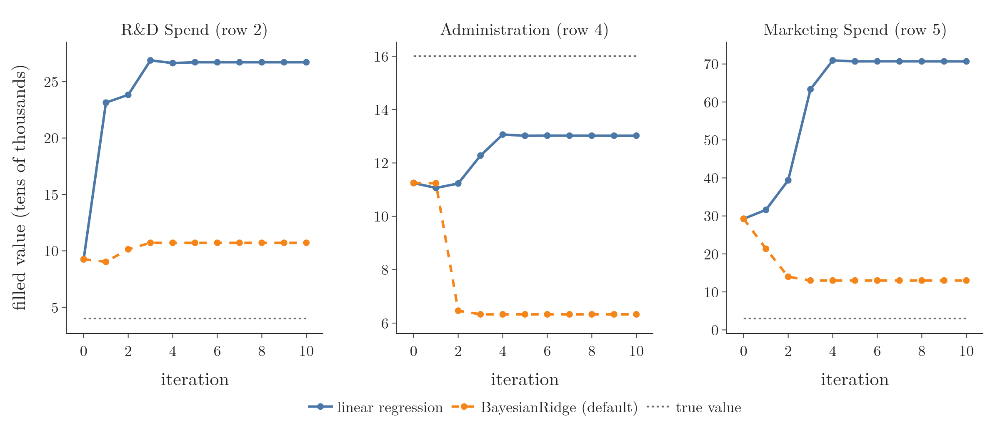

<!-- where-this-fits: generated by course_map/build_map.py; edit concepts.yaml, not this block -->
> **Where this fits:** Pipeline map step 4 (Clean). See the [Course map](../01-course-map/note.md).
>
> 
>
> - **Builds on:** Simple imputation (mean, median, mode, constant) ([Note 37](../37-missing-categorical-data/note.md)); Missing values ([Note 38](../38-missing-indicator-random-sample/note.md)).
> - **Compare with:** KNN imputer ([Note 39](../39-knn-imputer/note.md)).
<!-- /where-this-fits -->

## 1. Overview

> **Key point:** MICE fills every gap with its column mean first, then improves the fills one column at a time with a model trained on the other columns, and repeats until the fills stop changing.

The KNN imputer (Note 39) was the first multivariate technique: it fills a gap from the rows most similar to the row with the gap. This Note covers the second one, the **iterative imputer**. It turns each column with gaps into a small prediction problem: that column is the output, the other columns are the inputs.

The algorithm behind it is **MICE**, short for **Multivariate Imputation by Chained Equations**. Figure 1 shows the whole loop:

- **Step 0:** fill every gap with the mean of its column.
- **One iteration:** for each column in turn, put its gaps back to NaN, train a model on the rows without a gap, and predict the gaps.
- **Stop** when the fills hardly change from one iteration to the next.

{width=100%}

Each model is one "equation" that predicts one column. The equations are "chained" because each one uses the latest fills of the others.

## 2. When to use MICE

> **Key point:** MICE suits data that is missing at random (MAR): the gaps can be predicted from the other columns.

Note 35 (Section 5) names three ways in which data goes missing:

- **MCAR (missing completely at random):** the value was never collected, for no reason related to the data.
- **MAR (missing at random):** whether a value is missing depends on other columns we can see, for example people who skip an optional form field. The other columns carry information about the missing value.
- **MNAR (missing not at random):** the value was left out on purpose, because of the value itself. The other columns say little about it.

MICE predicts a missing value from the other columns. That works best when those columns are related to it, which is the MAR case. We can run MICE on any data, but it gives its best results under MAR.

## 3. Advantages and disadvantages

> **Key point:** MICE is usually more accurate than simpler imputers, but it is slow and the training set must be kept for production.

**Advantage:**

- **Accurate.** The fills come from a model that uses every other column, so they are usually more accurate than mean or median imputation.

**Disadvantages:**

1. **Slow.** Every iteration trains one model per column with gaps, and we run several iterations. On large data this takes time.
2. **Memory in production.** A new row with a gap must be filled from the training data, so the training set is kept on the server, as with the KNN imputer.

> **Extra:** scikit-learn's `IterativeImputer` keeps the fitted models, one per column and iteration, in its attribute `imputation_sequence_`, rather than the raw rows (scikit-learn docs, IterativeImputer). Filling a new row then means running those models again. Either way, more is stored and computed than for one mean per column.

## 4. The example table

> **Key point:** Five startups, three spend columns, one gap in each column.

The data is the "50 Startups" dataset: for 50 companies, the money spent on R&D, administration and marketing, and the profit. We keep only the three spend columns, because imputation is done on the input columns, not on the target `Profit`.

To follow every step by hand, we:

1. Divide all amounts by 10,000 dollars and round to whole numbers.
2. Keep 5 random rows.
3. Hide one value in each column.

| Row | R&D | Administration | Marketing |
|---|---|---|---|
| 1 | 8 | 15 | 30 |
| 2 | **NaN** (4) | 5 | 20 |
| 3 | 15 | 10 | 41 |
| 4 | 12 | **NaN** (16) | 26 |
| 5 | 2 | 15 | **NaN** (3) |

The numbers in brackets are the hidden true values. The algorithm never sees them; we use them at the end to judge the fills.

## 5. Step 0: fill with the column means

> **Key point:** The first guess for every gap is the mean of its column: 9.25, 11.25 and 29.25.

MICE needs a complete table to train its first models, so it starts with the simplest fill (Note 36):

- **R&D:** $(8 + 15 + 12 + 2) / 4 = 9.25$
- **Administration:** $(15 + 5 + 10 + 15) / 4 = 11.25$
- **Marketing:** $(30 + 20 + 41 + 26) / 4 = 29.25$

This table is **iteration 0**. The mean ignores the other columns, so these fills are rough starting points that the next steps improve.

## 6. Iteration 1: one column at a time

> **Key point:** For each column, left to right: put its gap back to NaN, train a linear regression on the other four rows, predict the gap.

Figure 2 runs the whole process on the table. Iteration 1 goes through the three columns in order.


Any regression model can do the predicting: linear regression, a decision tree, a random forest. Here we use linear regression (Note 50). Values are kept to two decimals, as in a hand calculation.

### 6.1 The R&D column

> **Key point:** R&D of row 2 is predicted from its Administration (5) and Marketing (20): 23.14.

1. Put the R&D gap of row 2 back to NaN. The mean fills in the other columns (11.25, 29.25) stay.
2. The four rows with an R&D value become training data. Inputs: Administration and Marketing. Output: R&D.

| Row | Administration (input) | Marketing (input) | R&D (output) |
|---|---|---|---|
| 1 | 15 | 30 | 8 |
| 3 | 10 | 41 | 15 |
| 4 | 11.25 | 26 | 12 |
| 5 | 15 | 29.25 | 2 |

3. Train a linear regression on these four rows and predict R&D for row 2.

The prediction follows the usual three steps:

1. **In words:** R&D is a starting value plus a weight times Administration plus a weight times Marketing.
2. **Formula:** the trained model is
   $$\text{R\&D} = 31.21 - 1.875 \times \text{Admin} + 0.065 \times \text{Marketing}$$
3. **Example:** row 2 has Administration 5 and Marketing 20:
   $$31.21 - 1.875 \times 5 + 0.065 \times 20 = 31.21 - 9.37 + 1.30 = 23.14$$

The gap now holds 23.14 instead of the mean 9.25.

### 6.2 The Administration column

> **Key point:** Administration of row 4 is predicted from R&D and Marketing, using the new 23.14: 11.06.

Put the Administration gap of row 4 back to NaN. The training rows are rows 1, 2, 3 and 5, with R&D and Marketing as inputs:

| Row | R&D (input) | Marketing (input) | Administration (output) |
|---|---|---|---|
| 1 | 8 | 30 | 15 |
| 2 | 23.14 | 20 | 5 |
| 3 | 15 | 41 | 10 |
| 5 | 2 | 29.25 | 15 |

Row 2 already uses its new R&D fill, 23.14. The model is $\text{Admin} = 15.65 - 0.491 \times \text{R\&D} + 0.050 \times \text{Marketing}$, and row 4 (R&D 12, Marketing 26) gives $15.65 - 5.89 + 1.30 = 11.06$.

### 6.3 The Marketing column

> **Key point:** Marketing of row 5 is predicted from R&D and Administration: 31.56.

Put the Marketing gap of row 5 back to NaN. The training rows are rows 1 to 4, which now include both new fills, 23.14 and 11.06.

The model is $\text{Marketing} = 8.12 + 0.386 \times \text{R\&D} + 1.511 \times \text{Admin}$. Row 5 (R&D 2, Administration 15) gives $8.12 + 0.77 + 22.67 = 31.56$.

After the last column, iteration 1 is complete and the table has no gaps:

| Gap | Iteration 0 (mean) | Iteration 1 |
|---|---|---|
| R&D, row 2 | 9.25 | 23.14 |
| Administration, row 4 | 11.25 | 11.06 |
| Marketing, row 5 | 29.25 | 31.56 |

## 7. Repeating until the fills settle

> **Key point:** We subtract each iteration's table from the previous one and repeat until every change is close to 0.

### 7.1 The change between iterations

> **Key point:** After iteration 1, the changes are +13.89, -0.19 and +2.31: still large, so we continue.

Subtracting the iteration-0 table from the iteration-1 table gives 0 for every known value, since those never change. Only the three gaps show a change:

- R&D: $23.14 - 9.25 = 13.89$
- Administration: $11.06 - 11.25 = -0.19$
- Marketing: $31.56 - 29.25 = 2.31$

These differences measure how far the regression fills moved away from the mean fills. While they are large, the fills are still moving.

### 7.2 Why one iteration is not enough

> **Key point:** The first models were trained on mean fills, which may be wrong; each new iteration trains on better fills and gets closer to a stable answer.

In iteration 1, the R&D model was trained with Administration 11.25 and Marketing 29.25 in its rows: the rough mean fills. Its prediction inherits that error.

Iteration 2 starts from the iteration-1 table and repeats the same three steps: R&D, then Administration, then Marketing. Every model now trains on better fills than before.

| Gap | Iteration 1 | Iteration 2 | Change |
|---|---|---|---|
| R&D, row 2 | 23.14 | 23.78 | +0.64 |
| Administration, row 4 | 11.06 | 11.22 | +0.16 |
| Marketing, row 5 | 31.56 | 38.87 | +7.31 |

The R&D and Administration changes shrank. The Marketing change grew: the fills can swing up and down for a few iterations before they settle.

### 7.3 When to stop

> **Key point:** Stop when all changes are close to 0, or after a fixed number of iterations such as 10.

Two stopping rules are common:

1. **Changes below a threshold:** stop when every fill moves by less than a small amount between two iterations.
2. **A fixed number of iterations:** for example 5, 10 or 20.

Figure 3 continues the example for 10 iterations at full precision. With linear regression (blue), the fills settle after about 6 iterations at 26.72, 13.02 and 70.69.

{width=100%}

> **Extra:** Keeping only two decimals at each step makes the hand-calculated numbers drift slightly from the full-precision ones. Iteration 1 gives 31.60 for Marketing instead of 31.56, and iteration 2 gives 23.83, 11.23 and 39.39. The final values are the same.

> **Extra:** Settled is not the same as correct. The true values are 4, 16 and 3, and the linear-regression fills end far from them. Each model learns from only four rows and two inputs. At the settled values, all three linear models fit their four training rows exactly: every residual is 0.00. Two of the gaps are also predicted from inputs outside the training range: the R&D gap uses Administration 5, below the training values 10 to 15, and the Marketing gap uses R&D 2, below the training values 8 to 26.72. A linear model then simply extends its plane, far beyond any value it was trained on (70.69 for a column whose known values run from 20 to 41). With scikit-learn's default model, `BayesianRidge` (orange), the fills settle at 10.71, 6.33 and 12.99: closer for R&D and Marketing. On real data with many rows, the models are far more reliable (Section 8.4).

## 8. The iterative imputer in scikit-learn

> **Key point:** `IterativeImputer` runs the whole MICE loop; it is still experimental, so it needs an extra import first.

> **Extra:** The rest of this section goes beyond the hand calculation: it covers the scikit-learn class, its settings, and a test on the full 50-row data.

### 8.1 Switching on the experimental class

> **Key point:** `from sklearn.experimental import enable_iterative_imputer` must run before `IterativeImputer` can be imported.

scikit-learn marks `IterativeImputer` as **experimental**: its settings may still change without a deprecation cycle between versions. As of scikit-learn 1.9, importing it directly raises an error (scikit-learn docs, IterativeImputer).

> **Python:** The extra import switches the class on.
>
> ```python
> # must come first: switches on the experimental class
> from sklearn.experimental import enable_iterative_imputer
> from sklearn.impute import IterativeImputer
> ```
>
> The first line looks unused, but importing it is what makes the second line work.

### 8.2 The main parameters

> **Key point:** The defaults are a `BayesianRidge` model, a mean fill to start, up to 10 iterations, and a stop when the changes are tiny.

| Parameter | Meaning | Default |
|---|---|---|
| `estimator` | the regression model trained for each column | `BayesianRidge()` |
| `initial_strategy` | the step-0 fill: `"mean"`, `"median"`, `"most_frequent"` or `"constant"` | `"mean"` |
| `max_iter` | the largest number of iterations | 10 |
| `tol` | stop when the changes between two iterations fall below `tol` times the largest value in the data | 0.001 |
| `imputation_order` | the order of the columns; `"ascending"` starts with the column with the fewest gaps | `"ascending"` |
| `n_nearest_features` | use only this many other columns as inputs (faster on wide data) | `None` (all) |
| `sample_posterior` | draw each fill at random from the model's spread instead of its best guess | `False` |
| `add_indicator` | also add a 0/1 column marking each gap (Note 38) | `False` |
| `random_state` | seed for the random parts | `None` |

After fitting, `n_iter_` holds the number of iterations actually run. On the toy table, the default imputer stops after 4.

### 8.3 Reproducing the hand calculation

> **Key point:** With `estimator=LinearRegression()`, `IterativeImputer` gives exactly the full-precision numbers of Section 7.

> **Python:** One iteration, then ten.
>
> ```python
> from sklearn.linear_model import LinearRegression
> imp = IterativeImputer(estimator=LinearRegression(),
>                        max_iter=1, tol=0)
> imp.fit_transform(df)
> # gaps: 23.14, 11.06, 31.60
> ```
>
> `df` is the 5-row table with `np.nan` in the gaps. `tol=0` turns off the early stop, so exactly `max_iter` iterations run. With `max_iter=10` the gaps become 26.72, 13.02 and 70.69. scikit-learn warns that the stopping rule was not reached; here that is on purpose.

### 8.4 Fitting on the training set only

> **Key point:** Fit the imputer on the training set, then use it to fill both the training and the test set.

As with every imputer, the models must learn only from training rows. If test rows took part in `fit`, information about the test set would leak into training.

> **Python:** Fit on training rows, fill test rows.
>
> ```python
> imp = IterativeImputer(random_state=0)
> X_train_filled = imp.fit_transform(X_train)
> X_test_filled = imp.transform(X_test)
> ```

On the full 50-row data, we split 70/30, hid 20% of the values in both parts at random, and filled the test part. The error is the root mean squared difference from the true values, in units of 10,000 dollars, over 100 random splits:

| Imputer | Error |
|---|---|
| Mean (`SimpleImputer`) | 7.54 |
| KNN (`KNNImputer`, k = 5) | 6.69 |
| Iterative (`IterativeImputer`) | 5.88 |

The iterative imputer comes closest to the hidden values. It wins because the columns are related: R&D and Marketing have a correlation of 0.72, so each helps to predict the other. Gaps that can be predicted from other columns are the MAR case of Section 2.

> **Extra:** The test behind this (the last cell of the Notebook). We shuffle each column on its own, which keeps every column's values but breaks the links between columns (all correlations fall below 0.2), and rerun the same 100 splits.
>
> | Imputer | Error, real data | Error, shuffled columns |
> |---|---|---|
> | Mean | 7.54 | 7.78 |
> | KNN, k = 5 | 6.69 | 8.64 |
> | Iterative | 5.88 | 8.10 |
>
> Without the links between columns, the iterative imputer loses its lead and does worse than the plain mean.

### 8.5 Several imputations

> **Key point:** With `sample_posterior=True`, each seed gives a different, equally plausible filled table; the "multiple" in MICE.

> **Extra:** In statistics, MICE originally means making several filled copies of the data, analysing each one, and combining the results (Rubin 1987; van Buuren and Groothuis-Oudshoorn 2011). The spread between the copies shows how unsure the fills are. With `sample_posterior=True` and a different `random_state` each time, `IterativeImputer` produces such copies. With the default `False`, it gives one best-guess table, which is what a machine learning pipeline usually needs.

## 9. Summary

| | Mean imputation | KNN imputer | Iterative imputer (MICE) |
|---|---|---|---|
| Kind | univariate | multivariate | multivariate |
| Fill value | column mean | mean of the k nearest rows | prediction of a model trained on the other columns |
| Runs | once | once | repeated until the fills settle |
| Best for | MCAR, few gaps | similar rows exist | MAR: gaps predictable from other columns |
| Speed | instant | a distance to every training row | one model per column per iteration |
| Error on 50 Startups | 7.54 | 6.69 | 5.88 |
| scikit-learn | `SimpleImputer` | `KNNImputer` | `IterativeImputer` (experimental import) |

- MICE starts with a mean fill (iteration 0).
- In each iteration, every column in turn gets its gaps back to NaN, a model trained on the rows without a gap, and new predictions for its gaps.
- Each model uses the latest fills of the other columns: the equations are chained.
- After each iteration, we subtract the previous table; when the changes are near 0, or after a fixed number of iterations, we stop.
- It works best when data is MAR. It is accurate but slow, and needs the training data or its models in production.
- `IterativeImputer` needs `from sklearn.experimental import enable_iterative_imputer`; defaults are `BayesianRidge`, mean start, `max_iter=10`, `tol=0.001`.
- Fit on the training set only, then transform both sets.

## 10. Sources

- Rubin, D. B. (1987). *Multiple Imputation for Nonresponse in Surveys*. Wiley.
- van Buuren, S. and Groothuis-Oudshoorn, K. (2011). mice: Multivariate Imputation by Chained Equations in R. *Journal of Statistical Software* 45(3), 1–67.
- scikit-learn API reference, `IterativeImputer`; User Guide, *Iterative imputation* and *Multiple vs. Single Imputation*.

## 11. Key terms

| Term | Meaning |
|---|---|
| Iterative imputer | A multivariate imputer that predicts each column's gaps from the other columns, repeating until the fills settle |
| MICE | Multivariate Imputation by Chained Equations: the algorithm behind the iterative imputer |
| Chained equations | One prediction model per column, each using the latest fills of the others |
| Iteration (MICE) | One pass that re-predicts the gaps of every column once, in order |
| Iteration 0 | The starting table, with every gap filled by its column mean |
| Convergence | The point where the fills hardly change between two iterations |
| `IterativeImputer` | scikit-learn's class for MICE; still experimental |
| `enable_iterative_imputer` | The import that switches on the experimental `IterativeImputer` |
| `BayesianRidge` | A linear regression with built-in shrinkage of the weights; the default model of `IterativeImputer` |
| `max_iter` | The largest number of iterations `IterativeImputer` runs; default 10 |
| `tol` | The size of change below which `IterativeImputer` stops early; default 0.001 |
| `sample_posterior` | Draw each fill at random from the model's spread, giving several plausible filled tables |
| Multiple imputation | Making several filled copies of the data to see how unsure the fills are |
