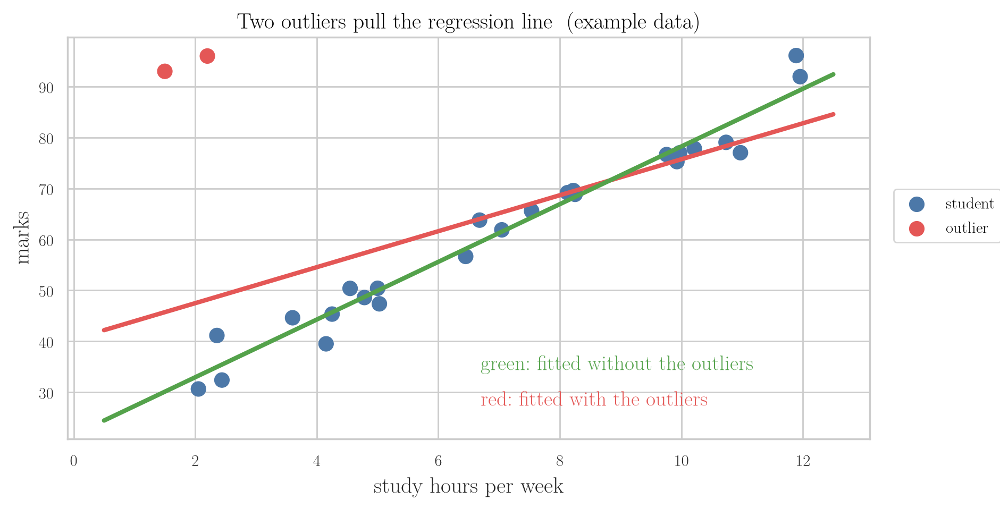

<!-- where-this-fits: generated by course_map/build_map.py; edit concepts.yaml, not this block -->
> **Where this fits:** Pipeline map step 4 (Clean). See the [Course map](../01-course-map/note.md).
>
> 
>
> - **Builds on:** Poor-quality data ([Note 7](../07-challenges-in-ml/note.md)); Descriptive statistics ([Note 19](../19-understanding-your-data/note.md)); Univariate analysis ([Note 20](../20-univariate-analysis/note.md)); Skewness ([Note 20](../20-univariate-analysis/note.md)); Standardization ([Note 24](../24-standardization/note.md)).
> - **Compare with:** Missing values ([Note 38](../38-missing-indicator-random-sample/note.md)).
<!-- /where-this-fits -->

## 1. Overview

> **Key point:** An outlier is a value far away from the rest of the data; handling outliers means three steps: decide whether to keep them, detect them, then treat them.

Outliers came up briefly in Note 20 (the dots beyond a box plot's fences) and in Note 23 (a few points pulling a regression line). This Note opens a group of four Notes on them. Here we learn what outliers are, why they cause trouble, when to keep them, and which techniques the next Notes use.

Figure 1 is the map of the whole group. First we decide whether the outliers are errors or real, useful values. If we treat them, we first **detect** them by setting a lower and an upper limit, then **treat** them by removing or changing the values outside the limits.

{height=62%}

## 2. What an outlier is

> **Key point:** An outlier is a data point that is very different from all the other data points.

Every class has one student who scores top marks while the rest of the class struggles to pass. That student is an outlier of the class: nothing like everyone else.

In data, an **outlier** is a data point (an observation, one row) that lies very far from the other data points. It can be very high or very low, but never in the middle: an average value is by definition not an outlier.

### 2.1 One outlier changes the mean

> **Key point:** A single extreme value can move the mean so far that it no longer describes anyone.

Take a class of nine people with salaries between 15,000 and 22,000 rupees a month. Now a billionaire, such as Bill Gates, joins the class. The class's mean salary jumps into the crores, a number that describes nobody in the room.

> **Extra:** The numbers, step by step.
>
> 1. **In words:** the mean is the sum of the values divided by how many there are. One huge value makes the sum huge.
> 2. **Formula:**
>    $$\text{mean} = \frac{x_1 + x_2 + \dots + x_n}{n}$$
> 3. **Example:** the nine salaries add up to 162,000 rupees (mean 18,000). Add one salary of 100,000,000 rupees (10 crore):
>    $$\text{mean} = \frac{162{,}000 + 100{,}000{,}000}{10} = 10{,}016{,}200$$
>    The mean is now about 1 crore. The median (the middle value) of the ten salaries is only 18,500 rupees, so the median barely moves.

This is how a few outliers can quietly spoil a whole analysis. In ML, outliers are therefore handled with care: removed, or changed, or kept on purpose.

## 3. How outliers spoil a model

> **Key point:** Linear regression draws its line close to every point, so a few outliers pull the line away from the pattern of all the others.

Take data on students: how many hours each studied per week, and the marks they got. This is a regression task: predict marks from hours. The data shows a clear trend: more hours, more marks.

But two students studied very little and still scored top marks. These two are outliers. Figure 2 shows what they do to a **linear regression** line, which runs as close as possible to all the points.

- **Green line:** fitted without the two outliers. It follows the trend of the 25 other students.
- **Red line:** fitted with them. It tilts up at the left to get closer to them, and so it fits the other students worse.

The red line gives wrong predictions for most students. And outliers are dangerous because they are often hidden: nothing warns us, the model just performs worse. Note 23 (Figure 2) showed the same effect with three outliers at the bottom right.

## 4. When to remove and when to keep outliers

> **Key point:** Remove an outlier when it is an error; keep it when it is real and is exactly what the problem is about.

Outliers are not always harmful. Deciding whether an outlier is dangerous or a genuine part of the data is an important skill.

### 4.1 Remove: errors in the data

> **Key point:** A value that is impossible, such as an age of 838, is an error and should go.

Suppose we collect people's ages through an online form, and one person types 838. No human is 838 years old, so the value is wrong. The person may have meant 38 or 83, but we have no way to tell.

Since the true value cannot be recovered, the best choice is to remove it (or treat it as a missing value, Section 7.3).

### 4.2 Keep: when outliers are the point

> **Key point:** In anomaly detection, such as spotting credit card fraud, the outliers are exactly what we are looking for.

Some problems are about finding unusual cases. **Anomaly detection** algorithms search for data points that do not behave like the rest. A common example is fraud detection: finding the few credit card transactions that look wrong among millions of normal ones.

There, the fraudulent transactions are the outliers. If we removed the outliers, we would remove the very thing the model must learn to find.

### 4.3 Explain: outliers can point to a missing column

> **Key point:** Sometimes an outlier is real and makes sense once we add a column that explains it.

Go back to the two students of Figure 2. They are real students, not errors. Instead of deleting them, we could add a column such as `IQ`.

With that column, the model may learn why these two scored high with few hours, and they stop looking like outliers. An outlier can tell us that our data is missing something.

### 4.4 The hard part: deciding what to do

> **Key point:** Finding an outlier is easy; deciding whether to keep, remove or change it takes thought about the problem.

Spotting outliers is usually simple; the rules in Section 8 do it. The hard part is the decision, and it depends on:

- **the problem:** is it about typical cases, or about unusual ones?
- **how the outlier got into the data:** a typing error, a broken sensor, or a real but rare case?

## 5. Which algorithms outliers affect

> **Key point:** Algorithms that learn weights (linear and logistic regression, AdaBoost, deep learning) are strongly affected; tree-based algorithms hardly are.

Not every algorithm reacts to outliers. A simple rule of thumb: if the algorithm computes **weights** (one number per input column, learned from all the points), outliers affect it.

| Affected strongly | Hardly affected |
|---|---|
| linear regression | decision tree |
| logistic regression | random forest |
| AdaBoost | gradient boosting |
| deep learning (neural networks) | other tree-based algorithms |

Tree-based algorithms cut the input space into regions with simple conditions, such as "hours < 5". Such a condition depends only on the order of the values, not on how far out an extreme value lies, so outliers in the inputs barely change it.

In practice we usually try several algorithms on one problem, including weight-based ones. So treating outliers before training is a good habit either way.

> **Extra:** A few more cases.
>
> - **Also affected:** algorithms based on distances, such as KNN and k-means, and on spread, such as PCA and SVMs. Scaling with the mean and standard deviation (standardization, Note 24) is also pulled by outliers.
> - **Trees are not fully immune:** an outlier in the *output* column still shifts the average that a regression tree predicts in its leaf. Gradient boosting with the usual squared-error loss is pulled by such outputs; a robust loss such as `loss="huber"` in scikit-learn reduces this.

## 6. Handling outliers: detect, then treat

> **Key point:** We first set limits that separate normal values from outliers, then deal with the values outside the limits.

Once we decide to handle outliers, the work has two parts (Figure 1):

1. **Detection:** compute a lower and an upper limit for the column. Values outside them are outliers.
2. **Treatment:** remove or change those values.

Section 7 maps the treatments, Section 8 the detection rules. Notes 42 to 44 then put each rule to work.

## 7. Ways to treat outliers

> **Key point:** Trimming removes the outliers, capping pulls them back to the limit; treating them as missing values and discretizing them are used less often.

### 7.1 Trimming

> **Key point:** Trimming deletes the rows that hold outliers; it is fast, but too much trimming shrinks the data.

**Trimming** removes every row whose value lies outside the limits. In Figure 2 we would simply delete the two students.

- **Advantage:** very fast and simple.
- **Disadvantage:** if there are many outliers, we delete many rows, and the data gets thin.

### 7.2 Capping

> **Key point:** Capping keeps the rows but replaces every value beyond a limit with the limit itself.

Outliers always sit at an end of the data, either too high or too low. **Capping** sets the two limits and moves every value beyond them back onto the limit. Figure 3 compares it with trimming, with limits 20 and 90.

- Values below 20 (here 5 and 12) become 20.
- Values above 90 (here 96 and 99) become 90.
- All 20 rows stay; with trimming only 16 remain.

Capping with limits set by percentiles is called **winsorization**; Note 44 covers it.

### 7.3 Two less common treatments

> **Key point:** An outlier can also be treated as a missing value, or hidden inside a range by discretization.

- **Treat as missing:** replace each outlier with `NaN` and then fill it in with any imputation technique from Notes 36 to 40.
- **Discretization (binning):** turn the numbers into ranges, such as 0 to 10, 10 to 20, ..., 90 to 100 (Note 32). An extreme value of 99 just falls into the last range with all the other high values, so it no longer stands out.

Trimming and capping are used far more, and they are what Notes 42 to 44 focus on.

## 8. Ways to detect outliers

> **Key point:** The column's shape decides the rule: mean ± 3 standard deviations for a normal column, the IQR fences for a skewed one, percentiles for any column.

Many detection methods exist; these three are the most important. Figure 4 applies each to example data, with the limits as dashed lines and the flagged values in red.

{width=100%}

### 8.1 Normal column: mean ± 3 standard deviations

> **Key point:** In a normal distribution, 99.7% of the values lie within 3 standard deviations of the mean, so a value beyond that is an outlier.

When a column is normally distributed (bell-shaped, or close to it), its values follow a fixed pattern:

- about 68.3% lie within 1 standard deviation of the mean;
- about 95.4% lie within 2 standard deviations;
- about 99.7% lie within 3 standard deviations.

So a value outside mean ± 3 standard deviations is very rare, and we treat it as an outlier.

> **Extra:** The limits, step by step.
>
> 1. **In words:** step three standard deviations below and above the mean.
> 2. **Formula:** with mean $\mu$ and standard deviation $\sigma$,
>    $$\text{lower} = \mu - 3\sigma, \qquad \text{upper} = \mu + 3\sigma$$
> 3. **Example:** marks with mean 60 and standard deviation 10:
>    $$\text{lower} = 60 - 3 \times 10 = 30, \qquad \text{upper} = 60 + 3 \times 10 = 90$$
>    Marks below 30 or above 90 are outliers. In Figure 4 (left), 5 of 2,000 values fall outside.

This rule is often written with the **z-score**, the distance from the mean counted in standard deviations; an outlier has a z-score below $-3$ or above 3. Note 42 covers it.

### 8.2 Skewed column: the IQR fences

> **Key point:** For a skewed column, the box-plot fences, 1.5 IQR beyond the box, set the limits.

When a column is skewed (a long tail to the right or left, Note 20), the mean ± 3 standard deviations rule no longer fits. Instead we use the **interquartile range (IQR)**, the width of a box plot's box, which Note 20 introduced.

$$\text{IQR} = Q_3 - Q_1$$
$$\text{lower} = Q_1 - 1.5 \times \text{IQR}, \qquad \text{upper} = Q_3 + 1.5 \times \text{IQR}$$

Here $Q_1$ is the 25th percentile and $Q_3$ the 75th. For the Titanic ages (Note 20), $Q_1 = 20.125$ and $Q_3 = 38$ give limits of $-6.69$ and $64.81$. Note 43 covers this rule.

### 8.3 Any column: percentiles

> **Key point:** The percentile rule calls everything below a low percentile or above a high percentile an outlier; it works for any shape.

The third rule works whatever the shape of the column. We pick two percentiles, for example the 1st and the 99th, and every value below the first or above the second is an outlier.

The cut-offs are our choice, depending on the problem: 1 and 99, 2.5 and 97.5, or 5 and 95. With 1 and 99, about 2% of the values are always flagged (40 of 2,000 in Figure 4, right). Note 44 covers this rule together with winsorization.

## 9. The outlier Notes, in order

> **Key point:** Notes 42 to 44 each take one detection rule and use it to trim and cap.

| Note | Detection rule | Use when |
|---|---|---|
| 42 | z-score: mean ± 3 standard deviations | the column is roughly normal |
| 43 | IQR: box-plot fences | the column is skewed |
| 44 | percentiles, and winsorization | any column |

## 10. Summary

| Step | Options | Notes |
|---|---|---|
| Decide | remove errors; keep outliers the problem is about; add a column that explains them | this Note |
| Detect | mean ± 3 std (normal), IQR fences (skewed), percentiles (any) | 42, 43, 44 |
| Treat | trimming, capping (winsorization); less often: as missing, discretization | 42 to 44 |

- An outlier is a data point very different from the rest; it lies at the high or low end, never in the middle.
- One outlier can move the mean far from every real value; the median barely moves.
- A few outliers can pull a linear regression line away from the pattern of all other points.
- Remove outliers that are errors; keep them when they are the point, as in fraud detection.
- Weight-based algorithms (linear and logistic regression, AdaBoost, deep learning) are sensitive to outliers; tree-based ones hardly are.
- Trimming deletes outlier rows (fast, but loses data); capping moves outliers onto the limits (keeps every row).

## 11. Key terms

| Term | Meaning |
|---|---|
| Outlier | A data point very far from the other data points |
| Anomaly detection | Finding the data points that do not behave like the rest, such as fraudulent transactions |
| Fraud detection | Spotting dishonest transactions; here the outliers are what we want to find |
| Weight-based algorithm | An algorithm that learns one number per input column from all the points; sensitive to outliers |
| Tree-based algorithm | An algorithm that splits the data with simple conditions; hardly affected by outliers |
| Outlier detection | Setting a lower and an upper limit; values outside them are outliers |
| Trimming | Removing the rows that hold outliers |
| Capping | Replacing every value beyond a limit with the limit itself |
| Winsorization | Capping with limits set by percentiles |
| Discretization | Turning numbers into ranges (bins), so extreme values join the last range |
| Z-score | Distance from the mean in standard deviations; beyond ± 3 marks an outlier in a normal column |
| IQR rule | Values beyond 1.5 IQR outside the box ($Q_1$ to $Q_3$) are outliers; used for skewed columns |
| Percentile rule | Values below a low percentile or above a high one (e.g. 1st, 99th) are outliers |
