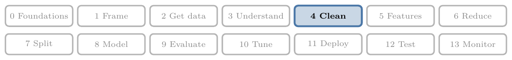
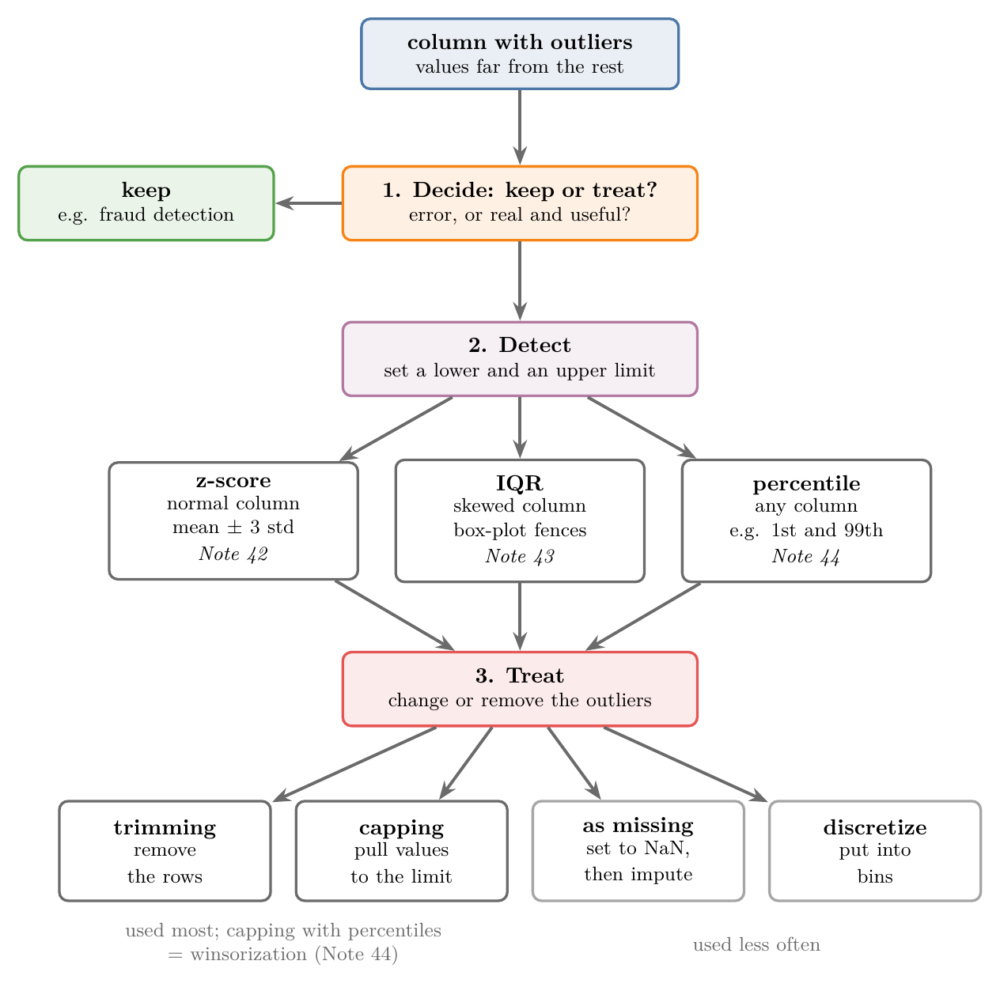
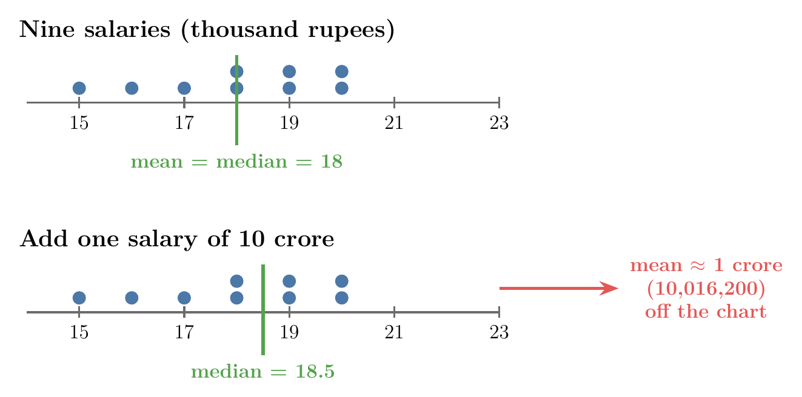
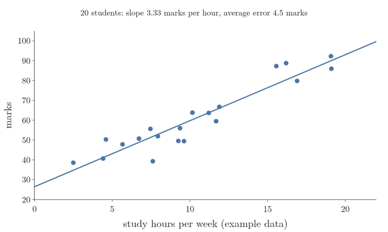
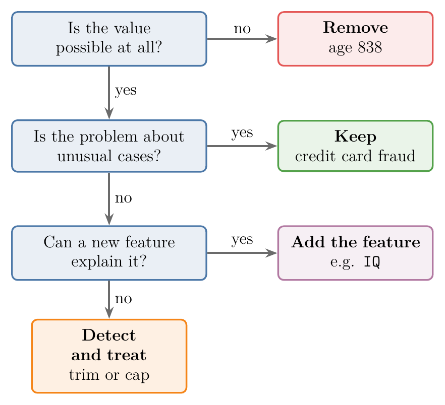
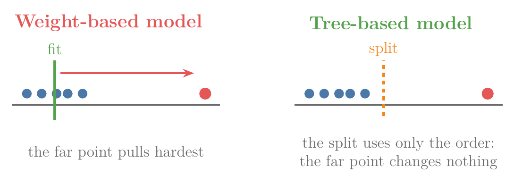
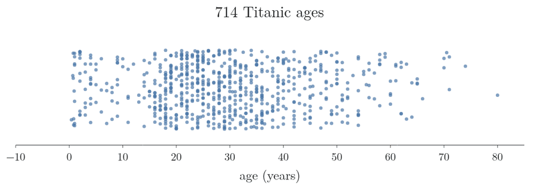
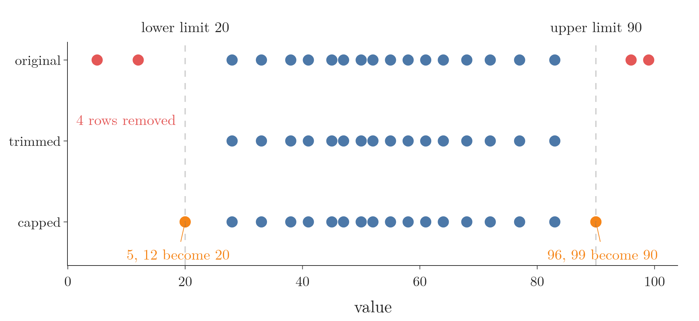
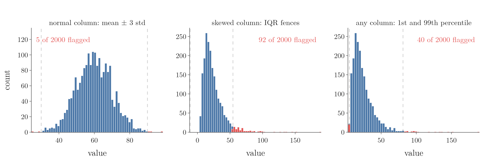

<!-- where-this-fits: generated by course_map/build_map.py; edit concepts.yaml, not this block -->
> **Where this fits:** Pipeline map step 4 (Clean). See the [Course map](../01-course-map/note.md).
>
> 
>
> - **Builds on:** Poor-quality data ([Note 9](../09-mldlc/note.md)); Descriptive statistics ([Note 19](../19-understanding-your-data/note.md)); Univariate analysis ([Note 20](../20-univariate-analysis/note.md)); Skewness ([Note 20](../20-univariate-analysis/note.md)); Standardization ([Note 24](../24-standardization/note.md)).
> - **Compare with:** Missing values ([Note 38](../38-missing-indicator-random-sample/note.md)).
<!-- /where-this-fits -->

## 1. Overview

> **Key point:** An outlier is a value far away from the rest of the data; handling outliers means three steps: decide whether to keep them, detect them, then treat them.

Outliers came up briefly in Note 20 (the dots beyond a box plot's fences) and in Note 23 (a few points pulling a regression line). This Note opens a group of four Notes on them. Here we learn what outliers are, why they cause trouble, when to keep them, and which techniques the next Notes use.

Figure 1 is the map of the whole group. First we decide whether the outliers are errors or real, useful values. If we treat them, we first **detect** them by setting a lower and an upper limit, then **treat** them by removing or changing the values outside the limits.

{height=62%}

## 2. What an outlier is

> **Key point:** An outlier is a data point that is very different from all the other data points.

Every class has one student who scores top marks while the rest of the class struggles to pass. That student is an outlier of the class: nothing like everyone else.

In data, an **outlier** (G-1420) is a data point (an **observation** (G-1374): one record, one row of the data table) that lies very far from the other data points. Each **feature** (G-772) is an input variable (one column of the table), and the **target** (G-1949) is the output a model predicts. An outlier can be very high or very low, but never in the middle: an average value is by definition not an outlier.

### 2.1 One outlier changes the mean

> **Key point:** A single extreme value can move the mean so far that it no longer describes anyone.

Take a class of nine people with salaries between 15,000 and 22,000 rupees a month. Now a billionaire, such as Bill Gates, joins the class. The class's mean salary jumps into the crores, a number that describes nobody in the room.

{width=85%}

Figure 2 draws the numbers worked out in the box below: watch the mean fly off while the median stays among the nine.

> **Extra:** The numbers, step by step.
>
> 1. **In words:** the mean is the sum of the values divided by how many there are. One huge value makes the sum huge.
> 2. **Formula:**
>    $$\text{mean} = \frac{x_1 + x_2 + \dots + x_n}{n}$$
> 3. **Example:** take the nine salaries 15,000, 16,000, 17,000, 18,000, 18,000, 19,000, 19,000, 20,000 and 20,000 rupees. They add up to 162,000 rupees (mean 18,000). Add one salary of 100,000,000 rupees (10 crore):
>    $$\text{mean} = \frac{162{,}000 + 100{,}000{,}000}{10} = 10{,}016{,}200$$
>    The mean is now about 1 crore. The median of the ten salaries is the mean of the two middle values, $(18{,}000 + 19{,}000)/2 = 18{,}500$ rupees, against 18,000 for the nine, so the median barely moves.

One extreme value can quietly spoil a whole analysis in this way. In ML, outliers are therefore handled with care: removed, or changed, or kept on purpose.

## 3. How outliers spoil a model

> **Key point:** Linear regression draws its line close to every point, so a few outliers pull the line away from the pattern of all the others.

A regression line pulled by outliers is drawn in the [feature engineering Note](../23-what-is-feature-engineering/note.md) (section "Detecting and removing outliers"). Here we keep one example in mind: students' weekly study hours against their marks, where more hours bring more marks.

Two students studied very little and still scored top marks. These two outliers tilt a **linear regression** (G-1094) line towards them, so it fits the other students worse. Outliers are dangerous because they are often hidden: nothing warns us, the model just performs worse.

Figure 3 puts numbers on it with example data for 20 students. The line through them rises 3.33 marks per study hour and misses a typical student by 4.5 marks. Adding the two outliers flattens the slope to 1.91, and the line now misses the same 20 students by 8.4 marks on average, almost twice as much. The line is chosen to keep the total squared distance to all points small, so two far points pull it towards themselves.

## 4. When to remove and when to keep outliers

> **Key point:** Remove an outlier when it is an error; keep it when it is real and is exactly what the problem is about.

Outliers are not always harmful. Deciding whether an outlier is dangerous or a genuine part of the data is an important skill.

{width=65%}

Figure 4 puts Sections 4.1 to 4.3 in order as questions to ask about an outlier.

### 4.1 Remove: errors in the data

> **Key point:** A value that is impossible, such as an age of 838, is an error and should go.

Suppose we collect people's ages through an online form, and one person types 838. No human is 838 years old, so the value is wrong. The person may have meant 38 or 83, but we have no way to tell.

Since the true value cannot be recovered, the best choice is to remove it (or treat it as a missing value, Section 7.3).

### 4.2 Keep: when outliers are the point

> **Key point:** In anomaly detection, such as spotting credit card fraud, the outliers are exactly what we are looking for.

Some problems are about finding unusual cases. **Anomaly detection** (G-201) algorithms search for data points that do not behave like the rest. A common example is fraud detection: finding the few credit card transactions that look wrong among millions of normal ones.

There, the fraudulent transactions are the outliers. If we removed the outliers, we would remove the very thing the model must learn to find.

### 4.3 Explain: outliers can point to a missing feature

> **Key point:** Sometimes an outlier is real and makes sense once we add a feature that explains it.

Go back to the two students of Section 3, with few hours and top marks. They are real students, not errors. Instead of deleting them, we could add a feature such as `IQ`.

With that feature, the model may learn why these two scored high with few hours, and they stop looking like outliers. An outlier can tell us that our data is missing something.

### 4.4 The hard part: deciding what to do

> **Key point:** Finding an outlier is easy; deciding whether to keep, remove or change it takes thought about the problem.

Spotting outliers is usually simple; the rules in Section 8 do it. The hard part is the decision, and it depends on:

- **the problem:** is it about typical cases, or about unusual ones?
- **how the outlier got into the data:** a typing error, a broken sensor, or a real but rare case?

## 5. Which algorithms outliers affect

> **Key point:** Algorithms that learn weights (linear and logistic regression, AdaBoost, deep learning) are strongly affected; tree-based algorithms hardly are.

Not every algorithm reacts to outliers. A simple rule of thumb: if the algorithm computes **weights** (coefficients, G-407; one number per feature, learned from all the points), outliers affect it. Squared-error loss, used by linear regression, and the exponential loss of AdaBoost both give the largest errors the most say (ESL §10.6), and neural networks rate poorly on robustness to outliers in the inputs (ESL Table 10.1). A tug-of-war is the picture: every point pulls on the line, and a point far away pulls hardest.

{width=85%}

Figure 5 shows the two behaviours side by side.

| Affected strongly | Hardly affected |
|---|---|
| linear regression | decision tree |
| logistic regression | random forest |
| AdaBoost | gradient boosting |
| deep learning (neural networks) | other tree-based algorithms |

Tree-based algorithms cut the input space into regions with simple conditions, such as "hours < 5". Such a condition depends only on the order of the values, not on how far out an extreme value lies, so outliers in the inputs barely change it (ESL §10.7, Table 10.1).

In practice we usually try several algorithms on one problem, including weight-based ones. So treating outliers before training is a good habit either way.

> **Extra:** A few more cases.
>
> - **Also affected:** k-means, because squaring the distances gives the largest distances the most say (ESL §14.3.10); SVMs (ESL Table 10.1); and PCA, which is built from the mean and covariance of the data (Hubert et al. 2005). Scaling with the mean and standard deviation (standardization, Note 24) is pulled too, since one extreme value moves the mean (Section 2.1; scikit-learn docs, Compare the effect of different scalers).
> - **Trees are not fully immune:** an outlier in the *target* still shifts the average that a regression tree predicts in its leaf. Gradient boosting with the usual squared-error loss is pulled by such outputs; using the absolute error or the Huber loss instead makes it robust (ESL §10.6, §10.9). In scikit-learn this is `GradientBoostingRegressor(loss="huber")`.

## 6. Handling outliers: detect, then treat

> **Key point:** We first set limits that separate normal values from outliers, then deal with the values outside the limits.

Once we decide to handle outliers, the work has two parts (Figure 1):

1. **Detection:** compute a lower and an upper limit for the feature. Values outside them are outliers.
2. **Treatment:** remove or change those values.

Section 7 maps the treatments, Section 8 the detection rules. Notes 42 to 44 then put each rule to work.

Figure 6 runs both parts on the 714 known Titanic ages, with the IQR fences of section 8.2 as the detection rule. The fences sit at $-6.69$ and $64.81$ years; no age is below the lower one, and 11 ages are above the upper one. Capping (section 7.2) then moves those 11 ages onto the fence and keeps every row.

{height=30%}

## 7. Ways to treat outliers

> **Key point:** Trimming removes the outliers, capping pulls them back to the limit; treating them as missing values and discretizing them are used less often.

### 7.1 Trimming

> **Key point:** Trimming deletes the observations that hold outliers; it is fast, but too much trimming shrinks the data.

**Trimming** (G-2019) removes every observation whose value lies outside the limits. In Section 3 we would simply delete the two students.

- **Advantage:** very fast and simple.
- **Disadvantage:** if there are many outliers, we delete many observations, and the data gets thin.

### 7.2 Capping

> **Key point:** Capping keeps the observations but replaces every value beyond a limit with the limit itself.

Outliers always sit at an end of the data, either too high or too low. **Capping** (G-345) sets the two limits and moves every value beyond them back onto the limit. Figure 7 compares it with trimming, with limits 20 and 90.

- Values below 20 (here 5 and 12) become 20.
- Values above 90 (here 96 and 99) become 90.
- All 20 observations stay; with trimming only 16 remain.

Capping with limits set by percentiles is called **winsorization** (G-2123); Note 44 covers it.

### 7.3 Two less common treatments

> **Key point:** An outlier can also be treated as a missing value, or hidden inside a range by discretization.

- **Treat as missing:** replace each outlier with `NaN` and then fill it in with any imputation technique from Notes 36 to 40.
- **Discretization** (G-619), or binning: turn the numbers into ranges, such as 0 to 10, 10 to 20, ..., 90 to 100 (Note 32). An extreme value of 99 just falls into the last range with all the other high values, so it no longer stands out.

Trimming and capping are used far more, and they are what Notes 42 to 44 focus on.

## 8. Ways to detect outliers

> **Key point:** The feature's shape decides the rule: mean ± 3 standard deviations for a normal feature, the IQR fences for a skewed one, percentiles for any feature.

Many detection methods exist; these three are the most important. Figure 8 applies each to example data, with the limits as dashed lines and the flagged values in red.

{width=100%}

### 8.1 Normal feature: mean ± 3 standard deviations

> **Key point:** In a normal feature, a value more than 3 standard deviations from the mean is an outlier.

About 99.7% of a normal feature's values lie within 3 standard deviations of the mean, so a value outside that range is rare enough to call an outlier. The [z-score Note](../42-outliers-zscore/note.md) (section three, the 68-95-99.7 rule) explains the rule and its limits.

### 8.2 Skewed feature: the IQR fences

> **Key point:** For a skewed feature, the box-plot fences, 1.5 IQR beyond the box, set the limits.

The box-plot fences of the [univariate analysis Note](../20-univariate-analysis/note.md) serve as the limits for a skewed feature; the [IQR Note](../43-outliers-iqr/note.md) puts them to work.

### 8.3 Any feature: percentiles

> **Key point:** The percentile rule calls everything below a low percentile or above a high percentile an outlier; it works for any shape.

The third rule works whatever the shape of the feature. We pick two percentiles, for example the 1st and the 99th, and every value below the first or above the second is an outlier.

The cut-offs are our choice, depending on the problem: 1 and 99, 2.5 and 97.5, or 5 and 95. With 1 and 99, about 2% of the values are always flagged (40 of 2,000 in Figure 8, right). Note 44 covers this rule together with winsorization.

## 9. The outlier Notes, in order

> **Key point:** Notes 42 to 44 each take one detection rule and use it to trim and cap.

| Note | Detection rule | Use when |
|---|---|---|
| 42 | z-score: mean ± 3 standard deviations | the column is roughly normal |
| 43 | IQR: box-plot fences | the column is skewed |
| 44 | percentiles, and winsorization | any column |

## 10. Summary

| Step | Options | Notes |
|---|---|---|
| Decide | remove errors; keep outliers the problem is about; add a feature that explains them | this Note |
| Detect | mean ± 3 std (normal), IQR fences (skewed), percentiles (any) | 42, 43, 44 |
| Treat | trimming, capping (winsorization); less often: as missing, discretization | 42 to 44 |

- An outlier is a data point very different from the rest; it lies at the high or low end, never in the middle.
- One outlier can move the mean far from every real value; the median barely moves.
- A few outliers can pull a linear regression line away from the pattern of all other points.
- Remove outliers that are errors; keep them when they are the point, as in fraud detection.
- Weight-based algorithms (linear and logistic regression, AdaBoost, deep learning) are sensitive to outliers; tree-based ones hardly are.
- Trimming deletes outlier observations (fast, but loses data); capping moves outliers onto the limits (keeps every observation).

## 11. Sources

**Built from**

- CampusX, "What are Outliers | Outliers in Machine Learning", YouTube, https://www.youtube.com/watch?v=Lln1PKgGr_M

**Other references**

- ESL: Hastie, T., Tibshirani, R. and Friedman, J. (2009). *The Elements of Statistical Learning*, 2nd ed. Springer. Section 10.7 and Table 10.1 (trees, neural networks and SVMs and outliers in the inputs), Section 10.6 (squared-error and exponential losses are not robust) and Section 10.9 (robust losses for boosting), Section 14.3.10 (k-means and outliers).
- Hubert, M., Rousseeuw, P. J. and Vanden Branden, K. (2005). ROBPCA: A New Approach to Robust Principal Component Analysis. *Technometrics* 47(1), 64–79.
- scikit-learn example, *Compare the effect of different scalers on data with outliers*.

## 12. Key terms

| Term | Meaning |
|---|---|
| Observation | One record: one row of the data table |
| Feature | An input variable: one column of the data table |
| Outlier | A data point very far from the other data points |
| Anomaly detection | Finding the data points that do not behave like the rest, such as fraudulent transactions |
| Fraud detection | Spotting dishonest transactions; here the outliers are what we want to find |
| Weight-based algorithm | An algorithm that learns one number per feature from all the points; sensitive to outliers |
| Tree-based algorithm | An algorithm that splits the data with simple conditions; hardly affected by outliers |
| Outlier detection | Setting a lower and an upper limit; values outside them are outliers |
| Trimming | Removing the observations that hold outliers |
| Capping | Replacing every value beyond a limit with the limit itself |
| Winsorization | Capping with limits set by percentiles |
| Discretization | Turning numbers into ranges (bins), so extreme values join the last range |
| Percentile rule (G-1481) | Values below a low percentile or above a high one (e.g. 1st, 99th) are outliers |
