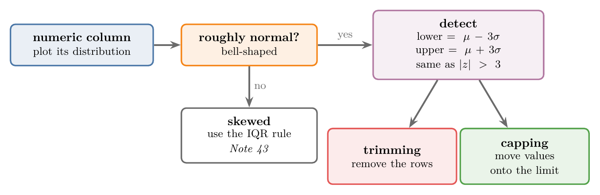
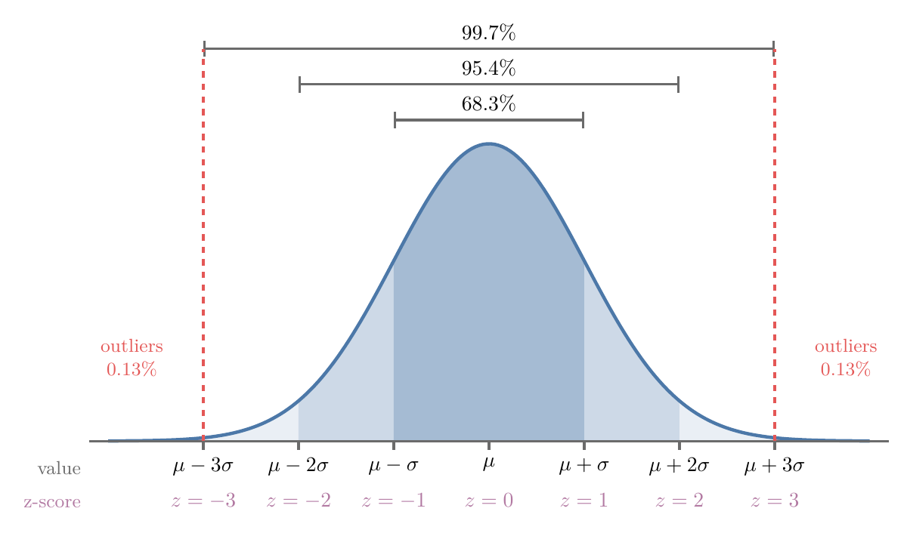
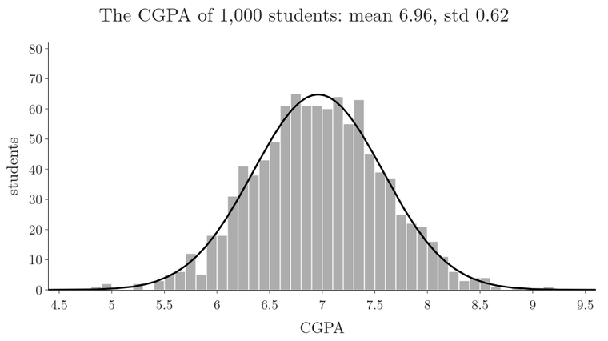
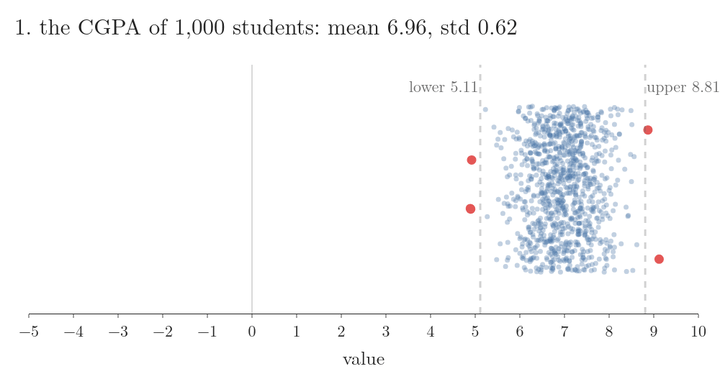
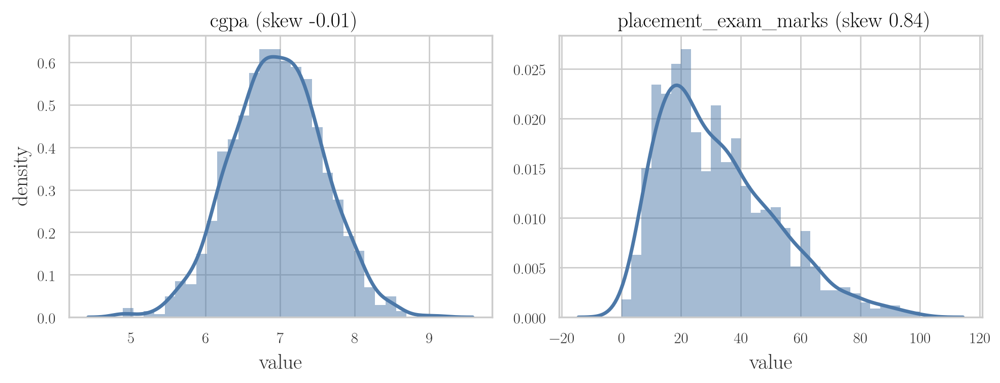
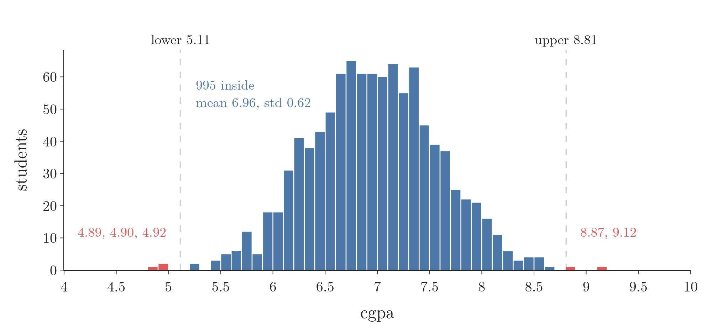
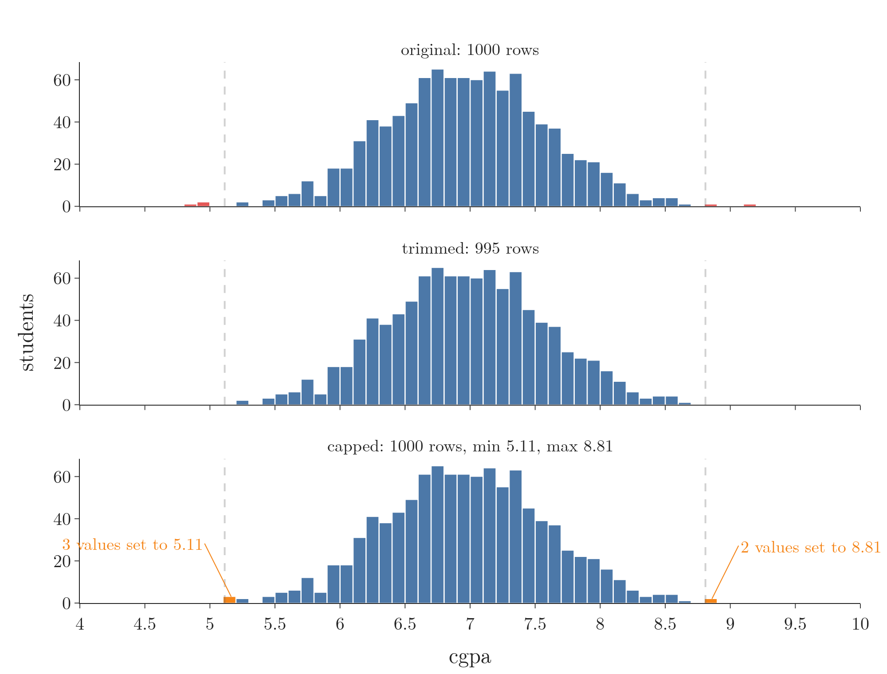
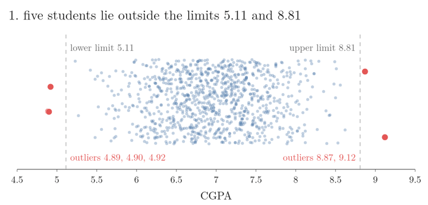
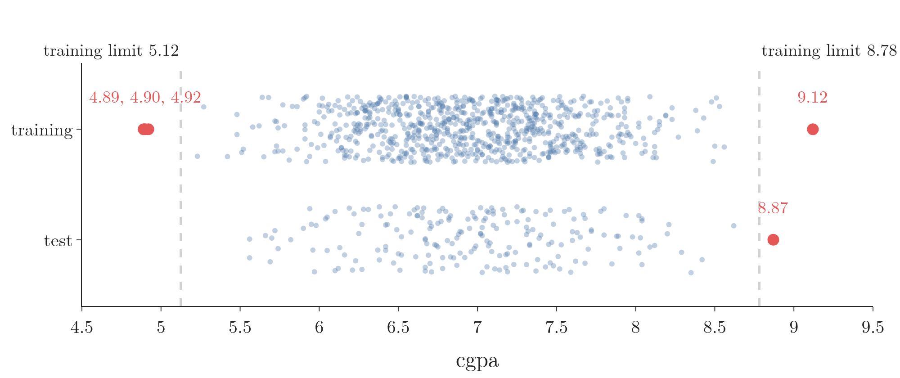
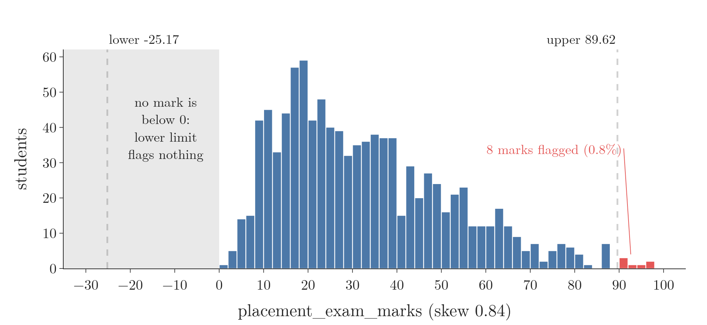

<!-- where-this-fits: generated by course_map/build_map.py; edit concepts.yaml, not this block -->
> **Where this fits:** Pipeline map steps 0 (Foundations), 4 (Clean). See the [Course map](../01-course-map/note.md).
>
> 
>
> - **Builds on:** Outliers ([Note 7](../07-challenges-in-ml/note.md)); Standardization ([Note 9](../09-mldlc/note.md)); Descriptive statistics ([Note 19](../19-understanding-your-data/note.md)); Skewness ([Note 20](../20-univariate-analysis/note.md)); Probability density function (PDF) ([Note 20](../20-univariate-analysis/note.md)); Percentile outlier method ([Note 41](../41-what-are-outliers/note.md)).
> - **Leads to:** Naive Bayes ([Note 87](../87-naive-bayes-intuition/note.md)); Standard normal and the z-table ([Note 251](../251-standard-normal-and-z-table/note.md)); Q-Q plot ([Note 260](../260-kurtosis-and-qq-plots/note.md)); Central limit theorem ([Note 271](../271-sampling-distribution-and-clt/note.md)); Likelihood ([Note 630](../630-probability-vs-likelihood/note.md)); Multivariate normal distribution ([Note 640](../640-gaussian-mixture-models/note.md)).
> - **Compare with:** IQR outlier method ([Note 41](../41-what-are-outliers/note.md)); Percentile outlier method ([Note 41](../41-what-are-outliers/note.md)); Student's t-distribution ([Note 282](../282-t-procedure/note.md)).
<!-- /where-this-fits -->

## 1. Overview

> **Key point:** For a roughly normal feature, every value more than 3 standard deviations from the mean is an outlier; we then trim those rows or cap the values at the limits.

Note 41 listed three rules for detecting outliers. This Note puts the first one to work: the mean ± 3 standard deviations rule, also called the **z-score method** (G-2139). The z-score method only fits a **feature** (G-772) (an input variable, one column of the data table) that is normal or close to normal. Each **observation** (G-1374) is one record (one row), here one student.

Figure 1 shows the whole method, in three steps:

1. check the shape of the column;
2. compute a lower and an upper limit;
3. treat the values outside them by trimming or capping (both defined in Note 41, Section 7).



## 2. The condition: a normal feature

> **Key point:** The z-score method works only on a column that is normally distributed, or almost.

A **normal distribution** (G-1343) has the shape of a bell, so its curve is also called the **bell curve** (G-274). Most values sit near the centre, and fewer and fewer values lie towards the two ends.

People's heights and marks in an exam often follow this shape, at least roughly.

So before we use the method, we plot the feature and check that it looks like a bell. A strongly skewed feature needs another rule, the IQR fences of Note 43.

## 3. The 68-95-99.7 rule

> **Key point:** In a normal feature, about 68.3% of the values lie within 1 standard deviation of the mean, 95.4% within 2, and 99.7% within 3.

A normal distribution always spreads its values in the same fixed way around its mean. Write $\mu$ for the **mean** (G-1203), the average of the values, and $\sigma$ for the **standard deviation** (G-1871), the typical distance of a value from the mean. Figure 2 shows the three ranges:

- from $\mu - \sigma$ to $\mu + \sigma$: about 68.3% of the values;
- from $\mu - 2\sigma$ to $\mu + 2\sigma$: about 95.4%;
- from $\mu - 3\sigma$ to $\mu + 3\sigma$: about 99.7%.

This spread is called the **68-95-99.7 rule** (or the **empirical rule** (G-53)). The rule holds for every normal feature, whatever its mean and standard deviation.



Figure 3 reads the same three ranges off real data: the CGPA of the 1,000 students of Section 6, with mean 6.96 and standard deviation 0.62. Watch the bands shade in turn, from the narrowest to the widest. The count of students inside each band is close to the rule: 679 (67.9%), 957 (95.7%) and 995 (99.5%). The last frame shows what is left outside the widest band: 5 students, in red.



### 3.1 Reading the two tails

> **Key point:** What a band leaves out is split equally between the two ends, so only about 0.15% of the values lie above $\mu + 3\sigma$.

The part of a distribution far from the centre, where values are rare, is a **tail** (G-1942). A normal distribution has two tails, and they are mirror images: the bell is symmetric around the mean. So the share in one tail follows from the rule, step by step:

1. **In words:** take what the band leaves out, and halve it.
2. **Formula:**
   $$\text{share in one tail} = \frac{100 - \text{share inside the band}}{2}$$
3. **Example, one standard deviation:** the band $\mu \pm \sigma$ holds 68%, so each tail holds $(100 - 68)/2 = 16$ percent. On the CGPA data, 163 students (16.3%) are below 6.35 and 158 (15.8%) are above 7.58.
4. **Example, three standard deviations:** the band $\mu \pm 3\sigma$ holds 99.7%, so each tail holds $(100 - 99.7)/2 = 0.15$ percent. On the CGPA data, 3 students are below 5.11 and 2 are above 8.81.

A value beyond 3 standard deviations is so rare that the usual practice is to call it an **outlier** (G-1420): like a 2.3-metre-tall person in a crowd, possible but so unusual that we look twice.

### 3.2 The limits

> **Key point:** The lower limit is $\mu - 3\sigma$ and the upper limit is $\mu + 3\sigma$; values outside them are outliers.

The rule turns into two limits, step by step:

1. **In words:** step three standard deviations below the mean for the lower limit, and three above for the upper limit.
2. **Formula:**
   $$\text{lower} = \mu - 3\sigma, \qquad \text{upper} = \mu + 3\sigma$$
3. **Example:** the `cgpa` column of Section 6 has mean 6.96 and standard deviation 0.62:
   $$\text{lower} = 6.96 - 3 \times 0.62 = 5.11, \qquad \text{upper} = 6.96 + 3 \times 0.62 = 8.81$$
   A CGPA below 5.11 or above 8.81 is an outlier.

## 4. Why it is called the z-score method

> **Key point:** A value's z-score counts how many standard deviations it lies from the mean, so "outside mean ± 3 standard deviations" is the same as "z-score above 3 or below -3".

The **z-score** (G-2141) of a value is the **standardization** (G-1874) formula of Note 24 (Section 4), applied to one value:

1. **In words:** subtract the mean of the column, then divide by its standard deviation.
2. **Formula:**
   $$z = \frac{x - \mu}{\sigma}$$
3. **Example:** for a CGPA of 9.12 (mean 6.9612, standard deviation 0.6159),
   $$z = \frac{9.12 - 6.9612}{0.6159} = 3.51$$
   and for a CGPA of 4.89,
   $$z = \frac{4.89 - 6.9612}{0.6159} = -3.36.$$

Converting the whole column to z-scores gives the bottom row of numbers in Figure 2. The limit $\mu + 3\sigma$ becomes $z = 3$, and $\mu - 3\sigma$ becomes $z = -3$. Figure 4 does the conversion on the real `cgpa` column; watch the two dashed limits travel with the data and land exactly on $-3$ and $+3$, with the same five red students still outside.



So there are two equal ways to detect outliers:

- compute the limits $\mu \pm 3\sigma$ and compare each value with them;
- compute each value's z-score and flag every value with $z > 3$ or $z < -3$.

Both flag exactly the same rows. Section 9 does it the second way.

## 5. Treating the outliers: trimming or capping

> **Key point:** Trimming deletes the outlier rows; capping replaces each outlier with the limit it crossed.

Both treatments, **trimming** (G-2019) and **capping** (G-345), come from the [outliers Note](../41-what-are-outliers/note.md) (section seven, ways to treat outliers). With the limits of Section 3.2, capping turns a CGPA of 9.12 into 8.81 and a CGPA of 4.89 into 5.11.

## 6. The placement data

> **Key point:** The data has 1,000 students; their CGPA is close to normal, but their placement exam marks are skewed, so the method is used on CGPA only.

The data comes from a college: one observation per student, 1,000 students, three columns.

| cgpa | placement_exam_marks | placed |
|---|---|---|
| 7.19 | 26 | 1 |
| 7.46 | 38 | 1 |
| 6.42 | 8 | 1 |
| 7.23 | 17 | 0 |

- `cgpa`: the student's CGPA (out of 10) before the placement season.
- `placement_exam_marks`: marks out of 100 in the aptitude test that companies hold before placement (aptitude, coding, English).
- `placed`: 1 if the student got a job offer, 0 if not. This column is the **target** (G-1949), the output a model would predict.

Two features are candidates for outlier detection: `cgpa` and `placement_exam_marks`. Figure 5 plots the distribution of each.



- **`cgpa`** is close to normal: a bell. Its **skewness** (G-1817), a number for how lopsided a distribution is, is $-0.01$ (0 means perfectly symmetric, Note 20).
- **`placement_exam_marks`** is right-skewed (skewness 0.84): many students scored low and only a few scored high.

So the z-score method can only be used on `cgpa`. The marks feature needs the IQR rule of Note 43.

> **Python:** Loading the data and checking the shape of the features.
>
> ```python
> import pandas as pd
>
> df = pd.read_csv("data/placement.csv")
> df.shape     # (1000, 3)
>
> # skewness: near 0 = symmetric
> df[["cgpa", "placement_exam_marks"]].skew()
> # cgpa -0.01, placement_exam_marks 0.84
> ```
>
> The Notebook draws Figure 5 with Seaborn's objects interface: `so.Hist` for the bars and `so.KDE` for the smooth curve.

## 7. Finding the limits and the outliers

> **Key point:** CGPA has mean 6.96 and standard deviation 0.62, which gives limits of 5.11 and 8.81 and flags 5 students.

First we look at four numbers of the `cgpa` column:

| Mean | Standard deviation | Minimum | Maximum |
|---|---|---|---|
| 6.96 | 0.62 | 4.89 | 9.12 |

The limits are mean ± 3 standard deviations, as in Section 3.2: **5.11** and **8.81**. They are the **lower limit** and the **upper limit** (G-2062) of the method. The minimum, 4.89, is below the lower limit and the maximum, 9.12, is above the upper limit, so the column does have outliers.

Five students fall outside the limits (Figure 6, red):

| Row | cgpa | placement_exam_marks | placed |
|---|---|---|---|
| 485 | 4.92 | 44 | 1 |
| 995 | 8.87 | 44 | 1 |
| 996 | 9.12 | 65 | 1 |
| 997 | 4.89 | 34 | 0 |
| 999 | 4.90 | 10 | 1 |



Four of the five were placed, including two of the three students with a CGPA below 5.

> **Python:** Computing the limits and selecting the outliers.
>
> ```python
> mean = df["cgpa"].mean()    # 6.9612
> std = df["cgpa"].std()      # 0.6159
>
> upper_limit = mean + 3 * std    # 8.8089
> lower_limit = mean - 3 * std    # 5.1135
>
> # | means "or": too high or too low
> is_outlier = ((df["cgpa"] > upper_limit)
>               | (df["cgpa"] < lower_limit))
> df[is_outlier]    # the 5 rows above
> ```

## 8. Trimming in code

> **Key point:** Keeping only the rows inside the limits removes the 5 outliers and leaves 995 rows.

Trimming is a filter: keep only the rows whose CGPA lies between the two limits. Figure 7 (middle) shows the result: the same bell, without the five values at the ends.

> **Python:** Trimming.
>
> ```python
> # ~ means "not": keep the rows that are not outliers
> trimmed = df[~is_outlier]
> trimmed.shape    # (995, 3)
> ```

## 9. Trimming with the z-score column

> **Key point:** We add a column of z-scores and keep the rows whose z-score lies between -3 and 3; the result is the same 995 rows.

The second approach follows Section 4. We compute the z-score of every student's CGPA and store it in a new column, `cgpa_zscore`.

| cgpa | cgpa_zscore |
|---|---|
| 7.19 | 0.37 |
| 7.46 | 0.81 |
| 6.42 | -0.88 |

Then we look for z-scores beyond ± 3:

- **$z > 3$:** two students, CGPA 8.87 ($z = 3.10$) and 9.12 ($z = 3.51$);
- **$z < -3$:** three students, CGPA 4.92 ($z = -3.31$), 4.89 ($z = -3.36$) and 4.90 ($z = -3.35$).

These are the same five students as in Section 7. Trimming them again leaves 995 rows.

> **Python:** The z-score column and trimming with it.
>
> ```python
> df["cgpa_zscore"] = (df["cgpa"] - mean) / std
>
> df[df["cgpa_zscore"] > 3]     # 2 rows
> df[df["cgpa_zscore"] < -3]    # 3 rows
>
> # keep -3 <= z <= 3
> trimmed_z = df[df["cgpa_zscore"].between(-3, 3)]
> trimmed_z.shape    # (995, 4)
> ```

## 10. Capping in code

> **Key point:** `np.where` replaces each CGPA above 8.81 with 8.81 and each CGPA below 5.11 with 5.11; all 1,000 rows stay.

For capping we go through the column value by value:

- above the upper limit: replace it with the upper limit;
- below the lower limit: replace it with the lower limit;
- otherwise: leave it as it is.

NumPy's **`np.where`** (G-124) does this for a whole column at once. `np.where` takes three things: a condition, the value to use where the condition is true, and the value to use where it is false. Two conditions need two `np.where` calls, one inside the other.

> **Python:** Capping with `np.where`.
>
> ```python
> import numpy as np
>
> # np.where(condition, if true, if false)
> df["cgpa"] = np.where(
>     df["cgpa"] > upper_limit,
>     upper_limit,
>     np.where(df["cgpa"] < lower_limit,
>              lower_limit,
>              df["cgpa"]))
>
> df.shape                # (1000, 4): no row lost
> df["cgpa"].describe()   # min 5.1135, max 8.8089
> ```

The result, compared with the original column:

| | Original | Capped |
|---|---|---|
| Rows | 1,000 | 1,000 |
| Mean | 6.9612 | 6.9615 |
| Standard deviation | 0.6159 | 0.6127 |
| Minimum | 4.89 | 5.11 |
| Maximum | 9.12 | 8.81 |

The mean barely moves and the standard deviation shrinks a little. The minimum and maximum are now exactly the limits. Figure 7 (bottom) shows the three low values piled onto 5.11 and the two high values onto 8.81, in orange.

{height=62%}

Figure 8 shows capping as a movement. Watch the five red students: each slides onto the limit it crossed, and no dot leaves the picture.



> **Extra:** pandas has a one-line shortcut for capping: `df["cgpa"].clip(lower_limit, upper_limit)`. **`clip`** (G-70) gives exactly the same column as the two nested `np.where` calls.

## 11. Learning the limits on the training set

> **Key point:** The limits are learned from the data, so they should be learned on the training set only, like the mean and standard deviation of a scaler.

> **Extra:** The steps above compute the mean and standard deviation on all 1,000 rows, before any train-test split. Computing them on all rows lets the test rows influence the limits, the same [data leakage](../13-toy-project/note.md) (G-535) that the toy-project Note avoids for scaling (section seven). The cleaner order is:
>
> 1. Split the data into training and test sets.
> 2. Compute the mean, standard deviation and limits on the training set only.
> 3. Apply the same limits to the training and the test set.
>
> With an 80/20 split (`random_state=42`), the 800 training rows have mean 6.95 and standard deviation 0.61. The training limits are **5.12** and **8.78**:
>
> | | Rows | Outliers (training limits) |
> |---|---|---|
> | Training set | 800 | 4: CGPA 4.92, 4.89, 4.90, 9.12 |
> | Test set | 200 | 1: CGPA 8.87 |
>
> 
>
> In Figure 9, watch the test student with CGPA 8.87: the training limits flag that student even though no test row helped set them.
>
> The limits move only a little here, because 800 rows give almost the same mean and standard deviation as 1,000. Trimming is done on the training set only, since we cannot delete test rows (or real users) at prediction time. Capping can be applied to both sets with the training limits; the Notebook shows both steps.

## 12. Strengths and limits of the z-score method

> **Key point:** The method is simple and effective, but only for a column that is roughly normal.

- **Simple:** two numbers (mean and standard deviation) give both limits.
- **Effective:** on a normal feature it flags exactly the rare values at the two ends.
- **Limited:** it assumes a normal feature. On a skewed feature the limits land in the wrong places. For the skewed marks feature they come out as $-25.17$ and 89.62: the lower limit is below 0, so it can never flag anything, and 8 marks (0.8%, not 0.3%) are flagged on the high side. Note 43 handles this case with the IQR rule.



In Figure 10, watch the grey band: half of the rule is spent on impossible negative marks, while the long right tail gets cut.

> **Extra:** Two more things to keep in mind.
>
> - **A perfect normal feature still has "outliers".** About 0.27% of the values lie beyond 3 standard deviations by pure chance: about 3 in 1,000. In large data, the method always flags some real, valid values.
> - **The outliers move the limits they are judged by.** The mean and standard deviation are computed from all the values, the extreme ones included, so a big outlier also widens its own limits. In a small sample this can hide it completely: with $n$ values no z-score can be larger than $(n-1)/\sqrt{n}$ (Shiffler 1988; NIST 1.3.5.17). For 10 values that is 2.85, so the method can never flag anything, however extreme.

## 13. Summary

| Step | What we do | On the placement data |
|---|---|---|
| Check the shape | plot the feature; it must be roughly normal | `cgpa` normal (skew $-0.01$); marks skewed (0.84), not used |
| Detect | limits $\mu \pm 3\sigma$, or $z > 3$ or $z < -3$ | limits 5.11 and 8.81; 5 outliers |
| Trim | keep the rows inside the limits | 995 rows left |
| Cap | move values beyond a limit onto it | 1,000 rows; min 5.11, max 8.81 |
| Better practice | learn the limits on the training set | limits 5.12 and 8.78; 4 outliers in train, 1 in test |

- The z-score method needs a feature that is normal or close to it.
- In a normal feature, about 68.3%, 95.4% and 99.7% of the values lie within 1, 2 and 3 standard deviations of the mean.
- Values beyond mean ± 3 standard deviations are outliers.
- The z-score $z = (x - \mu)/\sigma$ is the standardization formula; $|z| > 3$ flags exactly the same values.
- Trimming deletes the outlier rows; capping replaces each outlier with the limit, so no row is lost.
- The limits should be learned on the training set only.


## 14. Sources

**Built from**

- CampusX, "Outlier Detection and Removal using Z-score Method | Handling Outliers Part 2", YouTube, https://www.youtube.com/watch?v=OnPE-Z8jtqM
- Khan Academy, "ck12.org normal distribution problems: Empirical rule", YouTube, https://www.youtube.com/watch?v=OhRr26AfFBU

**Other references**

- Shiffler, R. E. (1988). Maximum Z scores and outliers. *The American Statistician*, 42(1), 79–80.
- NIST/SEMATECH. *e-Handbook of Statistical Methods*, Section 1.3.5.17, "Detection of Outliers". https://www.itl.nist.gov/div898/handbook/

## 15. Key terms

| Term | Meaning |
|---|---|
| Feature | An input variable: one column of the data table |
| Observation | One record: one row of the data table |
| Target | The output a model predicts |
| Z-score method | Outlier detection that flags values more than 3 standard deviations from the mean; for roughly normal features |
| Normal distribution | A bell-shaped distribution: most values near the mean, fewer and fewer towards both ends |
| Bell curve | The curve of a normal distribution |
| 68-95-99.7 rule (empirical rule) | In a normal feature, about 68.3%, 95.4% and 99.7% of values lie within 1, 2 and 3 standard deviations of the mean |
| Z-score | How many standard deviations a value lies from the mean: $(x - \mu)/\sigma$ |
| Tail (G-1942) | The part of a distribution far from the centre, where values are rare |
| Outlier | A value far from the rest of the data |
| Upper / lower limit (G-2062) | $\mu + 3\sigma$ and $\mu - 3\sigma$; values beyond them are outliers |
| `np.where` | NumPy function that picks one value where a condition is true and another where it is false |
