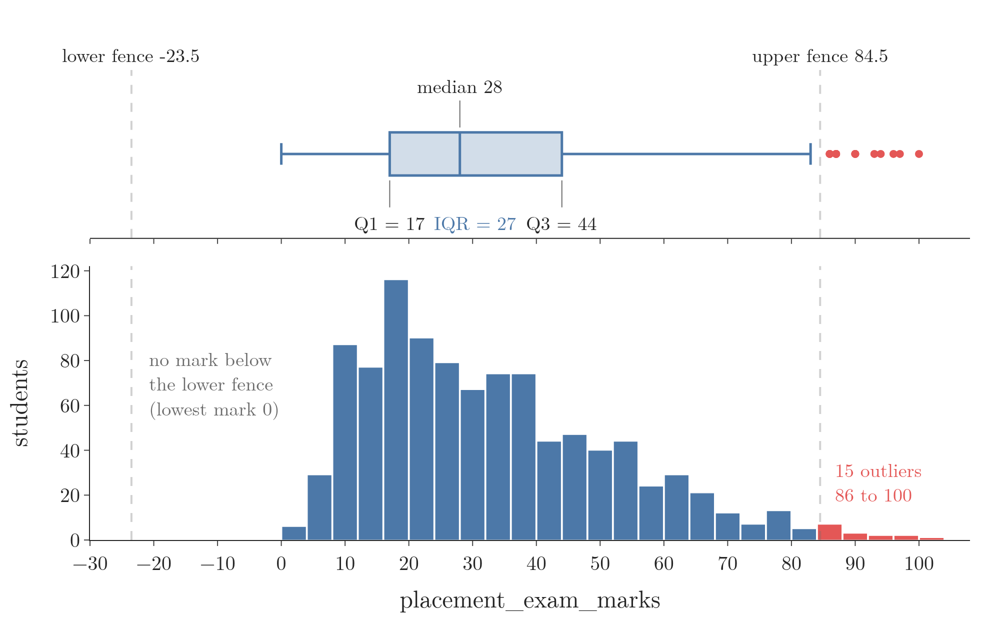

<!-- where-this-fits: generated by course_map/build_map.py; edit concepts.yaml, not this block -->
> **Where this fits:** Pipeline map step 4 (Clean). See the [Course map](../01-course-map/note.md).
>
> 
>
> - **Builds on:** Descriptive statistics ([Note 19](../19-understanding-your-data/note.md)); Univariate analysis ([Note 20](../20-univariate-analysis/note.md)); Outliers ([Note 41](../41-what-are-outliers/note.md)); Percentile outlier method ([Note 41](../41-what-are-outliers/note.md)).
> - **Compare with:** Percentile outlier method ([Note 41](../41-what-are-outliers/note.md)); Z-score outlier method ([Note 42](../42-outliers-zscore/note.md)).
<!-- /where-this-fits -->

## 1. Overview

> **Key point:** For a skewed feature, every value beyond the box-plot fences ($Q_1 - 1.5\,\text{IQR}$ and $Q_3 + 1.5\,\text{IQR}$) is an outlier; we then trim those rows or cap the values at the fences.

Note 41 listed three rules for detecting outliers, and Note 42 put the first one, the z-score method, to work on a normal feature. This Note covers the second rule: the **IQR method**, also called the **IQR proximity rule**. The IQR method is the rule to use when a **feature** (an input variable, one column of the data table) is skewed. Each **observation** is one record (one row), here one student.

Figure 1 shows the whole method. We check that the feature is skewed, compute the two fences from the quartiles, and then treat the values outside them by trimming or capping (both defined in Note 41, Section 7).

{width=100%}

## 2. The condition: a skewed feature

> **Key point:** The IQR method is meant for a feature that is skewed, not normal.

A feature is **skewed** when its values have a long tail on one side (Note 20). The z-score method of Note 42 does not fit such a feature, because it assumes a bell shape.

The IQR method makes no such assumption. The IQR method is built only on percentiles, which do not care about the shape of the feature. Think of the middle half of a queue sorted by height: a single giant joining the end of the queue does not change who stands in the middle half. To use the IQR method we need two ideas from Note 20: the box plot and the IQR.

## 3. The fences

> **Key point:** The lower fence is $Q_1 - 1.5 \times \text{IQR}$ and the upper fence is $Q_3 + 1.5 \times \text{IQR}$; values outside them are outliers.

The quartiles $Q_1$ (25th percentile) and $Q_3$ (75th percentile) come from the [understanding your data Note](../19-understanding-your-data/note.md) (section 7.2). The interquartile range $\text{IQR} = Q_3 - Q_1$ and the two box-plot fences come from the [univariate analysis Note](../20-univariate-analysis/note.md) (sections 8 and 8.1). The IQR method uses exactly those fences as its lower and upper limits.

For the placement exam marks of Section 5, $Q_1 = 17$ and $Q_3 = 44$, so $\text{IQR} = 44 - 17 = 27$ and $1.5 \times 27 = 40.5$:

$$\text{lower} = 17 - 40.5 = -23.5, \qquad \text{upper} = 44 + 40.5 = 84.5$$

A mark below $-23.5$ or above 84.5 is an outlier. The plan for any skewed feature is therefore short: compute $Q_1$, $Q_3$ and the IQR, compute the two fences, and trim or cap every value outside them.

> **Extra:** The fences are robust. $Q_1$ and $Q_3$ depend only on the order of the middle values, so a few extreme values cannot drag them out, unlike the mean and standard deviation of Note 42. The factor 1.5 comes from John Tukey, who introduced the box plot (Tukey 1977). Some people also use 3: a point beyond $Q_3 + 3\,\text{IQR}$ (or below $Q_1 - 3\,\text{IQR}$) is called an "extreme" outlier, and one only beyond the 1.5 fences a "mild" one (NIST 7.1.6).

## 4. Treating the outliers: trimming or capping

> **Key point:** Trimming deletes the outlier rows; capping replaces each outlier with the fence it crossed.

Both treatments come from the [outliers Note](../41-what-are-outliers/note.md) (section seven, ways to treat outliers); here the fences are the limits.

## 5. The placement data

> **Key point:** The data has 1,000 students; their placement exam marks are right-skewed (skewness 0.84), so the marks feature is the one for the IQR method.

The data is the placement data of Note 42: one observation per student of a college, 1,000 students, three columns.

| cgpa | placement_exam_marks | placed |
|---|---|---|
| 7.19 | 26 | 1 |
| 7.46 | 38 | 1 |
| 7.54 | 40 | 1 |
| 6.42 | 8 | 1 |

- `cgpa`: the student's CGPA (out of 10).
- `placement_exam_marks`: marks out of 100 in the aptitude test held before placement.
- `placed`: 1 if the student got a job offer, 0 if not; the **target**, the output a model would predict.

Note 42 (Figure 3) showed the shapes: `cgpa` is a bell (skewness $-0.01$), while `placement_exam_marks` has a long tail to the right (skewness 0.84). So `placement_exam_marks` is the candidate for the IQR method.

The summary numbers of the marks feature tell the same story:

| Count | Mean | Std | Min | 25% | 50% | 75% | Max |
|---|---|---|---|---|---|---|---|
| 1,000 | 32.23 | 19.13 | 0 | 17 | 28 | 44 | 100 |

A quarter of the students scored below 17, half below 28 and three quarters below 44. One student scored 0 and one scored the full 100.

> **Python:** Loading the data and checking the marks feature.
>
> ```python
> import pandas as pd
>
> df = pd.read_csv("data/placement.csv")
> df.shape     # (1000, 3)
>
> df["placement_exam_marks"].skew()       # 0.84
> df["placement_exam_marks"].describe()   # the table above
> ```

## 6. Finding the fences and the outliers

> **Key point:** $Q_1 = 17$ and $Q_3 = 44$ give an IQR of 27 and fences of $-23.5$ and 84.5; 15 students lie above the upper fence and none below the lower one.

Figure 2 shows the box plot of the marks above their histogram. The box runs from $Q_1 = 17$ to $Q_3 = 44$, so the IQR is 27, and the fences sit at $-23.5$ and 84.5 (Section 3).

{width=100%}

- **Upper fence, 84.5:** 15 students scored above it, with marks from 86 to 100. In the box plot they are the red dots on the right.
- **Lower fence, $-23.5$:** marks cannot be negative, so no student lies below it. With a right-skewed feature, all the outliers sit on the long-tail side.

The 15 outliers:

| Mark | Students | Rows |
|---|---|---|
| 86 | 3 | 40, 61, 771 |
| 87 | 4 | 283, 290, 311, 685 |
| 90 | 3 | 162, 324, 730 |
| 93, 94, 96, 97, 100 | 1 each | 134, 9, 630, 846, 917 |

> **Python:** The quartiles, the IQR and the fences.
>
> ```python
> marks = df["placement_exam_marks"]
>
> percentile25 = marks.quantile(0.25)   # 17.0
> percentile75 = marks.quantile(0.75)   # 44.0
> iqr = percentile75 - percentile25     # 27.0
>
> upper_limit = percentile75 + 1.5 * iqr   # 84.5
> lower_limit = percentile25 - 1.5 * iqr   # -23.5
>
> df[marks > upper_limit]   # 15 rows
> df[marks < lower_limit]   # 0 rows
> ```
>
> `quantile(0.25)` returns the 25th percentile; `quantile` takes the fraction (0.25), not the percent (25).

## 7. Trimming in code

> **Key point:** Keeping only the rows inside the fences removes the 15 outliers and leaves 985 rows.

Trimming is a filter: keep the rows whose mark lies between the two fences. Since no mark is below the lower fence, keeping the marks below 84.5 is enough here.

> **Python:** Trimming.
>
> ```python
> # keep the rows with lower <= mark <= upper
> new_df = df[marks.between(lower_limit, upper_limit)]
> new_df.shape    # (985, 3)
> ```

Figure 3 (middle row) shows the result. The histogram barely changes: only its thin right tail is gone. The box plot loses its row of red dots.

The mean drops from 32.23 to 31.34 and the skewness from 0.84 to 0.65.

### 7.1 Why a new outlier appears after trimming

> **Key point:** The box plot of the trimmed data computes new fences from the 985 remaining rows, so a value that was inside before can now be outside.

The trimmed box plot in Figure 3 still shows one red dot, at a mark of 83. The dot is not a mistake. A box plot always computes its fences from the data it is given.

For the 985 trimmed rows, $Q_3$ drops from 44 to 43, so the new upper fence is $43 + 1.5 \times (43 - 17) = 82$. The mark 83, safely inside the old fence of 84.5, is now just outside the new one.

In this Note we detect once, with the fences of the original data, and treat once. (Trimming again here would remove the 83 and then stop: a third round finds nothing. The last cell of the Notebook shows this.)

## 8. Capping in code

> **Key point:** Each mark above 84.5 becomes 84.5 (and each mark below $-23.5$ would become $-23.5$); all 1,000 rows stay.

Capping goes through the column value by value, exactly as in Note 42:

- above the upper fence: replace it with the upper fence;
- below the lower fence: replace it with the lower fence;
- otherwise: leave it as it is.

NumPy's `np.where(condition, value if true, value if false)` does this for the whole column; two conditions need two calls, one inside the other.

> **Python:** Capping with `np.where`.
>
> ```python
> import numpy as np
>
> new_df_cap = df.copy()
> col = new_df_cap["placement_exam_marks"]
> new_df_cap["placement_exam_marks"] = np.where(
>     col > upper_limit,
>     upper_limit,
>     np.where(col < lower_limit, lower_limit, col))
>
> new_df_cap.shape    # (1000, 3): no row lost
> ```
>
> `df.copy()` makes an independent copy, so the original `df` keeps its values for the comparison below.

The result, compared with the original and the trimmed column:

| | Original | Trimmed | Capped |
|---|---|---|---|
| Rows | 1,000 | 985 | 1,000 |
| Mean | 32.23 | 31.34 | 32.14 |
| Standard deviation | 19.13 | 17.86 | 18.87 |
| Maximum | 100 | 83 | 84.5 |
| Skewness | 0.84 | 0.65 | 0.76 |

Figure 3 (bottom row) shows the capped column. The 15 outliers now all sit at 84.5, so the histogram rises in that one spot (the orange bar). The box plot has no dots: its whisker ends exactly at the fence.

{width=100%}

> **Extra:** pandas has a one-line shortcut for capping, `clip`. `clip` gives exactly the same column as the two nested `np.where` calls.
>
> ```python
> marks.clip(lower_limit, upper_limit)
> ```

## 9. Learning the fences on the training set

> **Key point:** The fences are learned from the data, so they should be learned on the training set only and then applied to the test set.

The fences follow the same train-only rule as the z-score limits of the [z-score Note](../42-outliers-zscore/note.md) (section 11, learning the limits on the training set).

> **Extra:** With an 80/20 split (`random_state=42`), the 800 training rows have the same $Q_1 = 17$ and $Q_3 = 44$, so the fences stay at $-23.5$ and 84.5:
>
> | | Rows | Outliers (training fences) |
> |---|---|---|
> | Training set | 800 | 14: marks 86 to 97 |
> | Test set | 200 | 1: mark 100 |
>
> Quartiles move very little between 800 and 1,000 rows, so here the result is the same. Trimming the training set leaves 786 rows; the Notebook shows both steps.

## 10. Strengths and limits of the IQR method

> **Key point:** The method is simple, works on skewed features and is not pulled by the outliers it looks for; it is only a rule of thumb.

- **Simple:** two percentiles give both fences.
- **Shape-free:** it needs no bell shape, so it fits skewed features.
- **Robust:** the quartiles are not pulled by extreme values (Section 3, Extra).

> **Extra:** Two things to keep in mind.
>
> - **On a long tail, real values get flagged.** In a strongly skewed feature the far tail can be perfectly genuine (a few very high incomes, a few toppers; here, 15 real exam marks between 86 and 100). The fences flag it all the same. So we still decide, as in Note 41 (Section 4), whether those values are errors or real.
> - **One side may never be used.** For a right-skewed feature with a natural lower bound, such as marks starting at 0, the lower fence can lie below every possible value, as it does here ($-23.5$). An unused fence is expected, not a bug.

## 11. Summary

| Step | What we do | On the placement marks |
|---|---|---|
| Check the shape | plot the feature; the method is for skewed features | right-skewed, skewness 0.84 |
| Quartiles | $Q_1$ = 25th, $Q_3$ = 75th percentile, IQR $= Q_3 - Q_1$ | $Q_1 = 17$, $Q_3 = 44$, IQR $= 27$ |
| Detect | fences $Q_1 - 1.5\,\text{IQR}$ and $Q_3 + 1.5\,\text{IQR}$ | $-23.5$ and 84.5; 15 outliers, all above |
| Trim | keep the rows inside the fences | 985 rows left |
| Cap | move values beyond a fence onto it | 1,000 rows; maximum 84.5 |
| Better practice | learn the fences on the training set | same fences; 14 outliers in train, 1 in test |

| | Z-score method (Note 42) | IQR method (this Note) |
|---|---|---|
| Feature shape | roughly normal | skewed |
| Built on | mean and standard deviation | $Q_1$ and $Q_3$ |
| Limits | $\mu \pm 3\sigma$ | $Q_1 - 1.5\,\text{IQR}$, $Q_3 + 1.5\,\text{IQR}$ |
| Pulled by outliers | yes | hardly |

- The IQR method is for skewed features; the z-score method of Note 42 is for normal ones.
- The IQR is $Q_3 - Q_1$, the width of a box plot's box.
- The fences are $Q_1 - 1.5\,\text{IQR}$ and $Q_3 + 1.5\,\text{IQR}$: the same limits a box plot uses for its dots.
- Values outside the fences are outliers; we trim them (drop the rows) or cap them (set them to the fence).
- A box plot of trimmed data computes new fences, so a new dot can appear; we do not trim again.
- The fences should be learned on the training set only.


## 12. Sources

- Tukey, J. W. (1977). *Exploratory Data Analysis*. Addison-Wesley.
- NIST/SEMATECH. *e-Handbook of Statistical Methods*, Section 7.1.6, "What are outliers in the data?". https://www.itl.nist.gov/div898/handbook/

## 13. Key terms

| Term | Meaning |
|---|---|
| Feature | An input variable: one column of the data table |
| Observation | One record: one row of the data table |
| Target | The output a model predicts |
| IQR method (IQR proximity rule) | Outlier detection that flags values beyond 1.5 IQR outside the box ($Q_1$ to $Q_3$); for skewed features |
| `quantile` | pandas method that returns a percentile, given as a fraction (0.25 for the 25th) |
