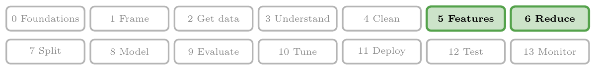
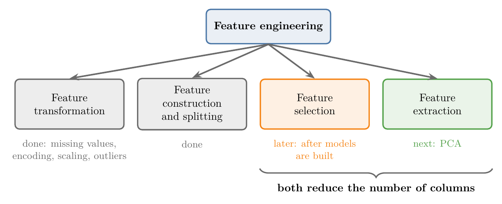
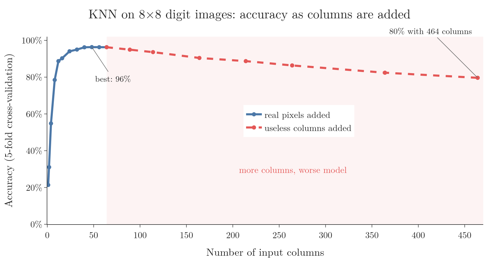

<!-- where-this-fits: generated by course_map/build_map.py; edit concepts.yaml, not this block -->
> **Where this fits:** Pipeline map steps 5 (Engineer features), 6 (Reduce dimensions). See the [Course map](../01-course-map/note.md).
>
> 
>
> - **Builds on:** Unsupervised learning ([Note 3](../03-types-of-ml/note.md)); Correlation ([Note 21](../21-bivariate-multivariate-analysis/note.md)); Feature engineering ([Note 23](../23-what-is-feature-engineering/note.md)).
> - **Leads to:** PCA ([Note 47](../47-pca-geometric-intuition/note.md)).
<!-- /where-this-fits -->

## 1. Where we are in feature engineering

> **Key point:** Two parts of feature engineering are left: feature selection and feature extraction. Both exist to fight the curse of dimensionality.



Figure 1 shows the four parts of feature engineering. Feature transformation (missing values, encoding, scaling, outliers) and feature construction and splitting are done.

Two parts remain:

- **Feature selection**: keep only the useful columns. It is usually done after a model is built, to check whether removing columns helps the model.
- **Feature extraction**: build a few new columns from the old ones. Its most important technique, PCA, comes next.

Both rest on one idea: the curse of dimensionality. This Note explains that idea, why it matters, and how we deal with it.

## 2. What the curse of dimensionality is

> **Key point:** Every dataset has an optimal number of columns. Past it, extra columns do not help, and often make the model worse and slower.

In ML, each column (feature) of the data is called a **dimension**. A dataset with 10 columns is 10-dimensional, and one with 1,000 columns is **high-dimensional**.

It seems that more columns should always help, since the model gets more information. In practice it does not work that way.

Every dataset has an **optimal number of features**. Up to that number, each new column improves the model. Beyond it:

- performance stops improving, and often gets worse;
- the model needs more computation and becomes more complex.

This is the **curse of dimensionality**: the problems that appear when data has too many dimensions.

## 3. An example: images of digits

> **Key point:** In images, every pixel is a column. Many pixels, such as the ones at the edges, carry almost no information.

Image data shows the curse clearly. To classify an image, we turn each pixel into one column. The well-known MNIST dataset of handwritten digits has images of 28 × 28 pixels, so 784 columns.

We use a smaller version here: scikit-learn's digits dataset, 1,797 images of 8 × 8 pixels, so 64 columns. Figure 2 shows one image and how much each pixel changes across all the images.


The digit is always drawn in the middle. The pixels at the left and right edges are almost always blank: 3 pixels never change at all, and 16 have a standard deviation below 1.

A pixel that is the same in every image cannot help tell one digit from another. It is a column the model has to process, with nothing to learn from.

### 3.1 Measuring the effect

> **Key point:** Accuracy rose to 96% with the useful pixels, then fell to 80% as we added useless columns.

Figure 3 shows a real experiment with KNN, a classifier that labels a point by looking at its nearest neighbours.



1. **Blue line:** we add the 64 pixels one group at a time, most useful first. Accuracy rises fast, from 21% with 1 pixel to 90% with 16 pixels. It levels off at 96% from about 40 pixels on.
2. **Red line:** we keep all 64 pixels and add columns of random numbers. Accuracy drops steadily, to 80% with 400 extra columns.

The blue line shows the optimal number of features: after about 40 pixels, adding more brings nothing. The red line shows that useless columns actively hurt.

> **Python:** Accuracy for different numbers of columns (full code in the Notebook).
>
> ```python
> from sklearn.model_selection import cross_val_score
> from sklearn.neighbors import KNeighborsClassifier
>
> def score(Z):
>     # average accuracy over 5 train/test splits
>     return cross_val_score(KNeighborsClassifier(), Z, y, cv=5).mean()
>
> score(X[:, order[:16]])               # best 16 pixels: 90%
> score(np.hstack([X, noise[:, :400]])) # 64 pixels + 400 random: 80%
> ```

> **Extra:** Cross-validation, used in `cross_val_score`, splits the data into 5 parts and tests on each part in turn. It gives a more reliable accuracy than a single train/test split. It is covered in detail later.

## 4. Why more dimensions cause trouble

> **Key point:** As dimensions grow, the same data gets spread thinner and thinner, so points end up far from each other.

### 4.1 Finding a lost wallet

> **Key point:** Each extra dimension makes the space to search much larger.

Suppose we lose our wallet. Where is it easiest to find?

1. **On a road** from the college gate to the building. The road is one-dimensional: we walk along it once and see everything.
2. **On the campus.** Now it can be anywhere on a two-dimensional area. The search takes much longer.
3. **In a multi-storey building.** Now it can be on any floor, in any room. Three dimensions make the search harder still.

The wallet is the same in each case. Only the number of dimensions changed, and with it the size of the space.

### 4.2 The same data spreads thin

> **Key point:** With 5 bins per column, each new column multiplies the number of cells by 5, while the number of points stays the same.

Figure 4 applies the wallet idea to data. We take the same 20 points and split each column into 5 bins.


| Columns | Like | Cells | Empty cells |
|---|---|---|---|
| 1 | a road in 5 stretches | 5 | 0 (0%) |
| 2 | a campus of 5 × 5 blocks | 25 | 11 (44%) |
| 3 | a building of 5 floors, 5 × 5 rooms each | 125 | 107 (86%) |

The number of cells grows as $5^d$, where $d$ is the number of columns. Twenty points are enough to fill a road, but they leave a building almost empty.

Data where most of the space is empty is called **sparse**. In sparse data, every point is far from the others.

### 4.3 Why this hurts models

> **Key point:** Many algorithms rely on distances between points. When every point is far from every other, distances stop being useful.

Many algorithms, such as KNN, make a prediction by finding the points closest to a new point. That only works if "close" means something.

In high dimensions, every point is far from every other point. The nearest neighbour is not really near, so the prediction is based on points that are not similar. This is why the KNN accuracy in Figure 3 fell as we added columns.

> **Extra:** In very high dimensions, distances also become almost all the same. Figure 5 measures the distance from one random point to 500 others. With 2 columns, the farthest point is 67 times farther than the nearest; with 1,000 columns, only 1.1 times. When everything is about equally far, "nearest" carries almost no information.


## 5. The two problems

> **Key point:** Too many dimensions cause two problems: lower performance and more computation.

1. **Performance decreases.** Useless and redundant columns make the data sparse and hide the real pattern. In Figure 3, accuracy fell from 96% to 80%.
2. **Computation increases.** Every extra column is more data to store and more numbers to process in every step. In the same experiment, scoring the model with 464 columns took about twice as long as with 64.

The fix for both is to bring the number of columns down to the optimal number.

## 6. The solution: dimensionality reduction

> **Key point:** Dimensionality reduction lowers the number of columns. It comes in two kinds: feature selection keeps the best columns; feature extraction builds new ones.

**Dimensionality reduction** means reducing the number of columns in the data while keeping as much of the useful information as possible. Figure 6 shows its two kinds.


### 6.1 Feature selection

> **Key point:** Feature selection chooses a subset of the existing columns and drops the rest.

Suppose we have five columns, F1 to F5. **Feature selection** picks the columns that matter most, such as F1 and F3, and the model is trained on those only. The kept columns are unchanged.

Two common techniques:

- **Forward selection:** start with no columns and add the most useful one at a time.
- **Backward elimination:** start with all columns and remove the least useful one at a time.

Both are covered later, after the main ML algorithms.

### 6.2 Feature extraction

> **Key point:** Feature extraction creates a few new columns, each a combination of all the old ones.

**Feature extraction** does not keep any of the original columns. It builds new columns, each a mix of the old ones, so that a few new columns hold most of the information of all the old ones.

In Figure 6, the five columns become two new ones, PC1 and PC2. Neither is equal to any original column.

The main techniques:

- **PCA** (principal component analysis), covered next;
- **LDA** (linear discriminant analysis);
- **t-SNE** (t-distributed stochastic neighbour embedding).

> **Extra:** The F2 column in Figure 6 is 0 in every row, like the edge pixels in Figure 2. Removing such a constant column is the simplest feature selection there is. In scikit-learn it is done by `VarianceThreshold`.

## 7. Summary

| | Feature selection | Feature extraction |
|---|---|---|
| What it does | keeps the best existing columns | builds new columns from all the old ones |
| Output columns | a subset of the originals | new, mixed columns |
| Techniques | forward selection, backward elimination | PCA, LDA, t-SNE |
| When | usually after a first model is built | next Notes (PCA) |

- Each column of the data is a dimension.
- Every dataset has an optimal number of features; past it, extra columns hurt.
- More dimensions spread the same data thinner: cells grow as $5^d$, points stay the same.
- Sparse data makes distances less useful, which hurts distance-based algorithms like KNN.
- Two problems: lower performance and more computation.
- The fix is dimensionality reduction: feature selection or feature extraction.

## 8. Key terms

| Term | Meaning |
|---|---|
| Dimension | One column (feature) of the data |
| High-dimensional data | Data with a very large number of columns |
| Optimal number of features | The number of columns at which a model performs best |
| Curse of dimensionality | The problems that appear when data has too many dimensions: lower performance and more computation |
| Sparse data | Data where most of the space holds no points |
| Dimensionality reduction | Reducing the number of columns while keeping the useful information |
| Feature selection | Keeping a subset of the existing columns |
| Forward selection | Feature selection that starts empty and adds the best column at a time |
| Backward elimination | Feature selection that starts with all columns and removes the worst at a time |
| Feature extraction | Building a few new columns, each a combination of the old ones |
