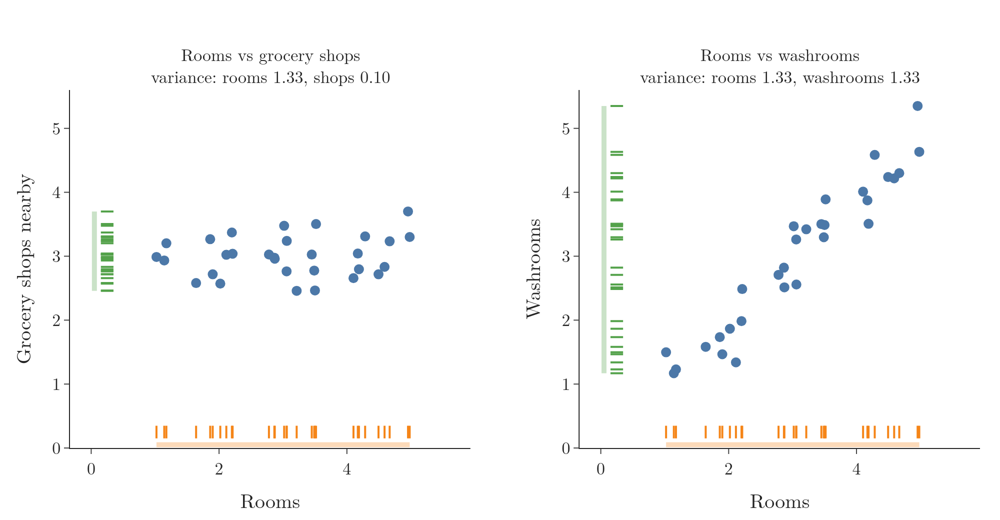
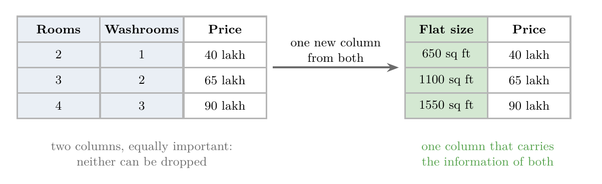
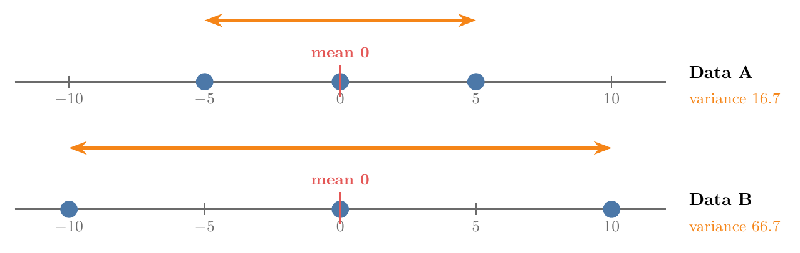
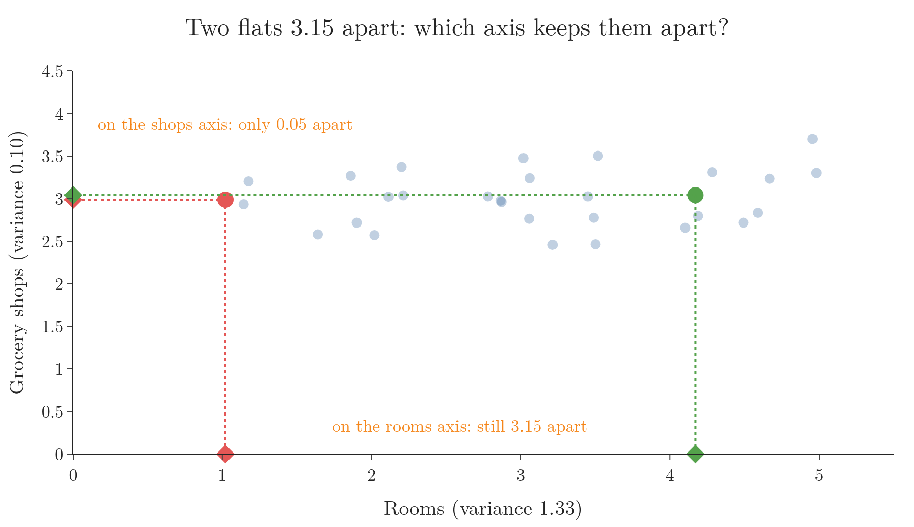

<!-- where-this-fits: generated by course_map/build_map.py; edit concepts.yaml, not this block -->
> **Where this fits:** Pipeline map steps 3 (Understand data), 6 (Reduce dimensions). See the [Course map](../01-course-map/note.md).
>
> 
>
> - **Builds on:** Unsupervised learning ([Note 3](../03-types-of-ml/note.md)); Descriptive statistics ([Note 19](../19-understanding-your-data/note.md)); Feature engineering (Video 23, coming); Standardization (Video 24, coming); Dimensionality reduction ([Note 46](../46-curse-of-dimensionality/note.md)); Curse of dimensionality ([Note 46](../46-curse-of-dimensionality/note.md)).
> - **Compare with:** Feature selection ([Note 46](../46-curse-of-dimensionality/note.md)).
<!-- /where-this-fits -->

## 1. What PCA is

> **Key point:** PCA is an unsupervised feature extraction technique. It turns many columns into a few new ones while keeping the essence of the data.

**Principal component analysis (PCA)** is the best-known feature extraction technique. It reduces the number of columns in a dataset, which fights the curse of dimensionality.

Three facts to keep in mind:

- PCA is **unsupervised**: it uses only the input columns, never the output column.
- It is old, well tested and reliable.
- Its full mathematics is involved. This Note builds the geometric intuition; the step-by-step mathematics comes in the next Note.

> **Extra:** PCA was first described by Karl Pearson in 1901 and developed further by Harold Hotelling in 1933.

### 1.1 The photographer

> **Key point:** A photo turns a 3D scene into 2D. A good photographer picks the angle that keeps the most information, and PCA does the same with data.

A photographer at a football match has a 3D scene in front of them: players spread over a pitch. A newspaper photo is 2D, so every photo loses one dimension.

From some angles the photo is useless: the players stand in a line, one behind the other. From other angles every player is clearly visible. Figure 1 shows both cases.


- **Camera A** looks along the length of the pitch. In its photo, the players overlap.
- **Camera B** looks across the pitch. In its photo, the players stay apart.

PCA works like a photographer who walks around the stadium to find the best angle. It moves data from a high dimension to a lower one, and picks the direction that keeps the most information.

### 1.2 Why use PCA

> **Key point:** Fewer columns make algorithms faster. Going down to 2 or 3 columns lets us plot the data.

1. **Faster algorithms.** With fewer columns, there is less data to process, both in training and in prediction. Performance stays close to what it was on the full data.
2. **Visualisation.** We cannot plot more than 3 dimensions. PCA can bring a dataset with many columns down to 3 or 2, and then we can plot it. A later Note does this with images of digits that have 784 columns.

## 2. Feature selection by spread

> **Key point:** To choose between two columns, project the points onto each axis and keep the column whose points are more spread out.

PCA is a feature extraction technique, but it is easiest to understand by first looking at feature selection.

Take made-up data about flats with three columns: the number of rooms, the number of grocery shops nearby, and the price. Suppose we must drop one of the two input columns.

Anyone who knows a little about property would keep rooms: the price depends much more on rooms than on nearby grocery shops. But often we work with data we know nothing about. We need a rule that does not depend on knowing the subject.

### 2.1 The rule: keep the bigger spread

> **Key point:** The shadow of the points on an axis shows how much that column varies. The longer the shadow, the more information.

Figure 2 (left) plots the flats with rooms on the x-axis and grocery shops on the y-axis.



Imagine shining a light so each point casts a shadow on the x-axis. Dropping each point straight down onto an axis like this is called **projecting** it.

- On the rooms axis (orange), the shadows stretch from 1 to 5.
- On the grocery shops axis (green), they cover only a short stretch.

The data is spread out along rooms and bunched up along grocery shops. So we keep rooms. The size of this spread is measured by the **variance** of the shadows: 1.33 for rooms and 0.10 for grocery shops.

This is how feature selection decides: keep the columns with the largest variance.

### 2.2 Where feature selection fails

> **Key point:** When two columns have about the same spread, feature selection cannot tell which one to drop.

Now replace grocery shops with the number of washrooms. Rooms and washrooms rise together: a flat with more rooms usually has more washrooms.

Figure 2 (right) shows this data. Projected onto either axis, the spread is the same: variance 1.33 for both. Both columns matter for the price, and the rule from Section 2.1 cannot choose.

Feature selection is stuck. Feature extraction solves this.

## 3. Feature extraction: a new column

> **Key point:** Instead of dropping one of two equal columns, build one new column that carries the information of both.

Suppose we ask a property broker which of the two columns to drop. A broker might say: neither, both matter. Instead, collect a single new column, the **size of the flat**. More rooms and more washrooms both mean a bigger flat, so size tells us about both.



Figure 3 shows the result: two input columns become one, and the price can still be predicted. The data went from 2 dimensions to 1.

This is exactly what PCA does. It ignores the original columns as they are, builds a new set of columns from them, and keeps the new columns that matter most. Unlike the broker, PCA needs no knowledge of the subject: it finds the new columns from the data alone.

## 4. How PCA finds the new columns

> **Key point:** PCA rotates the axes until one axis points along the direction of greatest spread. That axis is the first principal component.

Feature selection could only look along the two existing axes, rooms and washrooms. PCA is allowed to turn the axes to any angle.

Figure 4 shows the idea on the rooms and washrooms data. We draw a line through the centre of the data, project every point onto it, and measure the variance of the shadows. Then we turn the line and measure again.


1. **Along rooms (0°):** variance 1.33.
2. **Along washrooms (90°):** variance 1.33, the same.
3. **At 45°:** variance 2.61, the largest of any angle. This line is the first principal component.
4. **At right angles to it:** variance only 0.05. This is the second principal component.

The new axes are called **principal components**, written **PC1** and **PC2**. PC1 is the direction with the most variance; PC2 is at right angles to it and holds what is left.

Here PC1 holds almost all the spread, 2.61 against 0.05. So we keep PC1, drop PC2, and describe each flat by one number: its position along PC1. Two columns have become one, just like the broker's flat size.

### 4.1 How many principal components

> **Key point:** Data with n columns has at most n principal components. We keep the first few.

Rotating the axes does not create extra axes. Data with 2 columns gives 2 principal components; data with 10 columns gives up to 10. The same idea works in 3, 4 or any number of dimensions.

The components come in order: PC1 holds the most variance, PC2 the next most, and so on. Reducing dimensions means keeping the first few and dropping the rest.

> **Python:** PCA in scikit-learn (full code in the Notebook).
>
> ```python
> from sklearn.decomposition import PCA
>
> pca = PCA(n_components=2).fit(P)   # P: rooms and washrooms
> pca.components_[0]                 # PC1 direction: [0.707, 0.707], i.e. 45 degrees
> pca.explained_variance_ratio_      # [0.981, 0.019]: PC1 holds 98% of the variance
>
> # keep only PC1: two columns become one
> PCA(n_components=1).fit_transform(P).shape   # (30, 1)
> ```

How PCA finds PC1 without trying every angle is the subject of the next Note.

## 5. Variance

> **Key point:** The mean says where the data is centred. Variance says how spread out it is.

PCA is built on variance, so it is worth being precise about what variance means.

### 5.1 Mean is not enough

> **Key point:** Two datasets can have the same mean and very different spreads.

Take two small datasets (Figure 5):

- Data A: $-5, 0, 5$
- Data B: $-10, 0, 10$



Both have mean 0. The **mean** describes the centre of the data, so it cannot tell these two apart. Data B is clearly more spread out, and to measure that we need variance.

### 5.2 The variance formula

> **Key point:** Variance is the average squared distance of the points from their mean.

In words: for every point, find how far it is from the mean, square that distance, and average the squares.

$$\sigma^2 = \frac{1}{n}\sum_{i=1}^{n} (x_i - \bar{x})^2$$

Here $x_i$ is the $i$-th point, $\bar{x}$ is the mean and $n$ is the number of points.

For Data A, with mean 0:

$$\sigma^2 = \frac{(-5)^2 + 0^2 + 5^2}{3} = \frac{50}{3} \approx 16.7$$

For Data B:

$$\sigma^2 = \frac{(-10)^2 + 0^2 + 10^2}{3} = \frac{200}{3} \approx 66.7$$

Data B's variance is 4 times Data A's. Variance tells the two datasets apart where the mean could not.

### 5.3 Variance and spread

> **Key point:** Variance grows with spread but is not the spread itself. Its square root, the standard deviation, is in the same units as the data.

Data B is twice as spread out as Data A, but its variance is 4 times larger. That is because the distances are squared: variance grows with the square of the spread.

Taking the square root brings it back to the units of the data. This is the **standard deviation**, $\sigma$: about 4.1 for Data A and 8.2 for Data B, exactly twice.

### 5.4 Why squares, not absolute distances

> **Key point:** Squared distances give a smooth formula that the optimisation inside PCA can work with; absolute distances do not.

We could measure spread without squares: take the absolute distance $|x_i - \bar{x}|$ of each point from the mean and average them. This is the **mean absolute deviation**.

PCA does not use it. Finding the best direction is an optimisation problem, and solving it needs a formula we can differentiate. The absolute value has a sharp corner at zero, where it cannot be differentiated. The square is smooth everywhere, so variance is used.

## 6. Why PCA maximises variance

> **Key point:** Keeping the direction of greatest variance keeps the points as far apart as they really are. A low-variance direction squeezes different points together.

Figure 6 picks out two flats from the rooms and grocery shops data. They are 3.15 apart: one has 1 room and the other 4, with almost the same number of grocery shops.



- **Projected on rooms** (the high-variance axis), they are still 3.15 apart.
- **Projected on grocery shops** (the low-variance axis), they are only 0.05 apart. They look almost identical.

Many algorithms, such as KNN, work with distances between points. After a projection onto the grocery shops axis, such an algorithm could never tell these two flats apart.

This is why PCA always looks for the direction of maximum variance. It keeps the distances between points, and so the relationships in the data, as close as possible to the original. It is the photographer choosing the angle where the players stay apart.

> **Extra:** PCA is sometimes described as finding the line with the *least* error. This is the same line seen from the other side. Each point's squared distance from the centre splits into two parts (Pythagoras): the part along the line, and the part from the point to the line. The total is fixed, so making the first part as large as possible makes the second as small as possible. In Figure 4 the total variance is 2.66: at 45° it splits into 2.61 along PC1 and 0.05 left over. Maximum variance along the line and minimum distance to the line are the same answer.

## 7. Summary

| Idea | What it means |
|---|---|
| PCA | Unsupervised feature extraction: few new columns from many old ones |
| Projection | Dropping each point onto an axis, like a shadow |
| Variance | How spread out the points are; average squared distance from the mean |
| Feature selection by spread | Keep the existing column with the largest variance |
| Its weakness | Fails when columns have similar variance (rooms and washrooms) |
| Principal components | New, rotated axes; PC1 has the most variance, PC2 the next |
| Why maximise variance | Points that are far apart stay far apart |

- PCA makes algorithms faster and lets us plot high-dimensional data.
- Feature selection can only keep or drop existing columns; PCA builds new ones.
- PCA rotates the axes so that PC1 points along the greatest spread.
- Data with n columns has at most n principal components; we keep the first few.
- Variance, not mean absolute deviation, because it is smooth enough to optimise.

## 8. Key terms

| Term | Meaning |
|---|---|
| Principal component analysis (PCA) | An unsupervised feature extraction technique that builds new columns along the directions of greatest variance |
| Projection | Dropping each point onto an axis or line, like casting a shadow |
| Variance | The average squared distance of the points from their mean |
| Mean | The average of the values; the centre of the data |
| Standard deviation | The square root of the variance, in the same units as the data |
| Mean absolute deviation | The average absolute distance of the points from their mean |
| Principal component | A new axis found by PCA; PC1 holds the most variance, PC2 the next most |
