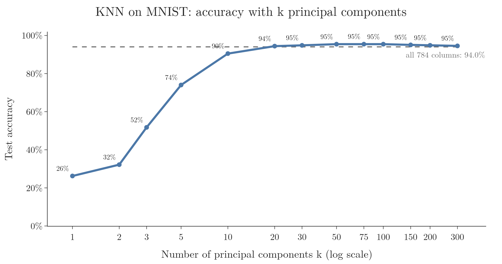
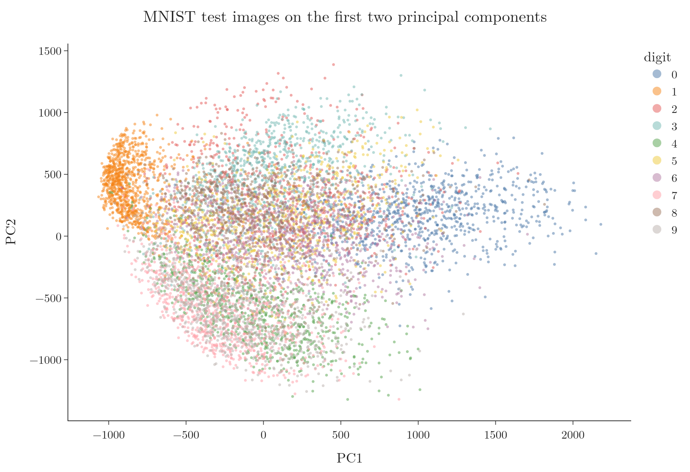

<!-- where-this-fits: generated by course_map/build_map.py; edit concepts.yaml, not this block -->
> **Where this fits:** Pipeline map step 6 (Reduce dimensions). See the [Course map](../01-course-map/note.md).
>
> 
>
> - **Builds on:** Unsupervised learning ([Note 3](../03-types-of-ml/note.md)); Standardization ([Note 24](../24-standardization/note.md)); Feature scaling ([Note 24](../24-standardization/note.md)); Curse of dimensionality ([Note 46](../46-curse-of-dimensionality/note.md)); Feature extraction ([Note 47](../47-pca-geometric-intuition/note.md)); Variance ([Note 47](../47-pca-geometric-intuition/note.md)).
> - **Compare with:** Low-rank approximation (truncated SVD) ([Note 612](../612-low-rank-approximation/note.md)).
<!-- /where-this-fits -->

## 1. Overview

> **Key point:** On real image data, PCA cuts 784 columns to 50 with almost the same accuracy and much faster predictions. It also lets us see the data in 2D and 3D.

The previous two Notes built PCA from the geometry and the mathematics. This Note uses scikit-learn's `PCA` on a real dataset of handwritten digits, for PCA's two main jobs:

1. **Fewer columns:** train a model on a few principal components instead of every pixel, and compare accuracy and speed (Sections 3 and 4).
2. **Visualisation:** squeeze the data into 2 or 3 columns and plot it (Section 5).

Then we answer two practical questions. How many components should we keep (Section 7)? And when does PCA not help at all (Section 8)?

## 2. The MNIST data

> **Key point:** Each image is 28 × 28 pixels, stored as one row of 784 columns plus a label from 0 to 9.

**MNIST** is a well-known set of images of handwritten digits, 0 to 9. Each image is 28 × 28 = 784 grey pixels, and each pixel's brightness runs from 0 (white) to 255 (black).

To put images in a table, each image becomes one row with one column per pixel: the first 28 columns are the top row of the image, the next 28 the second row, and so on. One more column holds the label, the digit the image shows. Reshaping a row back into 28 × 28 shows the picture again.

We use 42,000 images and split them 80/20: 33,600 for training and 8,400 for testing. The task is classification: from the 784 pixel values, predict the digit.

> **Extra:** The images here come from the full MNIST set on OpenML (70,000 images), loaded with `fetch_openml("mnist_784")`. We take a random 42,000, the same size as the Digit Recognizer competition file on Kaggle, which is also drawn from MNIST and needs a Kaggle account to download. Results on the two are very close.

> **Python:** Loading the data and splitting it.
>
> ```python
> from sklearn.datasets import fetch_openml
> from sklearn.model_selection import train_test_split
>
> X, y = fetch_openml("mnist_784", version=1,
>                     return_X_y=True, as_frame=False)
> # (a random 42,000 rows are kept; see the Notebook)
> X_train, X_test, y_train, y_test = train_test_split(
>     X, y, test_size=0.2, random_state=2)
> ```

## 3. KNN on all 784 columns

> **Key point:** KNN reaches 96.8% on the raw pixels, but each prediction compares the image with 33,600 others across 784 columns, which is slow.

We first train **KNN** (K-nearest neighbours) with its default of 5 neighbours on all 784 columns. To classify a test image, KNN computes its distance to every one of the 33,600 training images and takes the most common label among the 5 nearest.

The result: **96.8% accuracy**, but the training and prediction took about **19 seconds**. Each of the 8,400 test images needs 33,600 distances in 784 dimensions. This is the computation problem of the curse of dimensionality.

## 4. KNN on principal components

> **Key point:** Standardise, fit PCA on the training set, transform both sets, then train the same KNN on the new columns.

### 4.1 The steps

> **Key point:** PCA learns its components from the training set only, like a scaler, and then transforms both sets.

PCA in scikit-learn follows the same fit and transform pattern as scalers and encoders:

1. **Standardise** the pixels, so each column has mean 0 (PCA's first step).
2. **Fit** `PCA` on the training set: it computes the covariance matrix and its eigenvectors.
3. **Transform** both sets: project every image onto the kept components.
4. **Train KNN** on the transformed training set and test it on the transformed test set.

The parameter `n_components` sets how many components to keep. Left as `None`, it keeps all of them, 784 here.

> **Python:** KNN on 100 principal components.
>
> ```python
> from sklearn.preprocessing import StandardScaler
> from sklearn.decomposition import PCA
> from sklearn.neighbors import KNeighborsClassifier
>
> scaler = StandardScaler().fit(X_train)
> X_train_s = scaler.transform(X_train)
> X_test_s = scaler.transform(X_test)
>
> pca = PCA(n_components=100).fit(X_train_s)  # train only
> Z_train = pca.transform(X_train_s)          # (33600, 100)
> Z_test = pca.transform(X_test_s)            # (8400, 100)
>
> knn = KNeighborsClassifier(n_neighbors=5).fit(Z_train, y_train)
> knn.score(Z_test, y_test)                   # 0.954
> ```

With 100 components the accuracy is **95.4%**, and the whole run takes about 1 second instead of 19. We dropped 684 of the 784 columns and lost about one point of accuracy.

### 4.2 Accuracy as k grows

> **Key point:** Accuracy climbs steeply over the first 10 components, levels off around 50, and then stays flat or dips slightly.

How many components do we need? Figure 1 repeats the experiment for k from 1 to 300 components.



| k | 1 | 2 | 3 | 5 | 10 | 20 | 50 | 100 | 300 |
|---|---|---|---|---|---|---|---|---|---|
| Accuracy | 26% | 32% | 52% | 74% | 90% | 94% | 95.4% | 95.4% | 94.5% |

- **1 to 10 components:** each one adds a lot; the first components carry the most information.
- **20 to 100:** the curve is flat. Later components add little.
- **Above 100:** accuracy dips slightly. The extra components add more noise than signal for KNN.

So 50 components, 6% of the original columns, give the best result in this run.

> **Extra:** Standardising the pixels lowers KNN's accuracy on all 784 columns, from 96.8% to 94.0% (the dashed line in Figure 1). Edge pixels are almost always 0; standardising stretches their rare tiny changes to the same scale as the important centre pixels. PCA then puts the noisy directions last, which is why 50 components beat all 784 standardised columns. For images, PCA is often run on unscaled pixels instead, since all pixels already share the same 0 to 255 scale.

## 5. Visualising the digits

> **Key point:** With 2 or 3 components we can draw all 784-dimensional images as points and see which digits sit apart and which overlap.

PCA's second job is visualisation. We cannot plot 784 dimensions, but we can plot the first 2 or 3 principal components.

### 5.1 In 2D

> **Key point:** In 2D the digits overlap heavily, but some groups are already visible: 1s on one side, 0s on the other.

Figure 2 shows the 8,400 test images on PC1 and PC2, coloured by their label.

{height=55%}

The colours overlap a lot: two numbers per image cannot hold 784 pixels' worth of information. Still, a pattern shows. The 1s (orange) form a tight group on the left and the 0s (blue) spread out on the right. Digits drawn with few dark pixels, like 1, sit at one end of PC1; digits with many, like 0, at the other.

### 5.2 In 3D

> **Key point:** A third component separates more digits. Similar-looking digits, such as 3 and 8, stay mixed.

Figure 3 adds PC3 and shows five digits only, to keep the picture readable.

{height=60%}

- **0 and 7** sit in clearly different regions: they look very different.
- **3 and 8** are mixed together: an 8 looks like a 3 closed on the left.
- **1** sits in a tight cluster inside the others.

In the Notebook this plot is interactive: we can turn it, zoom, and click digits in the legend to hide or show them. Turning it shows other close pairs, such as 4 and 9, which share a vertical stroke.

## 6. What a fitted PCA stores

> **Key point:** `explained_variance_` holds the eigenvalues, `components_` holds the eigenvectors, and `explained_variance_ratio_` holds each component's share of the variance.

After `fit`, a `PCA` object keeps the results of its eigen-decomposition (from the previous Note):

| Attribute | What it holds | For 3 components on MNIST |
|---|---|---|
| `explained_variance_` | the eigenvalues, largest first | 40.4, 29.0, 27.0 |
| `components_` | the eigenvectors, one per row | shape (3, 784) |
| `explained_variance_ratio_` | each eigenvalue divided by the sum of all | 5.7%, 4.1%, 3.8% |

Each eigenvector has 784 numbers because it is a direction in the 784-dimensional pixel space. Reshaped to 28 × 28, each one is itself a picture: it shows which pixels that component combines.

The first three components together hold only 14% of the variance. That is why the 2D and 3D pictures overlap so much.

## 7. How many components to keep

> **Key point:** Add up the explained variance ratios from the largest down, and keep enough components to reach about 90% of the variance.

### 7.1 Explained variance

> **Key point:** Each eigenvalue, divided by the sum of all eigenvalues, is the share of the data's variance that its component explains.

Each eigenvalue $\lambda_i$ is the variance along component $i$. The total variance of the data is the sum of all of them.

In words: the share of variance a component explains is its eigenvalue divided by the sum of all eigenvalues.

$$\text{explained variance ratio}_i = \frac{\lambda_i}{\lambda_1 + \lambda_2 + \dots + \lambda_d}$$

With numbers: on standardised MNIST the 784 eigenvalues add up to 713. PC1's eigenvalue is 40.4, so

$$\frac{40.4}{713} \approx 0.057 = 5.7\%$$

### 7.2 The cumulative curve and the 90% rule

> **Key point:** On MNIST, 228 components explain 90% of the variance.

Adding up the ratios in order gives the **cumulative explained variance**: the share kept by the first $k$ components. Figure 4 plots it for every $k$.


The curve rises fast and then flattens towards 100%. A common rule of thumb is to keep enough components to explain about **90%** of the variance: on MNIST, **228 components**. For 95% it takes 320.

> **Python:** Finding k for 90%.
>
> ```python
> import numpy as np
>
> full = PCA().fit(X_train_s)       # keep all 784 components
> cum = np.cumsum(full.explained_variance_ratio_)
> np.searchsorted(cum, 0.90) + 1    # 228
>
> # or let scikit-learn choose: a number between 0 and 1
> # means "keep this share of the variance"
> PCA(n_components=0.90).fit(X_train_s).n_components_  # 228
> ```
>
> `np.cumsum` gives the running total. `np.searchsorted` finds the first position where it reaches 0.90; positions start at 0, so we add 1.

> **Extra:** The 90% rule is a safe starting point, not a law. In Figure 1, KNN was already at its best with 50 components, which explain only about 56% of the variance. When there is a model to evaluate, the most direct way to pick $k$ is to try several values and compare the test or cross-validation scores, as Section 4.2 did.

## 8. When PCA does not help

> **Key point:** PCA only finds straight directions of large spread. It fails when there is no such direction, when the useful difference lies along a small-spread direction, or when the pattern is curved.

PCA is powerful, but it can only rotate the axes and drop some. Figure 5 shows three kinds of data where that is not enough. In each, the orange line is PC1, and the strip below shows the points projected onto it.


1. **The same spread in every direction.** The points form a round cloud. Every direction has about the same variance, so PC1 holds only about half of it (54%). Whichever axis we drop, we lose as much as we keep.
2. **The classes differ along the small spread.** Two long, thin groups lie side by side. PC1 runs along their length, which has the most variance, and holds 88% of it. But the two classes differ across their width. Projected onto PC1, they fall on top of each other.
3. **A curved pattern.** The points follow a U shape. PCA can only project onto a straight line, so the U is flattened, and points from the two arms of the U land in the same place.

In all three cases, the picture in fewer dimensions mixes up points that were clearly apart, and a model trained on it does worse.

> **Extra:** Case 2 shows that PCA is unsupervised: it never looks at the labels, so it keeps spread, not class differences. A supervised method, **LDA** (linear discriminant analysis), looks for the directions that separate the classes instead. For curved patterns (case 3), non-linear methods such as kernel PCA or t-SNE exist.

## 9. Summary

| Question | Answer on MNIST |
|---|---|
| Accuracy with all 784 raw pixels | 96.8%, about 19 seconds |
| Accuracy with 50 to 100 components | 95.4%, about 1 second |
| Components for 90% of the variance | 228 |
| Variance in the first 3 components | 14% |
| Digits that separate well in 3D | 0, 1 and 7 |
| Digits that overlap | 3 and 8, 4 and 9 |

- Use PCA like a scaler: fit on the training set, transform both sets.
- A few principal components can keep almost all the accuracy at a fraction of the computation.
- 2 or 3 components let us look at high-dimensional data, but they hold only part of its information.
- `explained_variance_ratio_` and its running total tell how much of the data each $k$ keeps; about 90% is a common target.
- PCA fails when spread is equal in all directions, when classes differ along a small-spread direction, or when the pattern is curved.

## 10. Key terms

| Term | Meaning |
|---|---|
| MNIST | A dataset of 70,000 images of handwritten digits, 28 × 28 pixels each |
| n_components | The number of principal components PCA keeps; a number between 0 and 1 means a share of the variance |
| explained_variance_ | The eigenvalues of the fitted PCA, largest first |
| components_ | The eigenvectors of the fitted PCA, one per row |
| Explained variance ratio | One component's share of the total variance: its eigenvalue divided by the sum of all |
| Cumulative explained variance | The share of the variance kept by the first k components together |
| LDA | Linear discriminant analysis: a supervised method that finds the directions that best separate the classes |
