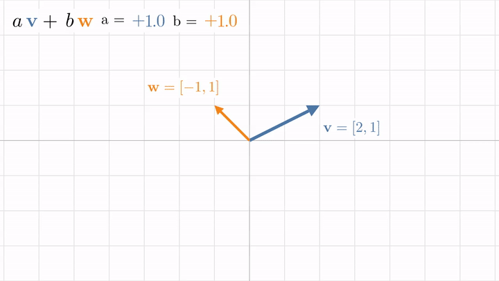
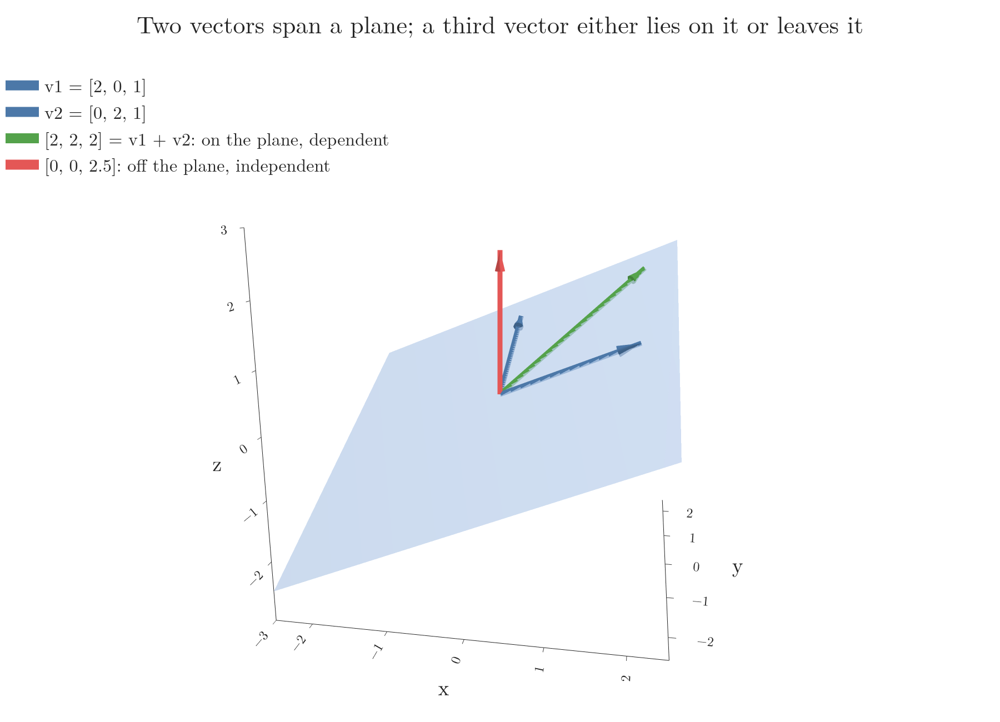

<!-- where-this-fits: generated by course_map/build_map.py; edit concepts.yaml, not this block -->
> **Where this fits:** Pipeline map step 0 (Foundations). See the [Course map](../01-course-map/note.md).
>
> 
>
> - **Builds on:** Vectors and feature vectors ([Note 360](../360-vectors-and-feature-vectors/note.md)).
> - **Leads to:** Linear transformations and matrices ([Note 500](../500-linear-transformations-and-matrices/note.md)).
> - **Compare with:** Multicollinearity ([Note 27](../27-one-hot-encoding/note.md)).
<!-- /where-this-fits -->

## 1. Overview

> **Key point:** Scaling vectors and adding them gives a linear combination; all the vectors we can reach this way form the span; a set of vectors that reaches everything with no spare vector is a basis.



Figure 1 shows the whole Note in motion. We take two vectors, scale each by a number, and add the results. Turning one number draws a line; turning both reaches every point of the plane, unless the two vectors lie on the same line.

What a vector is, and how a row of data becomes a feature vector, is taught in the [vectors and feature vectors Note](../360-vectors-and-feature-vectors/note.md). Scaling a vector is in the [magnitude, distance and scalar operations Note](../361-magnitude-distance-and-scalar-operations/note.md) (section 6). This Note adds the second operation, adding two vectors, and builds everything else from the two.

> **Extra:** The geometric pictures in this Note and the next four (linear transformations, matrix multiplication, duality, eigenvectors) follow 3Blue1Brown's *Essence of Linear Algebra* series, the series the [linear algebra roadmap Note](../350-linear-algebra-roadmap/note.md) recommends.

## 2. Three ways to see a vector

> **Key point:** A vector is an arrow (physics), a list of numbers (computer science), or anything that can be added and scaled (mathematics); linear algebra is the translation between the first two.

There are three related views of what a vector is:

- **The arrow view (physics).** A vector is an arrow with a length and a direction. In linear algebra we almost always draw it with its tail at the origin.
- **The list view (computer science).** A vector is an ordered list of numbers. A house described by its area and its price is the 2D vector [area, price]; the order matters. This is the feature vector of ML.
- **The abstract view (mathematics).** A vector is anything for which "add two of them" and "multiply one by a number" make sense. This view says that those two operations are what all of linear algebra is built on.

The coordinates of a vector link the first two views. They are instructions for walking from the tail at the origin to the tip: the first number says how far to walk along the x-axis (right if positive, left if negative), the second how far parallel to the y-axis. Every list of numbers gives exactly one arrow, and every arrow gives exactly one list.

The power of linear algebra lies in moving between the views. For data, a table of numbers becomes a picture of points we can reason about. For computer graphics or physics, a picture of space becomes numbers a computer can crunch.

> **Extra:** One collection of vectors, two pictures. A single vector is best drawn as an arrow. A large set of vectors, such as all 150 iris flowers, is best drawn as points: one point at the tip of each arrow. This is why a scatter plot of a dataset is a picture of its feature vectors.

## 3. Adding two vectors

> **Key point:** To add two vectors, put the tail of the second at the tip of the first; numerically, add matching components.

### 3.1 Tip to tail

> **Key point:** Each vector is a step; adding two vectors means taking one step and then the other.

Think of each vector as a movement: a step of some length in some direction. Taking the step $\mathbf{v}$ and then the step $\mathbf{w}$ lands us at the same place as one single step, their sum $\mathbf{v} + \mathbf{w}$.

So to draw a sum, we slide the second arrow so that its tail sits on the tip of the first. The arrow from the origin to the new tip is the sum (Figure 2, left). This is the one place in linear algebra where we let a vector leave the origin. It is the same idea as adding numbers on a number line: 2 steps right and then 5 steps right is 7 steps right.

![Left: adding $[1, 2]$ and $[3, -1]$ tip to tail. Right: the coordinates $[3, -2]$ as scaled basis vectors](images/add_and_basis.png)

### 3.2 Adding components

> **Key point:** Do all the horizontal steps, then all the vertical steps: the sum adds the x-components and the y-components separately.

1. **In words:** add the first components together, then the second components, and so on.
2. **Formula:** for two $n$-dimensional vectors,
   $$\mathbf{v} + \mathbf{w} = [v_1 + w_1,\ v_2 + w_2,\ \dots,\ v_n + w_n]$$
3. **Example:** walking $[1, 2]$ then $[3, -1]$ is 1 right, 2 up, 3 right, 1 down. Regrouping the horizontal and the vertical moves,
   $$[1, 2] + [3, -1] = [1 + 3,\ 2 + (-1)] = [4, 1]$$

Both vectors must have the same number of components. With the scaling of the [magnitude, distance and scalar operations Note](../361-magnitude-distance-and-scalar-operations/note.md) (multiply every component by the number, which stretches, squishes or flips the arrow), we now have the two operations of linear algebra. A number used to scale a vector is called a **scalar**, which is why "scalar" and "number" are used almost as synonyms.

> **Python:** NumPy adds vectors component by component.
>
> ```python
> import numpy as np
>
> v = np.array([1, 2])
> w = np.array([3, -1])
> v + w        # array([4, 1])
> 2 * v        # array([2, 4]): scaling
> ```

## 4. Coordinates are scalars: basis vectors

> **Key point:** The coordinates $[3, -2]$ mean "3 times $\hat{\imath}$ plus $-2$ times $\hat{\jmath}$", where $\hat{\imath}$ and $\hat{\jmath}$ are the unit vectors along the axes.

The xy-plane has two special vectors:

- $\hat{\imath}$ ("i-hat"): length 1, pointing right along the x-axis, $\hat{\imath} = [1, 0]$.
- $\hat{\jmath}$ ("j-hat"): length 1, pointing up along the y-axis, $\hat{\jmath} = [0, 1]$.

Now read each coordinate as a scalar. In $[3, -2]$, the 3 stretches $\hat{\imath}$ to 3 times its length, and the $-2$ flips $\hat{\jmath}$ and stretches it to twice its length. Adding the two scaled vectors gives the vector (Figure 2, right):

$$[3, -2] = 3\,\hat{\imath} + (-2)\,\hat{\jmath} = [3, 0] + [0, -2]$$

So every vector is a sum of scaled $\hat{\imath}$ and $\hat{\jmath}$. Together, $\hat{\imath}$ and $\hat{\jmath}$ are called the **standard basis** of the plane: the vectors that the coordinates scale.

In 3D a third unit vector $\hat{k} = [0, 0, 1]$ joins them, and in $n$ dimensions there are $n$ of them. A feature vector reads the same way: the flower $[5.1, 3.5, 1.4, 0.2]$ is 5.1 units of "sepal length" plus 3.5 units of "sepal width", and so on, one unit vector per column.

## 5. Linear combinations

> **Key point:** Scaling some vectors and adding the results is a linear combination; fixing all scalars but one makes the tip move along a straight line.

Scaling two vectors and adding them,

$$a\,\mathbf{v} + b\,\mathbf{w}, \qquad a, b \text{ any numbers}$$

is called a **linear combination** of $\mathbf{v}$ and $\mathbf{w}$. With more vectors, we pick one scalar per vector: $a_1\mathbf{v}_1 + a_2\mathbf{v}_2 + \dots + a_k\mathbf{v}_k$.

One way to remember the word "linear": fix $b$ and let only $a$ change. The tip of $a\mathbf{v} + b\mathbf{w}$ then runs along a straight line, parallel to $\mathbf{v}$ (Figure 1, top right).

### 5.1 Other bases give other coordinates

> **Key point:** Any two vectors that do not line up can serve as a basis; the same arrow then gets different coordinates.

Nothing forces us to use $\hat{\imath}$ and $\hat{\jmath}$. Take $\mathbf{v} = [1, 1]$ and $\mathbf{w} = [1, -1]$ instead. Every 2D vector is still a linear combination of them, but with different scalars.

1. **In words:** find the scalars $a$ and $b$ that rebuild the vector from the new basis vectors; they are its coordinates in that basis.
2. **Formula:**
   $$a\,\mathbf{v} + b\,\mathbf{w} = \mathbf{x}$$
3. **Example:** for $\mathbf{x} = [3, -2]$, the x-components give $a + b = 3$ and the y-components $a - b = -2$. Adding the two equations, $2a = 1$, so $a = 0.5$ and $b = 2.5$:
   $$0.5\,[1, 1] + 2.5\,[1, -1] = [0.5 + 2.5,\ 0.5 - 2.5] = [3, -2]$$

So the same arrow is $[3, -2]$ in the standard basis and $[0.5, 2.5]$ in the basis $\mathbf{v}, \mathbf{w}$. Whenever we write a vector as numbers, we have silently chosen a basis.

> **Python:** Finding the coordinates in a new basis means solving a small system of equations. `np.linalg.solve` takes the basis vectors as the columns of a matrix.
>
> ```python
> # v and w as the columns of B
> B = np.column_stack([[1, 1], [1, -1]])
> np.linalg.solve(B, [3, -2])     # array([0.5, 2.5])
> ```

> **Extra:** Changing the basis is everyday ML. PCA (see the [PCA step by step Note](../48-pca-step-by-step/note.md)) re-describes each data point in a new basis made of the principal components: the new coordinates are the PC1, PC2, ... values. Word embeddings and the hidden layers of a neural network can be read in the same spirit: each describes the data by new numbers that the model found useful, a learned **representation** (Bengio et al. 2013).

## 6. Span

> **Key point:** The span of some vectors is every vector we can reach with their linear combinations: for two 2D vectors, the whole plane, or only a line if they line up.

The **span** of a set of vectors is the set of all their linear combinations. It answers one question: using only scaling and adding, where can we get to?

### 6.1 Two vectors in 2D

> **Key point:** Two vectors pointing in different directions span the whole plane; two vectors on one line span only that line.

Let both scalars in $a\mathbf{v} + b\mathbf{w}$ range freely. Three things can happen:

- **Most pairs:** the tips reach every point of the plane. In Figure 1 (bottom left), $\mathbf{v} = [2, 1]$ and $\mathbf{w} = [-1, 1]$ build a slanted grid of reachable points, and filling in all the values between gives the whole plane.
- **Two vectors on one line:** if $\mathbf{w}$ is a multiple of $\mathbf{v}$, every combination lies on that line. In Figure 1 (bottom right), $\mathbf{w} = [-1, -0.5] = -0.5\,\mathbf{v}$, so the span is the line through the origin along $\mathbf{v}$.
- **Both vectors zero:** the span is the origin alone.

### 6.2 Vectors in 3D

> **Key point:** Two 3D vectors span a flat sheet through the origin; a third vector either lies on that sheet and adds nothing, or leaves it and unlocks all of 3D space.

In 3D, two vectors that do not line up span a plane through the origin. Picture two knobs, one per scalar: as we turn them, the tip of $a\mathbf{v} + b\mathbf{w}$ sweeps out a flat sheet. In Figure 3, $\mathbf{v}_1 = [2, 0, 1]$ and $\mathbf{v}_2 = [0, 2, 1]$ span the blue plane, whose points are all $[2a, 2b, a + b]$.

{height=48%}

A third vector, with a third scalar, gives two cases:

- **On the plane** (green, $[2, 2, 2] = \mathbf{v}_1 + \mathbf{v}_2$): its scaled copies stay on the sheet. The span does not grow.
- **Off the plane** (red, $[0, 0, 2.5]$): scaling it lifts the sheet up and down, sweeping it through all of space. The span becomes the whole of 3D.

A third vector chosen at random almost always lands off the plane.

## 7. Linear dependence and independence

> **Key point:** Vectors are linearly dependent when one of them is a combination of the others, so it can be removed without shrinking the span; otherwise they are independent.

When a vector adds nothing to the span (the green vector in Figure 3, or two 2D vectors on one line), we need a word for it. Vectors are **linearly dependent** when at least one of them can be written as a linear combination of the others: removing it does not shrink the span. They are **linearly independent** when each one adds a new direction, a new dimension, to the span.

With numbers:

- $[1, 2]$ and $[2, 4]$ are dependent, since $[2, 4] = 2\,[1, 2]$. Their span is a line.
- $[1, 2]$ and $[3, 1]$ are independent. Their span is the whole plane.
- $[2, 0, 1]$, $[0, 2, 1]$ and $[2, 2, 2]$ are dependent, since the third is the sum of the first two.

> **Python:** NumPy's `matrix_rank` counts how many independent directions a set of vectors has. Put the vectors in as columns; if the count is smaller than the number of vectors, they are dependent.
>
> ```python
> rank = np.linalg.matrix_rank
> rank(np.column_stack([[1, 2], [2, 4]]))   # 1
> rank(np.column_stack([[1, 2], [3, 1]]))   # 2
> V3 = np.column_stack([[2, 0, 1], [0, 2, 1], [2, 2, 2]])
> rank(V3)                                  # 2
> ```
>
> The number is the **rank** of the matrix. This is a different meaning from the rank of a tensor (its number of axes) in the [tensors Note](../11-tensors/note.md).

> **Extra:** Linear dependence between the columns of a dataset is exactly the multicollinearity of the [one-hot encoding Note](../27-one-hot-encoding/note.md). The dummy columns of one category always add up to 1, the column of ones used for the intercept, so one of them is a linear combination of the others. That is why one dummy column is dropped, and why the normal equation fails when columns are dependent (see the [multiple linear regression maths Note](../54-multiple-lr-maths/note.md), section 7).

> **Extra:** A linear regression's predictions are a linear combination of the input columns: $\hat{y} = \beta_0 \cdot \mathbf{1} + \beta_1 \mathbf{x}_1 + \dots + \beta_m \mathbf{x}_m$, where $\mathbf{1}$ is the column of ones and $\mathbf{x}_j$ are whole columns of $n$ values. So every possible prediction vector lies in the span of the columns. Least squares fitting picks the point of that span closest to the true $y$: its prediction vector is the orthogonal projection of $y$ onto the span of the columns (ESL §3.2, Figure 3.2).

## 8. Basis

> **Key point:** A basis of a space is a set of linearly independent vectors that spans it: enough vectors to reach everything, and none to spare.

Putting the words together: a **basis** of a space is a set of linearly independent vectors whose span is the whole space. This matches Section 4: the basis vectors are what the coordinates scale.

- **"Spans the space":** every vector of the space is a linear combination of the basis, so every vector gets coordinates.
- **"Linearly independent":** no basis vector is redundant, so the coordinates are unique. With a spare vector, the same arrow could be written in more than one way.

$\hat{\imath}, \hat{\jmath}$ is a basis of the plane, and so is $[1, 1], [1, -1]$. But $[1, 2], [2, 4]$ is not: it spans only a line. Every basis of the plane has exactly 2 vectors, and every basis of $n$-dimensional space has exactly $n$. That count is what the dimension of a space means (MML §2.6.1).

## 9. Summary

| Idea | What it is | Example |
|---|---|---|
| Vector addition | add matching components; tip to tail | $[1, 2] + [3, -1] = [4, 1]$ |
| Standard basis | unit vectors along the axes | $\hat{\imath} = [1, 0]$, $\hat{\jmath} = [0, 1]$ |
| Coordinates | the scalars on the basis vectors | $[3, -2] = 3\hat{\imath} - 2\hat{\jmath}$ |
| Linear combination | scale, then add | $0.5\,[1, 1] + 2.5\,[1, -1] = [3, -2]$ |
| Span | everything reachable by linear combinations | $[2, 1], [-1, 1]$: the whole plane |
| Linearly dependent | one vector is a combination of the others | $[2, 4] = 2\,[1, 2]$ |
| Basis | independent and spanning | $[1, 1], [1, -1]$ |

- Linear algebra is built on two operations: adding vectors and scaling them.
- Coordinates depend on the chosen basis; the same arrow has different numbers in different bases.
- Two independent vectors span a plane, three span 3D space; a dependent vector adds nothing.
- Dependent input columns are multicollinearity, and they break the normal equation.

## Sources

- Bengio, Y., Courville, A. and Vincent, P. (2013). "Representation Learning: A Review and New Perspectives". *IEEE Transactions on Pattern Analysis and Machine Intelligence* 35(8).
- Hastie, T., Tibshirani, R. and Friedman, J. (2009). *The Elements of Statistical Learning*, 2nd ed. Springer. Section 3.2 (ESL).
- Deisenroth, M. P., Faisal, A. A. and Ong, C. S. (2020). *Mathematics for Machine Learning*. Cambridge University Press. Section 2.6.1 (MML).

## 10. Key terms

| Term | Meaning |
|---|---|
| Vector addition | Adding matching components; geometrically, placing the second arrow's tail at the first arrow's tip |
| Scalar | A number used to scale a vector |
| Standard basis ($\hat{\imath}$, $\hat{\jmath}$) | The unit vectors along the axes, $[1, 0]$ and $[0, 1]$ in 2D |
| Linear combination | A sum of scaled vectors, $a_1\mathbf{v}_1 + \dots + a_k\mathbf{v}_k$ |
| Span | The set of all linear combinations of some vectors |
| Linearly dependent | At least one vector is a linear combination of the others, so it adds nothing to the span |
| Linearly independent | Every vector adds a new direction to the span |
| Basis | A linearly independent set of vectors that spans the whole space |
| Rank (of a matrix) | The number of linearly independent columns |
