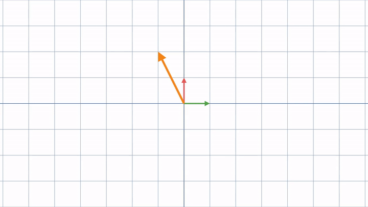
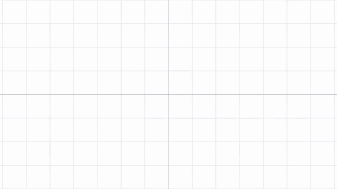
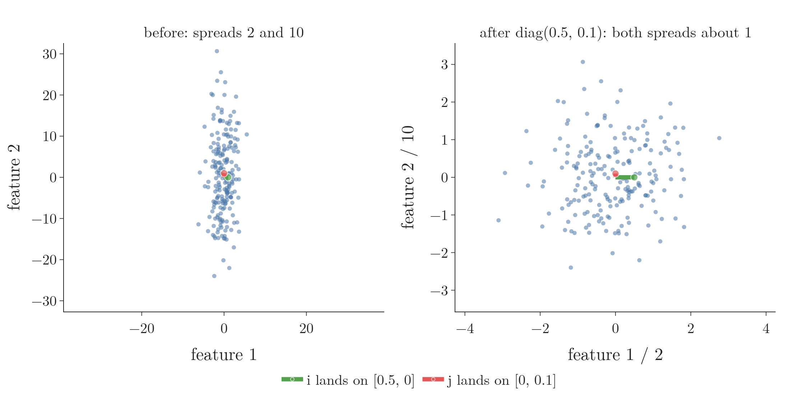

<!-- where-this-fits: generated by course_map/build_map.py; edit concepts.yaml, not this block -->
> **Where this fits:** Pipeline map step 0 (Foundations). See the [Course map](../01-course-map/note.md).
>
> 
>
> - **Builds on:** Linear combinations, span and basis ([Note 490](../490-linear-combinations-span-and-basis/note.md)).
> - **Leads to:** Matrix multiplication as composition ([Note 510](../510-matrix-multiplication-as-composition/note.md)); Eigenvectors and eigenvalues ([Note 530](../530-eigenvectors-and-eigenvalues/note.md)); Determinant ([Note 530](../530-eigenvectors-and-eigenvalues/note.md)); Jacobian and matrix gradients ([Note 602](../602-jacobian-and-matrix-gradients/note.md)); Singular value decomposition ([Note 610](../610-svd-geometry/note.md)); Neural networks ([Note 1002](../1002-what-is-deep-learning/note.md)).
<!-- /where-this-fits -->

## 1. Overview

> **Key point:** A matrix is a record of where the basis vectors land under a linear transformation; multiplying a matrix by a vector computes where that vector lands.



Figure 1 shows the idea of this Note. The whole plane moves: grid lines stay straight, parallel and evenly spaced, and the origin stays put. We only need to know where the two basis vectors $\hat{\imath}$ and $\hat{\jmath}$ land; those four numbers, written as the columns of a matrix, tell us where every other vector goes.

The [PCA step by step Note](../48-pca-step-by-step/note.md) (section 4.1) met this idea in one paragraph: a matrix as an action on the whole plane. This Note explains why it works and how to read any matrix that way. The Note uses the basis vectors, linear combinations and span of the [linear combinations, span and basis Note](../490-linear-combinations-span-and-basis/note.md).

## 2. Transformations: functions that move vectors

> **Key point:** A transformation takes a vector in and gives a vector out; we picture it as every point of space moving to its new place.

A **transformation** (G-2006) is a function whose input is a vector and whose output is another vector. The word "transformation" suggests movement: we imagine each input vector moving to its output vector.

To see a transformation as a whole, we watch every vector move at once. Drawing every vector as an arrow would be far too crowded. So we draw each vector as the point at its tip, and watch all the points of a grid move. A faint copy of the original grid stays in the background, so we can see where things went (the grey grid in Figure 1).

## 3. What makes a transformation linear

> **Key point:** A transformation is linear when all lines stay straight lines and the origin stays fixed; then grid lines stay parallel and evenly spaced.

General transformations can bend space in complicated ways. Linear algebra studies only the simple kind. Visually, a transformation is **linear** when it has two properties:

- **Lines stay lines.** No straight line gets curved.
- **The origin stays fixed.**

Together these mean that grid lines stay parallel and evenly spaced. Some examples that fail:

- A transformation that curves the grid lines is not linear.
- A transformation that keeps lines straight but slides everything to the right moves the origin, so it is not linear.
- A transformation can keep the horizontal and vertical grid lines straight and still bend a diagonal line. Such a transformation is not linear either: the test applies to every line.

Rotations about the origin, stretches along the axes and the slanting of Figure 1 are linear.

Figure 2 runs the test on four warps of the same grid; the black ring marks where the origin started. Watch the orange diagonal and the origin dot: the first three warps each break one rule, and only the last, a shear, keeps both. The test and its pictures follow Sanderson's *Essence of Linear Algebra*, chapter 3 (3Blue1Brown).


**The formal version.** The algebraic definition says the same thing. A transformation $L$ is linear when it respects the two operations of linear algebra, adding vectors and scaling them (MML Def. 2.15):

$$L(\mathbf{v} + \mathbf{w}) = L(\mathbf{v}) + L(\mathbf{w}), \qquad L(c\thinspace\mathbf{v}) = c\thinspace L(\mathbf{v}) \text{ for every scalar } c$$

1. **In words:** adding two vectors and then transforming gives the same as transforming each and then adding; scaling before or after the transformation gives the same.
2. **Why the origin stays fixed:** take $c = 0$. Then $L(\mathbf{0}) = 0 \cdot L(\mathbf{v}) = \mathbf{0}$.
3. **Example:** with the matrix $A$ of Section 5, $\mathbf{v} = [-1, 2]$ and $\mathbf{w} = [1, 0]$: transforming the sum gives $A[0, 2] = [6, 0]$; transforming each gives $[5, 2] + [1, -2] = [6, 0]$. The same.

Section 5 shows that multiplying by a matrix always passes both rules: $A\mathbf{x}$ is $x_1$ times column 1 plus $x_2$ times column 2, and the coordinates of $\mathbf{v} + \mathbf{w}$ are $v_1 + w_1$ and $v_2 + w_2$, so the terms regroup into $A\mathbf{v} + A\mathbf{w}$; a scalar $c$ factors out of every term in the same way.

> **Another way to see it:** Take one output of a transformation, say $-x$ when the input coordinate $x$ goes 2, 3, 4. The output goes $-2, -3, -4$: each step of 1 in the input changes the output by the same amount, $-1$, like the constant slope of a straight line. For $2^x$ the output goes 4, 8, 16: the change grows, like the slope of a curve, so $2^x$ is not linear. This constant-change test checks the "lines stay lines" rule. It does not check the origin: $x + 1$ also changes by a constant amount, yet it moves 0 to 1, so it is not linear in the sense of this Note (it is affine, see Section 7.3). A linear transformation needs both properties.

## 4. Two vectors decide everything

> **Key point:** A vector that starts as $x\thinspace\hat{\imath} + y\thinspace\hat{\jmath}$ lands on $x$ times where $\hat{\imath}$ lands plus $y$ times where $\hat{\jmath}$ lands.

How can we describe a linear transformation with numbers, so that a computer can tell where any vector lands? We only need to record where $\hat{\imath}$ and $\hat{\jmath}$ land.

Take $\mathbf{v} = [-1, 2]$, which is $-1\thinspace\hat{\imath} + 2\thinspace\hat{\jmath}$. Because grid lines stay parallel and evenly spaced, $\mathbf{v}$ lands on the same linear combination of the new $\hat{\imath}$ and the new $\hat{\jmath}$.

1. **In words:** keep the coordinates of the vector, but use them to scale the landed basis vectors instead of the original ones.
2. **Formula:** if $\hat{\imath}$ lands on $\mathbf{i}'$ and $\hat{\jmath}$ lands on $\mathbf{j}'$,
   $$x\thinspace\hat{\imath} + y\thinspace\hat{\jmath} \thickspace\longrightarrow\thickspace x\thinspace\mathbf{i}' + y\thinspace\mathbf{j}'$$
3. **Example:** in Figure 1, $\hat{\imath}$ lands on $[1, -2]$ and $\hat{\jmath}$ on $[3, 0]$. So
   $$[-1, 2] \thickspace\longrightarrow\thickspace-1\thinspace[1, -2] + 2\thinspace[3, 0] = [-1 + 6,\ 2 + 0] = [5, 2]$$

![The landing point of [-1, 2] built from the landed basis vectors: scale green by -1, scale red by 2, add tip to tail](images/landed_combination.gif)

In Figure 3, watch the two scaled arrows meet tip to tail at $[5, 2]$: the grid itself never has to move. We did not have to watch the animation to know that $\mathbf{v}$ lands on $[5, 2]$. For a general vector $[x, y]$ the same reasoning gives

$$x\thinspace[1, -2] + y\thinspace[3, 0] = [x + 3y,\ -2x]$$

a formula for where every vector lands. So a 2D linear transformation is completely described by four numbers: the two coordinates where $\hat{\imath}$ lands and the two where $\hat{\jmath}$ lands.

## 5. The matrix of a transformation

> **Key point:** Write where $\hat{\imath}$ lands as the first column and where $\hat{\jmath}$ lands as the second; that $2 \times 2$ grid of numbers is the matrix of the transformation.

We package the four numbers into a $2 \times 2$ **matrix** (G-1180) whose columns are the landed basis vectors:

$$A = \begin{bmatrix} 1 & 3 \cr-2 & 0 \end{bmatrix} \qquad \text{first column: where } \hat{\imath} \text{ lands; second column: where } \hat{\jmath} \text{ lands}$$

**Matrix-vector multiplication** (G-1181) $A\mathbf{x}$ is the computation that applies the transformation to the vector $\mathbf{x}$: scale each column by the matching coordinate of $\mathbf{x}$ and add.

1. **In words:** multiply the first column by the first coordinate, the second column by the second coordinate, and add the two.
2. **Formula:** for a general matrix,
   $$\begin{bmatrix} a & b \cr c & d \end{bmatrix} \begin{bmatrix} x \cr y \end{bmatrix} = x \begin{bmatrix} a \cr c \end{bmatrix} + y \begin{bmatrix} b \cr d \end{bmatrix} = \begin{bmatrix} ax + by \cr cx + dy \end{bmatrix}$$
3. **Example:**
   $$\begin{bmatrix} 1 & 3 \cr-2 & 0 \end{bmatrix} \begin{bmatrix} -1 \cr2 \end{bmatrix} = -1 \begin{bmatrix} 1 \cr-2 \end{bmatrix} + 2 \begin{bmatrix} 3 \cr0 \end{bmatrix} = \begin{bmatrix} 5 \cr2 \end{bmatrix}$$

The formula on the right, $[ax + by,\ cx + dy]$, is the rule usually memorised in school. The middle form says what it means: the result is a linear combination of the columns, with the vector's coordinates as the scalars. The matrix is written to the left of the vector, like a function written to the left of its input.

> **Python:** In NumPy the `@` operator multiplies a matrix by a vector.
>
> ```python
> import numpy as np
>
> A = np.array([[1, 3], [-2, 0]])
> A @ np.array([-1, 2])     # array([5, 2])
> A[:, 0], A[:, 1]          # where i-hat and j-hat land
> ```
>
> `A[:, 0]` takes all rows of column 0: the first column.

## 6. Reading a matrix as a picture

> **Key point:** Read the columns, move $\hat{\imath}$ and $\hat{\jmath}$ there, and let the rest of the grid follow.

Every matrix can be read as a transformation, and every linear transformation has a matrix. Figure 4 plays four of them in turn. In each, watch the green arrow move to the first column and the red arrow to the second column; the rest of the grid follows, keeping its lines parallel and evenly spaced.

{height=60%}

- **Rotation by 90° counterclockwise.** $\hat{\imath}$ lands on $[0, 1]$ and $\hat{\jmath}$ on $[-1, 0]$, so the matrix has columns $[0, 1]$ and $[-1, 0]$. Any vector rotates by multiplying with it: $[3, 1]$ lands on $[-1, 3]$.
- **Shear.** $\hat{\imath}$ stays at $[1, 0]$ and $\hat{\jmath}$ moves to $[1, 1]$. Horizontal lines slide sideways, more the higher they are: $[2, 3]$ lands on $[5, 3]$.
- **From matrix to picture.** For columns $[1, 2]$ and $[3, 1]$, we move $\hat{\imath}$ to $[1, 2]$ and $\hat{\jmath}$ to $[3, 1]$ and keep the grid lines parallel and evenly spaced. The vector $[1, 1]$ lands on $[1, 2] + [3, 1] = [4, 3]$.
- **Squishing onto a line.** If the two columns are linearly dependent, here $[-1, -0.5] = -0.5 \times [2, 1]$, the whole plane is squished onto the line they span. $[1, 1]$ lands on $[1, 0.5]$ and $[3, -1]$ on $[7, 3.5]$: both on the line through $[2, 1]$.

The last case links back to the [linear combinations, span and basis Note](../490-linear-combinations-span-and-basis/note.md): every output is a linear combination of the columns, so all outputs lie in the span of the columns. Independent columns span the plane; dependent ones only a line.

> **Extra:** The span of the columns is called the **column space** (G-414) of the matrix, one of the topics the [linear algebra roadmap Note](../350-linear-algebra-roadmap/note.md) lists. Its dimension is the rank of the matrix: 2 for the first three matrices of Figure 4, 1 for the squishing one.

## 7. Where ML uses linear transformations

> **Key point:** Feature scaling, PCA and every layer of a neural network apply a matrix to each data point.

Once a matrix is a transformation, many ML steps become pictures of moving space.

### 7.1 One matrix for the whole dataset

> **Key point:** With the data points as the rows of $X$, the product $X A^{\mathsf T}$ applies $A$ to every row at once.

A dataset is a stack of feature vectors, one per **observation** (G-1374) (one record, a row of the table). Each vector holds the values of the **features** (G-772) (the input variables, one column each). The stack is the **data matrix** (G-536) $X$ (the design matrix of the [multiple linear regression maths Note](../54-multiple-lr-maths/note.md), without the column of ones). To transform every point we could loop over the rows and compute $A\mathbf{x}$ for each. NumPy does all of them in one product.

1. **In words:** each row of the result is the transformed version of that row of $X$.
2. **Formula:** for $n$ points with $d$ features ($X$ is $n \times d$),
   $$\text{new data} = X A^{\mathsf T}$$
   The transpose appears because the points are stored as rows, while $A\mathbf{x}$ treats a point as a column.
3. **Example:** with $A$ from Section 5 and the three points $[-1, 2]$, $[1, 0]$ and $[0, 1]$ as rows,
   $$\begin{bmatrix} -1 & 2 \cr1 & 0 \cr0 & 1 \end{bmatrix} \begin{bmatrix} 1 & -2 \cr3 & 0 \end{bmatrix} = \begin{bmatrix} 5 & 2 \cr1 & -2 \cr3 & 0 \end{bmatrix}$$
   The second and third rows are where $\hat{\imath}$ and $\hat{\jmath}$ land, as they should be.

> **Python:**
>
> ```python
> X = np.array([[-1, 2], [1, 0], [0, 1]])
> X @ A.T     # [[5, 2], [1, -2], [3, 0]]
> ```

### 7.2 Feature scaling is a stretch along the axes

> **Key point:** Dividing each feature by a number is a diagonal matrix: it stretches or squishes space along the axes only.

Dividing a feature by its standard deviation, the second half of [standardization](../24-standardization/note.md), is a linear transformation. With standard deviations 2 and 10, $\hat{\imath}$ lands on $[0.5, 0]$ and $\hat{\jmath}$ on $[0, 0.1]$:

$$\begin{bmatrix} 0.5 & 0 \cr0 & 0.1 \end{bmatrix}$$

A matrix with zeros everywhere off the diagonal is a **diagonal matrix** (G-601). Its picture is simple: each axis is stretched or squished by its own factor, and nothing rotates or slants.



In Figure 5, watch the tall, thin cloud turn round: the matrix only shrinks each axis, so $\hat{\imath}$ and $\hat{\jmath}$ stay on their own axes.

### 7.3 Neural network layers and PCA

> **Key point:** A neural network layer multiplies by a weight matrix, adds a shift, then bends the result; PCA multiplies by a matrix of eigenvectors.

- **A neural network layer** computes $W\mathbf{x} + \mathbf{b}$ and then applies an **activation function** (G-165) such as the [sigmoid](../72-sigmoid-function/note.md) or ReLU. A worked example follows the list. $W\mathbf{x}$ is a linear transformation of the input. Adding $\mathbf{b}$ moves the origin, and the activation bends the lines, so the layer as a whole is not linear. The activation is the step that lets a network learn curved boundaries: without it, a stack of layers is still one affine map, which cannot even separate the four points of XOR (Goodfellow et al. §6.1).
- **PCA** projects each point with $Z = XW^{\mathsf T}$ (see the [PCA step by step Note](../48-pca-step-by-step/note.md), section 5.1): a matrix applied to every row, exactly as in Section 7.1.

**A layer, step by step.** Take an iris flower with petal width 0.5 and sepal width 0.4, so $\mathbf{x} = [0.5, 0.4]$, and a first layer with two neurons. Each row of the **weight** (G-2106) matrix $W$ holds one neuron's weights, and $\mathbf{b}$ holds the **biases** (G-284):

1. **Transform:** the result is 0.5 times the first column of $W$ plus 0.4 times the second.
   $$W\mathbf{x} = \begin{bmatrix} -2.5 & 0.6 \cr-1.5 & 0.4 \end{bmatrix} \begin{bmatrix} 0.5 \cr0.4 \end{bmatrix} = 0.5 \begin{bmatrix} -2.5 \cr-1.5 \end{bmatrix} + 0.4 \begin{bmatrix} 0.6 \cr0.4 \end{bmatrix} = \begin{bmatrix} -1.01 \cr-0.59 \end{bmatrix}$$
2. **Shift:** add $\mathbf{b} = [1.6, 0.7]$ to get $[0.59, 0.11]$.
3. **Bend:** the **ReLU** (G-1668) keeps a positive number and turns a negative one into 0, so the output is $[0.59, 0.11]$.

Only step 1 is a linear transformation. The weights here are illustrative numbers, not trained ones; a trained network learns them with backpropagation (see the [forward propagation Note](../1010-forward-propagation/note.md)).

> **Extra:** A transformation followed by a shift, $A\mathbf{x} + \mathbf{b}$, is called an **affine transformation** (G-178). It keeps lines straight and parallel but moves the origin. Mean centring followed by scaling (standardization) is affine, and so is a neural network layer before its activation.

> **Extra:** Matrices need not be square. A matrix with 2 rows and 3 columns has three columns, one for where each of the three 3D basis vectors lands, and each column has 2 numbers: it takes 3D vectors to 2D vectors. PCA from 3 features to 2 components is such a $2 \times 3$ matrix $W$. Its rows are the two eigenvectors; reading it by columns, each column says where one original axis lands in the new 2D picture.

## 8. Summary

| Matrix | Where $\hat{\imath}$ lands | Where $\hat{\jmath}$ lands | Effect |
|---|---|---|---|
| $\begin{bmatrix} 0 & -1 \cr1 & 0 \end{bmatrix}$ | $[0, 1]$ | $[-1, 0]$ | rotation by 90° |
| $\begin{bmatrix} 1 & 1 \cr0 & 1 \end{bmatrix}$ | $[1, 0]$ | $[1, 1]$ | shear |
| $\begin{bmatrix} 0.5 & 0 \cr0 & 0.1 \end{bmatrix}$ | $[0.5, 0]$ | $[0, 0.1]$ | scaling along the axes |
| $\begin{bmatrix} 2 & -1 \cr1 & -0.5 \end{bmatrix}$ | $[2, 1]$ | $[-1, -0.5]$ | squishes the plane onto a line |

- A linear transformation keeps lines straight and the origin fixed; grid lines stay parallel and evenly spaced.
- It is decided by where the basis vectors land; those landing spots are the columns of its matrix.
- $A\mathbf{x}$ is a linear combination of the columns of $A$, with the coordinates of $\mathbf{x}$ as scalars.
- Every matrix is a transformation of space; $XA^{\mathsf T}$ applies it to a whole dataset.

## 9. Sources

**Built from**

- Khan Academy, "Matrix vector products as linear transformations | Linear Algebra | Khan Academy", YouTube, https://www.youtube.com/watch?v=ondmopWLiEg
- Starmer, J. (StatQuest), "Essential Matrix Algebra for Neural Networks, Clearly Explained!!!", YouTube, https://www.youtube.com/watch?v=ZTt9gsGcdDo
- Sanderson, G. (3Blue1Brown), "Linear transformations and matrices | Chapter 3, Essence of linear algebra", 2016, 3blue1brown.com/lessons/linear-transformations, https://www.youtube.com/watch?v=kYB8IZa5AuE

**Other references**

- Deisenroth, M. P., Faisal, A. A. and Ong, C. S. (2020). *Mathematics for Machine Learning*. Cambridge University Press. Definition 2.15 (MML).
- Goodfellow, I., Bengio, Y. and Courville, A. (2016). *Deep Learning*. MIT Press. Section 6.1, learning XOR.

## 10. Key terms

| Term | Meaning |
|---|---|
| Transformation | A function that takes a vector in and gives a vector out |
| Matrix (of a transformation) | The grid of numbers whose columns are where the basis vectors land |
| Matrix-vector multiplication | $A\mathbf{x}$: the linear combination of the columns of $A$ with the coordinates of $\mathbf{x}$ as scalars |
| Rotation matrix | The matrix of a rotation about the origin; by 90°, columns $[0, 1]$ and $[-1, 0]$ |
| Shear | A transformation that keeps $\hat{\imath}$ fixed and slants $\hat{\jmath}$, sliding horizontal lines sideways |
| Column space | The span of the columns of a matrix: every output it can produce |
| Data matrix | The feature vectors of a dataset stacked as rows |
| Diagonal matrix | A matrix with zeros everywhere off the diagonal; it scales each axis by its own factor |
| Linear (transformation) (G-1097) | Keeps lines straight and the origin fixed; algebraically, $L(\mathbf{v} + \mathbf{w}) = L(\mathbf{v}) + L(\mathbf{w})$ and $L(c\mathbf{v}) = cL(\mathbf{v})$ |
| Affine transformation | A linear transformation followed by a shift, $A\mathbf{x} + \mathbf{b}$ |
