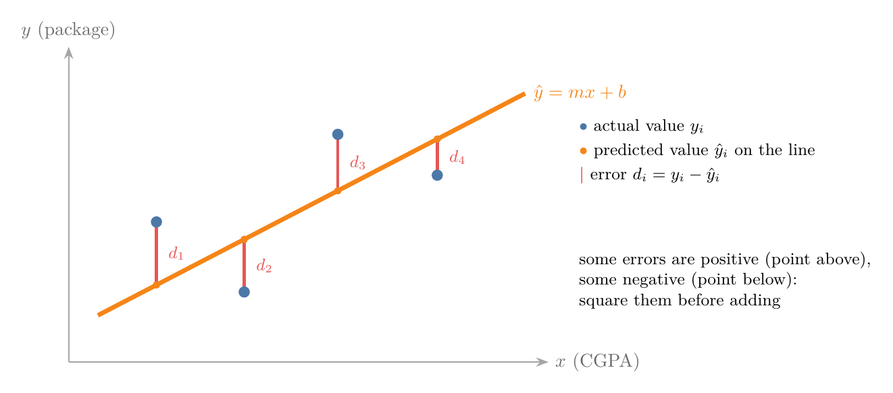
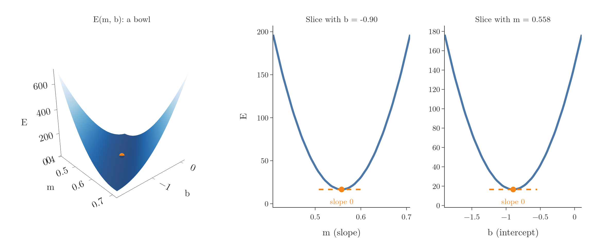

<!-- where-this-fits: generated by course_map/build_map.py; edit concepts.yaml, not this block -->
> **Where this fits:** Pipeline map step 8 (Model). See the [Course map](../01-course-map/note.md).
>
> 
>
> - **Builds on:** Regression problems ([Note 3](../03-types-of-ml/note.md)); Supervised learning ([Note 3](../03-types-of-ml/note.md)); Model-based learning ([Note 6](../06-instance-vs-model-based/note.md)); Multicollinearity ([Note 27](../27-one-hot-encoding/note.md)); Covariance and covariance matrix ([Note 48](../48-pca-step-by-step/note.md)).
> - **Leads to:** Regression metrics ([Note 52](../52-regression-metrics/note.md)); Multiple linear regression ([Note 53](../53-multiple-linear-regression/note.md)); Normal equation ([Note 54](../54-multiple-lr-maths/note.md)); Gradient descent ([Note 57](../57-gradient-descent/note.md)).
> - **Compare with:** Gradient descent ([Note 57](../57-gradient-descent/note.md)).
<!-- /where-this-fits -->

## 1. Overview

> **Key point:** We write down the total error of a line, find the m and b that make it smallest, and get two short formulas. Coded as our own class, they give exactly scikit-learn's answer.

The previous Note trained `LinearRegression` and read off the slope $m = 0.558$ and intercept $b = -0.896$ for the placement data. This Note opens the box: where do these two numbers come from?

The plan has three parts:

1. Write the total error of any line as a formula in $m$ and $b$ (Section 3).
2. Find the $m$ and $b$ that make it smallest, using derivatives (Section 4).
3. Code the result as our own class and compare it with scikit-learn (Section 6).

## 2. Two ways to find m and b

> **Key point:** A closed-form solution gives m and b directly from a formula (OLS). A non-closed-form solution reaches them step by step (gradient descent).

There are two ways to compute the best $m$ and $b$:

- **Closed-form solution:** a formula we can evaluate directly, using only ordinary operations such as adding, multiplying and dividing. The quadratic formula from school is an example: it gives the answer in one go. For linear regression, this method is called **ordinary least squares (OLS)**.
- **Non-closed-form solution:** no direct formula; we start from a guess and improve it step by step until it is good enough. For linear regression, this method is **gradient descent**.

Why have both? With one or a few input columns, OLS is fast and exact. With very many input columns, the OLS formula becomes expensive to compute, and gradient descent works better.

scikit-learn uses both: `LinearRegression` uses OLS, and `SGDRegressor` uses gradient descent. This Note derives OLS; gradient descent gets its own Notes later.

## 3. The error function

> **Key point:** The error of a line is the sum of the squared vertical gaps between each point and the line. It depends only on m and b.

### 3.1 The error at one point

> **Key point:** For each point, the error is the actual value minus the value the line predicts.

The best-fit line should pass as close as possible to all the points. For each point, the vertical gap between the point and the line measures how wrong the line is there (Figure 1).



For point $i$, the actual package is $y_i$ and the line predicts $\hat{y}_i$ (read "y-hat"; a hat marks a prediction). The error is

$$d_i = y_i - \hat{y}_i$$

### 3.2 Adding the errors up

> **Key point:** Squaring makes every error positive and punishes large errors more; it also keeps the function smooth enough to differentiate.

To get the total error we add the errors of all $n$ points. Adding $d_1 + d_2 + \dots + d_n$ directly does not work: points above the line give positive errors, points below give negative ones, and they cancel out.

So we square each error before adding. Squares were chosen over absolute values $|d_i|$ for two reasons:

- **Large errors count more:** an error of 2 counts 4, an error of 10 counts 100. A line that badly misses some points is punished.
- **It can be differentiated:** in Section 4 we find the minimum with derivatives. The absolute value has a sharp corner at 0, where it has no derivative; the square is smooth everywhere.

The total is called the **error function** or **loss function**:

$$E = \sum_{i=1}^{n} (y_i - \hat{y}_i)^2$$

> **Extra:** Dividing $E$ by $n$ gives the average squared error, the mean squared error used as a metric in the next Note. Dividing by a constant does not change which line is best, so here we keep the plain sum.

### 3.3 E depends on m and b

> **Key point:** The data is fixed; only m and b can change. So the error is a function of m and b.

Every prediction comes from the line: $\hat{y}_i = m x_i + b$. Putting this into $E$:

$$E(m, b) = \sum_{i=1}^{n} (y_i - m x_i - b)^2$$

The values $x_i$ (CGPA) and $y_i$ (package) are the data: we cannot change them. Only $m$ and $b$ can change. Turning a line in the plane means changing its slope $m$; sliding it up or down means changing its intercept $b$. Every possible line is one pair $(m, b)$, and each pair has its own total error.

So the task becomes: **find the $m$ and $b$ that make $E(m, b)$ as small as possible.**

## 4. Finding the minimum

> **Key point:** At the lowest point of E, its slope is zero in the m direction and in the b direction. Setting both derivatives to zero gives two equations for m and b.

### 4.1 The shape of E

> **Key point:** E is a bowl. Its lowest point is the best line, and there the bowl is flat in every direction.

Figure 2 draws $E(m, b)$ for the 160 training students: each point of the surface is one line, and its height is that line's total error.



The surface is a bowl with a single lowest point, at $m = 0.558$, $b = -0.896$, where $E = 16.55$. The two slices on the right cut the bowl along $m$ and along $b$: each is a U-shaped curve, and at the bottom the curve is flat. Its slope there is zero.

A **derivative** measures the slope of a function. Since $E$ depends on two variables, it has two slopes, one for each. A **partial derivative** is the slope in one variable while the other is held fixed:

- $\dfrac{\partial E}{\partial b}$: how $E$ changes when $b$ moves and $m$ stays fixed.
- $\dfrac{\partial E}{\partial m}$: how $E$ changes when $m$ moves and $b$ stays fixed.

At the minimum, both are zero.

### 4.2 Step 1: the derivative with respect to b

> **Key point:** Setting the b-derivative to zero gives $b = \bar{y} - m\bar{x}$.

In words: differentiate each squared term with respect to $b$ (the chain rule brings down a factor 2 and a factor $-1$), set the sum to zero, and solve for $b$.

$$\frac{\partial E}{\partial b} = \sum_{i=1}^{n} 2(y_i - m x_i - b)(-1) = 0$$

Divide both sides by $-2$ and split the sum into three parts:

$$\sum y_i - m\sum x_i - n b = 0$$

Divide by $n$. The **mean** $\bar{x} = \frac{1}{n}\sum x_i$ appears, and likewise $\bar{y}$:

$$\bar{y} - m\bar{x} - b = 0 \quad\Longrightarrow\quad b = \bar{y} - m\bar{x}$$

This says the best line always passes through the point $(\bar{x}, \bar{y})$: the average CGPA and the average package. Once we know $m$, $b$ follows.

### 4.3 Step 2: the derivative with respect to m

> **Key point:** Setting the m-derivative to zero and using $b = \bar{y} - m\bar{x}$ gives the formula for m.

In words: differentiate with respect to $m$ (the chain rule now brings down $-x_i$), set it to zero, replace $b$ with the result of Step 1, and solve for $m$.

$$\frac{\partial E}{\partial m} = \sum_{i=1}^{n} 2(y_i - m x_i - b)(-x_i) = 0$$

Replace $b$ by $\bar{y} - m\bar{x}$ and divide by $-2$:

$$\sum_{i=1}^{n} \left[(y_i - \bar{y}) - m(x_i - \bar{x})\right] x_i = 0$$

Rearranging, and using the fact that the deviations from a mean add up to zero (so $x_i$ can be replaced by $x_i - \bar{x}$), gives the formula for $m$:

$$m = \frac{\sum_{i=1}^{n}(x_i - \bar{x})(y_i - \bar{y})}{\sum_{i=1}^{n}(x_i - \bar{x})^2}$$

> **Extra:** The last step in more detail. The equation says $\sum (y_i - \bar{y})x_i = m \sum (x_i - \bar{x})x_i$. Since $\sum (y_i - \bar{y}) = 0$, we may subtract $\bar{x}\sum (y_i - \bar{y})$ from the left side without changing it, which turns $x_i$ into $(x_i - \bar{x})$. The same trick works on the right side, since $\sum (x_i - \bar{x}) = 0$. Dividing by the right-hand sum gives the formula.

### 4.4 The two formulas

> **Key point:** m is the covariance of x and y divided by the variance of x; b makes the line pass through the means.

| | Formula |
|---|---|
| Slope | $m = \dfrac{\sum (x_i - \bar{x})(y_i - \bar{y})}{\sum (x_i - \bar{x})^2}$ |
| Intercept | $b = \bar{y} - m\bar{x}$ |

The top of the $m$ formula is $n$ times the covariance of $x$ and $y$; the bottom is $n$ times the variance of $x$ (both from the PCA Notes). So the slope is how much $x$ and $y$ move together, divided by how much $x$ moves on its own.

> **Extra:** Strictly, a zero slope only shows a flat point, which could be a maximum or a saddle. For $E(m, b)$ it is always a minimum, because $E$ is a sum of squares of straight-line expressions: a bowl that only curves upward. Figure 2 shows this shape.

## 5. The formulas on the placement data

> **Key point:** On the 160 training students, the formulas give m = 0.558 and b = $-0.896$, exactly the values scikit-learn found.

With the training students of the previous Note (same 80/20 split):

1. **Means:** $\bar{x} = 6.9899$ (average CGPA), $\bar{y} = 3.0039$ (average package).
2. **Top of the m formula:** $\sum (x_i - \bar{x})(y_i - \bar{y}) = 101.204$.
3. **Bottom of the m formula:** $\sum (x_i - \bar{x})^2 = 181.384$.

Then

$$m = \frac{101.204}{181.384} = 0.558$$

$$b = 3.0039 - 0.558 \times 6.9899 = -0.896$$

These are the numbers `LinearRegression` reported. Its `fit` does nothing more than these few sums.

## 6. Our own linear regression class

> **Key point:** A class with fit (the two formulas) and predict (the line equation) reproduces scikit-learn's LinearRegression for one input column.

> **Python:** Simple linear regression from scratch.
>
> ```python
> class MyLR:
>     def fit(self, X, y):
>         # closed-form OLS formulas from Section 4.4
>         x_bar, y_bar = X.mean(), y.mean()
>         self.m = (((X - x_bar) * (y - y_bar)).sum()
>                   / ((X - x_bar) ** 2).sum())
>         self.b = y_bar - self.m * x_bar
>         return self
>
>     def predict(self, X):
>         return self.m * X + self.b      # the line
>
> mine = MyLR().fit(X_train, y_train)
> mine.m, mine.b                  # 0.558, -0.896
> mine.predict(X_test[:3])        # [3.8911, 3.0932, 2.3846]
> ```
>
> `X_train` here is a plain 1-D NumPy array of CGPAs. NumPy works on whole arrays at once, so the sums need no loop.

The predictions match scikit-learn's to every digit shown. The Notebook also checks the two conditions of Section 4 at the fitted line: the errors add up to 0, and so do the errors times $x$. Moving $m$ by just 0.01 raises $E$ from 16.55 to 17.35.

> **Extra:** This class only handles one input column. The same idea works for many columns, written with matrices instead of single sums: that is multiple linear regression, coming soon. Calling `fit` again on a changed class also needs a fresh object: an old object keeps its old `m` and `b`.

## 7. Summary

| Step | Result |
|---|---|
| Error at a point | $d_i = y_i - \hat{y}_i$ |
| Error function | $E(m, b) = \sum (y_i - m x_i - b)^2$ |
| Minimum | $\partial E / \partial m = 0$ and $\partial E / \partial b = 0$ |
| Intercept | $b = \bar{y} - m\bar{x}$ |
| Slope | $m = \sum (x_i - \bar{x})(y_i - \bar{y}) \,/\, \sum (x_i - \bar{x})^2$ |
| Placement data | $m = 0.558$, $b = -0.896$, $E = 16.55$ |

- Closed form (OLS) gives $m$ and $b$ directly; gradient descent reaches them step by step.
- Errors are squared so they do not cancel, large errors count more, and the function can be differentiated.
- The error function is a bowl in $(m, b)$; the best line is its bottom, where both partial derivatives are zero.
- The best line always passes through $(\bar{x}, \bar{y})$.
- scikit-learn's `LinearRegression` uses exactly these formulas (in matrix form).

## 8. Key terms

| Term | Meaning |
|---|---|
| Closed-form solution | An answer given directly by a formula of ordinary operations |
| Non-closed-form solution | An answer reached by improving a guess step by step |
| Ordinary least squares (OLS) | The closed-form method for linear regression: the line with the smallest sum of squared errors |
| Gradient descent | A step-by-step method that walks downhill on the error function |
| Prediction ($\hat{y}$) | The value the model gives for an input; the hat marks a prediction |
| Error function (loss function) | A formula for how wrong the model is; here the sum of squared errors |
| Derivative | The slope of a function at a point |
| Partial derivative | The slope of a function of several variables in one variable, holding the others fixed |
| SGDRegressor | scikit-learn's linear regression trained by gradient descent |
