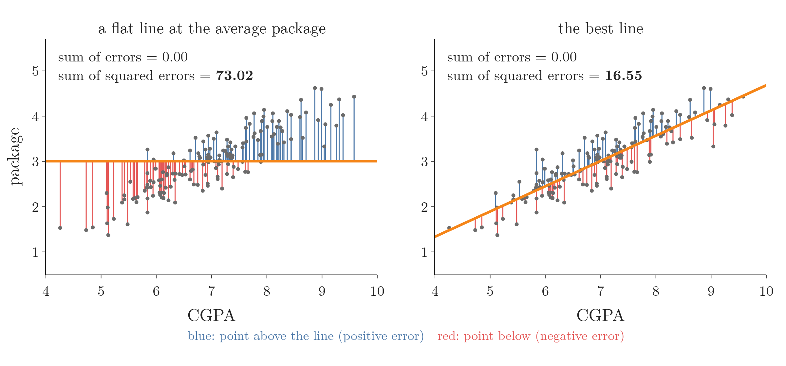

<!-- where-this-fits: generated by course_map/build_map.py; edit concepts.yaml, not this block -->
> **Where this fits:** Pipeline map steps 0 (Foundations), 8 (Model). See the [Course map](../01-course-map/note.md).
>
> 
>
> - **Builds on:** Regression problems ([Note 3](../03-types-of-ml/note.md)); Supervised learning ([Note 3](../03-types-of-ml/note.md)); Model-based learning ([Note 6](../06-instance-vs-model-based/note.md)); Multicollinearity ([Note 27](../27-one-hot-encoding/note.md)); Covariance and covariance matrix ([Note 48](../48-pca-step-by-step/note.md)).
> - **Leads to:** Regression metrics ([Note 52](../52-regression-metrics/note.md)); Multiple linear regression ([Note 53](../53-multiple-linear-regression/note.md)); Normal equation ([Note 54](../54-multiple-lr-maths/note.md)); Gradient descent ([Note 57](../57-gradient-descent/note.md)); Partial derivatives and gradients ([Note 57](../57-gradient-descent/note.md)); Taylor series ([Note 126](../126-xgboost-maths/note.md)).
> - **Compare with:** Gradient descent ([Note 57](../57-gradient-descent/note.md)); Regression trees ([Note 99](../99-regression-trees/note.md)).
<!-- /where-this-fits -->

## 1. Overview

> **Key point:** We write down the total error of a line, find the m and b that make it smallest, and get two short formulas. Coded as our own class, they give exactly scikit-learn's answer.

The previous Note trained `LinearRegression` and read off the slope $m = 0.558$ and intercept $b = -0.896$ for the placement data. This Note opens the box: where do these two numbers come from? As before, the **feature** (G-772; an input variable, one column of the data table) is CGPA, the **target** (G-1949; the output we predict) is the package, and each **observation** (G-1374; one record, one row) is one student. The line itself is the **best-fit line** (G-280) of **linear regression** (G-1094).

The plan has three parts:

1. Write the total error of any line as a formula in $m$ and $b$ (Section 3).
2. Find the $m$ and $b$ that make it smallest, using derivatives (Section 4).
3. Code the result as our own class and compare it with scikit-learn (Section 6).

## 2. Two ways to find m and b

> **Key point:** A closed-form solution gives m and b directly from a formula (OLS). A non-closed-form solution reaches them step by step (gradient descent).

There are two ways to compute the best $m$ and $b$: jump straight to the answer, or walk towards it.

- **Closed-form solution** (G-398): a formula we can evaluate directly, using only ordinary operations such as adding, multiplying and dividing. The quadratic formula from school is an example: it gives the answer in one go. For linear regression, this method is called **ordinary least squares (OLS)** (G-1406).
- **Non-closed-form solution** (G-1332): no direct formula; we start from a guess and improve it step by step until it is good enough. For linear regression, this method is **gradient descent** (G-862).

Figure 1 runs both on the placement data. Each point of the map on the right is one line $(m, b)$, coloured by its total error (Section 3); the black cross is the best line. OLS lands on the cross in one jump. Gradient descent starts at $m = 0$, $b = 0$ and takes small steps downhill: it first swings $m$ past the answer, then crawls along the long, narrow valley, and needs 6,112 steps to get within 0.001 of the OLS slope and 0.01 of the OLS intercept.


Why have both? With one or a few features, OLS is fast and exact. With very many features, the OLS formula becomes expensive to compute, and gradient descent works better.

scikit-learn uses both: `LinearRegression` uses OLS, and `SGDRegressor` uses gradient descent. This Note derives OLS; gradient descent gets its own Notes later.

## 3. The error function

> **Key point:** The error of a line is the sum of the squared vertical gaps between each point and the line. The error depends only on m and b.

### 3.1 The error at one point

> **Key point:** For each point, the error is the actual value minus the value the line predicts.

The best-fit line should pass as close as possible to all the points. For each point, the vertical gap between the point and the line measures how wrong the line is there (Figure 2).


For point $i$, the actual package is $y_i$ and the line predicts $\hat y_i$, the **prediction** (G-1550; read "y-hat", a hat marks a prediction). The error at the point is

$$d_i = y_i - \hat y_i$$

This signed vertical gap is the **residual** (G-705) of observation $i$: positive when the point lies above the line, negative when it lies below.

### 3.2 Adding the errors up

> **Key point:** Squaring makes every error positive and punishes large errors more; it also keeps the function smooth enough to differentiate.

To get the total error we add the errors of all $n$ points. Adding $d_1 + d_2 + \dots + d_n$ directly does not work: points above the line give positive errors, points below give negative ones, and they cancel out.

Figure 3 shows the cancelling on our data. A flat line at the average package is clearly a poor fit, yet its residuals add up to exactly 0, the same as the best line's. The raw sum cannot tell the two lines apart; the sum of the squares can (73.02 against 16.55).



So we square each error before adding. Squares were chosen over absolute values $|d_i|$ for two reasons:

- **Large errors count more:** an error of 2 counts 4, an error of 10 counts 100. A line that badly misses some points is punished.
- **The square can be differentiated:** in Section 4 we find the minimum with derivatives. The absolute value has a sharp corner at 0, where it has no derivative; the square is smooth everywhere.

Figure 4 puts the two choices side by side: the orange square grows faster for large residuals, and it has no corner at 0.


The total is called the **error function** or **loss function** (G-706); for squared errors it is the **sum of squared errors** (G-1684):

$$E = \sum_{i=1}^{n} (y_i - \hat y_i)^2$$

> **Extra:** Dividing $E$ by $n$ gives the average squared error, the **mean squared error** (G-1201) used as a metric in the next Note. Dividing by a constant does not change which line is best, so here we keep the plain sum.

### 3.3 E depends on m and b

> **Key point:** The data is fixed; only m and b can change. So the error is a function of m and b.

Every prediction comes from the line: $\hat y_i = m x_i + b$. Putting this into $E$:

$$E(m, b) = \sum_{i=1}^{n} (y_i - m x_i - b)^2$$

The values $x_i$ (CGPA) and $y_i$ (package) are the data: we cannot change them. Only $m$ and $b$ can change. Turning a line in the plane means changing its slope $m$; sliding it up or down means changing its intercept $b$. Every possible line is one pair $(m, b)$, and each pair has its own total error.

So the task becomes: **find the $m$ and $b$ that make $E(m, b)$ as small as possible.**

Figure 5 links the two views. On the left, each error is drawn as a square with side $|d_i|$; both axes use the same unit, so $E$ is the total orange area. On the right, the same line is a single dot on a map of $E(m, b)$, where darker means smaller. First the line turns with $b$ fixed, then it slides with $m$ fixed. Watch the squares shrink and grow: each time the area is smallest when the dot crosses the black cross, the line with $m = 0.558$ and $b = -0.896$.


## 4. Finding the minimum

> **Key point:** At the lowest point of E, its slope is zero in the m direction and in the b direction. Setting both derivatives to zero gives two equations for m and b.

### 4.1 The shape of E

> **Key point:** E is a bowl. Its lowest point is the best line, and there the bowl is flat in every direction.

Figure 6 draws $E(m, b)$ for the 160 training students: each point of the surface is one line, and its height is that line's total error.


The surface is a bowl with a single lowest point, at $m = 0.558$, $b = -0.896$, where $E = 16.55$. The two slices on the right cut the bowl along $m$ and along $b$: each is a U-shaped curve, and at the bottom the curve is flat; its slope there is zero. A marble dropped into a salad bowl comes to rest at the one place where the floor of the bowl is level in every direction.

A **derivative** (G-595) measures the slope of a function: the slope of its **tangent line** (G-1945), the straight line that touches the curve at one point. Since $E$ depends on two variables, it has two slopes, one for each. A **partial derivative** (G-1457) is the slope in one variable while the other is held fixed:

- $\dfrac{\partial E}{\partial b}$: how $E$ changes when $b$ moves and $m$ stays fixed.
- $\dfrac{\partial E}{\partial m}$: how $E$ changes when $m$ moves and $b$ stays fixed.

Figure 7 slides a tangent line along each slice of Figure 6. With $m = 0.558$ fixed, at $b = -1.9$ the tangent slopes down, $\partial E/\partial b = -321$: raising $b$ lowers the error. At $b = 0.1$ it slopes up, $\partial E/\partial b = 319$. Only at $b = -0.896$ is the tangent flat. The $m$ slice behaves the same way ($-1{,}727$ at $m = 0.45$, $1{,}473$ at $m = 0.65$). At the minimum, both partial derivatives are zero.


### 4.2 Step 1: the derivative with respect to b

> **Key point:** Setting the b-derivative to zero gives $b = \bar{y} - m\bar{x}$.

In words: differentiate each squared term with respect to $b$ (the **chain rule** (G-371) brings down a factor 2 and a factor $-1$), set the sum to zero, and solve for $b$.

$$\frac{\partial E}{\partial b} = \sum_{i=1}^{n} 2(y_i - m x_i - b)(-1) = 0$$

Divide both sides by $-2$ and split the sum into three parts:

$$\sum y_i - m\sum x_i - n b = 0$$

Divide by $n$. The **mean** (G-1203) $\bar{x} = \frac{1}{n}\sum x_i$ appears, and likewise $\bar{y}$:

$$\bar{y} - m\bar{x} - b = 0 \quad\Longrightarrow\quad b = \bar{y} - m\bar{x}$$

The formula for $b$ says the best line always passes through the point $(\bar{x}, \bar{y})$: the average CGPA and the average package. Once we know $m$, $b$ follows.

### 4.3 Step 2: the derivative with respect to m

> **Key point:** Setting the m-derivative to zero and using $b = \bar{y} - m\bar{x}$ gives the formula for m.

In words: differentiate with respect to $m$ (the chain rule now brings down $-x_i$), set it to zero, replace $b$ with the result of Step 1, and solve for $m$.

$$\frac{\partial E}{\partial m} = \sum_{i=1}^{n} 2(y_i - m x_i - b)(-x_i) = 0$$

Replace $b$ by $\bar{y} - m\bar{x}$ and divide by $-2$:

$$\sum_{i=1}^{n} \left[(y_i - \bar{y}) - m(x_i - \bar{x})\right] x_i = 0$$

Rearranging, and using the fact that the deviations from a mean add up to zero (so $x_i$ can be replaced by $x_i - \bar{x}$), gives the formula for $m$:

$$m = \frac{\sum_{i=1}^{n}(x_i - \bar{x})(y_i - \bar{y})}{\sum_{i=1}^{n}(x_i - \bar{x})^2}$$

> **Extra:** The last step in more detail. The equation says $\sum (y_i - \bar{y})x_i = m \sum (x_i - \bar{x})x_i$. Since $\sum (y_i - \bar{y}) = 0$, we may subtract $\bar{x}\sum (y_i - \bar{y})$ from the left side without changing it, which turns $x_i$ into $(x_i - \bar{x})$. The same trick works on the right side, since $\sum (x_i - \bar{x}) = 0$. Dividing by the right-hand sum gives the formula.

### 4.4 The two formulas

> **Key point:** m is the covariance of x and y divided by the variance of x; b makes the line pass through the means.

| | Formula |
|---|---|
| Slope | $m = \dfrac{\sum (x_i - \bar{x})(y_i - \bar{y})}{\sum (x_i - \bar{x})^2}$ |
| Intercept | $b = \bar{y} - m\bar{x}$ |

The top of the $m$ formula is $n$ times the **covariance** (G-496) of $x$ and $y$; the bottom is $n$ times the **variance** (G-2074) of $x$ (both from the PCA Notes). So the slope is how much $x$ and $y$ move together, divided by how much $x$ moves on its own.

Figure 8 shows what the top of the formula adds up. Move the axes to the point of means. A student with both CGPA and package above average (top right) gives a positive product $(x_i - \bar{x})(y_i - \bar{y})$; so does a student below average on both (bottom left). A student above on one and below on the other gives a negative product. In the placement data 125 of the 160 products are positive and add up to $103.06$; the 35 negative ones add up to only $-1.86$. So the sum is $101.204$, a clearly upward slope.


> **Extra:** Strictly, a zero slope only shows a flat point, which could be a maximum or a saddle. For $E(m, b)$ the flat point is always a minimum: $E$ is a sum of squares of straight-line expressions, a bowl that only curves upward (Figure 6). The check uses the second derivatives:
>
> $$\frac{\partial^2 E}{\partial b^2} = 2n, \qquad \frac{\partial^2 E}{\partial m^2} = 2\sum x_i^2, \qquad \frac{\partial^2 E}{\partial m\thinspace\partial b} = 2\sum x_i$$
>
> The first is positive, and $\frac{\partial^2 E}{\partial b^2}\cdot\frac{\partial^2 E}{\partial m^2} - \left(\frac{\partial^2 E}{\partial m\thinspace\partial b}\right)^2 = 4\left(n\sum x_i^2 - (\sum x_i)^2\right) = 4n\sum (x_i - \bar{x})^2$, which is positive whenever the $x_i$ are not all equal. By the second-derivative test for two variables, a flat point with both of these positive is a minimum.

## 5. The formulas on the placement data

> **Key point:** On the 160 training students, the formulas give m = 0.558 and b = $-0.896$, exactly the values scikit-learn found.

With the training students of the previous Note (same 80/20 split):

1. **Means:** $\bar{x} = 6.9899$ (average CGPA), $\bar{y} = 3.0039$ (average package).
2. **Top of the m formula:** $\sum (x_i - \bar{x})(y_i - \bar{y}) = 101.204$.
3. **Bottom of the m formula:** $\sum (x_i - \bar{x})^2 = 181.384$.

Then

$$m = \frac{101.204}{181.384} = 0.558$$

$$b = 3.0039 - 0.558 \times 6.9899 = -0.896$$

Figure 9 draws this line on the training students. As Step 1 promised, the line passes exactly through the point of means $(\bar{x}, \bar{y})$.


These are the numbers `LinearRegression` reported. scikit-learn reaches them by a different route: instead of these sums, `LinearRegression` solves the same least-squares problem with a matrix method, `scipy.linalg.lstsq` (scikit-learn docs, LinearRegression). The same problem has the same answer, so both give the same $m$ and $b$.

### 5.1 Another way to see the slope: correlation

> **Key point:** The slope is the correlation times the ratio of the two spreads: $m = r \times s_y / s_x$.

The $m$ formula can be rewritten with the **Pearson correlation coefficient** $r$ (G-1474) of the [understanding your data Note](../19-understanding-your-data/note.md). Write $s_x$ and $s_y$ for the standard deviations of CGPA and package. Correlation is covariance divided by both standard deviations, so covariance $= r \times s_x \times s_y$, and

$$m = \frac{\text{covariance}}{\text{variance of } x} = \frac{r \times s_x \times s_y}{s_x^2} = r \times \frac{s_y}{s_x}$$

On the training students $r = 0.879$, $s_x = 1.068$ and $s_y = 0.678$:

$$m = 0.879 \times \frac{0.678}{1.068} = 0.558$$

Figure 10 reads this as a recipe for drawing the line:

1. Start at the point of means $(\bar{x}, \bar{y})$; the line always passes through it (Section 4.2).
2. Step right by one standard deviation of CGPA, $s_x = 1.07$.
3. Step up by $r \times s_y = 0.879 \times 0.678 = 0.60$.

{height=36%}

The dashed lines in Figure 10 are the two extremes. With a perfect correlation, $r = 1$, the line would rise a full $s_y$ for each $s_x$. With no correlation, $r = 0$, the line would be flat at the average package: CGPA would tell us nothing, and the best prediction would be the average for everyone. Our $r = 0.879$ takes the line 88 percent of the way from flat to the $r = 1$ line.

## 6. Our own linear regression class

> **Key point:** A class with fit (the two formulas) and predict (the line equation) reproduces scikit-learn's LinearRegression for one feature.

> **Python:** Simple linear regression from scratch.
>
> ```python
> class MyLR:
>     def fit(self, X, y):
>         # closed-form OLS formulas from Section 4.4
>         x_bar, y_bar = X.mean(), y.mean()
>         self.m = (((X - x_bar) * (y - y_bar)).sum()
>                   / ((X - x_bar) ** 2).sum())
>         self.b = y_bar - self.m * x_bar
>         return self
>
>     def predict(self, X):
>         return self.m * X + self.b      # the line
>
> mine = MyLR().fit(X_train, y_train)
> mine.m, mine.b                  # 0.558, -0.896
> mine.predict(X_test[:3])        # [3.8911, 3.0932, 2.3846]
> ```
>
> `X_train` here is a plain 1-D NumPy array of CGPAs. NumPy works on whole arrays at once, so the sums need no loop.

The predictions match scikit-learn's to every digit shown. Figure 11 draws the class's output on the 40 test students: our line lies exactly on scikit-learn's.


 The Notebook also checks the two conditions of Section 4 at the fitted line: the errors add up to 0, and so do the errors times $x$. Moving $m$ by just 0.01 raises $E$ from 16.55 to 17.35.

> **Extra:** This class only handles one feature. The same idea works for many features, written with matrices instead of single sums: multiple linear regression, coming soon. If we edit the class and run its definition again, we must also create a new object: an object made before the edit keeps running the old code (Python reference §8.8).

## 7. Summary

| Step | Result |
|---|---|
| Error at a point | $d_i = y_i - \hat y_i$ |
| Error function | $E(m, b) = \sum (y_i - m x_i - b)^2$ |
| Minimum | $\partial E / \partial m = 0$ and $\partial E / \partial b = 0$ |
| Intercept | $b = \bar{y} - m\bar{x}$ |
| Slope | $m = \sum (x_i - \bar{x})(y_i - \bar{y}) \thinspace/\thinspace\sum (x_i - \bar{x})^2$ |
| Placement data | $m = 0.558$, $b = -0.896$, $E = 16.55$ |

- Closed form (OLS) gives $m$ and $b$ directly; gradient descent reaches them step by step.
- Errors are squared so they do not cancel, large errors count more, and the function can be differentiated.
- The error function is a bowl in $(m, b)$; the best line is its bottom, where both partial derivatives are zero.
- The best line always passes through $(\bar{x}, \bar{y})$.
- The slope is also $r \times s_y / s_x$: correlation times the ratio of the spreads.
- scikit-learn's `LinearRegression` solves the same least-squares problem (with `scipy.linalg.lstsq`) and gets the same $m$ and $b$.

## 8. Sources

**Built from**

- CampusX, "Simple Linear Regression | Mathematical Formulation | Coding from Scratch", YouTube, https://www.youtube.com/watch?v=dXHIDLPKdmA
- Starmer, J. (StatQuest), "The Main Ideas of Fitting a Line to Data (The Main Ideas of Least Squares and Linear Regression)", YouTube, https://www.youtube.com/watch?v=PaFPbb66DxQ. The intuition of turning a line and watching the squared errors change, behind Figure 5; we redraw it with our own data.
- Khan Academy, "Calculating the equation of a regression line", YouTube, https://www.youtube.com/watch?v=FGesqq22TCM (the slope as r × s_y / s_x, section 5.1)

**Other references**

- scikit-learn API reference, `sklearn.linear_model.LinearRegression`, Notes section. scikit-learn.org.
- *The Python Language Reference*, §8.8 Class definitions. docs.python.org.

## 9. Key terms

| Term | Meaning |
|---|---|
| Feature | An input variable: one column of the data table |
| Target | The output we predict |
| Observation | One record: one row of the data table |
| Closed-form solution | An answer given directly by a formula of ordinary operations |
| Non-closed-form solution | An answer reached by improving a guess step by step |
| Ordinary least squares (OLS) (G-1406) | The closed-form method for linear regression: the line with the smallest sum of squared errors |
| Gradient descent | A step-by-step method that walks downhill on the error function |
| Prediction ($\hat{y}$) | The value the model gives for an input; the hat marks a prediction |
| Residual (G-705) | The signed vertical gap $y_i - \hat y_i$ between an observation and the line |
| Error function (loss function) (G-706) | A formula for how wrong the model is; here the sum of squared errors |
| Derivative | The slope of a function at a point |
| Tangent line | The straight line that touches a curve at one point; its slope is the derivative there |
| Partial derivative | The slope of a function of several variables in one variable, holding the others fixed |
| SGDRegressor | scikit-learn's linear regression trained by gradient descent |
