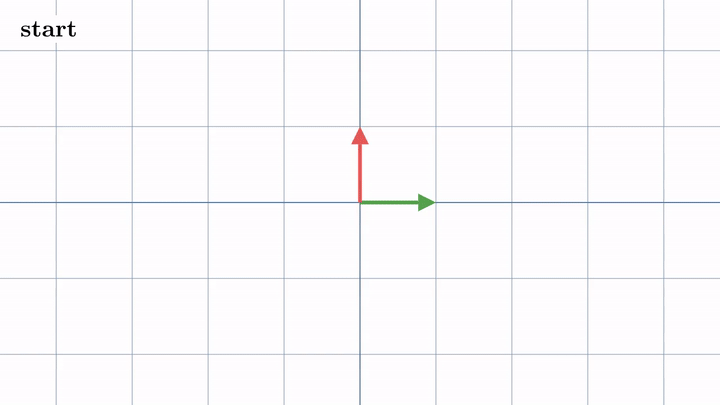
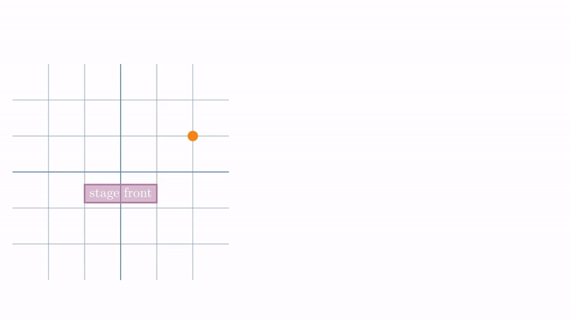
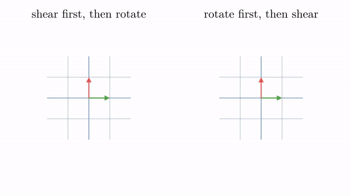

<!-- where-this-fits: generated by course_map/build_map.py; edit concepts.yaml, not this block -->
> **Where this fits:** Pipeline map step 0 (Foundations). See the [Course map](../01-course-map/note.md).
>
> 
>
> - **Builds on:** Dot product ([Note 362](../362-dot-product-and-cosine-similarity/note.md)); Linear transformations and matrices ([Note 500](../500-linear-transformations-and-matrices/note.md)).
> - **Leads to:** Jacobian and matrix gradients ([Note 602](../602-jacobian-and-matrix-gradients/note.md)); Neural networks ([Note 1002](../1002-what-is-deep-learning/note.md)); Forward propagation ([Note 1010](../1010-forward-propagation/note.md)).
<!-- /where-this-fits -->

## 1. Overview

> **Key point:** Multiplying two matrices gives the matrix of "apply one transformation, then the other"; we read the product from right to left.



Figure 1 applies two transformations one after the other: a rotation by 90°, then a shear. From start to finish, the plane has undergone a third linear transformation, with a matrix of its own. That matrix is the product of the shear matrix and the rotation matrix.

This Note builds on the [linear transformations and matrices Note](../500-linear-transformations-and-matrices/note.md): the columns of a matrix are where $\hat{\imath}$ and $\hat{\jmath}$ land, and $A\mathbf{x}$ is the linear combination of those columns.

## 2. Composition: one transformation after another

> **Key point:** Applying one linear transformation and then another is again a linear transformation, called their composition; following $\hat{\imath}$ and $\hat{\jmath}$ gives its matrix.

### 2.1 Turning a stage twice

> **Key point:** Two turns of a stage, one after the other, are the same as one combined turn; the matrix of that combined turn is the product of the two turn matrices.

Picture a concert stage with $x$ and $y$ axes centred on it. A seat sits at $(2, 1)$. Now the stage turns, and every seat turns with it (Figure 2):

1. **First turn, 180°.** The seat moves to $(-2, -1)$.
2. **Second turn, 90° clockwise.** The seat moves to $(-1, 2)$.

Each turn is a linear transformation (see the [linear transformations and matrices Note](../500-linear-transformations-and-matrices/note.md)), so each has a matrix whose columns are where $\hat{\imath}$ and $\hat{\jmath}$ land. The 180° turn sends $\hat{\imath}$ to $[-1, 0]$ and $\hat{\jmath}$ to $[0, -1]$; the 90° clockwise turn sends $\hat{\imath}$ to $[0, -1]$ and $\hat{\jmath}$ to $[1, 0]$:

$$T_1 = \begin{bmatrix} -1 & 0 \cr0 & -1 \end{bmatrix}, \qquad T_2 = \begin{bmatrix} 0 & 1 \cr-1 & 0 \end{bmatrix}$$

Done the long way, the seat needs two multiplications: $T_1[2, 1] = [-2, -1]$, then $T_2[-2, -1] = [-1, 2]$. Done the short way, we first combine the two turns into one matrix, the product $T_2T_1$:

$$T_2T_1 = \begin{bmatrix} 0 & 1 \cr-1 & 0 \end{bmatrix} \begin{bmatrix} -1 & 0 \cr0 & -1 \end{bmatrix} = \begin{bmatrix} 0 & -1 \cr1 & 0 \end{bmatrix}, \qquad T_2T_1 \begin{bmatrix} 2 \cr1 \end{bmatrix} = \begin{bmatrix} -1 \cr2 \end{bmatrix}$$

{height=50%}

In Figure 2, compare the last frame with the third: the combined turn lands the seat on the same spot, $(-1, 2)$, in one step. However many times the stage turns, multiplying the turn matrices gives one combined turn. That is the reason matrix multiplication is defined the way it is: the product is built so that it combines a sequence of transformations into one. Sections 2.2 to 4 show how to compute it.

### 2.2 Following the basis vectors

> **Key point:** To find the matrix of a composition, follow $\hat{\imath}$ and $\hat{\jmath}$ through both steps; where they finally land are its columns.

We often want to apply one transformation and then another. The overall effect is again a linear transformation (grid lines are still parallel and evenly spaced, and the origin has not moved). The overall effect is called the **composition** (G-431) of the two transformations.

Like any linear transformation, the composition has a matrix, found by following $\hat{\imath}$ and $\hat{\jmath}$ to their final places. In Figure 1, a rotation is followed by a shear:

- **Rotation by 90°** has the matrix $R$ with columns $[0, 1]$ and $[-1, 0]$: it sends $\hat{\imath}$ to $[0, 1]$ and $\hat{\jmath}$ to $[-1, 0]$.
- **The shear** has the matrix $S$ with columns $[1, 0]$ and $[1, 1]$: it keeps $[1, 0]$ fixed and sends $[0, 1]$ to $[1, 1]$.
- **After both**, $\hat{\imath}$ has ended at $[1, 1]$ and $\hat{\jmath}$ at $[-1, 0]$.

So the composition has the matrix with those two columns:

$$\begin{bmatrix} 1 & 1 \cr0 & 1 \end{bmatrix} \begin{bmatrix} 0 & -1 \cr1 & 0 \end{bmatrix} = \begin{bmatrix} 1 & -1 \cr1 & 0 \end{bmatrix}$$

This one matrix does in a single step what the rotation and the shear do in two.

## 3. Why the product is written right to left

> **Key point:** In $S R \mathbf{x}$, the matrix next to the vector acts first: $R$ is applied first, then $S$.

Applying the rotation and then the shear to a vector $\mathbf{x}$ the long way means two multiplications: first $R\mathbf{x}$, then $S$ times that result, $S(R\mathbf{x})$. The composition matrix must give the same answer for every $\mathbf{x}$, since it describes the same overall movement. So it is natural to call it the **product** (G-1179) $SR$:

$$S(R\mathbf{x}) = (SR)\thinspace\mathbf{x}$$

Note the order. The transformation on the right ($R$) happens first and the one on the left ($S$) second.

![The product is written left to right but acts right to left; the vector [1, 1] goes through R, then S, and SR takes it to the same point in one step](images/right_to_left.png){height=40%}

In Figure 3, follow $[1, 1]$: $R$ turns it into $[-1, 1]$, $S$ then gives $[0, 1]$, and $SR$ gives $[0, 1]$ in one step. The right-to-left order comes from function notation: in $f(g(x))$, $g$ acts first. A matrix product is read from right to left.

## 4. Computing a product column by column

> **Key point:** The first column of $M_2 M_1$ is $M_2$ times the first column of $M_1$; the second column is $M_2$ times the second column of $M_1$.

We can find the product without watching any animation, from the numbers alone. Take

$$M_1 = \begin{bmatrix} 1 & -2 \cr1 & 0 \end{bmatrix}, \qquad M_2 = \begin{bmatrix} 0 & 2 \cr1 & 0 \end{bmatrix}$$

and apply $M_1$ first, then $M_2$.

1. **In words:** after $M_1$, $\hat{\imath}$ sits at the first column of $M_1$. Applying $M_2$ to that column gives where $\hat{\imath}$ finally lands: the first column of the product. Do the same with the second column for $\hat{\jmath}$.
2. **Formula:**
   $$M_2 M_1 = \Big[\thickspace M_2 \cdot (\text{column 1 of } M_1) \thickspace\Big|\thickspace M_2 \cdot (\text{column 2 of } M_1) \thickspace\Big]$$
3. **Example:**
   - $\hat{\imath}$ first lands on $[1, 1]$. Then $M_2 [1, 1] = 1 \cdot [0, 1] + 1 \cdot [2, 0] = [2, 1]$.
   - $\hat{\jmath}$ first lands on $[-2, 0]$. Then $M_2 [-2, 0] = -2 \cdot [0, 1] + 0 \cdot [2, 0] = [0, -2]$.
   $$M_2 M_1 = \begin{bmatrix} 0 & 2 \cr1 & 0 \end{bmatrix} \begin{bmatrix} 1 & -2 \cr1 & 0 \end{bmatrix} = \begin{bmatrix} 2 & 0 \cr1 & -2 \end{bmatrix}$$

Figure 4 runs this example on the grid. Watch $\hat{\imath}$ (green) and $\hat{\jmath}$ (red): after $M_1$ they sit on the columns of $M_1$, and after $M_2$ each one's final position fills one column of the product. Following the basis vectors like this is the approach of Sanderson's *Essence of Linear Algebra*, chapter 4 (3Blue1Brown).

![The product $M_2 M_1$ built column by column: $M_1$ moves the basis vectors to its columns, $M_2$ then moves them to $[2, 1]$ and $[0, -2]$, the columns of the product](images/column_by_column.gif)

The same reasoning with letters gives the general rule. Take

$$M_1 = \begin{bmatrix} e & f \cr g & h \end{bmatrix}, \qquad M_2 = \begin{bmatrix} a & b \cr c & d \end{bmatrix}$$

The first column of the product is $e\thinspace[a, c] + g\thinspace[b, d]$ and the second is $f\thinspace[a, c] + h\thinspace[b, d]$:

$$\begin{bmatrix} a & b \cr c & d \end{bmatrix} \begin{bmatrix} e & f \cr g & h \end{bmatrix} = \begin{bmatrix} ae + bg & af + bh \cr ce + dg & cf + dh \end{bmatrix}$$

> **Extra:** The same formula read entry by entry is the school rule "row times column". The entry in row $i$, column $j$ of $AB$ is the dot product of row $i$ of $A$ with column $j$ of $B$. In the example, row 1 of $M_2$ is $[0, 2]$ and column 1 of $M_1$ is $[1, 1]$, and $0 \times 1 + 2 \times 1 = 2$, the top-left entry. The row-times-column view is why the [dot product and cosine similarity Note](../362-dot-product-and-cosine-similarity/note.md) calls the dot product the building block of matrix multiplication.

> **Python:** `@` multiplies two matrices.
>
> ```python
> import numpy as np
>
> M1 = np.array([[1, -2], [1, 0]])
> M2 = np.array([[0, 2], [1, 0]])
> M2 @ M1          # [[2, 0], [1, -2]]
> x = np.array([1, 1])
> M2 @ (M1 @ x)    # [2, -1]: two steps
> (M2 @ M1) @ x    # [2, -1]: one step
> ```

## 5. Order matters

> **Key point:** In general $AB \neq BA$: shearing then rotating is a different transformation from rotating then shearing.

Does the order of the two matrices matter? Thinking in transformations, we can answer by picturing them. Figure 5 runs the rotation $R$ and the shear $S$ of Section 2.2 in both orders at once; watch the two pairs of arrows end up in different places.

{height=50%}

- **Shear first, then rotate** ($RS$): $\hat{\imath}$ ends at $[0, 1]$ and $\hat{\jmath}$ at $[-1, 1]$. The two vectors point close together.
- **Rotate first, then shear** ($SR$): $\hat{\imath}$ ends at $[1, 1]$ and $\hat{\jmath}$ at $[-1, 0]$. They point far apart.

The overall effects differ, so $RS \neq SR$:

$$RS = \begin{bmatrix} 0 & -1 \cr1 & 1 \end{bmatrix} \neq \begin{bmatrix} 1 & -1 \cr1 & 0 \end{bmatrix} = SR$$

Matrix multiplication is **not commutative** (G-1352), unlike the multiplication of numbers. In code this means `A @ B` and `B @ A` are, in general, different matrices.

## 6. Grouping does not matter

> **Key point:** $(AB)C = A(BC)$, because both mean "apply $C$, then $B$, then $A$".

For three matrices $A$, $B$ and $C$, we can first compute $AB$ and multiply the result by $C$, or first compute $BC$ and put $A$ in front. Both give the same matrix:

$$(AB)\thinspace C = A\thinspace(BC)$$

This property is called **associativity** (G-219). Proving it by expanding all the entries is long and tells us nothing. Seen as transformations it is immediate: both sides mean "apply $C$, then $B$, then $A$", the same three steps in the same order. Only the bookkeeping differs.

> **Python:** A quick check with the three matrices of this Note.
>
> ```python
> R = np.array([[0, -1], [1, 0]])
> S = np.array([[1, 1], [0, 1]])
> np.array_equal((S @ R) @ M1, S @ (R @ M1))   # True
> np.array_equal(S @ R, R @ S)                 # False
> ```

## 7. Where ML multiplies matrices

> **Key point:** A product needs matching inner sizes; stacked linear layers collapse into one matrix, which is why neural networks need activation functions between them.

### 7.1 The shape rule

> **Key point:** An $m \times n$ matrix times an $n \times p$ matrix gives an $m \times p$ matrix; the inner sizes must match.

So far all matrices were $2 \times 2$. In ML the matrices are rectangular, and the column-by-column view explains the shape rule. In $AB$, each column of $B$ is a vector that $A$ transforms, so each column of $B$ must have as many entries as $A$ has columns.

1. **In words:** the number of columns of the left matrix must equal the number of rows of the right matrix; the result takes the rows of the left and the columns of the right.
2. **Formula:**
   $$(m \times n)\thinspace(n \times p) = (m \times p)$$
3. **Example:** the data matrix $X$ with 3 points and 2 **features** (G-772) (input variables, one column each) times $A^{\mathsf T}$ in the [linear transformations and matrices Note](../500-linear-transformations-and-matrices/note.md) (section 7.1) is $(3 \times 2)(2 \times 2) = 3 \times 2$: three transformed points. PCA's $XW^{\mathsf T}$ with 40 points, 3 features and 2 components is $(40 \times 3)(3 \times 2) = 40 \times 2$ (see the [PCA step by step Note](../48-pca-step-by-step/note.md), section 5.1).

A product with mismatched inner sizes does not exist. The turn matrix $T_1$ of Section 2.1 times the seat written as a row, $(2 \times 2)(1 \times 2)$, fails: each row of $T_1$ has two numbers, but each column of $[2 \ \ 1]$ has only one to pair them with. The dot product $a^{\mathsf T}b$, $(1 \times n)(n \times 1) = 1 \times 1$, is the smallest case of the rule.

### 7.2 Points as rows: the same product, transposed

> **Key point:** Libraries that store points as rows write $\mathbf{x}^{\mathsf T}W^{\mathsf T}$ instead of $W\mathbf{x}$; then the matrix applied first stands on the left.

This Note writes a point as a column and puts the matrix on its left, $W\mathbf{x}$. A data table stores each point as a row, so many libraries write the same step with the point on the left. Turning rows into columns is the **transpose** (G-2012); it flips a matrix across its diagonal, so the rows of $W$ become the columns of $W^{\mathsf T}$.

1. **In words:** in **row form** (G-2245), each point is a $1 \times 2$ row, and it is multiplied on the right by the transposed matrix.
2. **Example:** the stage of Section 2.1, with the seat as the row $[2 \ \ 1]$. $T_1^{\mathsf T} = T_1$, so the first turn gives $[2 \ \ 1]\thinspace T_1^{\mathsf T} = [-2 \ \ {-1}]$. The second uses $T_2^{\mathsf T}$, whose columns are $[0, 1]$ and $[-1, 0]$: row times first column is $-2 \times 0 + (-1) \times 1 = -1$, row times second column is $-2 \times (-1) + (-1) \times 0 = 2$. The seat lands on $[-1 \ \ 2]$, as before.
3. **Formula:** the two forms are transposes of each other,
   $$(T_2T_1\mathbf{x})^{\mathsf T} = \mathbf{x}^{\mathsf T}\thinspace T_1^{\mathsf T}\thinspace T_2^{\mathsf T}$$
   In row form the matrix applied first, $T_1^{\mathsf T}$, stands next to the point on the left, and the product reads left to right.

PyTorch's linear layer uses the row form: `torch.nn.Linear` computes $y = xA^{\mathsf T} + b$, with the input $x$ as a row and the weights $A$ stored one neuron per row (PyTorch docs, `torch.nn.Linear`). Both forms give the same numbers; only the bookkeeping differs.

> **Python:** the two forms agree.
>
> ```python
> T1 = np.array([[-1, 0], [0, -1]])
> T2 = np.array([[0, 1], [-1, 0]])
> T2 @ T1 @ np.array([2, 1])          # [-1, 2]: columns
> np.array([[2, 1]]) @ T1.T @ T2.T    # [[-1, 2]]: rows
> ```

### 7.3 Linear layers collapse into one

> **Key point:** Two layers without an activation, $W_2(W_1\mathbf{x})$, are the single layer $(W_2W_1)\mathbf{x}$: stacking them adds no power.

A neural network applies layer after layer. Suppose two layers had no activation function between them, only the matrices $W_1$ and then $W_2$. By Section 3, the two steps are one transformation:

$$W_2(W_1\mathbf{x}) = (W_2W_1)\thinspace\mathbf{x}$$

With the numbers of Section 4, $W_1 = M_1$ and $W_2 = M_2$: the input $[1, 1]$ goes to $M_1[1, 1] = [-1, 1]$ and then to $M_2[-1, 1] = [2, -1]$. The single matrix $M_2M_1$ sends $[1, 1]$ straight to $[2, -1]$. However many linear layers we stack, the result is still one matrix, one linear transformation.

{height=45%}

In Figure 6, compare the two panels at the end: the same parallelogram, and $[1, 1]$ at $[2, -1]$ in both.

The collapse is why the hidden layers of a network end with a non-linear activation such as the [sigmoid](../72-sigmoid-function/note.md). The activation bends the space between layers, so the composition can no longer be squeezed into a single matrix. The classic example is XOR: no linear model can fit it, while a network with one hidden layer and a non-linear activation can (Goodfellow et al. §6.1).

> **Extra:** The same collapse shows in linear regression with engineered features. If every new feature is a linear combination of the old ones, the model can learn nothing new: the combined effect is still a linear combination of the original features. Polynomial features (see the [polynomial regression Note](../61-polynomial-regression/note.md)) help precisely because squaring is not linear.

## 8. Summary

| Idea | What it says | Example |
|---|---|---|
| Composition | one transformation after another | rotate, then shear |
| Product $BA$ | matrix of "apply $A$, then $B$" | $SR = \begin{bmatrix} 1 & -1 \cr1 & 0 \end{bmatrix}$ |
| Column by column | column $j$ of $BA$ is $B$ times column $j$ of $A$ | $M_2[1, 1] = [2, 1]$ |
| Not commutative | $AB \neq BA$ in general | $RS \neq SR$ |
| Associative | $(AB)C = A(BC)$ | same three steps, same order |
| Transpose | turning the rows of a matrix into its columns | $(AB)^{\mathsf T} = B^{\mathsf T}A^{\mathsf T}$ |
| Row form | points as rows, multiplied by $W^{\mathsf T}$ on the right | $\mathbf{x}^{\mathsf T}W^{\mathsf T}$: the matrix applied first sits on the left |
| Shape rule | $(m \times n)(n \times p) = m \times p$ | $(40 \times 3)(3 \times 2) = 40 \times 2$ |

- A matrix product is a composition of transformations, read from right to left.
- Follow $\hat{\imath}$ and $\hat{\jmath}$ through both steps to get the columns of the product.
- Order matters; grouping does not.
- Stacked linear layers collapse into one matrix; activation functions prevent that.

## 9. Sources

**Built from**

- Starmer, J. (StatQuest), "Essential Matrix Algebra for Neural Networks, Clearly Explained!!!", YouTube, https://www.youtube.com/watch?v=ZTt9gsGcdDo
- Sanderson, G. (3Blue1Brown), "Matrix multiplication as composition | Chapter 4, Essence of linear algebra", 2016, 3blue1brown.com/lessons/matrix-multiplication, https://www.youtube.com/watch?v=XkY2DOUCWMU

**Other references**

- PyTorch documentation, `torch.nn.Linear`, pytorch.org/docs/stable/generated/torch.nn.Linear.html.
- Goodfellow, I., Bengio, Y. and Courville, A. (2016). *Deep Learning*. MIT Press. Section 6.1, learning XOR.

## 10. Key terms

| Term | Meaning |
|---|---|
| Composition | Applying one transformation and then another, seen as one overall transformation |
| Matrix product | The matrix $BA$ of the composition "apply $A$, then $B$" |
| Not commutative | The order of the factors matters: $AB \neq BA$ in general |
| Associativity | $(AB)C = A(BC)$: the grouping of a product does not matter |
| Transpose | Turning the rows of a matrix into its columns; $(AB)^{\mathsf T} = B^{\mathsf T}A^{\mathsf T}$ |
| Row form (G-2245) | Writing points as rows and multiplying $\mathbf{x}^{\mathsf T}W^{\mathsf T}$; the matrix applied first is on the left |
| Shape rule | $(m \times n)(n \times p) = m \times p$; the inner sizes must match |
