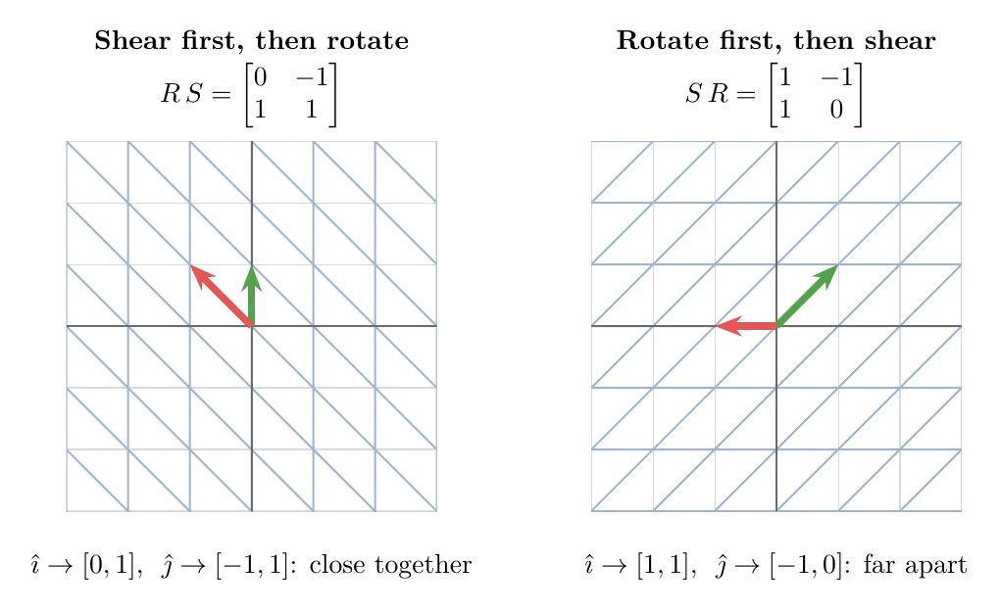

<!-- where-this-fits: generated by course_map/build_map.py; edit concepts.yaml, not this block -->
> **Where this fits:** Pipeline map step 0 (Foundations). See the [Course map](../01-course-map/note.md).
>
> 
>
> - **Builds on:** Dot product ([Note 362](../362-dot-product-and-cosine-similarity/note.md)); Linear transformations and matrices ([Note 500](../500-linear-transformations-and-matrices/note.md)).
> - **Leads to:** Jacobian and matrix gradients ([Note 602](../602-jacobian-and-matrix-gradients/note.md)); Neural networks ([Note 1002](../1002-what-is-deep-learning/note.md)); Forward propagation ([Note 1010](../1010-forward-propagation/note.md)).
<!-- /where-this-fits -->

## 1. Overview

> **Key point:** Multiplying two matrices gives the matrix of "apply one transformation, then the other"; we read the product from right to left.


Figure 1 applies two transformations one after the other: a rotation by 90°, then a shear. From start to finish, the plane has undergone a third linear transformation, with a matrix of its own. That matrix is the product of the shear matrix and the rotation matrix.

This Note builds on the [linear transformations and matrices Note](../500-linear-transformations-and-matrices/note.md): the columns of a matrix are where $\hat{\imath}$ and $\hat{\jmath}$ land, and $A\mathbf{x}$ is the linear combination of those columns.

## 2. Composition: one transformation after another

> **Key point:** Applying one linear transformation and then another is again a linear transformation, called their composition; following $\hat{\imath}$ and $\hat{\jmath}$ gives its matrix.

We often want to apply one transformation and then another. The overall effect is again a linear transformation (grid lines are still parallel and evenly spaced, and the origin has not moved). It is called the **composition** of the two transformations.

Like any linear transformation, it has a matrix, found by following $\hat{\imath}$ and $\hat{\jmath}$ to their final places. In Figure 1:

- **Rotation by 90°** has the matrix $R$ with columns $[0, 1]$ and $[-1, 0]$: it sends $\hat{\imath}$ to $[0, 1]$ and $\hat{\jmath}$ to $[-1, 0]$.
- **The shear** has the matrix $S$ with columns $[1, 0]$ and $[1, 1]$: it keeps $[1, 0]$ fixed and sends $[0, 1]$ to $[1, 1]$.
- **After both**, $\hat{\imath}$ has ended at $[1, 1]$ and $\hat{\jmath}$ at $[-1, 0]$.

So the composition has the matrix with those two columns:

$$\begin{bmatrix} 1 & 1 \\ 0 & 1 \end{bmatrix} \begin{bmatrix} 0 & -1 \\ 1 & 0 \end{bmatrix} = \begin{bmatrix} 1 & -1 \\ 1 & 0 \end{bmatrix}$$

This one matrix does in a single step what the rotation and the shear do in two.

## 3. Why the product is written right to left

> **Key point:** In $S R \mathbf{x}$, the matrix next to the vector acts first: $R$ is applied first, then $S$.

Applying the rotation and then the shear to a vector $\mathbf{x}$ the long way means two multiplications: first $R\mathbf{x}$, then $S$ times that result, $S(R\mathbf{x})$. The composition matrix must give the same answer for every $\mathbf{x}$, since it describes the same overall movement. So it is natural to call it the **product** $SR$:

$$S(R\mathbf{x}) = (SR)\,\mathbf{x}$$

Note the order. The transformation on the right ($R$) happens first and the one on the left ($S$) second. This comes from function notation: in $f(g(x))$, $g$ acts first. A matrix product is read from right to left.

## 4. Computing a product column by column

> **Key point:** The first column of $M_2 M_1$ is $M_2$ times the first column of $M_1$; the second column is $M_2$ times the second column of $M_1$.

We can find the product without watching any animation, from the numbers alone. Take

$$M_1 = \begin{bmatrix} 1 & -2 \\ 1 & 0 \end{bmatrix}, \qquad M_2 = \begin{bmatrix} 0 & 2 \\ 1 & 0 \end{bmatrix}$$

and apply $M_1$ first, then $M_2$.

1. **In words:** after $M_1$, $\hat{\imath}$ sits at the first column of $M_1$. Applying $M_2$ to that column gives where $\hat{\imath}$ finally lands: the first column of the product. Do the same with the second column for $\hat{\jmath}$.
2. **Formula:**
   $$M_2 M_1 = \Big[\; M_2 \cdot (\text{column 1 of } M_1) \;\Big|\; M_2 \cdot (\text{column 2 of } M_1) \;\Big]$$
3. **Example:**
   - $\hat{\imath}$ first lands on $[1, 1]$. Then $M_2 [1, 1] = 1 \cdot [0, 1] + 1 \cdot [2, 0] = [2, 1]$.
   - $\hat{\jmath}$ first lands on $[-2, 0]$. Then $M_2 [-2, 0] = -2 \cdot [0, 1] + 0 \cdot [2, 0] = [0, -2]$.
   $$M_2 M_1 = \begin{bmatrix} 0 & 2 \\ 1 & 0 \end{bmatrix} \begin{bmatrix} 1 & -2 \\ 1 & 0 \end{bmatrix} = \begin{bmatrix} 2 & 0 \\ 1 & -2 \end{bmatrix}$$

The same reasoning with letters gives the general rule. Take

$$M_1 = \begin{bmatrix} e & f \\ g & h \end{bmatrix}, \qquad M_2 = \begin{bmatrix} a & b \\ c & d \end{bmatrix}$$

The first column of the product is $e\,[a, c] + g\,[b, d]$ and the second is $f\,[a, c] + h\,[b, d]$:

$$\begin{bmatrix} a & b \\ c & d \end{bmatrix} \begin{bmatrix} e & f \\ g & h \end{bmatrix} = \begin{bmatrix} ae + bg & af + bh \\ ce + dg & cf + dh \end{bmatrix}$$

> **Extra:** The same formula read entry by entry is the school rule "row times column". The entry in row $i$, column $j$ of $AB$ is the dot product of row $i$ of $A$ with column $j$ of $B$. In the example, row 1 of $M_2$ is $[0, 2]$ and column 1 of $M_1$ is $[1, 1]$, and $0 \times 1 + 2 \times 1 = 2$, the top-left entry. This is why the [dot product and cosine similarity Note](../362-dot-product-and-cosine-similarity/note.md) calls the dot product the building block of matrix multiplication.

> **Python:** `@` multiplies two matrices.
>
> ```python
> import numpy as np
>
> M1 = np.array([[1, -2], [1, 0]])
> M2 = np.array([[0, 2], [1, 0]])
> M2 @ M1          # [[2, 0], [1, -2]]
> x = np.array([1, 1])
> M2 @ (M1 @ x)    # [2, -1]: two steps
> (M2 @ M1) @ x    # [2, -1]: one step
> ```

## 5. Order matters

> **Key point:** In general $AB \neq BA$: shearing then rotating is a different transformation from rotating then shearing.

Does the order of the two matrices matter? Thinking in transformations, we can answer by picturing them (Figure 2).

{height=40%}

- **Shear first, then rotate** ($RS$): $\hat{\imath}$ ends at $[0, 1]$ and $\hat{\jmath}$ at $[-1, 1]$. The two vectors point close together.
- **Rotate first, then shear** ($SR$): $\hat{\imath}$ ends at $[1, 1]$ and $\hat{\jmath}$ at $[-1, 0]$. They point far apart.

The overall effects differ, so $RS \neq SR$:

$$RS = \begin{bmatrix} 0 & -1 \\ 1 & 1 \end{bmatrix} \neq \begin{bmatrix} 1 & -1 \\ 1 & 0 \end{bmatrix} = SR$$

Matrix multiplication is **not commutative**, unlike the multiplication of numbers. In code this means `A @ B` and `B @ A` are, in general, different matrices.

## 6. Grouping does not matter

> **Key point:** $(AB)C = A(BC)$, because both mean "apply $C$, then $B$, then $A$".

For three matrices $A$, $B$ and $C$, we can first compute $AB$ and multiply the result by $C$, or first compute $BC$ and put $A$ in front. Both give the same matrix:

$$(AB)\,C = A\,(BC)$$

This property is called **associativity**. Proving it by expanding all the entries is long and tells us nothing. Seen as transformations it is immediate: both sides mean "apply $C$, then $B$, then $A$", the same three steps in the same order. Only the bookkeeping differs.

> **Python:** A quick check with the three matrices of this Note.
>
> ```python
> R = np.array([[0, -1], [1, 0]])
> S = np.array([[1, 1], [0, 1]])
> np.array_equal((S @ R) @ M1, S @ (R @ M1))   # True
> np.array_equal(S @ R, R @ S)                 # False
> ```

## 7. Where ML multiplies matrices

> **Key point:** A product needs matching inner sizes; stacked linear layers collapse into one matrix, which is why neural networks need activation functions between them.

### 7.1 The shape rule

> **Key point:** An $m \times n$ matrix times an $n \times p$ matrix gives an $m \times p$ matrix; the inner sizes must match.

So far all matrices were $2 \times 2$. In ML the matrices are rectangular, and the column-by-column view explains the shape rule. In $AB$, each column of $B$ is a vector that $A$ transforms, so each column of $B$ must have as many entries as $A$ has columns.

1. **In words:** the number of columns of the left matrix must equal the number of rows of the right matrix; the result takes the rows of the left and the columns of the right.
2. **Formula:**
   $$(m \times n)\,(n \times p) = (m \times p)$$
3. **Example:** the data matrix $X$ with 3 points and 2 features times $A^{\mathsf T}$ in the [linear transformations and matrices Note](../500-linear-transformations-and-matrices/note.md) (section 7.1) is $(3 \times 2)(2 \times 2) = 3 \times 2$: three transformed points. PCA's $XW^{\mathsf T}$ with 40 points, 3 features and 2 components is $(40 \times 3)(3 \times 2) = 40 \times 2$ (see the [PCA step by step Note](../48-pca-step-by-step/note.md), section 5.1).

The dot product $a^{\mathsf T}b$, $(1 \times n)(n \times 1) = 1 \times 1$, is the smallest case of this rule.

### 7.2 Linear layers collapse into one

> **Key point:** Two layers without an activation, $W_2(W_1\mathbf{x})$, are the single layer $(W_2W_1)\mathbf{x}$: stacking them adds no power.

A neural network applies layer after layer. Suppose two layers had no activation function between them, only the matrices $W_1$ and then $W_2$. By Section 3, the two steps are one transformation:

$$W_2(W_1\mathbf{x}) = (W_2W_1)\,\mathbf{x}$$

With the numbers of Section 4, $W_1 = M_1$ and $W_2 = M_2$: the input $[1, 1]$ goes to $M_1[1, 1] = [-1, 1]$ and then to $M_2[-1, 1] = [2, -1]$. The single matrix $M_2M_1$ sends $[1, 1]$ straight to $[2, -1]$. However many linear layers we stack, the result is still one matrix, one linear transformation.

This is why every layer of a network ends with a non-linear activation such as the [sigmoid](../72-sigmoid-function/note.md). The activation bends the space between layers, so the composition can no longer be squeezed into a single matrix. The classic example is XOR: no linear model can fit it, while a network with one hidden layer and a non-linear activation can (Goodfellow et al. §6.1).

> **Extra:** The same collapse shows in linear regression with engineered features. If every new feature is a linear combination of the old ones, the model can learn nothing new: the combined effect is still a linear combination of the original columns. Polynomial features (see the [polynomial regression Note](../61-polynomial-regression/note.md)) help precisely because squaring is not linear.

## 8. Summary

| Idea | What it says | Example |
|---|---|---|
| Composition | one transformation after another | rotate, then shear |
| Product $BA$ | matrix of "apply $A$, then $B$" | $SR = \begin{bmatrix} 1 & -1 \\ 1 & 0 \end{bmatrix}$ |
| Column by column | column $j$ of $BA$ is $B$ times column $j$ of $A$ | $M_2[1, 1] = [2, 1]$ |
| Not commutative | $AB \neq BA$ in general | $RS \neq SR$ |
| Associative | $(AB)C = A(BC)$ | same three steps, same order |
| Shape rule | $(m \times n)(n \times p) = m \times p$ | $(40 \times 3)(3 \times 2) = 40 \times 2$ |

- A matrix product is a composition of transformations, read from right to left.
- Follow $\hat{\imath}$ and $\hat{\jmath}$ through both steps to get the columns of the product.
- Order matters; grouping does not.
- Stacked linear layers collapse into one matrix; activation functions prevent that.

## Sources

- Goodfellow, I., Bengio, Y. and Courville, A. (2016). *Deep Learning*. MIT Press. Section 6.1, learning XOR.

## 9. Key terms

| Term | Meaning |
|---|---|
| Composition | Applying one transformation and then another, seen as one overall transformation |
| Matrix product | The matrix $BA$ of the composition "apply $A$, then $B$" |
| Not commutative | The order of the factors matters: $AB \neq BA$ in general |
| Associativity | $(AB)C = A(BC)$: the grouping of a product does not matter |
| Shape rule | $(m \times n)(n \times p) = m \times p$; the inner sizes must match |
